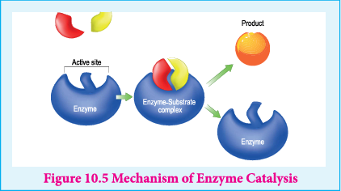
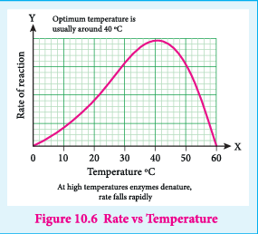
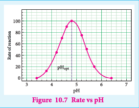

### 10.3 Enzyme Catalysis

Enzymes are complex protein molecules with three dimensional structures. They catalyse the chemical reaction in living organism. They are often present in colloidal state and extremely specific in catalytic action. Each enzyme produced in a particular living cell can catalyse a particular reaction in the cell.

**Some common examples for enzyme catalysis**

1) The peptide glycyl L-glutamyl L-tyrosin is hydrolysed by an enzyme called pepsin.

2) The enzyme diastase hydrolyses starch into maltose

$$
2(C_6H_{10}O_5)_n + nH_2O \rightarrow nC_{12}H_{22}O_{11}
$$

3) The yeast contains the enzyme zymase which converts glucose into ethanol.

$$
C_6H_{12}O_6 \rightarrow 2C_2H_5OH + 2CO_2
$$

4) The enzyme micoderma aceti oxidises alcohol into acetic acid.

$$
C_2H_5OH + O_2 \rightarrow CH_3COOH + H_2O
$$

5) The enzyme urease present in soya beans hydrolyses the urea.

$$
NH_2 - CO - NH_2 + H_2O \rightarrow 2NH_3 + CO_2
$$

#### 10.3.1 Mechanism of enzyme catalysed reaction

The following mechanism is proposed for the enzyme catalysis

$$
E + S \rightleftharpoons ES \rightarrow P + E
$$

Where E is the enzyme, S the substrate (reactant), ES represents activated complex and P the products.

**Enzyme catalysed reaction show certain general special characteristics.**

(i) Effective and efficient conversion is the special characteristic of enzyme catalysed reactions. An enzyme may transform a million molecules of reactant into product in a minute. For eg. \(2H_2O_2 \rightarrow 2H_2O + O_2\)

For this reaction, the activation energy is 18k cal/mole without a catalyst.

With colloidal platinum as a catalyst the activation energy is 11.7 kcal/mole

But with the enzyme catalyst the activation energy of this reaction is less than 2 kcal/mole.

(ii) Enzyme catalysis is highly specific in nature.

$$
H_2N - CO - NH_2 + H_2O \rightarrow 2NH_3 + CO_2
$$

The enzyme urease which catalyses the reaction of urea does not catalyse the following reaction of methyl urea

$$
H_2N - CO - NH - CH_3 + H_2O \rightarrow \text{No reaction}
$$

(3) Enzyme catalyzed reaction has maximum rate at optimum temperature. At first rate of reaction increases with the increase of temperature, but above a particular temperature the activity of enzyme is destroyed. The rate may even drop to zero. The temperature at which enzymic activity is high or maximum is called as optimum temperature.

**For example:**

Enzymes involved in human body have an optimum temperature \(37^{\circ}C / 98^{\circ}F\).

During high fever, as body temperature rises the enzymatic activity may collapse and lead to danger.

(4) The rate of enzyme catalysed reactions varies with the pH of the system. The rate is maximum at a pH called optimum pH.

(5) Enzymes can be inhibited i.e. poisoned.

Activity of an enzyme is decreased and destroyed by a poison.

The physiological action of drugs is related to their inhibiting action.

Example: Sulpha drugs. Penicillin inhibits the action of bacteria and used for curing diseases like pneumonia, dysentery, cholera and other infectious diseases.

(6) Catalytic activity of enzymes is increased by coenzymes or activators.

A small non protein (vitamin) called a coenzyme promotes the catalytic activity of enzyme.
