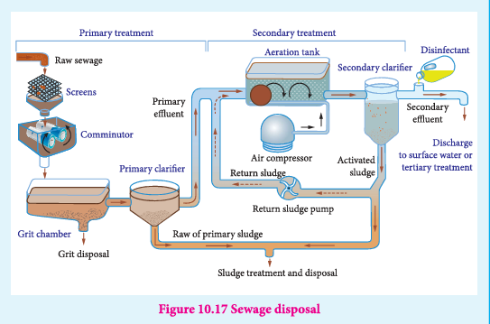
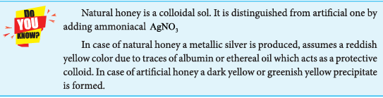

### 10.7 Various application of colloids

In every path of life, colloids play a great role. Human body contains the numerous colloidal solutions. The blood in our body, protoplasma of plant and animal cell, and fats in our intestines are in the form of emulsions. Synthetic polymers like polystyrene silicons and PVC are colloids.

**Food**

Food stuffs like milk cream, butter, etc are present in colloidal form.

**Medicines**

Antibodies such as penicillin and streptomycin are produced in colloidal form for suitable injections. Colloidal gold and colloidal calcium are used as tonics. Milk of magnesia is used for stomach troubles. Silver sol protected by gelatine known as Argyrol is used as eye lotion.

**In Industry**

Colloids find many applications in industries.

**(i) Water purification:**

Purification of drinking water is activated by coagulation of suspended impurities in water using alums containing \(Al^{3+}\)

**(ii) In washing:**

The cleansing action of soap is due to the formation of emulsion of soap molecules with dirt and grease.

**(iii) Tanning of leather**

Skin and hides are protein containing positively charged particles which are coagulated by adding tannin to give hardened leather for further application. Chromium salts are used for the purpose. Chrome tanning can produce soft and polishable leather.

**(iv) Rubber industry:**

Latex is the emulsion of natural rubber with negative particles. By heating rubber with sulphur, vulcanized rubbers are produced for tyres, tubes, etc.

**(v) Sewage disposal**

Sewage contains dirt, mud and wastes dispersed in water. The passage of electric current deposits the wastes materials which can be used as a manure.

**(vi) Cortrell's precipitator**

Carbon dust in air is solidified by cortrell's precipitator. In it, a high potential difference of about 50,000V is used. The charge on carbon is neutralized and solidified. Thus the air is free from carbon particles.

(vii) The blue colour of the sky in nature is due to Tyndall effect of air particles.

(viii) **Formation of delta:**

The electrolyte in sea and river water coagulates the solid particles in river water at their intersection. So, the earth becomes a fertile land.

(ix) **Analytical application**

Qualitative and quantitative analysis are based on the various properties of colloids.

Hence we can conclude that in our life, there is hardly any field which is not including the applications of colloids.

