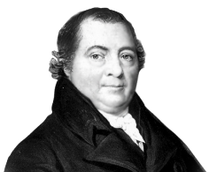

# 4. TRANSITION AND INNER TRANSITION ELEMENTS

**Martin Heinrich Klaproth, (1743- 1817)**

Martin Heinrich Klaproth, German chemist who discovered uranium, zirconium and cerium . He described them as distinct elements, though he did not obtain them in the pure metallic state. He verified the discoveries of titanium, tellurium, and strontium, His role is the most significant in systematizing analytical chemistry and mineralogy.

## INTRODUCTION

Generally the metallic elements that have incompletely filled d or f sub shell in the neutral or cationic state are called transition metals. This definition includes lanthanoides and actinides. However, IUPAC defines transition metal as an element whose atom has an incomplete d sub shell or which can give rise to cations with an incomplete d sub shell. They occupy the central position of the periodic table, between s and p block elements, and their properties are transitional between highly reactive metals of s block and elements of p block which are mostly non metals. Except group- 11 elements all transition metals are hard and have very high melting point.

Transition metals, iron and copper play an important role in the development of human civilization. Many other transition elements also have important applications such as tungsten in light bulb filaments, titanium in manufacturing artificial joints, molybdenum in boiler plants, platinum in catalysis etc. They also play vital role in living system, for example iron in hemoglobin, cobalt in vitamin \(B_{12}\) etc.,

In this unit we study the general trend in properties of d block elements with specific reference to 3d series, their characteristics, chemical reactivity, some important compounds \(KMnO_4\) and \(K_2Cr_2O_7\), we also discuss the f- block elements later in this unit.
