# 4. TRANSITION AND INNER TRANSITION ELEMENTS

Martin Heinrich Klaproth, (1743- 1817)

Martin Heinrich Klaproth, German chemist who discovered uranium, zirconium and cerium . He described them as distinct elements, though he did not obtain them in the pure metallic state. He verified the discoveries of titanium, tellurium, and strontium, His role is the most significant in systematizing analytical chemistry and mineralogy.

## INTRODUCTION

Generally the metallic elements that have incompletely filled d or f sub shell in the neutral or cationic state are called transition metals. This definition includes lanthanoides and actinides. However, IUPAC defines transition metal as an element whose atom has an incomplete d sub shell or which can give rise to cations with an incomplete d sub shell. They occupy the central position of the periodic table, between s and p block elements, and their properties are transitional between highly reactive metals of s block and elements of p block which are mostly non metals. Except group- 11 elements all transition metals are hard and have very high melting point.

Transition metals, iron and copper play an important role in the development of human civilization. Many other transition elements also have important applications such as tungsten in light bulb filaments, titanium in manufacturing artificial joints, molybdenum in boiler plants, platinum in catalysis etc. They also play vital role in living system, for example iron in hemoglobin, cobalt in vitamin \(B_{12}\) etc.,

In this unit we study the general trend in properties of d block elements with specific reference to 3d series, their characteristics, chemical reactivity, some important compounds \(KMnO_4\) and \(K_2Cr_2O_7\), we also discuss the f- block elements later in this unit.

### 4.1 Position of d-block elements in the periodic table:

We have already learnt the periodic classification of elements in XI std. the transition metals occupy from group - 3 to group- 12 of the modern periodic table.

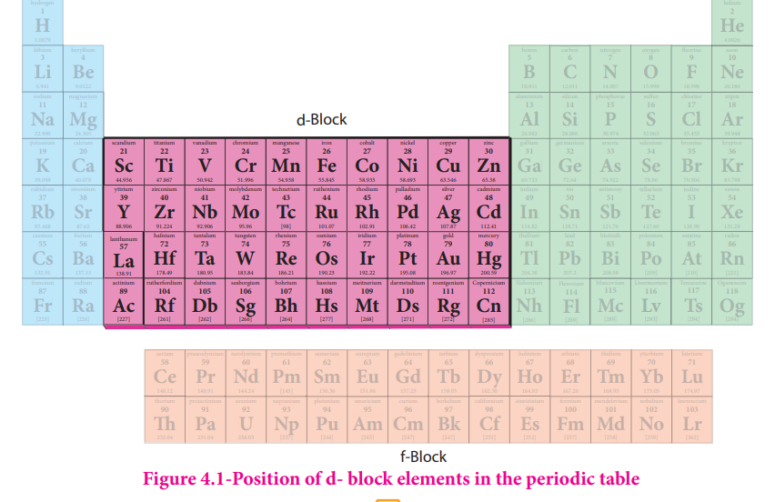

**Figure 4.1-Position of d-block elements in the periodic table**

d- Block elements composed of 3d series (4th period) Scandium to Zinc (10 elements), 4d series (5th period) Yttrium to Cadmium (10 elements) and 5d series (6th period) Lanthanum, Hafnium to mercury. As we know that the group- 12 elements Zinc, Cadmium and Mercury do not have partially filled d- orbital either in their elemental state or in their normal oxidation states. However they are treated as transition elements, because their properties are an extension of the properties of the respective transition elements. As per the IUPAC definition, the seventh period elements, starting from Ac, Rf to Cn also belong to transition metals. All of them are radioactive. Except Actinium; all the remaining elements are synthetically prepared and have very low half life periods.

### 4.2 Electronic configuration:

We have already learnt in XI STD to write the electronic configuration of the elements using Aufbau principle, Hund's rule etc. According to Aufbau principle, the electron first fills the 4s orbital before 3d orbital. Therefore filling of 3d orbital starts from Sc, its electronic configuration is \([Ar]3d^{1}4s^{2}\) and the electrons of successive elements are progressively filled in 3d orbital and the filling of 3d orbital is complete in Zinc, whose electronic configuration is \([Ar]3d^{10}4s^{2}\). However, there are two exceptions in the above mentioned progressive filling of 3d orbitals; if there is a chance of acquiring half filled or fully filled 3d sub shell, it is given priority as they are the stable configuration, for example \(Cr\) and \(Cu\).

The electronic configurations of \(Cr\) and \(Cu\) are \([Ar]3d^{5}4s^{1}\) and \([Ar]3d^{10}4s^{1}\) respectively. The extra stability of half filled and fully filled d orbitals, as already explained in XI STD, is due to symmetrical distribution of electrons and exchange energy.

Note: The extra stability due to symmetrical distribution can also be visualized as follows. When the d orbitals are considered together, they will constitute a sphere. So the half filled and fully filled configuration leads to complete symmetrical distribution of electron density. On the other hand, an unsymmetrical distribution of electron density as in the case of partially filled configuration will result in building up of a potential difference. To decrease this and to achieve a tension free state with lower energy, a symmetrical distribution is preferred.

With these two exceptions and minor variation in certain individual cases, the general electronic configuration of d- block elements can be written as [Noble gas] \((n - 1)d^{1 - 10}ns^{1 - 2}\) Here, \(n = 4\) to 7. In periods 6 and 7, (except La and Ac) the configuration includes \(((n - 2)f\) orbital; [Noble gas] \((n - 2)f^{14}(n - 1)d^{1 - 10}ns^{1 - 2}\).

### 4.3 General trend in properties:

#### 4.3.1 Metallic behaviour:

All the transition elements are metals. Similar to all metals the transition metals are good conductors of heat and electricity. Unlike the metals of Group- 1 and group- 2, all the transition metals except group 11 elements are hard. Of all the known elements, silver has the highest electrical conductivity at room temperature.

Most of the transition elements are hexagonal close packed, cubic close packed or body centered cubic which are the characteristics of true metals.

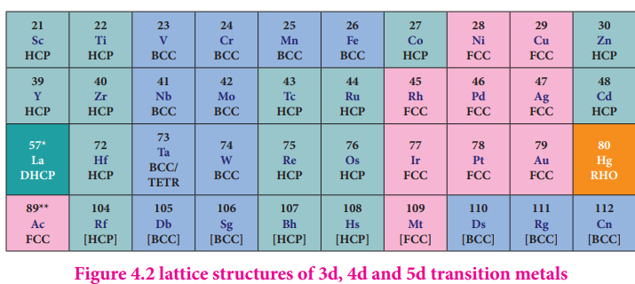

**Figure 4.2 lattice structures of 3d, 4d and 5d transition metals**

As we move from left to right along the transition metal series, melting point first increases as the number of unpaired d electrons available for metallic bonding increases, reach a maximum value and then decreases, as the d electrons pair up and become less available for bonding.

For example, in the first series the melting point increases from Scandium (m.pt 1814K) to a maximum of 2183 K for vanadium, which is close to 2180K for chromium. However, manganese in 3d series and Tc in 4d series have low melting point. The maximum melting point at about the middle of transition metal series indicates that \(d^5\) configuration is favorable for strong interatomic attraction. The following figure shows the trends in melting points of transition elements.

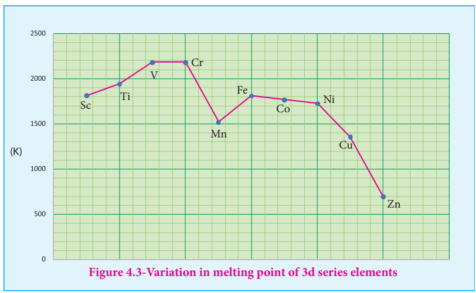

**Figure 4.3-Variation in melting point of 3d series elements**

#### 4.3.2 Variation of atomic and ionic size:

It is generally expected a steady decrease in atomic radius along a period as the nuclear charge increases and the extra electrons are added to the same sub shell. But for the 3d transition elements, the expected decrease in atomic radius is observed from Sc to V, thereafter up to Cu the atomic radius nearly remains the same. As we move from Sc to Zn in 3d series the extra electrons are added to the 3d orbitals, the added 3d electrons only partially shield the increased nuclear charge and hence the effective nuclear charge increases slightly. However, the extra electrons added to the 3d sub shell strongly repel the 4s electrons and these two forces are operated in opposite direction and as they tend to balance each other, it leads to constancy in atomic radii.

At the end of the series, d - orbitals of Zinc contain 10 electrons in which the repulsive interaction between the electrons is more than the effective nuclear charge and hence, the orbitals slightly expand and atomic radius slightly increases.

Generally as we move down a group atomic radius increases, the same trend is expected in d block elements also. As the electrons are added to the 4d sub shell, the atomic radii of the 4d elements are higher than the corresponding elements of the 3d series. However there is an unexpected observation in the atomic radius of 5d elements which have nearly same atomic radius as that of corresponding 4d elements. This is due to lanthanide contraction which is to be discussed later in this unit under inner transition elements.

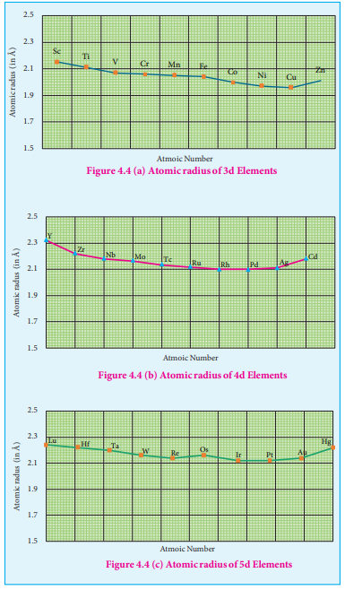

#### 4.3.3 Ionization enthalpy:

Ionization energy of transition element is intermediate between those of s and p block elements. As we move from left to right in a transition metal series, the ionization enthalpy increases as expected. This is due to increase in nuclear charge corresponding to the filling of d electrons. The following figure show the trends in ionisation enthalpy of transition elements.

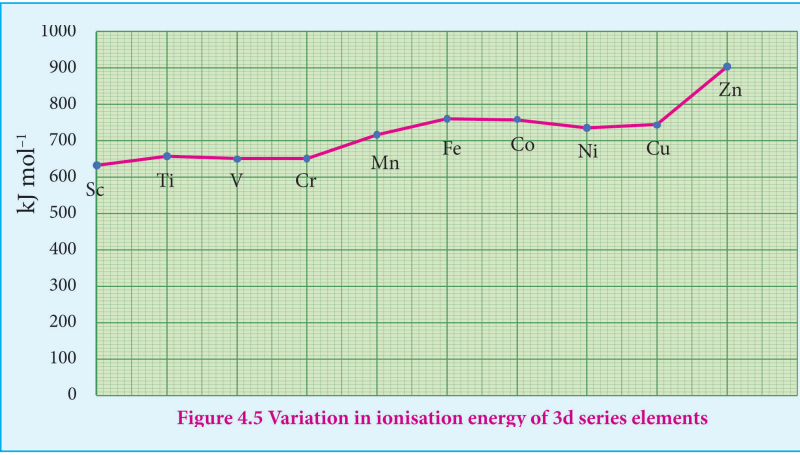

**Figure 4.5 Variation in ionisation energy of 3d series elements**

The increase in first ionisation enthalpy with increase in atomic number along a particular series is not regular. The added electron enters (n- 1)d orbital and the inner electrons act as a shield and decrease the effect of nuclear charge on valence ns electrons. Therefore, it leads to variation in the ionization energy values.

The ionisation enthalpy values can be used to predict the thermodynamic stability of their compounds. Let us compare the ionisation energy required to form \(Ni^{2+}\) and \(Pt^{2+}\) ions.

$$
\text{Nickel}, IE_1 + IE_2 = (737 + 1753) = 2490 \ \mathrm{kJ \ mol}^{-1}
$$

$$
\text{Platinum}, IE_1 + IE_2 = (864 + 1791) = 2655 \ \mathrm{kJ \ mol}^{-1}
$$

Since, the energy required to form \(Ni^{2+}\) is less than that of \(Pt^{2+}\), Ni(II) compounds are thermodynamically more stable than Pt(II) compounds.

#### 4.3.4 Oxidation state:

The first transition metal Scandium exhibits only \(+3\) oxidation state, but all other transition elements exhibit variable oxidation states by losing electrons from (n- 1)d orbital and ns orbital as the energy difference between them is very small. Let us consider the 3d series; the following table summarizes the oxidation states of the 3d series elements.

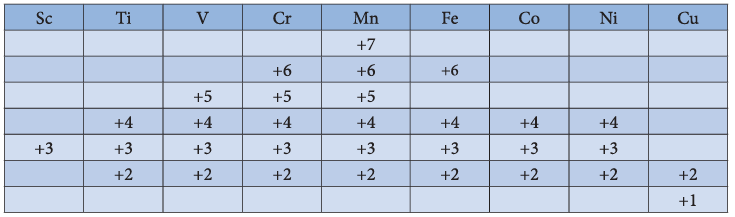

At the beginning of the series, \(+3\) oxidation state is stable but towards the end \(+2\) oxidation state becomes stable.

The number of oxidation states increases with the number of electrons available, and it decreases as the number of paired electrons increases. Hence, the first and last elements show less number of oxidation states and the middle elements with more number of oxidation states. For example, the first element Sc has only one oxidation state \(+3\); the middle element Mn has six different oxidation states from \(+2\) to \(+7\). The last element Cu shows \(+1\) and \(+2\) oxidation states only.

The relative stability of different oxidation states of 3d metals is correlated with the extra stability of half filled and fully filled electronic configurations. Example: \(Mn^{2+}(3d^{5})\) is more stable than \(Mn^{4+}(3d^{3})\)

The oxidation states of 4d and 5d metals vary from \(+3\) for Y and La to \(+8\) for Ru and Os. The highest oxidation state of 4d and 5d elements are found in their compounds with the higher electronegative elements like O, F and Cl. for example: \(RuO_4\), \(OsO_4\) and \(WCl_6\). Generally in going down a group, a stability of the higher oxidation state increases while that of lower oxidation state decreases. It is evident from the Frost diagram \((\Delta G^{0} \ vs\) oxidation number) as shown below, For titanium, vanadium and chromium, the most thermodynamically stable oxidation state is \(+3\). For iron, the stabilities of \(+3\) and \(+2\) oxidation states are similar. Copper is unique in 3d series having a stable \(+1\) oxidation state. It is prone to disproportionate to the \(+2\) and 0 oxidation states.

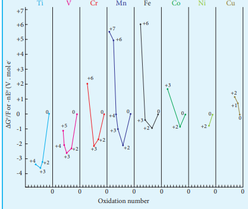

**Figure 4.6 Frost diagram**

## Evaluate yourself:

Why iron is more stable in \(+3\) oxidation state than in \(+2\) and the reverse is true for Manganese?

#### 4.3.5 Standard electrode potentials of transition metals

Redox reactions involve transfer of electrons from one reactant to another. Such reactions are always coupled, which means that when one substance is oxidised, another must be reduced. The substance which is oxidised is a reducing agent and the one which is reduced is an oxidizing agent. The oxidizing and reducing power of an element is measured in terms of the standard electrode potentials.

Standard electrode potential is the value of the standard emf of a cell in which molecular hydrogen under standard pressure (1atm) and temperature \((273 \mathrm{K})\) is oxidised to solvated protons at the electrode.

If the standard electrode potential \((E^0)\), of a metal is large and negative, the metal is a powerful reducing agent, because it loses electrons easily. Standard electrode potentials (reduction potential) of few first transition metals are given in the following table.

| Reaction | Standard reduction potential (V) |
|---|---|
| \(Ti^{2+} + 2e^- \rightarrow Ti\) | \(-1.63\) |
| \(V^{2+} + 2e^- \rightarrow V\) | \(-1.19\) |
| \(Cr^{2+} + 2e^- \rightarrow Cr\) | \(-0.91\) |
| \(Mn^{2+} + 2e^- \rightarrow Mn\) | \(-1.18\) |
| \(Fe^{2+} + 2e^- \rightarrow Fe\) | \(-0.44\) |
| \(Co^{2+} + 2e^- \rightarrow Co\) | \(-0.28\) |
| \(Ni^{2+} + 2e^- \rightarrow Ni\) | \(-0.23\) |
| \(Cu^{2+} + 2e^- \rightarrow Cu\) | \(+0.34\) |
| \(Zn^{2+} + 2e^- \rightarrow Zn\) | \(-0.76\) |

In 3d series as we move from Ti to Zn, the standard reduction potential \((E_{M^{2+}/M}^{0})\) value is approaching towards less negative value and copper has a positive reduction potential. i.e., elemental copper is more stable than \(Cu^{2+}\). There are two deviations., Fig shows that \((E_{M^{2+}/M}^{0})\) value for manganese and zinc are more negative than the regular trend. It is due to extra stability which arises due to the half filled \(d^{5}\) configuration in \(Mn^{2+}\) and completely filled \(d^{10}\) configuration in \(Zn^{2+}\).

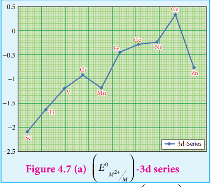

**Figure 4.7 (a) \((E_{M^{3+}/M^{2+}}^{0})\) -3d series**

Transition metals in their high oxidation states tend to be oxidizing . For example, \(Fe^{3+}\) is moderately a strong oxidant, and it oxidises copper to \(Cu^{2+}\) ions. The feasibility of the reaction is predicted from the following standard electrode potential values.

$$
Fe^{3+}(aq) + e^- \rightleftharpoons Fe^{2+} \quad E^{0} = 0.77 \ \mathrm{V}
$$

$$
Cu^{2+}(aq) + 2e^- \rightleftharpoons Cu(s) \quad E^{0} = +0.34 \ \mathrm{V}
$$

The standard electrode potential for the \(M^{3+} / M^{2+}\) half- cell gives the relative stability between \(M^{3+}\) and \(M^{2+}\). The reduction potential values are tabulated as below.

| Reaction | Standard reduction potential (V) |
|---|---|
| \(Ti^{3+} + e^- \rightarrow Ti^{2+}\) | \(-0.37\) |
| \(V^{3+} + e^- \rightarrow V^{2+}\) | \(-0.26\) |
| \(Cr^{3+} + e^- \rightarrow Cr^{2+}\) | \(-0.41\) |
| \(Mn^{3+} + e^- \rightarrow Mn^{2+}\) | \(+1.51\) |
| \(Fe^{3+} + e^- \rightarrow Fe^{2+}\) | \(+0.77\) |
| \(Co^{3+} + e^- \rightarrow Co^{2+}\) | \(+1.81\) |

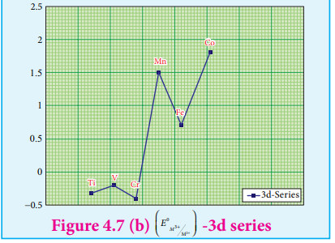

**Figure 4.7 (b) \((E_{M^{3+}/M^{2+}}^{0})\) -3d series**

The negative values for titanium, vanadium and chromium indicate that the higher oxidation state is preferred. If we want to reduce such a stable \(Cr^{3+}\) ion, strong reducing agent which has high negative value for reduction potential like metallic zinc \((E^{0} = -0.76 \ \mathrm{V})\) is required.

The high reduction potential of \(Mn^{3+} / Mn^{2+}\) indicates \(Mn^{2+}\) is more stable than \(Mn^{3+}\). For \(Fe^{3+} / Fe^{2+}\) the reduction potential is 0.77V, and this low value indicates that both \(Fe^{3+}\) and \(Fe^{2+}\) can exist under normal conditions. The drop from \(Mn\) to \(Fe\) is due to the electronic structure of the ions concerned. \(Mn^{3+}\) has a \(3d^{4}\) configuration while that of \(Mn^{2+}\) is \(3d^{5}\). The extra stability associated with a half filled d sub shell makes the reduction of \(Mn^{3+}\) very feasible \((E^{0} = +1.51 \ \mathrm{V})\).

#### 4.3.6 Magnetic properties

Most of the compounds of transition elements are paramagnetic. Magnetic properties are related to the electronic configuration of atoms. We have already learnt in XI STD that the electron is spinning around its own axis, in addition to its orbital motion around the nucleus. Due to these motions, a tiny magnetic field is generated and it is measured in terms of magnetic moment. On the basis of magnetic properties, materials can be broadly classified as (i) paramagnetic materials (ii) diamagnetic materials, besides these there are ferromagnetic and antiferromagnetic materials.

Materials with no elementary magnetic dipoles are diamagnetic, in other words a species with all paired electrons exhibits diamagnetism. This kind of materials are repelled by the magnetic field because the presence of external magnetic field, a magnetic induction is introduced to the material which generates weak magnetic field that oppose the applied field.

Paramagnetic solids having unpaired electrons possess magnetic dipoles which are isolated from one another. In the absence of external magnetic field, the dipoles are arranged at random and hence the solid shows no net magnetism. But in the presence of magnetic field, the dipoles are aligned parallel to the direction of the applied field and therefore, they are attracted by an external magnetic field.

Ferromagnetic materials have domain structure and in each domain the magnetic dipoles are arranged. But the spin dipoles of the adjacent domains are randomly oriented. Some transition elements or ions with unpaired d electrons show ferromagnetism.

3d transition metal ions in paramagnetic solids often have a magnetic dipole moments corresponding to the electron spin contribution only. The orbital moment L is said to be quenched. So the magnetic moment of the ion is given by

$$
\mu = g\sqrt{S(S + 1)}\mu_{B}
$$

Where S is the total spin quantum number of the unpaired electrons and is \(\mu_{B}\) Bohr Magneton.

For an ion with n unpaired electrons \(S = \frac{n}{2}\) and for an electron \(g = 2\)

Therefore the spin only magnetic moment is given by

$$
\mu = 2\sqrt{\left(\frac{n}{2}\right)\left(\frac{n}{2} + 1\right)}\mu_{B}
$$

$$
\mu = 2\sqrt{\left(\frac{n(n + 2)}{4}\right)}\mu_{B}
$$

$$
\mu = \sqrt{n(n + 2)}\mu_{B}
$$

The magnetic moment calculated using the above equation is compared with the experimental values in the following table. In most of the cases, the agreement is good.

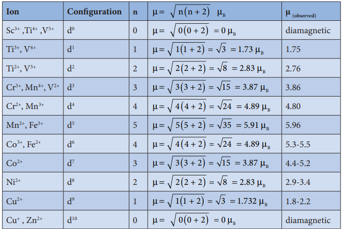

#### 4.3.7 Catalytic properties

The chemical industries manufacture a number of products such as polymers, flavours, drugs etc., Most of the manufacturing processes have adverse effect on the environment so there is an interest for eco friendly alternatives. In this context, catalyst based manufacturing processes are advantageous, as they require low energy, minimize waste production and enhance the conversion of reactants to products.

Many industrial processes use transition metals or their compounds as catalysts. Transition metal has energetically available d orbitals that can accept electrons from reactant molecule or metal can form bond with reactant molecule using its d electrons. For example, in the catalytic hydrogenation of an alkene, the alkene bonds to an active site by using its \(\pi\) electrons with an empty d orbital of the catalyst.

The \(\sigma\) bond in the hydrogen molecule breaks, and each hydrogen atom forms a bond with a d electron on an atom in the catalyst. The two hydrogen atoms then bond with the partially broken \(\pi\)- bond in the alkene to form an alkane.

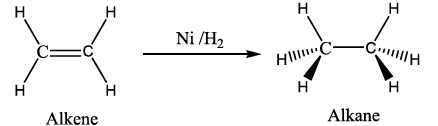

In certain catalytic processes the variable oxidation states of transition metals find applications. For example, in the manufacture of sulphuric acid from \(SO_3\), vanadium pentoxide \((V_2O_5)\) is used as a catalyst to oxidise \(SO_2\). In this reaction \(V_2O_5\) is reduced to vanadium (IV) Oxide \((VO_2)\).

Some more examples are discussed below,

(i) Hydroformylation of olefins

$$
RCH=CH_2 + CO + H_2 \xrightarrow{[Co(CO)_4H]} RCH_2CH_2CHO + RCH(CH_3)CHO
$$

(ii) Preparation acetic acid from acetaldehyde.

$$
CH_3CHO + O_2 \xrightarrow{Mn(OAc)_2} CH_3COOH
$$

(iii) Zeigler - Natta catalyst

A mixture of \(TiCl_4\) and trialkyl aluminium is used for polymerization.

$$
nCH_2=CHR \xrightarrow{TiCl_4 + AlR_3} [CH_2-CHR]_n
$$

#### 4.3.8 Alloy formation

An alloy is formed by blending a metal with one or more other elements. The elements may be metals or non- metals or both. The bulk metal is named as solvent, and the other elements in smaller portions are called solute. According to Hume- Rothery rule to form a substitute alloy the difference between the atomic radii of solvent and solute is less than \(15\%\). Both the solvent and solute must have the same crystal structure and valence and their electro negativity difference must be close to zero. Transition metals satisfying these mentioned conditions form a number of alloys among themselves, since their atomic sizes are similar and one metal atom can be easily replaced by another metal atom from its crystal lattice to form an alloy. The alloys so formed are hard and often have high melting points. Examples: Ferrous alloys, gold - copper alloy, chrome alloys etc.,

#### 4.3.9 Formation of interstitial compounds

An interstitial compound or alloy is a compound that is formed when small atoms like hydrogen, boron, carbon or nitrogen are trapped in the interstitial holes in a metal lattice. They are usually non- stoichiometric compounds. Transition metals form a number of interstitial compounds such as \(TiC\), \(ZrH_{1.92}\), \(Mn_4N\) etc. The elements that occupy the metal lattice provide them new properties.

(i) They are hard and show electrical and thermal conductivity
(ii) They have high melting points higher than those of pure metals

#### 4.3.10 Formation of complexes

Transition elements have a tendency to form coordination compounds with a species that has an ability to donate an electron pair to form a coordinate covalent bond. Transition metal ions are small and highly charged and they have vacant low energy orbitals to accept an electron pair donated by other groups. Due to these properties, transition metals form large number of complexes. Examples: \([Fe(CN)_6]^{4-}\), \([Co(NH_3)_6]^{3+}\), etc.

The chemistry of coordination compound is discussed in unit 5.

### 4.4 Important compound of Transition elements

## Oxides and Oxoanions of Metals

Generally, transition metal oxides are formed by the reaction of transition metals with molecular oxygen at high temperatures. Except the first member of 3d series, Scandium, all other transition elements form ionic metal oxides. The oxidation number of metal in metal oxides ranges from \(+2\) to \(+7\). As the oxidation number of a metal increases, ionic character decreases, for example, \(Mn_2O_7\) is covalent. Mostly higher oxides are acidic in nature, \(Mn_2O_7\) dissolves in water to give permanganic acid \((HMnO_4)\), similarly \(CrO_3\) gives chromic acid \((H_2CrO_4)\) and dichromic acid \((H_2Cr_2O_7)\). Generally lower oxides may be amphoteric or basic, for example, Chromium (III) oxide - \(Cr_2O_3\), is amphoteric and Chromium(II) oxide, \(CrO\) is basic in nature.

## Potassium dichromate \(K_2Cr_2O_7\)

## Preparation:

Potassium dichromate is prepared from chromite ore. The ore is concentrated by gravity separation. It is then mixed with excess sodium carbonate and lime and roasted in a reverberatory furnace.

$$
4FeCr_2O_4 + 8Na_2CO_3 + 7O_2 \xrightarrow{900 - 1000^{\circ}C} 8Na_2CrO_4 + 2Fe_2O_3 + 8CO_2 \uparrow
$$

The roasted mass is treated with water to separate soluble sodium chromate from insoluble iron oxide. The yellow solution of sodium chromate is treated with concentrated sulphuric acid which converts sodium chromate into sodium dichromate.

$$
2Na_2CrO_4 + H_2SO_4 \rightarrow Na_2Cr_2O_7 + Na_2SO_4 + H_2O
$$

The above solution is concentrated to remove less soluble sodium sulphate. The resulting solution is filtered and further concentrated. It is cooled to get the crystals of \(Na_2SO_4 \cdot 2H_2O\).

The saturated solution of sodium dichromate in water is mixed with KCl and then concentrated to get crystals of NaCl. It is filtered while hot and the filtrate is cooled to obtain \(K_2Cr_2O_7\) crystals.

$$
Na_2Cr_2O_7 + 2KCl \longrightarrow K_2Cr_2O_7 + 2NaCl
$$

## Physical properties:

Potassium dichromate is an orange red crystalline solid which melts at \(671 \mathrm{K}\) and it is moderately soluble in cold water, but very much soluble in hot water. On heating it decomposes and forms \(Cr_2O_3\) and molecular oxygen. As it emits toxic chromium fumes upon heating, it is mainly replaced by sodium dichromate.

$$
4K_2Cr_2O_7 \xrightarrow{\Delta} 4K_2CrO_4 + 2Cr_2O_3 + 3O_2 \uparrow
$$

## Structure of dichromate ion:

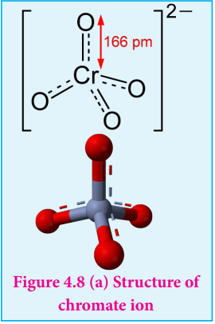

**Figure 4.8 (a) Structure of chromate ion**

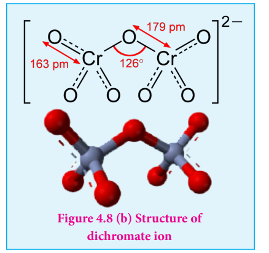

**Figure 4.8 (b) Structure of dichromate ion**

Both chromate and dichromate ion are oxo anions of chromium and they are moderately strong oxidizing agents. In these ions chromium is in \(+6\) oxidation state. In an aqueous solution, chromate and dichromate ions can be interconvertible, and in an alkaline solution chromate ion is predominant, whereas dichromate ion becomes predominant in acidic solutions. Structures of these ions are shown in the figure.

## Chemical properties:

## 1. Oxidation

Potassium dichromate is a powerful oxidising agent in acidic medium. Its oxidising action in the presence of \(H^{+}\) ions is shown below. You can note that the change in the oxidation state of chromium from \(Cr^{6+}\) to \(Cr^{3+}\). Its oxidising action is shown below.

$$
Cr_2O_7^{2-} + 14H^{+} + 6e^{-} \longrightarrow 2Cr^{3+} + 7H_2O
$$

The oxidising nature of potassium dichromate (dichromate ion) is illustrated in the following examples.

(i) It oxidises ferrous salts to ferric salts.

$$
Cr_2O_7^{2-} + 6Fe^{2+} + 14H^{+} \longrightarrow 2Cr^{3+} + 6Fe^{3+} + 7H_2O
$$

(ii) It oxidises iodide ions to iodine

$$
Cr_2O_7^{2-} + 6I^{-} + 14H^{+} \longrightarrow 2Cr^{3+} + 3I_2 + 7H_2O
$$

(iii) It oxidises sulphide ion to sulphur

$$
Cr_2O_7^{2-} + 3S^{2-} + 14H^{+} \longrightarrow 2Cr^{3+} + 3S + 7H_2O
$$

(iv) It oxidises sulphur dioxide to sulphate ion

$$
Cr_2O_7^{2-} + 3SO_2 + 2H^{+} \longrightarrow 2Cr^{3+} + 3SO_4^{2-} + H_2O
$$

(v) It oxidises stannous salts to stannic salt

$$
Cr_2O_7^{2-} + 3Sn^{2+} + 14H^{+} \longrightarrow 2Cr^{3+} + 3Sn^{4+} + 7H_2O
$$

(vi) It oxidises alcohols to acids.

$$
2K_2Cr_2O_7 + 8H_2SO_4 + 3CH_3CH_2OH \longrightarrow 2K_2SO_4 + 2Cr_2(SO_4)_3 + 3CH_3COOH + 11H_2O
$$

## 2. Chromyl chloride test:

When potassium dichromate is heated with any chloride salt in the presence of Conc \(H_2SO_4\) orange red vapours of chromyl chloride \((CrO_2Cl_2)\) is evolved. This reaction is used to confirm the presence of chloride ion in inorganic qualitative analysis.

$$
K_2Cr_2O_7 + 4NaCl + 6H_2SO_4 \longrightarrow 2KHSO_4 + 4NaHSO_4 + 2CrO_2Cl_2 \uparrow + 3H_2O
$$

The chromyl chloride vapours are dissolved in sodium hydroxide solution and then acidified with acetic acid and treated with lead acetate. A yellow precipitate of lead chromate is obtained.

$$
CrO_2Cl_2 + 4NaOH \longrightarrow Na_2CrO_4 + 2NaCl + 2H_2O
$$

$$
Na_2CrO_4 + (CH_3COO)_2Pb \longrightarrow PbCrO_4 \downarrow + 2CH_3COONa
$$

## Uses of potassium dichromate:

Some important uses of potassium dichromate are listed below.

1. It is used as a strong oxidizing agent.
2. It is used in dyeing and printing.
3. It used in leather tanneries for chrome tanning.
4. It is used in quantitative analysis for the estimation of iron compounds and iodides.

## Potassium permanganate - \(KMnO_4\)

## Preparation:

Potassium permanganate is prepared from pyrolusite \((MnO_2)\) ore. The preparation involves the following steps.

(i) Conversion of \(MnO_2\) to potassium manganate: Powdered ore is fused with KOH in the presence of air or oxidising agents like \(KNO_3\) or \(KClO_3\). A green coloured potassium manganate is formed.

$$
2MnO_2 + 4KOH + O_2 \longrightarrow 2K_2MnO_4 + 2H_2O
$$

(ii) Oxidation of potassium manganate to potassium permanganate: Potassium manganate thus obtained can be oxidised in two ways, either by chemical oxidation or electrolytic oxidation.

## Chemical oxidation:

In this method potassium manganate is treated with ozone \(O_3\) or chlorine to get potassium permanganate.

$$
2MnO_4^{2-} + O_3 + H_2O \longrightarrow 2MnO_4^{-} + 2OH^{-} + O_2
$$

$$
2MnO_4^{2-} + Cl_2 \longrightarrow 2MnO_4^{-} + 2Cl^{-}
$$

## Electrolytic oxidation

In this method aqueous solution of potassium manganate is electrolyzed in the presence of little alkali.

$$
K_2MnO_4 \rightleftharpoons 2K^{+} + MnO_4^{2-}
$$

$$
H_2O \rightleftharpoons H^{+} + OH^{-}
$$

Manganate ions are converted into permanganate ions at anode.

$$
2MnO_4^{2-} \rightleftharpoons 2MnO_4^{-} + 2e^{-}
$$

\(H_2\) is liberated at the cathode.

$$
2H^{+} + 2e^{-} \longrightarrow H_2 \uparrow
$$

The purple coloured solution is concentrated by evaporation and forms crystals of potassium permanganate on cooling.

## Physical properties:

Potassium permanganate exists in the form of dark purple crystals which melts at \(513 \mathrm{K}\). It is sparingly soluble in cold water but, fairly soluble in hot water.

## Structure of permanganate ion

Permanganate ion has tetrahedral geometry in which the central \(Mn^{7+}\) is \(d^{3}s\) hybridised.

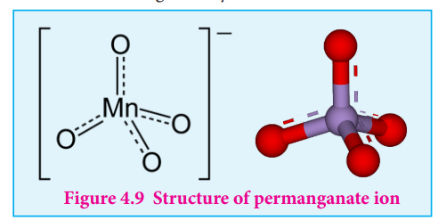

**Figure 4.9 Structure of permanganate ion**

## Chemical properties:

## 1. Action of heat:

When heated, potassium permanganate decomposes to form potassium manganate and manganese dioxide.

$$
2KMnO_4 \longrightarrow K_2MnO_4 + MnO_2 + O_2
$$

## 2. Action of conc \(H_2SO_4\)

On treating with cold conc \(H_2SO_4\) it decomposes to form manganese heptoxide, which subsequently decomposes explosively.

$$
2KMnO_4 + 2H_2SO_4 \longrightarrow Mn_2O_7 + 2KHSO_4 + H_2O
$$

$$
2Mn_2O_7 \xrightarrow{\Delta} 4MnO_2 + 3O_2
$$

But with hot conc \(H_2SO_4\) potassium permanganate give \(MnSO_4\)

$$
4KMnO_4 + 6H_2SO_4 \longrightarrow 4MnSO_4 + 2K_2SO_4 + 6H_2O + 5O_2
$$

## 3. Oxidising property:

Potassium permanganate is a strong oxidising agent, its oxidising action differs in different reaction medium.

a) In neutral medium:

In neutral medium, it is reduced to \(MnO_2\)

$$
MnO_4^{-} + 2H_2O + 3e^{-} \longrightarrow MnO_2 + 4OH^{-}
$$

(i) It oxidises \(H_2S\) to sulphur

$$
2MnO_4^{-} + 3H_2S \longrightarrow 2MnO_2 + 3S + 2OH^{-} + 2H_2O
$$

(ii) It oxidises thiosulphate into sulphate

$$
8MnO_4^{-} + 3S_2O_3^{2-} + H_2O \longrightarrow 6SO_4^{2-} + 8MnO_2 + 2OH^{-}
$$

b) In alkaline medium:

In the presence of alkali metal hydroxides, the permanganate ion is converted into manganate.

$$
MnO_4^{-} + e^{-} \longrightarrow MnO_4^{2-}
$$

This manganate is further reduced to \(MnO_2\) by some reducing agents.

$$
MnO_4^{2-} + 2H_2O + 2e^{-} \longrightarrow MnO_2 + 4OH^{-}
$$

So the overall reaction can be written as follows.

$$
MnO_4^{-} + 2H_2O + 3e^{-} \longrightarrow MnO_2 + 4OH^{-}
$$

This reaction is similar as that for neutral medium.

## Baeyer's reagent:

Cold dilute alkaline \(KMnO_4\) is known as Baeyer's reagent. It is used to oxidise alkenes into diols. For example, ethylene can be converted into ethylene glycol and this reaction is used as a test for unsaturation.

c) In acid medium:

In the presence of dilute sulphuric acid, potassium permanganate acts as a very strong oxidising agent. Permanganate ion is converted into \(Mn^{2+}\) ion.

$$
MnO_4^{-} + 8H^{+} + 5e^{-} \longrightarrow Mn^{2+} + 4H_2O
$$

The oxidising nature of potassium permanganate (permanganate ion) in acid medium is illustrated in the following examples.

(i) It oxidises ferrous salts to ferric salts.

$$
2MnO_4^{-} + 10Fe^{2+} + 16H^{+} \longrightarrow 2Mn^{2+} + 10Fe^{3+} + 8H_2O
$$

(ii) It oxidises iodide ions to iodine

$$
2MnO_4^{-} + 10I^{-} + 16H^{+} \longrightarrow 2Mn^{2+} + 5I_2 + 8H_2O
$$

(iii) It oxidises oxalic acid to \(CO_2\)

$$
2MnO_4^{-} + 5(COO)_2^{2-} + 16H^{+} \longrightarrow 2Mn^{2+} + 10CO_2 + 8H_2O
$$

(iv) It oxidises sulphide ion to sulphur

$$
2MnO_4^{-} + 5S^{2-} + 16H^{+} \longrightarrow 2Mn^{2+} + 5S + 8H_2O
$$

(v) It oxidises nitrites to nitrates

$$
2MnO_4^{-} + 5NO_2^{-} + 6H^{+} \longrightarrow 2Mn^{2+} + 5NO_3^{-} + 3H_2O
$$

(vi) It oxidises alcohols to aldehydes.

$$
2KMnO_4 + 3H_2SO_4 + 5CH_3CH_2OH \longrightarrow K_2SO_4 + 2MnSO_4 + 5CH_3CHO + 8H_2O
$$

(vii) It oxidises sulphite to sulphate

$$
2MnO_4^{-} + 5SO_3^{2-} + 6H^{+} \longrightarrow 2Mn^{2+} + 5SO_4^{2-} + 3H_2O
$$

## Uses of potassium permanganate:

1. It is used as a strong oxidizing agent.
2. It is used for the treatment of various skin infections and fungal infections of the foot.
3. It used in water treatment industries to remove iron and hydrogen sulphide from well water.
4. It is used as Bayer's reagent for detecting unsaturation in an organic compound.
5. It is used in quantitative analysis for the estimation of ferrous salts, oxalates, hydrogen peroxide and iodides.

Note: \(HCl\) cannot be used for making the medium acidic since it reacts with \(KMnO_4\) as follows.

$$
2MnO_4^{-} + 10Cl^{-} + 16H^{+} \longrightarrow 2Mn^{2+} + 5Cl_2 + 8H_2O
$$

\(HNO_3\) also cannot be used since it is good oxidising agent and reacts with reducing agents in the reaction.

However, \(H_2SO_4\) is found to be most suitable since it does not react with potassium permanganate.

# Note

Equivalent weight of \(KMnO_4\) in acid medium = \(\frac{\text{Molecular weight of } KMnO_4}{\text{no of mols of electrons transferred}} = \frac{158}{5} = 31.6\)

Equivalent weight of \(KMnO_4\) in basic medium = \(\frac{\text{Molecular weight of } KMnO_4}{\text{no of mols of electrons transferred}} = \frac{158}{1} = 158\)

Equivalent weight of \(KMnO_4\) in neutral medium = \(\frac{\text{Molecular weight of } KMnO_4}{\text{no of mols of electrons transferred}} = \frac{158}{3} = 52.67\)

## f-block elements - Inner transition elements

In the inner transition elements there are two series of elements.

1) Lanthanoids (previously called lanthanides)
2) Actinoids (previously called actinides)

Lanthanoid series consists of fourteen elements from Cerium \((_{58}Ce)\) to Lutetium \((_{71}Lu)\) following Lanthanum \((_{57}La)\). These elements are characterised by the preferential filling of 4f orbitals, Similarly actinoids consists of 14 elements from Thorium \((_{90}Th)\) to Lawrencium \((_{103}Lr)\) following Actinium \((_{89}Ac)\). These elements are characterised by the preferential filling of 5f orbital.

## The position of Lanthanoids in the periodic table

The actual position of Lanthanoids in the periodic table is at group number 3 and period 6.

1. Lanthanoids have general electronic configuration [Xe] \(4f^{1-14}5d^{0-1}6s^{2}\)
2. The common oxidation state of lanthanoides is \(+3\)
3. All these elements have similar physical and chemical properties.

Similarly the fourteen elements following actinium resemble in their physical and chemical properties. If we place these elements after Lanthanum in the periodic table below 4d series, the properties of the elements belongs to a group would be different and it would affect the proper structure of the periodic table. Hence a separate position is provided to the inner transition elements as shown in the figure.

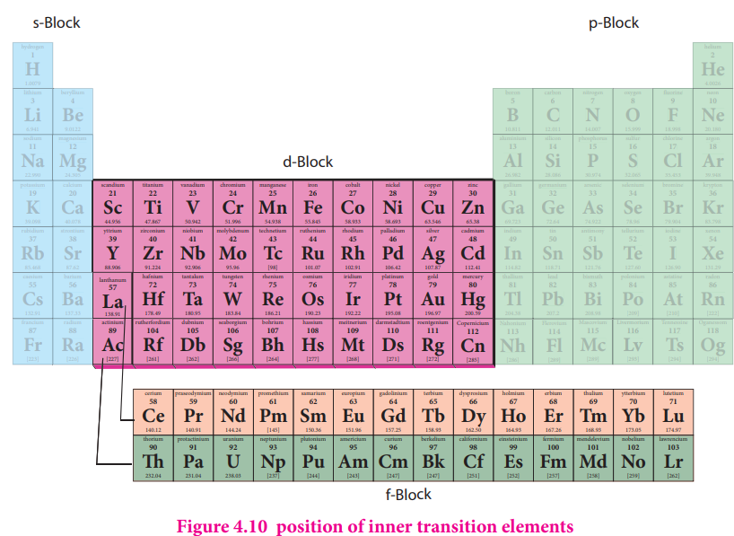

**Figure 4.10 position of inner transition elements**

## Electronic configuration of Lanthanoids:

We know that the electrons are filled in different orbitals in the order of their increasing energy in accordance with Aufbau principle. As per this rule after filling 5s,5p and 6s and 4f level begin to fill from lanthanum, and hence the expected electronic configuration of Lanthanum(La) is [Xe] \(4f^{1}5d^{0}6s^{2}\) but the actual electronic configuration of Lanthanum is [Xe] \(4f^{0}\) \(5d^{1}\) \(6s^{2}\) and it belongs to d block. Filling of 4f orbital starts from Cerium (Ce) and its electronic configuration is [Xe] \(4f^{1}\) \(5d^{1}\) \(6s^{2}\). As we move from Cerium to other elements the additional electrons are progressively filled in 4f orbitals as shown in the table.

**Table: electronic configuration of Lanthanum and Lanthanoids**

| Name of the element | Atomic number | Symbol | Electronic configuration |
|---|---|---|---|
| Lanthanum | 57 | La | [Xe] \(4f^{0}\) \(5d^{1}\) \(6s^{2}\) |
| Cerium | 58 | Ce | [Xe] \(4f^{1}\) \(5d^{1}\) \(6s^{2}\) |
| Praseodymium | 59 | Pr | [Xe] \(4f^{3}\) \(5d^{0}\) \(6s^{2}\) |
| Neodymium | 60 | Nd | [Xe] \(4f^{4}\) \(5d^{0}\) \(6s^{2}\) |
| Promethium | 61 | Pm | [Xe] \(4f^{5}\) \(5d^{0}\) \(6s^{2}\) |
| Samarium | 62 | Sm | [Xe] \(4f^{6}\) \(5d^{0}\) \(6s^{2}\) |
| Europium | 63 | Eu | [Xe] \(4f^{7}\) \(5d^{0}\) \(6s^{2}\) |
| Gadolinium | 64 | Gd | [Xe] \(4f^{7}\) \(5d^{1}\) \(6s^{2}\) |
| Terbium | 65 | Tb | [Xe] \(4f^{9}\) \(5d^{0}\) \(6s^{2}\) |
| Dysprosium | 66 | Dy | [Xe] \(4f^{10}\) \(5d^{0}\) \(6s^{2}\) |
| Holmium | 67 | Ho | [Xe] \(4f^{11}\) \(5d^{0}\) \(6s^{2}\) |
| Erbium | 68 | Er | [Xe] \(4f^{12}\) \(5d^{0}\) \(6s^{2}\) |
| Thulium | 69 | Tm | [Xe] \(4f^{13}\) \(5d^{0}\) \(6s^{2}\) |
| Ytterbium | 70 | Yb | [Xe] \(4f^{14}\) \(5d^{0}\) \(6s^{2}\) |
| Lutetium | 71 | Lu | [Xe] \(4f^{14}\) \(5d^{1}\) \(6s^{2}\) |

In Gadolinium (Gd) and Lutetium (Lu) the 4f orbitals, are half- filled and completely filled, and one electron enters 5d orbitals. Hence the general electronic configuration of 4f series of elements can be written as [Xe] \(4f^{1-14}\) \(5d^{0-1}\) \(6s^{2}\)

## Oxidation state of lanthanoids:

The common oxidation state of lanthanoids is \(+3\). In addition to that some of the lanthanoids also show either \(+2\) or \(+4\) oxidation states.

\(Gd^{3+}\) and \(Lu^{3+}\) ions have extra stability, it is due to the fact that they have exactly half filled and completely filled f- orbitals respectively. Their electronic configurations are

$$
Gd^{3+} : [Xe]4f^{7}
$$

$$
Lu^{3+} : [Xe]4f^{14}
$$

Similarly Cerium and Terbium attain \(4f^{0}\) and \(4f^{7}\) configurations respectively in the \(+4\) oxidation states. \(Eu^{2+}\) and \(Yb^{2+}\) ions have exactly half filled and completely filled f orbitals respectively.

The stability of different oxidation states has an impact on the properties of these elements. the following table shows the different oxidation states of lanthanoids.

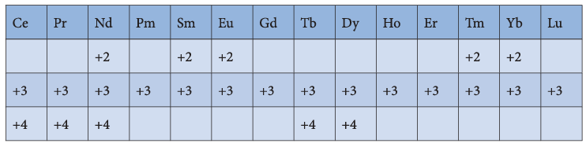

## Atomic and ionic radii:

As we move across 4f series, the atomic and ionic radii of lanthanoids show gradual decrease with increase in atomic number. This decrease in ionic size is called lanthanoid contraction.
 
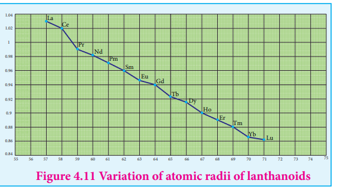
 
**Figure 4.11 Variation of atomic radii of lanthanoids**

## Cause of lanthanoid contraction:

As we move from one element to another in 4f series (Ce to Lu) the nuclear charge increases by one unit and an additional electron is added into the same inner 4f sub shell. We know that 4f sub shell have a diffused shapes and therefore the shielding effect of 4f electrons relatively poor. hence, with increase of nuclear charge, the valence shell is pulled slightly towards nucleus. As a result, the effective nuclear charge experienced by the 4f electrons increases and the size of \(Ln^{3+}\) ions decreases. Lanthanoid contraction of various lanthanoids is shown in the graph

## Consequences of lanthanoid contraction:

## 1. Basic nature

As we from \(Ce^{3+}\) to \(Lu^{3+}\), the basic character of \(Ln^{3+}\) ions decrease. Due to the decrease in the size of \(Ln^{3+}\) ions, the ionic character of \(Ln - OH\) bond decreases (covalent character increases) which results in the decrease in the basic nature.

## 2. Similarities among lanthanoids:

In the complete f - series only \(10 \ \mathrm{pm}\) decrease in atomic radii and \(20 \ \mathrm{pm}\) decrease in ionic radii is observed. because of this very small change in radii of lanthanoids, their chemical properties are quite similar.

## 3. Similarities between 4d and 5d series:

The elements of the second and third transition series resemble each other more closely than the elements of the first and second transition series. For example

| Series | Element | Atomic radius |
|---|---|---|
| 3d Series | Ti | 132 pm |
| 4d Series | Zr | 145 pm |
| 5d Series | Hf | 144 pm |

## Actinoids:

The fourteen elements following actinium i.e., from thorium (Th) to lawrentium (Lr) are called actinoids. Unlike the lanthanoids, all the actinoids are radioactive and most of them have short half lives. Only thorium and uranium(U) occur in significant amount in nature and a trace amounts of Plutonium(Pu) is also found in Uranium ores. Neptunium(Np) and successive heavier elements are produced synthetically by the artificial transformation of naturally occurring elements by nuclear reactions.

Similar to lanthanoids, they are placed at the bottom of the periodic table.

## Electronic configuration:

The electronic configuration of actinoids is not definite. The general valence shell electronic configuration of 5f elements is represented as \([Rn]5f^{0-14}6d^{0-2}7s^{2}\). The following table show the electronic configuration of actinoids.

**Table: electronic configuration of actinoids**

| Name of the element | Atomic number | Symbol | Electronic configuration |
|---|---|---|---|
| Actinium | 89 | Ac | [Rn] \(5f^{0}\) \(6d^{1}\) \(7s^{2}\) |
| Thorium | 90 | Th | [Rn] \(5f^{0}\) \(6d^{2}\) \(7s^{2}\) |
| Protactinium | 91 | Pa | [Rn] \(5f^{2}\) \(6d^{1}\) \(7s^{2}\) |
| Uranium | 92 | U | [Rn] \(5f^{3}\) \(6d^{1}\) \(7s^{2}\) |
| Neptunium | 93 | Np | [Rn] \(5f^{4}\) \(6d^{1}\) \(7s^{2}\) |
| Plutonium | 94 | Pu | [Rn] \(5f^{6}\) \(6d^{0}\) \(7s^{2}\) |
| Americium | 95 | Am | [Rn] \(5f^{7}\) \(6d^{0}\) \(7s^{2}\) |
| Curium | 96 | Cm | [Rn] \(5f^{7}\) \(6d^{1}\) \(7s^{2}\) |
| Berkelium | 97 | Bk | [Rn] \(5f^{9}\) \(6d^{0}\) \(7s^{2}\) |
| Californium | 98 | Cf | [Rn] \(5f^{10}\) \(6d^{0}\) \(7s^{2}\) |
| Einsteinium | 99 | Es | [Rn] \(5f^{11}\) \(6d^{0}\) \(7s^{2}\) |
| Fermium | 100 | Fm | [Rn] \(5f^{12}\) \(6d^{0}\) \(7s^{2}\) |
| Mendelevium | 101 | Md | [Rn] \(5f^{13}\) \(6d^{0}\) \(7s^{2}\) |
| Nobelium | 102 | No | [Rn] \(5f^{14}\) \(6d^{0}\) \(7s^{2}\) |
| Lawrentium | 103 | Lr | [Rn] \(5f^{14}\) \(6d^{1}\) \(7s^{2}\) |

## Oxidation state of actinoids:

Like lanthanoids, the most common state of actinoids is \(+3\). In addition to that actinoids show variable oxidation states such as \(+2\), \(+3\), \(+4\), \(+5\), \(+6\) and \(+7\).

The elements Americium(Am) and Thorium (Th) show \(+2\) oxidation state in some compounds, for example thorium iodide \((ThI_2)\). The elements Th, Pa, U, Np, Pu and Am show \(+5\) oxidation states. Np and Pu exhibit \(+7\) oxidation state.

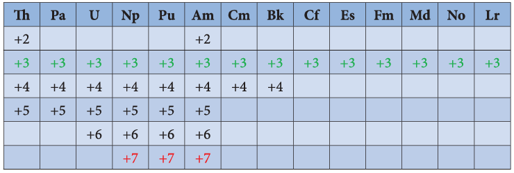

**Differences between lanthanoids and actinoids:**

| s.no | Lanthanoids | Actinoids |
|---|---|---|
| 1 | Differentiating electron enters in 4f orbital | Differentiating electron enters in 5f orbital |
| 2 | Binding energy of 4f orbitals are higher | Binding energy of 5f orbitals are lower |
| 3 | They show less tendency to form complexes | They show greater tendency to form complexes |
| 4 | Most of the lanthanoids are colourless | Most of the actinoids are coloured. For example. \(U^{3+}\) (red), \(U^{4+}\) (green), \(UO_2^{+}\) (yellow) |
| 5 | They do not form oxo cations | They do form oxo cations such as \(UO_2^{2+}, NpO_2^{2+}\) etc |
| 6 | Besides \(+3\) oxidation states lanthanoids show \(+2\) and \(+4\) oxidation states in few cases. | Besides \(+3\) oxidation states actinoids show higher oxidation states such as \(+4, +5, +6\) and \(+7\) |

## Summary

IUPAC defines transition metal as an element whose atom has an incomplete d sub shell or which can give rise to cations with an incomplete d sub shell. They occupy the central position of the periodic table, between s and p block elements,

d- Block elements composed of 3d series (4th period) Scandium to Zinc (10 elements), 4d series (\(5^{\mathrm{th}}\) period) Yttrium to Cadmium (10 elements) and 5d series (\(6^{\mathrm{th}}\) period) Lanthanum, Hafnium to mercury.

The general electronic configuration of d- block elements can be written as [Noble gas] \((n - 1)d^{1 - 10}ns^{1 - 2}\) Here, \(n = 4\) to 7. In periods 6 and 7, the configuration includes \(((n - 2)f\) orbital; [Noble gas] \((n - 2)f^{14}(n - 1)d^{1 - 10}ns^{1 - 2}\)

All the transition elements are metals. Similar to all metals the transition metals are good conductors of heat and electricity. Unlike the metals of Group- 1 and group- 2, all the transition metals except group 11 elements are hard.

As we move from left to right along the transition metal series, melting point first increases as the number of unpaired d electrons available for metallic bonding increases, reach a maximum value and then decreases, as the d electrons pair up and become less available for bonding.

Ionization energy of transition element is intermediate between those of s and p block elements. As we move from left to right in a transition metal series, the ionization enthalpy increases as expected.

The first transition metal Scandium exhibits only \(+3\) oxidation state, but all other transition elements exhibit variable oxidation states by loosing electrons from (n- 1)d orbital and ns orbital as the energy difference between them is very small.

In 3d series as we move from Ti to Zn, the standard reduction potential \((E_{M^{2+}/M}^{0})\) value is approaching towards less negative value and copper has a positive reduction potential. i.e., elemental copper is more stable than \(Cu^{2+}\)

Most of the compounds of transition elements are paramagnetic. Magnetic properties are related to the electronic configuration of atoms. Many industrial processes use transition metals or their compounds as catalysts. Transition metal has energetically available d orbitals that can accept electrons from reactant molecule or metal can form bond with reactant molecule using its d electrons. Transition metals form a number of interstitial compounds such as TiC, \(ZrH_{1.92}\), \(Mn_4N\) etc. Transition elements have a tendency to form coordination compounds with a species that has an ability to donate an electron pair to form a coordinate covalent bond. In the inner transition elements there are two series of elements. 1) Lanthanoids (previously called lanthanides) 2) Actinoids (previously called actinides) Lanthanoids have general electronic configuration [Xe] \(4f^{1-4}5d^{0-1}6s^{2}\) The common oxidation state of lanthanoides is \(+3\) As we move across 4f series, the atomic and ionic radii of lanthanoids show gradual decrease with increase in atomic number. This decrease in ionic size is called lanthanoid contraction. The electronic configuration of actinoids is not definite. The general valence shell electronic configuration of 5f elements is represented as [Rn]5f \(^{0-14}6d^{0-2}7s^{2}\) Like lanthanoids, the most common state of actinoids is \(+3\). In addition to that actinoids show variable oxidation states such as \(+2\), \(+3\), \(+4\), \(+5\), \(+6\) and \(+7\).

## EVALUATION

## Choose the best answer:

1. Sc(\(Z = 21\)) is a transition element but Zinc \((z = 30)\) is not because

a) both \(Sc^{3+}\) and \(Zn^{2+}\) ions are colourless and form white compounds.
b) in case of Sc, 3d orbital are partially filled but in Zn these are completely filled
c) last electron as assumed to be added to 4s level in case of zinc
d) both Sc and Zn do not exhibit variable oxidation states

2. Which of the following d block element has half filled penultimate d sub shell as well as half filled valence sub shell?

a) Cr
b) Pd
c) Pt
d) none of these

3. Among the transition metals of 3d series, the one that has highest negative \((M^{2+} / M)\) standard electrode potential is

a) Ti
b) Cu
c) Mn
d) Zn

4. Which one of the following ions has the same number of unpaired electrons as present in \(V^{3+}\)?

a) \(Ti^{3+}\)
b) \(Fe^{3+}\)
c) \(Ni^{2+}\)
d) \(Cr^{3+}\)

5. The magnetic moment of \(Mn^{2+}\) ion is

a) 5.92 BM
b) 2.80 BM
c) 8.95 BM
d) 3.90 BM

6. The catalytic behaviour of transition metals and their compounds is ascribed mainly due to

a) their magnetic behaviour
b) their unfilled d orbitals
c) their ability to adopt variable oxidation states
d) their chemical reactivity

7. The correct order of increasing oxidizing power in the series

a) \(VO_2^{+} < Cr_2O_7^{2-} < MnO_4^{-}\)
b) \(Cr_2O_7^{2-} < MnO_4^{-} < VO_2^{+}\)
c) \(VO_2^{+} < MnO_4^{-} < Cr_2O_7^{2-}\)
d) \(Cr_2O_7^{2-} < VO_2^{+} < MnO_4^{-}\)

8. In acid medium, potassium permanganate oxidizes oxalic acid to

a) oxalate
b) Carbon dioxide
c) acetate
d) acetic acid

9. Which of the following statements is not true?

a) on passing \(H_2S\), through acidified \(K_2Cr_2O_7\) solution, a milky colour is observed.
b) \(Na_2Cr_2O_7\) is preferred over \(K_2Cr_2O_7\) in volumetric analysis
c) \(K_2Cr_2O_7\) solution in acidic medium is orange in colour
d) \(K_2Cr_2O_7\) solution becomes yellow on increasing the \(P^{H}\) beyond 7

10. Permanganate ion changes to in acidic medium

a) \(MnO_4^{2-}\)
b) \(Mn^{2+}\)
c) \(Mn^{3+}\)
d) \(MnO_2\)

11. How many moles of \(I_2\) are liberated when 1 mole of potassium dichromate react with potassium iodide?

a) 1
b) 2
c) 3
d) 4

12. The number of moles of acidified \(KMnO_4\) required to oxidize 1 mole of ferrous oxalate \((FeC_2O_4)\) is

a) 5
b) 3
c) 0.6
d) 1.5

13. Which one of the following statements related to lanthanons is incorrect?

a) Europium shows \(+2\) oxidation state.
b) The basicity decreases as the ionic radius decreases from Pr to Lu.
c) All the lanthanons are much more reactive than aluminium.
d) \(Ce^{4+}\) solutions are widely used as oxidising agents in volumetric analysis.

14. Which of the following lanthanoid ion is diamagnetic?

a) \(Eu^{2+}\)
b) \(Yb^{2+}\)
c) \(Ce^{2+}\)
d) \(Sm^{2+}\)

15. Which of the following oxidation state is most common among the lanthanoids?

a) \(+4\)
b) \(+2\)
c) \(+5\)
d) \(+3\)

16. Assertion : \(Ce^{4+}\) is used as an oxidizing agent in volumetric analysis.

Reason: \(Ce^{4+}\) has the tendency of attaining \(+3\) oxidation state.

a) Both assertion and reason are true and reason is the correct explanation of assertion.
b) Both assertion and reason are true but reason is not the correct explanation of assertion.
c) Assertion is true but reason is false.
d) Both assertion and reason are false.

17. The most common oxidation state of actinoids is

a) \(+2\)
b) \(+3\)
c) \(+4\)
d) \(+6\)

18. The actinoid elements which show the highest oxidation state of \(+7\) are

a) Np, Pu, Am
b) U, Fm, Th
c) U, Th, Md
d) Es, No, Lr

19. Which one of the following is not correct?

a) \(La(OH)_3\) is less basic than \(Lu(OH)_3\)
b) In lanthanoid series ionic radius of \(Ln^{3+}\) ions decreases
c) La is actually an element of transition metal series rather than lanthanoid series
d) Atomic radii of Zr and Hf are same because of lanthanoid contraction

## Answer the following questions:

1. What are transition metals? Give four examples.
2. Explain the oxidation states of 4d series elements.
3. What are inner transition elements?
4. Justify the position of lanthanoids and actinoids in the periodic table.
5. What are actinides? Give three examples.
6. Describe the preparation of potassium dichromate.
7. What is lanthanoid contraction and what are the effects of lanthanoid contraction?
8. Complete the following
a. \(MnO_4^{2-} + H^+ \longrightarrow ?\)
b. \(C_6H_5CH_3 \xrightarrow{\text{acidified } KMnO_4} ?\)
c. \(MnO_4^{-} + Fe^{2+} \longrightarrow ?\)
d. \(KMnO_4 \xrightarrow{\Delta \text{ Red hot}} ?\)
e. \(Cr_2O_7^{2-} + I^{-} + H^{+} \longrightarrow ?\)
f. \(Na_2Cr_2O_7 + KCl \longrightarrow ?\)
9. What are interstitial compounds?
10. Calculate the number of unpaired electrons in \(Ti^{3+}\), \(Mn^{2+}\) and calculate the spin only magnetic moment.
11. Write the electronic configuration of \(Ce^{4+}\) and \(Co^{2+}\).
12. Explain briefly how \(+2\) states becomes more and more stable in the first half of the first row transition elements with increasing atomic number.
13. Which is more stable? \(Fe^{3+}\) or \(Fe^{2+}\) - explain.
14. Explain the variation in \(E_{M^{3+} / M^{2+}}^{0}\) 3d series.
15. Compare lanthanoids and actinoids.
16. Explain why \(Cr^{2+}\) is strongly reducing while \(Mn^{3+}\) is strongly oxidizing.
17. Compare the ionization enthalpies of first series of the transition elements.
18. Actinoid contraction is greater from element to element than the lanthanoid contraction, why?
19. Out of \(Lu(OH)_3\) and \(La(OH)_3\) which is more basic and why?
20. Why Europium (II) is more stable than Cerium (II)?
21. Why do Zirconium and Hafnium exhibit similar properties?
22. Which is stronger reducing agent \(Cr^{2+}\) or \(Fe^{2+}\)?
23. The \(E^{0}_{M^{2+} / M}\) value for copper is positive. Suggest a possible reason for this.
24. Describe the variable oxidation state of 3d series elements.
25. Which metal in the 3d series exhibits \(+1\) oxidation state most frequently and why?
26. Why first ionization enthalpy of chromium is lower than that of zinc?
27. Transition metals show high melting points. Why?
