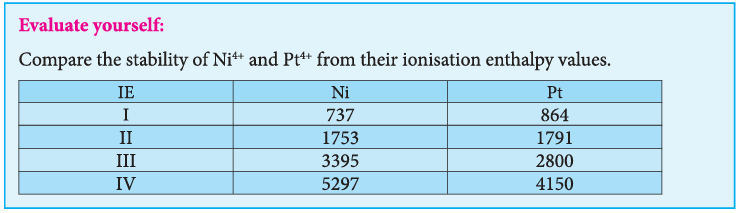
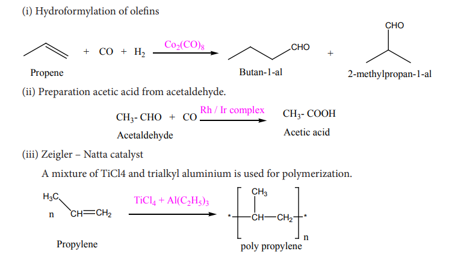

### 4.3 General trend in properties:

#### 4.3.1 Metallic behaviour:

All the transition elements are metals. Similar to all metals the transition metals are good conductors of heat and electricity. Unlike the metals of Group- 1 and group- 2, all the transition metals except group 11 elements are hard. Of all the known elements, silver has the highest electrical conductivity at room temperature.

Most of the transition elements are hexagonal close packed, cubic close packed or body centered cubic which are the characteristics of true metals.

As we move from left to right along the transition metal series, melting point first increases as the number of unpaired d electrons available for metallic bonding increases, reach a maximum value and then decreases, as the d electrons pair up and become less available for bonding.

For example, in the first series the melting point increases from Scandium (m.pt 1814K) to a maximum of 2183 K for vanadium, which is close to 2180K for chromium. However, manganese in 3d series and Tc in 4d series have low melting point. The maximum melting point at about the middle of transition metal series indicates that \(d^5\) configuration is favorable for strong interatomic attraction. The following figure shows the trends in melting points of transition elements.

#### 4.3.2 Variation of atomic and ionic size:

It is generally expected a steady decrease in atomic radius along a period as the nuclear charge increases and the extra electrons are added to the same sub shell. But for the 3d transition elements, the expected decrease in atomic radius is observed from Sc to V, thereafter up to Cu the atomic radius nearly remains the same. As we move from Sc to Zn in 3d series the extra electrons are added to the 3d orbitals, the added 3d electrons only partially shield the increased nuclear charge and hence the effective nuclear charge increases slightly. However, the extra electrons added to the 3d sub shell strongly repel the 4s electrons and these two forces are operated in opposite direction and as they tend to balance each other, it leads to constancy in atomic radii.

At the end of the series, d - orbitals of Zinc contain 10 electrons in which the repulsive interaction between the electrons is more than the effective nuclear charge and hence, the orbitals slightly expand and atomic radius slightly increases.

Generally as we move down a group atomic radius increases, the same trend is expected in d block elements also. As the electrons are added to the 4d sub shell, the atomic radii of the 4d elements are higher than the corresponding elements of the 3d series. However there is an unexpected observation in the atomic radius of 5d elements which have nearly same atomic radius as that of corresponding 4d elements. This is due to lanthanide contraction which is to be discussed later in this unit under inner transition elements.

#### 4.3.3 Ionization enthalpy:

Ionization energy of transition element is intermediate between those of s and p block elements. As we move from left to right in a transition metal series, the ionization enthalpy increases as expected. This is due to increase in nuclear charge corresponding to the filling of d electrons. The following figure show the trends in ionisation enthalpy of transition elements.

The increase in first ionisation enthalpy with increase in atomic number along a particular series is not regular. The added electron enters (n- 1)d orbital and the inner electrons act as a shield and decrease the effect of nuclear charge on valence ns electrons. Therefore, it leads to variation in the ionization energy values.

The ionisation enthalpy values can be used to predict the thermodynamic stability of their compounds. Let us compare the ionisation energy required to form \(Ni^{2+}\) and \(Pt^{2+}\) ions.

$$
\text{For Nickel}, IE_1 + IE_2 = (737 + 1753) = 2490 \ \mathrm{kJ \ mol}^{-1}
$$

$$
\text{For Platinum}, IE_1 + IE_2 = (864 + 1791) = 2655 \ \mathrm{kJ \ mol}^{-1}
$$

Since, the energy required to form \(Ni^{2+}\) is less than that of \(Pt^{2+}\), Ni(II) compounds are thermodynamically more stable than Pt(II) compounds.

#### 4.3.4 Oxidation state:

The first transition metal Scandium exhibits only \(+3\) oxidation state, but all other transition elements exhibit variable oxidation states by losing electrons from (n- 1)d orbital and ns orbital as the energy difference between them is very small. Let us consider the 3d series; the following table summarizes the oxidation states of the 3d series elements.

At the beginning of the series, \(+3\) oxidation state is stable but towards the end \(+2\) oxidation state becomes stable.

The number of oxidation states increases with the number of electrons available, and it decreases as the number of paired electrons increases. Hence, the first and last elements show less number of oxidation states and the middle elements with more number of oxidation states. For example, the first element Sc has only one oxidation state \(+3\); the middle element Mn has six different oxidation states from \(+2\) to \(+7\). The last element Cu shows \(+1\) and \(+2\) oxidation states only.

The relative stability of different oxidation states of 3d metals is correlated with the extra stability of half filled and fully filled electronic configurations. Example: \(Mn^{2+}(3d^{5})\) is more stable than \(Mn^{4+}(3d^{3})\)

The oxidation states of 4d and 5d metals vary from \(+3\) for Y and La to \(+8\) for Ru and Os. The highest oxidation state of 4d and 5d elements are found in their compounds with the higher electronegative elements like O, F and Cl. for example: \(RuO_4\), \(OsO_4\) and \(WCl_6\). Generally in going down a group, a stability of the higher oxidation state increases while that of lower oxidation state decreases. It is evident from the Frost diagram \((\Delta G^{0} \ vs\) oxidation number) as shown below, For titanium, vanadium and chromium, the most thermodynamically stable oxidation state is \(+3\). For iron, the stabilities of \(+3\) and \(+2\) oxidation states are similar. Copper is unique in 3d series having a stable \(+1\) oxidation state. It is prone to disproportionate to the \(+2\) and 0 oxidation states.

**Figure 4.6 Frost diagram**

## Evaluate yourself:

Why iron is more stable in \(+3\) oxidation state than in \(+2\) and the reverse is true for Manganese?

#### 4.3.5 Standard electrode potentials of transition metals

Redox reactions involve transfer of electrons from one reactant to another. Such reactions are always coupled, which means that when one substance is oxidised, another must be reduced. The substance which is oxidised is a reducing agent and the one which is reduced is an oxidizing agent. The oxidizing and reducing power of an element is measured in terms of the standard electrode potentials.

Standard electrode potential is the value of the standard emf of a cell in which molecular hydrogen under standard pressure (1atm) and temperature \((273 \mathrm{K})\) is oxidised to solvated protons at the electrode.

If the standard electrode potential \((E^0)\), of a metal is large and negative, the metal is a powerful reducing agent, because it loses electrons easily. Standard electrode potentials (reduction potential) of few first transition metals are given in the following table.

| Reaction | Standard reduction potential (V) |
|---|---|
| \(Ti^{2+} + 2e^- \rightarrow Ti\) | \(-1.63\) |
| \(V^{2+} + 2e^- \rightarrow V\) | \(-1.19\) |
| \(Cr^{2+} + 2e^- \rightarrow Cr\) | \(-0.91\) |
| \(Mn^{2+} + 2e^- \rightarrow Mn\) | \(-1.18\) |
| \(Fe^{2+} + 2e^- \rightarrow Fe\) | \(-0.44\) |
| \(Co^{2+} + 2e^- \rightarrow Co\) | \(-0.28\) |
| \(Ni^{2+} + 2e^- \rightarrow Ni\) | \(-0.23\) |
| \(Cu^{2+} + 2e^- \rightarrow Cu\) | \(+0.34\) |
| \(Zn^{2+} + 2e^- \rightarrow Zn\) | \(-0.76\) |

In 3d series as we move from Ti to Zn, the standard reduction potential \((E_{M^{2+}/M}^{0})\) value is approaching towards less negative value and copper has a positive reduction potential. i.e., elemental copper is more stable than \(Cu^{2+}\). There are two deviations., Fig shows that \((E_{M^{2+}/M}^{0})\) value for manganese and zinc are more negative than the regular trend. It is due to extra stability which arises due to the half filled \(d^{5}\) configuration in \(Mn^{2+}\) and completely filled \(d^{10}\) configuration in \(Zn^{2+}\).

Transition metals in their high oxidation states tend to be oxidizing . For example, \(Fe^{3+}\) is moderately a strong oxidant, and it oxidises copper to \(Cu^{2+}\) ions. The feasibility of the reaction is predicted from the following standard electrode potential values.

$$
Fe^{3+}(aq) + e^- \rightleftharpoons Fe^{2+} \quad E^{0} = 0.77 \ \mathrm{V}
$$

$$
Cu^{2+}(aq) + 2e^- \rightleftharpoons Cu(s) \quad E^{0} = +0.34 \ \mathrm{V}
$$

The standard electrode potential for the \(M^{3+} / M^{2+}\) half- cell gives the relative stability between \(M^{3+}\) and \(M^{2+}\). The reduction potential values are tabulated as below.

| Reaction | Standard reduction potential (V) |
|---|---|
| \(Ti^{3+} + e^- \rightarrow Ti^{2+}\) | \(-0.37\) |
| \(V^{3+} + e^- \rightarrow V^{2+}\) | \(-0.26\) |
| \(Cr^{3+} + e^- \rightarrow Cr^{2+}\) | \(-0.41\) |
| \(Mn^{3+} + e^- \rightarrow Mn^{2+}\) | \(+1.51\) |
| \(Fe^{3+} + e^- \rightarrow Fe^{2+}\) | \(+0.77\) |
| \(Co^{3+} + e^- \rightarrow Co^{2+}\) | \(+1.81\) |

The negative values for titanium, vanadium and chromium indicate that the higher oxidation state is preferred. If we want to reduce such a stable \(Cr^{3+}\) ion, strong reducing agent which has high negative value for reduction potential like metallic zinc \((E^{0} = -0.76 \ \mathrm{V})\) is required.

The high reduction potential of \(Mn^{3+} / Mn^{2+}\) indicates \(Mn^{2+}\) is more stable than \(Mn^{3+}\). For \(Fe^{3+} / Fe^{2+}\) the reduction potential is 0.77V, and this low value indicates that both \(Fe^{3+}\) and \(Fe^{2+}\) can exist under normal conditions. The drop from \(Mn\) to \(Fe\) is due to the electronic structure of the ions concerned. \(Mn^{3+}\) has a \(3d^{4}\) configuration while that of \(Mn^{2+}\) is \(3d^{5}\). The extra stability associated with a half filled d sub shell makes the reduction of \(Mn^{3+}\) very feasible \((E^{0} = +1.51 \ \mathrm{V})\).

#### 4.3.6 Magnetic properties

Most of the compounds of transition elements are paramagnetic. Magnetic properties are related to the electronic configuration of atoms. We have already learnt in XI STD that the electron is spinning around its own axis, in addition to its orbital motion around the nucleus. Due to these motions, a tiny magnetic field is generated and it is measured in terms of magnetic moment. On the basis of magnetic properties, materials can be broadly classified as (i) paramagnetic materials (ii) diamagnetic materials, besides these there are ferromagnetic and antiferromagnetic materials.

Materials with no elementary magnetic dipoles are diamagnetic, in other words a species with all paired electrons exhibits diamagnetism. This kind of materials are repelled by the magnetic field because the presence of external magnetic field, a magnetic induction is introduced to the material which generates weak magnetic field that oppose the applied field.

Paramagnetic solids having unpaired electrons possess magnetic dipoles which are isolated from one another. In the absence of external magnetic field, the dipoles are arranged at random and hence the solid shows no net magnetism. But in the presence of magnetic field, the dipoles are aligned parallel to the direction of the applied field and therefore, they are attracted by an external magnetic field.

Ferromagnetic materials have domain structure and in each domain the magnetic dipoles are arranged. But the spin dipoles of the adjacent domains are randomly oriented. Some transition elements or ions with unpaired d electrons show ferromagnetism.

3d transition metal ions in paramagnetic solids often have a magnetic dipole moments corresponding to the electron spin contribution only. The orbital moment L is said to be quenched. So the magnetic moment of the ion is given by

$$
\mu = g\sqrt{S(S + 1)}\mu_{B}
$$

Where S is the total spin quantum number of the unpaired electrons and is \(\mu_{B}\) Bohr Magneton.

For an ion with n unpaired electrons \(S = \frac{n}{2}\) and for an electron \(g = 2\)

Therefore the spin only magnetic moment is given by

$$
\mu = 2\sqrt{\left(\frac{n}{2}\right)\left(\frac{n}{2} + 1\right)}\mu_{B}
$$

$$
\mu = 2\sqrt{\left(\frac{n(n + 2)}{4}\right)}\mu_{B}
$$

$$
\mu = \sqrt{n(n + 2)}\mu_{B}
$$

The magnetic moment calculated using the above equation is compared with the experimental values in the following table. In most of the cases, the agreement is good.

#### 4.3.7 Catalytic properties

The chemical industries manufacture a number of products such as polymers, flavours, drugs etc., Most of the manufacturing processes have adverse effect on the environment so there is an interest for eco friendly alternatives. In this context, catalyst based manufacturing processes are advantageous, as they require low energy, minimize waste production and enhance the conversion of reactants to products.

Many industrial processes use transition metals or their compounds as catalysts. Transition metal has energetically available d orbitals that can accept electrons from reactant molecule or metal can form bond with reactant molecule using its d electrons. For example, in the catalytic hydrogenation of an alkene, the alkene bonds to an active site by using its \(\pi\) electrons with an empty d orbital of the catalyst.

The \(\sigma\) bond in the hydrogen molecule breaks, and each hydrogen atom forms a bond with a d electron on an atom in the catalyst. The two hydrogen atoms then bond with the partially broken \(\pi\)- bond in the alkene to form an alkane.

In certain catalytic processes the variable oxidation states of transition metals find applications. For example, in the manufacture of sulphuric acid from \(SO_3\), vanadium pentoxide \((V_2O_5)\) is used as a catalyst to oxidise \(SO_2\). In this reaction \(V_2O_5\) is reduced to vanadium (IV) Oxide \((VO_2)\).

Some more examples are discussed below,

#### 4.3.8 Alloy formation

An alloy is formed by blending a metal with one or more other elements. The elements may be metals or non- metals or both. The bulk metal is named as solvent, and the other elements in smaller portions are called solute. According to Hume- Rothery rule to form a substitute alloy the difference between the atomic radii of solvent and solute is less than \(15\%\). Both the solvent and solute must have the same crystal structure and valence and their electro negativity difference must be close to zero. Transition metals satisfying these mentioned conditions form a number of alloys among themselves, since their atomic sizes are similar and one metal atom can be easily replaced by another metal atom from its crystal lattice to form an alloy. The alloys so formed are hard and often have high melting points. Examples: Ferrous alloys, gold - copper alloy, chrome alloys etc.,

#### 4.3.9 Formation of interstitial compounds

An interstitial compound or alloy is a compound that is formed when small atoms like hydrogen, boron, carbon or nitrogen are trapped in the interstitial holes in a metal lattice. They are usually non- stoichiometric compounds. Transition metals form a number of interstitial compounds such as \(TiC\), \(ZrH_{1.92}\), \(Mn_4N\) etc. The elements that occupy the metal lattice provide them new properties.

(i) They are hard and show electrical and thermal conductivity

(ii) They have high melting points higher than those of pure metals

(iii) Transition metal hydrides are used as powerful reducing agents

(iv) Metallic carbides are chemically inert.

#### 4.3.10 Formation of complexes

Transition elements have a tendency to form coordination compounds with a species that has an ability to donate an electron pair to form a coordinate covalent bond. Transition metal ions are small and highly charged and they have vacant low energy orbitals to accept an electron pair donated by other groups. Due to these properties, transition metals form large number of complexes. Examples: \([Fe(CN)_6]^{4-}\), \([Co(NH_3)_6]^{3+}\), etc.

The chemistry of coordination compound is discussed in unit 5.
