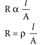
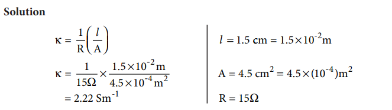
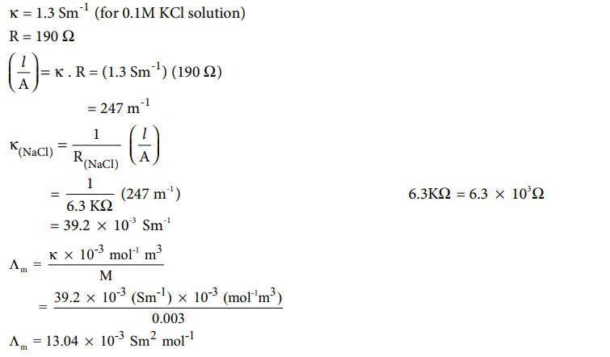

## Conductivity of electrolytic solution
 We have already learnt that when an electrolyte such as sodium chloride, potassium chloride etc... is dissolved in a solvent like water, the electrolyte is completely dissociated to give its constituent ions (namely cations and anions). When an electric field is applied to such an electrolytic solution, the ions present in the solution carry charge from one electrode to another electrode and thereby they conduct electricity. The conductivity of the electrolytic solution is measured using a conductivity cell. (Fig 9.1)
A conductivity cell consists of two electrodes immersed in an electrolytic solution. It obeys Ohm's law like metallic conductor. i.e., at a constant temperature, the current flowing through the cell (I) is directly proportional to the voltage across the cell (V).

i.e., I α V (or) I = V/R => V = IR ⇒ .....(9.1)

Where ‘R’ is the resistance of the solution in ohm (Ω) Here the resistance is the opposition that a cell offers to the flow of electric current through it.

**Figure 9.1 conductivity cell**

Let us consider a conductivity cell in which the electrolytic solution is confined between the two electrodes having cross sectional area (A) and are separated by a distance ‘_l_ ’ . Like the metallic conductor, the resistance of such an electrolytic solution is also directly proportional to the length (_l_ ) and inversely proportional to the cross sectional area (A).

 (9.2)

Where ρ (rho) is called the specific resistance or resistivity, which depends on the nature of the electrolyte.

If l/A=1 m-1= , then, ρ = R . Hence the resistivity is defind as the resistance of an electrolyte

confined between two electrodes having unit cross sectional area and are separated by a unit

distance. The ratio [l/A]is called the cell constant, Unit of resistivity is ohm metre (Ωm).

**Conductivity** 

It is more convenient to use conductance rather than resistance. The reciprocal of the resistance 1/R gives the conductance of an electrolytic solution. The SI unit of conductance is Siemen (S) .

C = 1/R                                ..... (9.3)

Substitute (R) from (9.2) in (9.3)

⇒ i.e., C = 1 . A ρ _l_               ......(9.4)

The reciprocal of the specific resistance (1/p) is called the specific conductance (or)conductivity. It is represented by the symbol κappa (k).

**Fig 9.2 conductivity of a cube of an electrolytic solution**

Substitute 1/p=k in equation (9.4) and rearranging

=>k=c.[l/A]                           .....(9.5)

If A = 1m2 and l= 1m ; then κ = C. The specific conductance is defined as the conductance of a cube of an electrolytic solution of unit dimensions(Fig 9.2). The SI unit of specific conductance is Sm-1 .

**Example**

A conductivity cell has two platinum electrodes separated by a distance 1.5 cm and the cross sectional area of each electrode is 4.5 sq cm. Using this cell, the resistance of 0.5N electrolytic solution was measured as 15 Ω . Find the specific conductance of the solution.

**Solution**

### Molar conductivity(Λm)
Solutions of different concentrations have different number of electrolytic ions in a given
volume of solution and hence they have different specific conductance. Therefore a new quantity called molar conductance (Λm) was introduced.

Let us imagine a conductivity cell in which the electrodes are separated by 1m and having V m3 of electrolytic solution which contains 1 mole of electrolyte. The conductance of such a system is called the molar conductance (Λm)

We have just learnt that the conductance of 1 m3 electrolytic solution is called the specific conductance ( )κ . Therefore, the conductance of the above mentioned V m3 solution ( )mΛ is given by the following expression.

(Λm)= κ × V.....(9.6)

We know that, molarity (M) = Number of moles of solute (n)/Volume of the solution (V in dm3)

Therefore, Volume of the solution containing one mole of solute = 1/M(mol-1 L)

           .....(9.8)

The above relation defines the molar conductance in terms of the specific conductance and the concentration of the electrolyte.

**Example**

Calculate the molar conductance of 0.025M aqueous solution of calcium chloride at 25C. The specific conductance of calcium chloride is 12.04×10-2x Sm-1×

**Evaluate yourself : 1**

Calculate the molar conductance of 0.01M aqueous KCl solution at 25C . The specific conductance of KC_l_ at 25C is 14 114 10 2. × - - Sm 1 .

### Equivalent conductance(Λ) 
Equivalent conductance is defined as the conductance of 'V' m3 of electrolytic solution
containing one gram equivalent of electrolyte in a conductivity cell in which the electrodes are one metre apart.

The relation between the equivalent conductance and the specific conductance is given below.

Λ= (Sm ) 10 (gram equivalent) m N

\-1 -3 -1 3κ × .....(9..9)

Where κ the specific conductance and N is the concentration of the electrolytic solution expressed in normality.

**Evaluate yourself : 2**

The resistance of 0.15N solution of an electrolyte is 50 Ω. The specific conductance of the solution is 2 4. . Sm-1 The resistance of 0.5 N solution of the same electrolyte measured using the same conductivity cell is 480 Ω. Find the equivalent conductivity of 0.5 N solution of the electrolyte. Given that

### Factors affecting electrolytic conductance
 If the interionic attraction between the oppositely charged ions of solutes increases, the
 conductance will decrease.

. Solvent of higher dielectric constant show high conductance in solution. 

. Conductance is inversely proportional to the Viscosity of the medium. i.e., conductivity
increases with the decrease in viscosity. 

. If the temperature of the electrolytic solution increases, conductance also increases. Increase
in temperature increases the kinetic energy of the ions and decreases the attractive force between the oppositely charged ions and hence conductivity increases.

. Molar conductance of a solution increases with increase in dilution. This is because, for a strong electrolyte, interionic forces of attraction decrease with dilution. For a weak electrolyte, degree of dissociation increases with dilution.

### Measurement of conductivity of ionic solutions
 We have already learnt to measure the specific resistance of a metallic wire using a metre bridge in your physics practical experiment. We know that it works on the principle of wheatstone bridge. Similarly, the conductivity of an electrolytic solution is determined by using a wheatstone bridge arrangement in which one resistance is replaced by a conductivity cell filled with the electrolytic solution of unknown conductivity.

In the measurement of specific resistance of a metallic wire, a DC power supply is used. Here, if we apply DC current through the conductivity cell, it will lead to the electrolysis of the solution taken in the cell. So, AC current is used for this measurement to prevent electrolysis.

A wheatstone bridge is constituted using known resistances P, Q, a variable resistance S and conductivity cell (Let the resistance of the electrolytic solution taken in it be R) as shown in the figure 9.3. An AC source (550 Hz to 5 KHz) is connected between the junctions A and C. Connect a suitable detector E (Such as the telephone ear piece detector) between the junctions ‘B’ and ‘D’.

The variable resistance ‘S’ is adjusted until the bridge is balanced and in this conditions there is no current flow through the detector.

**Fig 9.3 Schematic diagram of a conductivity cell in a wheatstone bridge circuit**

Under balanced condition,

   P/Q = R/S

∴ R=P/Q × S.....(9.10)

The resistance of the electrolytic solution (R) is calculated from the known resistance values P, Q and the measured ‘S’ value under balanced condition using the above expression (9.10).

**Conductivity calculation**

Specific conductance (or) conductivity of an electrolyte can be calculated from the resistance value using the following expression
 
 K=1/R(l/A)

The value of the cell constant l/A is usually provided by the cell manufacturer. Alternatively
the cell constant may be determined using KCl solution whose concentration and specific
conductance are known.

**Example** 
The resistance of a conductivity cell is measured as 190 Ω using 0.1M KCl solution(specific conductance of -10.1M KCl is 1.3 Sm ) . When the same cell is filled with 0.003M sodium chloride solution, the measured resistance is 6.3KΩ. Both these measurements are made at a particular temperature. Calculate the specific and molar conductance of NaCl solution.
Given that

