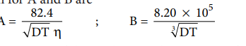

## Variation of molar conductivity with concentration
 Friedrich Kohlraush studied the molar conductance of different electrolytes at different concentrations. He observed that, increase of the molar conductance of an electrolytic solution with the increase in the dilution. One such experimental results is given in the following table for better understanding.

| C oncentration(M) |Molar conductance  (1× 0S m  mol )-3 2- 1 |
|-----|------|------|------|
|       |NaCl |KCl |HCl |
| 0.1 |10.674 |12.896 |39.132 |
| 0.01 |11.851 |14.127 |41.20 |
| 0.0001 |12.374 |14.695 |42.136 |

Based on the above such results, Kohlraush deduced the following empirical relationship between the molar conductance ( )Λm and the concentration of the electrolyte (C).

Λ Λm m - k C=  .....(9.11) 

The above equation represents a straight line of the form y = mx + c . Hence, the plot of Λm Vs C gives a straight line with a negative slope of –k and the y intercept, Λm . Where Λm is called the limiting molar conductivity. i.e., the molar conductance approaches a limiting value in very dilute solutions.

For strong electrolytes such as KCl, NaCl etc., the plot, Λm Vs C , gives a straight line as shown in the graph (9.4). It is also observed that the plot is not a linear one for weak electrolytes.

For a strong electrolyte, at high concentration, the number of constituent ions of the electrolyte in a given volume is high and hence the attractive force between the oppositely charged ions is also high. Moreover the ions also experience a viscous drag due to greater solvation. These factors attribute for the low molar conductivity at high concentration. When the dilution increases, the ions are far apart and the attractive forces decrease. At infinite dilution the ions are so far apart, the interaction between them becomes insignificant and hence, the molar conductivity increases and reaches a maximum value at infinite dilution.

For a weak electrolyte, at high concentration, the plot is almost parallel to concentration axis with slight increase in conductivity as the dilution increases. When the concentration

**Figure 9.4 Variation of molar conductance with concentration**

approaches zero, there is a sudden increase in the molar conductance and the curve is almost parallel to mΛ axis. This is due to the fact that the dissociation of the weak electrolyte increases with the increase in dilution (Ostwald dilution law). Λm
0 values for strong electrolytes can be obtained by extrapolating the straight line, as shown in figure (9.4). But the same procedure is not applicable for weak electrolytes, as the plot is not a linear one, Λm0 values of the weak electrolytes can be determined using Kohlraush's law.

### Debye - Huckel and Onsager equation

We have learnt that at infinite dilution, the interaction between the ions in the electrolyte solution is negligible. Except this condition, electrostatic interaction between the ions alters the properties of the solution from those expected from the free – ions value. The influence of ion-ion interactions on the conductivity of strong electrolytes was studied by Debye and Huckel. They considered that each ion is surrounded by an ionic atmosphere of opposite sign, and derived an expression relating the molar conductance of strong electrolytes with the concentration by assuming complete dissociation. Later, the equation was further developed by Onsager. For a uni – univalent electrolyte the Debye Huckel and Onsager equation is given below.

Λ Λ Λm m 0

m 0 = A + B C− ( ) .....(9.12)

Where A and B are the constants which depend only on the nature of the solvent and temperature. The expression for A and B are

Here, D is the dielectric constant of the medium, η the viscosity of the medium and T the temperature in Kelvin.

### Kohlraush's law

The limiting molar conductance Λm 0 is the basis for kohlraush law. At infinite dilution,

the limiting molar conductivity of an electrolyte is equal to the sum of the limiting molar conductivities of its constituent ions. i.e., the molar conductivity is due to the independent migration of cations in one direction and anions in the opposite direction.

For a uni – univalent electrolyte such as NaCl, the Kohlraush's law is expressed as

Λm 0

NaCl m 0

Na+ m 0

Cl- + ( ) = ( ) ( )λ λ

In general, according to Kohlraush's law, the molar conductivity at infinite dilution for a electrolyte represented by the formula A Bx y , is given below.

Λm 0

AxBy m 0

y+ m 0

x- x + y A B( ) = ( ) ( )λ λ .....(9.13)

Kohlraush arrived the above mentioned relationship based on the experimental observations such as the one as shown in the table. These result show that at infinite dilution each constituent ion of the electrolyte makes a definite contribution towards the molar conductance of the electrolyte irrespective of nature of other ion with which it is associated

| Electrolyte|Λ0m at 298 K|difference
|-----|------|------|
| KCl      |149.86 |23.41|
| Nacl     |126.45 |23.41|
| KBr      |151.92 |23.41|
| NaBr     |128.51 |23.41|
| KNO3     |114.96 |23.41|
|NaNO3     |121.55 |23.41|

**Applications of Kohlrausch's Law**

**1. Calculation of molar conductance at infinite dilution of a weak electrolyte.**

It is impossible to determine the molar conductance at infinite dilution for weak electrolytes experimentally. However, the same can be calculated using Kohlraush’s Law.

For example, the molar conductance of CH COOH,3 can be calculated using the experimentally determined molar conductivities of strong electrolytes HCl, NaCl and CH COONa3 .

| Electrolyte|Λ0m at 298 K|difference
|-----|------|------|
| KBr      |151.92|2.06|
| KCl      |149.86|2.06|
| NaBr     |128.51 |2.06|
| NaCl     |126.45 |2.06|
| LiBr     |117.09|2.06|
| LiCl     |115.03 |2.06|

**2\. Calculation of degree of dissociation of weak electrolytes** 

The degree of dissociation of weak electrolyte can be calculated from the molar conductivity
at a given concentration and the molar conductivity at infinite dilution using the following expression

α = Λm/Λ0m                    .....(9.14)

Calculation of dissociation constant using Λm values. According to Ostwald dilution Law,

Ka = α2C/(1-α)                .....(9.15)

Substitute α value in the above expression ( 9.15)

     Ka=Λm2C/Λo2m(1-Λm/Λmo)

     Ka=Λ2m/Λmo2((Λmo-Λm)/Λmo)

=>   Ka=Λm2C/Λmo(Λmo-Λm)

**3\. Calculation of solubility of sparingly soluble salts**

Substances like AgCl, PbSO4 etc., are sparingly soluble in water. The solubility product of such substances can be determined using conductivity measurements.

Let us consider AgCl as an example

AgCl (s)= Ag^+ + Cl^-

Kap = \[Ag \]\[Cl \]sp + -

Let the concentration of \[Ag \] + be ‘C’ molL–1.

As per the stoichiometry, if \[Ag \] = C, then \[Cl+ −\]also equal to ‘C’ mol L−1 . K =C.C

K = C sp

sp⇒ 2

We know that the concentration (in mol dm-3) is related to the molar and specific conductance by the following expressions

Λo=K×10-3/C(in mol L-1)

(or)

C=K×10-3/Λ

Substitute the concentration value in the relation 

Kap=[k×10-3/Λ]2                 .....(9.17)
