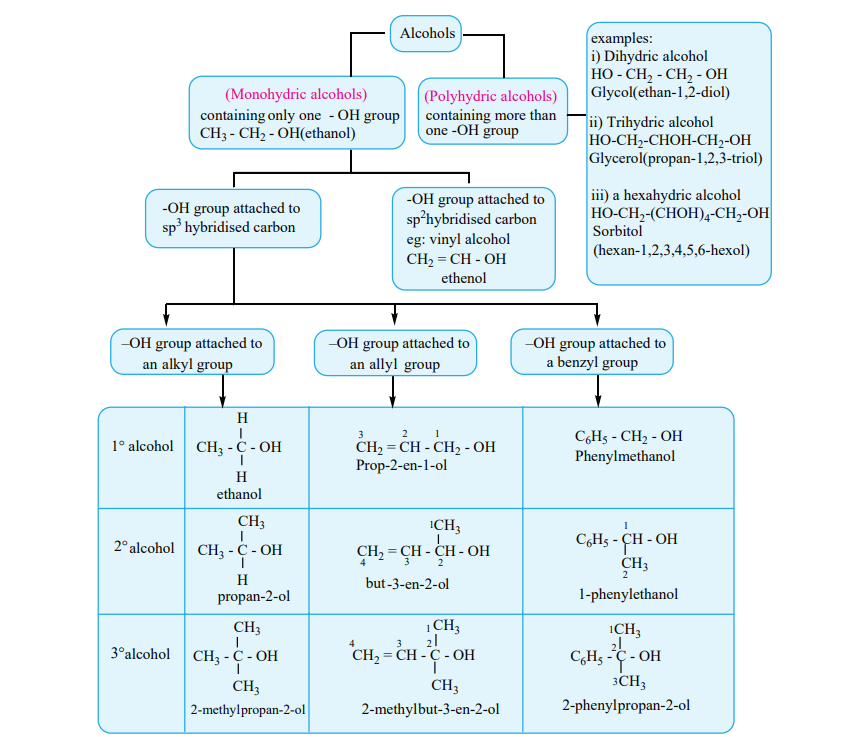

## Classification of alcohols:
 Alcohols can be classified based on the number of hydroxyl groups and the nature of the carbon to which the functional group (–OH) is attached.

<!-- Alcohols

(Monohydric alcohols) containing only one - OH group CH3 - CH2 - OH(ethanol)

(Polyhydric alcohols) containing more than one -OH group

\-OH group attached to sp3 hybridised carbon

\-OH group attached to sp2hybridised carbon eg: vinyl alcohol CH2 = CH - OH

ethenol

–OH group attached to alkyl group

alcohol1 CH3 - C - OH

H

H ethanol

CH2 = CH - CH2 - OH Prop-2-en-1-ol

123 C6H5 - CH2 - OH Phenylmethanol

alcohol CH3 - C - OH

CH3

H propan-2-ol

CH2 = CH - CH - OH

1

23

C6H5 - CH - OH2 4

CH3

\-3-en-2-ol CH32

1

1-phenylethanol

alcohol CH3 - C - OH

CH3

CH3

CH2 = CH - C - OH

1 234

C6H5 - C - OH3

CH3

CH3

2-methylpropan-2-ol 2-methylbut-3-en-2-ol

CH3

CH3

2-phenylpropan-2-ol

1

2

3

examples: i) Dihydric alcohol HO - CH2 - CH2 - OH Glycol(ethan-1,2-diol)

ii) Trihydric alcohol HO-CH2-CHOH-CH2-OH Glycerol(propan-1,2,3-triol)

iii) a hexahydric alcohol HO-CH2-(CHOH)4-CH2-OH Sorbitol (hexan-1,2,3,4,5,6-hexol)

an –OH group attached to

allyl groupan –OH group attached to

a benzyl group

but

XII U11-Hydroxy compounds.indd 105 2/19/2020 5:12:08 PM

www.tntextbooks.in

  

106 -->
