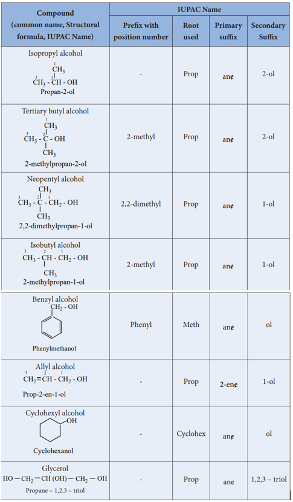

## IUPAC Nomenclature
 We have already learnt about naming the organic compounds according to IUPAC

guidelines in XI standard. Let us recall the basic rules to name the alcohols. 1. Select the longest continuous chain of carbon atoms (root word) containing the functional

group ( -OH ). 2. Number the carbon atoms in the chain so that the carbon bearing the -OH group has the

lowest possible number. 3. Name the substituent (if any) 4. Write the name of the alcohol as below.

Prefix + Root word + Primary suffix + Secondary suffix (substituents) (longest chain) (Saturation /unsaturation) (ol)

**The following table illustrates the IUPAC nomenclature of alcohols.**

<!-- 
**The following table illustrates the IUPAC nomenclature of alcohols.**

**Compound (common name, Structural**

**formula, IUPAC Name)**

**IUPAC Name**

**Prefix with position number**

**Root used**

**Primary suffix**

**Secondary Suffix**

Isopropyl alcohol

CH3 - CH - OH

CH3

Propan-2-ol

3 2

1

\- Prop ane/ 2-ol

Tertiary butyl alcohol

CH3 - C - OH

CH3 3 2

1

CH3

2-methylpropan-2-ol

2-methyl Prop ane/ 2-ol

Neopentyl alcohol

CH3 - C - CH2 - OH

CH3 3 2 1

CH3 2,2-dimethylpropan-1-ol

2,2-dimethyl Prop ane/ 1-ol

Isobutyl alcohol CH3 - CH - CH2 - OH

CH3 2-methylpropan-1-ol

123

2-methyl Prop ane/ 1-ol

XII U11-Hydroxy compounds.indd 106 2/19/2020 5:12:13 PM

www.tntextbooks.in

| C ompound(common name, Structural formula, IUPAC Name) |IUPAC Name |
|------|------|------|------|------|
| Prex with position number |Rootused |Primar y sux |Secondar ySux |
| Isopropyl alcoholCHCH  - CH - OH1 3Propa n-2-ol3 3 2 |- |Prop |ane/ |2-ol |
| Tertiar y butyl alcoholCHCH  - C - OHCH1 32-methylpropan-2-o3 3 2 l3 |2-methyl |Prop |ane/ |2-ol |
| Neopentyl alcoholCHCH  - C - CH - OHCH 3322,2-dimethylpropan-1-ol3 1 2 3 |2,2-dimethyl |Prop |ane/ |1-ol |
| Isobutyl alcoholCH  - CH - CH  - OHCH2-methylpropan-1-o3 3 2 1 2 l3 |2-methyl |Prop |ane/ |1-ol |
  

107

Benzyl alcohol CH2 - OH

Phenylmethanol

Phenyl Meth ane/ ol

Allyl alcohol CH2 CH - CH2 - OH

Prop-2-en-1-ol

123

\- Prop 2-ene/ 1-ol

Cyclohexyl alcohol OH

Cyclohexanol

\- Cyclohex ane/ ol

Glycerol HO CH2 CH (OH) CH2 OH

Propane – 1,2,3 – triol

\- Prop ane 1,2,3 – triol -->

**Evaluate Yourself:**

1\. Classify the following alcohols as 1**∞**, 2**∞**, and 3**∞** and give their IUPAC Names.

a) CH3

Br

b) (C2H5)3COH

c) CH2 = C(Cl)-CH(OH)CH3

d)

e) C

C2H5

CH2 - CH3

HO

OH Br

CH2 CH(OH) CH2 C(CH3)2
108.9 H

2\. Write all the possible isomers of an alcohol having the molecular formula C5H12O5 and give their IUPAC names.

www.tntextbooks.in

| B enzyl alcoholCH  - OH2Phenyl methanol |Phenyl |Meth |ane/ |ol |
|------|------|------|------|------|
| Allyl alcoholCH CH - CH  - OHPr3 op-2-en-1-ol2 2 1 2 |- |Prop |2-ene/ |1-ol |
| Cyclohexyl alcoholOHCyclohexan ol |- |Cyclohex |ane/ |ol |
| Glycerol HO CH CH (OH) CH OHPr2opane – 1,2,3 – triol  2 |- |Prop |ane |1,2,3 – triol |

| CH) COH25 3 |CH(OH) CH C(CH )d)2 3 2 HOC |

 **Structure of the functional group of alcohol.** The structure of -O-H group which is

attached to a sp3 hybridised carbon is similar to the structure of -O-H group attached to a hydrogen in water. i.e., ‘V’ shaped. In such alcohols, one of the sp3 hybridised orbital of

sp3hybidised carbon 

108

oxygen linearly overlap with the sp3 hybridised orbital of carbon to form a C-O , 'σ ' bond and another sp3 hybridised orbital linearly overlap with 1s orbital of hydrogen to form a O-H 'σ ' bond. The remaining two sp3 hybridised orbitals of oxygen are occupied by two lone pairs of electrons. Due to the lone pair – lone pair repulsion, the C-O-H bond angle in methanol is reduced to 108 9. ° from the regular tetrahedral bond angle of 109 5. ° .

**Preparation of alcohols:** We have already learnt that the nucleophilic substitution reactions of alkyl halides with

dilute alkali, conversion of alkenes to alcohols by hydration and the preparation of alcohols using Grignard reagent in XI standard. These reactions are summarised below. 1. **From Alkyl halides:** Alkyl halides on heating with dilute aqueous NaOH gives alcohols. Primary alkyl halides undergo substitution by SN2 reaction. Secondary and tertiary alkyl halides usually undergo nucleophilic substitution by SN1 mechanism.

R-X+NaOH(aq) → R-OH+NaX

If R =t-butyl, the reaction proceeds through the formation of t-butyl carbocation

2\. **From alkenes:** Addition of water across the double bond of an alkene in presence of concentrated sulphuric acid gives alcohols. This addition reaction follows Markownikoff ’s rule.

**Example:** CH3-CH=CH2 +H2O ->CH -CH(OH)-CH propylene

3 2 2 Conc.H SO

3 3 2 4 →

propan-2-ol

3\. **From Grignard reagent:** Nucleophilic addition of Grignard reagent to aldehydes/ketones in presence of dry ether followed by the acid hydrolysis gives alcohols. Formaldehyde gives primary alcohol and other aldehydes give secondary alcohols. Ketones give tertiary alcohols.

**Examples**

C6H5MgBr + HCHO C6H5 OMgBr H2O + Mg(OH) Br

\+ Mg(OH) Br

\+ Mg(OH) Br

C6H5CH2OH Phenyl magnesium bromide

Methanal Phenyl methanol

CH3CH2MgBr + CH3CHO CH3CH2 - C - OMgBr

CH3 H2O

CH3CH2CHCH3

OHEthyl magnesium bromide

Acetaldehyde Ethanal

Butan-2-ol

\+ CH3COCH3 C OMgBr

CH3

CH

H

3

C OH

CH3

CH3

H2O

2-methylhexan-2-ol

n-butyl magnesium bromide

Propanone (Acetone)

2CH3MgBr + H - C - O - CH2 - CH3 CH3 CH CH3 i) ether solvent

ii) H3O+ + Mg

Br OCH2 - CH3

OHO

CH3(CH2)3MgBr CH3(CH2)3 CH3(CH2)3

C

H

H

Formate ester is used to prepare a secondary alcohol with identical alkyl groups **Example**

ethylmethanoate propan - 2 - ol

( )

(Formaldehyde)

Ether

Ether

Ether

H+

H+

H+

XII U11-Hydroxy compounds.indd 108 2/19/2020 5:12:33 PM

www.tntextbooks.in

  

109

4\. **Hydroboration:**

Diborane reacts with an alkene to form trialkyl borane which on treatment with H O2 2 in presence of NaOH gives an alcohol. (Refer reactions of diborane) The overall reaction is hydration of an alkene. This reaction yields an anti-Markownikoff 's product.

6CH3 - CH = CH2 + B2H6 -> 2(CH3 CH2 CH2)3B    Tripropylborane

(CH3 CH2 CH2)3B + 3H2O2 OH-

3CH3 CH2 CH2 OH propan-1-ol

\+ B (OH)3

5\. **Reduction of carbonyl compounds:**

Reduction of aldehydes/ketones with LiAlH4 in the presence of solvents like THF (Tetrahydrofuran) followed by hydrolysis gives alcohols. Unlike other reducing agents such as Raney Ni, Na-Hg/H O,2 the lithium aluminium hydride does not reduce the carbon**–**carbon double bond present in unsaturated carbonyl compound and hence it is a best reagent to prepare unsaturated alcohols.

**Examples**

CH3 - C = O i) LiAlH4

ii) H2O

CH3

CH3 - C - H

CH3

OHacetone propan-2-ol

C H -COOH C H CH OH Benzoic acid

6 5 (i)LiAlH (ii)H O 6 5 2

4

2  →

Phenyl methanol(Benzyl alcohol)

CH COOCH CH3 2 3 (i)LiAlH (ii)H O 3 2

4

2

(ii)H O2

2CH CH OH Ethyl ethanoate

 → Ethanol

(ethyl acetate)

CH -CH3 =CH-CHO CH -CH=CH-CH OH crotonaldehyde

(i)LiAlH 23

4 → crotyl alcohol

(but-2-enal) (but-2-en-1-ol)

When two or more functional groups are present in a molecule a less vigorous sodium borohydride is used as a reducing agent to reduce the more reactive group. For example, if a compound contains both carbonyl and carboxyl group, it preferentially reduces the carbonyl group.

RCOCH CH COOH RCHOH-CH CH COOH2 2 3 + 2 2

NaBH4 H O

 →

4-alkyl- 4- hydroxybutanoic acid

XII U11-Hydroxy compounds.indd 109 2/19/2020 5:12:39 PM

www.tntextbooks.in

  

110

**Preparation of glycol**

We have already learnt that the hydroxylation of ethylene using cold alkaline solution of potassium permanganate (Baeyer’s reagent) gives ethylene glycol.

$\ce{A ->[{text above}][{text below}] B}$

\[
\mathrm{CH_2=CH_2 + H_2O \xrightarrow[\text{Cold alkaline } KMnO_4]{\text{CH_2-CH_2}} \overset{\text{OH}}{\underset{\text{OH}}{\mathrm{|\ |}}} ethene \quad \overset{\text{OH}}{\underset{\text{OH}}{\mathrm{|\ |}}} \quad ethane-1,2-diol}
\]

\[
\chemfig{*6(=-=-=-)}
\]

Cold alkaline KMnO4

CH2 CH2

OH OHethene ethane-1,2-diol

\[O\]

**Preparation of glycerol** Glycerol occurs in many natural fats and it is also found in long chain fatty acids in

the form of glyceryl esters (Triglycerides). The alkaline hydrolysis of these fats gives glycerol and the reaction is known as saponification.

CH2 O C (CH2)14 CH3

O

CH O C (CH2)14 CH3

O

CH2 O C (CH2)14 CH3

O

\+ 3NaOH

triglyceride)

CH OH C

OH

O

\+ 3NaO (CH2)14 CH3

CH2 OH

CH2

Glycerol

Sodium palmitate

(propane-1,2,3-triol)

Sodiumhexadeconoate

Glycerylpalmitate (a

**D**

**Evaluate Yourself?** 1\. Suggest a suitable carbonyl compound for the preparation of pent-2-en-1-ol using

LiAlH4 .

2\. 2-methylpropene H SO /H O2 4 2 → ? 3. How will you prepare the following using Grignard reagent.

i) t-butyl alcohol ii) allyl alcohol

**Methods to differentiate primary, secondary and tertiary alcohols.** The following tests are used to distinguish between 1 , 2 and 3° ° ° alcohols.

**a) Lucas test:** When alcohols are treated with Lucas agent (a mixture of concentrated HCl and anhydrous

ZnCl2 ) at room temperature, tertiary alcohols react immediately to form a turbidity due to the formation of alkyl chloride which is insoluble in the medium. Secondary alcohols react within 10 minutes to form a turbidity of alkyl chloride where primary alcohols do not react at room temperature.

XII U11-Hydroxy compounds.indd 110 2/19/2020 5:12:43 PM

www.tntextbooks.in

  

111

CH3 - C - OH + HCl CH3 -C - Cl + H2O

CH3

CH3

CH3

CH3

CH3 - CH - CH3 + HCl CH3 CH + H2O

OH

CH3

anhydrous ZnCl2

CH3- CH2 - OH + HCl No reaction at room temperature

Turbidity appears only on heating

anhydrous ZnCl2

anhydrous ZnCl2

2-methylpropan-2-ol

propan-2-ol

ethanol

2 -chloro-2-methylpropane (immediate appearance of turbidity)

2 -chloropropane (slow appearance of turbidity)

Cl

( )

**b) Victor Meyer’s test:**

This test is based on the behaviour of the different nitro alkanes formed by the three types of alcohols with nitrous acid and it consists of the following steps.

i) Alcohols are converted into alkyl iodide by treating it with I /P2 .

ii) Alkyl iodide so formed is then treated with AgNO2 to form nitro alkanes.

ii) Nitro alkanes are finally treated with HNO2 (mixture of NaNO HCl2 / ) and the resultant solution is made alkaline with KOH.

**Result:**

• Primary alcohol gives red colour • Secondary alcohol gives blue colour.

• No colouration will be observed in case of tertiary alcohol.

XII U11-Hydroxy compounds.indd 111 2/19/2020 5:12:46 PM

www.tntextbooks.in

  

112

CH3 CH2 OH

Ethanol

CH3 CH2 I

Iodoethane

AgNO2

CH3 CH2 NO2

HONO

Red Colour

CH CH3 CH3

HONO

HONO

P/I2P/I2

AgNO2

AgNO2CH3 CH

NO2

CH3 C CH3

NO2

Blue Colour

OH

CH3 CH CH3

I

CH3

NO

CH3 C OH

P/I2

CH3

CH3

CH3 C I CH3

CH3

CH3 C NO2

CH3

CH3

No reaction

1 alcohol 2 alcohol 3 alcohol

propan-2-ol 2-methylpropan-2-ol

2-Iodo-2-methylpropane

2-methyl-2-nitropropane

(No colouration with KOH)

2-Iodopropane

Nitroethane 2-nitropropane

2-nitro-2-nitroso propane

CH3 C NO2

N OH

CH3 C NO2

N OK

OHK OHK

CH3 CH2 OH

Ethanol

CH3 CH2 I

Iodoethane

AgNO2

CH3 CH2 NO2

HONO

Red C lour

CH CH3 CH3

HONO

HONO

P/I2P/I2

AgNO2

AgNO2CH3 CH

NO2

CH3 C CH3

NO2

Blue C lour

OH

CH3 CH CH3

I

CH3

NO

CH3 C OH

P/I2

CH3

CH3

CH3 C I CH3

CH3

CH3 C NO2

CH3

CH3

No reaction

1 alcohol 2 alcohol 3 alcohol

propan-2-ol 2-methylpropan-2-ol

2-Iodo-2-methylpropane

2-methyl-2-nitropropane

(No c louration with KOH)

2-Iodopropane

Nitroethane 2-nitropropane

2-nitro-2-nitroso propane

CH3 C NO2

N OH

CH3 C NO2

N OK

OHK OHK

CH3 CH2 OH

Ethanol

CH3 CH2 I

Iodoethane

AgNO2

CH3 CH2 NO2

H NO

Red Colour

CH CH3 CH3

H NO

H NO

P/I2P/I2

AgNO2

AgNO2CH3 CH

NO2

CH3 C CH3

NO2

Blue Colour

OH

CH3 CH CH3

I

CH3

NO

CH3 C OH

P/I2

CH3

CH3

CH3 C I CH3

CH3

CH3 C NO2

CH3

CH3

No reaction

1 alcohol 2 alcohol 3 alcohol

ropan-2-ol 2-methyl ropan-2-ol

2-Iodo-2-methyl ropane

2-methyl-2-nit ropane

(N colouration with KOH)

2-Iod ropane

Nitroethane 2-nit ropane

2-nitro-2-nitroso ropane

CH3 C NO2

N OH

CH3 C NO2

N OK

OHK OHK

**Properties of alcohols Physical properties**

i. Lower alcohols are colourless liquids and the higher members are waxy solids.

ii. They have higher boiling points than the corresponding other organic compounds such as alkanes, aldehydes, ethers etc., this is due to the presence of intermolecular hydrogen bonding present in alcohols.

iii. Among isomeric alcohols primary alcohols have higher boiling point and the tertiary alcohols have lower boiling points.

XII U11-Hydroxy compounds.indd 112 2/19/2020 5:12:47 PM

www.tntextbooks.in

| 1 alcoholCH CH OH3 2Ethano lP/I2CH CH I3 2Iodoethan eAgNO2CH CH NO3 2 2NitroethaneHONOCH C NO3 N 2OHK OHCH C NO3 N 2OKRed Colour |22 al alcohocohol  l CHCH CHCH CHCH3 3 OHOH 3 3propan-2-olpropan-2-olP/P/I I2 2CHCH CHCH CHCH3 3 I I 3 32-Iodopropane2-IodopropaneAgNOAgNO2 2CHCH CHCH CHCHNONO3 3 3 32-nitropropane2-nitropropane2 2HONOHONONONOCHCH C C CHCH3 3 NONO 3 32-nitro-2-nitros2-nitro-2-nitros2 2 o opropanepropaneKKOHOHBlueBlue Colour Colour |33  al3  alcoho  alcohocohol l lCHCHCHCHCHCH C CCOHOHOH3 3 3CHCHCH3 3 32-methylpropan-2-ol2-methylpropan-2-ol2-methylpropan-2-ol3 3 3P/P/I P/I ICHCHCH2 2 2CHCHCH C CCI I I3 3 3CHCHCH3 3 32-Iodo-2-methylpropane2-Iodo-2-methylpropane2-Iodo-2-methylpropane3 3 3AgNOAgNOAgNO2 2 2CHCHCHCHCHCH C CCNONONO3 3 3CHCHCH3 3 32-methyl-2-nitropropane2-methyl-2-nitropropane2-methyl-2-nitropropane3 3 3 2 2 2HONOHONOHONONo reactionNo reactionNo reaction(No colouration with KOH)(No colouration with KOH)(No colouration with KOH) |
  

113

iv. The lower members are highly soluble in water due to the formation of intermolecular hydrogen bonding with water.

R δ-

O δ- δ-

O

H δ+δ+

δ+

O

HR

H

H

**Table : Boiling point of alcohols in comparision with other organic compounds.**

| S.No. | Compound         | Molecule Formula   | Molar Mass | Boiling Point (K) |
|-------|------------------|--------------------|------------|-------------------|
| 1     | Butane           | CH3-CH2-CH2-CH3    | 58         | 272.5             |
| 2     | Propanal         | CH3-CH2-CHO        | 58         | 322               |
| 3     | Methoxyethane    | CH3-O-CH2-CH3      | 60         | 283.8             |
| 4     | Propan-1-ol       | CH3-CH2-CH2-OH     | 60         | 370.4             |
| 5     | Propan-2-ol       | CH3-CH(OH)-CH3     | 60         | 355.5             |

**Chemical properties of alcohols Nucleophilic substitution reactions of alcohols**

Alcohol has a strong basic leaving group (OH–). So, –OH group is first converted into

− +

OH2 group by adding an acid. The − +

OH2 group in the protonated alcohol can be easily

displaced by a nucleophile such as Br- to give alkyl halides. **Example**: Alcohols undergo nucleophilic substitution reaction with hydro halic acids to form

alkyl halides. In case of tertiary alcohols heating is required.

CH3 CH2 OH HBr - H2O

CH3 CH2 Br

Ethanol Bromoethane

**Alkyl halide formation from primary alcohols follow** SN 2 **mechanism**

**Example**

CH3 CH2 O H H - Br -Br-

CH3 CH2 O H CH3

H

CH2 Br + H2O

Brethanol bromoethane

Nucleophilic attack of Br− and leaving of H O2 takes place simultaneously.

XII U11-Hydroxy compounds.indd 113 2/19/2020 5:12:57 PM

www.tntextbooks.in

| δ- |δ- |

| S.No. |C ompound |Mole cule formula |Molar mass |( )Boiling point  K |
|------|------|------|------|------|
| 1 |Butane |CH -CH -CH -CH3 2 2 3 |58 |272.5 |
| 2 |Propanal |CH -CH -CHO3 2 |58 |322 |
| 3 |Methoxyethane |CH -O-CH -CH3 2 3 |60 |283.8 |
| 4 |Prapan – 1- ol |CH -CH -CH -OH3 2 2 |60 |370.4 |
| 5 |Propan – 2- ol |CH -CH(OH)-CH3 3 |60 |355.5 |
  

114

**Alkyl halide formation of tertiary alcohols follow** SN1**mechanism.**

**Example**

C

CH3

CH3

CH3

O .. .. H

H Br C

CH3

CH3

CH3

O H C H3C CH3

CH 3

Br

C

CH3

H3C

CH3

BrC H3C CH2

CH3

HBr

Addition reaction

(elimination)

H

\-Br-

2-methyl-2-propanol

2-methylprop-1-ene 2-bromo-2-methylpropane

Slow Fast

–H+

Here, the carbocation formed can undergo elimination to give an alkene. However the alkene can again undergo addition reaction with HBr to give the substituted product.

**Conversion of alcohol into alkyl halides: Other methods**

Alcohols can also be converted into an alkyl halides using PCl PBr3 , 3 .

CH3CH2 OH PCl3

pyridine CH3CH2 Cl

ethanol chloroethane **Mechanism :** SN 2 reaction on phosphorous tri chloride

3 CH3 CH2 O ..

H + P

Cl

Cl

Cl -Cl

CH3 CH2 O PCl2

H

CH3 CH2 O PCl2

Cl

CH3 CH2 Cl

..

..

O PCl2

N..

+

chloroethane

The conversion of an alcohol to alkyl halide can also be effected using thionyl chloride

CH3 OH + SOCl2 Pyridine

CH3 Cl HCl ++ SO2

Methanol Thionyl chloride

chloromethane

This reaction also follows the SN i mechanism in the presence of pyridine.

XII U11-Hydroxy compounds.indd 114 2/19/2020 5:13:02 PM

www.tntextbooks.in

| 3(e l imination)–H+ |
  

115

**2\. Elimination reactions of alcohols** When alcohols are heated with a suitable dehydrating agents like sulphuric acid, the H

and OH present in the adjacent carbons of alcohols are lost, and it results in the formation of a carbon – carbon double bond. Phosphoric acid, anhydrous ZnCl2 , alumina etc., can also be used as dehydrating agents.

**Example** CH3 CH2 OH H2SO4

CH2 = CH2 + H2O 443 K

**Mechanism** Primary alcohols undergo dehydration by E2 mechanism

CH3 CH2 O .. .. H

H SOO 3H CH2 CH2 O H

HH

CH2= CH2 + Ethene

H2O

ethanol – OSO3H

\- - H+

Tertiary alcohols undergo dehydration by E1 mechanism. It involves the formation of a carbocation. **Protonation of alcohol**

**Step 1 :** CH3 C O .. .. H OSO3HH

CH3

CH3

CH3 C O H

CH3

CH3 H – OSO3H

\-

**Step 2 :** Dissociation of oxonium ion to form a carbocation.

CH3 C O H

CH3

CH3 H

Slow C

H3C CH3

CH3

\+ H2O

**Step 3 :** Deprotonation of carbocation to form an alkene

C

H3C CH2

CH3

H

fast C

H3C CH2

CH3

2 - methylprop - 1- ene

– H+

**Order of reactivity:** The relative reactivities of alcohols in the dehydration reaction follows the order

primary < secondary < tertiary

XII U11-Hydroxy compounds.indd 115 2/19/2020 5:13:08 PM

www.tntextbooks.in

  

116

**Evaluate yourself**

Identify the products in the following reactions. Write their IUPAC names and mention the mechanism involved in the reactions.

i) cyclopentanol H2SO4

∆ ? ii) butan–1–ol

NaBr

H2SO4

?

iii) neopentyl alcohol PCl5 ?

**Saytzeff ’s rule** During intramolecular dehydration, if there is a possibility to form a carbon – carbon

double bond at different locations, the preferred location is the one that gives the more (highly) substituted alkene i.e., the stable alkene.

For example, the dehydration of 3,3 – dimethyl – 2- butanol gives a mixture of alkenes. The secondary carbocation formed in this reaction undergoes rearrangement to form a more stable tertiary carbocation.

CH3 CH3C OSO3HH

OSO3H

CH3

CH3

CH3 C CH CH3

CH3

CH3

O HH

CH

HO

\- H2O

\- H

CH3 C CH

CH3

CH3

CH

H

2 CH

H

2 C

CH3

C

H

CH3

CH3 Methyl shift

C C H3C

H3C

CH3

CH3 CH3 C

CH3

CH3

CH = CH2

2,3 - dimethylbut - 2- ene

(64%)

H2C C CH3

CH (CH3)2

3,3 - dimethylbut - 1- ene

(3%)

2,3 - dimethylbut -1-ene

(33%)

\+ - H +

\- H + Elimination)Elimination)

(20 Carbocation)(30 Carbocation)

(two alkyl Substitution) (four alkyl Substitution) (one alkyl Substitution)

(a) (b)

\-

XII U11-Hydroxy compounds.indd 116 2/19/2020 5:13:09 PM

www.tntextbooks.in

| Elimination) |
  

117

**Evaluate yourself :** What is the major product obtained when 2,3 – dimethyl pentan -3 – ol is heated in the presence of H SO2 4 .

**Oxidation of alcohols** The important reactions of alcohols are their oxidation to give carbonyl compounds.

The commonly used oxidising agent is acidified sodiumdichromate. Oxidation of primary alcohols give an aldehyde which on further oxidation gives the carboxylic acids. To stop the oxidation reaction at the aldehyde / ketone stage, pyridinium chlorochromate (PCC) is used as an oxidising agent.

**Example**

CH3 CH2 OH Na2Cr2O7

(O) CH3 CHO

Na2Cr2O7

(O) CH3 COOH

ethanol ethanal ethanoicacid

acidified acidified

CH3 CH CH3 Na2Cr2O7

(O) OH

CH3 C CH3

O

Na2Cr2O7

(O) CH3 C OH

O Propan - 2- ol Propanone ethanoicacid

acidified acidified

CH3 CH2 CH2 OH CH3 CH2 CHO PCC

Propan - 1- ol Propanal

Tertiary alcohols do not undergo oxidation reaction under normal conditions, but at elevated temperatures, under strong oxidising agent cleavage of C –C bond takes place to give a mixture of carboxylic acid.

**Swern oxidation** In this method, dimethyl sulfoxide (DMSO) is used as the oxidising agent, which converts

alcohols to ketones / aldehydes. In this method an alcohol is treated with DMSO and oxalyl chloride followed by the

addition of triethylamine.

CH3 CH CH3 + H3C

OH

S CH3 + Cl C C Cl Propan - 2- ol DMSO Oxalylchloride

CH3 C CH3 + (CH3)2 S + CO2 + CO + 2HCl

O O O

O

propanone

Et3N

XII U11-Hydroxy compounds.indd 117 2/19/2020 5:13:13 PM

www.tntextbooks.in

  

118

**Biological oxidation**

The fermentation of the food consumed by an animal produces alcohol. To detoxify the alcohol, the liver produces an enzyme called alcohol dehydrogenase (ADH). Nicotinamide adenine dinucleotide (NAD) present in the animals act as an oxidising agent and ADH catalyses the oxidation of toxic alcohols into non-toxic aldehyde.

CH3 CH2 OH + NAD+ ADH CH3CHO + NADH + H+

ethanol ethanal

**Catalytic dehydrogenation**

When the vapours of a primary or a secondary alcohol are passed over heated copper at 573K, dehydrogenation takes place to form aldehyde or ketone.

CH3 CH2 OH Cu

573 K CH3 CHO

ethanol ethanal

CH3 CH CH3

OH

Cu

573 K CH3 C CH3

O Propan - 2- ol propanone

Tertiary alcohols undergo dehydration reaction to give alkenes.

CH3 C OH

CH3

Cu

573 K

CH3

C = CH2

2 - methylpropan - 2- ol 2 - methylprop - 1- ene

H3C

H3C

**Esterification**

Alcohols react with carboxylic acids in the presence of an acid to give esters

**Example**

CH3 CH2 OH HO C CH3+

O H+

CH3 C O

O

CH2 CH3

ethanol ethanoicacid ethylethanoate

XII U11-Hydroxy compounds.indd 118 2/19/2020 5:13:16 PM

www.tntextbooks.in

  

119

**Reactions of Glycol**

Ethylene glycol contains two primary alcoholic groups and it exhibits the usual reactions of hydroxyl group. Like other primary alcohols, it reacts with metallic sodium to form monosodium glycolate and disodium glycolate. The hydroxyl groups can be converted to the halide groups by treating glycol with halic acid (or with PCl / PCl / SOCl5 3 2 . )

When ethylene glycol is treated with HI or P/I2, 1,2 – diiodoethane is first formed which decomposes to give ethene.

CH2 OH

CH2 OH

PI3 CH2

CH2

I

I

CH2

CH2

ethane - 1,2 - diol 1,2 - diiodoethane ethene

\-I2

On heating with conc HNO3 in the presence of Con. H2SO4, ethylene glycol forms dinitroglycol.

CH2 OH

CH2 OH

ethane - 1,2 - diol

2 HNO3

Conc H2SO4

CH2 O

CH2 O

NO2

NO2

1,2 - dinitroxyethene (dinitroglycol)

**Dehydration reaction**

Ethyleneglycol undergoes dehydration reaction under different conditions to form different products.

1\. When heated to 773K, it forms epoxides.

CH2 OH

CH2 OH

773 K CH2

CH2- H2O

Oxirane( 1,2 - epoxyethene

)

O

ethane - 1,2 - diol

2\. When heated with dilute sulphuric acid (or) anhydrous ZnCl2 under pressure in a sealed tube, it gives acetaldehyde.

CH2 OH

CH2 OH

anhydrous ZnCl2

\- H2O

CH2

CH O H

CH3

CHO

Ethanal Vinylalcohol ethenolethane -1,2 - diol ( )

Tautomerisation

XII U11-Hydroxy compounds.indd 119 2/19/2020 5:13:22 PM

www.tntextbooks.in

  

120

3\. When distilled with Conc. H SO2 4 , glycol forms dioxane

H O CH2 CH2 OH

HO CH2 CH2 OH

Con H2SO4

\-2H2O

CH2

CH2

O

CH2

CH2 O

ethane - 1,2 - diol 1,4 - dioxane

**Oxidation of glycol**

On oxidation, glycol gives a variety of products depending on the nature of oxidizing agent and other reaction conditions.

i) When nitric acid (or) alkaline potassium permanganate is used as the oxidizing agent, the following products are obtained.

CH2OH

CH2OH

CHO

CH2OH

\[O\] \[O\] \[O\] \[O\]COOH

CH2OH

COOH

CHO

COOH

COOH

\[O\]

CHO

CHO

Glycolic acid Glyoxalic acid Oxa ic acid

\[O\]

Glyoxal

Glycolicaldehyde l 2-hydroxy ethanal 2-hydroxy ethanoic

acid formyl methanoic

acid ethane-1,2 dioic

acid

ethane-1,2-dial

ii) **Oxidation of glycol with periodic acid**

Ethylene glycol on treatment with periodic acid gives formaldehyde. This reaction is selective for vicinal 1,2 – diols and it proceeds through a cyclic periodate ester intermediate.

CH2OH

CH2OH

\+ HIO4

CH2

CH2

H+/H2O O

O

I OH H - C - H

\+ H - C - H

O

\+ HIO3

Formaldehyde

O

O

O

XII U11-Hydroxy compounds.indd 120 2/19/2020 5:13:25 PM

www.tntextbooks.in

  

121

**Reaction of Glycerol**

**Nitration:** Glycerol reacts with concentrated nitric acid in the presence of concentrated sulphuric acid to form TNG (nitroglycerine).

CH2 OH

CH OH

CH2 OH

\+ 3 HONO2 CH O

CH2 O NO2

NO2

CH2 O NO2

Con H2SO4

\-3H2O

1,2,3 - trinitroxy propanePropan - 1,2,3 - triol glycerol

**Dehydration**

When glycerol is heated with dehydrating agents such as Con H SO ,KHSO 2 4 4

etc….,

it undergoes dehydration to form acrolein.

CH2 OH

CH OH

CH2 OH

CH

CH2

CHO

Prop - 2- enal (acrolein)

KHSO4

Propane - 1,2,3 - triol

**Oxidation**

Glycerol can give rise to a variety of oxidation products depending on the nature of the oxidising agent used for oxidation.

a) Oxidation of glycerol with dil. HNO3 gives glyceric acid and tartronic acid.

b) Oxidation of glycerol with Conc. HNO3 gives mainly glyceric acid.

c) Oxidation of glycerol with bismuth nitrate gives as meso oxalic acid.

d) Oxidation of glycerol with Br2/H2O (or) NaOBr (or) Fenton's reagent (FeSO4 + H2O2) gives a mixture of glyceraldehyde and dihydroxy acetone(This mixture is named as glycerose).

e) On oxidation with HIO4 or Lead tetra acetate (LTA) it gives formaldehyde and formic acid.

f) Acidified KMnO4 oxidises glycerol into oxalicacid.

XII U11-Hydroxy compounds.indd 121 2/19/2020 5:13:28 PM

www.tntextbooks.in

  

122

CH2OH

CHOH \[O\]

\[O\]

Glyceraldehyde Glyceric acid

Dihydroxyacetone

CH2OH

CH2OH

CH2OH

CHOH

CH2OH

\[O\]

\[O\]

Glycerol

Mesooxalic acid

\[O\]

\[O\]

Tart onic acidr

CHO

C O C O

CHOH

CH2OH

COOH

COOH

COOH

COOH COOH

COOH

CHOH

COOH

(2,3-dihydroxypropanal)

(1,3-dihydroxypropan -2-one)

(2-Oxopropane -1,3 dioic acid)

(2,3-dihydroxypropanoic acid)

(2 hydroxypropane- 1,3-dioic acid)

Oxalic acid (ethan-1,2-dioic acid)

**Uses of alcohols Uses of methanol :**

1\. Methanol is used as a solvent for paints, varnishes, shellac, gums, cement, etc. 2. In the manufacture of dyes, drugs, perfumes and formaldehyde.

**Uses of ethanol:** 1\. It is also used in the preparation of

a) Paints and varnishes. b) Organic compounds like ether, chloroform, iodoform, etc., c) Dyes, transparent soaps.

2\. As a substitute for petrol under the name power alcohol used as fuel for aeroplane 3. It is used as a preservative for biological specimens.

**Uses of ethylene glycol:** 1\. Ethylene glycol is used as an antifreeze in automobile radiator 2. Its dinitrate is used as an explosive with TNG.

**Uses of glycerol** 1\. Glycerol is used as a sweetening agent in confectionary and beverages. 2. It is used in the manufacture of cosmetics and transparent soaps. 3. It is used in making printing inks and stamp pad ink and lubricant for watches and clocks. 4. It is used in the manufacture of explosive like dynamite and cordite by mixing it with

china clay

XII U11-Hydroxy compounds.indd 122 2/19/2020 5:13:28 PM

www.tntextbooks.in

  

123

**Acidity of alcohols**

According to Bronsted theory, an acid is defined as a proton donor and the acid strength is the tendency to give up a proton. Alcohols are weakly acidic and their acidity is comparable with water. Except methanol, all other alcohols are weaker acid than water. The K

a value for

water is 1 8 10 16

. × − where as for alcohols, the K a value in the order 10

18 16− − to 10 .

Alcohols react with active metals such as sodium, aluminium etc… to form the corresponding alkoxides with the liberation of hydrogen gas and similar reaction to give alkoxide is not observed in the reaction of alcohol with NaOH.

2C H - OH + 2Na 2C H ONa + H 2 5 2 5 2

→ ↑

The above reaction explains the acidic nature of alcohols.

**Comparison of acidity of 1∞, 2∞and 3∞ alcohols**

The acidic nature of the alcohol is due to the polar nature of O –H bond. When an electron withdrawing -I groups such as -Cl, - F etc… is attached to the carbon bearing the OH group, it withdraws the electron density towards itself and thereby facilitating the proton donation. In contrast, the electron releasing group such as alkyl group increases the electron density on oxygen and decreases the polar nature of O – H bond, Hence it results in the decrease in acidity. on moving from primary to secondary and tertiary alcohols, the number of alkyl groups which attached to the carbon bearing -OH group increases, which results in the following order of acidity.

**1∞ alcohol > 2∞ alcohol > 3∞ alcohol**

CH3 CH2 OH

16 aK 1.3 10 

CH O H

H3C

H3C 17

aK 3.2 10 

CH OH

H3C

H3C

H3C

18 aK 1 10 

For example

Alcohols can also act as a Bronsted bases. It is due to the presence of unshared electron pairs on oxygen which make them proton acceptors.

CH3 CH2 O ..

H O CH3 CH2 O H

H

\+ OH+ H H

XII U11-Hydroxy compounds.indd 123 2/19/2020 5:13:36 PM

www.tntextbooks.in

|------|------|

  

124

**Acidity of Phenol** Phenol is more acidic than aliphatic alcohols. Unlike alcohols it reacts with bases like

sodium hydroxide to form sodium phenoxide. This explains the acidic behaviour of phenol.let us consider the aqueous solution of phenol in which the following equilibrium exists.

C6H5 OH + H.OH C6H5 O + H3O

K a value for the above equilibrium is 1×10 at 25 C

\-10 o . This Ka value indicates that it is more acidic than aliphatic alcohols. This increased acidic behaviour can be explained on the basis of the stability of phenoxide ion. We have already learnt in XI standard that the phenoxide is more stabilised by resonance than phenol.

In substituted phenols, the electron withdrawing groups such as -NO ,-Cl 2

enhances the acidic nature of phenol especially when they are present at ortho and para positions. In such cases,there is a possibility for the extended delocalisation of negative charge on the phenoxide ion. On the other hand the alkyl substitued phenols show a decreased acidity due to the electron releasing +I effect of alkyl group.

**Table: pKaValues of some alcohols and phenols**

| **S.No.** | **Compound**          | **pKa Value** |
|-----------|------------------------|---------------|
| 1         | methanol               | 15.5          |
| 2         | ethanol                | 15.9          |
| 3         | propan – 2- ol         | 16.5          |
| 4         | 2 – methyl propan 2 - ol| 18.0          |
| 5         | Cyclohexanol           | 18.0          |
| 6         | Phenol                 | 10.0          |
| 7         | o – nitrophenol        | 7.2           |
| 8         | p – nitrophenol        | 7.1           |
| 9         | m - nitrophenol        | 8.3           |
| 10        | o – cresol             | 10.2          |
| 11        | m – cresol             | 10.1          |
| 12        | p – cresol             | 10.2          |

XII U11-Hydroxy compounds.indd 124 2/19/2020 5:13:41 PM

www.tntextbooks.in

| S.No. |C ompound |ValuepKa |
|------|------|------|
| 1 |methanol |15.5 |
| 2 |ethanol |15.9 |
| 3 |propan – 2- ol |16.5 |
| 4 |2 – methyl propan 2 - ol |18.0 |
| 5 |Cyclohexanol |18.0 |
| 6 |Phenol |10.0 |
| 7 |o – nitrophenol |7.2 |
| 8 |p – nitrophenol |7.1 |
| 9 |m - nitrophenol |8.3 |
| 10 |o – cresol |10.2 |
| 11 |m – cresol |10.1 |
| 12 |p – cresol |10.2 |
  

125

**Phenols:**

Phenols are organic compounds in which a -OH group is directly attached to a benzene ring. The carbon bearing the -OH group is sp2 hybridized.

**Table: Classification of phenols**

Monohydric Phenol

p-cresol

4-methyl phenol

o -cresol

2-methyl phenol

OH

CH3

Monohydric phenols

Common Name: Phenol

:IUPAC Name Phenol

OH

m-cresol

3-methyl phenol

OH

CH3

OH

CH3

Dihydric Phenol

Dihydric phenols

Common Name: Catechol Resorcinol Quinol

1,2-dihydroxybenzene 1,3-dihydroxybenzene 1,4-dihydroxy benzene

OH

OH

OH

OH

OH

OH

IUPAC Name:

Trihydric Phenol

Trihydric phenols

1,2,3-tri hydroxybenzene 1,2,4-tri hydroxy benzene 1,3,5-tri hydroxy benzene

OH

OH

OH

OH

OH

OH

OH

OHHO

Pyrogallol HydroxyquinolCommon Name:

IUPAC Name:

Phloroglucinol

Substituted phenol

Substituted phenols

o-amino phenol o-hydroxy Benzaldehyde

p-hydroxy benzoic acid

Orcinol(or) 3,5-Dihydroxy

OH

NH2

OH

CHO OHHO

OH

COOH

CH3

toluene (salicylaldehyde)

XII U11-Hydroxy compounds.indd 125 2/19/2020 5:13:44 PM

www.tntextbooks.in

| Monohydric Phenol |Monohydric phenol sOHOH OH OHCH3 CHCHCommon Name: Phenol o- cresol m-cresol 3 p-cresolIUPAC Name : Phenol 2-methyl phenol 3-methyl phenol 4-methyl 3 phenol |
|------|------|
| Dihydric Phenol |Dihydric phenol sOH OH OHOHOHOHCommon Name:C atechol Resorcinol QuinolIUPAC Name: 1,2- dihydroxy be nzen e1 ,3-dihydroxy be nzen e1 ,4-dihydroxy benzen |
| Trihydric Phenol |Trihydric phenol sOH OH OHOH OHOH HO OHOHCommon Name: Pyroga ll ol Hydroxyquino l PhloroglucinolIUPAC Name: 1,2,3-tri hydrox y benzen e1 ,2,4-tri hydrox y benzen e1 ,3,5-tri hydroxy benzen |
| Substitutedphenol |Substituted phe nolsOH CHOH OH3NH CHO HO OHCOOH2 Orcinol(or)o-hydrox y p-hydroxy 3,5-Dihydrox yo-amino pheno l Be nzaldehyde benzoic acid toluen e |
  

126

**Preparation of Phenols a) From halo arenes(Dows process)**

When Chlorobenzene is hydrolysed with 6-8% NaOH at 300 bar and 633K in a closed vessel,sodium phenoxide is formed which on treatment with dilute HCl gives phenol.

Chlorobenzene

633K

300 bar

Cl

\+ NaOH

Sodium phenoxide

ONa

Phenol

OH

\+ NaCl HCl

**b)** **From benzene sulphonic acid**

Benzene is sulphonated with oleum and the benzene sulphonic acid so formed is heated with molten NaOH at 623K gives sodium phenoxide which on acidification gives phenol.

Benzene Sulphonic acid

SO3H

NaOH HCl

Phenol

OH

Sodium phenoxide

ONa

623 K

**c)** **From aniline**

Aniline is diazotized with nitrous acid ( NaNO +HCl2 ) at 273-278K to give benzene diazonium chloride which on further treatment with hot water in the presence of mineral acid gives phenol.

Aniline

NH2

Benzene diazonium chloride

N

Phenol

OHN Cl

HNO2 273-278K

H2O N2 ++ HCl

**d)** **From cumene**

A mixture of benzene and propene is heated at 523K in a closed vessel in presence of H PO3 4 catalyst gives cumene (isopropylbenzene). On passing air to a mixture of cumene and 5% aqueous sodium carbonate solution, cumene hydro peroxide is formed by oxidation. It is treated with dilute acid to get phenol and acetone. Acetone is also an important byproduct in this reaction.

XII U11-Hydroxy compounds.indd 126 2/19/2020 5:13:48 PM

www.tntextbooks.in

  

127

Benzene

\+ CH3CH = CH2 H3PO4

523 K Phenol

\+ CH3COCH3

CumeneCumene hydroperoxide

Air O2

5% aq Na2CO3

OHC H

CH3

H3C O O H

acetone

C

CH3

H3C

Propene

H2SO4

**Physical Properties** Phenol is colourless, needle shaped crystal, hygroscopic, corrosive and poisonous. It turns

pink on exposure to air and light. The simplest phenols are liquids or low melting solids, they have quite high boiling points. Phenol is slightly soluble in water because of hydrogen bonding. However other substituted phenols are essentially insoluble in water.

**Chemical Properties:** Reactions involving -OH group.

**a)** **Reaction with Zn dust:** Phenol is converted to benzene on heating with zinc dust. In this reaction the hydroxyl

group which is attached to the aromatic ring is eliminated. OH

\+ Zn + ZnO

phenol benzene

**b)** **Reaction with ammonia:** Phenol on heating with ammonia in presence of anhydrous ZnCl2 gives aniline.

\+ NH3 anhydrous ZnCl2

OH NH2

phenol aniline

**c)** **Formation of esters: Schotten-Baumann reaction :**

Phenol on treatment with acid chlorides gives esters. The acetylation and benzoylation of phenol are called Schotten-Baumann reaction.

C H OH + CH COCl CH -C6 5 phenol

3 acetyl chloride

NaOH Py 3 → OOC H + HCl6 5

phenyl ethanoate

C H OH + C H COCl C H6 5 phenol

6 5 benzoyl chloride

NaOH Py 6 → 5 6 5

phenyl benzoate - COOC H + HCl

**d)** **Formation of ethers: Williamson ether synthesis:**

An alkaline solution of phenol reacts with alkyl halide to form phenyl ethers. The alkyl halide undergoes nucleophilic substitution by the phenoxide ion in the presence of alkali.

XII U11-Hydroxy compounds.indd 127 2/19/2020 5:13:53 PM

www.tntextbooks.in

  

128

OH

NaOH

\-H2O

ONa OCH3

CH3I + NaI

Phenol Sodium Phenoxide Anisole methoxybenzene( )

**d)** **Oxidation:**

Phenol undergoes oxidation with air or acidified K2Cr2O7 with conc. H SO2 4 to form 1,4-benzoquinone.

Phenol

2Cr2O7

Conc. H2SO4

O

O

1,4-benzoquinone

OH

(O)

K

**e)** **Reduction:**

Phenol on catalytic hydrogenation gives cyclohexanol.

Ni

cyclohexanol

OH OH

\+ 3H2 160 C

Phenol

**Reactions of benzene ring: Electrophilic aromatic substitution:**

We have already learnt in XI standard that the groups like -OH, -NH2, etc., which when directly attached to the benzene ring, activate the ring towards electrophilic substitution reaction and direct the incoming electrophile to occupy either the ortho or para position.

**Common electrophilic aromatic substitutions are as follows:**

**i)** **Nitrosation:** Phenol can be readily nitrosoated at low temperature with HNO

2 .

HNO2

278K

OH OH

NO p-nitroso phenolphenol

XII U11-Hydroxy compounds.indd 128 2/19/2020 5:13:56 PM

www.tntextbooks.in

  

129

**ii)** **Nitration:**

Phenol can be nitrated using 20% nitric acid even at room temperature, a mixture of ortho and para nitro phenols are formed.

OH

20% HNO3

298K

30-40% yield

+

OH

NO2

15% yield

OH NO2

orthonitrophenol

paranitrophenol

The ortho and para isomers are separated by steam distillation, as o-nitro phenol is slightly soluble in water and more volatile due to intra molecular hydrogen bonding, whereas p-nitro phenol is more soluble in water and less volatile due to intermolecular hydrogen bonding.

Nitration with Conc. HNO +con.H SO3 2 4 gives picric acid.

Conc. HNO3

Conc. H2 O4

298K

2,4,6-trinitrophenol (picric acid)

OH

phenol

\+ 3 H2O

OH

NO2

NO2

NO2S

**iii)** **Sulphonation:**

Phenol reacts with con.H SO2 4 at 280K to form o-phenol sulphonic acid as the major product. When the reaction is carried out at 373K the major product is p-phenol sulphonic acid.

OH

phenol

Conc. H2SO4

o-phenol sulphonic acid p-phenol sulphonic acid

OH SO3H

+

OH

SO3H

XII U11-Hydroxy compounds.indd 129 2/19/2020 5:14:00 PM

www.tntextbooks.in

  

130

**iv) Halogenation:**

Phenol reacts with bromine water to give a white precipitate of 2,4,6-tri bromo phenol.

OH

\+ 3Br2 H2O

3HBr

OH Br

B Phenol 2,4,6-tribromophenol

r

Br ,

If the reaction is carried out in CS or CCl2 4 at 278K, a mixture of ortho and para bromo phenols are formed.

OH

o -bromo phenolphenol p-bromo phenol

OH Br

+

OH

Br

278K

Br2 CCl4,

**v)** **Kolbe’s (or) Kolbe’s Schmit reaction:** In this reaction, phenol is first converted into sodium phenoxide which is more reactive

than phenol towards electrophilic substitution reaction with CO2 . Treatment of sodium phenoxide with CO2 at 400K, 4-7 bar pressure followed by acid hydrolysis gives salicylic acid.

NaOH 400K H+/H2O+CO2 4-7 bar

Salicyclic acid

OH ONa OH

COONa OH

COOH

phenol sodium phenoxide sodium salicylate

**vi)** **Riemer – Tiemann Reaction:** On treating phenol with CHCl /NaOH, a -CHO 3 group is introduced at ortho position.

This reaction proceeds through the formation of substituted benzal chloride intermediate.

CHCl3 aq.NaOH

phenol

H+

OH O CHCl2

NaOH

O-Na+

CHO OH

CHO

Salicylaldehyde

Na

XII U11-Hydroxy compounds.indd 130 2/19/2020 5:14:08 PM

www.tntextbooks.in

  

131

**vii)** **Phthalein reaction:** On heating phenol with phthalic anhydride in presence of con.H SO2 4 , phenolphthalein

is obtained.

Con H2SO4 +

OH

phthalic anhydride

Phenolphthalein

O

O

O

O

O

OH

HO

2

Phenol

**viii)** **Coupling reaction:** Phenol couples with benzene diazonium chloride in an alkaline solution to form p-hydroxy

azobenzene(a red orange dye).

N2Cl + NaOH OH

N N

OH

p-hydroxy azobenzene

273-278K

Benzene diazonium chloride

Phenol

**Test to differentiate alcohol and phenols**

i) Phenol react with benzene diazonium chloride to form a red orange dye, but ethanol has no reaction with it.

ii) Phenol gives purple colouration with neutral ferric chloride solution, alcohols do not give such coloration with FeCl3 .

iii) Phenol reacts with NaOH to give sodium phenoxide. Ethyl alcohol does not react with NaOH .

**Uses of phenol**

1) About half of world production of phenol is used for making phenol formaldehyde resin. (Bakelite).

2) Phenol is a starting material for the preparation of i) drugs such as phenacetin, Salol, aspirin, etc. ii) phenolphthalein indicator. iii) explosive like picric acid.

3) It is used as an antiseptic-carbolic lotion and carbolic soaps.

XII U11-Hydroxy compounds.indd 131 2/19/2020 5:14:13 PM

www.tntextbooks.in

  

132

**Evaluate Yourself**

1\. Which of the following set of reactants will give 1-methoxy-4-nitrobenzene.

\+ CH3ONa(i) BrO2N

(ii) + CH3BrONaO2N

2\. what happens when m-cresol is treated with acidic solution of sodium dichromate?

3\. when phenol is treated with propan-2-ol in the presence of HF, Friedel-Craft reaction takes place . Identify the products.

**Ethers:**

Ethers are a class of organic compound in which an oxygen atom is connected to two alkyl/aryl groups ( R - O - R ) . Ethers can be considered as the derivatives of hydrocarbon in which one hydrogen atom is replaced by an alkoxy ( -OR ) or an aryloxy( -OAr ) group. The general formula of aliphatic ether is C H On 2n+2 .

**Classification:**

Ethers

Simple ethers Mixed ethers (both alkyl or aryl groups attached to oxygen atom are same

(Two alkyl or aryl groups attached to oxygen atom are different)

Aliphatic ethers (Two alkyl groups are attached to etherial oxygen

Aromatic ethers Any one (or both )

the group attached to the etherial oxygen is aryl group

CH3 O CH3 CH3 O CH CH3

CH3

methoxy methane 2-methoxy propane

O phenoxy benzene

O

methoxy benzene

CH3

of

XII U11-Hydroxy compounds.indd 132 2/19/2020 5:14:16 PM

www.tntextbooks.in

  

133

**Structure of functional group**

The structure of ethereal oxygen which is attached to two alkyl groups is similar to the structure of -O-H group of alcohol. The oxygen atom is sp3 hybridized. Two sp3 hybridized orbitals of oxygen linearly overlap with two sp3 hybrid orbitals of the carbon which are directly attached to the oxygen forming two C-O 'σ ' bonds. The C-O-C bond angle is slightly greater than the tetrahedral bond angle due to the repulsive interaction between the two bulkier alkyl groups.

**IUPAC System:** Let us recall the naming of ethers according to IUPAC nomenclature.

**Compound (Common Name, Structural**

**formula, IUPAC Name)**

**IUPAC Name**

**Prefix with position number**

**Root used Primary**

**suffix Secondary**

**Suffix**

Dimethyl ether CH3 O CH3

Methoxymethane Methoxy Meth ane –

Isopropyl methyl ether

CH3 O CH CH3

CH3

2-methoxypropane

2-methoxy prop ane –

t-butylmethyl ether

CH3 O C CH3

CH3

CH3

2-methoxy-2-methyl propane

2-methoxy 2-methyl

prop ane –

Methylphenylether(Anisole) C6H5 O CH3

Methoxybenzene Methoxy benzene – –

Ethylphenylether(phenetole) C6H5 O CH2CH3

Ethoxybenzene Ethoxy benzene – –

Diphenylether or phenylether

C6H5 C6H5O

Phenoxybenzene

Phenoxy benzene – –

C C111.7

141pm141pm



O

XII U11-Hydroxy compounds.indd 133 2/19/2020 5:14:22 PM

www.tntextbooks.in

| C ompound (C ommon Name, Structural formula, IUPAC Name) |IUPAC Name |
|------|------|------|------|------|
| Prex with position number |Root used |Primar y sux |Secondar ySux |
| Dimethyl etherMCHethoxy OCmeth Hane3 3 |Methoxy |Meth |ane |– |
| Isopropyl methyl etherCHCH2-meth OCoxyp Hro3 pCHane3 |2-methoxy |prop |ane |– |
| t-butylmethyl etherCHCH OC CH3CH2-met3 hoxy-2-methyl propane3 |2-methoxy2-methyl |prop |ane |– |
| Methylphenylether(Anisole)C H O CHMethoxybenzene6 5 3 |Methoxy |benzene |– |– |
| Ethylphenylether(phenetole)C EHthoxy OCbenzenH CHe6 5 2 3 |Ethoxy |benzene |– |– |
| Diphenylether or phenyletherPChenH oxy ObenzenC H e6 5 6 5 |Phenoxy |benzene |– |– |
  

134

n-heptyl phenyl ether C6H5 O (CH2)6CH3

1-phenoxyheptane 1-phenoxy hept ane –

Isopentylphenylether C6H5 - O - CH2 CH2 -- CH - CH3

CH3

3-methyl-1-butoxy benzene

3-methyl-1- butoxy benzene – –

Dimethylglycolate CH3 O CH2 CH2 OCH3

1,2-dimethoxyethane. 1,2-dimethoxy eth ane –

**Evaluate yourself**

Give the IUPAC name for the following ethers and classify them as simple or mixed. (i) CH3 CH3OCH2 (CH2)3 (ii)

OCH3

Cl

(iii)

CH3

OC2H5

(iv) (CH3)3C**–**O–C(CH3)3

(v) CH2 = CH – CH(Cl)–O–CH3

(vi) dibenzyl ether

(vii) vinyl allyl ether

**Preparation of ethers: 1. Inter molecular dehydration of alcohol.**

We have already learnt that when ethanol is treated with con.H SO2 4 at 443K, elimination takes place to form ethene. If the same reaction is carried out at 413K, substitution competes over elimination to form ethers.

2CH -CH -OH CH -CH -O-CH -CH ethanol

3 2 3 2 2 3 H SO2 4 413K →

diethylether

**Mechanism:**

This method is useful for the preparation of simple ethers and not suitable for preparing mixed ethers. If a mixture of two different alcohols is used, mixture of different ethers will be formed and they are difficult to separate.

XII U11-Hydroxy compounds.indd 134 2/19/2020 5:14:24 PM

www.tntextbooks.in

| n-heptyl phenyl etherC 1-pH henO(oxy CHhept )anCHe6 5 2 6 |1-phenoxy |hept |ane |– |
|------|------|------|------|------|
| IsopentylphenyletherC H -O -C H -CCH - H- CH3-methyl-1-butoxy bCHenzene6 5 2 23 |3-methyl-1-butoxy |benzene |– |– |
| DimethylglycolateCH1,2-dimO CetHhoxy CH ethan OeC. H3 2 2 3 |1,2-dimethoxy |eth |ane |– |

|------|------|------|------|

  

135

CH3CH2 O .. .. H

CH2CH3O .. ..H

HO .. ..H

H SOO 3H CH3 CH2

CH3 CH2

O H

H

CH2CH3O ..

H

CH3 CH2 CH2CH3O H3-O

+

H3O + +

**2\. Williamsons synthesis:** When an alkyl halide is heated with an alcoholic solution of sodium alkoxide, the

corresponding ethers are obtained. The reaction involves SN2 mechanism.

CH -ONa + Br-C H CH -O-C H + NaBr3 2 5 3 2 5 D →

**Mechanism:**

CH3 O-Na+ + CH3 CH2 Br -NaBr

CH3 CH2 O CH3

methoxyethane

We know that primary alkyl halides are more susceptible for SN2 reaction. Hence for the preparation of mixed ether having primary and tertiary alkyl group, primary alkyl halide and tertiary alkoxide are used. On the other hand, if we use tertiary alkyl halide and primary alkoxide, elimination dominates and succeeds over substitution to form an an alkene.

H3C C O Na + CH3 Br

bromomethane -NaBr

H3C C O .. .. CH3

2 - methyl - 2- methoxypropane CH3

CH3

CH3

CH3

If tertiary butyl bromide and sodium methoxide are used, 2-methyl prop-1-ene is formed

CH3 O -

Na+ + CH2 C α

Br

CH3

CH3

β-elimination CH2 C

CH3

CH3 + CH3OH + NaBr

2-methyl prop-1-ene

β H

**Methylation of alcohol**

Methyl ethers can be prepared by treating an alcohol with diazomethane in presence of catalyst, fluoroboric acid.

CH -CH -OH+CH N CH -CH -O-CH +N3 2 2 2 HBF

3 2 3 2 4

D  →

XII U11-Hydroxy compounds.indd 135 2/19/2020 5:14:27 PM

www.tntextbooks.in

| H |
|------|------|
| O+ |
| ..CH CH O3 2 |

| ..H |
  

136

**Evaluate Yourself:** 1\. Which of the following reaction will give 1-methoxy-4-nitrobenzene.

a) 4-nitro-1-bromobenzene + sodium methoxide. b) 4-nitrosodium phenoxide+bromomethane

2\. Arrange the following compounds in the increasing order of their acid strength. propan- 1-ol, 2,4,6-trinitrophenol, 3-nitrophenol, 3,5-dinitrophenol, phenol, 4-methylphenol.

**Physical Properties:** Ethers are polar in nature. The dipolemoment of ether is the vector sum of two polar

C-O bonds with significant contribution from two lone pairs of electrons. For example, the dipole moment of diethyl ether is 1.18D. Boiling point of ethers are slightly higher than that of alkanes and lower than that of alcohols of comparable masses.

**Compound Molar Mass Boiling point**

CH3 (CH2)5 CH3

n-heptane 100.21 371K

CH3 (CH2)4 CH3O

1-methoxypentane 102.17 373K

CH3 (CH2)5 OH

hexan-1-ol 102.16 430K

Oxygen of ether can also form Hydrogen bond with water and hence they are miscible with water. Ethers dissolve wide range of polar and non-polar substances.

O R

O

R

H H O

H H

**Chemical Properties of ethers: 1. Nucleophilic substitution reactions of ethers.**

Ethers can undergo nucleophilic substitution reactions with HBr or HI . HI is more reactive than HBr .

CH -O-CH -CH + HI CH I + CH -CH -OH

me

3 2 3 3 3 2

D → thoxy ethane iodo methane ethanol

C H -O-CH + HI C H -OH + 6 5 3 6 5

→ CH I

methoxy benzene Phenol

3

iodomethane

XII U11-Hydroxy compounds.indd 136 2/19/2020 5:14:32 PM

www.tntextbooks.in

| Compound |Molar Mass |Boiling point |
|------|------|------|
| CH n-h(CepH t)ane CH3 2 5 |100.21 |371K |
| CH1-met O ho (xypCH en) tan CeH3 2 4 3 |102.17 |373K |
| CH hexa(C n-1-oH ) l OH3 2 5 |102.16 |430K |

|------|------|------|------|------|------|------|------|------|------|------|------|
| OH H |
| O |
| H |

  

137

**Mechanism:** Ethers having primary alkyl group undergo SN

2 reaction while tertiary alkyl ether undergo SN

1 reaction.Protonation of ether is followed by the attack of halide ion.The halide ion preferentially attacks the less sterically hindered of the two alkyl groups which are attached to etherial oxygen.

CH3 O CH2 CH2CH3 + H I CH3 O CH3

H

I-

CH3I + HO CH2 CH3

iodomethane ethanol

When excess HBr or HI is used, the alcohol formed will further react with HBr or HI to form alkyl halides.

CH -CH -OH CH -CH -Br

ethanol

3 2

excessHBr

3 2  →

bromoethane

**Evaluate Yourself:**

1mole of HI is allowed to react with t-butyl methylether. Identify the product and write down the mechanism of the reaction.

**Autooxidation of ethers:** When ethers are stored in the presence of atmospheric oxygen, they slowly oxidise to

form hydroperoxides and dialkylperoxides. These are explosive in nature. Such a spontaneous oxidation by atmospheric oxygen is called autooxidation.

O O H

1-ethoxyethyl hydroethoxyethane peroxide diethylperoxide

2excessO 3 2 2 3 3 2 3 3 2 2 3slowCH -CH -O-CH -CH CH -CH -O-CH-CH +CH -CH -O-O-CH -CH

**Some of the reaction of diethyl ether.**

CCl3CCl2 O CCl2 CCl3 10 Cl2

light CH3 CH2 O CH2 CH3

dil H2SO4

H2O 2CH3CH2OH

PCl5

2CH3 CH2 Cl

anhydrous ZnCl2

CH3 CH2 Cl CH3COOCH2CH3+

CH3COCl

\- POCl3

**Aromatic electrophilic substitution reactions:** The alkoxy group ( -OR ) is an ortho, para directing group as well as activating group.It

activates the aromatic ring towards electrophilic substitution.

XII U11-Hydroxy compounds.indd 137 2/19/2020 5:14:38 PM

www.tntextbooks.in

  

138

**i)** **Halogenation:**

Anisole undergoes bromination with bromine in acetic acid even in the absence of a catalyst, para isomer is obtained as the major product.

**ii)** **Nitration:** Anisole reacts with a mixture

of conc. H2SO4/Conc.HNO3 to yield a mixture of ortho nitro anisole and para nitro anisole.

**iii) Friedel Craft’s reaction:** Anisole undergoes Fridel Craft’s reaction in presence of anhydrous AlCl

3 as a catalyst.

2-methoxy acetophenone (minor)

4-methoxy Acetophenone (major)

Anhyd. AlCl3

Anhyd. AlCl3

2-methoxy toluene(minor)

+

4-methoxy toluene (major)

\+ CH3Cl CS2

+CH3COCl

OCH3 OCH3

CH3

OCH3

CH3

OCH3

+

OCH3 COCH3

COCH3

OCH3

**Uses of ethers**

**Uses of Diethyl ether**

1\. Diethyl ether is used as a surgical anaesthetic agent in surgery.

2\. It is a good solvent for organic reactions and extraction.

OCH3

Br2 in

Ethanoic acid

Br Anisole p-bromoanisole

(major)

**+**

o-b romoanisole (minor)

OCH3 OCH3 Br

OCH3 NO2

o-nitroanisole (minor)

+

NO2

p-nitroanisole (major)

H2SO4

HNO3

OCH3 OCH3

XII U11-Hydroxy compounds.indd 138 2/19/2020 5:14:41 PM

www.tntextbooks.in

  

139

3\. It is used as a volatile starting fluid for diesel and gasoline engine.

4\. It is used as a refrigerant.

**Uses of anisole**

1\. Anisole is a precursor to the synthesis of perfumes and insecticide pheromones,

2\. It is used as a pharmaceutical agent .

**EVALUATION**

**Choose the correct answer:**

1\. An alcohol (x) gives blue colour in Victormeyer’s test and 3.7g of X when treated with metallic sodium liberates 560 mL of hydrogen at 273 K and 1 atm pressure what will be the possible structure of X?

a) CH3 CH (OH) CH2CH3 b) CH3 – CH (OH) – CH3

b) CH3 C (OH) (CH3)2 d) CH3- CH2 –CH (OH) – CH2 – CH3

2\. Which of the following compounds on reaction with methyl magnesium bromide will give tertiary alcohol.

a) benzaldehyde b) propanoic acid c) methyl propanoate d) acetaldehyde

3\. i) BH3 / THF

ii) H2O2 / OH- 'X'

The X is

H3C

H2 C

C H2

H2 C

CH2

OH

a) b)

H3C CH

C H2

H2 C

C H2

H2 C

CH3

OH

c)

H2C

H2 C

C H2

H2 C

CH2

OHOH

d) None of these

4\. In the reaction sequence, Ethene A ethan -1, 2 - diol HOCl X → → . A and X respectively are

a) Chloroethane and NaOH b) ethanol and H SO2 4

c) 2 – chloroethan -1-ol and NaHCO3 d) ethanol and 2H O

5\. Which one of the following is the strongest acid

a) 2 - nitrophenol b) 4 – chlorophenol c) 4 – nitrophenol d) 3 – nitrophenol

6\. CH2 OH on treatment with Con H SO2 4 , predominately gives

XII U11-Hydroxy compounds.indd 139 2/19/2020 5:14:46 PM

www.tntextbooks.in

|------|------|------|

  

140

CH2

a) b)

CH3

CH3

c) d)

CH3

7\. Carbolic acid is

a) Phenol b) Picric acid d) benzoic acid d) phenylacetic acid

8\. Which one of the following will react with phenol to give salicyladehyde after hydrolysis.

a) Dichloro methane b) trichloroethane c) trichloro methane d) CO2

9\. (CH ) - C - CH(OH) CH X (major product)3 3 3 Con H SO2 4 →

a) (CH ) CCH = CH3 3 2 b) (CH ) C = C (CH3 2 3 2)

c) CH = C(CH )CH - CH - CH2 3 2 2 3 d) CH = C (CH ) - CH - CH - CH2 3 2 2 3

10\. The correct IUPAC name of the compound, H3C CH CH CH CH2

Cl

CH3

CH3

OH

a) 4 – chloro – 2,3 – dimethyl pentan – 1-ol

b) 2,3 – dimethyl – 4- chloropentan -1-ol

c) 2,3,4 – trimethyl – 4- chlorobutan -1-ol

d) 4 – chloro – 2,3,4 – trimethyl pentan – 1-ol

11\. Assertion : Phenol is more acidic than ethanol

Reason: Phenoxide ion is resonance stabilized

a) both assertion and reason are true and reason is the correct explanation of assertion.

b) both assertion and reason are true but reason is not the correct explanation of assertion.

c) assertion is true but reason is false

d) both assertion and reason are false.

12\. In the reaction Ethanol X Y Z.PCl alc.KOH H SO /H O 298K

5 2 4 2 →  →  → The ‘Z’ is

a) ethane b) ethoxyethane c) ethylbisulphite d) ethanol

13\. The reaction

OH

NaH ONa

CH3 - I O

CH3

Can be classified as a) dehydration b) Williamson alcoholsynthesis c) Williamson ether synthesis d) dehydrogenation of alcohol

XII U11-Hydroxy compounds.indd 140 2/19/2020 5:14:51 PM

www.tntextbooks.in

|------|------|

|------|------|------|

|------|------|

|------|------|------|

|------|------|

|------|------|

  

141

14\. Isopropylbenzene on air oxidation in the presence of dilute acid gives

a) C H COOH6 5 b) C H COCH6 5 3 c) C H COC H6 5 6 5 d) C H - OH6 5

15\. Assertion : Phenol is more reactive than benzene towards electrophilic substitution reaction Reason : In the case of phenol, the intermediate arenium ion is more stabilized by resonance. a) if both assertion and reason are true and reason is the correct explanation of assertion. b) if both assertion and reason are true but reason is not the correct explanation of

assertion. c) assertion is true but reason is false d) both assertion and reason are false.

16\. HO CH2 CH2 – OH on heating with periodic acid gives

a) methanoic acid b) Glyoxal c) methanal d) CO2

17\. Which of the following compound can be used as artifreeze in automobile radiators?

a) methanol b) ethanol c) Neopentyl alcohol d) ethan -1, 2-diol

18\. The reactions OH

OH

i) NaOH ii) CH2I2

O

CH2

O

is an example of

a) Wurtz reaction b) cyclic reaction c) Williamson reaction d) Kolbe reactions

19\. One mole of an organic compound (A) with the formula C H O3 8 reacts completely with two moles of HI to form X and Y. When Y is boiled with aqueous alkali it forms Z. Z answers the iodoform test. The compound (A) is

a) propan – 2-ol b) propan -1-ol c) ethoxy ethane d) methoxy ehane

20\. Among the following ethers which one will produce methyl alcohol on treatment with hot HI?

H3C C O CH3) 3

(a) b) (CH3 ) 2

CH CH2 O CH3

) 3

CH2 OCH3 ( CH3 d) CH3 CH2 CH O CH3

CH3

c)

21\. Williamson synthesis of preparing dimethyl ether is a / an /

a) SN1 reactions b) SN2 reaction

c) electrophilic addition d) electrophilic substitution

22\. On reacting with neutral ferric chloride, phenol gives

a) red colour b) violet colour c) dark green colour d) no colouration.

XII U11-Hydroxy compounds.indd 141 2/19/2020 5:14:53 PM

www.tntextbooks.in

  

142

**Short Answer Questions**

1\. Identify the product (s) is / are formed when 1 – methoxy propane is heated with excess HI. Name the mechanism involved in the reaction

2\. Draw the major product formed when 1-ethoxyprop-1-ene is heated with one equivalent of HI

3\. Suggest a suitable reagent to prepare secondary alcohol with identical group using Grignard reagent.

4\. What is the major product obtained when two moles of ethyl magnesium bromide is treated with methyl benzoate followed by acid hydrolysis.

5\. Predict the major product, when 2-methyl but -2-ene is converted into an alcohol in each of the following methods.

(i.) Acid catalysed hydration (ii.) Hydroboration

(iii.) Hydroxylation using bayers reagent

6\. Arrange the following in the increasing order of their boiling point and give a reason for your ordering

(i.) Butan – 2- ol, Butan -1-ol, 2 –methylpropan -2-ol

(ii.) Propan -1-ol, propan -1,2,3-triol, propan -1,3 – diol, propan -2-ol

7\. Can we use nucelophiles such as NH ,CH O3 3 - for the Nucleophilic substitution of alcohols

8\. Is it possible to oxidise t – butyl alcohol using acidified dichromate to form a carbonyl compound.

9\. What happens when 1-phenyl ethanol is treated with acidified KMnO4.

10\. Write the mechanism of acid catalysed dehydration of ethanol to give ethene.

11\. How is phenol prepared from

i) chloro benzene ii) isopropyl benzene

12\. Explain Kolbe’s reaction

13\. Write the chemical equation for Williamson synthesis of 2-ethoxy – 2- methyl pentane starting from ethanol and 2 – methyl pentan -2-ol

14\. Write the structure of the aldehyde, carboxylic acid and ester that yield 4- methylpent -2-en-1-ol.

15\. What is metamerism? Give the structure and IUPAC name of metamers of 2-methyoxy propane

16\. How are the following conversions effected

i) benzylchloride to benzylalcohol ii) benzyl alcohol to benzoic acid

17\. Complete the following reactions

XII U11-Hydroxy compounds.indd 142 2/19/2020 5:14:54 PM

www.tntextbooks.in

  

143

i) CH - CH - OH A B C3 2 P Br aq.NaOH Na3 →  →  →

ii) C H - OH A B 6 5

Zn dust CH Cl

Anhydrs AlCl

acid KMnO3

3

4 →  →  → C

iii) Anisole A B Ct-butylchloride AlCl

Cl /FeCL HBr

3

2 3 →  →  →

iv) CHOHCH3

CH3

H+

A i) O3

ii) H2O B

18\. 0.44g of a monohydric alcohol when added to methyl magnesium iodide in ether liberates at STP 112 cm3 of methane with PCC the same alcohol form a carbonyl compound that answers silver mirror test. Identify the compound.

19\. Complete the following reactions

i) OH

C6H5COCl

OH- A

Nitration B

(major product)

ii) C H -CHCH(OH)CH(CH )6 5 3 2 ConH SO2 4 →

20\. Phenol is distilled with Zn dust followed by friedel – crafts alkylation with propyl chloride to give a compound B, B on oxidation gives (c) Identify A,B and C.

21\. CH3MgBr+

O

H3O+

A HBr B

Identify A,B,C,D and write the complete equation

Mg / ether C

HCHO / H3O+ D

22\. What will be the product (X and A)for the following reaction acetylchloride X Ai) CH MgBr

ii) H O acid K Cr O3

3 +

2 2 7 →  →

23\. How will you convert acetylene into n-butyl alcohol.

24\. Predict the product A,B,X and Y in the following sequence of reaction

butan - 2- ol SOCl2 A

Mg ether

B

X Y

XCu / 573K

25\. 3,3 – dimethylbutan -2-ol on treatment with conc. 2 4H SO to give tetramethyl ethylene as a major product. Suggest a suitable mechanism

XII U11-Hydroxy compounds.indd 143 2/19/2020 5:14:59 PM

www.tntextbooks.in

|------|------|------|------|

|------|------|

  

144

R - CH = CH2

R - CH = CH2

R - CHO

R - C -Cl

O

R - COOH R - COO - R'

HCHO

H2O/H+

H2O2

B2H6

H2O2/H2O

H2/PI

LiAlH4

N2/H2

Na+C2H5OH

i)LiAlH4

i) Rmgx

R - OH

R - ONa +

R - O - C - R' + H2O

O

R - O - C - R' + H2O

O

R - O - C - R'

O

R - X + H2O

R - Cl

alkene

R - O - R

RCHO RCOOH

R - CHO

R - CHO

Na

R'COOH

R'COCl

R'COOCOR'

R3MgBr

anhy ZnCl2

HX

PCl5/PCl3 / SOCl2

con.H2SO4

Oxidation

H+/K2Cr2O7

PCC

DMSO

Cu/573K

markownikoff additon

anti markownikoff addition

ii) H2O / H+

ii) H2O

To prepare

alcohol

alcohol R - CHO

alcohol R RC

O

R 3 - H + MgBr (OR)

(No reaction for alcohol at room temperature)

443K

413k

R - C -R

( alcohol)

( alcohol)

O

R - C -R ( alcohol)

O

( alcohol)

30

**ALCOHOL**

XII U11-Hydroxy compounds.indd 144 2/19/2020 5:15:01 PM

www.tntextbooks.in

