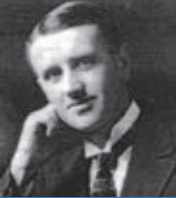

Ellingham was a British physical chemist, best known for his Ellingham diagrams. Ellingham diagram summarizes a large amount of information about extractive metallurgy, and are useful in predicting the favourable thermodynamic conditions under which an ore will be reduced to its metal. Ellingham was able to compare the temperature stability of many diff erent oxides. Th e phenomenon of reduction of metal oxides into free metal by carbon or carbon monoxide was known before Ellingham's time, but Ellingham demonstrated it in a scientific manner.

**INTRODUCTION**

Metallurgy relate to the science and technology of metals. In nature, only a few metals occur in their native state, all other metals occur in a combined state as their oxides, sulphides, silicates etc... The extraction of pure metals from their natural sources, is linked to the history of human civilisation. Ancient people used the available materials in their environment which includes fire and metals, and they were limited to the metals available on the earth's surface. In the modern world, we use a wide range of metals in our daily life, which is the result of the development of metallurgical knowledge over thousands of years. Our need for the materials with specific properties have led to production of many metal alloys. It is essential to design an eco-friendly metallurgical process that would minimize waste, maximize energy efficiency. Such advances in metallurgy is vital for the economic and technical progress in the current era. In this unit we will study the various steps involved in the extraction of metals and the chemical principles behind these processes.
