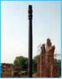
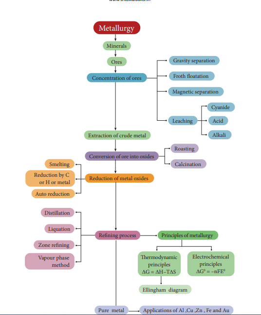

## Applications of metals 1.7.1 Applications of Al

Aluminium is the most abundant metal and is a good conductor of electricity and heat. It also resists corrosion. The following are some of its applications.

&bull;  Many heat exchangers/sinks and our day to day cooking vessels are made of aluminium.

&bull;  It is used as wraps (aluminium foils) and is used in packing materials for food items,

&bull;  Aluminium is not very strong, However , its alloys with copper, manganese, magnesium and silicon are light weight and strong and they are used in design of aeroplanes and other
forms of transport.

&bull;  As Aluminium shows high resistance to corrosion, it is used in the design of chemical reactors, medical equipments,refrigeration units and gas pipelines.

&bull;  Aluminium is a good electrical conductor and cheap, hence used in electrical overhead electric cables with steel core for strength.

### Applications of Zn

&bull;  Metallic zinc is used in **galvanising** metals such as iron and steel structures to protect them from rusting and corrosion.

&bull;  Zinc is also used to produce die-castings in the automobile, electrical and hardware
industries.

&bull;  Zinc oxide is used in the manufacture of many products such as paints, rubber, cosmetics, pharmaceuticals, plastics, inks, batteries, textiles and electrical equipment. Zinc sulphide
is used in making luminous paints, fluorescent lights and x-ray screens.

&bull;  Brass an alloy of zinc is used in water valves and communication equipment as it is highly resistant to corrosion.

### Applications of Fe
&bull;  Iron is one of the most useful metals and its alloys are used everywhere including bridges,electricity pylons, bicycle chains, cutting tools and rifle barrels.

&bull;  Cast iron is used to make pipes, valves and pumps stoves etc...

&bull;  Magnets can be made from iron and its alloys and compounds.

&bull;  An important alloy of iron is stainless steel, and it is very resistant to corrosion. It is used in architecture, bearings, cutlery, surgical instruments and jewellery. Nickel steel is used for making cables, automobiles and aeroplane parts. Chrome steels are used for maufacturing cutting tools and crushing machines

### Applications of Cu

&bull; Copper is the first metal used by the human and extended use of its alloy bronze resulted in a new era,'Bronze age'

&bull; Copper is used for making coins and ornaments along with gold and other metals.

&bull; Copper and its alloys are used for making wires, water pipes and other electrical parts

### Applications of Au

&bull;  Gold, one of the expensive and precious metals. It is used for coinage, and has been used as standard for monetary systems in some countries.

&bull;  It is used extensively in jewellery in its alloy form with copper. It is also used in electroplating to cover other metals with a thin layer of gold which are used in watches, artificial limb joints, cheap jewellery, dental fillings and electrical connectors.

&bull;  Gold nanoparticles are also used for increasing the efficiency of solar cells and also used an catalysts.

**The Iron Pillar – Delhi:**

The Iron pillar, also known as Ashoka Pillar, is 23 feet 8 inches high, 16 inches wide and weighs over 6000 kg.

The surprise comes in knowing its age, some 1600 years old,an iron column should have turned into a pile of dust long ago. Despite that, it has avoided corrosion for over the last 1600 years and stands as an evidence of the exquisite skills and knowledge of ancient Indians.

A protective film was created through a complicated combination of the presence of raw and unreduced iron in the pillar and cycles of the weather, which helped to create a thin, uniform layer of misawite on the pillar. Misawite is a compound of iron, oxygen and hydrogen which does not rust and gives corrosion resistance.

**Summary**

&#8227; Metallurgy relates to the science and technology of metals.

&#8227; A naturally occurring substance obtained by mining which contains the metal in free state or in the form of compounds like oxides, sulphides etc... is called a **mineral**.

 &#8227; minerals that contains a high percentage of metal, from which it can be extracted conveniently and economically are called **ores**.

&#8227; The extraction of a metal of interest from its ore consists of the following metallurgical processes. (i) concentration of the ore (ii) extraction of crude metal (iii) refining of crude metal

&#8227; The extraction of crude metals from the concentrated ores is carried out in two steps namely, (i) conversion of the ore into oxides of the metal of interest and (ii) reduction of the metal oxides to elemental metals.

&#8227; The graphical representation of variation of the standard Gibbs free energy of reaction for the formation of various metal oxides with temperature is called Ellingham diagram

&#8227; Ellingham diagram helps us to select a suitable reducing agent and appropriate temperature range for reduction.

&#8227; Similar to thermodynamic principles, electrochemical principles also find applications in metallurgical process.

&#8227; If E0 is positive then the ΔG is negative and the reduction is spontaneous and hence a redox reaction is planned in such a way that the e.m.f of the net redox reaction is positive. When a more reactive metal is added to the solution containing the relatively less reactive metal ions, the more reactive metal will go into the solution.

&#8227; Generally the metal extracted from its ore contains some impurities such as unreacted oxide ore, other metals, nonmetals etc...Removal of such impurities associated with the isolated crude metal is called refining process.

**EVALUATION**

**Choose the correct answer:**

1\. Bauxite has the composition

a) Al2 O3 b) Al2 O3.nH2O c) Fe2O3.2H2O d)None of these

2\. Roasting of sulphide ore gives the gas (A).(A) is a colourless gas. Aqueous solution of (A) is acidic. The gas (A) is

a)CO2 b)SO3 c)SO2 d) H S2

3\. Which one of the following reaction represents calcinations?

a)2Zn + O2 &rarr; 2ZnO2  b)2ZnS + 3O 2 &rarr; ZnO + 2SO2 c) MgCO3 &rarr; MgO + CO2 d)Both (a) and (c)

4\. The metal oxide which cannot be reduced to metal by carbon is

a) PbO b) Al2O3  c) ZnO d) FeO

5\. Which of the metal is extracted by Hall-Heroult process?

a) Al b) Ni c) Cu d) Zn

6\. Which of the following statements, about the advantage of roasting of sulphide ore before reduction is not true?

a) ΔGf 0 of sulphide is greater than those for CS2 and H S2 .

b) Δ Gr 0 is negative for roasting of sulphide ore to oxide

c) Roasting of the sulphide to its oxide is thermodynamically feasible.

d) Carbon and hydrogen are suitable reducing agents for metal sulphides.

7\. Match items in column - I with the items of column – II and assign the correct code.
| Column-I    |Column-II  |
|------|------|------|------|
| A |Cyanide process |(i) |Ultrapure Ge |
| B |Froth floatation process |(ii) |Dressing of ZnS |
| C |Electrolytic reduction |(iii) |Extraction of Al |
| D |Zone refning |(iv) |Extraction of Au |
| (v) |Purifcation of Ni |

| A |B |C |D |
|------|------|------|------|------|
| (a) |(i) |(ii) |(iii) |(iv) |
| (b) |(iii) |(iv) |(v) |(i) |
| (c) |(iv) |(ii) |(iii) |(i) |
| (d) |(ii) |(iii) |(i) |(v) |
  

8\. Wolframite ore is separated from tinstone by the process of

 a) Smelting

 b) Calcination

c) Roasting 

d) Electromagnetic separation

9\. Which one of the following is not feasible

a) Zn(s) + Cu2+ (aq) &rarr; Cu(s) + Zn2+ (aq)

b) Cu(s) + Zn 2+(aq) &rarr; Zn(s) + Cu 2+ (aq) 

c) Cu(s) + 2Ag 2+(aq) &rarr;  2Ag(s) + Cu2+ (aq) 

d) Fe(s) + Cu2+ (aq) &rarr; Cu(s) + Fe2+(aq)
10\. Electrochemical process is used to extract

a) Iron b) Lead c) Sodium d) silver

11\. Flux is a substance which is used to convert

a) Mineral into silicate

b) Infusible impurities to soluble impurities

c) Soluble impurities to infusible impurities 

d) All of these

12\. Which one of the following ores is best concentrated by froth – floatation method?

a) Magnetite 

b) Haematite

c) Galena 

d) Cassiterite

13\. In the extraction of aluminium from alumina by electrolysis, cryolite is added to

a) Lower the melting point of alumina b) Remove impurities from alumina

c) Decrease the electrical conductivity d) Increase the rate of reduction

14\. Zinc is obtained from ZnO by

a) Carbon reduction

b) Reduction using silver

c) Electrochemical process 

d) Acid leaching

15\. Extraction of gold and silver involves leaching with cyanide ion. silver is later recovered by (NEET-2017)

a) Distillation

 b) Zone refining

c) Displacement with zinc

 d) liquation

16\. Considering Ellingham diagram, which of the following metals can be used to reduce alumina? (NEET-2018)

a) Fe b) Cu

c) Mg d) Zn

17\. The following set of reactions are used in refining Zirconium

Zr (impure) + 2I2 523k&rarr; ZrI4

ZrI4 1800k&rarr; Zr (pure) + 2I2

This method is known as

a) Liquation b) van Arkel process

c) Zone refining d) Mond’s process

18\. Which of the following is used for concentrating ore in metallurgy?

a) Leaching b) Roasting

c) Froth floatation d) Both (a) and (c)

19\. The incorrect statement among the following is

a) Nickel is refined by Mond’s process

b) Titanium is refined by Van Arkel’s process

c) Zinc blende is concentrated by froth floatation

d) In the metallurgy of gold, the metal is leached with dilute sodium chloride solution

20\. In the electrolytic refining of copper, which one of the following is used as anode?

a) Pure copper b) Impure copper

c) Carbon rod d) Platinum electrode

21\. Which of the following plot gives Ellingham diagram

a) ΔS Vs T b) ΔG⁰ Vs T

c) ΔG⁰ Vs 1 / T

d) ΔG⁰ Vs T2

22\. In the Ellingham diagram, for the formation of carbon monoxide

a) ∆ ∆

 

 

S T

0

is negative b) ∆ ∆

 

 

G T

0

is positive

c) ∆ ∆

 

 

G T

0

is negative d) initially ∆ ∆

T G0

 

 

is positive, after 700 C0 ,

∆ ∆ G T

0 

 

is negative

23\. Which of the following reduction is not thermodynamically feasible?

a) Cr2O3 + 2Al &rarr; Al2O3 + 2Cr

b) Al2O3 + 2Cr &rarr;  Cr2O3 + 2Al

c) 3TiO2 + 4Al &rarr; 2 Al2O3+ 3Ti

d) none of these

24\. Which of the following is not true with respect to Ellingham diagram?

a) Free energy changes follow a straight line. Deviation occurs when there is a phase change.

b) The graph for the formation of CO2 is a straight line almost parallel to free energy axis.

c) Negative slope of CO shows that it becomes more stable with increase in temperature.

d) Positive slope of metal oxides shows that their stabilities decrease with increase in temperature.

**Answer the following questions:**

1\. What are the differences between minerals and ores?

2\. What are the various steps involved in extraction of pure metals from their ores?

3\. What is the role of Limestone in the extraction of Iron from its oxide Fe2O3  ?

4\. Which type of ores can be concentrated by froth floatation method? Give two examples for such ores.

5\. Describe a method for refining nickel.

6\. Explain zone refining process with an example.

7\. Using the Ellingham diagram,

(A) Predict the conditions under which

(i) Aluminium might be expected to reduce magnesia.

(ii) Magnesium could reduce alumina.

(B) it is possible to reduce Fe2O3 by coke at a temperature around 1200K

8\. Give the uses of zinc.

9\. Explain the electrometallurgy of aluminium.

10\. Explain the following terms with suitable examples.

 (i) Gangue (ii) slag

11\. Give the basic requirement for vapour phase refining.

12\. Describe the role of the following in the process mentioned.

(i) Silica in the extraction of copper.

(ii) Cryolite in the extraction of aluminium.

(iii) Iodine in the refining of Zirconium.

(iv) Sodium cyanide in froth floatation.

13\. Explain the principle of electrolytic refining with an example.

14\. The selection of reducing agent depends on the thermodynamic factor: Explain with an example.

15\. Give the limitations of Ellingham diagram.

16\. Write a short note on electrochemical principles of metallurgy.


graph TD;
Metallurgy-->
Minerals-->Ores 



