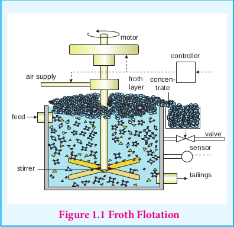

## Concentration of ores
 Generally, the ores are associated with nonmetallic impurities, rocky materials and siliceous matter which are collectively known as gangue. The preliminary step in metallurgical process is removal of these impurities. This removal process is known as concentration of ore. It increases the concentration of the metal of interest or its compound in the ore. Several methods are available for this process and the choice of method will depend on the nature of the ore, type of impurity and environmental factors. Some of the common methods of ore concentration are discussed below.

### Gravity separation or Hydraulic wash

In this method, the ore having high specific gravity is separated from the gangue that has low specific gravity by simply washing with running water. Ore is crushed to a finely powdered form and treated with rapidly flowing current of water. During this process the lighter gangue particles are washed away by the running water. This method is generally applied to concentrate the native ore such as gold and oxide ores such as haematite (Fe2O3), tin stone (SnO2) etc.

### Froth flotation

This method is commonly used to concentrate sulphide ores such as galena (PbS), zinc blende (ZnS) etc... In this method, the metallic ore particles which are preferentially wetted by oil can be separated from gangue.

In this method, the crushed ore is suspended in water and mixed with frothing agent such as pine oil, eucalyptus oil etc. A small quantity of sodium ethyl xanthate which acts as a collector is also added. A froth is generated by blowing air through this mixture. The collector molecules attach to the ore particle and make them water repellent. As a result, ore particles, wetted by the oil, rise to the surface along with the froth. The froth is skimmed off and dried to recover the concentrated ore. The gangue particles that are preferentially wetted by water settle at the bottom.

When a sulphide ore of a metal of interest contains other metal sulphides as impurities, depressing agents such as sodium cyanide, sodium carbonate etc are used to selectively prevent other metal sulphides from coming to the froth. For example, when impurities such as ZnS is present in galena (PbS), sodium cyanide (NaCN) is added to depresses the flotation property of ZnS by forming a layer of zinc complex Na2\[Zn(CN)4\] on the surface of zinc sulphide.

### Leaching

This method is based on the solubility of the ore in a suitable solvent and the reactions in aqueous solution. In this method, the crushed ore is allowed to dissolve in a suitable solvent, the metal present in the ore is converted to its soluble salt or complex while the gangue remains insoluble. The following examples illustrate the leaching processes.

**Cyanide leaching**

Let us consider the concentration of gold ore as an example. The crushed ore of gold is leached with aerated dilute solution of sodium cyanide. Gold is converted into a soluble cyanide complex. The gangue, aluminosilicate remains insoluble.

4Au (s) + 8CN- (aq) + O2 (g) + 2H2O (l) &rarr; 4\[Au(CN)2\] - (aq) + 4OH-(aq)

**Recovery of metal of interest from the complex by reduction:**

Gold can be recovered by reacting the deoxygenated leached solution with zinc. In this process the gold is reduced to its elemental state (zero oxidation sate) and the process is called **cementation**.

Zn (s) + 2\[Au(CN)2\] -(aq) &rarr; \[Zn(CN)4\]-2(aq) + 2Au (s)

**Ammonia leaching**

When a crushed ore containing nickel, copper and cobalt is treated with aqueous ammonia under suitable pressure, ammonia selectively leaches these metals by forming their soluble complexes viz. \[Ni(NH3)6\]2+, \[Cu(NH3)4\] 2+, and \[Co(NH3)5H2O\]3+
respectively from the ore leaving behind the gangue, iron(III) oxides/hydroxides and aluminosilicate.

**Alkali leaching**

In this method, the ore is treated with aqueous alkali to form a soluble complex. For example, bauxite, an important ore of aluminum is heated with a solution of sodium hydroxde or sodium carbonate in the temperature range 470 - 520 K at 35 atm to form soluble sodium meta-aluminate leaving behind the impurities, iron oxide and titanium oxide.

Al2O3 (s) + 2NaOH (aq) + 3H2O (l) &rarr; 2Na\[Al(OH)4\] (aq)

The hot solution is decanted, cooled, and diluted. This solution is neutralised by passing CO2 gas, to the form hydrated Al2O3 precipitate.

2Na\[Al(OH)4\] (aq) + 2CO2 (g) &rarr; Al2O3.3H2O (s) + 2NaHCO3 (aq)

The precipitate is filtered off and heated around 1670 K to get pure alumina Al2O3.

**Acid leaching**

Leaching of sulphide ores such as ZnS, PbS etc., can be done by treating them with hot aqueous sulphuric acid.

2ZnS (s) + 2H2SO4 (aq) + O2(g) &rarr; 2ZnSO4 (aq) + 2S (s) + 2H2O

In this process the insoluble sulphide is converted into soluble sulphate and elemental sulphur.

**Evaluate yourself 1**

1\. Write the equation for the extraction of silver by leaching with sodium cyanide and show that the leaching process is a redox reaction.

### Magnetic separation

This method is applicable to ferromagnetic ores and it is based on the difference in the magnetic properties of the ore and the impurities. For example tin stone can be separated from the wolframite impurities which is magnetic. Similarly, ores such as chromite, pyrolusite having magnetic property can be removed from the non magnetic siliceous impurities. The crushed ore is poured on to an electromagnetic separator consisting of a belt moving over two rollers of which one is magnetic. The magnetic part of the ore is attracted towards the magnet and falls as a heap close to the magnetic region while the nonmagnetic part falls away from it as shown in the figure 1.2.

