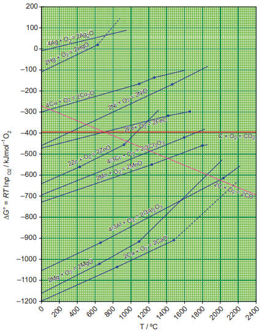

# Thermodynamic principle of metallurgy
 As we discussed, the extraction of metals from their oxides can be carried out by using
different reducing agents. For example, consider the reduction of a metal oxide MxOy.


\dfrac{2}{y}{M_xO_y (s) \xrightarrow{} \dfrac{2x}{y}M(s) + O_2(g)} ------ (1)


The above reduction may be carried out with carbon. In this case, the reducing agent carbon may be oxidised to either CO or CO2.


{C + O_2 \xrightarrow{}   CO_2(g)} ------ (2)



{2C + O_2 \xrightarrow{}   2CO(g)} ------ (3)


If carbon monoxide is used as a reducing agent, it is oxidised to CO2 as follows,

{2CO + O_2 \xrightarrow{}   2CO_2(g)} ------ (4)


A suitable reducing agent is selected based on the thermodynamic considerations. We know that for a spontaneous reaction, the change in free energy (ΔG) should be negative. Therefore, thermodynamically, the reduction of metal oxide \[equation (1)\] with a given reducing agent \[Equation (2), (3) or (4)\] can occur if the free energy change for the coupled reaction. \[Equations (1) & (2), (1) & (3) or (1) & (4)\] is negative. Hence, the reducing agent is selected in such a way that it provides a large negative ΔG value for the coupled reaction.

## Ellingham diagram

The change in Gibbs free energy (ΔG) for a reaction is given by the expression.

ΔG = ΔH - TΔS ------ (1)

where, ΔH is the enthalpy change , T the temperature in kelvin and ΔS the entropy change. For an equilibrium process, ΔG⁰ can be calculated using the equilibrium constant by the following expression

ΔG⁰ =-RT lnKp

Harold Ellingham used the above relationship to calculate the ΔG⁰ values at various temperatures for the reduction of metal oxides by treating the reduction as an equilibrium process.

He has drawn a plot by considering the temperature in the x-axis and the standard free energy change for the formation of metal oxide in y-axis. The resultant plot is a straight line with ΔS as slope and ΔH as y-intercept. The graphical representation of variation of the standard Gibbs free energy of reaction for the formation of various metal oxides with temperature is called Ellingham diagram

**Observations from the Ellingham diagram.**

1. For most of the metal oxide formation, the slope is positive. It can be explained as follows. Oxygen gas is consumed during the formation of metal oxides which results in the decrease in randomness. Hence, ΔS becomes negative and it makes the term, TΔS positive in the straight line equation.

2. The graph for the formation of carbon monoxide is a straight line with negative slope. In this case ΔS is positive as 2 moles of CO gas is formed by the consumption of one mole of oxygen gas. It indicates that CO is more stable at higher temperature.

3. As the temperature increases, generally ΔG value for the formation of the metal oxide become less negative and becomes zero at a particular temperature. Below this temperature, ΔG is negative and the oxide is stable and above this temperature ΔG is positive. This general trend suggests that metal oxides become less stable at higher temperature and their decomposition becomes easier.

4. There is a sudden change in the slope at a particular temperature for some metal oxides like MgO, HgO. This is due to the phase transition (melting or evaporation).

## Applications of the Ellingham diagram:

Ellingham diagram helps us to select a suitable reducing agent and appropriate temperature range for reduction. The reduction of a metal oxide to its metal can be considered as a competition between the element used for reduction and the metal to combine with oxygen. If the metal oxide is more stable, then oxygen remains with the metal and if the oxide of element used for reduction is more stable, then the oxygen from the metal oxide combines with elements used for the reduction. From the Ellingham diagram, we can infer the relative stability of different metal oxides at a given temperature.

1. Ellingham diagram for the formation of Ag2O and HgO is at upper part of the diagram and their decomposition temperatures are 600 and 700 K respectively. It indicates that these oxides are unstable at moderate temperatures and will decompose on heating even in the absence of a reducing agent.

2. Ellingham diagram is used to predict thermodynamic feasibility of reduction of oxides of one metal by another metal. Any metal can reduce the oxides of other metals that are located above it in the diagram. For example, in the Ellignham diagram, for the formation of chromium oxide lies above that of the aluminium, meaning that Al2O3 is more stable than Cr2O3. Hence aluminium can be used as a reducing agent for the reduction of chromic oxide. However, it cannot be used to reduce the oxides of magnesium and calcium which occupy lower position than aluminium oxide.

3. The carbon line cuts across the lines of many metal oxides and hence it can reduce all those metal oxides at sufficiently high temperature. Let us analyse the thermodynamically favourable conditions for the reduction of iron oxide by carbon. Ellingham diagram for the formation of FeO and CO intersects around 1000 K. Below this temperature the carbon line lies above the iron line which indicates that FeO is more stable than CO and hence at this temperature range, the reduction is not thermodynamically feasible. However, above 1000 K carbon line lies below the iron line and hence, we can use coke as reducing agent above this temperature. The following free energy calculation also confirm that the reduction is thermodynamically favoured.

From the Ellingham Diagram at 1500 K, 


{2Fe  (s)+ O_2  (g) \xrightarrow{} {2FeO(g)} ΔG_1 = -350kJ mol^{-1} } ------ (1)



{2C (s) + O_2  (g) \xrightarrow{}   {2CO(g)}  ΔG_2 = -480kJ mol^{-1} } ------ (2)


Reverse the reaction (1) 

{2FeO (s)  \xrightarrow{}   {2Fe(s) + O_2 (g)}  -ΔG_1 = +350kJ mol^{-1} } ------ (3)


Now couple the reactions (2) and (3)

{2FeO (s)  + 2C  \xrightarrow{}   {2Fe(l,s) + 2CO (g)}  ΔG_3 = -130kJ mol^{-1} } ------ (4)


The standard free energy change for the reduction of one mole of FeO is, ΔG3/2 = -65 kJ mol-1

**Limitations of Ellingham diagram**

1. Ellingham diagram is constructed based only on thermodynamic considerations. It gives information about the thermodynamic feasibility of a reaction. It does not tell anything about the rate of the reaction. More over, it does not give any idea about the possibility of other reactions that might be taking place.

2. The interpretation of ΔG is based on the assumption that the reactants are in equilibrium with the products which is not always true.

>**Evaluate yourself 3**
3. Using Ellingham diagram (fig 1.4) indicate the lowest temperature at which ZnO can be reduced to Zinc metal by carbon. Write the overall reduction reaction at this temperature.
