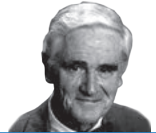
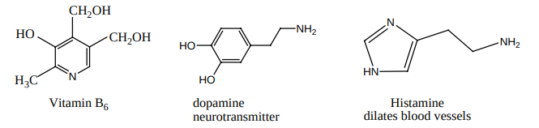

  

196

**Learning Objectives** After studying this unit the student will be able to

 understand isomerism in organic nitro compounds

 describe the preparation and properties of nitro compounds

 classify amines as primary, secondary and tertiary

 describe the methods of preparation of amines

 explain the properties of amines

 distinguish between primary, secondary and tertiary amines

 describe the method of preparation of diazonium salts

 explain the preparation and properties of cyanides

**ORGANIC NITROGEN COMPOUNDS**

**UNIT**

**13**

**Donald James Cram**

**Donald James Cram** was an American chemist who shared the 1987 Nobel Prize in Chemistry with Jean-Marie Lehn and Charles J. Pedersen "for their development and use of molecules with structure-specifi c interactions of high selectivity." Th ey were the founders of the fi eld of host–guest chemistry Cram expanded upon Charles Pedersen's ground-breaking synthesis of crown ethers, two-dimensional organic compounds that are able to recognize and selectively combine with the ions of certain metal elements. He also did work in stereochemistry and Cram's rule of asymmetric induction is named aft er him.

XII U13-Organic Nitrogen Compounds.indd 196 2/19/2020 5:16:48 PM

www.tntextbooks.in

  

197

**INTRODUCTION**

Organic compounds containing nitrogen are essential to life. For example; amines, the organic derivatives of ammonia play an important role in bioregulation, neurotransmission,etc., Pyridoxine, Vitamin B6 is an organic nitrogen compound which is needed to maintain the health of nerves, skin and red blood cells. Plants synthesise alkaloids, and biologically active amines to protect them from being eaten away by insects and other animals. Diazonium salts finds important applications in synthetic organic chemistry. Nitrogen compounds are the important constituents of explosives, drugs, dyes, fuels, polymers, synthetic rubbers, etc.,

In this unit, we will learn the preparation, properties and uses of nitrocompounds and amines.

