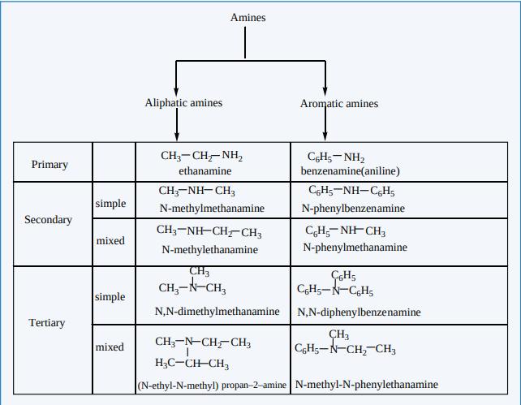
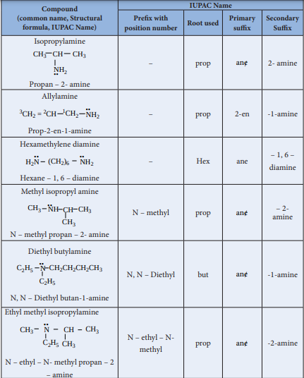
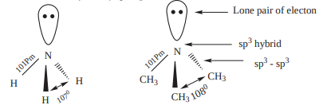
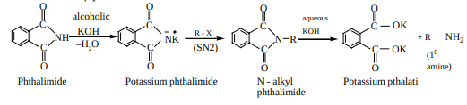
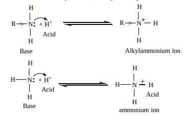
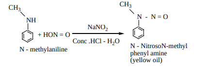
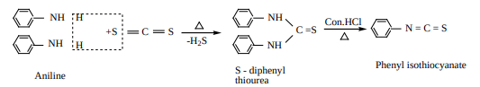
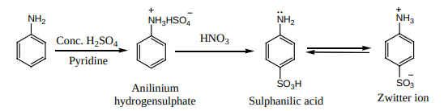

## Amines - clasification
<!-- $\ce{R-X+NaOH(aq) ->[\Delta] R-OH+NaX}$ -->

206

### Nomenclature 
a) Common system:

In common system, an aliphatic amine is named by prefixing alkyl group to amine. The prefixes di-,tri-, and tetra-, are used to describe two, three(or) four same substituent’s.

**b) IUPAC System:**

<!-- 
| C ompound(common name, Structural formula, IUPAC Name) |IUPAC Name |
|------|------|------|------|------|
| Prex with position number |Root used |Primar y sux |Secondar ySux |
| Isopropylamine..CH CH CHProp3an – 2- aNH min3 e2 |– |prop |ane/ |2- amine |
| ..AllylamineCH  = CH CH NHProp-2-en-1-amine3 2 12 2 2 |– |prop |2-en |-1-amine |
| .. ..Hexamethylene diamineH N (CH ) NHHexane – 1, 6 – diamine2 2 6 2 |– |Hex |ane |– 1, 6 – diamine |
| ..Methyl isopropyl amineCH NH CH CHN – meth3 yl prop CaHn – 2- a3 mine3 |N – methyl |prop |ane/ |– 2- amine |
| ..Diethyl butylamineC H N CH CH CH CHC HN, N – Diet2 5 hyl b 2 uta 2n-1-a2 min3 e2 5 |N, N – Diethyl |but |ane/ |-1-amine |
| ..Ethyl methyl isopropylamineCH N CH CHC H CH3 3N – ethyl – N- methyl propan – 2 – a2 min5 e3 |N – ethyl – N- methyl |prop |ane/ |-2-amine |
   -->

207

XII U13-Organic Nitrogen Compounds.indd 207 2/19/2020 5:17:18 PM

www.tntextbooks.in

<!-- 
| N,N – Dimethyl aniline..N (CH )3 2N,N – Dimethylbenzenamine |N,N – Dimethyl |benzenne/ |– |amine |
|------|------|------|------|------|
| B enzylamine..CH NH2 2Phenyl methanamine |Phenyl |meth |ane/ |amine |
| N – methyl benzylamineCH NH CH2 3N – methyl phenyl methanamine |N – methyl phenyl |meth |ane/ |amine |
 -->

208

### Structure of amines

Like, ammonia, nitrogen atom of amines is trivalent and carries a lone pair of electron and sp3 hybridised, out of the four sp3 hybridised orbitals of nitrogen, three sp3 orbitals overlap with orbitals of hydrogen (or) alkyl groups of carbon, the fourth sp3 orbital contains a lone pair of electron. Hence, amines posses pyramidal geometry. Due to presence of lone pair of electron C- N- H (or) C- N- C bond angle is less than the normal tetrahedral bond angle 109.50. For example, the C- N- C bond angle of trimethylamine is 1080 which is lower than tetrahedral angle and higher than the H- N- H bond angle of 107˚ . This increase is due to the repulsion between the bulky methyl groups.

### General methods of preparation Amines
 Aliphatic and aromatic amines are prepared by the following methods.

**1) From nitro compounds** 
Reduction of Nitro compounds using H / Ni (or) Sn / HCl or Pd/H2 2 gives primary amines.

$\ce{CH3CH2-NO2->[{3H2/ Ni(or)}][Fe/HCl,6[H]]CH3CH2-NH2+2H2O}$

$\ce{C6H5-NO2->[3H2/ Pt, 680 K][(or) Sn / HCl]C6H5-NH2+2H2O}$

**2) From nitriles a)** 
Reduction of alkyl or aryl cyanides with 2H /Ni (or) LiAlH (or) Na / C H OH4 2 5 gives

primary amines. The reduction reaction in which Na / C H OH2 5 is used as a reducing agent is called mendius reaction

CH3 CN Na(Hg) / C2 H5OH

4 \[ H \] CH3CH2 NH2

ethanenitrile ethanamine

**b)** Reduction of isocyanides with sodium amalgam / C H OH2 5 gives secondary amines

CH3 NC Na(Hg) / C2H5OH

4 \[ H\] CH3 NH CH3

Methyl isocyanide N-methylmethanamine

XII U13-Organic Nitrogen Compounds.indd 208 2/19/2020 5:17:24 PM

www.tntextbooks.in

  

209

**3) From amides**

**a)** Reduction of amides with LiAlH4 gives amines

R C

O

NH2 i) LiAlH4

ii) H2O R CH2 NH2

**b) Hoffmann’s degradation reaction**

When Amides are treated with bromine in the presence of aqueous or ethanolic solution of KOH, primary amines with one carbon atom less than the parent amides are obtained.

**Example:**

R C

O

R NH2 + K2 CO3 + KBr + H2ONH2

Br2 / KOH

amide R = Alkyl (or) Aryl

Primary amine

**4) From alkyl halides**

**a) Gabriel phthalimide synthesis**

Gabriel synthesis is used for the preparation of Aliphatic primary amines. Phthalimide on treatment with ethanolic KOH forms potassium salt of phthalimide which on heating with alkyl halide followed by alkaline hydrolysis gives primary amine. Aniline cannot be prepared by this method because the arylhalides do not undergo nucleophilic substitution with the anion formed by phthalimide

**b) Hoffmann’s ammonolysis**

When Alkyl halides (or) benzylhalides are heated with alcoholic ammonia in a sealed tube, mixtures of 10, 20 and 30 amines and quaternary ammonium salts are obtained.

CH3 Br NH3 **..**

CH3 NH2 **..** CH3 - Br

(CH3)NH **..** CH3 Br

(CH3)3N **..** CH3 Br (CH3)4N Br

10 - amine 20 - amine 30- amine Quarternary ammonium bromide

2

This is a nucleophilic substitution , the halide ion of alkyl halide is substituted by the -NH2

group. The product primary amine so formed can also has a tendency to act as a nucleophile and hence if excess alkyl halide is taken, further nucleophilic substitution takes place leading

XII U13-Organic Nitrogen Compounds.indd 209 2/19/2020 5:17:25 PM

www.tntextbooks.in

  

210

to the formation of quarternary ammonium salt. However, if the process is carried out with excess ammonia, primary amine is obtained as the major product.

The order of reactivity of alkylhalides with amines.

RI > RBr > RCl

**c) Alkyl halide can also be converted to primary amine by treating it with sodium azide** (NaN3 ) **followed by the reduction using lithium aluminium hydride.**

CH3 Br NaN3

CH3 N3 LiAlH4

CH3 NH2 + N2 Methylbromide Methyl azide Methylamine

**d) Preparation of aniline from chlorobenzene**

When chlorobenzene is heated with alcoholic ammonia, aniline is obtained.

C6H5 Cl NH3

Cu2O / 2000C

NH2

aniline

**5) Ammonolysis of hydroxyl compounds**

a) when vapour of an alcohol and ammonia are passed over alumina, W O2 5 (or) silica at 4000C, all types of amines are formed. This method is called Sabatier – Mailhe method.

C2H5OH NH3

**..**

Al2O3, - H2O C2H5 - NH2

**..** C2H5OH

\-H2O

C2H5OH

\- H2O (C2H5)3 N(C2H5)2 NH

**.. ..**

b) Phenol reacts with ammonia at 3000C in the presence of anhydrous ZnCl2 to give aniline OH NH2

NH3

anhy.ZnCl2, 3000C

Phenol aniline

### Properties of amines

**1\. Physical state and smell** The lower aliphatic amines

1 2(C -C ) are colourless gases and have ammonia like smell and those with four or more carbons are volatile liquids with fish like smell.

Aniline and other arylamines are usually colourless but when exposed to air they become coloured due to oxidation.

**2\. Boiling point** Due to the polar nature of primary and secondary amines, can form intermolecular

hydrogen bonds using their lone pair of electorn on nitrogen atom. There is no such H-bonding in tertiary amines.

XII U13-Organic Nitrogen Compounds.indd 210 2/19/2020 5:17:26 PM

www.tntextbooks.in

  

211

R N H N H N H

H R H

H R

The boiling point of various amines follows the order,

CH3 NH2 **..**

\> (CH3)2 NH **..**

\> (CH3)3 N **..**

1 2 3> >° °°

Amines have lower boiling point than alcohols because nitrogen has lower electronegative value than oxygen and hence the N-H bond is less polar than -OH bond.

**Table Boiling points of amines, alcohols and alkanes of comparable molecular weight.**

| S.NO. |C ompound |Molecular mass |Boiling point (K) |
|------|------|------|------|
| 1. |CH3(CH2)2NH2 |59 |321 |
| 2. |C2H5-NH-CH3 |59 |308 |
| 3. |(CH3)3N|59 |277 |
| 4. |CH CH3(OH)CH3 |60 |355 |
| 5. |CH3CH2CH2CH3 |58 |272.5 |
  

**3) Solubility**

Lower aliphatic amines are soluble in water, because they can form hydrogen bonds with water molecules. However, solubility decreases with increase in molecular mass of amines due to increase in size of the hydrophobic alkyl group. Amines are insoluble in water but readily soluble in organic solvents like benzene, ether etc.

### Chemical properties

The lone pair of electrons on nitrogen atom in amines makes them basic as well as nucleophilic. They react with acids to form salts and also react with electrophiles.

They form salts with mineral acids

**Example:**

C6H5 NH2 + HCl C6H5 NH3Cl-**..**

Aniline Anilinium chloride

**Expression for basic strength of amines**

In the aqueous solutions, the following equilibrium exists and it lies far to the left, hence amines are weak bases compared to NaOH .

XII U13-Organic Nitrogen Compounds.indd 211 2/19/2020 5:17:28 PM

www.tntextbooks.in

212

R NH2 + H - OH **..**

R NH3 + OH -

basicity constant Kb = R-N H OH

R-NH

+

3 -

2

 

   

\[ \] The basicity constant Kb gives a measure of the extent to which the amine accepts the

hydrogen ion (H+ ) from water,

we know that,

Larger the value of Kb or smaller the value of pKb, stronger is the base.

**Table :** pKb **values of Amines in Aqueous solution. (pKb for NH3 is 4.74)**

| Amines |pKb |Amines |pKb |Amines |pKb |
|------|------|------|------|------|------|
| . .CH NH23 |3.38 |C H NH2 5 2 |3.29 |. .C H CH NH6 5 2 2 |4.70 |
| . .(CH ) NH3 2 |3.28 |. .(C H ) NH2 5 2 |3.00 |. .C H NH CH6 5 3 |9.30 |
| ..(CH )N3 3 |4.22 |. .(C H ) N2 5 3 |3.25 |. .C H N (CH )6 5 3 2 |8.92 |
  

**Influence of structure on basic character of amines**

The factors which increase the availability of electron pair on nitrogen for sharing with an acid will increase the basic character of an amine. When a +I group like an alkyl group is attached to the nitrogen increase the electron density on nitrogen which makes the electron pair readily available for protonation.

a) Hence alkyl amines are stronger bases than ammonia.

Consider the reaction of an alkyl amine (R- N H ). .2 with a proton

XII U13-Organic Nitrogen Compounds.indd 212 2/19/2020 5:17:30 PM

www.tntextbooks.in

213

The electron – releasing alkyl group R pushes electron towards nitrogen in the amine

2

. . (R-N H ) and provide unshared electron pair more available for sharing with proton.

Therefore, the expected order of basicity of aliphatic amines (in gas phase) is

R3N **. .**

\> R2NH **. .**

\> R-NH2 **. .**

(30) (20) (10)

The above order is not regular in their aqueous solution as evident by their pKb values given in the table.

To compare the basicity of amines, the inductive effect, solvation effect, steric hindrance, etc., should be taken into consideration.

**Solvation effect**

In the aqueous solution, the substituted ammonium cations get stabilized not only by electron releasing (+I) effect of the alkyl group but also by solvation with water molecules. The greater the size of the ion, lesser will be the solvation. The order of stability of the protonated amines is greater the size of the ion, lesser is the solvation and lesser is the stability. In case of secondary and tertiary amines, due to steric hindrance, the alkyl groups decrease the number of water molecules that can approach the protonated amine. Therefore the order of basicity is,

1˚ > 2˚ > 3˚

R N

H

H

H

OH2

OH2

OH2

\> N

R

R H

H >

OH2

OH2

R R

R

N H OH2

1 2 3

Based on these effects we can conclude that the order of basic strength in case of alkyl substituted amines in aqueous solution is

(CH3)2NH > CH3 - NH2 > (CH3)3N > NH3 **........**

**.. .. .. ..** (C2H5)2 NH > (C2H5)3 N > C2H5 NH2 > NH3

The resultant of +I effect, steric effect and hydration effect cause the 20 amine, more basic.

**Basic strength of aniline**

In aniline, the NH 2

group is directly attached to the benzene ring. The lone pair of electron on nitrogen atom in aniline gets delocalised over the benzene ring and hence it is less available for protonation makes the, aromatic amines (aniline) less basic than NH3.

In case of substituted aniline, electron releasing groups like -CH3,-OCH3,-NH2 increase the basic strength and electron withdrawing group like - NO2,-X,-COOH decrease the basic strength.

XII U13-Organic Nitrogen Compounds.indd 213 2/19/2020 5:17:32 PM

www.tntextbooks.in

  

214

**Table pKb’s of substituted anilines (pKb value of aniline is 9.376)**

| Substituent |pKb |Substituent |pKb |Substituent |pKb |
|------|------|------|------|------|------|
| o - CH3 |9.60 |m - CH3 |9.31 |p - CH3 |8.92 |
| o - NH2 |9.52 |m - NH2 |9.00 |P - NH2 |7.83 |
| o - OC H3 |9.52 |m - OCH3 |9.70 |p - OC H3 |8.70 |
| o - NO2 |14.30 |m - NO2 |11.52 |p - NO2 |13.00 |
| o - Cl |11.25 |m - Cl |10.52 |p - Cl |10.00 |
  

The relative basicity of amines follows the below mentioned order

Alkyl amines > Aralkyl amines > Ammonia > N – Aralkyl amines > Aryl amines 

### Chemical properties of amines

**1) Alkylation**

Amines reacts with alkyl halides to give successively 20 and 30 amines and quaternary ammonium salts.

R NH2

CH3Br R NH CH3 + HBr

2 CH3Br

3 CH3Br

R N (CH3)2 + 2HBr

20 - amine

30 - amine

R N (CH3)3 Br Quarternary ammonium salts

**2) Acylation**

Aliphatic / aromatic primary and secondary amines react with acetyl chloride (or) acetic anhydride in presence of pyridine to form N – alkyl acetamide. Example

C2H5 NH2 + CH3 C

O

Cl Pyridine

C2H5 NH C

O

CH3 + HCl

Ethylamine Acetylchloride N - Ethyl acetamide

**3) Schotten – Baumann reaction**

Aniline reacts with benzoylchloride (C H COCl)6 5 in the presence of NaOH to give N – phenyl benzamide. This reaction is known as Schotten – Baumann reaction. The acylation and benzoylation are nucleophilic substitutions.

XII U13-Organic Nitrogen Compounds.indd 214 2/19/2020 5:17:35 PM

www.tntextbooks.in

215

C6H5 NH2 + C6H5 C

O

Cl Pyridine

C6H5 NH C

O

C6H5 + HCl

Aniline Benzoylchloride N - phenyl benzamide

**4) Reaction with nitrous acid**

Three classes of amines react differently with nitrous acid which is prepared in situ from a mixture of NaNO and HCl 2 . 

**a) primary amines**

i) Ethylamine reacts with nitrous acid to give ethyl diazonium chloride, which is unstable and it is converted to ethanol by liberating N2 .

C2H5 NH2 + HNO2 NaNO2

Conc. HCl \[ C2H5N2Cl \]

H2O C2H5OH + N2

Ethylamine Unstable Ethanol

ii) Aniline reacts with nitrous acid at low temperature (273 – 278 K) to give benzene diazonium chloride which is stable for a short time and slowly decomposes even at low temperatures. This reaction is known as diazotization.

\+ NaNO2 + 2HCl

NH2 273 - 278K + NaCl + 2H2O

N2 Cl

Aniline Benzenediazonium chloride

**b) secondary amines**

Alkyl and aryl secondary amines react with nitrous acid to give N – nitroso amine as yellow oily liquid which is insoluble in water.

This reaction is known as Libermann’s nitroso test,

**c) Teritiary amine**

i) Aliphatic tertiary amine reacts with nitrous acid to form trialkyl ammonium nitrite salt, which is soluble in water.

XII U13-Organic Nitrogen Compounds.indd 215 2/19/2020 5:17:36 PM

www.tntextbooks.in

  

216

(CH3)3N + HNO2 \[(CH3)3NH\] NO2

trimethylamine trimethyl ammonium nitrite

ii) Aromatic tertiary amine reacts with nitrous acid at 273K to give p – nitroso compound.

N

CH3 CH3

HNO2

(NaNO2 + Con.HCl)

N

CH3 CH3

N = O

N, N - dimethyl aniline

p - Nitroso N,N - dimethyl aniline

**5) Carbylamine reaction**

Aliphatic (or) aromatic primary amines react with chloroform and alcoholic KOH to give isocyanides (carbylamines), which has an unpleasant smell. This reaction is known as carbylamine test. This test used to identify the primary amines.

C2H5 - NH2 + CHCl3 + 3KOH C2H5 - NC + 3KCl + 3H2O Ethylamine Chloroform Ethylisocyanide

**6) Mustard oil reaction**

i) When primary amines are treated with carbon disulphide (CS2), N - alkyldithio carbomic acid is formed which on subsequent treatment with HgCl2 , give an alkyl isothiocyanate.

CH3 - N -H + C = S CH3 - NH - C - SH CH3 - N = C= S + HgS + 2HCl HgCl2

S S

H

Methylamine

N - methyl dithiocarbamic acid

Methyl isothiocyanate (Mustard oil smell)

ii) When aniline is treated with carbon disulphide, or heated together, S- diphenylthio urea is formed, which on boiling with strong HCl , phenyl isothiocyanate (phenyl mustard oil), is formed.

These reactions are known as Hofmann – Mustard oil reaction. This test is used to identify the primary amines.

XII U13-Organic Nitrogen Compounds.indd 216 2/19/2020 5:17:37 PM

www.tntextbooks.in

  

217

**7\. Electrophilic substitution reactions in Aniline**

The -N H ..

2 group is a strong activating group. In aniline the 2NH is directly attached to the benzene ring, the lone pair of

electrons on the nitrogen is in conjugation with benzene ring which increases the electron density at ortho and para position, thereby facilitating the electrophilic attack at ortho and para positions.

**i) Bromination**

Aniline reacts with 2 2Br / H O to give 2,4,6 – tribromo aniline a white precipitate.

Br2 / H2O (or) Br2 / CH3COOH

NH2 ..

BrBr

Aniline 2,4,6, tribromo aniline (white precipitate)

NH2 ..

Br

To get mono bromo compounds, - NH2 is first acylated to reduce its activity.

(CH3CO)2O - CH3COOH

Pyridine Acetanilide

Br2/CH3COOH -HBr

Br

H3O+

\-CH3COOH

p - bromo acetanilide (Major product) p-bromo aniline

NH2 ..

NH C

O

CH3 NH C

O

CH3 NH2 ..

Br

When aniline is acylated, the lone pair of electron on nitrogen is delocalised by the neighbouring carbonyl group by resonance. Hence it is not easily available for conjugation with benzene ring.

NH C CH3 ..

O

NH C

O.. ....

..

CH3

The acetylamino group is thus less activating than the amino group in electrophilic substitution reaction.

NH2 δ

δ δ

δ E+

Electrophile

XII U13-Organic Nitrogen Compounds.indd 217 2/19/2020 5:17:38 PM

www.tntextbooks.in

|------|

|------|

|------|

  

218

**ii) Nitration**

Direct nitration of aniline gives o and p – nitro aniline along with dark coloured ‘tars’ due to oxidation. Moreover in a strong acid medium aniline is protonated to form anilinium ion which is m – directing and hence m – nitro aniline is also formed.

HNO3

H2SO4

NH2 NH2

NO2

+

NH2

NO2

NH2

\+ NO2

To get para product, the - NH2 group is protected by acetylation with acetic anhydride. Then, the nitrated product is hydrolysed to form the product.

NH2

(CH3CO)2O

Pyridine

Acetanilide

HNO3

H2SO4, 288K H+ / H2O

NHCOCH3 NHCOCH3

NO2

NH2

NO2

p-nitro anilineP-nitroacetanilide

\+ CH3COOH

**iii) Sulphonation**

Aniline reacts with Conc. H SO2 4 to form anilinium hydrogen sulphate which on heating with H SO2 4 at 453 – 473K gives p- aminobenzene sulphonic acid, commonly known as sulphanilic acid, as the major product.

**iv) Aniline** It does not under go Friedel – Crafts reaction (alkylation and acetylation) we know aniline

is basic in nature and it donates its lone pair to the lewis acid AlCl3 to form an adduct which inhibits further the electrophilic substitution reaction.
