## CYANIDES AND ISOCYANIDES 13.4.1 Introduction

These are the derivatives of hydrocyanic acid (HCN), and is known to exist in two tautomeric forms

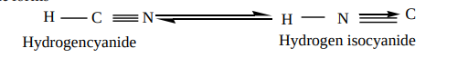

Hydrogencyanide Hydrogen isocyanide N

Two types of alkyl derivatives can be obtained. Those derived by replacement of H – atom of hydrogen cyanide by the alkyl groups are known as alkyl cyanides (R-C N).≡ and those obtained by the replacement of H – atom of hydrogen isocyanide are known as alkyl isocyanides (R-N C)

In IUPAC system, alkyl cyanides are named as “alkanenitriles” whereas aryl cyanides as “ arenecarbonitrile”.

**Table : Nomenclature of cyanides**
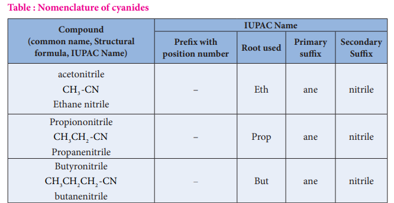
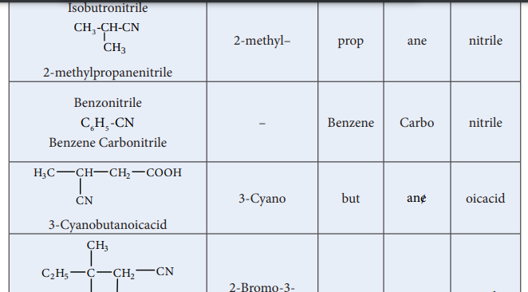

| C ompound(common name, Structural formula, IUPAC Name) |IUPAC Name |
|------|------|------|------|------|
| Prex with position number |Root used |Primar y sux |Secondar ySux |
| acetonitrileCH -CNEthane nitrile3 |– |Eth |ane |nitrile |
| PropiononitrileCH CH -CNPropanenitrile32 |– |Prop |ane |nitrile |
| ButyronitrileCH CH CH -CNbutanenitrile32 2 |– |But |ane |nitrile |
| IsobutronitrileCH -CH-CN2-methylprCoHpanenitrile3 3 |2-methyl– |prop |ane |nitrile |
| B enzonitrileCH -CNB enzene Carbonitrile65 |– |B enzene |Carbo |nitrile |
| H CC H CH CO OH3 3-Cya CNnobutan 2oicacid |3-Cyano |but |ane/ |oicacid |
| CHC H C 3 CH CN2-Br2om 5 o-3-cCl hlo Brro-3- m2 ethyl pentanenitrile. |2-Bromo-3-chloro-3- methyl |pent |ane |nitrile |
  

224

### Methods of preparation of cyanides
**1) From alkyl halides**

When alkyl halides are treated in the solution NaCN (or) KCN , alkyl cyanides are obtained. In this reaction a new carbon – carbon bond is formed.

**Example**

KCN + CH3CH2 - Br CH3CH2 - CN + KBr
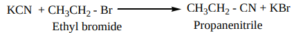

Ethyl bromide Propanenitrile

Aryl cyanide cannot be prepared in this method because of their less reactivity towards nucleophilic substitution. Aryl cyanides are prepared using Sandmeyers reactions.

**2\. By dehydration of primary amides and aldoximes with** 
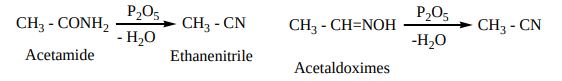
**3\. By dehydration of ammonium carboxylates with** 

This method suitable for large scale preparation of alkyl cyanides.
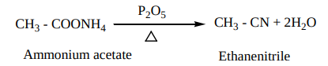

**4\. From Grignard reagent**

Methyl magnesium bromide on treatment with cyanogen chloride (Cl - CN) forms ethanenitrile.

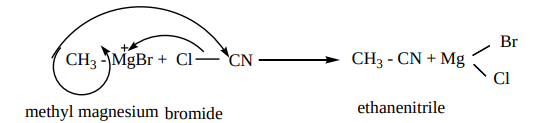

### Properties Of Cyanides

**Physical Properties**

The lower members (up to C14 ) are colourless liquids with a strong characteristic sweet smell. The higher members are crystalline solids, They are moderately soluble in water but freely souble in organic solvents. They are poisonous.

They have higher boiling points than analogous acetylenes due to their high dipole moments.

### Chemical properties

**1\. Hydrolysis**

On boiling with alkali (or) a dilute mineral acid, the cyanides are hydrolysed to give carboxylic acids.

**For example**

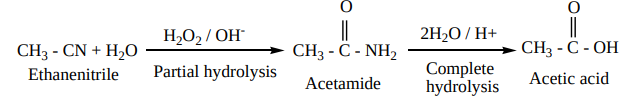

**2\. Reduction** On reduction with LiAlH (or) Ni / H

4 2 , alkyl cyanides yields primary amines.

CH3 - CN + 2H2 Ni CH3 - CH2 - NH2

Ethanenitrile Ethanamine
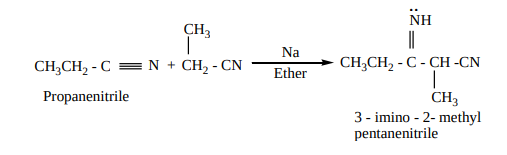

**3\. Condensation reaction**

**a) Thorpe nitrile condensation**

Self condensation of two molecules of alkyl nitrile (containing a–H atom) in the presence of sodium to form iminonitrile.

**b) The nitriles containing α- hydrogen also undergo condensation with esters in the presence** of sodamide in ether to form ketonitriles. This reaction is known as “ Levine and Hauser” acetylation

This reaction involves replacement of ethoxy (OC H )2 5 group by methylnitrile (- CH CN)2 group and is called as cyanomethylation reaction.

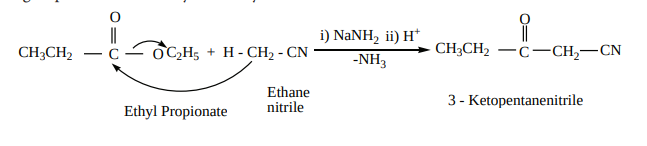

### Alkyl Isocyanides (Carbylamines)

**Nomenclature of isocyanides**

They are commonly named as Alkyl isocyanides. The IUPAC system names them as alkylcarbylamines

**Table : Nomenclature of alkylisocyanides**
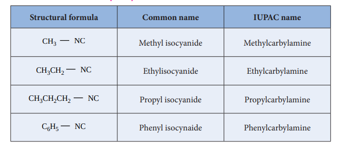

### Methods of preparation of isocyanides 1. From primary amines (carbylamines reaction)

Both aromatic as well as aliphatic amines on treatment with CHCl3 in the presence of KOH give carbylamines

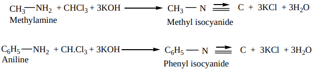

**2\. From alkyl halides**

Ethyl bromide on heating with ethanolic solution of AgCN give ethyl isocyanide as major product and ethyl cyanide as minor product.

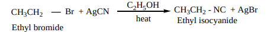

**3\. From N – alkyl formamide. By reaction with** 

| Structural formula |C ommon name |IUPAC name |
|------|------|------|
| CH NC3 |Methyl isocyanide |Methylcarbylamine |
| CH CH NC3 2 |Ethylisocyanide |Ethylcarbylamine |
| CH CH CH NC3 2 2 |Propyl isocyanide |Propylcarbylamine |
| C H NC6 5 |Phenyl isocynaide |Phenylcarbylamine |
  

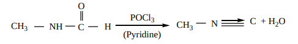

### Properties of isocyanides

**Physical properties**

• They are colourless, highly unpleasant smelling volatile liquids and are much more poisonous than the cyanides.

• They are only slightly soluble in water but are soluble in organic solvents.

• They are relatively less polar than alkyl cyanides. Thus, their melting point and boiling point are lower than cyanides.

### Chemical properties

1) **Hydrolysis**: Alkyl isocyanides are not hydrolysed by alkalies. However they are hydrolysed with dilute mineral acids to give primary amines and formic acids.

CH3 NC + 2H2O acid

CH3 NH2 + H COOH

Methylamine FormicacidMethyl isocyanide

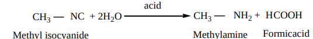

2\. **Reduction:** When reduced catalytically (or) by nascent hydrogen, they give secondary amines.

CH3 NC + 4 \[H\] Na / C2H5OH

(or) Ni / H2

CH3 NH CH3

Methyl isocyanide Dimethylamine
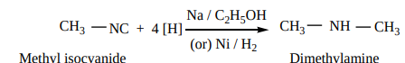

3\. **Isomerisation:** When Alkyl isocyanides and heated at 2500C, they change into the more stable, isomeric cyanides

CH3 N Heat

2500C CH3 C N:

Methyl isocyanide Methylcyanide
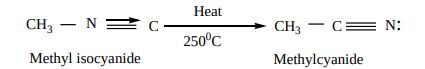

4\. **Addition reaction**. Alkyl isocyanides add on halogen, sulphur, and oxygen to form the corresponding addition compounds.

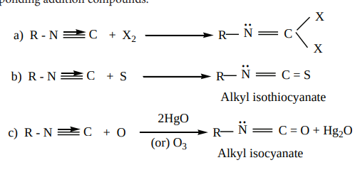

### Uses of organic nitrogen compounds

**nitroalkanes**

1\. Nitromethane is used as a fuel for cars

2\. Chloropicrin (CCl NO )3 2 is used as an insecticide

3\. Nitroethane is used as a fuel additive and precursor to explosive and they are good solvents for polymers, cellulose ester, synthetic rubber and dyes etc.,

4\. 4% solution of ethylnitrite in alcohol is known as sweet spirit of nitre and is used as diuretic.

**nitrobenzene**

1 Nitrobenzene is used to produce lubricating oils in motors and machinery.

2 It is used in the manufacture of dyes, drugs, pesticides, synthetic rubber, aniline and explosives like TNT, TNB.

**cyanides and isocyanides**

1\. Alkyl cyanides are important intermediates in the organic synthesis of larger number of compounds like acids, amides, esters, amines etc.

2 Nitriles are used in textile industry in the manufacture of nitrile rubber and also as a solvent particularly in perfume industry.

**Cancer Drug**

Mitomycin C, and anticancer agent used to treat stomach and colon cancer, contains an aziridine ring. The aziridine functional group participates in the drug’s degradation by DNA, resulting in the death of cancerous cells.

**Mitomycin**

**NITRO COMPOUNDS**

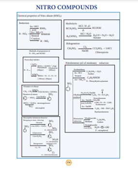

