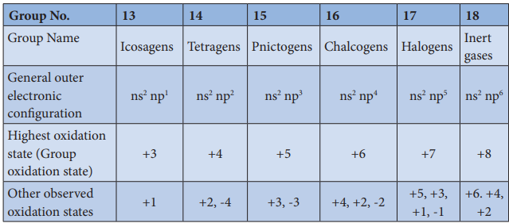
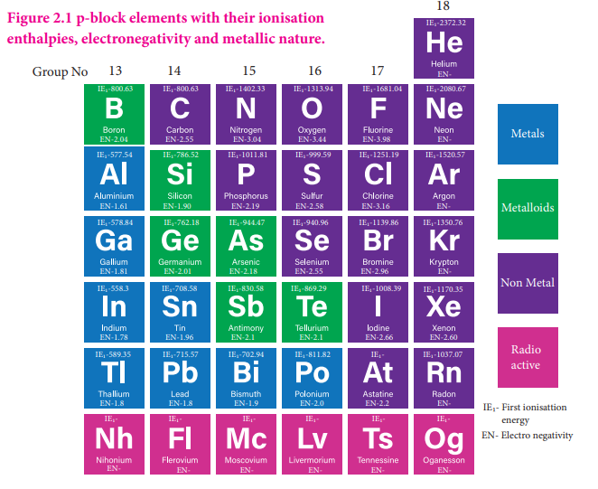
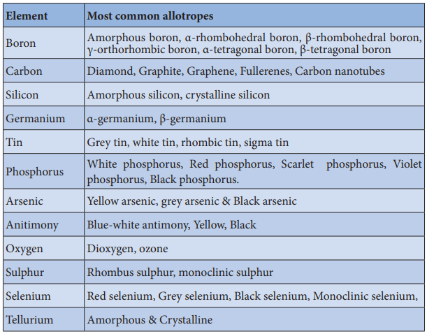

<!-- ## General trends in properties of p-block elements: -->
 We already learnt that the properties of elements largely depends on their electronic

configuration, size, ionisation enthalpy, electronegativity etc... Let us discuss the general trend in such properties of various p-block elements.

# Electronic configuration and oxidation state:

The p-block elements have a general electronic configuration of ns2, np1-6. The elements of each group have similar outer shell electronic configuration and differ only in the value of n (principal quantum number). The elements of group 18 (inert gases) have completely filled p orbitals, hence they are more stable and have least reactivity. The elements of this block show variable oxidation state and their highest oxidation state (group oxidation state) is equal to the total number of valance electrons present in them. Unlike s-block elements which show only positive oxidation state, some of the p-block elements show negative oxidation states also. The halogens have a strong tendency to gain an electron to give a stable halide ion with completely filled electronic configuration and hence -1 oxidation state is more common in halogens. Similarly, the other elements belonging to pnictogen and chalcogen groups also show negative oxidation states.

**Evaluate yourself :**

Why group 18 elements are called inert gases? Write the general electronic configuraton of group 18 elements

<!-- XII\_U2-P-Block.indd 27 2/19/2020 4:38:41 PM

www.tntextbooks.in

  

28 -->

**Table 2.1 General electronic configurations and oxidation states of p-block elements**
<!--  -->
| Group | 13             | 14             | 15             | 16             | 17             | 18           |
|-------|----------------|----------------|----------------|----------------|----------------|--------------|
| Group Name | Icosagens  | Tetragens      | Pnictogens     | Chalcogens     | Halogens       | Inert gases  |
| General outer electronic configuration | ns2 np1 | ns2 np2 | ns2 np3 | ns2 np4 | ns2 np5 | ns2 np6      |
| Highest oxidation state | +3           | +4           | +5           | +6           | +7           | +8           |
| Other observed oxidation states | +1    | +2, -4       | +3, -3       | +4, +2, -2   | +5, +3, +1, -1 | +6, +4, +2   |

<!-- **Group No. 13 14 15 16 17 18** Group Name

Icosagens Tetragens Pnictogens Chalcogens Halogens Inert gases

General outer electronic configuration

ns2 np1 ns2 np2 ns2 np3 ns2 np4 ns2 np5 ns2 np6

Highest oxidation state (Group oxidation state)

+3 +4 +5 +6 +7 +8

Other observed oxidation states

+1 +2, -4 +3, -3 +4, +2, -2 +5, +3, +1, -1

+6. +4, +2 -->

# Metallic nature:

The tendency of an element to form a cation by loosing electrons is known as electropositive or metallic character. This character depends on the ionisation energy. Generally on descending a group the ionisation energy decreases and hence the metallic character increases.

<!-- 13 14 15 16 17

18

EN-2.04

EN-1.61

EN-1.81

EN-1.78

EN-1.8

EN- EN- EN- EN- EN- EN-

EN-1.8 EN-1.9 EN-2.0 EN-2.2 EN-

EN- Electro negativity

EN-1.96 EN-2.1 EN-2.1 EN-2.66 EN-2.60

EN-2.01 EN-2.18 EN-2.55 EN-2.96 EN-

EN-1.90 EN-2.19 EN-2.58 EN-3.16 EN-

IE1-800.63

IE1-577.54

IE1-578.84

IE1-558.3

IE1-589.35 IE1-715.57 IE1-702.94 IE1-811.82 IE1-1037.07IE1-

IE1- First ionisattion energyIE1-IE1-IE1-IE1-IE1-IE1-

IE1-708.58 IE1-830.58 IE1-869.29 IE1-1008.39 IE1-1170.35

IE1-762.18 IE1-944.47 IE1-940.96 IE1-1139.86 IE1-1350.76

IE1-786.52 IE1-1011.81 IE1-999.59 IE1-1251.19 IE1-1520.57

EN-2.55 EN-3.04 EN-3.44 EN-3.98 EN-

EN-

IE1-800.63 IE1-1402.33 IE1-1313.94 IE1-1681.04 IE1-2080.67

IE1-2372.32

Group No

Metals

Metalloids

Non Metal

Radio active

**Figure 2.1 p-block elements with their ionisation enthalpies, electronegativity and metallic nature.**

XII\_U2-P-Block.indd 28 2/19/2020 4:38:41 PM

www.tntextbooks.in

| Group No. |13 |14 |15 |16 |17 |18 |
|------|------|------|------|------|------|------|
| Group Name |Icosagens |Tetragens |Pnictogens |Chalcogens |Halogens |Inert gases |
| General outer electronic conguration |ns  np2 1 |ns  np2 2 |ns  np2 3 |ns  np2 4 |ns  np2 5 |ns  np2 6 |
| Highest oxidation state (Group oxidation state) |+3 |+4 |+5 |+6 |+7 |+8 |
| Other obser ved oxidation states |+1 |+2, -4 |+3, -3 |+4, +2, -2 |+5, +3, +1, -1 |+6. +4, +2 |
  

29 -->

In p-block, the elements present in lower left part are metals while the elements in the upper right part are non metals. Elements of group 13 have metallic character except the first element boron which is a metalloid, having properties intermediate between the metal and nonmetals. The atomic radius of boron is very small and it has relatively high nuclear charge and these properties are responsible for its nonmetallic character. In the subsequent groups the non-metallic character increases. In group 14 elements, carbon is a nonmetal while silicon and germanium are metalloids. In group 15, nitrogen and phosphorus are non metals and arsenic & antimony are metalloids. In group 16, oxygen, sulphur and selenium are non metals and tellurium is a metalloid. All the elements of group 17 and 18 are non metals.

# Ionisation Enthalpy:

We have already learnt that as we move down a group, generally there is a steady decrease in ionisation enthalpy of elements due to increase in their atomic radius. In p-block elements, there are some minor deviations to this general trend. In group 13, from boron to aluminium the ionisation enthalpy decreases as expected. But from aluminium to thallium there is only a marginal difference. This is due to the presence of inner d and f-electrons which has poor shielding effect compared to s and p-electrons. As a result, the effective nuclear charge on the valance electrons increases. A similar trend is also observed in group 14. The remaining groups (15 to 18) follow the general trend. In these groups, the ionisation enthalpy decreases, as we move down the group. Here, poor shielding effect of d- and f-electrons are overcome by the increased shielding effect of the additional p-electrons. The ionisation enthalpy of elements in successive groups is higher than the corresponding elements of the previous group as expected.

# Electronegativity

As we move down the 13th group, the electronegativity first decreases from boron to aluminium and then marginally increases for Gallium, thereafter there is no appreciable change. Similar trend is also observed in 14 th group as well. In other groups, as we move down the group, the electro negativity decreases. This observed trend can be correlated with their atomic radius.

# Anomalous properties of the first elements:

In p-block elements, the first member of each group differs from the other elements of the corresponding group. The following factors are responsible for this anomalous behaviour.

1\. Small size of the first member 2. High ionisation enthalpy and high electronegativity 3. Absence of d orbitals in their valance shell

The first member of the group 13, boron is a metalloid while others are reactive metals. Moreover, boron shows diagonal relationship with silicon of group 14. The oxides of boron and silicon are similar in their acidic nature. Both boron and silicon form covalent hydrides that can be easily hydrolysed. Similarly, except boron trifluoride, halides of both elements are readily hydrolysed.

<!-- XII\_U2-P-Block.indd 29 2/19/2020 4:38:41 PM

www.tntextbooks.in

  

30 -->

In group 14, the first element carbon is strictly a nonmetal while other elements are metalloids (silicon & germanium) or metals (tin & lead). Unlike other elements of the group carbon can form multiple bonds such as C=C, C=O etc... Carbon has a greater tendency to form a chain of bonds with itself or with other atoms which is known as catenation. There is considerable decrease in catenation property down the group (C>>Si>Ge≈Sn>Pb).

In group 15 also the first element nitrogen differs from the rest of the elements of the group. Like carbon, the nitrogen can from multiple bonds (N=N, C=N, N=O etc...). Nitrogen is a diatomic gas unlike the other members of the group. Similarly in group 16, the first element, oxygen also exists as a diatomic gas in that group. Due to its high electronegativity it forms hydrogen bonds.

The first element of group 17, fluorine the most electronegative element, also behaves quiet differently compared to the rest of the members of group. Like oxygen it also forms hydrogen bonds. It shows only -1 oxidation state while the other halogens have +1, +3, +5 and +7 oxidation states in addition to -1 state. The fluorine is the strongest oxidising agent and the most reactive element among the halogens.

# Inert pair effect:

We have already learnt that the alkali and alkaline earth metals have an oxidation state of +1 and +2 respectively, corresponding to the total number of electrons present in them. Similarly, the elements of p-block also show the oxidation states corresponding to the maximum number of valence electrons (group oxidation state). In addition they also show variable oxidation state. In case of the heavier post-transition elements belonging to the groups (13 to 16), the most stable oxidation state is two less than the group oxidation state and there is a reluctance to exhibit the group oxidation state. Let us consider group 13 elements. As we move from boron to heavier elements, there is an increasing tendency to have +1 oxidation state, rather than the group oxidation state, +3. For example Al+3 is more stable than Al+1 while Tl+1 is more stable than Tl+3. Aluminium(III)chloride is stable whereas thallium(III)chloride is highly unstable and disproportionates to thallium(I) chloride and chlorine gas. This shows that in thallium the stable lower oxidation state corresponds to the loss of np electrons only and not ns electrons. Thus in heavier post- transition metals, the outer s electrons (ns) have a tendency to remain inert and show reluctance to take part in the bonding, which is known as inert pair effect. This effect is also observed in groups 14, 15 and 16.

# Allotropism in p-block elements:

Some elements exist in more than one crystalline or molecular forms in the same physical state. For example, carbon exists as diamond and graphite. This phenomenon is called allotropism (in greek 'allos' means another and 'trope' means change) and the different forms of an element are called allotropes. Many p-block elements show allotropism and some of the common allotropes are listed in the table.

<!-- XII\_U2-P-Block.indd 30 2/19/2020 4:38:41 PM

www.tntextbooks.in

  

31 -->

**Table 2.2 : Some of common allotropes of p-block elements**

<!--  -->

| Element    | Most Common Allotropes                                          |
|------------|----------------------------------------------------------------|
| Boron      | Amorphous boron, α-rhombohedral boron, β-rhombohedral boron, γ-orthorhombic boron, α-tetragonal boron, β-tetragonal boron |
| Carbon     | Diamond, Graphite, Graphene, Fullerenes, Carbon nanotubes       |
| Silicon    | Amorphous silicon, crystalline silicon                         |
| Germanium  | α-germanium, β-germanium                                       |
| Tin        | Grey tin, white tin, rhombic tin, sigma tin                    |
| Phosphorus | White phosphorus, Red phosphorus, Scarlet phosphorus, Violet phosphorus, Black phosphorus |
| Arsenic    | Yellow arsenic, grey arsenic & Black arsenic                   |
| Antimony   | Blue-white antimony, Yellow, Black                             |
| Oxygen     | Dioxygen, ozone                                                |
| Sulphur    | Rhombus sulphur, monoclinic sulphur                            |
| Selenium   | Red selenium, Grey selenium, Black selenium, Monoclinic selenium |
| Tellurium  | Amorphous & Crystalline                                        |

<!-- **Element Most common allotropes**

Boron Amorphous boron, α-rhombohedral boron, β-rhombohedral boron, γ-orthorhombic boron, α-tetragonal boron, β-tetragonal boron

Carbon Diamond, Graphite, Graphene, Fullerenes, Carbon nanotubes

Silicon Amorphous silicon, crystalline silicon

Germanium α-germanium, β-germanium

Tin Grey tin, white tin, rhombic tin, sigma tin

Phosphorus White phosphorus, Red phosphorus, Scarlet phosphorus, Violet phosphorus, Black phosphorus.

Arsenic Yellow arsenic, gray arsenic & Black arsenic

Anitimony Blue-white antimony, Yellow, Black

Oxygen Dioxygen, ozone

Sulphur Rhombus sulphur, monoclinic sulphur

Selenium Red selenium, Gray selenium, Black selenium, Monoclinic selenium,

Tellurium Amorphous & Crystalline
 -->

