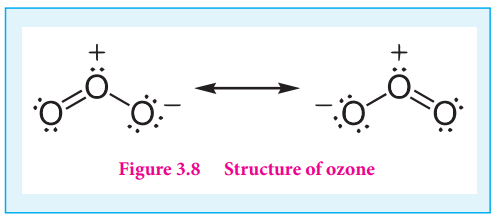
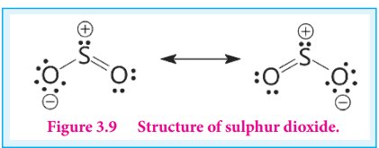

## Oxygen:

**Preparation: The atmosphere and water contain 23% and 83% by mass of oxygen respectively.** Most of the world’s rock contain combined oxygen. Industrially oxygen is obtained by fractional distillation of liquefied air. In the laboratory, oxygen is prepared by one of the following methods.

The decomposition of hydrogen peroxide in the presence of catalyst (MnO2) or by oxidation with potassium permanganate.

2H2O2 ⇌ 2H2O + O2

5H2O2 + 2MnO4- + 6H+ → 5O2+8H2O+2Mn2+
 

The thermal decomposition of certain metallic oxides or oxoanions gives oxygen.

2HgO → 2Hg + O2

2BaO → 2BaO + O2

2KClO3 →  2KCl + 3O2

2KNO3 → 2KNO2 + O2

**Properties**

Under ordinary condition oxygen exists as a diatomic gas. Oxygen is paramagnetic. Like nitrogen and fluorine, oxygen form strong hydrogen bonds. Oxygen exists in two allotropic forms namely dioxygen (O2) and ozone or trioxygen (O3). Although negligible amounts of ozone occurs at sea level it is formed in the upper atmosphere by the action of ultraviolet light. In the laboratory ozone is prepared by passing electrical discharge through oxygen. At a potential of 20,000 V about 10% of oxygen is converted into ozone it gives a mixture known as ozonised oxygen. Pure ozone is obtained as a pale blue gas by the fractional distillation of liquefied ozonised oxygen.

O2 ⇌ 2(O)

O2+ (O) ⇌ O3

The ozone molecule has a bent shape and symmetrical with delocalised bonding between the oxygen atoms.

**Figure 3.8 Structure of ozone**

**Chemical properties:**

The chemical properties of oxygen and ozone differ vastly. Oxygen combines with many metals and non-metals to form oxides. With some elements such as s-block elements combination of oxygen occurs at room temperature. Some of less reactive metals react when powdered finely and made to react exothermically with oxygen at room temperature but a lump of metal is unaffected under same condition. These finely divided metals are known as pyrophoric and when set the powder on fire, heat is liberated during a reaction.

On the other hand ozone is a powerful oxidising agent and it reacts with many substances under conditions where oxygen will not react. For example, it oxidises potassium iodide to iodine. This reaction is quantitative and can be used for estimation of ozone.

O3 + 2KI + H2O → 2KOH + O2 +I2

Ozone is commonly used for oxidation of organic compounds. In acidic solution ozone exceeds the oxidising power of fluorine and atomic oxygen. The rate of decomposition of ozone drops sharply in alkaline solution.

**Uses:**

1\. Oxygen is one of the essential component for the survival of living organisms.

2\. It is used in welding (oxyacetylene welding)

3\. Liquid oxygen is used as fuel in rockets etc...

### Allotrophic forms of sulphur

Sulphur exists in crystalline as well as amorphous allotrophic forms. The crystalline form includes rhombic sulphur (α sulphur) and monoclinic sulphur (β sulphur). Amorphous allotropic form includes plastic sulphur (γ sulphur), milk of sulphur and colloidal sulphur.

**Rhombic sulphur** also known as α sulphur, is the only thermodynamically stable allotropic form at ordinary temperature and pressure. The crystals have a characteristic yellow colour and composed of S8 molecules. When heated slowly above 96 ⁰C, it converts into monoclinic sulphur. Upon cooling below 96 ⁰C the β form converts back to α form. **Monoclinic sulphur** also contains S8 molecules in addition to small amount of S6 molecules. It exists as a long needle like prism and is also called as prismatic sulphur. It is stable between 96 ⁰C - 119 ⁰C and slowly changes into rhombic sulphur.

When molten sulphur is poured into cold water a yellow rubbery ribbon of plastic sulphur is produced. They are very soft and can be stretched easily. On standing (cooling slowly) it slowly becomes hard and changes to stable rhombic sulphur.

Sulphur also exists in liquid and gaseous states. At around 140 ⁰C the monoclinic sulphur melts to form mobile pale yellow liquid called λ sulphur. The vapour over the liquid sulphur consists of 90 % of S8, S7 & S6 and small amount of mixture of S2, S3, S4, S5 molecules.

### Sulphur dioxide

**Preparation**

**From sulphur:** A large-scale production of sulphur dioxide is done by burning sulphur in air. About 6-8% of sulphur is oxidised to SO3.

S + O2 →  SO2

2S + 3O2 →  2SO3

**From sulphides:** When sulphide ores such as galena (PbS), zinc blende (ZnS) are roasted in air, sulphur dioxide is liberated. Large amounts of sulphur dioxide required for manufacturing of sulphuric acid and other industrial purpose is prepared by this method.

2ZnS + 3O2+ Δ →  2ZnO + 2SO2 

4FeS2 + 11O2 + Δ → 2Fe2 O3 + 8SO2 

**Laboratory preparation:** Sulphur dioxide is prepared in the laboratory treating a metal or metal sulphite with sulphuric acid

Cu + 2H2 SO4 → CuSO4  + SO2  + 2H2 O

SO32-  + 2H +  → H2O + SO2

**Properties:**

Sulphur dioxide gas is found in volcanic eruptions. A large amount of sulphur dioxide gas is released into atmosphere from power plants using coal and oil and copper melting plants. It is a colourless gas with a suffocating odour. It is highly soluble in water and it is 2.2 times heavier than air. Sulphur dioxide can be liquefied (boiling point 263 K) at 2.5 atmospheric pressure and 288 K.

**Chemical properties**

Sulphur dioxide is an acidic oxide. It dissolves in water to give sulphurous acid.

SO2 + H2 O ⇆  H2SO3

H2SO3 ⇆ 2H++SO32-

**Reaction with sodium hydroxide and sodium carbonate:** Sulphur dioxide reacts with sodium hydroxide and sodium carbonate to form sodium bisulphite and sodium sulphite respectively.

SO2 +NaOH → NaHSO3

2SO2  + Na2CO3+H2O → 2NaHSO3 +CO2

**Oxidising property:** Sulphur dioxide, oxidises hydrogen sulphide to sulphur and magnesium to magnesium oxide.

2H2S + SO2 →  3S + 2H2O

2Mg + SO2 →  2MgO + S

**Reducing property:** As it can readily be oxidised, it acts as a reducing agent. It reduces chlorine into hydrochloric acid.

SO2+ 2H2O + Cl2 → H2SO4 + 2HCl 

It also reduces potassium permanganate and dichromate to Mn2+ and Cr3+ respectively.

2KMnO4+ 5SO2 + 2H2O →  K2SO4 + 2MnSO4+ 2H2SO4

K2Cr2O7 + 3SO2 + H2SO4  →  K2SO4 + Cr2 (SO4)3 + H2O

**Reaction with oxygen:** Sulphur dioxide is oxidised to sulphur trioxide upon heating with oxygen at high temperature. This reaction is used for the manufacture of sulphuric acid by contact process.

2SO2(g) + O2(g) →  2SO3

**Bleaching action of sulphur dioxide:** In presence of water, sulphur dioxide bleaches coloured wool, silk, sponges and straw into colourless due to its reducing property.

SO2+ 2H2O  →  H2SO4 + 2

X + 2(H) →  XH2

However, the bleached product (colourless) is allowed to stand in air, it is reoxidised by atmospheric oxygen to its original colour. Hence bleaching action of sulphur dioxide is temporary.

**Uses:**

1\. Sulphur dioxide is used in bleaching hair, silk, wool etc...

2\. It can be used for disinfecting crops and plants in agriculture.

**Structure of sulphur dioxide:**

In sulphur dioxide, sulphur atom undergoes sp2 hybridisation. A double bond arises between S and O is due to pπ- dπ overlapping.

**Figure 3.9 Structure of sulphur dioxide.**

### Sulphuric acid: (H2SO4)

**Preparation:**

Sulphuric acid can be manufactured by lead chamber process, cascade process or contact process. Here we discuss the contact process.

**Manufacture of sulphuric acid by contact process:**

The contact process involves the following steps.

i. Initially sulphur dioxide is produced by burning sulphur or iron pyrites in oxygen/air.

 

S + O2 → SO2

4FeS2 + 11O2  → 2Fe2O3 + 8SO2

ii. Sulphur dioxide formed is oxidised to sulphur trioxide by air in the presence of a catalyst such as V2O5 or platinised asbestos.

iii. The sulphur trioxide is absorbed in concentrated sulphuric acid and produces oleum (H2S2O7). The oleum is converted into sulphuric acid by diluting it with water.

 SO3 + H2SO4  → H2S2O7 +H2O → 2H2SO4 

To maximise the yield the plant is operated at 2 bar pressure and 720 K. The sulphuric acid obtained in this process is over 96 % pure.

**Physical properties:**

Pure sulphuric acid is a colourless, viscous liquid (Density: 1.84 g/mL at 298 K). High boiling point and viscosity of sulphuric acid is due to the association of molecules together through hydrogen bonding.

The acid freezes at 283.4 K and boils at 590 K. It is highly soluble in water and has strong affinity towards water and hence it can be used as a dehydrating agent. When dissolved in water, it forms mono (H2SO4.H2O) and dihydrates (H2SO4.2H2O) and the reaction is exothermic.

The dehydrating property can also be illustrated by its reaction with organic compounds such as sugar, oxalic acid and formic acid.

C12H22O11 + H2SO4  → 12C + H2SO4 .11H2O

HCOOH +H2SO4  → CO+H2SO4.H2O

(COOH)2 + H2SO4 → CO+CO2+H2SO4.H2O

**Chemical Properties:** Sulphuric acid is highly reactive. It can act as strong acid and an oxidising agent.

**Decomposition:** Sulphuric acid is stable, however, it decomposes at high temperatures to sulphur trioxide.

H2SO4 → H2O + SO3

**Acidic nature:** It is a strong dibasic acid. Hence it forms two types of salts namely sulphates and bisulphates.

H2SO4 + NaOH →  NaHSO4 + H2O

H2SO4 + 2NaOH →  Na2SO4 + 2H2O

H2SO4 +2NH3 → (NH4)2SO4

**Oxidising property:** Sulphuric acid is an oxidising agent as it produces nascent oxygen as shown below.

  

H2SO4 →  H2O + SO2+ (O) 
 

Sulphuric acid oxidises elements such as carbon, sulphur and phosphorus. It also oxidises bromide and iodide to bromine and iodine respectively.

C + 2H2SO4  → 2SO2 + 2H2O + CO2

S + 2H2SO4  → 3SO2 + 2H2O

P4 + 10H2SO4 →  4H3PO4 + 10SO2 + 4H2O

H2S + H2SO4 → SO2+2H2O+S

 H2SO4+2HI → SO2+2H2O+I2

H2SO4+2HBR → SO2+2H2O+Br2

**Reaction with metals: Sulphuric acid reacts with metals and gives different product depending** on the reactants and reacting condition.

Dilute sulphuric acid reacts with metals like tin, aluminium, zinc to give corresponding sulphates.

Zn + H SO ZnSO + H

2Al + 3H SO Al (SO ) + 3

2 4

4 2

2 4

2 4 3

 → ↑

 → H 2

↑

Hot concentrated sulphuric acid reacts with copper and lead to give the respective sulphates as shown below.

Cu + 2H SO CuSO + 2H O + SO 2 4

4 2 2  → ↑

Pb + 2H SO PbSO + 2H O + SO 2 4

4 2 2  → ↑

Sulphuric acid doesn’t react with noble metals like gold, silver and platinum.

**Reaction with salts: It reacts with different metal salts to give metal sulphates and bisulphates.** KCl + H SO KHSO + HCl

KNO + H SO KHSO + HNO

2 4

4

3 2 4

4 3

 →

 →

Na CO + H SO Na SO + H O + CO

2NaBr + 3H SO

2 3 2 4

2 4 2 2

2 4

 →

 → 2NaHSO + 2H O + Br + SO 4 2 2 2

**Reaction with organic compounds:** It reacts organic compounds such as benzene to give sulphonic acids.

C H + H SO C H SO H + 6 6

Benzene

2 4

6 5 3

Benzene sulphonic acid

 → H O 2

**Uses of sulphuric acid:**

1\. Sulphuric acid is used in the manufacture of fertilisers, ammonium sulphate and super phosphates and other chemicals such as hydrochloric acid, nitric acid etc...

2\. It is used as a drying agent and also used in the preparation of pigments, explosives etc..

XII U3-P-block.indd 79 2/19/2020 4:41:16 PM

www.tntextbooks.in

  

80

**Test for sulphate/sulphuric acid:**

Dilute solution of sulphuric acid/aqueous solution of sulphates gives white precipitate (barium sulphate) with barium chloride solution. It can also be detected using lead acetate solution. Here a white precipitate of lead sulphate is obtained.

BaCl + H SO BaSO 2 2 4

4

Barium sulphate

(White precipita

 → ↓ te)

3 2 2 4

4

Lead sulphat

\+ 2HCl

(CH COO) Pb + H SO PbSO → ↓ e

(White precipitate)

\+ 2CH3COOH

**Structure of oxoacids of sulphur:**

Sulphur forms many oxoacids. The most important one is sulphuric acid. Some acids like sulphurous and dithionic acids are known in the form of their salts only since the free acids are unstable and cannot be isolated.

Various oxo acids of sulphur with their structures are given below

**Name Molecular Formula Structure**

Sulphurous acid H2SO3

O S

HO OH

Sulphuric acid H2SO4

O

O S OHHO

Thiosulphuric acid H2S2O3

S

O S OHHO

Dithionous acid H2S2O4

O S SHO

O OH

Disulphurous acid or Pyrosulphurous acid

H2S2O5

O S SHO

O OH

O

XII U3-P-block.indd 80 2/19/2020 4:41:18 PM

www.tntextbooks.in

| Name |Molecular Formula |Structure |
|------|------|------|
| Sulphurous acid |H SO2 3 |OSHO OH |
| Sulphuric acid |H SO2 4 |OHO SO HO |
| iosulphuric acid |H S O2 2 3 |SHO SO HO |
| Dithionous acid |H S O2 2 4 |O OHO SS OH |
| Disulphurous acid or Pyrosulphurous acid |H S O2 2 5 |O OHO SS OHO |
  

81

**Name Molecular Formula Structure**

Disulphuric acid or pyrosulphuric acid

H2S2O7

O SHO O

S O

O OH O

Peroxymono sulphuric acid (Caro's acid)

H2SO5

O

O S OHO OH

Peroxodisulphuric acid. Marshall’s acid

H2S2O8

O SHO O

S O

O O OH O

Dithionic acid H2S2O6

O S SHO

O OH

O O

Polythionic acid H2Sn+2O6

O SHO O

S O

(S)n OH O
