# Occurrence:

About 78% of earth atmosphere contains dinitorgen (N2) gas. It is also present in earth crust as sodium nitrate (Chile saltpetre) and potassium nitrate (Indian saltpetre). The 11th most abundant element phosphorus, exists as phosphate (fluroapatite, chloroapatite and hydroxyapatite). The other elements arsenic, antimony and bismuth are present as sulphides and are not very abundant.

# Physical properties:

Some of the physical properties of the group 15 elements are listed below

**Table 3.1 Physical properties of group 15 elements**

<!-- 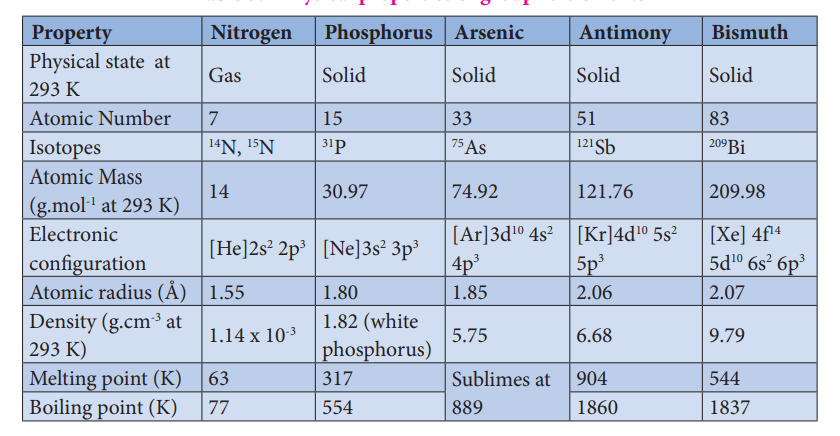 -->

| Property |Nitrogen |Phosphorus |Arsenic |Antimony |Bismuth |
|------|------|------|------|------|------|
| Physical state  at 293 K |Gas |Solid |Solid |Solid |Solid |
| Atomic Number |7 |15 |33 |51 |83 |
| Isotopes |N,  N14 15 |P31 |As75 |Sb121 |Bi209 |
| Atomic Mass (g.mol  at 293 K)-1 |14 |30.97 |74.92 |121.76 |209.98 |
| Electronic conguration |[He]2s  2p2 3 |[Ne]3s  3p2 3 |[Ar]3d  4s4p10 23 |[Kr]4d  5s5p10 23 |[Xe] 4f5d  6s  6p1410 2 3 |
| Atomic radius (Å) |1.55 |1.80 |1.85 |2.06 |2.07 |
| Density (g.cm  at293 K)-3 |1.14 x 10-3 |1.82 (white phosphorus) |5.75 |6.68 |9.79 |
| Melting point (K) |63 |317 |Sublimes at 889 |904 |544 |
| B oiling point (K) |77 |554 |Sublimes at 889|1860 |1837 |

# Nitrogen:

**Preparation:**

Nitrogen, the principal gas of atmosphere (78 % by volume) is separated industrially from liquid air by fractional distillation

Pure nitrogen gas can be obtained by the thermal decomposition of sodium azide about 575 K

2NaN3→2 Na+3N2

It can also be obtained by oxidising ammonia using bromine water

8NH3+ 3Br2 → 6NH4Br + N2

**Properties:**

Nitrogen gas is rather inert. Terrestrial nitrogen contains 14.5% and 0.4% of nitrogen-14 and nitrogen-15 respectively. The later is used for isotopic labelling. The chemically inert character of nitrogen is largely due to high bonding energy of the molecules 225 cal mol-1 (946 kJ mol-1). Interestingly the triply bonded species is notable for its less reactivity in comparison with other iso-electronic triply bonded systems such as -C≡C-, C≡O, X-C≡N, X-N≡C, -C≡C-, and -C≡N. These groups can act as donor where as dinitrogen cannot. However, it can form complexes with metal (M← N≡N) like CO to a less extent

The only reaction of nitrogen at room temperature is with lithium forming Li3N. With other elements, nitrogen combines only at elevated temperatures. Group 2 metals and Th forms ionic nitrides.

  6Li + N 2 → 2Li3N


3Ca + N_2 \xrightarrow[]{red hot}Ca_3N_2



2B + N_2 \xrightarrow[]{bright red hot}2BN


Direct reaction with hydrogen gives ammonia. This reaction is favoured by high pressures and at optimum temperature in presence of iron catalyst. This reaction is the basis of Haber’s process for the synthesis of ammonia.

1/2N2+3/2H2⇌ NH3  ΔHf=-46.2kJ mol-1

With oxygen, nitrogen produces nitrous oxide at high temperatures. Even at 3473 K nitrous oxide yield is only 4.4%.

2N  2+ O2  → 2N2O

**Uses of nitrogen**

1\. Nitrogen is used for the manufacture of ammonia, nitric acid and calcium cyanamide etc.

2\. Liquid nitrogen is used for producing low temperature required in cryosurgery, and so in biological preservation .

# Ammonia (NH3)

**Preparation:**

Ammonia is formed by the hydrolysis of urea. 
 NH2CONH2 +H2O →2NH3+CO2

Ammonia is prepared in the laboratory by heating an ammonium salt with a base.

NH4++OH-→ NH3+H2O

2NH4Cl+CaO →CaCl2+2NH3+H20

It can also be prepared by heating a metal nitrides such as magnesium nitride with water. Mg N 6H O 3Mg(OH) + 2NH

Mg3N2+6H20 →3Mg(OH)2+2NH3

It is industrially manufactured by passing nitrogen and hydrogen over iron catalyst (a small amount of K2O and Al2O3 is also used to increase the rate of attainment of equilibrium) at 750 K at 200 atm pressure. In the actual process the hydrogen required is obtained from water gas and nitrogen from fractional distillation of liquid air.

**Properties:**

Ammonia is a pungent smelling gas and is lighter than air. It can readily liquefied by at about 9 atmospheric pressure. The liquid boils at -38.4°C and freezes at -77° C. Liquid ammonia resembles water in its physical properties. i.e. it is highly associated through strong hydrogen bonding. Ammonia is extremely soluble in water (702 Volume in 1 Volume of water) at 20°C and 760mm pressure.

At low temperatures two soluble hydrate NH3.H2O and 2NH3.H2O are isolated. In these molecules ammonia and water are linked by hydrogen bonds. In aqueous solutions also ammonia may be hydrated in a similar manner and we call the same as (NH3.H2O)

NH3+H20 ⇌ NH4++OH-

The dielectric constant of ammonia is considerably high to make it a fairly good ionising solvent like water.

2NH3 ⇌ NH4++NH2-

K-50oC =[NH4+][NH2-]=10-30

2H20 ⇌ H30++OH-

K25oC =[H30+][OH-]=10-14

**Chemical Properties:**

Action of heat:
 Above 500°C ammonia decomposes into its elements. The decomposition may** be accelerated by metallic catalysts like Nickel, Iron. Almost complete dissociation occurs on continuous sparking.


2NH_3  \xrightarrow[{}]{>500°C}N_2+3H_2


**Reaction with air/oxygen:**
 Ammonia does not burn in air but burns freely in free oxygen with a yellowish flame to give nitrogen and steam.

4NH3+3O2 ⇌ 2N2+6H2O

In presence of catalyst like platinum, it burns to produce nitric oxide. This process is used for the manufacture of nitric acid and is known as ostwalds process.

4NH3+5O2 ⇌ 4N0+6H2O

**Reducing property:**
Ammonia acts as a reducing agent. It reduces the metal oxides to metal when passed over heated metallic oxide.

3PbO + 2NH 3  → 3Pb + N2 +3H2O 

**Reaction with acids:**
 When treated with acids it forms ammonium salts. This reaction shows** that the affinity of ammonia for proton is greater than that of water.

**Reaction with chlorine and chlorides:**
 Ammonia reacts with chlorine and chlorides to give ammonium chloride as a final product. The reactions are different under different conditions as given below.

With excess ammonia 

2NH 3 + 3 Cl2  → N2+ 6 HCl

6HCl + 6NH3 → 6 NH4Cl

With excess of chlorine ammonia reacts to give nitrogen trichloride, an explosive substance.

2NH 3 + 6 Cl2 → 2NCl3+6HCl

2NH 3(g)+HCl(g) → NH4cl(s)

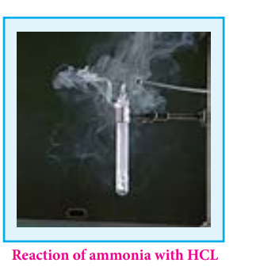

**Formation of amides and nitrides:**
 With strong electro positive metals such as sodium, ammonia forms amides while it forms nitrides with metals like magnesium.

2Na + 2NH3 → 2NaNH2+ H2

3Mg+ 2NH3 → Mg3N2+3H2

**With metallic salts:**
 Ammonia reacts with metallic salts to give metal hydroxides (in case of Fe) or forming complexes (in case Cu)

Fe3++ 3NH4++3OH- → Fe(OH)3+3NH4+

Cu2++4NH3 →[Cu(NH3)4]2+

**Formation of amines:**
 Ammonia forms ammonated compounds by ion dipole attraction. Eg. \[CaCl2.8NH3\]. In this, the negative ends of ammonia dipole is attracted to Ca2+ ion.

It can also act as a ligand and form coordination compounds such as \[Co(NH3)6\] 3+, \[Ag(NH3)2\]+

For example when excess ammonia is added to aqueous solution copper sulphate a deep blue colour compound \[Cu(NH3)4\]2+ is formed.

**Structure of ammonia**

Ammonia molecule is pyramidal in shape N-H bond distance is 1.016 Å and H-H bond distance is 1.645 Å with a bond angle 107°. The structure of ammonia may be regarded as a tetrahedral with

**Figure 3.1 Structure of ammonia**

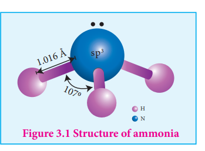

one lone pair of electrons in one tetrahedral position hence it has a pyramidal shape as shown in the figure.

# Nitric acid

**Preparation:**

Nitric acid is prepared by heating equal amounts of potassium or sodium nitrate with concentrated sulphuric acid.

KNO3 + H2SO4  →  KHSO4+ HNO3

The temperature is kept as low as possible to avoid decomposition of nitric acid. The acid condenses to a fuming liquid which is coloured brown by the presence of a little nitrogen dioxide which is formed due to the decomposition of nitric acid.

4HNO3   → 4NO2 + 2H2O + O2

**Commercial method of preparation:**

Nitric acid prepared in large scales using Ostwald's process. In this method ammonia from Haber’s process is mixed about 10 times of air. This mixture is preheated and passed into the catalyst chamber where they come in contact with platinum gauze. The temperature rises to about 1275 K and the metallic gauze brings about the rapid catalytic oxidation of ammonia resulting in the formation of NO, which then oxidised to nitrogen dioxide.

4NH3 + 5O2 →  4NO + 6H2O + 120 kJ 

2NO + O2 →  2NO2

The nitrogen dioxide produced is passed through a series of adsorption towers. It reacts with water to give nitric acid. Nitric oxide formed is bleached by blowing air.

3NO2 + H2 O →  2HNO3
+NO

Preparation Properties

Pure nitric acid is colourless. It boils at 86 °C. The acid is completely miscible with water forming a constant boiling mixture (98% HNO3, Boiling point 120.5 °C). Fuming nitric acid contains oxides of nitrogen. It decomposes on exposure to sunlight or on being heated, into nitrogen dioxide, water and oxygen.

4HNO3  →  4NO2 + 2H2O + O2

Due to this reaction pure acid or its concentrated solution becomes yellow on standing.

In most of the reactions, nitric acid acts as an oxidising agent. Hence the oxidation state changes from +5 to a lower one. It doesn’t yield hydrogen in its reaction with metals. Nitric acid can act as an acid, an oxidizing agent and an nitrating agent.

 Preparation As an acid:
 Like other acids it reacts with bases and basic oxides to form salts and water

ZnO + 2HNO3  → Zn(NO3)2 + H2O 

3FeO + 10HNO3  → 3Fe(NO3)3 + NO + 5H2O 

As an oxidising agent: 
The nonmetals like carbon, sulphur, phosphorus and iodine are** oxidised by nitric acid.

C + 4HNO3  → 2H2O + 4NO3 + CO2

S + 2HNO3 → H2SO4 + 2NO 

P4 + 20HNO3 →   4H3PO4 + 4H2O + 20NO2

3I2 + 10HNO3 →   6HIO3 + 10NO + 2H2O 

HNO3 + F2 →  HF + NO3F

3H2S + 2HNO3 →  3S + 2NO + 4H2O 

 As an nitrating agent:
 In organic compounds replacement of a –H atom with –NO2 is often** referred as nitration. For example.

C2H2+ HNO3 → C6H5NO2 + H2O  (∆ H2SO4)

 Nitration takes place due to the formation of nitronium ion

HNO3 + H2SO4 →  NO2+ + H2O + HSO4-

Action of nitric acid on metals

All metals with the exception of gold, platinum, rhodium, iridium and tantalum reacts with nitric acid. Nitric acid oxidises the metals. Some metals such as aluminium, iron, cobalt, nickel and chromium are rendered passive in concentrated acid due to the formation of a layer of their oxides on the metal surface, which prevents the nitric acid from reacting with pure metal.

With weak electropositive metals like tin, arsenic, antimony, tungsten and molybdenum, nitric acid gives metal oxides in which the metal is in the higher oxidation state and the acid is reduced to a lower oxidation state. The most common products evolved when nitric acid reacts with a metal are gases NO2, NO and H2O. Occasionally N2, NH2OH and NH3 are also formed.

                  
  HNO3   NO2 HNO2 NO N2O
N2 NH3

The reactions of metals with nitric acid are explained in 3 steps as follows:

**Primary reaction:** Metal nitrate is formed with the release of nascent hydrogen

M + HNO3  → MNO3+ (H) 

**Secondary reaction:** Nascent hydrogen produces the reduction products of nitric acid.

HNO3 + 2(H) → HNO2  + H3O   |Nitrous acid
                          
  HNO3 + 6(H) →  NH2 OH +2H2 O     | Hydroxylamine             
                          
HNO3+ 8(H)  → NH3 +3H2O   | Ammonia

 2HNO3+8(H)  →    H2N2O2+4H2O  |Hypo nitrous acid

**Tertiary reaction: The secondary products either decompose or react to give final products**

**Decomposition of the secondary:**

3 HNO2 → HNO3 +2NO+ H2O

2 HNO2 → N2O3 + H2O

H2N2O2 → N2O + H2O 

**Reaction of secondary products:**

HNO2 + NH3 → N2 + 2H2O

HNO2+  NH2OH → N2+2H2O

HNO2+HNO3  → 2NO2+H2O

**Examples:**

Copper reacts with nitric acid in the following manner

3Cu + 6HNO3 → Cu(NO3 )2 + 6(H)

6(H) + 3HNO3 → 3HNO2 + 3H2O

3HNO2 →  HNO3 + 2NO + H2O 

overall reation :
3Cu + 8HNO3 → 3Cu(NO3)2+2NO+4H2O

The concentrated acid has a tendency to form nitrogen dioxide :
 Cu + 4HNO3  → Cu(NO3)2 + 2NO + 2H2O

Magnesium reacts with nitric acid in the following way 

4Mg + 8HNO3 → 4Mg(NO3)2 + 8[H]

HNO3 + 8(H)  →  NH3 + 3H2O

HNO3 + NH3  →  NH4NO3

 overall reaction :
 
  4Mg + 10HNO3 → 4Mg(NO3)2+NH4NO3+3H2O

 If the acid is diluted we get N2O

4Mg + 10HNO3  → 4Mg(NO3)2 + N2O + 5H2O

### Uses of nitric acid:

3\. Nitric acid is used as a oxidising agent and in the preparation of aquaregia.

4\. Salts of nitric acid are used in photography (AgNO3) and gunpowder for firearms. (NaNO3)

    Evaluate yourself : Write the products formed in the reaction of nitric acid (both dilute and concentrated) with zinc.

# Oxides and oxoacids of nitrogen

| Name                    | Formula     | Oxidation state | Physical properties          | Preparation                                              |
|-------------------------|-------------|-----------------|------------------------------|----------------------------------------------------------|
| Nitrous oxide           | N_2O        | +1              | \text{Colourless gas & neutral} | \text{NH}_4\text{NO}_3 \rightarrow \text{N}_2\text{O} + 2\text{H}_2\text{O}                                      |
| Nitric oxide            | NO          | +2              | \text{Colourless gas & neutral} | 2\text{NaNO}_2 + 2\text{FeSO}_4 + 3\text{H}_2\text{SO}_4 \rightarrow \text{Fe}_2(\text{SO}_4)_3 + 2\text{NaHSO}_4 + 2\text{H}_2\text{O} + 2\text{NO} |
| Dinitrogen trioxide     | N_2O_3      | +3              | \text{Blue solid & acidic}    | 2\text{NO} + \text{N}_2\text{O}_4 \rightarrow 2\text{N}_2\text{O}_3                                       |
| Nitrogen dioxide        | NO_2        | +4              | \text{Brown gas & acidic}     | 2\text{Pb}(\text{NO}_3)_2 \rightarrow 4\text{NO}_2 + 2\text{PbO} + \text{O}_2                             |
| Nitrogen tetraoxide     | N_2O_4      | +4              | \text{Colourless solid & acidic} | 2\text{NO} \rightarrow \text{N}_2\text{O}_4                                               |
| Nitrogen pentoxide      | N_2O_5      | +5              | \text{Colourless solid & acidic} | 2\text{HNO}_3 + \text{P}_2\text{O}_5 \rightarrow 5\text{N}_2\text{O}_5 + 2\text{HPO}_3                             |

<!-- 
 -->

**Structures of oxides of nitrogen:**
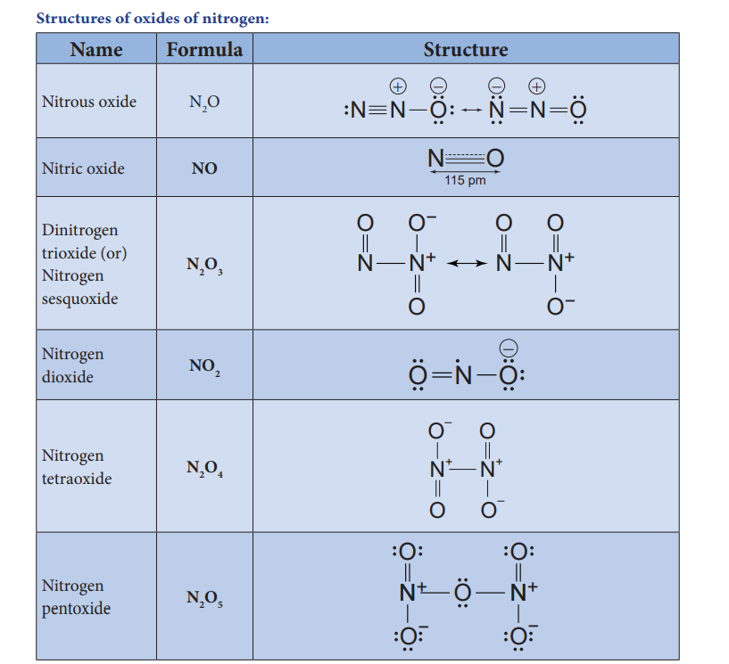

**Structures of oxoacids of nitrogen:**

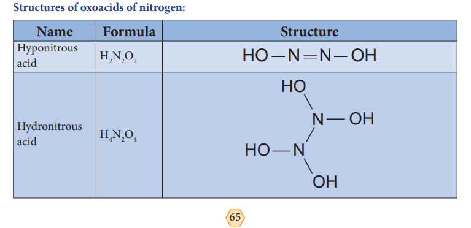

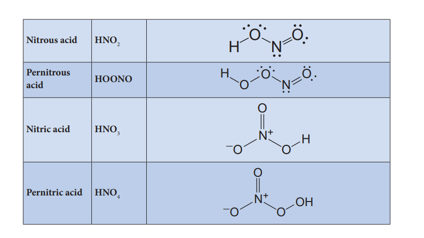

Preparation of oxoacids of nitrogen: 

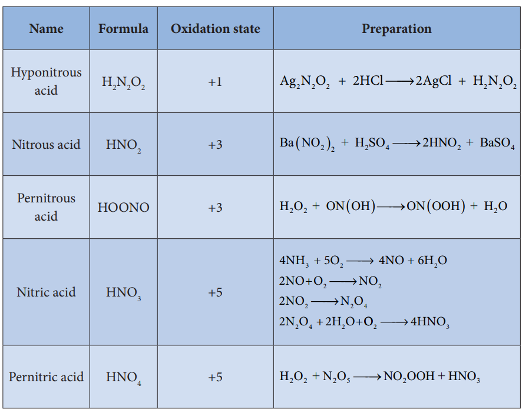

# Allotropic forms of phosphorus:
 Phosphorus has several allotropic modification

of which the three forms namely white, red and black phosphorus are most common.

The freshly prepared white phosphorus is colourless but becomes pale yellow due to formation of a layer of red phosphorus upon standing. Hence it is also known as yellow phosphorus. It is poisonous in nature and has a characteristic garlic smell. It glows in the dark due to oxidation which is called phosphorescence. Its ignition temperature is very low and hence it undergoes spontaneous combustion in air at room temperature to give P2O5.

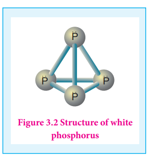

The white phosphorus can be changed into red phosphorus by heating it to 420 ⁰C in the absence of air and light. Unlike white phosphorus it is not poisonous and does not show Phosphorescence. It also does not ignite at low temperatures. The red phosphorus can be converted back into white phosphorus by boiling it in an inert atmosphere and condensing the vapour under water.

The phosphorus has a layer structure and also acts as a semiconductor. The four atoms in phosphorus have polymeric structure with chains of P4 linked tetrahedrally. Unlike nitrogen P≡P is less stable than P-P single bonds. Hence, phosphorus atoms are linked through single bonds rather than triple bonds. In addition to the above two more allotropes namely scarlet and violet phosphorus are also known for phosphorus.

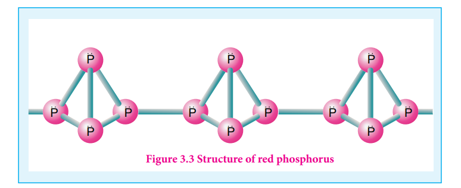
**Figure 3.3 Structure of red phosphorus**

# Properties of phosphorus

Phosphorus is highly reactive and has the following important chemical properties

**Reaction with oxygen: Yellow phosphorus readily catches fire in air giving dense white** fumes of phosphorus pentoxide. Red phosphorus also reacts with oxygen on heating to give phosphorus trioxide or phosphorus pentoxide.

P4+3O2 →  p4O6

P4+5O2 →  p4O10

  

**Reaction with chlorine:** Phosphorus reacts with chlorine to form tri and penta chloride. Yellow phosphorus reacts violently at room temperature, while red phosphorus reacts on heating

P4+6cl2 →   4PCl3

P4+10cl2 →   4PCl5

**Reaction with alkali:** Yellow phosphorus reacts with alkali on boiling in an inert atmosphere liberating phosphine. Here phosphorus act as reducing agent.

P4+ 3NaOH + 3H2O → 3NaH2PO2+ PH3

**Reaction with nitric acid:** When phosphorus is treated with conc. nitric acid it is oxidised to phosphoric acid. This reaction is catalysed by iodine crystals.

P4+ 20HNO3  → 4H3PO4 + 20NO2 + 4H2O 

**Reaction with metals:** Phosphorus reacts with metals like Ca and Mg to give phosphides.. Metals like sodium and potassium react with phosphorus vigorously.

P4+ 6Mg → 2Mg3P2

P4+ 6Ca → 2Ca3 P2

P4 + 12Na → 4Na3P 

 Uses of phosphorus:

1\. The red phosphorus is used in the match boxes

2\. It is also used for the production of certain alloys such as phosphor bronze

# Phosphine (PH3)

Phosphine is the most important hydride of phosphorus

**Preparation:**

Phosphine is prepared by action of sodium hydroxide with white phosphorus in an inert atmosphere of carbon dioxide or hydrogen.

P4+ 3NaOH + 3H2O  → 3NaH2PO2 + PH3

Phosphine is freed from phosphine dihydride(P2H4) by passing through a freezing mixture. The dihydride condenses while phosphine does not.

Phosphine can also prepared by the hydrolysis of metallic phosphides with water or dilute mineral acids.

Ca3P2 + 6H2O → 2PH3+3Ca(OH)2

AlP + 3HCl  → PH3 +AlCl3

Phosphine is prepared in pure form by heating phosphorous acid.

4H3PO3 → 3H3PO4+PH3

A pure sample of phosphine is prepared by heating phosphonium iodide with caustic soda solution.

PH4I + NaOH → PH3 + NaI + H2O 

**Physical properties:**

It is colourless, poisonous gas with rotten fish smell. It is slightly soluble in water and is neutral to litmus test. It condenses to a colourless liquid at 188 K and freezes to a solid at 139.5 K .

**Chemical properties:**

**Thermal stability: Phosphine decomposes into its elements when heated in absence of air at** 317 K or when electric current is passed through it.

4PH3  → P4+6H2

**Combustion:** When phosphine is heated with air or oxygen it burns to give meta phosphoric acid.

4PH3+8O2 → P4O10+6H2O

P4O10 + 6H2O → 4HPO3+4H2O

**Basic nature:** Phosphine is weakly basic and forms phosphonium salts with halogen acids.

PH3 + HI  → PH 4I

PH4I+H2O → PH3+H3O++ I-

It reacts with halogens to give phosphorus penta halides.

PH3+ 4Cl2 → PCl5 + 3HCl 

**Reducing property :** Phosphine precipitates some metal from their salt solutions.

3AgNO3 + PH3 → Ag3P + 3HNO3

It forms coordination compounds with lewis acids such as boron trichloride.

BCl3 + PH3 ↔  [Cl3 B PH3 ]

### Structure:

In phosphine, phosphorus shows sp3 hybridisation. Three orbitals are occupied by bond pair and fourth corner is occupied by lone pair of electrons. Hence, bond angle is reduced to 93.5°. Phosphine has a pyramidal shape.

**Figure 3.4 Structure of phosphine**
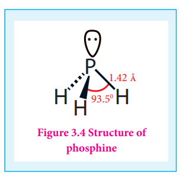

**Uses of phosphine:**

Phosphine is used for producing smoke screen as it gives large smoke. In a ship, a pierced container with a mixture of calcium carbide and calcium phosphide, liberates phosphine and acetylene when thrown into sea. The liberated phosphine catches fire and ignites acetylene. These burning gases serves as a signal to the approaching ships. This is known as Holmes signal.

# Phosphorous trichloride and pentachloride:

**Phosphorous trichloride:**

**Preparation:**

When a slow stream of chlorine is passed over white phosphorus, phosphorous trichloride is formed. It can also be obtained by treating white phosphorus with thionyl chloride.

P4 + 8SOCl2 ➔ 4PCl3 + 4SO2 + 2S2Cl2

Properties

When phosphorous trichloride is hydrolysed with cold water it gives phosphorous acid.

PCl3 + 3H2O ➔PCl H3PO3+ 3HCl 

This reaction involves the coordination of a water molecule using a vacant 3d orbital on the phosphorous atom following by elimination of HCl which is similar to hydrolysis of SiCl4.

PCl3 + H2O ➔ PCl3.H2O ➔ P(OH)Cl2 + HCl

This reaction is followed by two more steps to give P(OH)3 or H3PO3.

HPOC12 + H2O  ➔ H2PO2Cl + HCl 

H2PO2Cl + H2O  ➔H3PO3+ HCl 

Similar reactions occurs with other molecules that contains alcohols and carboxylic acids.

3C2H5OH + PCl3 ➔ 3C2H5Cl + H3PO3
 
 3C2H5COOH + PCl3 ➔ 3C2H5COCl + H3PO3

Uses of phosphorus trichloride:

Phosphorus trichloride is used as a chlorinating agent and for the preparation of H3PO3.

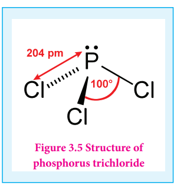

 Phosphorous pentachloride:

 Preparation

When PCl3 is treated with excess chlorine, phosphorous pentachloride is obtained.

PCl3 + Cl2 ➔ PCl5

 Chemical properties

On heating phosphorous pentachloride, it decomposes into phosphorus trichloride and chlorine.

PCl5(g) ➔  PCl3(g) + Cl2(g)

Phosphorous pentachloride reacts with water to give phosphoryl chloride and orthophosphoric acid.

PCl5+ H2O ➔ POCl3+ 2HCl

POCl3 + 3H2O  ➔  H3PO4 + 3HCl

 Overall reaction :

PCl5 + 4H2O ➔ H3PO4 + 5HCl 

Phosphorous pentachloride reacts with metal to give metal chlorides. It also chlorinates organic compounds similar to phosphorus trichloride.

2Ag + PCl5 ➔ 2AgCl + PCl3

Sn + 2PCl5 ➔ SnCl4 + 2PCl5

C5H5OH + PCl5 ➔  C2H5Cl + HCl + POCl3

C5H5COOH + PCl5  C2H5COCl + HCl + POCl3

 Uses of phosphorus pentachloride

Phosphorous pentachloride is a chlorinating agent and is useful for replacing hydroxyl groups by chlorine atom.

**Figure 3.6 Structure of P4O6**
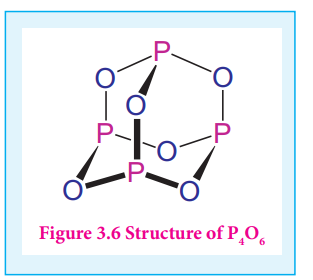

#Structure of oxides and oxoacids of phosphorus

Phosphorous forms phosphorous trioxide, phosphorous tetra oxide and phosphorous pentaoxides

In phosphorous trioxide four phosphorous atoms lie at the corners of a tetrahedron and six oxygen atoms along the edges. The P-O bond distance is 165.6

pm which is shorter than the single bond distance of P-O (184 pm) due to pπ-dπ bonding and results in considerable double bond character.

In P4O10 each P atoms form three bonds to oxygen atom and also an additional coordinate bond with an oxygen atom.

Terminal P-O bond length is 143 pm, which is less than the expected single bond distance. This may be due to lateral overlap of filled p orbitals of an oxygen atom with empty d orbital on phosphorous.

**Figure 3.7 Structure of P4O10**
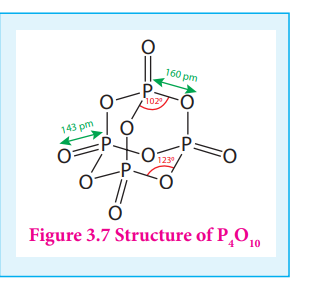

**Oxoacids of Phosphorous-Structure:**

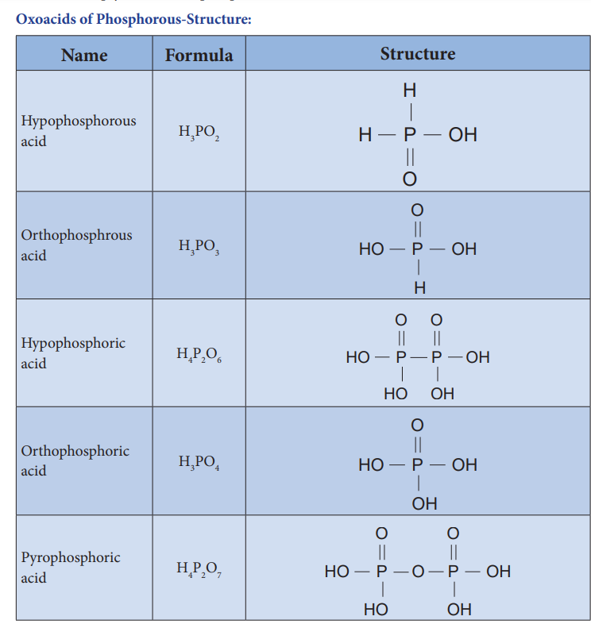

**Oxoacids of Phosphorus-Preparation:**

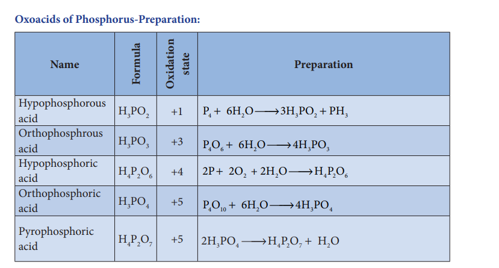

Group 16 (Oxygen group) elements:

 Occurrence:

Elements belonging group 16 are called chalgogens or ore forming elements as most of the ores are oxides or sulphides. First element oxygen, the most abundant element, exists in both as dioxygen in air (above 20 % by weight as well as volume) and in combined form as oxides. Oxygen and sulphur makes up about 46.6 % & 0.034 & of earth crust by weight respectively. Sulphur exists as sulphates (gypsum, epsom etc...) and sulphide (galena, Zinc blende etc...). It is also present in the volcanic ashes. The other elements of this groups are scarce and are often found as selenides, tellurides etc... along with sulphide ores.

 Physical properties:

The common physical properties of the group 16 elements are listed in the Table.

**Table 3.2 Physical properties of group 16 elements**

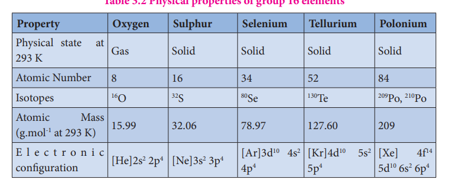

| Name                  | Formula    | Oxidation state | Preparation                                             |
|-----------------------|------------|-----------------|---------------------------------------------------------|
| Hypophosphorous acid  | H_3PO_2    | +1              | P_4 + 6H_2O \rightarrow 3H_2PHO_2                       |
| Orthophosphrous acid  | H_3PO_3    | +3              | P_4O_6 + 6H_2O \rightarrow 4H_3PO_3                     |
| Hypophosphoric acid   | H_4P_2O_6  | +4              | 2P + 6O_2 + 2H_2O \rightarrow 4H_2PO_6                  |
| Orthophosphoric acid  | H_3PO_4    | +5              | P_4O_{10} + 6H_2O \rightarrow 4H_3PO_4                   |
| Pyrophosphoric acid   | H_4P_2O_7  | +5              | 2H_3PO_4 \rightarrow H_2P_2O_7 + 2H_2O                 |

<!-- 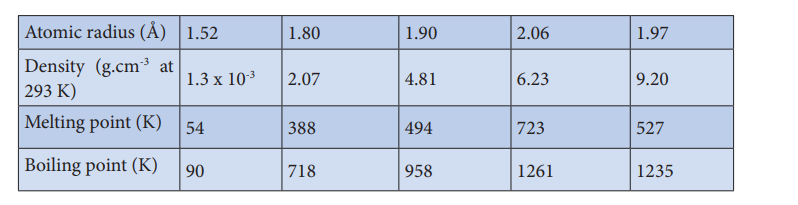 -->

<!-- **Property Oxygen Sulphur Selenium Tellurium Polonium**

Physical state at 293 K Gas Solid Solid Solid Solid

Atomic Number 8 16 34 52 84

Isotopes 16O 32S 80Se 130Te 209Po, 210Po

Atomic Mass (g.mol-1 at 293 K) 15.99 32.06 78.97 127.60 209

E l e c t r o n i c configuration \[He\]2s2 2p4 \[Ne\]3s2 3p4 \[Ar\]3d10 4s2

4p4

\[Kr\]4d10 5s2 5p4

\[Xe\] 4f14 5d10 6s2 6p4

XII U3-P-block.indd 73 2/19/2020 4:40:48 PM

www.tntextbooks.in

| Name |la urmoF |n tio eda statxiO |Preparation |
|------|------|------|------|
| Hypophosphorous acid |H PO3 2 |+1 |P  +6H O3 +→ HP OP H42 32 3 |
| Orthophosphrous acid |H PO3 3 |+3 |PO + 6HO → 4H PO46 2 33 |
| Hypophosphoric acid |H P O4 2 6 |+4 |2P + 2O  + 2H OH → PO22 42 6 |
| Orthophosphoric acid |H PO3 4 |+5 |PO + 6HO → 4H PO41 02 34 |
| Pyrophosphoric acid |H P O4 2 7 |+5 |2H PO →+HP O  HO34 42 72 |

| Property |Oxygen |Sulphur |Selenium |Tellurium |Polonium |
|------|------|------|------|------|------|
| Physical  state  at 293 K |Gas |Solid |Solid |Solid |Solid |
| Atomic Number |8 |16 |34 |52 |84 |
| Isotopes |O16 |S32 |Se80 |Te130 |Po, Po209 210 |
| Atomic M ass (g.mol  at 293 K)-1 |15.99 |32.06 |78.97 |127.60 |209 |
| E l e c t r o n i cconguration |[He]2s  2p2 4 |[Ne]3s  3p2 4 |[Ar]3d  4s4p10 24 |[Kr]4d  5s5p10 24 |[Xe]  4f5d  6s  6p1410 2 4 |
  

74

Atomic radius (Å) 1.52 1.80 1.90 2.06 1.97

Density (g.cm-3 at 293 K)

1.3 x 10-3 2.07 4.81 6.23 9.20

Melting point (K) 54 388 494 723 527

Boiling point (K) 90 718 958 1261 1235 -->
