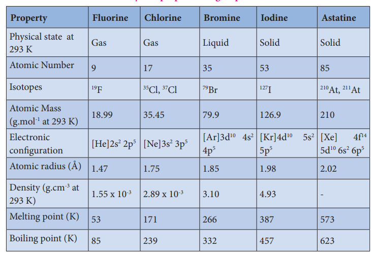
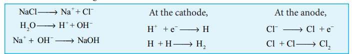
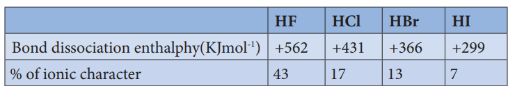
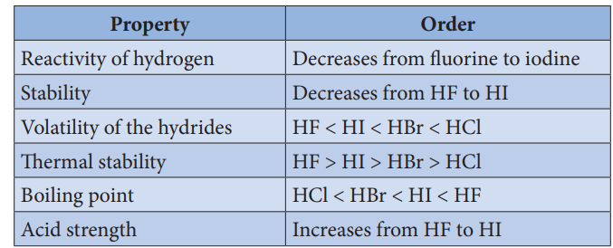
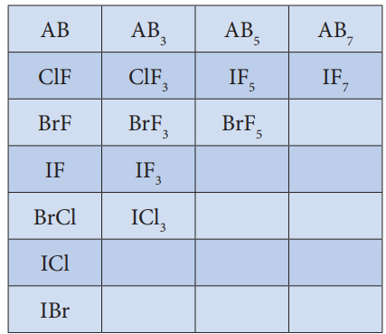
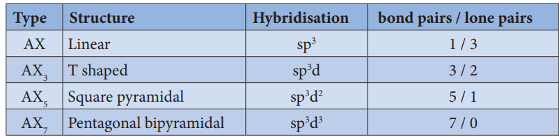
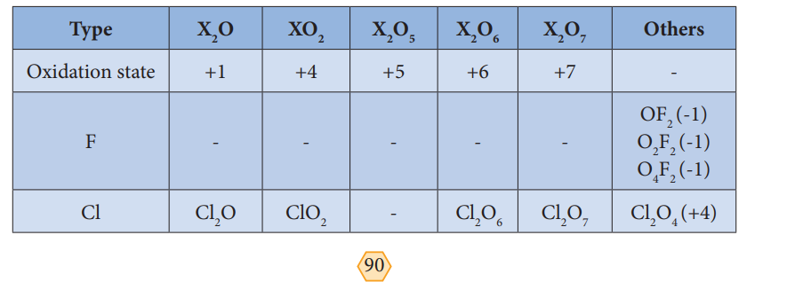
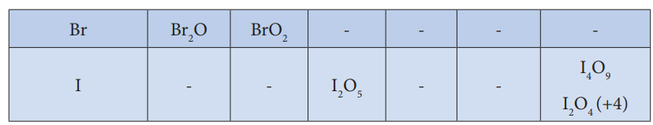

# Chlorine

**Occurrence:**

The halogens are present in combined form as they are highly reactive. The main source of fluorine is fluorspar or fluorite. The other ores of fluorine are cryolite, fluroapatite. The main source of chlorine is sodium chloride from sea water. Bromides and iodides also occur in sea water.

**Physical properties:**

The common physical properties of the group 17 elements are listed in the table.

**Table 3.3 Physical properties of group 17 elements**
| Property                   | Fluorine   | Chlorine   | Bromine    | Iodine     | Astatine   |
|----------------------------|------------|------------|------------|------------|------------|
| Physical state at 293 K    | Gas        | Gas        | Liquid     | Solid      | Solid      |
| Atomic Number              | 9          | 17         | 35         | 53         | 85         |
| Isotopes                   | ^19F       | ^35Cl, ^37Cl| ^79Br      | ^127I      | ^210At, ^211At |
| Atomic Mass (g.mol^-1 at 293 K)| 18.99 | 35.45      | 79.9       | 126.9      | 210        |
| Electronic configuration   | [He]2s²2p⁵| [Ne]3s²3p⁵| [Ar]3d¹⁰4s²4p⁵| [Kr]4d¹⁰5s²5p⁵| [Xe]4f¹⁴5d¹⁰6s²6p⁵|
| Atomic radius (Å)          | 1.47       | 1.75       | 1.85       | 1.98       | 2.02       |
| Density (g.cm^-3 at 293 K)| 1.55 x 10^-3 | 2.89 x 10^-3 | 3.10   | 4.93       | -          |
| Melting point (K)          | 53         | 171        | 266        | 387        | 573        |
| Boiling point (K)          | 85         | 239        | 332        | 457        | 623        |

<!--  -->

**Properties:**

Chlorine is highly reactive hence it doesn’t occur free in nature. It is usually distributed as various metal chlorides. The most important chloride is sodium chloride which occurs in sea water.h

**Preparation:**

Chlorine is prepared by the action of conc. sulphuric acid on chlorides in presence of manganese dioxide.

4NaCl + MnO2 + 4H2SO2 → Cl2 + MnCl2 + 4NaHSO4 + 2H2O 

It can also be prepared by oxidising hydrochloric acid using various oxidising agents such as manganese dioxide, lead dioxide, potassium permanganate or dichromate.

PbO2 + 4HCl → PbCl2 + 2H2O + Cl2

MnO2 + 4HCl →  MnCl2+2H2O+Cl2

2KMnO2 + 16HCl → 2KCl + 2MnCl2 + 8H2O + 5Cl2

K2Cr2O2 + 14HCl → 2KCl + 2CrCl3 + 7H2O + 3Cl2

When bleaching powder is treated with mineral acids chlorine is liberated

CaOCl2 + 2HCl → CaCl2 + H2O + Cl2

CaOCl2 + H2SO4 → CaSO4 + H2O + Cl2

  

## Manufacture of chlorine:

Chlorine is manufactured by the electrolysis of brine in electrolytic process or by oxidation of HCl by air in Deacon’s process.

**Electrolytic process:** When a solution of brine (NaCl) is electrolysed, Na+ and Cl- ions are formed. Na+ ion reacts with OH- ions of water and forms sodium hydroxide. Hydrogen and chlorine are liberated as gases.

NaCl \rightarrow Na^+ + Cl^-
H_2O \rightarrow H^+ + OH^-
Na + OH^- \rightarrow NaOH
2H_2O \rightarrow 2H_2 + O_2
\text{At the cathode,} \\
2H^+ + 2e^- \rightarrow H_2 \\
\text{At the anode,} \\
2Cl^- \rightarrow Cl_2 + 2e^-

<!--  -->

**Deacon’s process:** In this process a mixture of air and hydrochloric acid is passed up a chamber containing a number of shelves, pumice stones soaked in cuprous chloride are placed. Hot gases at about 723 K are passed through a jacket that surrounds the chamber.

$\ce{4HCl+O2 ->[{(400°C) }][{Cu2Cu2}] 2H2O+2Cl2}$ ↑

The chlorine obtained by this method is dilute and is employed for the manufacture of bleaching powder. The catalysed reaction is given below,

2Cu2Cl2 + O2 →  2Cu2OCl2

Cu2OCl2+2HCl  → 2CuCl2 +H2O

2CuCl2   →  Cu2Cl2 +Cl2

**Physical properties:**

Chlorine is a greenish yellow gas with a pungent irritating odour. It produces headache when inhaled even in small quantities whereas inhalation of large quantities could be fatal. It is 2.5 times heavier than air.

Chlorine is soluble in water and its solution is referred as chlorine water. It deposits greenish yellow crystals of chlorine hydrate (Cl2.8H2O). It can be converted into liquid (Boiling point – 34.6° C) and yellow crystalline solid (Melting point -102° C)

**Chemical properties:**

**Action with metals and non-metals:** It reacts with metals and non metals to give the corresponding chlorides.

2Na + Cl2  → 2NaCl 

2Fe + 3Cl2 → 2FeCl3

2Al + 3Cl2 → 2AlCl3

Cu + Cl → CuCl2

H2 + Cl2 →  2HCl ;  ∆H = -44kCal 

2B + 3Cl2 →  2BCl2\3

2S + Cl2 → S2Cl2

P4+6Cl2  → 4PCl3

2As + 3Cl2  → 2AsCl3 

2Sb + 3Cl2 → 2SbCl3 

**Affinity for hydrogen : When burnt with turpentine it forms carbon and hydrochloric acid.**

C10H16 + 8Cl2 → 10C + 16HCl 

It forms dioxygen when reacting with water in presence of sunlight. When chlorine in water is exposed to sunlight it loses its colour and smell as the chlorine is converted into hydrochloric acid.

2Cl2 + 2H2O → O2 + 4HCl

Chlorine reacts with ammonia to give ammonium chloride and other products as shown below:

With excess ammonia,

2NH3 + 3Cl2 → N2 + 6HCl

6HCl + 6 NH 3 → 6NH4Cl

overall reaction :

8NH3 + 3Cl2 → N3 + 6 NH4Cl 

With excess chlorine,

NH3 + 3Cl2   → NCl3 + 3HCl

3HCl + 3NH 3 → 3NH4Cl

3HCl + 3NH 3NH Cl

overall reaction :

4NH3 + 3Cl2 → NCl3 3NH4Cl

Chlorine oxidises hydrogen sulphide to sulphur and liberates bromine and iodine from iodides and bromides. However, it doesn't oxidise fluorides

H2S + Cl3 →  2HCl + S 

Cl2 + 2KBr →  2KCl + Br

Cl2 + 2KI →  2KCl + I2

**Reaction with alkali:** Chlorine reacts with cold dilute alkali to give chloride and hypochlorite while with hot concentrated alkali chlorides and chlorates are formed.

Cl2 + H2O  →  HCl + HOCl

HCl + NaOH  →  NaCl + H2O

HOCl + NaOH → NaOCl +NaCl+H2O

overall reaction :
Cl2 +2NaOH → NaOCl+ NaCl +H2O

(Cl2 + H2O → HCl + HOCl)* 3

(HCl + NaOH  → NaCl + H2O)*3

(HOCl + NaOH  → NaOCl + H2O)*3

3NaOCl  → NaClO3 +2NaCl

Overall reaction :

3Cl2 + 6NaOH →  NaClO3+5NaCl+3H2O

**Oxidising and bleaching action:** Chlorine is a strong oxidising and bleaching agent because of the nascent oxygen.

H2O + Cl2 → HCl + HOCl

HOCl →  HCl +(O)

Colouring matter + Nascent oxygen → Colourless oxidation product

The bleaching of chlorine is permanent. It oxidises ferrous salts to ferric, sulphites to sulphates and hydrogen sulphide to sulphur.

2FeCl2 + Cl2 →  2FeCl3

Cl2 + H2O  → HCl + HOCl

2FeSO4 + H2SO4 + HOCl → Fe2(So4)3+2HCl

Overall reaction :
2FeSO4 + H2SO4+Cl2 → Fe2(So4)3+2HCl

Cl2 + H2O → HCl + HOCl

Na2SO3 + HOCl → Na2SO4 + 2HCl 

 overall reaction:

Na2SO4 + H2O + Cl2 → Na2 SO2 + 2HCl

Cl2 + H2S → 2HCl + S

**Preparation of bleaching powder:** Bleaching powder is produced by passing chlorine gas through dry slaked lime (calcium hydroxide).

Ca(OH)2 + Cl2  →  CaOCl2 + H2O  

**Displacement redox reactions:** Chlorine displaces bromine from bromides and iodine from iodide salts.

Cl2 + 2KBr → 2KCl + Br2

Cl2 + 2KI → 2KCl + I2

**Formation of addition compounds:** Chlorine forms addition products with sulphur dioxide, carbon monoixde and ethylene. It forms substituted products with alkanes/arenes.

SO2 + Cl2 → SO2Cl2 

CO +Cl2 → COCl2

C2 H4 + Cl2  → C2 H4 Cl2 

CH4 + Cl2  → CH3Cl+HCl

C6H6+Cl2 → C6H5Cl+HCl

**Uses of chlorine:**

It is used in

1\. Purification of drinking water

2\. Bleaching of cotton textiles, paper and rayon

3\. Extraction of gold and platinum

## Hydrochloric acid:

**Laboratory preparation:**

It is prepared by the action of sodium chloride and concentrated sulphuric acid. 

NaCl + H2SO4 → NaHSO4 + HCl

NaHSO4 + NaCl → Na2SO4 + HCl

Dry hydrochloric acid is obtained by passing the gas through conc. sulphuric acid

**Properties:**

Hydrogen chloride is a colourless, pungent smelling gas, easily liquefied to a colourless liquid (boiling point 189K) and frozen into a white crystalline solid (melting point 159K). It is extremely soluble in water.

HCl (g) + H2O (l) →  H3O + + Cl- 

**Chemical properties:**

Like all acids it liberates hydrogen gas from metals and carbon dioxide from carbonate and bicarbonate salts.

Zn + 2HCl → ZnCl2 + H2

Mg + 2HCl → MgCl2 + H2

Na2CO3 + 2HCl → 2NaCl + CO2 + H2

CaCO3 + 2HCl → CaCl2 + CO2 + H2

NaHCO3 + 2HCl  → 2NaCl + CO2 + H2O

It liberates sulphur dioxide from sodium sulphite

Na2SO3 + 2HCl → 2NaCl + H2O + SO2

When three parts of concentrated hydrochloric acid and one part of concentrated nitric acid are mixed, Aquaregia (Royal water) is obtained. This is used for dissolving gold, platinum etc...

Au + 4H+ + NO3- + 4 Cl- → AuCl4-+NO+2H2o

 3Pt + 16H+  + 4NO3-  + 18Cl- →  3[PtCl6] 2- + 4NO + 8H2O

**Uses of hydrochloric acid:**

1. Hydrochloric acid is used for the manufacture of chlorine, ammonium chloride, glucose from corn starch etc.,

2. It is used in the extraction of glue from bone and also for purification of bone black

## Trends in physical and chemical properties of hydrogen halides:

**Preparation:**

Direct combination is a useful means of preparing hydrogen chloride. The reaction between hydrogen and fluorine is violent while the reaction between hydrogen and bromine or hydrogen and iodine are reversible and don’t produce pure forms.

**Displacement reactions:**

Concentrated sulphuric acid displaces hydrogen chloride from ionic chlorides. At higher temperatures the hydrogen sulphate formed react with further ionic chloride. Displacement can be used for the preparation of hydrogen fluorides from ionic fluorides. Hydrogen bromide and hydrogen iodide are oxidised by concentrated sulphuric acid and can’t be prepared in this method.

**Hydrolysis of phosphorus trihalides:**

Gaseous hydrogen halides are produced when water is added in drops to phosphorus tri halides except phosphorus trifluoride.

PX3 + 3H2O  → H3PO3 + 3HX 3

Hydrogen bromide may be obtained by adding bromine dropwise to a paste of red phosphorous and water while hydrogen iodide is conveniently produced by adding water dropwise to a mixture of red phosphorous and iodine.

2P + 3X2 → 2PX3

2PX3 + 3H3O →  H3PO3 + 3HX (where X=Br or I)

Any halogen vapours which escapes with the hydrogen halide is removed by passing the gases through a column of moist red phosphorous.

**From covalent hydrides:**

Halogens are reduced to hydrogen halides by hydrogen sulphide.

H2S + X2 →  2HX + S 

Hydrogen chloride is obtained as a by-product of the reactions between hydrocarbon of halogens.

**Table 3.4: General Properties:**
<!--  -->
 
| Compound | Bond Dissociation Enthalpy (kJ/mol) | % of Ionic Character |
|----------|-------------------------------------|----------------------|
| HF       | +562                                | 43                   |
| HCl      | +431                                | 17                   |
| HBr      | +366                                | 13                   |
| HI       | +299                                | 7                    |

In line with the decreasing bond dissociation enthalpy, the thermal stability of hydrogen halides decreases from fluoride to iodide.

For example, Hydrogen iodide decomposes at 400° C while hydrogen fluoride and hydrogen chloride are stable at this temperature.

At room temperature, hydrogen halides are gases but hydrogen fluoride can be readily liquefied. The gases are colourless but, with moist air gives white fumes due to the production of droplets of hydrohalic acid. In HF, due to the presence of strong hydrogen bond it has high melting and boiling points. This effect is absent in other hydrogen halides.

**Acidic properties:**

**The hydrogen halides are extremely soluble in water due to the ionisation.**

HX + H2O → H3O+ + X- 

(X – F, Cl, Br, or I)

Solutions of hydrogen halides are therefore acidic and known as hydrohalic acids. Hydrochloric, hydrobromic and hydroiodic acids are almost completely ionised and are therefore strong acids but HF is a weak acid i.e. 0.1mM solution is only 10% ionised, but in 5M and 15M solution HF is stronger acid due to the equilibrium.

HF + H2O ⇌  H3O+ + F-

HF + F- ⇌  HF2-

At high concentration, the equilibrium involves the removal of fluoride ions is important. Since it affects the dissociation of hydrogen fluoride and increases and hydrogen ion concentration Several stable salts NaHF2, KHF2 and NH4HF2 are known. The other hydrogen halides do not form hydrogen dihalides.

Hydrohalic acid shows typical acidic properties. They form salts with acids, bases and reacts with metals to give hydrogen. Moist hydrofluoric acid (not dry) rapidly react with silica and glass.
 
SiO2 + 4HF → SiF4 + 2H2O

Na2SiO2 + 6HF → Na2SiF2 + 3H2O

**Oxidation:** Hydrogen iodide is readily oxidised to iodine hence it is a reducing agent. 

2HI ⇌  2H++ I2 + 2e-

Acidic solution of iodides is readily oxidised. A positive result is shown by liberation of iodine which gives a blue-black colouration with starch.

Hydrogen bromide is more difficult to oxidise than HI. HBr reduces slowly H2SO4 into SO2

2HBr + H2SO4 → 2H2O+ Br2 + SO2

But hydrogen iodide and ionic iodides are rapidly reduced by H2SO4 into H2S and not into SO2.

8HI + H2SO4 →  4H2O +4I2 + H2S

Reducing property of hydrogen iodide can be also explained by using its reaction with alcohols into ethane. It converts nitric acid into nitrous acid and dinitrogen dioxide into ammonium.

Hydrogen chloride is unaffected by concentrated sulphuric acid but affected by only strong oxidising agents like MnO2, potassium permanganate or potassium chloride.

To summarize the trend,
| Property          | Order                                      |
|-------------------|---------------------------------------------|
| Reactivity        | Decreases from fluorine to iodine           |
| Stability         | Decreases from HF to HI                     |
| Volatility        | HF < HI < HBr < HCl                         |
| Thermal stability | HF > HI > HBr > HCl                         |
| Boiling point     | HCl < HBr < HI < HF                         |
| Acid strength     | Increases from HF to HI                     |

**Table 3.5**
<!--  -->

<!-- | Property |Order |
|------|------|
| Reactivity of hydrogen |Decreases from uorine to iodine |
| Stability |Decreases from HF to HI |
| Volatility of the hydrides |HF < HI < HBr < HCl |
| ermal stability |HF > HI > HBr > HCl |
| B oiling point |HCl < HBr < HI |
| Acid strength |Increases from HF to HI | -->

<!-- **Table 3.5** -->
<!-- 
**Property Order** Reactivity of hydrogen Decreases from fluorine to iodine Stability Decreases from HF to HI Volatility of the hydrides HF < HI < HBr < HCl Thermal stability HF > HI > HBr > HCl Boiling point HCl < HBr < HI Acid strength Increases from HF to HI -->

## Inter halogen compounds:

Each halogen combines with other halogens to form a series of compounds called inter halogen compounds. In the given table of inter halogen compounds a given compound A is less electronegative than B.

**Table 3.6**

| AB |AB3 |AB5 |AB7 |
|------|------|------|------|
| ClF |ClF3 |IF5 |IF7 |
| BrF |BrF3 |BrF5 |
| IF |IF3 |
| BrCl |ICl3 |
| ICl |
| IBr |

  
<!--  -->

**Properties of inter halogen compounds:**

i. The central atom will be the larger one

ii. It can be formed only between two halogen and not more than two halogens.

iii. Fluorine can’t act as a central metal atom being the smallest one

iv. Due to high electronegativity with small size fluorine helps the central atom to attain high coordination number

v. They can undergo the auto ionization.

2ICl ⇌  I+ + ICl2-

2ICl3 ⇌  ICl2+ + ICl4-

vi. They are strong oxidizing agents

**Reaction with alkali:**

When heated with the alkalis, larger halogen form oxyhalogens and the smaller forms halide.

BrF5  →  5F- + BrO3-

ICl   →  Cl- + OI-

**Structure of inter halogen compounds:**

The structures of different type of interhalogen compunds can be easily explained using VSEPR theory. The details are given below.

**Table 3.7**
| Type |Structure |Hybridisation |bond pairs / lone pairs |
|------|------|------|------|
| AX |Linear |sp3 |1 / 3 |
| AX3 |T shaped |sp d 3 |3 / 2 |
| AX5 |Square pyrimidal |sp d3 2 |5 / 1 |
| AX7 |Pentagonal bipyramidal |sp d3 3 |7 / 0 |

## Oxides of halogen

Fluorine reacts readily with oxygen and forms difluorine oxide (F2O) and difluorine dioxide (F2O2) where it has a -1 oxidation state. Other halogens do not react with oxygen readily. But the following oxides can be prepared by some indirect methods. Except fluorine all the other halogens have positive oxidation states.

**Table 3.8**

## Oxoacids of halogens:

Chlorine forms four types of oxoacids namely hypochlorus acid, chlorous acid, chloric acid and perchloric acid. Bromine and iodine forms the similar acids except halous acid. However, flurine only forms hypofulric acid. The oxidizing power oxo acids follows the order:

**HOX > HXO2 > HXO3 > HXO4**

**Table 3.9** 
| Type  | Common Name    | Oxidation state | Cl           | Br           | I            |
|-------|----------------|-----------------|--------------|--------------|--------------|
| HOX   | Hypohalous acid| +1              | -            | HOCl         | HOI          |
| HXO2  | Halous acid    | +3              | HOF          | HBrO2        | HIO2         |
| HXO3  | Halic acid     | +5              | HOClO2       | HBrO3        | HIO3         |
| HXO4  | Perhalic acid  | +7              | HOClO3       | HBrO4        | HIO4         |

<!--  -->

