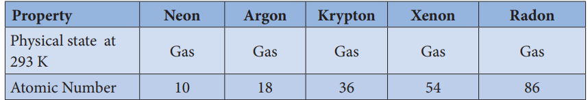
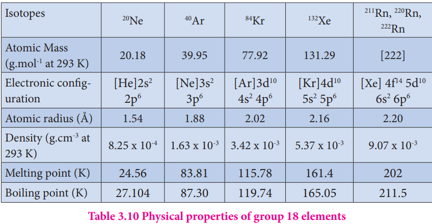
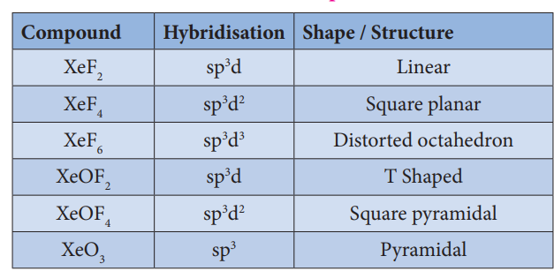

# Occurrence:

All the noble gases occur in the atmosphere.
**Physical properties:**

As we move along the noble gas elements, their atomic radius andd boiling point increases from helium to radon. The first ionization energy decreases from helium to radon. Noble gases have the largest ionisation energy compared to any other elements in a given row as they have completely filled orbital in their outer most shell. They are extremely stable and have a small tendency to gain or lose electrons. The common physical properties of the group 18 elements are listed in the Table.

**Table 3.10 Physical properties of group 18 elements**

**Properties of inert gases**: 

**Physical properties:**

Noble gases are monoatomic, odourless, colourless, tasteless, and non-inflammable. They are highly unreactive. They are non-metallic in nature. 

**Chemical Properties:**

Only the xenon and krypton show some chemical reactivity. Xenon fluorides are prepared by direct reaction of xenon and fluorine under different conditions as shown below.


Xe + F_2 \xrightarrow[{400°C}]{Ni}XeF_2



Xe + 2F_2 \xrightarrow[{400°C}]{Ni/acetone}XeF_4



Xe + 3F_2 \xrightarrow[{400°C}]{Ni/200atm}XeF_6


When XeF6 is heated at 50 °C in a sealed quartz vessel it forms XeOF4.


2XeF_6 +SiO_2 \xrightarrow[{}]{50°C}XeF_6


When the reaction is continued the following reaction takes place.

2XeOF6 + SiO2 → 2XeO2F2 + SiF4

2XeO2F2 + SiO2 → 2XeO3 +6HF

On hydrolysis with water vapour XeF6 gives XeO3

XeF6 + 3H2O → XeO3 + 6HF 

When XeF6 reacts with 2.5 M NaOH, sodium per xenate is obtained.

2XeF + 16NaOH → Na2XeO2 + Xe + O2 + 12NaF + 8H2O 

Sodium per xenate is very much known for its strong oxidizing property. For example, it oxidises manganese (II) ion into permanganate ion even in the absence of the catalyst.

5XeO6- + 2Mn2+ + 14H+ → 2MnO4- + 5XeO3 + 7H2O

Xenon reacts with PtF6 and gave an orange yellow solid \[XePtF6\] and this is insoluble in CCl4.

Xenon difluoride forms addition compounds XeF2.2SbF5 and XeF2.2TaF5. Xenon hexa fluorides forms compound with boron and alkali metals. Eg : XeF6.BF3, XeF6MF, M-alkali metals.

There is some evidence for existence of xenon dichloride XeCl2.

Krypton form krypton difluoride when an electric discharge is passed through Kr and fluorine at 183° C or when gases are irradiated with SbF5 it forms KrF2.2SbF3.

**Table 3.11 Structures of compounds of Xenon:**

| Compound  | Hybridisation | Shape / Structure     |
|-----------|---------------|-----------------------|
| XeF2      | sp3           | Linear                |
| XeF4      | sp3d2         | Square planar          |
| XeF6      | sp3d3         | Distorted octahedron  |
| XeOF2     | sp3d          | T Shaped              |
| XeOF4     | sp3d2         | Square pyramidal       |
| XeO3      | sp3           | Pyramidal             |

<!--  -->

 Uses of noble gases:

The inertness of noble gases is an important feature of their practical uses.

**Helium:**

1\. Helium and oxygen mixture is used by divers in place of air oxygen mixture. This prevents the painful dangerous condition called bends.

2\. Helium is used to provide inert atmosphere in electric arc welding of metals

3\. Helium has lowest boiling point hence used in cryogenics (low temperature science).

4\. It is much less denser than air and hence used for filling air balloons

**Neon:**

Neon is used in advertisement as neon sign and the brilliant red glow is caused by passing electric current through neon gas under low pressure.

**Argon:**

Argon prevents the oxidation of hot filament and prolongs the life in filament bulbs

**Krypton:**

Krypton is used in fluorescent bulbs, flash bulbs etc...

Lamps filed with krypton are used in airports as approaching lights as they can penetrate through dense fog.

**Xenon:**

Xenon is used in fluorescent bulbs, flash bulbs and lasers.

Xenon emits an intense light in discharge tubes instantly. Due to this it is used in high speed electronic flash bulbs used by photographers

**Radon:**

Radon is radioactive and used as a source of gamma rays

Radon gas is sealed as small capsules and implanted in the body to destroy malignant i.e. cancer growth

**Summary**

■ **Occurrence:** About 78 % of earth atmosphere contains dinitorgen (N2) gas. It is also present in earth crust as sodium nitrate (Chile saltpetre) and potassium nitrates (Indian saltpetre).

■ **Nitrogen**, the principle gas of atmosphere (78 % by volume) is separated industrially from liquid air by fractional distillation

■ Ammonia is formed by the hydrolysis of urea.

■ Nitric acid is prepared by heating equal amounts of potassium or sodium nitrate with concentrated sulphuric acid.

■ In most of the reactions, nitric acid acts as an oxidising agent. Hence the oxidation state changes from +5 to a lower one. It doesn’t yield hydrogen in its reaction with metals.

■ The reactions of metals with nitric acid are explained in 3 steps as follows:

▶ **Primary reaction:** Metal nitrate is formed with the release of nascent hydrogen

▶ **Secondary reaction:** Nascent hydrogen produces the reduction products of nitric acid.

▶ **Tertiary reaction:** The secondary products either decompose or react to give final products

■  Phosphorus has several allotropic modification of which the three forms namely white, red and black phosphorus are most common.

■  yellow phosphorus is poisonous in nature and has a characteristic garlic smell. It glows in the dark due to oxidation which is called phosphorescence.

■  Yellow phosphorus readily catches fire in air giving dense white fumes of phosphorus pentoxide.

■  Phosphine is prepared by action of sodium hydroxide with white phosphorous in an inert atmosphere of carbon dioxide or hydrogen.

■  Phosphine is used for producing smoke screen as it gives large smoke.

■  When a slow stream of chlorine is passed over white phosphorous, phosphorous trichloride is formed.

■  phosphorus trichloride: and Phosphorous pentachloride are used as a chlorinating agent

■  Oxygen is paramagnetic. It exists in two allotropic forms namely dioxygen (O2) and ozone or trioxygen (O3).

■  Ozone is commonly used for oxidation of organic compounds.

■  Sulphur exists in crystalline as well as amorphous allotrophic forms. The crystalline form includes rhombic sulphur (α sulphur) and monoclinic sulphur (β sulphur). Amorphous allotropic form includes plastic sulphur (γ sulphur), milk of sulphur and colloidal sulphur.

■  Sulphuric acid can be manufactured by lead chamber process, cascade process or contact process.

■  When dissolved in water, it forms mono (H2SO4.H2O) and dihydrates (H2SO4.2H2O) and the reaction is exothermic.

■  Halogens are present in combined form as they are highly reactive.

■  Chlorine is manufactured by the electrolysis of brine in electrolytic process or by oxidation of HCl by air in Deacon’s process.

■  Chlorine is a strong oxidising and bleaching agent because of the nascent oxygen.

■  When three parts of concentrated hydrochloric acid and one part of concentrated nitric acid are mixed, Aquaregia (Royal water) is obtained. This is used for dissolving gold, platinum etc...

■  Hydrogen halides are extremely soluble in water due to the ionisation.

■  Each halogen combines with other halogens to form a series of compounds called inter halogen compounds.

■  Fluorine reacts readily with oxygen and forms difluorine oxide (F2O) and difluorine dioxide (F2O2) where it has a -1 oxidation state.

■  All the noble gases occur in the atmosphere.

■  They are extremely stable and have a small tendency to gain or lose electrons.

■  Sodium per xenate is very much known for its strong oxidizing property.

■  The inertness of noble gases is an important feature of their practical uses.

**EVALUATION**

**Choose the best answer:**

1. In which of the following , NH3 is not used?

    a) Nessler’s reagent

    b) Reagent for the analysis of IV group basic radical

    c) Reagent for the analysis of III group basic radical

    d) Tollen’s reagent

2. Which is true regarding nitrogen?

    a) least electronegative element

    b) has low ionisation enthalpy than oxygen

    c) d- orbitals available

    d) ability to form  pπ-pπ  bonds with itself

3. An element belongs to group 15 and 3 rd period of the periodic table, its electronic configuration would be

    a) 1s2 2s2 2p4
    
     b) 1s2 2s2 2p3

    c) 1s2 2s2 2p6 3s2 3p2
    
     d) 1s2 2s2 2p6 3s2 3p3

4. Solid (A) reacts with strong aqueous NaOH liberating a foul smelling gas(B) which spontaneously burn in air giving smoky rings. A and B are respectively

    a) P4(red) and PH3
    
     b) P4(white) and PH3

    c) S8 and H2S 
   
    d) P4(white) and H2S

5. On hydrolysis, PCl3 gives

    a) H3PO3 
    
    b) PH3

    c) H3PO4 
    
    d) POCl3

6. P4O6 reacts with cold water to give

    a) H3PO3 
    
    b) H3P3O3

    c) HPO3
    
     d) H3PO3

7. The basicity of pyrophosphorous acid ( H4P2O5) is

    a) 4 b) 2

    c) 3 d) 5

8. The molarity of given orthophosphoric acid solution is 2M. its normality is

    a) 6N b) 4N

    c) 2N d) none of these

9. Assertion : bond dissociation energy of fluorine is greater than chlorine gas

Reason: chlorine has more electronic repulsion than fluorine

    a) Both assertion and reason are true and reason is the correct explanation of assertion.

    b) Both assertion and reason are true but reason is not the correct explanation of assertion.

    c) Assertion is true but reason is false.

    d) Both assertion and reason are false.

10. Among the following, which is the strongest oxidizing agent?

    a) Cl2 b) F2

    c) Br2 d) l2

11. The correct order of the thermal stability of hydrogen halide is

    a) HI > HBr > HCl > HF b) HF > HCl > HBr > HI

    c) HCl > HF > HBr > HI d) HI > HCl > HF > HBr

12. Which one of the following compounds is not formed?

    a) XeOF4   b) XeO3

    c) XeF2 d) NeF2

13. Most easily liquefiable gas is

    a) Ar b) Ne

    c) He d) Kr

14. XeF6 on complete hydrolysis produces

    a) XeOF4 b) XeO2F2

    c) XeO3 d) XeO2

15. Which of the following is strongest acid among all?

    a) HI b) HF

    c) HBr d) HCl

16. Which one of the following orders is correct for the bond dissociation enthalpy of halogen molecules? (NEET)

    a) Br2 > I2 > F2 > Cl2 
    
    b) F2 > Cl2 > Br2 > l2

    c) I2 > Br2 > Cl2 > F2 
    
    d) Cl2 > Br2 > F2 > I2

17. Among the following the correct order of acidity is (NEET)

    a) HClO2 < HClO < HClO2 < HClO4
    
     b) HClO4 < HClO2 < HClO < HClO3

    c) HClO3 < HClO4 < HClO2 < HClO 
    
    d) HClO < HClO2 < HClO3 < HClO4

18. When copper is heated with conc HNO3 it produces

    a) Cu(NO3)2 , NO and NO2 
    
    b) Cu(NO3)2 and N2O

    
    c) Cu(NO3)2 and NO2
    
     d) Cu(NO3)2 and NO

**Answer the following questions:**

1. What is inert pair effect?

2. Chalcogens belongs to p-block. Give reason.

3. Explain why fluorine always exhibit an oxidation state of -1?

4. Give the oxidation state of halogen in the following.

    a) OF2 
    
    b) O2F2
    
     c) Cl2O2
     
      d) I2O4

5\. What are interhalogen compounds? Give examples.

6\. Why fluorine is more reactive than other halogens?

7\. Give the uses of helium.

8\. What is the hybridisation of iodine in IF7? Give its structure.

9\. Give the balanced equation for the reaction between chlorine with cold NaOH and hot NaOH.

10\. How will you prepare chlorine in the laboratory?

11\. Give the uses of sulphuric acid.

12\. Give a reason to support that sulphuric acid is a dehydrating agent.

13\. Write the reason for the anamolous behaviour of Nitrogen.

14\. Write the molecular formula and structural formula for the following molecules.

a) Nitric acid b) dinitrogen pentoxide

c) phosphoric acid d) phosphine

15. Give the uses of argon.

16. Write the valence shell electronic configuration of group-15 elements.

17. Give two equations to illustrate the chemical behaviour of phosphine.

18. Give a reaction between nitric acid and a basic oxide.

19. What happens when PCl5 is heated?

20. Suggest a reason why HF is a weak acid, whereas binary acids of the all other halogens are strong acids.

21. Deduce the oxidation number of oxygen in hypofluorous acid – HOF.

22. What type of hybridisation occur in

a) BrF5 b) BrF2

23. Complete the following reactions.

    1. NaCl + MnO2 + H2SO4 →

    2. NaNO2 + HCl →

    3. P4 + NaOH + H2O →

    4. AgNO3 + PH3  →

    5. Mg + HNO3→

    6. KClO3 ∆ →

    7. Cu + H2SO4 →

    8. Sb + Cl2 →

    9. HBr + H2SO4 →

   10.XeF6 + H2O →

    11. XeO64- + Mn2+ + H+ → 
    
    12. XeOF4  + SiO2  →

   13. 
         Xe+ F_2 \xrightarrow[{400°C}]{Ni/ 200 atm }
          

