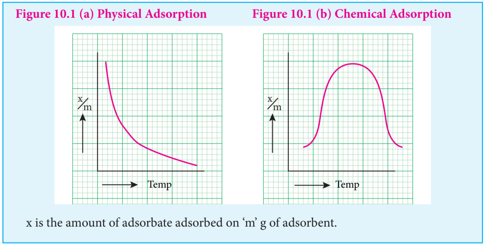
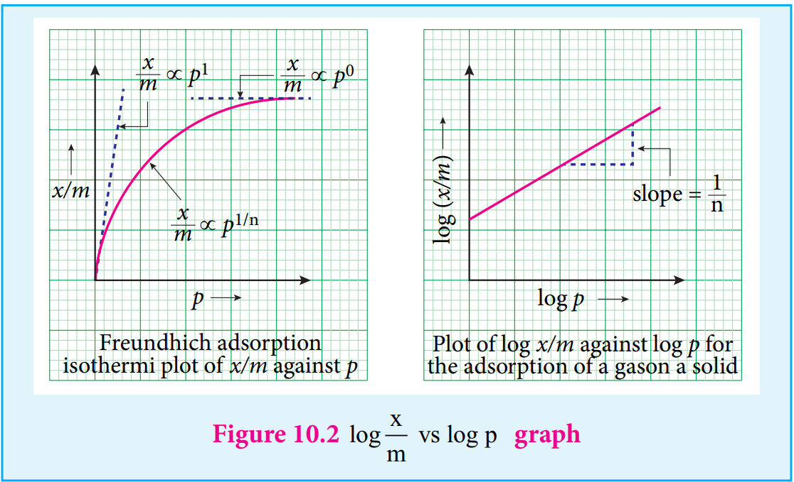

Solid surfaces have the ability to attract the contacting species due to free valency or residual force on them.

**For example:** charcoal adsorbs ammonia, silica gel adsorbs water., charcoal adsorbs colorants from sugar.

These examples prove that adsorption is a surface phenomenon. In contrast to adsorption, absorption is a bulk phenomenon i.e. the adsorbate molecules are distributed throughout the adsorbent.

- Adsorbent is the material on which adsorption takes place.

- Adsorbed substance is called an adsorbate.

* The surface of separation of the two phases where the concentration of adsorbed molecule is high is known as interface.

* In adsorption, if the concentration of a substance in the interface is high, then it is called positive adsorption. If it is less, then it is called negative adsorption.

* The process of removing an adsorbed substance from the surface is called desorption.

* The gaseous molecules like He, Ne, O2, N2, SO2 and NH3 and solutions of NaCl or KCl can be adsorbed by suitable adsorbents. These are referred as adsorbates.

* Silica gel and metals like Ni, Cu, Pt, Ag and Pd and certain colloids can act as adsorbents.

**Characteristics of adsorption**

1\. Adsorption can occur in all interfacial surfaces i.e. the adsorption can occur in between gas-solid, liquid solid, liquid-liquid, solid- solid and gas-liquid.

2\. Adsorption is a spontaneous process and it is always accompanied by decrease in free energy. When ΔG reaches zero, the equilibrium is attained.

We know, ΔG = ΔH - T ΔS where ΔG is Change in Free energy.

ΔH is Change in enthalpy and ΔS = Change in entropy.

3\. When molecules are adsorbed, there is always a decrease in randomness of the molecules.

ie., ∆S<0, and T∆S is negative. Hence, adsorption is exothermic.

Adsorption is a quick process whereas absorption is a slow process.

M.C. Bain introduced a term ‘sorption’ to represent the simultaneous adsorption and absorption. T. Graham used a term occlusion for sorption of gases on metal surfaces.

### Types of adsorption

Adsorption is classified as physical adsorption and chemical adsorption, depending on the nature of forces acting between adsorbent and adsorbate. In chemical adsorption, gas molecules are held to the surface by formation of chemical bonds. Since strong bond is formed, nearly 400 KJ / mole is given out as heat of adsorption.

**Examples** • Adsorption of O2 on tungsten, Adsorption of H2 on nickel, Adsorption of ethyl alcohol vapours on nickel.

In physical adsorption, physical forces such as van der waals force of attraction, dipole - dipole interaction, dispersion forces etc., exist between adsorbent and adsorbate. As these forces are weak, heat of adsorption is low, hence physical adsorption occurs at low temperatures.

**Examples**

(a) Adsorption of N2 on mica.

(b) Adsorption of gases on charcoal.

The following table 10.1 illustrates the distinction between chemical and physical adsorption.

**Table 10.1 Distinction between chemical and physical adsorption**

| Chemical ads orption or C hemisorption or Activated adsorption                                   | Physical adsorption or van der waals adsorption or Physisorption                 |
| ------------------------------------------------------------------------------------------------ | -------------------------------------------------------------------------------- |
| 1. It is ver y slow                                                                              | 1. It is instantaneous                                                           |
| 2. It is ver y specic depends o n nature of adsorbent and adsorbate.                            | 2. It is non-specic                                                             |
| 3. Chemical adsorption is fast with increase pressure, it can not alter the amount.              | 3. In Physisorption, when pressure increases the extent of adsorption increases. |
| 4. When temperature is raised chemisorption first increases and then decreases.                  | 4. Physisorption decreases with increase in temperature.                         |
| 5. Chemisorption involves transfer of electrons between the adsorbent and adsorbate.             | 5. No transfer of electrons                                                      |
| 6. Heat of adsorption is high i.e., from 40- 400kJ/mole.                                         | 6. Heat of adsorption is low in the order of 40kJ/mole.                          |
| 7. Monolayer of the adsorbate is formed.                                                         | 7. Multilayer of the adsorbate is formed on the adsorbent.                       |
| 8. Adsorption occurs at fixed sites called active centres. It depends on surface area            | 8. It occurs on all sides.                                                       |
| 9. Chemisorption involves the formation of activated complex with appreciable activation energy. | 9. Activation energy is insignificant.                                           |

### Factors affecting adsorption

The adsorption is well understood by considering the various factors affecting it. Qualitatively, the extent of surface adsorption depends on the following factors

(i) Nature of adsorbent

(ii) Nature of adsorbate

(iii) Pressure

(iv) Concentration at a given temperature.

1\. **Surface area of adsorbent:**

As the adsorption is a surface phenomenon it depends on the surface area of adsorbent. i.e., higher the surface area, higher is the amount adsorbed.

2\. **Nature of adsorbate**

The nature of adsorbate can influence the adsorption. Gases like SO2 ,NH3 ,HCl and CO2 are easily liquefiable as they have greater van der waal’s force of attraction. On the other hand, permanent gases like H2 ,N2 and O2 can not be liquefied easily. These permanent gases are having low critical temperature and adsorbed slowly, while gases with high critical temperature are adsorbed readily.

3\. **Effect of temperature**

When temperature is raised chemisorption first increases and then decreases. whereas physisorption decreases with increase in temperature.

4\. **Effect of pressure:**

chemical adsorption is fast with increase in pressure, it can not alter the amount of adsorption. In Physisorption the extent of adsorption increases with increase in pressure.

### Adsorption isotherms and isobars.

Adsorption isotherms represents the variation of adsorption at constant temperature.

When amount of adsorption is plotted versus temperature at constant pressure it is called adsorption isobar.

Adsorption isobars of physisorption and chemisorption are different as represented in the graphs.

x is the amount of adsorbate adsorbed on ‘m’ g of adsorbent.

In physical adsorption, x&frasl;m decreases with increase in Temprature, But in chemical adsorption, x&frasl;m increases with rise in temperature and then decreases. The increase illustrates the requirement of activation of the surface for adsorption is due to fact that formation of activated complex requires certain energy.

The decrease at high temperature is due to desorption, as the kinetic energy of the adsorbate increases.

**10.1.3.1 Adsorption isotherms**

Adsorption isotherm can be studied quantitatively. A plot between the amount of adsorbate adsorbed and pressure (or concentration of adsorbate) at constant temperature is called adsorption isotherms.

In order to explain these isotherms various equations were suggested as follows:

(i) Freundlich adsorption isotherm. According to Freundlich,

<!-- //////////////////////////////// -->

where x is the amount of adsorbate, adsorbed on ‘m’ gm of adsorbent at a pressure of p. K and n are constant introduced by freundlich.

Value n is always less than unity.

This equation is applicable for adsorption of gases on solid surfaces. The same equation becomes

 <!-- x m

\=K c 1 n ,  -->

when used for adsorption in solutions with c as concentration.

This equation quantitively predicts the effect of pressure(or concentration) on the adsorption of gases(or adsorbates) at constant temperature.

Taking log on both sides of equation

 <!-- x m -->

Hence the intercept represents the value of log k and the slope gives 1/n.

This equation explains the increase of x/m with increase in pressure. But experimental values show the deviation at low pressure.

**Limitations**

This equation is purely empirical and valid over a limited pressure range.

The values of constants k and n also found vary with temperature. No theoretical explanations were given.

### Applications of adsorption

Though we have innumerable applications for adsorption, we consider few of them

1\. Gas masks: During world war I charcoal gas mask was employed by both the British and American. Activated charcoal was found to be one of the best adsorbents.

2\. To create high vacuum in vessels, Tail and Dewar used activated charcoal.For dehydration and also purification of gases like CO2, N2, Cl2, O2 and He, alumina and silica are employed. In the blast furnace silica gel is also used for drying air.

3\. One of the highly important use of adsorption is the softening of hardwater. Permutit is employed for this process which adsorbs Ca2+ and Mg2+ ions in its surface, there is an ion exchange as shown below it occurs on the surface.

<!-- CaAl Si O +2NaCl Na Al Si O +CaCl2 4 12 2 2 4 12 2→ -->

Exhausted permutit is regenerated by adding a solution of common salt.

<!-- CaAl Si O +2NaCl Na Al Si O +CaCl2 4 12 2 2 4 12 2→ -->

4\. **Ion exchange resins**

Ion exchange resins are working only based on the process of adsorption. Ion exchange resins are used to demineralise water. This process is carried out by passing water through two columns of cation and anion exchange resins.

<!-- RSO H+Ca (Mg ) RSO ) Ca(Mg)+2H3 2+ 2+ +→ ( 3 2

resin minerals in water

resin with mineral

2

N +OH - +Cl -(SO4 2-) (SO4

2-) R1 R2 R3 R4

N +Cl - + OH - R1 R2 R3 R4resin minerals

in water resin with mineral -->

5\. **Petroleum refining and refining of vegetable oil**

Fuller’s earth and silica gel are used for refining process.

6\. **Decolourisation of Sugar:**

Sugar prepared from molasses is decolourised to remove coloured impurities by adding animal charcoal which acts as decolourising material.

7\. **Chromatography**

The chromatographic technique is applied for separation of components in a mixture. It is mainly based on adsorption of components on the surface of adsorbents. This method is very effective and used for identification, detection and estimation of many substances even if they are contained in micro quantities.

8\. **Catalysed reaction**

Catalysis is an important branch of surface chemistry which is based on the phenomenon of adsorption of materials on the catalyst surface.

**Examples:**

In the Haber’s process, ammonia is manufactured from N2 and H2 as shown by the following reactions.

<!-- N +3H 2NH2 2 3→ -->

In this process, Fe is the catalyst and Mo is a promoter. The surface of the Fe catalyses the reaction.

In the hydrogenation of oils to obtain vanaspathi, Nickel is used as a catalyst. Nickel surface catalyses the reaction.

<!-- vegetable oil+H vanaspathi 2

Ni catalyst 473K → -->

9\. **Qualitative analysis**

When blue litmus solution is added to Al3+ ion, a red coloration is seen due to the acidic nature of the solution. Addition of ammonium hydroxide to it gives a blue lake. This is due to the adsorption of blue colour litmus compound on the surface of Al (OH)3 Which is formed during the addition of NH4OH

10\. **Medicine:**

Drugs cure diseases by adsorption on body tissues.

11\. **Concentration of Ores of metals**

Sulphides ores are concentrated by a process called froth flotation in which light are particles are wetted by pine oil.

12\. **Mordants and Dyes**

Most of the dyes are adsorbed on the surface of the fabrics. Mordants are the substances

used for fixing dyes onto the fabric.

13\. **Adsorption indicators**

In the precipitation titrations, the end point is indicated by an external indicator which changes its colour after getting adsorbed on precipitate. It is used to indicate the end point of the titration.
