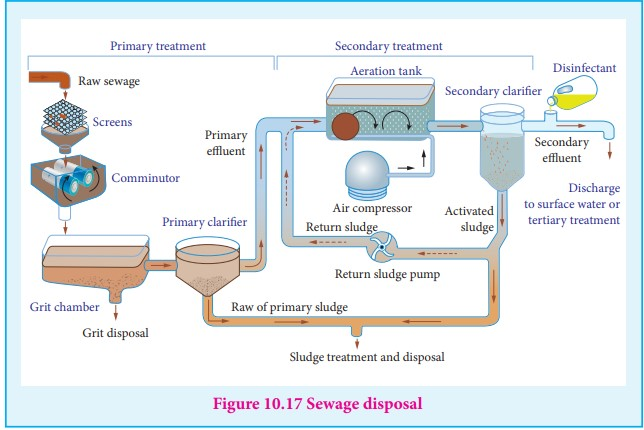

In every path of life, colloids play a great role. Human body contains the numerous
colloidal solutions. The blood in our body, protoplasma of plant and animal cell, and fats in our intestines are in the form of emulsions. Synthetic polymers like polystyrene silicones and PVC are colloids.

**Food**

Food stuffs like milk cream, butter, etc are present in colloidal form.

**Medicines**

Antibodies such as penicillin and streptomycin are produced in colloidal form for suitable injections. Colloidal gold and colloidal calcium are used as tonics. Milk of magnesia is used for stomach troubles. Silver sol protected by gelatine known as Argyrol is used as eye lotion.

**In Industry**

Colloids find many applications in industries.

**(i) Water purification:**

Purification of drinking water is activated by coagulation of suspended impurities in water using alums containing Al3+

**(ii) In washing:**

The cleansing action of soap is due to the formation of emulsion of soap molecules with dirt and grease.

**(iii) Tanning of leather**

Skin and hides are protein containing positively charged particles which are coagulated by adding tannin to give hardened leather for further application. Chromium salts are used for the purpose. Chrome tanning can produce soft and polishable leather.

**(iv) Rubber industry:**

Latex is the emulsion of natural rubber with negative particles. By heating rubber with sulphur, vulcanized rubbers are produced for tyres, tubes, etc.

**(v) Sewage disposal**

Sewage contains dirt, mud and wastes dispersed in water. The passage of electric current deposits the wastes materials which can be used as a manure.



**(vi) Cortrell’s precipitator**

Carbon dust in air is solidified by cortrell’s precipitator. In it, a high potential difference of about 50,000V is used. The charge on carbon is neutralized and solidified. Thus the air is free from carbon particles.

**(vii) The blue colour of the sky in nature is due to Tyndall effect of air particles.**

**(viii) Formation of delta:**

The electrolyte in sea and river water coagulates the solid particles in river water at their intersection. So, the earth becomes a fertile land.

**(ix) Analytical application**

Qualitative and quantitative analysis are based on the various properties of colloids.

Hence we can conclude that in our life, there is hardly any field which is not including the applications of colloids.

```
Natural honey is a colloidal sol. It is distinguished from artificial one by adding ammoniacal AgNO
In case of natural honey a metallic silver is produced, assumes a reddish yellow color due to traces of albumin or ethereal oil which acts as a protective colloid. In case of artificial honey a dark yellow or greenish yellow precipitate is formed.
```

**EVALUATION**

**Choose the correct answer:**

1. For Freundlich isotherm a graph of log <sup>x</sup>/<sub>m</sub> is plotted against log p. The slope of the line and

its y – axis intercept respectively corresponds to

a) <sup>1</sup>/<sub>n</sub>, k b) log <sup>1</sup>/<sub>n</sub>, k c) <sup>1</sup>/<sub>n</sub>, log k d) log <sup>1</sup>/<sub>n</sub>, log k

2. Which of the following is incorrect for physisorption?

a) reversible b) increases with increase in temperature

c) low heat of adsorption d) increases with increase in surface area

3. Which one of the following characteristics are associated with adsorption? (NEET)

a) ∆G and ∆H are negative but ∆S is positive

b) ∆G and ∆S are negative but ∆H is positive

c) ∆G is negative but ∆H and ∆S are positive

d)∆G, ∆H and ∆S all are negative.

4. Fog is colloidal solution of

a) solid in gas b) gas in gas c) liquid in gas d) gas in liquid

5. Assertion : Coagulation power of Al<sup>3+</sup> is more than Na<sup>+</sup>.

Reason : greater the valency of the flocculating ion added, greater is its power to cause precipitation

a) if both assertion and reason are true and reason is the correct explanation of assertion.

b) if both assertion and reason are true but reason is not the correct explanation of assertion.

c) assertion is true but reason is false d) both assertion and reason are false.

6. Statement :

To stop bleeding from an injury, ferric chloride can be applied. Which comment about the statement is justified?

a) It is not true, ferric chloride is a poison.

b) It is true, Fe<sup>3+</sup> ions coagulate blood which is a negatively charged sol

c) It is not true; ferric chloride is ionic and gets into the blood stream.

d) It is true, coagulation takes place because of formation of negatively charged sol with Cl<sup>-</sup>.

7. Hair cream is

a) gel b) emulsion c) solid sol d) sol.

8. Which one of the following is correctly matched?

| a) Emulsion      | -   | Smoke  |
| ---------------- | --- | ------ |
| b) Gel           | -   | butter |
| c) foam          | -   | Mist   |
| d) whipped cream | -   | sol    |

9. The most effective electrolyte for the coagulation of As<sub>2</sub>S<sub>3</sub>Sol is

a) NaCl b) Ba(NO<sub>3</sub>)<sub>2</sub> c) K<sub>3</sub>[Fe(CN)<sub>6</sub>] d) Al<sub>2</sub>(SO<sub>4</sub>)<sub>3</sub>

10. Which one of the is not a surfactant?

a) CH<sub>3</sub>--(CH<sub>2</sub>)<sub>15</sub>--N+--(CH<sub>3</sub>)<sub>2</sub> CH<sub>2</sub>Br

b) CH<sub>3</sub>--(CH<sub>2</sub>)<sub>15</sub>--NH<sub>2</sub>

c) CH<sub>3</sub>--( CH<sub>2</sub> )<sub>16</sub>--CH<sub>2</sub> OSO<sub>2</sub><sup>-</sup> Na+

d) OHC--(CH<sub>2</sub>)<sub>14</sub> --CH<sub>2</sub>--COO<sup>-</sup> Na<sup>+</sup>

11. The phenomenon observed when a beam of light is passed through a colloidal solution is

a) Cataphoresis b) Electrophoresis c) Coagulation d) Tyndall effect

12. In an electrical field, the particles of a colloidal system move towards cathode. The coagulation of the same sol is studied using K<sub>2</sub>SO<sub>4</sub>(i), Na<sub>3</sub>PO<sub>4</sub>(ii),K<sub>4</sub>[Fe(CN)<sub>6</sub>] (iii) and NaCl (iv) Their coagulating power should be

a) II > I>IV > III b) III > II > I > IV c) I >II > III > IV d) none of these

13. Collodion is a 4% solution of which one of the following compounds in alcohol – ether mixture?

a) Nitroglycerine b) Cellulose acetate c) Glycoldinitrate d) Nitrocellulose

14. Which one of the following is an example for homogeneous catalysis?

a) manufacture of ammonia by Haber’s process b) manufacture of sulphuric acid by contact process c) hydrogenation of oil d) Hydrolysis of sucrose in presence of dil HCl

15. Match the following

| A) V O2 5            | i) High density polyethylene |
| -------------------- | ---------------------------- |
| B) Ziegler – Natta   | ii) PAN                      |
| C) Peroxide          | iii) NH3                     |
| D) Finely divided Fe | iv) HS O24                   |

a) (iv) (i) (ii) (iii) b) (i) (ii) (iv) (iii) c) (ii) (iii) (iv) (i) d) (iii) (iv) (ii) (i)

16. The coagulation values in millimoles per litre of the electrolytes used for the coagulation of As<sub>2</sub>S<sub>3</sub> are given below

(I) (NaCl)=52 (II) ((BaCl<sub>2</sub> )=0.69 (III) (MgSO<sub>4</sub> )=0.22

The correct order of their coagulating power is

a) III > II > I b) I > II > III c) I > III > II d) II > III>I

17. Adsorption of a gas on solid metal surface is spontaneous and exothermic, then

a) ∆H increases b) ∆S increases c) ∆G increases d) ∆S decreases

18. If x is the amount of adsorbate and m is the amount of adsorbent, which of the following relations is not related to adsorption process?

a) <sup>x</sup>/<sub>m</sub>=f(P) at constant T b) <sup>x</sup>/<sub>m</sub>=f(T) at constant P
c) P = f(T) at constant <sup>x</sup>/<sub>m</sub> d) <sup>x</sup>/<sub>m</sub> PT=

19. On which of the following properties does the coagulating power of an ion depend ? (NEET – 2018)

a) Both magnitude and sign of the charge on the ion. b) Size of the ion alone c) the magnitude of the charge on the ion alone d) the sign of charge on the ion alone.

20. Match the following

| A) Pure nitrogen   | i) Chlorine                         |
| ------------------ | ----------------------------------- |
| B) Haber process   | ii) Sulphuric acid                  |
| C) Contact process | iii) Ammonia                        |
| D) Deacons Process | iv) s odium azide (or) Barium azide |

a) (i) (ii) (iii) (iv) b) (ii) (iv) (i) (iii) c) (iii) (iv) (ii) (i) d) (iv) (iii) (ii) (i)

**Short Answer**

1. Give two important characteristics of physiscorption

2. Differentiate physisorption and chemisorption

3. In case of chemisorption, why adsorption first increases and then decreases with temperature?

4. Which will be adsorbed more readily on the surface of charcoal and why? NH or O3 2 ?

5. Heat of adsorption is greater for chemisorptions than physisorption. Why?

6. Peptising agent is added to convert precipitate into colloidal solution. Explain with an example.

7. What happens when a colloidal sol of Fe(OH)3 and As2S3 are mixed?

8. What is the difference between a sol and a gel?

9. Why are lyophillic colloidal sols are more stable than lyophobic colloidal sol.

10. Addition of Alum purifies water. Why?

11. What are the factors which influence the adsorption of a gas on a solid?

12. What are enzymes? Write a brief note on the mechanism of enzyme catalysis.

13. What do you mean by activity and selectivity of catalyst?

14. Describe some feature of catalysis by Zeolites.

15. Give three uses of emulsions.

16. Why does bleeding stop by rubbing moist alum

17. Why is desorption important for a substance to act as good catalyst?

18. Comment on the statement: Colloid is not a substance but it is a state of substance.

19. Explain any one method for coagulation

20. Write a note on electro osmosis

21. Write a note on catalytic poison

22. Explain intermediate compound formation theory of catalysis with an example

23. What is the difference between homogenous and hetrogenous catalysis?

24. Describe adsorption theory of catalysis.
