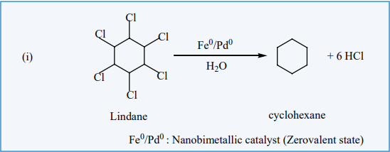

The details of heterogeneous catalysis will be incomplete, if zeolites are not discussed.
Zeolites are microporous, crystalline, hydrated, alumino silicates, made of silicon and aluminium tetrahedron. There are about 50 natural zeolites and 150 synthetic zeolites. As
silicon is tetravalent and aluminium is trivalent, the zeolite matrix carries extra negative charge. To balance the negative charge, there are extra framework cations for example, H+ or Na+ ions. Zeolites carrying protons are used as solid acid catalysts and they are extensively used in the petrochemical industry for cracking heavy hydrocarbon fractions into gasoline, diesel,etc., Zeolites carrying Na+ ions are used as basic catalysts.

One of the most important applications of zeolites is their shape selectivity. In zeolites, the active sites namely protons are lying inside their pores. So, reactions occur only inside the pores of zeolites.

**Reactant selectivity:**

When bulkier molecules in a reactant mixture are prevented from reaching the active sites within the zeolite crystal, this selectivity is called reactant shape selectivity.

**Transition state selectivity:**

If the transition state of a reaction is large compared to the pore size of the zeolite, then
no product will be formed.

**Product selectivity:**

It is encountered when certain product molecules are too big to diffuse out of the zeolite pores.

**Phase Transfer catalysis:**

Suppose the reactant of a reaction is present in one solvent and the other reactant is present in an another solvent. The reaction between them is very slow, if the solvents are immiscible. As the solvents form separate phases, the reactants have to migrate across the boundary to react. But migration of reactants across the boundary is not easy. For such situations a third solvent is added which is miscible with both. So, the phase boundary is eliminated, reactants freely mix and react fast. But for large scale production of any product, use of a third solvent is not convenient as it may be expensive. For such problems phase transfer catalysis provides a simple solution, which avoids the use of solvents. It directs the use a phase transfer catalyst (a phase transfer reagent) to facilitate transport of a reactant in one solvent to the other solvent where the second reactant is present. As the reactants are now brought together, they rapidly react and form the product.

**Example:**

Substitution of Cl- and CN- in the following reaction.

R-Cl + NaCN &rarr; R-CN + NaCl

organic phase aqueous phase organic phase aqueous phase

R-Cl=1-chlorooctane

R-CN=1-cyanooctane

By direct heating of two phase mixture of organic 1-chlorooctane with aqueous sodium cyanide for several days, 1-cyanooctane is not obtained. However, if a small amount of quaternary ammonium salt like tetraalkylammoniumchloride is added, a rapid transition of 1-cyanooctane occurs in about 100% yield after 1 or 2 hours. In this reaction, the tetraalkylammonium cation, which has hydrophobic and hydrophilic ends, transports CN- from the aqueous phase to the organic phase using its hydrophilic end and facilitates the reaction with 1-chloroocatne as shown below:

NaCN + R4N+Cl-Na &rarr; R4N+CN- + NaCl

aqueous phase It moves to organic phas e

R4N+CN- + R-Cl &rarr; R-CN + R4N+Cl-

Both in organic phase organic phase It moves to aqueous phase, releases Cl again pick s up CN and transports it.

So phase transfer catalyst, speeds up the reaction by transporting one reactant from one phase to another.

**Nano Catalysis:**

Nano materials such a metallic nano particles, metal oxides, etc., are used as catalyst in many chemical transformation, Nanocatalysts carry the advantages of both homogeneous and heterogeneous catalyses. Like homogeneous catalysts, the nanocatalysts give 100% selective transformations and excellent yield and show extremely high activity. Like the heterogeneous catalysts, nanocatalysts can be recovered and recycled. Nanocatalysts are actually soluble heterogeneous catalysts. An example for nanoparticles catalysed reaction is given below

