## 14.1 கார்போஹைதரேட்கள்:

கார்போஹைதரேட்கள் என்பவை அனைத்து உயிரினங்களிலும் மிக அதிகளவில் காணப்படும் கரிம சேர்மங்கள் ஆகும். இவற்றில் பெரும்பாலானவை இனிப்பு சுவை கொண்டவைகளாக இருப்பதன் காரணத்தால் சாக்கரைடுகள் (சர்க்கரை எனும் பொருள்படும், ‘sakcharon’ எனும் கிரேக்க சொல்லிலிருந்து வருவிக்கப்பட்டது) எனவும் அறியப்படுகின்றன. இவை நீரேற்றமடைந்த கார்பன்கள் என கருதப்படுகின்றன, மேலும் இவை நீரில் காணப்படும் அதே விகிதத்தில் ஹைட்ரஜன் மற்றும் ஆக்ஸிஜன் அணுக்களை கொண்டுள்ளன. வேதியியலாக இவை பாலிஹைட்ராக்ஸி ஆல்டிஹைடுகள் அல்லது கீட்டோன்கள் ஆகும், இவற்றின் பொது வாய்ப்பாடு \( C_n(H_2O)_n \) ஆகும். சில பொதுவான எடுத்துக்காட்டுகள் : குளுக்கோஸ் (மோனோ சாக்கரைடு), சுக்ரோஸ் (டைசாக்கரைடு) மற்றும் ஸ்டார்ச் (பாலிசாக்கரைடு).

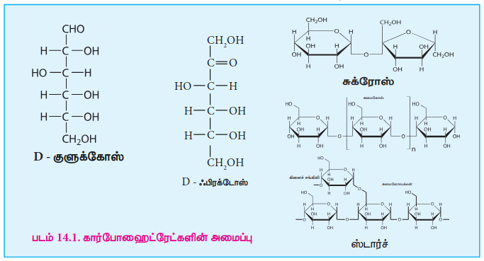
பச்சை தாவரங்களில் ஒளிச்சேர்க்கையின்போது கார்போஹைதரேட்கள் தொகுக்கப்படுகின்றன. ஒளிச்சேர்க்கை எனும் சிக்கலான செயல்முறையில் கார்பன் டை ஆக்சைடு மற்றும் நீர் ஆகியவற்றை குளுக்கோஸ் மற்றும் ஆக்ஸிஜன் ஆக மாற்றத் தேவையான ஆற்றலை சூரிய ஒளி வழங்குகிறது. அதன் பின்னர் குளுக்கோஸ் மற்ற கார்போஹைதரேட்களாக மாற்றமடைகிறது. இது விலங்குகளால் உணவாக பயன்படுகிறது.

\[ 6CO_2 + 6H_2O \rightarrow C_6H_{12}O_6 + 6O_2 \]

### 14.1.1 கார்போவைதரேட்டுக்களின் அமைப்பு வாய்ப்பாடு:

ஏறத்தாழ அனைத்து கார்போவைதரேட்டுக்களும் ஒன்று அல்லது அதற்கு மேற்பட்ட சீர்மையற்ற கார்பன்களை கொண்டிருப்பதால் ஒளிகழற்றும் தன்மையை பெற்றுள்ளன. சீர்மையற்ற கார்பன் அணுக்களின் எண்ணிக்கையை பொருத்து ஒளிகழற்று மாற்றியங்களின் எண்ணிக்கை அமைகிறது. (\( 2^n \) மாற்றியங்கள், இங்கு n என்பது சீர்மையற்ற கார்பன்களின் எண்ணிக்கை). ஒரு கரிம சேர்மத்தின் வடிவத்தை குறிப்பிடும் பிஷரின் அமைப்பு வாய்ப்பாடு முறையைப் பற்றி நாம் XI வகுப்பில் முன்னரே கற்றறிந்தோம். கிளிசரால்டிஹைடின் இரண்டு மாற்றியங்களில் ஒன்றுடன் ஒன்று தொடர்பு படுத்தும் வகையில் ஒரு கார்போவைதரேட்டின் அமைப்பு வாய்ப்பாட்டை பிஷர் திட்டமிட்டார். (படம் 14.2).

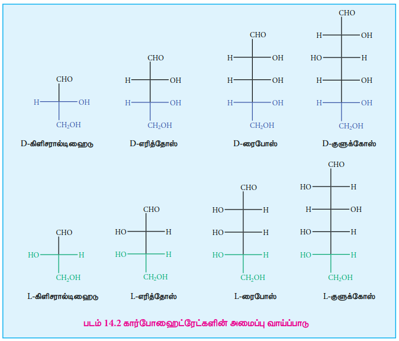
மேற்காண் அமைப்புகளின் அடிப்படையில் கார்போவைதரேட்கள் D அல்லது L என பெயரிடப்படுகின்றன. கார்போவைதரேட்கள் பொதுவாக D அல்லது L மற்றும் அதனைத் தொடர்ந்து (+) அல்லது (-) ஆகிய இரண்டு முன்னொட்களுடன் பெயரிடப்படுகின்றன. கிளிசரால்டிஹைடில் உள்ள –CH₂OH தொகுதியுடன் இணைந்துள்ள கார்பன் அணுவின் வடிவமைப்புடன் ஒப்பிட்டு கார்போவைதரேட்கள் D அல்லது L என குறியிடப்படுகின்றன. எடுத்துக்காட்டாக, குளுக்கோஸில் உள்ள ஐந்தாவது கார்பன் அணுவுடன் இணைந்துள்ள H மற்றும் OH தொகுதிகளின் அமைவிடமும் D-கிளிசரால்டிஹைடில் இரண்டாவது கார்பன் அணுவுடன் இணைந்துள்ள H மற்றும் OH தொகுதிகளின் அமைவிடமும் ஒன்றாக இருப்பதன் காரணமாக D-குளுக்கோஸ் என பெயரிடப்படுகிறது.

குறியீடுகள் (+) மற்றும் (–) ஆகியன முறையே வலச்சுழி சுழற்சித் தன்மை மற்றும் இடச்சுழி சுழற்சித் தன்மை ஆகியவற்றை குறிப்பிடுகின்றன. வலச்சுழி சுழற்சிச் சேர்மங்கள், தளமுனைவற்ற ஒளியின் தளத்தை கடிகார சுற்று திசையில் சுழற்றுகின்றன. அதே சமயம் இடச்சுழி சுழற்சிச் சேர்மங்கள் கடிகார சுற்று எதிர் திசையில் சுழற்றுகின்றன. D அல்லது L மாற்றியங்கள் வலச்சுழி சுழற்சிச் சேர்மங்களாகவோ அல்லது இடச்சுழி சுழற்சிச் சேர்மங்களாகவோ இருக்க இயலும். வலச்சுழி சுழற்சிச் சேர்மங்கள் D(+) அல்லது L(+) எனவும் இடச்சுழி சுழற்சிச் சேர்மங்கள் D(-) அல்லது L(-) எனவும் குறிப்பிடப்படுகின்றன.

### 14.1.2 கார்போஹைதரேட்களின் வகைப்பாடு:

கார்போஹைதரேட்களை அவற்றின் நீராப்பகுப்பின் அடிப்படையில், மோனோ சாக்கரைடுகள், ஒலிகோ சாக்கரைடுகள் மற்றும் பாலிசாக்கரைடுகள் என மூன்று பெரும் பிரிவுகளாக வகைப்படுத்த முடியும்.

**மோனோ சாக்கரைடுகள்:**

மோனோ சாக்கரைடுகள் என்பவை மேலும் எளிய சர்க்கரைகளாக நீராப்பகுக்க முடியாத கார்போஹைதரேட்கள் ஆகும். இவை எளிய சர்க்கரைகள் எனவும் அழைக்கப்படுகின்றன. மோனோ சாக்கரைடுகள் \( C_n(H_2O)_n \) என்ற பொது மூலக்கூறு வாய்ப்பாட்டை பெற்றுள்ளன. பல மோனோ சாக்கரைடுகள் கண்டறியப்பட்டாலும் இவற்றில் ஏறத்தாழ 20 மோனோசாக்கரைடுகள் மட்டுமே இயற்கையில் காணப்படுகின்றன. குளுக்கோஸ், ஃபிரக்டோஸ், ரிபோஸ், எரித்ரோஸ் ஆகியன சில பொதுவான எடுத்துக்காட்டுகளாகும்.

மோனோ சாக்கரைடுகளை அவற்றின் வேதிச் செயல் தொகுதி (ஆல்டோஸ்கள் அல்லது கீட்டோஸ்கள்) மற்றும் சங்கிலியிலுள்ள கார்பன் அணுக்களின் எண்ணிக்கையின் (ட்ரையோஸ்கள், டெட்ரோஸ்கள், பென்டோஸ்கள், ஹெக்ஸோஸ்கள் போன்றவை) அடிப்படையில் மேலும் வகைப்படுத்தப்படுகின்றன. கார்பனைல் தொகுதியானது ஆல்டிஹைடு தொகுதியாக இருந்தால் அந்த சர்க்கரை, ஆல்டோஸ் எனவும், கார்பனைல் தொகுதியானது கீட்டோன் தொகுதியாக இருந்தால் அந்த சர்க்கரை கீட்டோஸ் எனவும் அறியப்படுகின்றன. பொதுவாக மோனோ சாக்கரைடுகள் \( C_3 \) முதல் \( C_7 \) கார்பன் அணுக்களை பெற்றுள்ளன.

**அட்டவணை 14.1 மோனோ சாக்கரைடுகளின் பல்வேறு வகைகள்:**

| சங்கிலியில் உள்ள கார்பன் அணுக்களின் எண்ணிக்கை | வேதிச் செயல் தொகுதி | சர்க்கரையின் வகை | எடுத்துக்காட்டு |
| :--- | :--- | :--- | :--- |
| 3 | ஆல்டிஹைடு | ஆல்டோ ட்ரையோஸ் | கிளிசரால்டிஹைடு |
| 3 | கீட்டோன் | கீட்டோ ட்ரையோஸ் | டைஹைட்ராக்ஸி அசிட்டோன் |
| 4 | ஆல்டிஹைடு | ஆல்டோ டெட்ரோஸ் | எரித்ரோஸ் |
| 4 | கீட்டோன் | கீட்டோ டெட்ரோஸ் | எரித்ருலோஸ் |
| 5 | ஆல்டிஹைடு | ஆல்டோ பென்டோஸ் | ரிபோஸ் |
| 5 | கீட்டோன் | கீட்டோ பென்டோஸ் | ரிபுலோஸ் |
| 6 | ஆல்டிஹைடு | ஆல்டோ ஹெக்ஸோஸ் | குளுக்கோஸ் |
| 6 | கீட்டோன் | கீட்டோ ஹெக்ஸோஸ் | ஃபிரக்டோஸ் |

### 14.1.3 குளுக்கோஸ்

குளுக்கோஸ் ஒரு எளிய வகை சர்க்கரை ஆகும், இது நமக்கு முதன்மையான ஆற்றல் மூலமாக விளங்குகிறது. இது முக்கியமான மற்றும் மிக அதிகளவில் காணப்படும் சர்க்கரை ஆகும். இது தேன், திராட்சை மற்றும் மாம்பழம் போன்ற இனிப்புச் சுவையுடைய பழங்களில் காணப்படுகிறது. மனித இரத்தத்தில் ஏறத்தாழ 100 mg/dL குளுக்கோஸ் இருப்பதால்,இது இரத்த சர்க்கரை எனவும் அறியப்படுகிறது. சுக்ரோஸ், ஸ்டார்ச், செல்லுலோஸ் போன்றவற்றில் குளுக்கோஸ் ஒன்றிலைந்த வடிவத்தில் அமைந்துள்ளது.

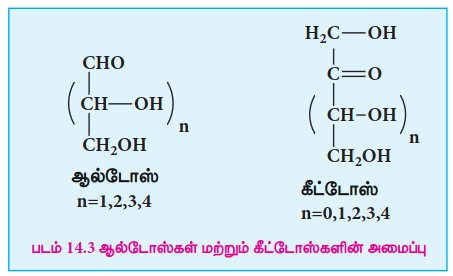

**குளுக்கோஸ் தயாரித்தல்**

1.  ஆல்கஹால் கரைசலில் நீர்த்த \( H_2SO_4 \) உடன் சேர்த்து சுக்ரோஸை (கரும்பு சர்க்கரை) வெப்பப்படுத்தும்போது அது நீராப்பகுப்படைந்து குளுக்கோஸ் மற்றும் ஃபிரக்டோஸ் ஆகியவற்றைத் தருகிறது.
$$
\begin{array}{ccccc}
\mathrm{C_{12}H_{22}O_{11}} & + & \mathrm{H_2O} & \xrightarrow{\mathrm{H^+}} & \mathrm{C_6H_{12}O_6} + \mathrm{C_6H_{12}O_6} \\[4pt]
{\scriptsize\text{சுக்ரோஸ்}} & + & {\scriptsize\text{நீர்}} & & {\scriptsize\text{குளுக்கோஸ் + பிரக்டோஸ்}}
\end{array}
$$
2.  தொழிற்சாலையில், அதிக வெப்பநிலை மற்றும் அதிக அழுத்த நிலைகளில், நீர்த்த HCl கொண்டு ஸ்டார்ச்சை நீராப்பகுப்பதன் விளைவாக குளுக்கோஸ் தயாரிக்கப்படுகிறது.
$$
\begin{array}{ccccc}
(\mathrm{C_6H_{10}O_5})_n & + & n\,\mathrm{H_2O} &
\xrightarrow[ \begin{array}{c} 393\,\mathrm{K}\\ 2\text{-}3~\mathrm{atm} \end{array} ]{\mathrm{H^+}} &
n\,\mathrm{C_6H_{12}O_6} \\[4pt]
{\scriptsize\text{ஸ்டார்ச்}} & & & & {\scriptsize\text{குளுக்கோஸ்}}
\end{array}
$$

**குளுக்கோஸ் அமைப்பு**

குளுக்கோஸ் ஒரு ஆல்டோ ஹெக்ஸோஸ் ஆகும். இது நான்கு சீர்மையற்ற கார்பன் அணுக்களைக் கொண்ட ஒரு ஒளிகழற்றும் தன்மை கொண்ட மூலக்கூறாகும். குளுக்கோஸின் நீர்க்கரைசல் வலச்சுழி சுழற்சியை கொண்டிருப்பதால், இது டெக்ஸ்ட்ரோஸ் எனவும் அழைக்கப்படுகிறது. குளுக்கோஸ் மூலக்கூறிற்கு முன்மொழியப்பட்ட அமைப்பு வாய்ப்பாடு படம் 14.4 ல் காட்டப்பட்டுள்ளது. இந்த அமைப்பானது பின்வரும் ஆதாரங்களின் அடைப்படையில் வருவிக்கப்பட்டதாகும்.

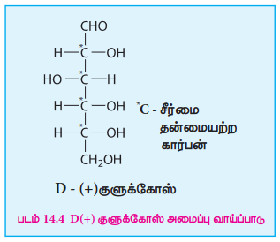

1.  தனிம பகுப்பாய்வு மற்றும் மூலக்கூறு நிறையறிதல் சோதனை ஆகியவை குளுக்கோஸின் மூலக்கூறு வாய்ப்பாடு \( C_6H_{12}O_6 \) என காட்டுகின்றன.
2.  373K வெப்பநிலையில் குளுக்கோஸை அடர் HI மற்றும் சிவப்பு பாஸ்பரஸ் கொண்டு ஒடுக்கும்போது n-ஹெக்ஸேன் மற்றும் 2- அயோடோ ஹெக்ஸேன் கலந்த கலவை கிடைக்கிறது, இது, குளுக்கோஸிலுள்ள ஆறு கார்பன் அணுக்களும் ஒரே நேர்கோட்டு சங்கிலியாக பிணைக்கப்பட்டுள்ளன என்பதை காட்டுகிறது.

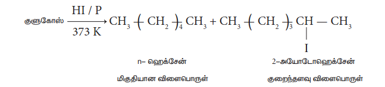

3.  குளுக்கோஸ், ஹைட்ராக்சிலமீன் உடன் வினைப்பட்டு ஆக்சைம் மற்றும் HCN உடன் வினைப்பட்டு சயனோஹைட்ரின் ஆகியவற்றை உருவாக்குகிறது. குளுக்கோஸ் மூலக்கூறில் கார்பனைல் தொகுதி இருப்பதை இவ்வினைகள் காட்டுகின்றன.

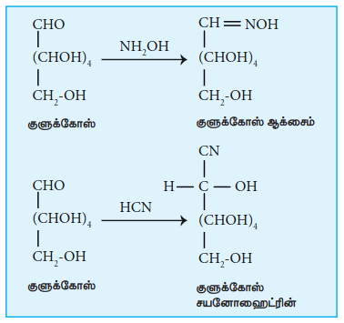

4.  குளுக்கோஸ் ஆனது புரோமின் நீர் போன்ற வலிமை குறைந்த ஆக்ஸிஜனேற்றிகளால் குளுக்கோனிக் அமிலமாக ஆக்ஸிஜனேற்றம் அடைகிறது. இதிலிருந்து, குளுக்கோஸில் உள்ள கார்பனைல் தொகுதியானது ஆல்டிஹைடாக உள்ளது எனவும், மேலும் அதன் கார்பன் சங்கிலியின் முனையில் அமைந்துள்ளது எனவும் தெளிவாகிறது. அடர் நைட்ரிக் அமிலம் போன்ற வலிமை வாய்ந்த ஆக்ஸிஜனேற்றிகளைக் கொண்டு ஆக்ஸிஜனேற்றம் செய்யும்போது குளுக்கோனிக் அமிலம் (சாக்கரிக் அமிலம்) கிடைக்கிறது. இதன்மூலம் சங்கிலியின் மறு முனையும் ஓரிணைய ஆல்கஹால் தொகுதியால் ஆக்ஸிஜனேற்றப்பட்டுள்ளது என்பது தெளிவாகிறது.

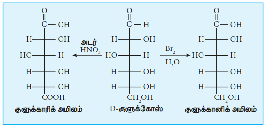

5.  குளுக்கோஸ் ஆனது அம்மோனியா கலந்த சில்வர் நைட்ரேட் கரைசல் (டோலன்ஸ் வினைக்காரணி) மற்றும் காரம் கலந்த காப்பர் சல்பேட் கரைசல் (ஃபெல்லிங் வினைக்காரணி) ஆகியவற்றால் குளுக்கோனிக் அமிலமாக ஆக்ஸிஜனேற்றம் செய்யப்படுகிறது. டோலன் வினைக்காரணியானது உலோக சில்வராக ஒடுக்கப்படுகிறது, அதேபோல ஃபெல்லிங் கரைசல் குப்ரஸ் ஆக்சைடாக ஒடுக்கப்பட்டு சிவப்பு நிற வீழ்படிவாக மாறுகிறது. குளுக்கோஸ் மூலக்கூறில் ஆல்டிஹைடு தொகுதி உள்ளதை இந்த வினைகள் மேலும் உறுதிபடுத்துகின்றன.

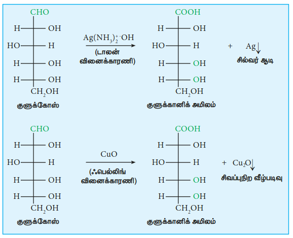

6.  குளுக்கோஸ், அசிட்டிக் அமில நீரிலியுடன் வினைப்பட்டு பென்டா அசிடேட்டை உருவாக்குகிறது. குளுக்கோஸில் ஐந்து ஆல்கஹால் தொகுதிகள் இருப்பதை இது பரிந்துரைக்கிறது.

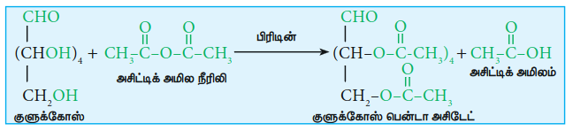

7.  குளுக்கோஸ் ஒரு நிலைப்புத் தன்மை கொண்ட சேர்மமாகும், மேலும் இது எளிதில் நீர்நீக்கம் அடைவதில்லை. ஒரே கார்பன் அணுவில் ஒன்றுக்கு மேற்பட்ட ஹைட்ராக்சில் தொகுதிகள் பிணைக்கப்படவில்லை என்பதை இது காட்டுகிறது. அதாவது ஐந்து ஹைட்ராக்சில் தொகுதிகளும் ஐந்து வெவ்வேறு கார்பன் அணுக்களுடன் இணைக்கப்படுகின்றன, மேலும் ஆறாவது கார்பன் ஆனது ஆல்டிஹைடு தொகுதியாக அமைந்துள்ளது.
8.  எமில் பிஷர் என்பவரால் முன்மொழியப்பட்ட, –OH தொகுதிகளின் மிகச்சரியான புறவெளி அமைப்பானது படம் 14.4 இல் காட்டப்பட்டுள்ளது. D வடிவ அமைப்பை கொண்டிருப்பதாலும், வலச்சுழி சுழற்சியை கொண்டிருப்பதாலும், குளுக்கோஸ் மூலக்கூறானது D(+) குளுக்கோஸ் என குறிப்பிடப்படுகிறது.

**குளுக்கோஸின் வளைய அமைப்பு:**

தான் முன்மொழிந்த குளுக்கோஸின் திறந்த சங்கிலி பென்டா ஹைட்ராக்ஸி ஆல்டிஹைடு அமைப்பானது அதன் வேதி இயல்பை முழுமையாக விளக்குவதாக அமையவில்லை என பிஷர் கண்டறிந்தார். சாதாரண ஆல்டிஹைடுகள் போலல்லாமல், குளுக்கோஸ் ஆனது சோடியம் பைசல்பைட்டுடன், படிக பைசல்பைட் சேர்மத்தை உருவாக்கவில்லை. குளுக்கோஸ் ஷிப் சோதனையை தரவில்லை மேலும் குளுக்கோஸின் பென்டா அசிடேட் பெறுதியானது டோலன் வினைக்காரணி அல்லது ஃபெல்லிங் கரைசல் ஆகியவற்றால் ஆக்ஸிஜனேற்றம் அடையவில்லை. இந்த பண்புகளை திறந்த சங்கிலி அமைப்பு விளக்கவில்லை.

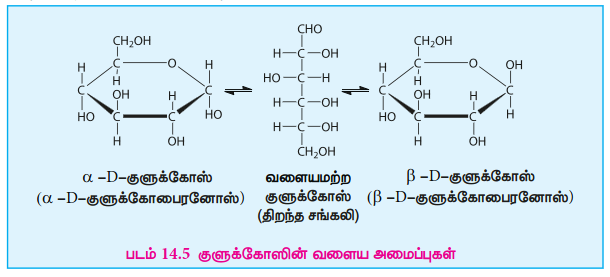

மேலும், படிகமாக்கப்பட்ட நிபந்தனைகளை பொறுத்து குளுக்கோஸ் ஆனது வெவ்வேறு உருகுநிலைகளைக் (419 மற்றும் 423 K) கொண்ட இரண்டு வெவ்வேறு வடிவங்களில் படிகமாவது கண்டறியப்பட்டுள்ளது. இவற்றை விளக்கும் பொருட்டு, படம் 14.5 இல் காட்டியுள்ளவாறு ஹைட்ராக்ஸில் தொகுதிகளுள் ஒன்று ஆல்டிஹைடு தொகுதியுடன் வினைப்பட்டு வளைய அமைப்பு ( ஹெமியசிட்டால் வடிவம்) உருவாகிறது என முன்மொழியப்பட்டது. இதன் காரணமாக சீர்மையுள்ள ஆல்டிஹைடு கார்பனானது சீர்மையற்ற கார்பனாக மாற்றமடைவதால் இரண்டு மாற்றியங்கள் உருவாகின்றன. இந்த இரண்டு மாற்றியங்கள் C1 கார்பன் அணுவில் மட்டும் மாறுபட்ட அமைப்பை கொண்டுள்ளன. இந்த மாற்றியங்கள் அனோமர்கள் (anomers) என்றழைக்கப்படுகின்றன. குளுக்கோஸின் இரண்டு அனோமர் வடிவங்கள் α- மற்றும் β-வடிவங்கள் என்றழைக்கப்படுகின்றன. 5 கார்பன் அணுக்கள் மற்றும் ஒரு ஆக்ஸிஜன் அணுவை உள்ளடக்கிய குளுக்கோஸின் இந்த வளைய அமைப்பானது பைரானின் அமைப்பை ஒத்துள்ள காரணத்தால் பைரனோஸ் வடிவம் எனப்படுகிறது. தனி α- மற்றும் β-D-குளுக்கோஸ் ஆகியவற்றின் குறிப்பிட்ட சுழற்சி மதிப்புகள் முறையே \( 112^\circ \) & \( 18.7^\circ \) ஆகும். எனினும், தனி நிலையில் உள்ள இந்த சர்க்கரைகளில் ஏதேனும் ஒன்றை நீரில் கரைக்கும்போது, குறிப்பிட்ட சுழற்சி மதிப்பு \( +52.5^\circ \) கொண்ட சமநிலையை அடையும் வரை α-D-குளுக்கோஸ் மற்றும் β-D-குளுக்கோஸ் ஆகியன, திறந்த சங்கிலி அமைப்பின் வழியாக மெதுவாக ஒன்றிலிருந்து மற்றொன்றாக மாற்றமடைகின்றன. இந்நிகழ்வானது மியூட்டா சுழற்சி என்றழைக்கப்படுகிறது.

**எபிமர்கள் மற்றும் எபிமராக்கல்:**

ஒரே ஒரு சீர்மையற்ற மையத்தில் மட்டும், மாறுபட்ட தொகுதி இட அமைவு கொண்ட சர்க்கரைகள் எபிமர்கள் என அறியப்படுகின்றன. ஒரு எபிமர் மற்றொரு எபிமராக மாறும் செயல்முறையானது எபிமராக்கல் என்றழைக்கப்படுகிறது, மேலும் இச்செயல்முறை நிகழ எபிமரேஸ் எனும் நொதி தேவைப்படுகிறது. இதே வழிமுறையில், காலக்டோஸ் நம் உடலில் குளுக்கோஸாக மாற்றப்படுகிறது.

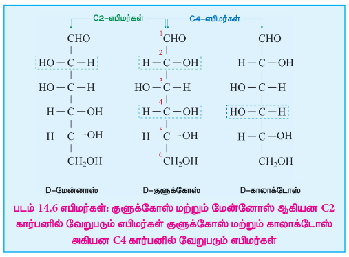

### 14.1.4. ஃபிரக்டோஸ்

ஃபிரக்டோஸ் என்பது பொதுவாக அறியப்பட்ட மற்றொரு மோனோ சாக்கரைடு ஆகும், இது குளுக்கோஸைப் போன்றே அதே மூலக்கூறு வாய்ப்பாட்டை கொண்டுள்ளது. இது இடச்சுழி திருப்புத் திறனைக் கொண்ட கீட்டோ ஹெக்ஸோஸ் ஆகும். இது பழங்களில் மிக அதிகளவில் காணப்படுவதால், பழச் சர்க்கரை எனவும் அழைக்கப்படுகிறது.

**தயாரித்தல்**

**1. சுக்ரோஸிலிருந்து:**

சுக்ரோஸை நீர்த்த \( H_2SO_4 \) உடன் சேர்த்து வெப்பப்படுத்தியோ அல்லது இன்வர்டேஸ் நொதியைக் கொண்டோ ஃபிரக்டோஸ் தயாரிக்கப்படுகிறது.

$$
\begin{array}{ccccccc}
\mathrm{C_{12}H_{22}O_{11}} & + & \mathrm{H_2O} &
\xrightarrow[\scriptstyle\text{அமிலம்}]{\mathrm{H_2SO_4}} &
\mathrm{C_6H_{12}O_6} & + & \mathrm{C_6H_{12}O_6} \\[4pt]
{\scriptstyle\text{சுக்ரோஸ்}} & & &
&
{\scriptstyle\text{இன்வெர்ட்டோஸ்}} & &
{\scriptstyle\text{குளுக்கோஸ்}}
\end{array}
$$

படிகமாக்கல் முறையில் ஃபிரக்டோஸ் தனியாக பிரிக்கப்படுகிறது. சம அளவு குளுக்கோஸ் மற்றும் ஃபிரக்டோஸ் ஆகியவற்றை கொண்டுள்ள கரைசல் எதிர்மாறு சர்க்கரை (invert sugar) என பெயரிடப்படுகிறது.

**2. இன்யூலினிலிருந்து**

தொழிற்சாலையில், அமில ஊடகத்தில் இன்யூலின் (ஒரு பாலிசாக்கரைடு) நீராப்பகுத்து ஃபிரக்டோஸ் தயாரிக்கப்படுகிறது.

$$
\begin{array}{ccccc}
\left(\mathrm{C_6H_{10}O_5}\right)_n
& + &
n\,\mathrm{H_2O}
& \xrightarrow{\mathrm{H^+}} &
n\,\mathrm{C_6H_{12}O_6}
\\[3pt]
{\scriptstyle\text{இனுலின்}}
&&
&&
{\scriptstyle\text{ஃப்ரக்டோஸ்}}
\end{array}
$$

**ஃபிரக்டோஸ் வடிவமைப்பு:**

அனைத்து வகை சர்க்கரைகளை ஒப்பிடும்போது ‘ஃபிரக்டோஸ்’ அதிக இனிப்புச் சுவையுடையதாகும். இது நீரில் நன்கு கரையக்கூடியது. புதிதாக தயாரிக்கப்பட்ட ‘ஃபிரக்டோஸ்’ கரைசலின் குறிப்பிட்ட சுழற்சி மதிப்பு \( -133^\circ \). இந்த மதிப்பானது சமநிலையில் மியூட்டா சுழற்சியின் காரணமாக \( –92^\circ \) ஆக மாறுகிறது. குளுக்கோஸ் போன்றே ‘ஃபிரக்டோஸின்’ அமைப்பு பின்வரும் உண்மைகளை அடிப்படையாக கொண்டு விளக்கப்படுகிறது.

1. தனிம பகுப்பாய்வு மற்றும் மூலக்கூறு நிறையறிதல் சோதனை ஆகியன ஃபிரக்டோஸின் மூலக்கூறு வாய்ப்பாடு \( C_6H_{12}O_6 \) என காட்டுகின்றன.
2. அடர் HI மற்றும் சிவப்பு பாஸ்பரஸ் கொண்டு ஒடுக்கும்போது ஃபிரக்டோஸ் ஆனது n-ஹெக்ஸேன் (மிகையளவு) மற்றும் 2-அயோடோ ஹெக்ஸேன் (குறைந்தளவு) கலந்த கலவையை உருவாக்குகிறது. இது, ஃபிரக்டோஸிலுள்ள ஆறு கார்பன் அணுக்களும் ஒரே நேர்கோட்டு சங்கிலியாக பிணைக்கப்பட்டுள்ளது என்பதை காட்டுகிறது.

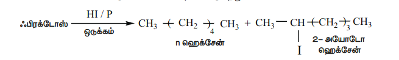

3. ஃபிரக்டோஸ் \( NH_2OH \) மற்றும் HCN உடன் வினைபுரிகிறது. ஃபிரக்டோஸ் மூலக்கூறில் கார்பனைல் தொகுதி இருப்பதை இவ்வினைகள் காட்டுகின்றன.
4. ஃபிரக்டோஸ் ஆனது பிரிடின் முன்னிலையில் அசிட்டிக் அமில நீரிலியுடன் வினைப்பட்டு பென்டா அசிடேட்டை உருவாக்குகிறது. ஃபிரக்டோஸ் மூலக்கூறில் ஐந்து ஆல்கஹால் தொகுதிகள் இருப்பதை இவ்வினை காட்டுகிறது.
5. ஃபிரக்டோஸ் மூலக்கூறு புரோமின் நீரால் ஆக்ஸிஜனேற்றமடைவதில்லை. இதிலிருந்து, ஃபிரக்டோஸ் மூலக்கூறில் ஆல்டிஹைடு தொகுதி (-CHO) இருப்பதற்கான சாத்தியமில்லை என அறியலாம்.
6. சோடியம்-பாதரசக் கலவை மற்றும் நீர் உடன் ஃபிரக்டோஸ் பகுதியளவு ஒடுக்கமடைந்து சார்பிடால் மற்றும் மேனிட்டால் கலவை உருவாகிறது. இவை இரண்டும் இரண்டாம் கார்பனில் மாறுபட்ட அமைப்பை கொண்ட எபிமர்கள் ஆகும். அதாவது ஒரு புதிய சீர்மையற்ற கார்பன் C-2 வில் உருவாகியுள்ளது. இது மூலக்கூறில் கீட்டோன் தொகுதி உள்ளதை உறுதிபடுத்துகிறது.

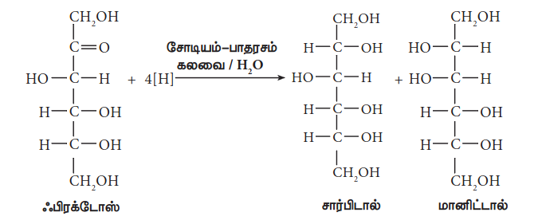

7.  நைட்ரிக் அமிலம் கொண்டு ஆக்ஸிஜனேற்றம் செய்யும்போது, ஃபிரக்டோஸ் மூலக்கூறானது கிளைக்காலிக் அமிலம் மற்றும் டார்டாரிக் அமிலங்களை தருகிறது. இவை ஃபிரக்டோஸ் மூலக்கூறைவிட குறைவான கார்பன் அணுக்களை கொண்ட மூலக்கூறுகளாகும்.

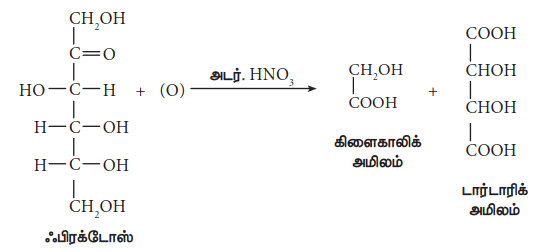

கீட்டோன் தொகுதியானது C-2 கார்பனில் அமைந்துள்ளதை இது காட்டுகிறது. மேலும், C-1 மற்றும் C-6 கார்பன்களில் 1° ஆல்கஹால் தொகுதிகள் அமைந்துள்ளதையும் இது காட்டுகிறது. மேற்கண்ட வினையிலிருந்து ஃபிரக்டோஸ் அமைப்பானது பின்வருமாறு அமைகிறது.

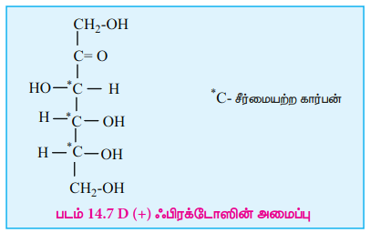

**ஃபிரக்டோஸின் வளைய அமைப்பு**

குளுக்கோஸைப் போலவே, ஃபிரக்டோஸும் வளைய அமைப்பை உருவாக்குகிறது. ஆனால் குளுக்கோஸை போலல்லாமல் இது ஃபுரானை ஒத்த ஐந்தணு வளையத்தை உருவாக்குகிறது. எனவே, இது ஃபுரானோஸ் வடிவம் என்றழைக்கப்படுகிறது. பொதுவாக சுக்ரோஸ் போன்ற டைசாக்கரைடுகளின் பகுதிக்கூறாக இருக்கும்போது ஃபிரக்டோஸ் அதன் ஃபுரானோஸ் வடிவத்திலேயே காணப்படுகிறது.

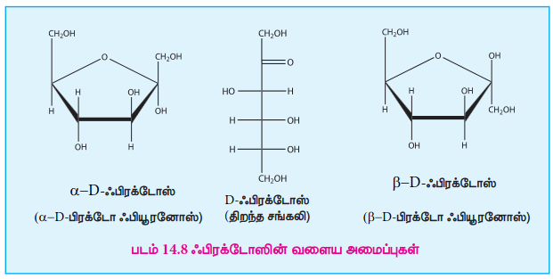

### 14.1.5 டைசாக்கரைடுகள்:

டைசாக்கரைடுகள் என்பவை நீராப்பகுப்படைந்து இரண்டு மோனோசாக்கரைடு மூலக்கூறுகளை தரும் சர்க்கரைகள் ஆகும். இந்த வினையானது பொதுவாக நீர்த்த அமிலம் அல்லது நொதியினால் வினையூக்கப்படுகிறது. டைசாக்கரைடுகள் \( C_n(H_2O)_{n-1} \) எனும் பொது வாய்ப்பாட்டினைக் கொண்டுள்ளன. டைசாக்கரைடுகளில் உள்ள இரண்டு மோனோசாக்கரைடு அலகுகள் ‘கிளைக்கோசிடிக் பிணைப்பு’ எனும் ஆக்ஸிஜன் பிணைப்பினால் பிணைக்கப்பட்டுள்ளன, இந்த பிணைப்பானது ஒரு மோனோசாக்கரைடின், அனோமர் கார்பனில் உள்ள ஹைட்ராக்சில் தொகுதியானது மற்றொரு மோனோசாக்கரைடினுள்ள ஹைட்ராக்சில் தொகுதியுடன் வினைபுரிவதால் உருவாகிறது.

எடுத்துக்காட்டு: சுக்ரோஸ், லாக்டோஸ், மால்டோஸ்

**சுக்ரோஸ்:** சுக்ரோஸ் என்பது உணவுச் சர்க்கரை என அறியப்படுகிறது. இது மிக அதிகளவில் காணப்படுகிறது. கரும்புச் சாறு மற்றும் சர்க்கரைவள்ளிக் கிழங்கு ஆகியவற்றிலிருந்து இது அதிகளவில் பெறப்படுகிறது. தேனீக்கள் போன்ற பூச்சிகள் இன்வர்டேஸ் எனப்படும் நொதியை கொண்டுள்ளன. இந்த நொதியானது, சுக்ரோஸ் நீராப்பகுப்படைந்து குளுக்கோஸ் மற்றும் ஃபிரக்டோஸ் கலவையை உருவாக்கும் வினைக்கு வினையூக்கியாக செயல்படுகிறது. உண்மையில் தேன் என்பது குளுக்கோஸ், ஃபிரக்டோஸ் மற்றும் சுக்ரோஸ் ஆகியவற்றின் கலவையாகும்.

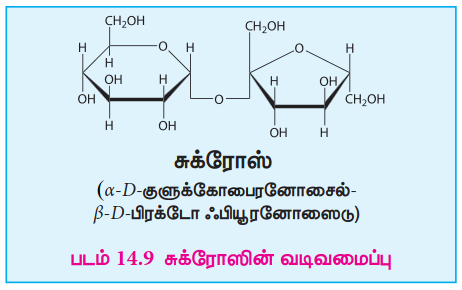

$$
\text{சுக்ரோஸ்}
\;\xrightarrow{\text{இன்வெர்ட்டேஸ்}}\;
\text{குளுக்கோஸ்}
\;+\;
\text{ஃப்ரக்டோஸ்}
$$

சுக்ரோஸ் (\( +66.6^\circ \)) மற்றும் குளுக்கோஸ் (\( +52.5^\circ \)) ஆகியன வலச்சுழித் திருப்புச் சேர்மங்கள் ஆகும், ஆனால் ஃபிரக்டோஸ் மூலக்கூறு இடச்சுழி சுழற்றுத் தன்மை கொண்ட சேர்மமாகும் (\( -92.4^\circ \)). சுக்ரோஸின் நீராப்பகுத்தலின்போது, வினைக்கரைசலின் ஒளிச்சுழற்றும் தன்மையானது வலச்சுழியிலிருந்து இடச்சுழியாக மாறுகிறது. எனவே, சுக்ரோஸ் ஆனது எதிர்மாறு சர்க்கரை எனவும் அழைக்கப்படுகிறது.

**அமைப்பு:**

சுக்ரோஸில், α-D-குளுக்கோஸ் அலகின் C1 ஆனது β-D-ஃபிரக்டோஸின் C2 உடன் பிணைக்கப்பட்டுள்ளது. இவ்வமைப்பில் உருவாக்கப்பட்ட கிளைக்கோசிடிக் பிணைப்பானது α-1,2 கிளைக்கோசிடிக் பிணைப்பு என்றழைக்கப்படுகிறது. இரண்டு கார்பனைல் கார்பன்களும் (ஒடுக்கும் தொகுதிகள்) கிளைக்கோசிடிக் பிணைப்பாக்கலில் ஈடுபட்டுள்ளதால், சுக்ரோஸ் மூலக்கூறானது ஒரு ஒடுக்கும் தன்மையற்ற சர்க்கரையாக உள்ளது.

**லாக்டோஸ்:** லாக்டோஸ் பாலூட்டிகளின் பாலில் காணப்படும் ஒரு டைசாக்கரைடு ஆகும். எனவே இது பால் சர்க்கரை எனவும் குறிப்பிடப்படுகிறது. இது நீராப்பகுத்தலில் காலக்டோஸ் மற்றும் குளுக்கோஸ் ஆகியவற்றை தருகிறது. இதில் படத்தில் காட்டியுள்ளவாறு β-D- காலக்டோஸ் மற்றும் β-D-குளுக்கோஸ் அலகுகள் β-1,4 கிளைக்கோசிடிக் பிணைப்பால் பிணைக்கப்பட்டுள்ளன. ஆல்டிஹைடு கார்பன் ஆனது கிளைக்கோசிடிக் பிணைப்பில் பங்குகொள்வதில்லை எனவே இது அதன் ஒடுக்கும் தன்மையை தக்கவைத்துக்கொள்வதால் ஒடுக்கும் சர்க்கரை என்றழைக்கப்படுகிறது.

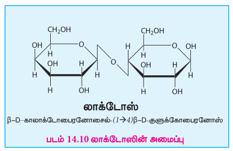

**மால்டோஸ்:** மாவுப்பொருளிலிருந்து பிரித்தெடுக்கப்படுவதால் இது மால்டோஸ் எனும் பெயர் பெற்றுள்ளது. இது பொதுவாக மால் சர்க்கரை என அழைக்கப்படுகிறது. முளைகட்டிய பார்லி அரிசியிலிருந்து பெறப்படும் மாவுப்பொருளானது மால்டோஸ் சர்க்கரையின் முக்கிய மூலமாக விளங்குகிறது. α-அமைலேஸ் எனும் நொதியால் ஸ்டார்ச் செயல்படுத்தப்படும்போது மால்டோஸ் உருவாக்கப்படுகிறது.

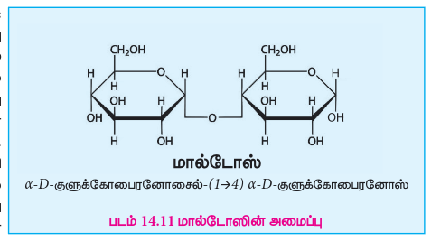

மால்டோஸ் மூலக்கூறானது இரண்டு α-D-குளுக்கோஸ் அலகுகளை கொண்டுள்ளது. இந்த அலகுகள் α-1,4 கிளைக்கோசிடிக் பிணைப்பால் பிணைக்கப்பட்டுள்ளன. ஒரு அலகின் அனோமர் கார்பனுக்கும் மற்றொரு அலகின் C-4 க்கும் இடையே இப்பிணைப்பு உருவாகிறது. இணைந்துள்ள இரண்டு குளுக்கோஸ் அலகுகளில் ஒன்று கார்பனைல் தொகுதியை கொண்டுள்ளதால் இது ஒடுக்கும் சர்க்கரையாக செயல்படுகிறது.

### 14.1.6 பாலிசாக்கரைடுகள்:

பாலிசாக்கரைடுகள், கிளைக்கோசிடிக் பிணைப்புகளால் ஒன்றாக பிணைக்கப்பட்டுள்ள அதிக எண்ணிக்கையிலான மோனோ சாக்கரைடு அலகுகளை கொண்டுள்ளன. மேலும் இவை கார்போஹைதரேட்களின் மிகப்பொதுவான வடிவங்களாகும். இனிப்புக் சுவையை பெற்றிருக்காத காரணத்தினால் பாலிசாக்கரைடுகள், சர்க்கரை அல்லாதவை என்றழைக்கப்படுகின்றன. இவைகள் நேர்கோட்டு சங்கிலி மற்றும் கிளைச்சங்கிலி மூலக்கூறுகளை உருவாக்குகின்றன.

பாலிசாக்கரைடுகள் அவற்றிலுள்ள உட்கூறு மோனோ சாக்கரைடு அலகுகளைப் பொருத்து ஓரின பாலிசாக்கரைடுகள் மற்றும் பல்லின பாலிசாக்கரைடுகள் என இரண்டு வகைகளாக வகைப்படுத்தப்படுகின்றன. ஓரின பாலிசாக்கரைடுகள் ஒரே ஒரு வகை மோனோ சாக்கரைடுகளாலும், பல்லின பாலிசாக்கரைடுகள் ஒன்றுக்கு மேற்பட்ட வகையிலான மோனோ சாக்கரைடுகளாலும் உருவாக்கப்படுகின்றன. எடுத்துக்காட்டு: ஸ்டார்ச், செல்லுலோஸ் மற்றும் கிளைக்கோஜன் (ஓரின பாலிசாக்கரைடுகள்); ஹைலுரோனிக் அமிலம், ஹெபாரின் (பல்லின பாலிசாக்கரைடுகள்).

**ஸ்டார்ச்**

ஸ்டார்ச் தாவரங்களில் ஆற்றல் சேமிப்பாக பயன்படுகிறது. உருளைக்கிழங்கு, மக்காச்சோளம், கோதுமை மற்றும் அரிசி ஆகியன ஸ்டார்ச்சின் முக்கிய மூலங்களாகும். இது \( \alpha(1,4) \) கிளைக்கோசிடிக் பிணைப்புகளால் பிணைக்கப்பட்டுள்ள குளுக்கோஸ் மூலக்கூறுகளாலான பலபடியாகும். ஸ்டார்ச்சை நீரில் கரையும் அமைலோஸ் மற்றும் நீரில் கரையா அமைலோபெக்டின் என இரண்டு கூறுகளாக பிரிக்க இயலும். ஸ்டார்ச் ஆனது ஏறத்தாழ 20 % அமைலோஸ் மற்றும் 80% அமைலோபெக்டினைக் கொண்டுள்ளது.

அமைலோஸ் ஆனது, \( \alpha(1,4) \) கிளைக்கோசிடிக் பிணைப்புகளால் பிணைக்கப்பட்ட, ஏறத்தாழ 4000 வரையிலான α-D-குளுக்கோஸ் மூலக்கூறுகளைக் கொண்ட கிளைகளற்ற சங்கிலிகளால் உருவாக்கப்பட்டுள்ளது. அமைலோபெக்டின் ஆனது ஏறத்தாழ 10000 \( \alpha(1,4) \) கிளைக்கோசிடிக் பிணைப்புகளால் பிணைக்கப்பட்ட α-D-குளுக்கோஸ் மூலக்கூறுகளை கொண்டுள்ளது. இதில் கூடுதலாக, நேர்கோட்டுச் சங்கிலியிலிருந்து கிளைகள் காணப்படுகின்றன. கிளைப் புள்ளிகளில், 24 முதல் 30 குளுக்கோஸ் மூலக்கூறுகளால் ஆன புதிய சங்கிலிகள் \( \alpha(1,6) \) கிளைக்கோசிடிக் பிணைப்புகளால் பிணைக்கப்பட்டுள்ளன. அயோடின் கரைசலை நேரடியாக்கும்போது அமைலோஸ் நீல நிறத்தையும், அமைலோபெக்டின் ஊதா (purple) நிறத்தையும் உருவாக்குகின்றன.

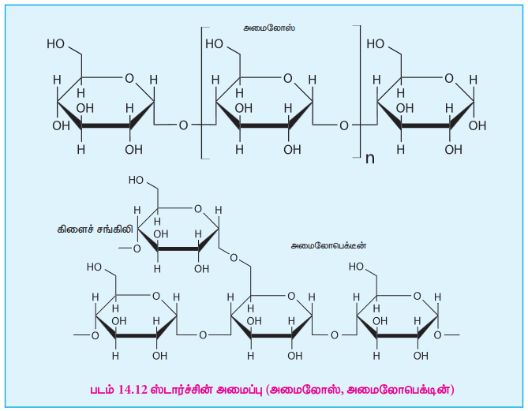

**செல்லுலோஸ்:**

செல்லுலோஸ், தாவர செல்களில் காணப்படும் மிக முக்கிய பகுதிக்கூறாகும். பஞ்சு தூய செல்லுலோஸ் ஆகும். நீராற்பகுத்தலில் செல்லுலோஸ் ஆனது D-குளுக்கோஸ் மூலக்கூறுகளை தருகின்றன. செல்லுலோஸ் ஒரு நேர்க்கோட்டு சங்கிலி பாலிசாக்கரைடு. இதில் குளுக்கோஸ் மூலக்கூறுகள் \( \beta(1,4) \) கிளைக்கோசிடிக் பிணைப்புகளால் பிணைக்கப்பட்டுள்ளன.

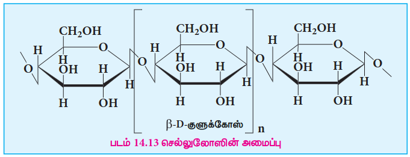

காகிதம் தயாரிப்பில் செல்லுலோஸ் மிக அதிகளவில் பயன்படுகிறது. செல்லுலோஸ் இழைகள், ரேயான், வெடிபொருள், (வெடி பஞ்சு -செல்லுலோஸின் ட்ரைநைட்ரேற்ற எஸ்டர்) மற்றும் பலவற்றில் பயன்படுகிறது. மனிதர்கள் செல்லுலோஸை உணவாக பயன்படுத்த இயலாது, ஏனெனில் நம் செரிமான அமைப்பு செல்லுலோஸை நீராற்பகுக்கத் தேவையான நொதிகளை (கிளைக்கோசிடேஸ்கள் அல்லது செல்லுலேஸ்கள்) கொண்டிருக்கவில்லை.

**கிளைக்கோஜன்:** கிளைக்கோஜன் விலங்குகளில் காணப்படும் சேமிப்பு பாலிசாக்கரைடு ஆகும். இது விலங்குகளின் கல்லீரல் மற்றும் தசைகளில் காணப்படுகிறது. கிளைக்கோஜன் விலங்கு ஸ்டார்ச் எனவும் அழைக்கப்படுகிறது. இது நீராற்பகுப்படைந்து குளுக்கோஸ் மூலக்கூறுகளைத் தருகிறது. கிளைக்கோஜனின் அமைப்பானது அதிக கிளைகளையுடைய அமைலோபெக்டினின் அமைப்பை ஒத்துள்ளது. கிளைக்கோஜனில் ஒவ்வொரு 8-14 குளுக்கோஸ் அலகுகளிலும் கிளைகள் உருவாகின்றன ஆனால், அமைலோபெக்டினில் 24-30 அலகுகளில் கிளைகள் உருவாகின்றன. மனித உடலில் உள்ள அதிகப்படியான குளுக்கோஸ் ஆனது கிளைக்கோஜனாக மாற்றப்பட்டு சேமிக்கப்படுகிறது.

### 14.1.7 கார்போஹைதரேட்களின் முக்கியத்துவம்:

1.  கார்போஹைதரேட்கள் தாவரங்கள் மற்றும் விலங்குகளில் பரவலாக காணப்படுகின்றன. அவை ஆற்றல் மூலங்களாகவும், கட்டமைப்பு பலபடிகளாகவும் செயலாற்றுகின்றன.
2.  கார்போஹைதரேட் மனித உடலில் கிளைக்கோஜன் ஆகவும் , தாவரங்களில் ஸ்டார்ச் ஆகவும் சேமிக்கப்படுகிறது.
3.  தாவரங்களின் செல் சுவரின் முக்கிய பகுதிப்பொருளான செல்லுலோஸ் போன்ற கார்போஹைதரேட்கள் காகிதம், மரச்சாமான்கள் மற்றும் பருத்தி உடைகள் ஆகியவற்றை பெற பயன்படுகிறது.
4.  எளிய சர்க்கரையான குளுக்கோஸ் ஆனது உடனடி ஆற்றல் மூலமாக செயல்புரிகிறது.
5.  ரிபோஸ் சர்க்கரைகள், நியூக்ளிக் அமிலங்களுள் முக்கிய பகுதிப்பொருட்களில் ஒன்றாகும்.
6.  ஹைராஜனேற்றம் (கிளைக்கோசமினோகிளைக்கேன்கள்) போன்ற மாற்றமடைந்த கார்போஹைதரேட்கள் விலங்குகளின் உடலில் அதிர்வெற்பிகளாகவும், உயவுப் பொருளாகவும் பயன்படுகின்றன.

