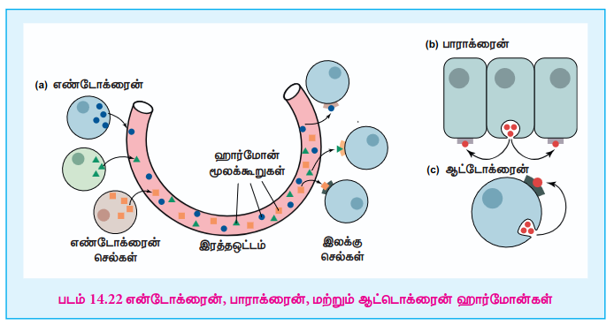

## 14.6 ஹார்மோன்கள்

ஹார்மோன் என்பது ஒரு திசுவினால் சுரக்கப்பட்டு, இரத்த ஓட்டத்தில் கலக்கப்படும் கரிம சேர்மமாகும் (எ.கா. பெப்டைடு அல்லது ஸ்டீராய்டு) மேலும் இது மற்ற செல்களில் உடலியல் துலங்களைத் தூண்டுகிறது. (எ.கா. வளர்ச்சி மற்றும் வளர்சிதை மாற்றம்). இது செல்களுக்கிடைப்பட்ட சமிக்ஞை மூலக்கூறாகும். உண்மையில், சிக்கலான உயிரினங்களில், இரத்த அழுத்தத்தை பராமரித்தல், இரத்த குளுக்கோஸ் அளவு மற்றும் மின்பகுளிச் சமநிலை, கரு உருவாக்கம், பசி, உணவுண்ணும் நடத்தை, செரித்தல் போன்ற ஒவ்வொரு செயல்முறையும் ஒன்று அல்லது அதற்கு மேற்பட்ட ஹார்மோன்களால் ஒழுங்குபடுத்தப்படுகின்றன. நாளமில்லா சுரப்பிகள் என்பவை, சிறப்புத் தன்மை வாய்ந்த ஹார்மோன்களை சுரக்கும் செல் தொகுப்புகளாகும். பிட்யூட்டரி சுரப்பி, பைனியல் சுரப்பி, நெஞ்சுக் கணைய சுரப்பி, தைராய்டு சுரப்பி, அட்ரீனல் சுரப்பி மற்றும் கணையம் ஆகியன முக்கியமான நாளமில்லா சுரப்பிகளாகும். கூடுதலாக, ஆண்களின் விந்தகத்திலும், பெண்களின் அண்டகத்திலும் ஹார்மோன்கள் சுரக்கப்படுகின்றன. வேதியியலாக, ஹார்மோன்கள் புரதங்களாகவோ (எ.கா. இன்சுலின், எபிநெஃப்ரின்) அல்லது ஸ்டீராய்டுகளாகவோ (எ.கா. ஈஸ்ட்ரோஜன், ஆண்ட்ரோஜன்) வகைப்படுத்தப்படுகின்றன. ஹார்மோன்கள் அவற்றின் செயல்படு தூரத்தை பொருத்து வகைப்படுத்தப்படுகின்றன. ஹார்மோன்கள், அவை செயல்படும் தூரத்தின் அளவைப் பொருத்து எண்டோக்ரைன், பாராக்ரைன் மற்றும் ஆட்டொக்ரைன் ஹார்மோன்கள் என வகைப்படுத்தப்படுகின்றன.

**எண்டோக்ரைன் ஹார்மோன்கள் :** இந்த ஹார்மோன்கள் அவை சுரக்கப்படும் செல்களிலிருந்து தொலைவிலுள்ள செல்களின் மீது செயல்புரிகின்றன. எடுத்துக்காட்டு: இன்சுலின் மற்றும் எபிநெஃப்ரின் ஆகியன நாளமில்லா சுரப்பிகளில் தொகுக்கப்பட்டு இரத்த ஓட்டத்தில் வெளிவிடப்படுகின்றன.

**பாராக்ரைன் ஹார்மோன்கள்:** (உள்ளூர் நடுவர்) இந்த ஹார்மோன்கள் அவை சுரக்கப்படும் செல்களுக்கு அருகாமையிலுள்ள செல்களின் மீது மட்டும் செயல்புரிகின்றன. எடுத்துக்காட்டு: இண்டர்லியூகின்-1 (IL-1)

**ஆட்டொக்ரைன் ஹார்மோன்கள்:** இந்த ஹார்மோன்கள் அவற்றை சுரக்கும் செல்களின் மீதே செயல்புரிகின்றன. எடுத்துக்காட்டு: புரத வளர்ச்சிக் காரணி இண்டர்லியூகின் -2 (IL-2).

உடலிலுள்ள அனைத்து செல்களும் ஹார்மோன்களுக்கு வெளிப்படுத்தப்பட்ட போதிலும், ஒரு குறிப்பிட்ட ஹார்மோனுக்கான குறிப்பிட்ட உணர்வேற்பியைக் கொண்டுள்ள செல்கள் மட்டுமே அவற்றின் இருப்பை (துலங்கலை) வெளிப்படுத்தும். எனவே ஹார்மோன் தகவல்கள் தேர்ந்து குறிக்கப்படுகின்றன.

