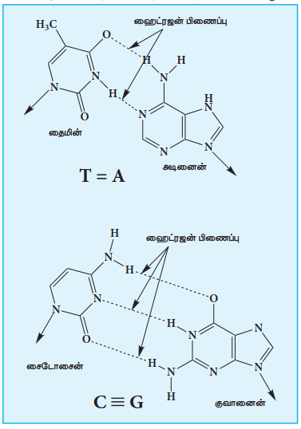
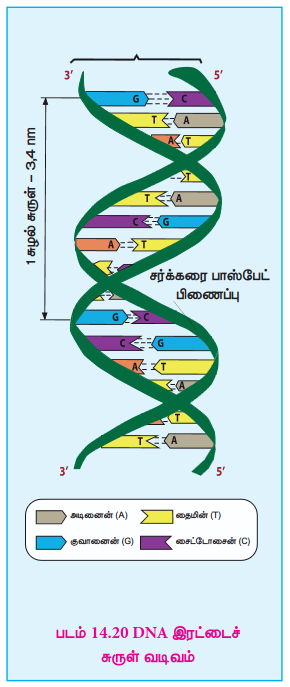
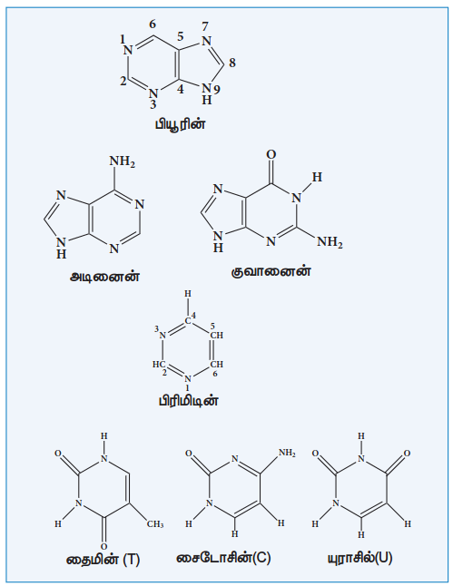
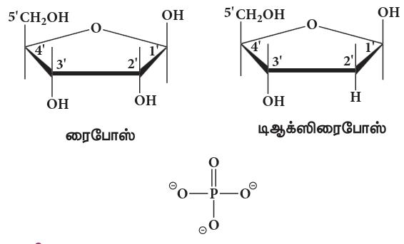
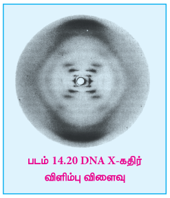
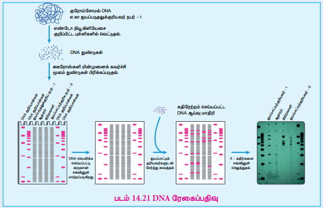
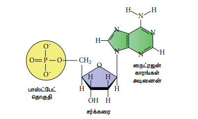
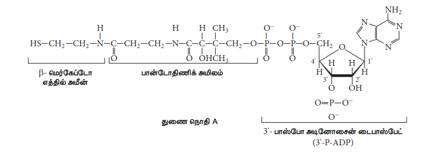
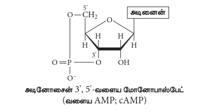

## 14.5 நியூக்ளிக் அமிலங்கள்

ஒவ்வொரு உயிரினத்தின் இயல்பான பண்புகளும் ஒரு தலைமுறையிலிருந்து மற்றொரு தலைமுறைக்கு கடத்தப்படுகின்றன. செல்லின் உட்கருவில் உள்ள சில உட்கூறுகள் இப்பண்புகளை கடத்துகின்றன என்பது கண்டறியப்பட்டுள்ளது. அவை குரோமோசோம்கள் ஆகும். குரோமோசோம்கள் புரதங்கள், மற்றும் நியூக்ளிக் அமிலங்கள் என்றழைக்கப்படும் மற்றொரு வகை உயிரியல் மூலக்கூறுகளால் ஆனவை ஆகும்.

டிஆக்ஸிரிபோநியூக்ளிக் அமிலம் (DNA) மற்றும் ரிபோநியூக்ளிக் அமிலம் (RNA) என இரண்டு வகையான நியூக்ளிக் அமிலங்கள் காணப்படுகின்றன. இவை ஒவ்வொரு உயிரினத்திலும் மரபுத் தகவல்களை சேமிக்கும் களஞ்சியங்களாக விளங்குகின்றன.

### 14.5.1 நியூக்ளிக் அமிலங்களின் இயைபு மற்றும் அமைப்பு

நியூக்ளிக் அமிலங்கள் என்பவை நியூக்ளியோடைடுகளின் உயிரியல் பலபடிகளாகும். DNA மற்றும் RNA வின் கட்டுப்படுத்தப்பட்ட நீராப்பகுத்தலின் போது நைட்ரஜன் காரம், ஒரு பென்டோஸ் சர்க்கரை மற்றும் பாஸ்பேட் தொகுதி என மூன்று கூறுகள் கிடைக்கின்றன.

**நைட்ரஜன் காரங்கள்:**

இந்த நைட்ரஜனைக் கொண்டுள்ள கார தொகுதிகளானவை பிரிமிடின் மற்றும் பியூரின் எனும் இரண்டு மூலச் சேர்மங்களின் பெறுதிகளாகும். DNA மற்றும் RNA ஆகிய இரண்டிலும் அடினைன் (A) மற்றும் குவானைன் (G) இரண்டும் முக்கியமான பியூரின் காரங்கள் காணப்படுகின்றன. பிரிமிடின் காரங்களில் ஒன்றான சைட்டோசின் (C) என்பது DNA மற்றும் RNA ஆகிய இரண்டிலும் காணப்படுகிறது. ஆனால் தைமின் (T) ஆனது DNA விலும், யுராசில் (U) ஆனது RNA விலும் காணப்படுகின்றன.

**பென்டோஸ் சர்க்கரை:**

நியூக்ளிக் அமிலங்களில் இரண்டு வகையான பென்டோஸ் சர்க்கரைகள் காணப்படுகின்றன. DNA வின் மீண்டும் மீண்டும் தொடரக்கூடிய டிஆக்ஸிரிபோநியூக்ளியோடைடுகள் அலகுகள் 2’-டிஆக்ஸி-D-ரிபோஸ் சர்க்கரையையும், RNA வின் ரிபோநியூக்ளியோடைடு அலகுகள் D-ரிபோஸ் சர்க்கரையையும் கொண்டுள்ளன. நியூக்ளியோடைடுகளில், இவ்விருவகை பென்டோஸ்களும் 3-ஃபுரானோஸ் (மூடிய ஐந்தணு வளையங்கள்) அமைப்பில் காணப்படுகின்றன.

**பாஸ்பேட் தொகுதி**

பாஸ்பாரிக் அமிலமானது நியூக்ளியோடைடுகளுக்கிடையே பாஸ்போ டை எஸ்டர் பிணைப்புகளை உருவாக்குகிறது. நியூக்ளியோடைடிலுள்ள பாஸ்பேட் தொகுதிகளின் எண்ணிக்கையை பொருத்து அவை மோனோ நியூக்ளியோடைடு, டை நியூக்ளியோடைடு மற்றும் டிரை நியூக்ளியோடைடு என வகைப்படுத்தப்படுகின்றன.

**நியூக்ளியோசைடுகள் மற்றும் நியூக்ளியோடைடுகள்:**

பாஸ்பேட் தொகுதியற்ற மூலக்கூறானது நியூக்ளியோசைடு எனப்படுகிறது. நியூக்ளியோசைடுடன் ஒரு பாஸ்பாரிக் அமிலம் சேர்வதன் மூலம் ஒரு நியூக்ளியோடைடு வருவிக்கப்படுகிறது. பொதுவாக சர்க்கரை கூறின் 5’ OH தொகுதியில் பாஸ்பாரிலேற்றம் நிகழ்கிறது. DNA மற்றும் RNA மூலக்கூறுகளில் ஒரு நியூக்ளியோடைடின் 5’ OH மற்றும் மற்றொரு நியூக்ளியோடைடின் 3’ OH ஆகியவற்றிற்கிடையே உருவாகும் பாஸ்போ டை எஸ்டர் பிணைப்பின் மூலம் நியூக்ளியோடைடுகள் பிணைக்கப்படுகின்றன.

$$
\begin{aligned}
\text{காரம் + சர்க்கரை} &\longrightarrow \text{நியூக்ளியோசைடு} \\[6pt]
\text{நியூக்ளியோசைடு + பாஸ்பாரிக் அமிலம்} &\longrightarrow \text{நியூக்ளியோடைடு} \\[6pt]
\text{நியூக்ளியோடைடு} &\longrightarrow \text{பாலிநியூக்ளியோடைடு} \\
&\qquad\qquad (\text{நியூக்ளிக் அமிலம்})
\end{aligned}
$$

### 14.5.2 DNA வின் இரட்டைச் சுருள் அமைப்பு

1950 களின் தொடக்கத்தில், DNA வின் கட்டமைப்பை கண்டறிவதற்காக ரோசாலிண்ட் ஃபிராங்கிளின் மற்றும் மாரிஸ் வில்கின்ஸ் ஆகியோர் X கதிர் விளிம்பு விளைவு ஆய்வுகளை பயன்படுத்தினர். DNA இழைகள் சிறப்புத்தன்மை வாய்ந்த விளிம்பு விளைவு மாதிரியை உருவாக்கியன.

விளிம்பு விளைவு மாதிரி படத்தின் மையத்தில் அமைந்துள்ள X குறியீடு போன்ற அமைப்பானது சுருளைக் குறிக்கிறது, அதேசமயம், மேற்பகுதி மற்றும் கீழ்பகுதியில் காணப்படும் அடர் கருமை நிற வில் அமைப்புகள் அடுக்கப்பட்ட காரங்களை வெளிக்காட்டுகின்றன.

1953 ஆம் ஆண்டில், J.D. வாட்சன் மற்றும் F.H.C. கிரிக் ஆகியோரால் வருவிக்கப்பட்ட DNA அமைப்பானது அறிவியலில் ஒரு முக்கிய மைல்கல் ஆக விளங்குகிறது. இந்த அறிஞர்கள் DNA மூலக்கூறின் முப்பரிமான அமைப்பு மாதிரியை முன்மொழிந்தனர், இதில் இரண்டு எதிரிணை DNA சங்கிலிச் சுருள்கள், ஒரே அச்சை மையமாகக் கொண்டு, வலக்கை இரட்டைச் சுருள் வடிவத்தை (right-handed double helix) உருவாக்குகின்றன.

ஒன்றுவிட்ட டிஆக்ஸிரிபோஸ் மற்றும் பாஸ்பேட் தொகுதிகளால் ஆன நீர்விரும்பும் மைய இழைகள் இரட்டைச் சுருள் வெளிப்பக்கமாக, சூழ்ந்துள்ள நீரை நோக்கி அமைந்துள்ளன. இரண்டு இழைகளிலும் உள்ள பியூரின் மற்றும் பிரிமிடின் காரங்கள் இரட்டைச் சுருளின் உள்ளகத்தில் அமைந்துள்ளன. இந்த காரங்களின் நீர்வெறுக்கும் மற்றும் வளைய அமைப்புகள் மிக நெருக்கமாக, மூல அச்சிற்கு செங்குத்தாக அமைக்கப்பட்டுள்ளன. இதனால் மின்சுமையுடைய பாஸ்பேட் தொகுதிகளுக்கிடையேயான விலக்கம் குறைக்கப்படுகிறது. இரண்டு இழைகளின் பக்கவாட்டு இணைதலின் காரணமாக, இரட்டை அடுக்கின் புறப்பரப்பின் மீது ஒரு பெரிய பள்ளம் (major groove) மற்றும் ஒரு சிறிய பள்ளம் (minor groove) உருவாகின்றன.

சுருள் அமைப்பின் ஒவ்வொரு வளைவிலும் 10.5 கார இணைகளும் (36 Å) மேலும் அடுக்கப்பட்ட காரங்களுக்கிடைப்பட்ட தொலைவு 3.4 Å ஆகவும் உள்ளதாக இந்த அமைப்பு மாதிரி வெளிக்காட்டியது. ஒரு இழையிலுள்ள ஒவ்வொரு காரமும், எதிரிணையில் உள்ள காரத்துடன் ஹைட்ரஜன் பிணைப்பை உருவாக்குவதால் ஒருநிலை கார இணை உருவாவதையும் அவர்கள் கண்டறிந்தனர்.

அடினைன் மற்றும் தைமின் ஆகியவற்றிற்கிடையே இரண்டு ஹைட்ரஜன் பிணைப்புகளும், குவானைன் மற்றும் சைட்டோசின் ஆகியவற்றிற்கிடையே மூன்று ஹைட்ரஜன் பிணைப்புகளும் உருவாகின்றன. மாறுபட்ட இணை உருவானால் அது இரட்டைச் சுருள் அமைப்பின் நிலைப்புத்தன்மையை சிதைக்கிறது. இரட்டைச் சுருள் அமைப்பின் இரண்டு சங்கிலிகளின் இந்த குறிப்பிட்ட இணையாதலானது நிரப்பு கார இணையாதல் என அறியப்படுகிறது. DNA இரட்டைச் சுருள் அமைப்பானது இரண்டு விசைகளால் ஒன்றிணைக்கப்பட்டுள்ளன.

a) நிரப்பு கார இணைகளுக்கிடையே உருவாகும் ஹைட்ரஜன் பிணைப்புகள்
b) கார – அடுக்குதல் இடையீடுகள்

DNA இழைகளுக்கிடையேயான நிரப்புநிலையானது, கார இணைகளுக்கிடையே உருவாகும் ஹைட்ரஜன் பிணைப்புகளுக்கு காரணமாக அமைகிறது. ஆனால், கார- அடுக்குதல் இடையீடுகளுக்கு எவ்வித காரணமும் கூற இயலாது, எனினும் இவை இரட்டைச் சுருள் அமைப்பின் நிலைப்புத் தன்மைக்கு பெரும் பங்களிக்கின்றன.

### 14.5.3 RNA மூலக்கூறுகளின் வகைகள்

ரிபோநியூக்ளிக் அமிலங்களும் DNA வை ஒத்துள்ளன. செல்களில் DNA மூலக்கூறுகளின் எண்ணிக்கையைப் போல எட்டு மடங்கு அதிக எண்ணிக்கையில் RNA மூலக்கூறுகள் காணப்படுகின்றன. RNA மூலக்கூறுகள் சைட்டோபிளாஸத்தில் அதிகளவிலும், உட்கருவில் குறைந்த அளவிலும் காணப்படுகின்றன. இது, சைட்டோபிளாஸத்தில் குறிப்பாக ரிபோசோம்களிலும், உட்கருவில் குறிப்பாக உட்கருத் திரளிலும் காணப்படுகிறது.

RNA மூலக்கூறுகள் அவற்றின் அமைப்பு மற்றும் செயல்பாடுகளின் அடிப்படையில் மூன்று முக்கியமான வகைகளாக வகைப்படுத்தப்படுகின்றன.

(i) ரிபோசோம் RNA (rRNA) (ii) தூது RNA (mRNA) (iii) இடமாற்று RNA (tRNA)

**rRNA:** rRNA முதன்மையாக சைட்டோபிளாஸம் மற்றும் ரிபோசோம்களில் காணப்படுகிறது. இது 60% RNA மற்றும் 40% புரதம் ஆகியவற்றை கொண்டுள்ளது. ரிபோசோம்களில் புரத தொகுப்பு நிகழ்கிறது.

**tRNA:** அனைத்து நியூக்ளிக் அமிலங்களையும் ஒப்பிடும்போது குறைந்தபட்ச மூலக்கூறு நிறையை கொண்ட மூலக்கூறு tRNA ஆகும். அவைகள் ஒரு இழையில் 73 முதல் 94 வரை நியூக்ளியோடைடுகளை பெற்றுள்ளன. ரிபோசோம்களில், புரத தொகுப்பு நிகழும் இடங்களுக்கு அமினோ அமிலங்களை கொண்டு செல்வதே tRNA வின் பணியாகும்.

**mRNA:** mRNA மிக குறைந்தளவில் காணப்படுகின்றன, மேலும் இவற்றின் வாழ்நாள் குறைவு. இவை ஒற்றை இழை அமைப்புடையவை, இவற்றின் தொகுப்பு DNA வில் நிகழ்கிறது. DNA இழைகளிலிருந்து mRNA தொகுக்கப்படும் நிகழ்வு மரபு படியெடுத்தல் (transcription) என்றழைக்கப்படுகிறது. புரதத் தொகுப்பிற்காக தேவையான மரபுத் தகவல்களை DNA மூலக்கூறிலிருந்து ரிபோசோம்களுக்கு mRNA ஏந்திச் செல்கிறது. இந்த நிகழ்வு மரபு கடத்தல் (translation) என்று அழைக்கப்படுகிறது.

**அட்டவணை 14.3 DNA மற்றும் RNA ஆகியவற்றுக்கு இடையேயான வேறுபாடுகள்**

| DNA | RNA |
| :--- | :--- |
| இது முக்கியமாக உட்கரு, மைட்கோகாண்ட்ரியா மற்றும் பசுங்கணிகங்களில் காணப்படுகிறது. | இது முக்கியமாக சைட்டோபிளாஸம், உட்கருத் திரள் மற்றும் ரிபோசோம்களில் காணப்படுகிறது. |
| இது டிஆக்ஸிரிபோஸ் சர்க்கரையை கொண்டுள்ளது | இது ரிபோஸ் சர்க்கரையை கொண்டுள்ளது |
| கார இணைகள் A = T மற்றும் G ≡ C | கார இணைகள் A = U மற்றும் C ≡ G |
| இவை இரட்டை இழை மூலக்கூறுகள் | இவை ஒற்றை இழை மூலக்கூறுகள் |
| இதன் வாழ்காலம் அதிகம் | இதன் வாழ்காலம் குறைவு |
| இது நிலைப்புத்தன்மை கொண்டது, காரங்களால் எளிதில் நீராப்படைவதில்லை. | இது நிலைப்புத்தன்மை அற்றது, காரங்களால் எளிதில் நீராப்படைக்கின்றன. |
| இது தானாகவே இரட்டிப்படையும் தன்மை கொண்டது. | இது தானாகவே இரட்டிப்படைய முடியாது. இது DNA மூலக்கூறுகளால் உருவாக்கப்படுகிறது. |

> தெரிந்து கொள்க! 
> ### 14.5.4 DNA ரேகைப்பதிவு
>
> ஒரு தனி நபரை, குற்றக் காட்சியுடன் தொடர்புபடுத்த பயன்படுத்தப்படும் துல்லியமான பாரம்பரியமான முறைகளில் ஒன்று ரேகைப் பதிவாகும். DNA மீள்சேர்க்கை தொழிற்நுட்ப வளர்ச்சியினால், ”DNA ரேகைப்பதிவு” எனும் ஒரு திறன்மிக்க முறை தற்போது கிடைத்துள்ளது. DNA ரேகைப்பதிவு என்பது DNA வரிசை அறிதல் அல்லது DNA விவரக் குறிப்பறிதல் எனவும் அழைக்கப்படுகிறது. இது முதன்முதலில் 1984 ஆம் ஆண்டு பேராசிரியர் சர் அலக் ஜெஃப்ரிஸ் என்பவரால் கண்டறியப்பட்டது. DNA ரேகைப்பதிவானது, ஒவ்வொரு தனி மனிதனுக்கும் தனித்தன்மை வாய்ந்தது மேலும், இதை இரத்தம், உமிழ்நீர், மயிரிழை போன்ற மாதிரிகளிலிருந்து பெற்ற மனித DNA விலுள்ள தனிப்பட்ட, குறிப்பிட்ட வேறுபாடுகளை கண்டறிய முடியும்.
>
> இந்த முறையில், பிரித்தெடுக்கப்பட்ட DNA மூலக்கூறானது, அகார் ஜெல்லில், நொதிகளை பயன்படுத்தி குறிப்பிட்ட புள்ளிகளில், வெட்டப்படுவதால் வெவ்வேறு நீளமுடைய DNA துண்டங்கள் கிடைக்கின்றன. இந்த துண்டங்கள் புவியீர்ப்பு மின்முறைக் கவர்ச்சி தொழிற்நுட்பத்தை பயன்படுத்தி ஆராயப்படுகின்றன. இந்த முறையானது துண்டங்களை அவற்றின் நீளத்தின் அடிப்படையில் பிரிக்கிறது. DNA துண்டங்களைக் கொண்டுள்ள ஜெல்லானது ஒற்றுதல் என்றழைக்கப்படும் முறையில் நைலான் காகிதத்திற்கு மாற்றப்படுகிறது. பின்னர் இந்த துண்டங்கள் தற்கதிர்வீச்சு வரைபட முறைக்கு உட்படுத்தப்படுகின்றன, இதில் அவை DNA சத்துக்களுக்கு (சிறு DNA துண்டங்களுடன் பிணைந்துள்ள, கதிரியக்கத் தன்மை காணப்பட்ட, தொகுக்கப்பட்ட DNA துண்டுகள்) வெளிப்படுத்தப்படுகின்றன. பின்னர் ஒரு X-கதிர் தகடு துண்டானது DNA துண்டங்களுக்கு அருகில் வைக்கப்படுகிறது, கதிரியக்க சத்து பிணைக்கப்பட்டுள்ள ஏதாவது ஒரு புள்ளியில் கரும்புள்ளி உருவாகிறது. இந்த புள்ளிகளின் வடிவமானது மற்ற மாதிரிகளுடன் ஒப்பிடப்படுகிறது. DNA ரேகைப்பதிவானது (fingerprinting) தனி நபர்களுக்கிடைய உள்ள மெல்லிய கார வரிசை வேறுபாடுகளை அடிப்படையாகக் கொண்டது. (பொதுவாக ஒற்றை கார-இணை மாறுபாடுகள்). இம்முறையானது உலகளவில் நீதிமன்ற வழக்குகளில் உறுதியான தீர்ப்புகளை வழங்க பயன்படுத்தப்படுகிறது.
> 

### 14.5.5 நியூக்ளிக் அமிலங்களின் உயிரியல் செயல்பாடுகள்

நியூக்ளிக் அமிலங்களின் துணை அலகுகளாக இருப்பது மட்டுமில்லாமல், நியூக்ளியோடைடுகள் ஒவ்வொரு செல்லிலும் மேலும் பல செயல்பாடுகளைக் கொண்டுள்ளன.

(i) ஆற்றல் கடத்திகள் (ATP)

(ii) நொதி இணைக்காரணிகளின் பகுதிக்கூறுகள் (எடுத்துக்காட்டு: துணைநொதி A, \( NAD^+ \), FAD)

(iii) வேதித் தூதுவர்கள் (எடுத்துக்காட்டு: வளைய AMP, cAMP)

