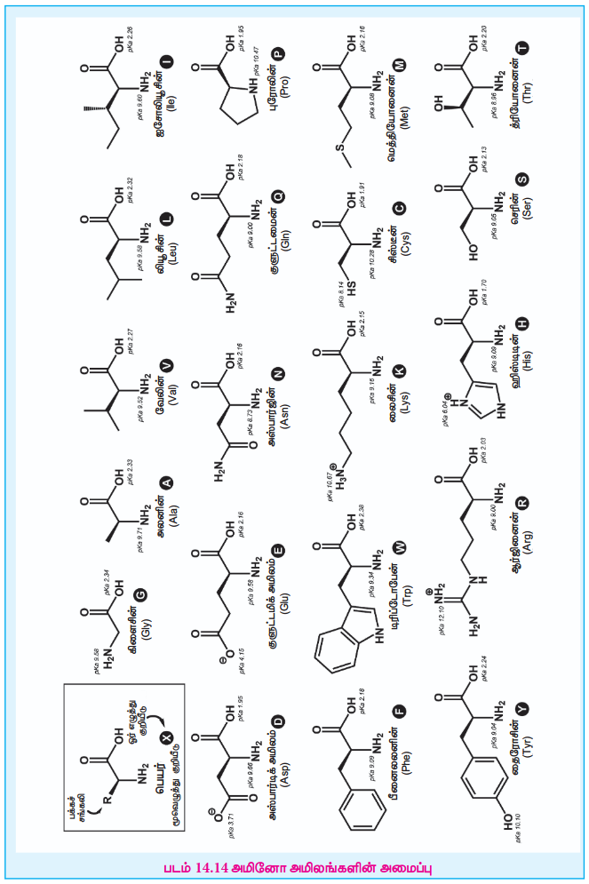
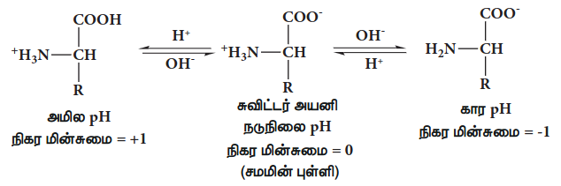
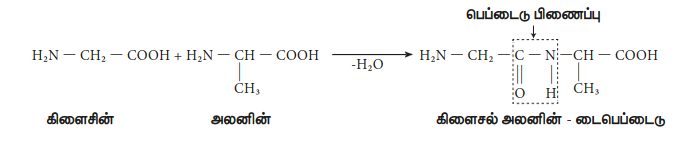
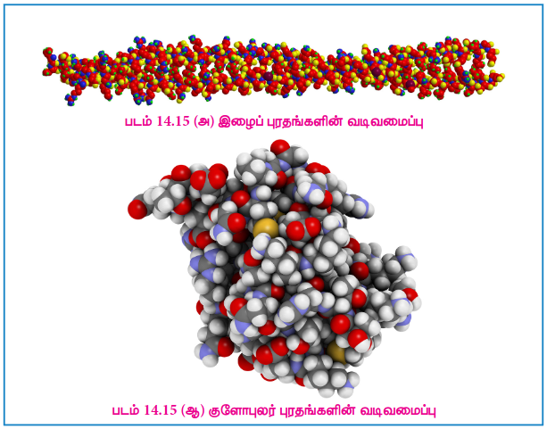
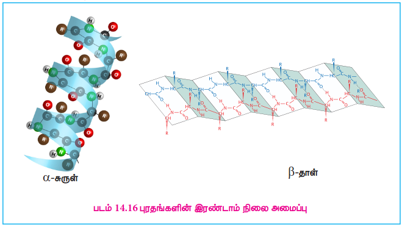
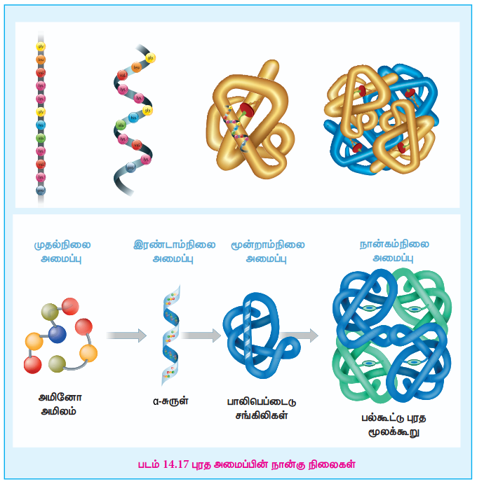
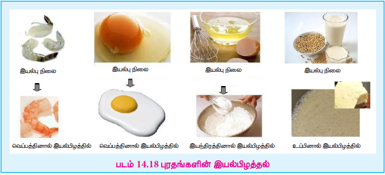
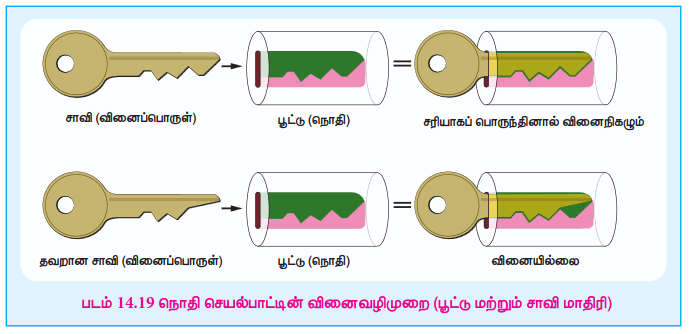

## 14.2 புரதங்கள்

புரதங்கள் என்பவை அனைத்து உயிரினங்களிலும் மிக அதிகளவில் காணப்படும் உயிரியல் மூலக்கூறுகளாகும். புரதம் எனும் சொல்லானது ‘Proteious’ எனும் கிரேக்க சொல்லிலிருந்து வருவிக்கப்பட்டது. இதன் பொருள் ”முதன்மையான அல்லது முதல் இடத்துள்ள” என்பதாகும். அவை உயிரினங்களின் முக்கியமான செயல்பாட்டு அலகுகளாகும். புரதங்கள், சுவாசித்தல் உள்ளிட்ட செல்லின் அனைத்து செயல்பாடுகளிலும் பங்கு கொள்கின்றன. மேலும் இவை α-அமினோ அமிலங்களின் பலபடிகளாகும்.

### 14.2.1 அமினோ அமிலங்கள்

அமினோ அமிலங்கள் என்பவை ஒரு அமினோ தொகுதியையும் ஒரு கார்பாக்ஸிலிக் அமில தொகுதியையும் கொண்டுள்ள கரிமச் சேர்மங்களாகும். புரத மூலக்கூறுகளானவை α- அமினோ அமிலங்களால் ஆக்கப்பட்டுள்ளன. அவை பின்வரும் பொது வாய்ப்பாட்டால் குறிக்கப்படுகின்றன.

$$
\begin{array}{ccc}
& \mathrm{H} & \\
& \vert & \\
\mathrm{R{-}} & \mathrm{C^{*}} & \mathrm{{-}COOH} \\
& \vert & \\
& \mathrm{NH_2} &
\end{array}
$$

புரத மூலக்கூறுகளில், பொதுவாக 20 வெவ்வேறு α-அமினோ அமிலங்கள் காணப்படுகின்றன. ஒவ்வொரு அமினோ அமிலத்திற்கும் ஒரு பொதுப் பெயரும், ஒரு மூவழுத்துக் குறியீடு மற்றும் ஒரெழுத்து குறியீடு ஆகியன வழங்கப்பட்டுள்ளன. ஒரு புரதத்திலுள்ள அமினோ அமில வரிசையை எழுதும்போது பொதுவாக ஒரெழுத்து அல்லது மூவழுத்துக் குறியீடுகள் பயன்படுத்தப்படுகின்றன.

### 14.2.2 α-அமினோ அமிலங்களின் வகைப்பாடு

அமினோ அமிலங்கள் அவற்றிலுள்ள பக்கச் சங்கிலிகள் என பொதுவாக அழைக்கப்படும் R தொகுதிகளின் இயல்பினைப் பொறுத்து வகைப்படுத்தப்படுகின்றன. அவைகள் அமில, கார மற்றும் நடுநிலை அமினோ அமிலங்கள் என வகைப்படுத்தப்படுகின்றன. அவற்றை முனைவுள்ள மற்றும் முனைவற்ற (நீர்வெறுக்கும்) அமினோ அமிலங்கள் எனவும் வகைப்படுத்த முடியும்.

மனிதர்களில், அமினோ அமில தொகுக்கும் திறனைப் பொருத்து, அமினோ அமிலங்களை இன்றியமையாத மற்றும் இன்றியமையா அமினோ அமிலங்கள் எனவும் வகைப்படுத்த முடியும். மனிதர்களால் தொகுக்கப்படக்கூடியவை, இன்றியமையாத அமினோ அமிலங்கள் (Gly, Ala, Glu, Asp, Gln, Asn, Ser, Cys, Tyr & Pro) எனவும், உணவின் வழியாக மட்டுமே பெறப்பட வேண்டியவை, இன்றியமையா அமினோ அமிலங்கள் (Phe, Val, Thr, Trp, Ile, Met, His, Arg, Leu, & Lys). எனவும் அழைக்கப்படுகின்றன. இந்த 10 இன்றியமையா அமினோ அமிலங்களை (PVT TIM HALL) எனும் நினைவுக் குறிப்பின் மூலம் நினைவிற்கொள்ள முடியும். பெரும்பாலான தாவர மற்றும் விலங்கு புரதங்கள் , மேற்கூறிய 20 α- அமினோ அமிலங்களால் ஆக்கப்பட்ட போதிலும், மேலும் பல அமினோ அமிலங்கள் செல்களில் காணப்படுகின்றன. இந்த அமினோ அமிலங்கள் புரதமில்லா அமினோ அமிலங்கள் என்றழைக்கப்படுகின்றன. எடுத்துக்காட்டு: ஆர்னிதைன் மற்றும் சிட்ருலின் (அம்மோனியாவானது யூரியாவாக மாற்றமடையும் யூரியா சுழற்சியின் பகுதிக்கூறுகள்).

### 14.2.3 அமினோ அமிலங்களின் பண்புகள்

அமினோ அமிலங்கள் நிறமற்ற, நீரில் கரையும் படிக திண்மங்களாகும். அவைகள் கார்பாக்சில் மற்றும் அமினோ தொகுதி இரண்டையும் பெற்றிருப்பதால் சாதாரண அமீன்கள் மற்றும் கார்பாக்சிலிக் அமிலங்களிலிருந்து வேறுபடுகின்றன. கரைசலின் pH மதிப்பைச் சார்ந்து கார்பாக்சில் தொகுதி ஒரு புரோட்டானை இழந்து எதிரயனியாகவோ அல்லது அமினோ தொகுதி ஒரு புரோட்டானை ஏற்று நேரயனியாகவோ மாற இயலும். எந்த ஒரு குறிப்பிட்ட pH மதிப்பில், ஒரு அமினோ அமிலத்தின் நிகர மின்சுமை நடுநிலையாக உள்ளதோ அது சமமின் புள்ளி என்றழைக்கப்படுகிறது. சமமின் புள்ளியை விட அதிகமான pH மதிப்புடைய கரைசலில் அமினோ அமிலமானது எதிர்மின்சுமையை கொண்டிருக்கும், சமமின் புள்ளியை விட குறைவான pH மதிப்புடைய கரைசலில் நேர்மின்சுமையை கொண்டிருக்கும். நீர்க் கரைசலில் ஒரு அமினோ அமிலத்தின் கார்பாக்சில் தொகுதியிலுள்ள புரோட்டானை அமினோ தொகுதிக்கு மாற்ற இயலும். இதனால் இந்த இரண்டு தொகுதிகளும் எதிரெதிர் மின்சுமைகளை பெறுகின்றன. நேர் மற்றும் எதிர் என இரண்டு மின்சுமைகளையும் கொண்டிருப்பதால் மூலக்கூறு நடுநிலைத் தன்மை கொண்டது மேலும் இது ஈரியல்பு தன்மை கொண்டுள்ளது. இந்த அயனிகள் சுவிட்டர் அயனிகள் என்றழைக்கப்படுகின்றன.

கிளைசீனைத் தவிர மற்ற அனைத்து அமினோ அமிலங்களும் குறைந்தபட்சம் ஒரு சீர்மையற்ற கார்பன் அணுவைக் கொண்டுள்ளன, எனவே அவைகள் ஒளிசுழற்றும் தன்மையை பெற்றுள்ளன. அவைகள், D மற்றும் L அமினோ அமிலங்கள் எனும் இரண்டு வெவ்வேறு வடிவங்களில் காணப்படுகின்றன. எனினும், உயிரினங்களால் L-அமினோ அமிலங்கள் புரதத் தொகுப்பிற்காக முதன்மையாக பயன்படுத்தப்படுகின்றன. D-அமினோ அமிலங்கள் சில உயிரினங்களில் அரிதாக காணப்படுகின்றன.

### 14.2.4 பெப்டைடு பிணைப்பு உருவாதல்:

அமினோ அமிலங்கள் பெப்டைடு பிணைப்புகளால் சகப்பிணைக்கப்பட்டுள்ளன. முதல் அமினோ அமிலத்தின் கார்பாக்சில் தொகுதியானது இரண்டாம் அமினோ அமிலத்தின் அமினோ தொகுதியுடன் வினைப்பட்டு, அமினோ அமிலங்களுக்கிடையே அமைடு பிணைப்பு உருவாகிறது. இந்த அமைடு பிணைப்பானது பெப்டைடு பிணைப்பு என்றழைக்கப்படுகிறது. இதன் காரணமாக இறுதியில் கிடைக்கப்பெறும் சேர்மமானது டைபெப்டைடு என்றழைக்கப்படுகிறது. இந்த டைபெப்டைடுடன் மற்றொரு அமினோ அமிலம் இரண்டாம் பெப்டைடு பிணைப்பின் மூலம் இணையும்போது ட்ரைபெப்டைடு உருவாகிறது. இதே போல டெட்ரா பெப்டைடு, பென்டா பெப்டைடு போன்றவற்றை நம்மால் உருவாக்க முடியும். அதிக எண்ணிக்கையிலான அமினோ அமிலங்கள் இதே முறையில் ஒன்றிணையும்போது பாலிபெப்டைடு பெறப்படுகிறது. இதில் இணைந்துள்ள அமினோ அமிலங்களின் எண்ணிக்கை குறைவாக இருந்தால் பாலிபெப்டைடுகள் எனவும், அமினோ அமிலங்களின் எண்ணிக்கை அதிகமாக இருந்தால் புரதம் ( செயல்திறன் கொண்ட மூலக்கூறுகள்) எனவும் அழைக்கப்படுகிறது.

ஒரு பெப்டைடின் அமினோ முனையானது N-முனை என அறியப்படுகிறது, அதே சமயம் கார்பாக்ஸி முனையானது C-முனை என்றழைக்கப்படுகிறது. பொதுவாக புரத தொடர் வரிசையானது N-முனையில் தொடங்கி C-முனைக்கு எழுதப்படுகிறது. பக்கச் சங்கிலிகள் (R-தொகுதிகள்) தவிர்த்து மற்ற அணுக்கள் முதன்மைச் சங்கிலி அல்லது பாலி பெப்டைடின் முதுகெலும்பு என்றழைக்கப்படுகிறது.

### 14.2.5 புரதங்களின் வகைப்பாடு:

புரதங்கள் அவற்றின் அமைப்பைப் பொருத்து இரண்டு பெரும் பிரிவுகளாக வகைப்படுத்தப்படுகின்றன. அவையாவன இழைப் புரதங்கள் மற்றும் குளோபுலர் புரதங்கள்.

**இழைப் புரதங்கள்**

இழைப் புரதங்கள் இழைகளைப் போன்ற நேர்க்கோட்டு அமைப்பை பெற்றுள்ளன. இவை பொதுவாக நீரில் கரைவதில்லை மேலும் டைசல்பைடு இணைப்புகள் மற்றும் வலிமை குறைந்த மூலக்கூறுகளுக்கிடைப்பட்ட ஹைட்ரஜன் பிணைப்புகள் ஆகியவற்றால் ஒன்றாக இருத்தி வைக்கப்பட்டுள்ளன. இவ்வகைப் புரதங்கள் அநேக நேரங்களில் அமைப்பு புரதங்களாக பயன்படுத்தப்படுகின்றன. எடுத்துக்காட்டு: கெராடின், கொலாஜன் போன்றவை.

**குளோபுலர் புரதங்கள்**

குளோபுலர் புரதங்கள் கோளவடிவ அமைப்பைப் பெற்றுள்ளன. பாலிபெப்டைடு சங்கிலியானது கோளவடிவில் மடிந்துள்ளது. இவ்வகைப் புரதங்கள் பொதுவாக நீரில் கரையும் தன்மை கொண்டவை. மேலும் வினையூக்கம் உள்ளடக்கிய பல்வேறு செயல்பாடுகளை கொண்டுள்ளன. எடுத்துக்காட்டு: நொதிகள், மையோகுளோபின், இன்சுலின் போன்றவை.

### 14.2.6 புரதங்களின் அமைப்பு

புரதங்கள் என்பவை அமினோ அமிலங்களின் பலபடிகளாகும். அவற்றின் முப்பரிமான அமைப்பானது அவற்றிலுள்ள அமினோ அமிலங்களின் வரிசையை சார்ந்து அமைகிறது. புரதங்களின் அமைப்பானது முதல்நிலை, இரண்டாம் நிலை, மூன்றாம் நிலை மற்றும் நான்காம் நிலை என நான்கு படிநிலைகளில் விளக்கப்படுகிறது. ( படம் 14.17)

**1. புரதங்களின் முதல்நிலை அமைப்பு:**

புரதங்கள் என்பவை பெப்டைடு பிணைப்புகளால் பிணைக்கப்பட்டுள்ள அமினோ அமிலங்களால் ஆன பாலிபெப்டைடு சங்கிலியில் அமினோ அமிலங்களின் அமைவிட வரிசையானது, புரதங்களின் முதல்நிலை அமைப்பு என்றழைக்கப்படுகிறது. இந்த வரிசையில் ஏற்படும் ஒரு சிறிய மாற்றம் கூட புரதத்தின் ஒட்டுமொத்த அமைப்பு மற்றும் செயல்பாட்டை மாற்றும் திறனைக் கொண்டிருப்பதால் இதைப் பற்றிய புரிதல் மிக அவசியமானது.

**2. புரதங்களின் இரண்டாம் நிலை அமைப்பு:**

ஒரு பாலிபெப்டைடு சங்கிலியிலுள்ள அமினோ அமிலங்கள், கார்பனைல் ஆக்ஸிஜனுக்கும் (\( -C=O \)) அருகாமையிலுள்ள அமீன் ஹைட்ரஜனுக்கும் (\( -NH \)) இடையே ஹைட்ரஜன் பிணைப்பை உருவாக்குவதன் காரணமாக அதியொழுங்கான அமைப்புகளை உருவாக்குகின்றன. α-சுருள் மற்றும் β-இழைகள் அல்லது தாள்கள் ஆகியன புரதங்களால் உருவாக்கப்படும் இரண்டு மிக முக்கியமான துணை அமைப்புகளாகும்.

**α-சுருள்**

α-சுருள் துணை அமைப்பில், அமினோ அமிலங்கள் வலப்பக்கச் சுருள் அமைப்பில் அமைக்கப்பட்டுள்ளன, மேலும் இவை ஒரு அமினோ அமிலத்திலுள்ள ( \( n^{th} \) பகுதிக்கூறு) கார்பனைல் தொகுதி ஆக்ஸிஜனுக்கும் ஐந்தாவது அமினோ அமில (\( n+4^{th} \) பகுதிக்கூறு) அமினோ ஹைட்ரஜனுக்கும் இடையே உருவாகும் ஹைட்ரஜன் பிணைப்புகளால் நிலைப்படுத்தப்படுகின்றன. அமினோ அமிலங்களின் பக்கச் சங்கிலிகள் சுருளின் வெளிப்பக்கமாக நீட்டிக்கொண்டுள்ளன. α-சுருள் அமைப்பின் ஒவ்வொரு சுற்றிலும் ஏறத்தாழ 3.6 அமினோ அமில கூறுகள் உள்ளன, மேலும் இதன் நீளம் ஏறத்தாழ 5.4 Å ஆகும். புரோலின் எனும் அமினோ அமிலம் சுருள் அமைப்பில் ஒரு இடைமுறிவை உருவாக்குகிறது. மேலும், இறுக்கமான வளைய அமைப்பின் காரணமாக இது சுருள் பிரிப்பான் என்றழைக்கப்படுகிறது.

**β-தாள்கள்**

சுருள்களாக இல்லாமல் β-தாள்கள் பரப்பப்பட்ட பெப்டைடு சங்கிலிகளாக உள்ளன. ஒரு இழையின் மற்றுமொரு சங்கிலியிலுள்ள கார்பனைல் தொகுதிக்கும், அருகில் உள்ள இழையான மற்றுமொரு சங்கிலியிலுள்ள அமீனோ தொகுதிக்கும் இடையே ஹைட்ரஜன் பிணைப்புகள் உருவாவதால் தாள் போன்ற அமைப்பு உருவாகிறது. இந்த அமைப்பானது β-தாள் அமைப்பு என்றழைக்கப்படுகிறது.

**3. மூன்றாம் நிலை அமைப்பு:**

இரண்டாம் நிலை அமைப்பின் கூறுகள் (α-சுருள் & β-தாள்) மேலும் மடிந்து மூன்றாம் நிலை அமைப்பை உருவாக்குகின்றன. இந்த அமைப்பானது பாலிபெப்டைடின் (புரதம்) மூன்றாம் நிலை அமைப்பு எனப்படுகிறது. அமினோ அமிலங்களின் பக்கச் சங்கிலிகளுக்கிடையே நிகழும் இடையீடுகளால் புரதங்களின் மூன்றாம் நிலை அமைப்பு நிலைப்படுத்தப்படுகிறது. இவ்வகை இடையீடுகளில், சிஸ்டின் அலகுகளுக்கிடையே உருவாகும் டைசல்பைடு பிணைப்புகள், நிலைமின்னியல், நீர்வெறுக்கும் தன்மை, ஹைட்ரஜன் பிணைப்புகள் மற்றும் வான்டர் வால்ஸ் இடையீடுகள் ஆகியன அடங்கும்.

**4. நான்காம் நிலை அமைப்பு**

சில புரதங்கள் ஒன்றுக்கும் மேற்பட்ட பாலிபெப்டைடு சங்கிலிகளால் ஆக்கப்பட்டுள்ளன. எடுத்துக்காட்டாக, ஆக்ஸிஜன் கடத்து புரதமான ஹீமோகுளோபின் ஆனது நான்கு பாலிபெப்டைடு சங்கிலிகளைக் கொண்டுள்ளது. அதே சமயம், DNA மூலக்கூறை பிரதி எடுக்கும் DNA பாலிமரேஸ் எனும் நொதி, பத்து பாலிபெப்டைடு சங்கிலிகளைக் கொண்டுள்ளது. இந்த புரதங்களில் ஒவ்வொரு தனி பாலிபெப்டைடு சங்கிலியும் (துணை அலகுகள்) மற்ற சங்கிலிகளுடன் இடையீடு செய்வதால் நான்காம் நிலை அமைப்பு எனும் பல்கூட்டு அமைப்பானது பெறப்படுகிறது. மூன்றாம் நிலை அமைப்பை நிலைப்படுத்தும் அதே இடையீடுகள் நான்காம் நிலை அமைப்பையும் நிலைப்படுத்துகின்றன.

### 14.2.7 புரதங்களின் இயல்பிழத்தல்

ஒவ்வொரு புரதமும், தனிச்சிறப்பு வாய்ந்த முப்பரிமாண அமைப்பைக் கொண்டுள்ளது. இந்த முப்பரிமாண அமைப்புகள், டைசல்பைடு பிணைப்பு, ஹைட்ரஜன் பிணைப்பு, நீர்விலக்கு மற்றும் நிலைமின்னியல் இடையீடுகள் காணப்படுகின்றன. புரதங்களை உயர் வெப்பநிலைகளுக்கு உட்படுத்துவதோ, யூரியா போன்ற மாசுபொருட்களுடன் சேர்ப்பதோ, pH மற்றும் கரைசலின் அயனி வலிமையை மாற்றுவது போன்ற செயல்களால் இந்த இடையீடுகளை சிதைக்க முடியும். இவை முப்பரிமாண அமைப்பை பகுதியளவாக அல்லது முற்றிலுமாக இழக்கச் செய்கின்றன. ஒரு புரதம், அதன் முதல்நிலை அமைப்பு பாதிக்கப்படாமல், உயர்நிலை அமைப்பை மட்டும் இழக்கும் நிகழ்வு இயல்பிழத்தல் என்றழைக்கப்படுகிறது. ஒரு புரதத்தின் இயல்பிழத்தலின்போது அதன் உயிரியல் செயல்பாடுகளும் முற்றிலுமாக இழக்கப்படுகிறது.

முதல்நிலை அமைப்பானது நிலையாக இருப்பதால், சில புரதங்களின் இயல்பிழத்தலை மீண்டும் பழைய நிலைக்கு கொண்டுவர முடியும். தன்னிச்சையாகவோ அல்லது சேப்ரான்கள் என்றழைக்கப்படும் சிறப்புவகை நொதிகளின் (புரதங்கள் சரியாக மடிய உதவி புரியும் புரதங்கள்) உதவியுடனோ புரதங்கள் தங்களின் பழைய நிலையை அடைய முடியும்.

எடுத்துக்காட்டு: வெப்பத்தின் காரணமாக முட்டை வெண்கரு கெட்டிப்படுதல்.

### 14.2.8 புரதங்களின் முக்கியத்துவம் :

புரதங்கள் உயிரினங்களின் செயல்படு அலகுகளாகும். இவை அனைத்து உயிரியல் செயல்பாடுகளிலும் மிக முக்கிய பங்காற்றுகின்றன.

1.  உயிரினங்களில் நிகழும் அனைத்து உயிர்வேதி வினைகளும் நொதிகள் என்றழைக்கப்படும் வினைவேக மாற்ற புரதங்களால் வினையூக்கப்படுகின்றன.
2.  கெராட்டின், கொலாஜன் போன்ற புரதங்கள் கட்டமைப்பு அலகுகளாக செயல்படுகின்றன.
3.  மூலக்கூறுகளை கடத்தவும் (ஹீமோகுளோபின்), செல் உள்ளுறுப்புகளாகவும், செல்களுக்குள்ளும் வெளியேயும் மூலக்கூறுகளின் இயக்கத்தை கட்டுப்படுத்தவும் (இடமாற்றிகள்) புரதங்கள் பயன்படுகின்றன.
4.  பல்வேறு நோய்களுக்கு எதிராக செயல்புரிய உடலுக்கு எதிர்ப்பொருளாக உதவுகின்றன.
5.  புரதங்கள், பல்வேறு செயல்பாடுகளை ஒன்றிணைக்கும் தகவலளர்களாக பயன்படுகின்றன. இன்சுலின் மற்றும் குளுககான் ஆகியன இரத்தத்தில் சர்க்கரையின் அளவை கட்டுப்படுத்துகின்றன.
6.  சில சமிக்ஞை மூலக்கூறுகளை கண்டறியவும், சரியான துலங்களை தூண்டுவதற்காகவும் புரதங்கள் உணர்வேற்பிகளாக செயல்படுகின்றன.
7.  இரும்பு (ஃபெர்ரிடின்) போன்ற உலோகங்களை சேமிக்கவும் புரதங்கள் பயன்படுகின்றன.

### 14.2.9 நொதிகள்:

நமது உடலில் உள்ள செல்களில் பல்வேறு உயிர்வேதி வினைகள் நிகழ்கின்றன. உணவு செரிக்கப்பட்டு அதிலிருந்து ஆற்றல் பெறப்படுதல், பல்வேறு செல் செயல்பாடுகளுக்கு தேவையான மூலக்கூறுகளை தொகுத்தல், ஆகியன சிறந்த எடுத்துக்காட்டுகளாகும். இவ்வினைகள் அனைத்தும் இயல்பு நிலையில் நொதிகள் எனும் சிறப்பு வகை புரதங்களால் வினையூக்கம் பெறுகின்றன. இந்த உயிர்வேதி வினையூக்கிகள் வினைகளின் வேகத்தை \( 10^{12} \) மடங்குகள் அளவிற்கு வேகப்படுத்துகின்றன. மேலும், இவை அதிதேர்ந்த செயலாற்றும் தன்மையை கொண்டவைகளாக உள்ளன. அதிதேர்ந்த செயலாற்றும் தன்மையின் காரணமாக பெரும்பாலான வினைகள் செல்லுக்குள்ளேயே நிகழ அனுமதிக்கப்படுகின்றன. எடுத்துக்காட்டாக, கார்பானிக் அமிலமானது நீர் மற்றும் கார்பன் டை ஆக்சைடாக மாற்றமடையும் வினைக்கு கார்பானிக் அன்ஹைட்ரேஸ் எனும் நொதி, வினையூக்கியாக பயன்படுகிறது. சுக்ரோஸ் நீராற்பகுப்படைந்து ஃபிரக்டோஸ் மற்றும் குளுக்கோஸ் ஆகியவற்றை உருவாக்கும் வினைக்கு சுக்ரேஸ் எனும் நொதி, வினையூக்கியாக செயல்படுகிறது. லாக்டேஸ் எனும் நொதி லாக்டோஸை நீராற்பகுத்து அதன் உட்கூறுகளான குளுக்கோஸ் மற்றும் காலக்டோஸ் ஆகிய மோனோ சாக்கரைடுகளை உருவாக்குகின்றன.

### 14.2.10 நொதி செயல்பாட்டின் வினைவழிமுறை:

நொதிகள் என்பவை உயிர் வினையூக்கிகளாகும், இவை ஒரு குறிப்பிட்ட உயிர்வேதி வினைக்கு தேர்ந்தே செயலாற்றுகின்றன. பொதுவாக இவை இடைநிலையை நிலைப்படுத்துவதன் விளைவாக கிளர்வுக் கூறு ஆற்றலைக் குறைத்து வினையை ஊக்குவிக்கின்றன. ஒரு குறிப்பிட்ட வினையில் நொதி E ஆனது வினைப்பொருளுடன் மீள்முறையில் பிணைந்து நொதி-வினைப்பொருள் அணைவை உருவாக்குகிறது. அதன் பின்னர் வினைப்பொருளானது விளைபொருளாக மாற்றப்பட்டு நொதி தனித்த நிலையில் வெளியேறுகிறது. இந்த தனித்த நொதியானது மற்றொரு வினைப்பொருளுடன் பிணைவதற்கு தயாரான நிலையில் உள்ளது. மிகத் தெளிவான வினைவழிமுறையானது அலகு XI திடப்பொருள் வேதியியலில் விளக்கப்பட்டுள்ளது.

$$
\begin{array}{ccccc}
\mathrm{E} & + & \mathrm{S} & \rightleftharpoons & \mathrm{[ES]} \\[2pt]
\scriptstyle\text{நொதி} &&
\scriptstyle\text{வினைபொருள்} &&
\scriptstyle\text{நொதி - வினைபொருள் அணைவு}
\end{array}
$$

$$
\mathrm{[ES]} \rightarrow \mathrm{E+P}
$$

