# கார்பனைல் சேர்மங்களும் கார்பாக்சிலிக் அமிலங்களும் 12

**அடால்ப் வான் பேயர்**

அடால்ப் வான் பேயர் என்பார் ஜெர்மன் நாட்டினைச் சேர்ந்த வேதியியல் ஆராய்ச்சி அறிஞர். இவர் 1880 ம் ஆண்டு இன்டிகோ சாயத்தினை தொகுத்து 1983 ல் அதன் வடிவ வாய்ப்பாட்டினையும் அளித்தார். இவர் வேதியியல் ஆராய்ச்சிக்கான நோபல் பரிசினை 1905ஆம் ஆண்டு பெற்றார். தாலீன்கள் நிறமிகள் யூரிக் அமில வழிப்பொருட்கள் பாலி அசிட்டிலின்கள் மற்றும் ஆக்சோனியம் உப்புகள் ஆகியவை இவரின் அரிய கண்டறிதல்கள் ஆகும். பார்பிட்டியுரேட்கள் என அறியப்படும் மனோவசிய மருந்துகளின் மூலமான பார்பிட்யூரிக் அமிலத்தினை இவர் யூரிக் அமிலத்திலிருந்து ஒரு வழிப்பொருளாக கண்டறிந்து அளித்தார்.

**கற்றலின் நோக்கங்கள்**

இப்பாடப்பகுதியை கற்றறிந்த பின்
மாணவர்கள்,

- கார்பனைல் சேர்மங்களை தயாரிக்கும் முக்கிய முறைகளையும், அவைகளின் வேதிவினைகளையும் விவரித்தல்.
- கார்பனைல் சேர்மங்களின் கருக்கவர் பொருள் சேர்க்கை வினைகளின் வினைவழி முறைகளை விளக்குதல்.
- கார்பாசிலிக் அமிலங்கள் மற்றும் அவற்றின் பெறுதிகளின் தயாரித்தல் மற்றும் வேதிவினைகளை விவரித்தல்.
- ஆல்டிஹைடுகள், கீட்டோன்கள் மற்றும் கார்பாசிலிக் அமிலங்களின் பயன்களை பட்டியலிடுதல்.

## பாட அறிமுகம்:

தொகுதியை கொண்டுள்ள பல்வேறு கரிமச் சேர்மங்களை நாம் நமது அன்றாட வாழ்வில் கண்டுணர்ந்து வருகிறோம். தாவரங்கள் மற்றும் விலங்கினங்களில் காணப்படும் புரோட்டீன்கள், கார்போஹைட்ரேட்டுகள் போன்ற உயிர் மூலக்கூறுகள் கார்பனைல் தொகுதியைக் கொண்டுள்ளன. எடுத்துக்காட்டாக, பிரிடாக்சால் என்பது விட்டமின் B யிலிருந்து பெறப்படும் ஒரு ஆல்டிஹைடு ஆகும்.இது இணை நொதியாக செயல்படுகிறது. இழைகள், நெகிழிகள் மற்றும் மருந்துப் பொருட்களில் கார்பனைல் சேர்மங்கள் முக்கிய பகுதிப்பொருட்களாக காணப்படுகின்றன. எடுத்துக்காட்டாக பேக்கலைட் தயாரிப்பில் ஃபார்மால்டிஹைடு பயன்படுகிறது, காய்ச்சலை குறைக்க பயன்படுத்தப்படும் பாராசிட்டமால் (P-அசிட்டைலேற்றமடைந்த அமினோ பீனால்) கார்பனைல் தொகுதியைக் கொண்டுள்ளது. இப்பாடப்பகுதியில் நாம் ஆல்டிஹைடுகள், கீட்டோன்கள் மற்றும் கார்பாக்சிலிக் அமிலங்களின் பொதுவான தயாரித்தல் அவைகளின் பண்புகள் மற்றும் பயன்களை கற்றறிவோம்.

## 12.1 ஆல்டிஹைடுகள் மற்றும் கீட்டோன்களின் பெயரிடல்

நாம் ஏற்கனவே பதினோறாம் வகுப்பில் IUPAC முறையின் அடிப்படையில் கரிமச் சேர்மங்களுக்கு பெயரிடுதலை கற்றறிந்துள்ளோம். அவ்விதிமுறைகளை பயன்படுத்தி பின்வரும் கரிமச் சேர்மங்களுக்கு பெயரிடுவோம்.
| சேர்மம்   (பொதுப்பெயர், அமைப்பு வாய்ப்பாடு,   IUPAC பெயர்) | IUPAC பெயரிடுதல் | | | |
| :--- | :---: | :---: | :---: | :---: |
| | **இட அமைவு   எண்ணுடன்   முன்னொட்டு** | **மூல   வார்த்தை** | **முதன்மை   பின்னொட்டு** | **இரண்டாம்   நிலை   பின்னொட்டு** |
| பார்மால்டிஹைடு   $$ \text{H} - \text{CHO} $$   மெத்தனால் | - | மெத் | ஏன் | அல் |
| அசிட்டால்டிஹைடு   $$ \text{CH}_3 - \text{CHO} $$   எத்தனால் | - | எத் | ஏன் | அல் |
| அக்ரோலின்   $$ \text{CH}_2 = \text{CH} - \text{CHO} $$   புரப் - 2 - ஈனல் | - | புரப் | 2 - ஈன் | அல் |
| குரோட்டனால்டிஹைடு   $$ \text{CH}_3 - \text{CH} = \text{CH} - \text{CHO} $$   பியூட் - 2 - ஈனல் | - | பியூட் | 2 - ஈன் | அல் |
| கிளிசரால்டிஹைடு   $$ \begin{array}{c} \text{HO} - \text{CH}_2 - \text{CH} - \text{CHO} \\ \mid \\ \text{OH} \end{array} $$   2,3, - டை ஹைட்ராக்சி புரப்பனல் | 2,3 -   டைஹைட்ராக்சி | புரப் | அன் | அல் |
| பென்சால்டிஹைடு  பீனைல் மெத்தனால் | பீனைல் | மெத் | அன் | அல் |
| அசிட்டோன் / டைமெத்தில்   கீட்டோன்   $$ \text{CH}_3 - \text{CO} - \text{CH}_3 $$   புரப்பனோன் | - | புரப் | அன் | ஓன் |
| மெசிடைல் ஆக்சைடு   $$ (\text{CH}_3)_2\text{C} = \text{CHCOCH}_3 $$   4 - மெத்தில்பென்ட்-3-ஈன்-2-ஓன் | 4 - மெத்தில் | பென்ட் | 3 - ஈன் | 2-ஓன் |
| மெத்தில் பீனைல் கீட்டோன்   $$ \begin{array}{c} \text{C}_6\text{H}_5 - \text{C} - \text{CH}_3 \\ \parallel \\ \text{O} \end{array} $$   அசிட்டோபீனோன்   1 - பீனைல் எத்தன் - 1 - ஓன் | 1 - பீனைல் | எத் | அன் | 1 - ஓன் |
| டைபீனைல் கீட்டோன்   $$ \begin{array}{c} \text{C}_6\text{H}_5 - \text{C} - \text{C}_6\text{H}_5 \\ \parallel \\ \text{O} \end{array} $$   பென்சோபீனோன்   டைபீனைல் மீத்தனோன் | டைபீனைல் | மெத் | அன் | ஓன் |
| $$ \begin{array}{c} \text{O} \\ \parallel \\ \text{CH}_3 - \text{CH}_2 - \text{C} - \text{CH}_2 - \text{CHO} \end{array} $$   3- ஆக்சோபென்டனல் | 3 - ஆக்சோ | பென்ட் | அன் | அல் |
|   2-பார்மைல் பென்சாயிக் அமிலம் | 2-பார்மைல் | பென்சீ | - | ஆயிக்   அமிலம் |
|  3- மெத்தில் சைக்ளோபென்ட் - 2,4 -   டையீன் - 1 - ஓன் | 3 - மெத்தில் | சைக்ளோ   பென்ட் | 2,4 - டையீன் | 1 - ஓன் |

>**தன் மதிப்பீடு**
>
>i) பின்வரும் சேர்மங்களுக்கான IUPAC பெயரினை எழுதுக.
>
>   i) 
>   ii) $(\text{CH}_3)_2\text{C}=\text{CHCOCH}_3$
 >  
>   iii) 
>  iv) $(\text{CH}_3)_2\text{C}(\text{OH})\text{CH}_2\text{CHO}$
>
>ii) C₅H₁₀O என்ற மூலக்கூறு வாய்ப்பாட்டினால் குறிப்பிடப்படும் கீட்டோன்களுக்கு சாத்தியமான அனைத்து வடிவ மாற்றியங்கள் மற்றும் இடமாற்றியங்களை எழுதுக.

## 12.2 கார்பனைல் குழுவின் அமைப்பு

கார்பனைல் கார்பனானது   \( sp^2 \) இனக்கலப்படைந்த நிலையில் காணப்படுகிறது.  மேலும், கார்பன் – ஆக்சிஜன் பிணைப்பானது, ஆல்கீன்களின் கார்பன் – கார்பன் இரட்டைப் பிணைப்பை ஒத்துள்ளது. கார்பனைல் கார்பனானது மூன்று  \( sp^2 \) இனக்கலப்படைந்த ஆர்பிட்டால்களைப் பயன்படுத்தி மூன்று σ பிணைப்புகளை உருவாக்குகிறது. ஆல்டிஹைடுகளில்,ஆக்சிஜனுடன் ஒரு σ பிணைப்பும் மேலும் ஹைட்ரஜன் மற்றும் கார்பனுடன் தலா ஒரு σ பிணைப்பும் உருவாகிறது. கீட்டோன்களில் ஆக்சிஜனுடன் ஒரு σ பிணைப்பும் மேலும் கார்பன்களுடன் மற்ற இரு σ பிணைப்புகள் உருவாகின்றன. படம் 12.1 ல் காட்டியவாறு, மேற்குறிப்பிட்டுள்ள மூன்று σ
பிணைப்புகளும் ஒரே தளத்தில் அமைந்துள்ளன. கார்பனின் நான்காவது இணைத்திற எலக்ட்ரான் அதன் இனக்கலப்படையாத 2P ஆர்ப்பிட்டாலில் காணப்படுகிறது. இந்த ஆர்ப்பிட்டால் தளத்திற்கு செங்குத்தாக காணப்படுகிறது. மேலும், இது ஆக்சிஜனின் 2P ஆர்ப்பிட்டாலுடன் மேற்பொருந்தி ஒரு கார்பன் – ஆக்சிஜன் π உருவாக்குகிறது. ஆக்சிஜன் அணுவானது இரு பிணைப்பில் ஈடுபடா இரட்டை எலக்ட்ரான்களை கொண்டுள்ளது. இந்த எலக்ட்ரான்கள் அதன் மீதமுள்ள 2P ஆர்ப்பிட்டால்களின் இடம் பெறுகின்றன. இரண்டாவது அதிக எலக்ட்ரான் கவர் தன்மையுடைய தனிமமான ஆக்சிஜனானது, கார்பன் மற்றும் ஆக்சிஜனுக்கு இடையே பங்கிடப்பட்டுள்ள எலக்ட்ரான்களை தன்னை நோக்கி கவர்கிறது. எனவே, பிணைப்பானது முனைவு தன்மை பெறுகிறது. இம் முனைவு தன்மையானது ஆல்டிஹைடுகள் மற்றும் கீட்டோன்களில் வினைபுரியும் தன்மைக்கு காரணமாக அமைகின்றன.

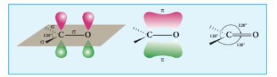

படம் 12.1 கார்பனைல் குழுவின் அமைப்பு

## 12.3 ஆல்டிஹைடுகள் மற்றும் கீட்டோன்களின் பொதுவான தயாரிப்பு முறைகள்

***I. ஆல்டிஹைடுகள் மற்றும் கீட்டோன்களை தயாரித்தல்**

**1. ஆல்கஹால்களின் ஆக்சிஜனேற்றம் மற்றும் வினைவேக மாற்றியால் ஹைட்ரஜன் நீக்கம்.**

ஆக்சிஜனேற்றத்தின் போது, ஓரிணைய ஆல்கஹால்கள் ஆல்டிஹைடுகளையும் ஈரிணைய ஆல்கஹால்கள் கீட்டோன்களையும் தருகின்றன என நாம் ஏற்கனவே கற்றறிந்தோம். அமிலம் கலந்த \( Na_2Cr_2O_7 \), \( KMnO_4 \), PCC போன்ற ஆக்சிஜனேற்றிகள் ஆக்சிஜனேற்றத்திற்கு பயன்படுத்தப்படுகின்றன. PCC யை ஆக்சிஜனேற்றியாக பயன்படுத்தும்போது ஆல்டிஹைடுகள் உருவாகின்றன. பிற ஆக்சிஜனேற்றிகள் உருவாகும் ஆல்டிஹைடுகள் / கீட்டோன்களை மேலும் ஆக்சிஜனேற்றமடையச் செய்து கார்பாக்சிலிக் அமிலங்களை தருகின்றன (அலகு எண் 11  ஆல்கஹால்களின் ஆக்சிஜனேற்றம் - காண்க).

 \( Cu \), \( Ag \) போன்ற உலோக வினையூக்கிகளின் வழியே ஆல்கஹால்களின் ஆவியினை
செலுத்தும் போது அவைகள் ஆல்டிஹைடுகள் மற்றும் கீட்டோன்களை தருகின்றன. (அலகு எண் 11
ஆலகஹால்களின் வினைவேக மாற்றியால் ஹைட்ரஜன் நீக்கம் – காண்க).

**2. ஆல்க்கீன்களின் ஓசோனாற்பகுப்பு**

ஆல்கீன்களின் ஒடுக்க ஓசோன் பகுப்பினால் ஆல்டிஹைடுகள் மற்றும் கீட்டோன்கள் உருவாகுகின்றன என நாம் ஏற்கனவே பதினோராம் வகுப்பில் கற்றறிந்துள்ளோம்.

ஆல்கீன்கள் ஓசோனுடன் வினைபுரிந்து ஓசோனைடுகளைத் தருகின்றன. இவைகள் தொடர்ந்து துத்தநாகம் மற்றும் நீரால் பிளவிற்கு உட்பட்டு ஆல்டிஹைடுகள் மற்றும் (அல்லது) கீட்டோன்களை தருகின்றன. துத்தநாக தூளானது உருவாகும் \( H_2O_2 \) வை நீக்குகிறது. இவ்வாறு நீக்கப்படாவிடில் உருவாகும் ஆல்டிஹைடுகள் / கீட்டோன்கள் மேலும் ஆக்சிஜனேற்றமடையும்.

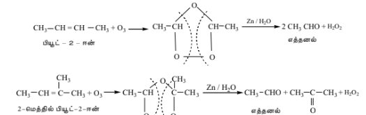

இவ்வினையில், முனைய ஒலிஃபீன்கள் (terminal olefins) ஃபார்மால்டிஹைடை ஒரு விளை
பொருளாக தருகின்றன.

>**தன் மதிப்பீடு**
>
>பின்வரும் ஆல்க்கீன்கள் ஒடுக்கும் ஓசோனாற்பகுப்புக்கு உட்படுத்தப்படும்போது என்ன நடக்கும்?
>
>1) புரோப்பீன்
>2) 1-பியூட்டீன்
>3) ஐசோபியூட்டிலீன்

**3. ஆல்க்கைன்களின் நீரேற்றம்**

\( 40\% \) நீர்த்த கந்தக அமிலம் மற்றும் \( 1\% \) \( HgSO_4 \) முன்னிலையில் ஆல்கைன்கள் நீரேற்றத்திற்கு
உட்பட்டு ஆல்டிஹைடுகள் / கீட்டோன்களை தருகின்றன என நாம் ஏற்கனவே பதினோராம் வகுப்பில்
கற்றறிந்தோம்.

**அ. அசிட்டிலீன் நீரேற்றத்திற்கு உட்பட்டு அசிட்டால்டிஹைடைத் தருகிறது.**

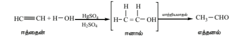

**ஆ. அசிட்டிலீனைத் தவிர்த்த பிற ஆல்கைன்கள் நீரேற்றமடைந்து கீட்டோன்களை தருகின்றன.**
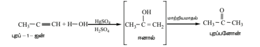

**4.கார்பாக்சிலிக் அமிலங்களின் கால்சியம் உப்புகளிலிருந்து பெறுதல்**

கார்பாக்சிலிக் அமிலங்களின் கால்சியம் உப்புகளை உலர் காய்ச்சி வடித்தலின் மூலம் ஆல்டிஹைடுகள் மற்றும் கீட்டோன்களைத் தயாரிக்கலாம்.

அ. கார்பாக்சிலிக் அமிலங்களின் கால்சியம் உப்புகள் மற்றும் கால்சியம் ஃபார்மேட் கலவையை உலர் காய்ச்சி வடிக்கும் போது ஆல்டிஹைடுகள் உருவாகின்றன.

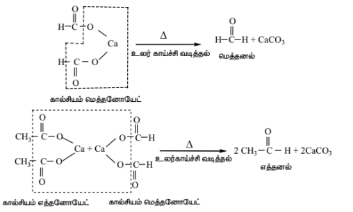

ஆ. ஃபார்மிக் அமிலத்தை தவிர்த்த பிற கார்பாக்சிலிக் அமிலங்களின் கால்சியம் உப்புகளை உலர் காய்ச்சி வடிக்கும் போது சீர்மையுள்ள கீட்டோன்கள் உருவாகின்றன.றலாம்.

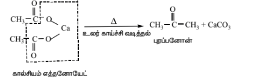

**ஆ. ஆல்டிஹைடுகளை தயாரித்தல்**

**1) ரோசன்மன்ட் ஒடுக்க வினை**

அ) அமில குளோரைடுகளை, பேரியம் சல்பேட் கொண்ட பெலேடியம் வினையூக்கி முன்னிலையில்  ஹைட்ரஜனேற்றமடையச் செய்து ஆல்டிஹைடுகளை தயாரிக்கலாம். இவ்வினை ரோசன்மன்ட் ஒடுக்க வினை எனப்படும். 

>**எடுத்துக்காட்டு**
>
>$$\begin{array}{ccc}\text{O} & & \text{O} \\ \parallel & & \parallel \\ \text{CH}_3 - \text{C} - \text{Cl} + \text{H}_2 & \xrightarrow{\text{Pd/ BaSO}_4} & \text{CH}_3 - \text{C} - \text{H} + \text{HCl} \\ \text{\small அசிட்டைல் குளோரைடு} & & \text{\small அசிட்டால்டிஹைடு} \end{array} $$
>
>இவ்வினையில் பெலேடியம் வினைவேக மாற்றிக்கு நச்சாக பேரியம் சல்பேட் செயல்படுகிறது. எனவே உருவாகும் ஆல்டிஹைடானது மேலும் ஒடுக்கமடைந்து ஆல்கஹாலாக மாற்றப்படுவது தடுக்கப்படுகிறது. ஃபார்மால்டிஹைடையும் கீட்டோன்களை இம்முறையினைப் பயன்படுத்தி தயாரிக்க இயலாது.

**2. ஸ்டீஃபனின் வினை**

ஆல்கைல் சயனைடுகளை, \( SnCl_2/HCl \) பயன்படுத்தி ஒடுக்கமடையச் செய்யும் போது இமீன்கள்உருவாகின்றன. இவைகள் நீராற்பகுப்படைந்து ஆல்டிஹைடுகளைத் தருகின்றன.

\[
CH_3-C\equiv N \xrightarrow[{(H)}]{SnCl_2/HCl} CH_3-CH=NH \xrightarrow{H_3O^+} CH_3-CHO + NH_3
\]

**3) சயனைடுகளின் தேர்ந்த ஒடுக்க வினை**

டைஐசோபியூட்டைல் அலுமினியம் ஹைட்ரைடானது ஆல்கைல் சயனைடுகளை ஒடுக்கமடையச் செய்து இமீன்களை உருவாக்குகிறது. இவைகள் நீராற்பகுப்படைந்து ஆல்டிஹைடுகளைத் தருகின்றன.

>**எடுத்துக்காட்டு**
>
>$$ \begin{array}{ccc} \text{CH}_3-\text{CH}=\text{CH}-\text{CH}_2-\text{CH}_2-\text{CN} & \xrightarrow[\text{ii) H}_2\text{O}]{\text{i) AlH(ஐசோபியூட்டைல்)}_2} & \text{CH}_3-\text{CH}=\text{CH}-\text{CH}_2-\text{CH}_2-\text{CHO} \\ \text{\small ஹெக்ஸ் - 4 - ஈன்னைட்ரில்} & & \text{\small ஹெக்ஸ் - 4- ஈனல்} \end{array} $$

**இ. பென்சால்டிஹைடு தயாரித்தல்**

 **1. டொலுவீன் மற்றும் அதன் பெறுதிகளை,** \( KMnO_4 \) போன்ற வலிமையான ஆக்சிஜனேற்றிகளைக் கொண்டு ஆக்சிஜனேற்றமடையச் செய்யும் போது பக்க சங்கிலி ஆக்சிஜனேற்றமடைந்து பென்சாயிக் அமிலத்தைத் தருகிறது.

குரோமைல் குளோரைடை ஆக்சிஜனேற்றியாக பயன்படுத்தும்போது டொலுவீன், பென்சால்டிஹைடைத் தருகிறது. இவ்வினை எடார்ட் வினை என்று அழைக்கப்படுகிறது. இவ்வினையில் அசிட்டிக் அமில நீரிலி மற்றும் \( CrO_3 \) யையும் பயன்படுத்தலாம்.

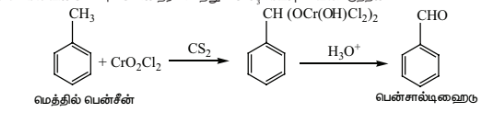
டொலுவீனை குரோமிக் ஆக்சைடைக் கொண்டு ஆக்சிஜனேற்றமடையச் செய்யும் போது பென்சிலிடின் டை அசிட்டேட் உருவாகிறது. இது நீராற்பகுப்படைந்து பென்சால்டிஹைடைத் தருகிறது.

**2) கட்டர்மேன் - கோக் வினை**

இவ்வினை பிரீடல் – கிராஃப்ட் அசைலேற்ற வினையை ஒத்த ஒரு வினையாகும். இம்முறையில்,CO மற்றும் HCl வினைபுரிந்து பார்மைல் குளோரைடை ஒத்த ஒரு வினை இடை நிலையைத் தருகிறது.

#### 3) டோலுயீனிலிருந்து பென்ஸால்டிஹைட்டின் தயாரிப்பு

டொலுவீனின் பக்க சங்கிலி குளோரினேற்றத்தால் பென்சால் குளோரைடு உருவாகிறது இது நீராற்பகுப்படைந்து பென்சால்டிஹைடைத் தருகிறது.

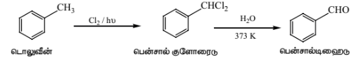

வணிகரீதியில் பென்சால்டிஹைடை பெருமளவில் தயாரிக்க இம்முறை பயன்படுகிறது.

**ஈ. கீட்டோன்களைத் தயாரித்தல்**
**1) கீட்டோன்கள்**

அமில குளோரைடுகளை டை ஆல்கைல் காட்மியத்துடன் வினைபடுத்தும் போது கீட்டோன்கள் உருவாகின்றன.
>**எடுத்துக்காட்டு**
>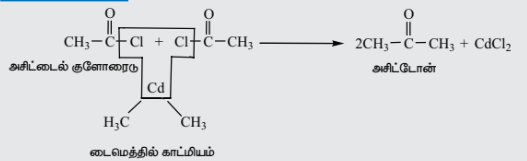

**2) ஃபீனைல் கீட்டோன்களைத் தயாரித்தல்**

**ஃப்ரீடல் - கிராஃப்ட்ஸ் அசைலேற்றம்**

அல்கைல் அரைல் கீட்டோன்கள் அல்லது டைஅரைல் கீட்டோன்களைத் தயாரிக்க இம்முறையே சிறந்த முறையாகும். பென்சீன் மற்றும் கிளர்வுறு தொகுதிகளைக் கொண்டுள்ள பென்சீனின் பெறுதிகளைக் கொண்டே இவ்வினை நிகழ்த்தப்படுகிறது.

>
>**எடுத்துக்காட்டு:**
>
>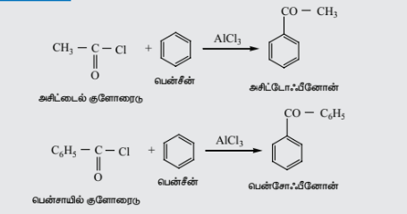

## 12.4 ஆல்டிஹைடுகள் மற்றும் கீட்டோன்களின் இயற்பண்புகள்

1. **இயற் நிலைமை:** அறை வெப்பநிலையில் ஃபார்மால்டிஹைடு வாயுவாகவும், அசிட்டால்டிஹைடு எளிதில் ஆவியாகும் திரவமாகவும் உள்ளது. 11 கார்பன் அணுக்கள் வரை கொண்ட மற்ற எல்லா ஆல்டிஹைடுகளும் கீட்டோன்களும் நிறமற்ற திரவங்களாகவும், உயர் கார்பன் எண்ணிக்கை கொண்டவை திண்மங்களாகவும் காணப்படுகின்றன.

2. **கொதி நிலைகள்:** ஓப்பிடத்தக்க மூலக்கூறு நிறைகளை கொண்ட ஹைட்ரோகார்பன்கள் மற்றும் ஈதர்களுடன் ஒப்பிடும்போது ஆல்டிஹைடுகளும், கீட்டோன்களும் அதிக கொதிநிலையை பெற்றுள்ளன. ஆல்டிஹைடுகளிலும், கீட்டோன்களிலும் இருமுனை-இருமுனை இடையீடுகளின் காரணமாக உருவாகும் வலிமை குறைந்த மூலக்கூறு இணைவே இதற்கு காரணமாக அமைகிறது.

இந்த -இருமுனை இடையீடுகளானவை ஹைட்ரஜன் பிணைப்பைவிட வலிமை குறைந்தவை. மூலக்கூறுகளுக்கிடைப்பட்ட ஹைட்ரஜன் பிணைப்பை கொண்டுள்ள ஆல்கஹால்கள் மற்றும் கார்பாக்சிலிக் அமிலங்களுடன் ஒப்பிடும்போது ஆல்டிஹைடுகளும், கீட்டோன்களும் மிகக் குறைந்த கொதிநிலைகளைக் கொண்டுள்ளன.

| சேர்மம் | மூலக்கூறு நிறை | கொதி நிலை (K) |
| :--- | :---: | :---: |
| $\text{CH}_3(\text{CH}_2)_3\text{CH}_3$ பெண்டேன் | 72 | 309 |
| $\text{CH}_3(\text{CH}_2)_2\text{CHO}$ பியூட்டனல் | 72 | 349 |
| $\text{CH}_3(\text{CH}_2)_3\text{OH}$ பியூட்டனால் | 74 | 391 |

 

| சேர்மம் | மூலக்கூறு நிறை | கொதி நிலை (K) |
| :--- | :---: | :---: |
| $\text{CH}_3\text{CH}_2\text{COCH}_3$ பியூட்டேன்-2-ஓன் | 72 | 353 |
| $\text{CH}_3\text{CH}_2\text{COOH}$ புரப்பனாயிக் அமிலம் | 74 | 414 |

3. **கரைதிறன்:** ஆல்டிஹைடு மற்றும் கீட்டோன் படிவரிசை சேர்மங்களின் ஆரம்ப நிலை மூலக்கூறுகளான ஃபார்மால்டிஹைடு, அசிட்டால்டிஹைடு ம்ற்றும் அசிட்டோன் போன்ற மூலக்கூறுகள் நீருடன் ஹைட்ரஜன் பிணைப்பை உருவாக்குவதால் அவை நீருடன் அனைத்து விகிதங்களிலும் கலக்கின்றன. 

கார்பன் சங்கிலியின் நீளம் அதிகரிக்க அதிகரிக்க ஆல்டிஹைடுகள் மற்றும் கீட்டோன்களின் கரைதிறன், குறைகிறது.

**4. இருமுனை திருப்புத்திறன்:**
ஆல்டிஹைடுகள்மற்றும் கீட்டோன்களிலுள்ளகார்பனைல்தொகுதியானது கார்பன் மற்றும் ஆக்ஸிஜன் அணுக்களுக்கிடையே இரட்டை பிணைப்பை கொண்டுள்ளது. ஆக்ஸிஜன் அணுவானது கார்பன் அணுவைவிட அதிக எலக்ட்ரான் கவர்திறனை பெற்றிருப்பதால், பிணைப்பிலுள்ளபங்கிடப்பட்ட எலக்ட்ரான் இரட்டையை கவர்ந்திழுக்கிறது, இதன் காரணமாக கார்பனைல் தொகுதி முனைவுறுத்தப்படுகிறது. எனவே ஆல்டிஹைடுகளும் கீட்டோன்களும் இருமுனை திருப்புத்திறன்களை பெற்றுள்ளன.

## 12.5 ஆல்டிஹைடுகள் மற்றும் கீட்டோன்களின் வேதிப் பண்புகள்

### A) கருகவர் சேர்ப்பு வினைகள்

இவ்வகை வினையானது ஆல்டிஹைடுகள் மற்றும் கீட்டோன்களின் மிகப்பொதுவான வினையாகும். கார்பனைல் கார்பன் அணுவானது சிறியளவு நேர்மின்சுமையை பெற்றுள்ளது. \( CN^- \) போன்ற கருகவர் காரணிகள், இந்த கார்பனைல் கார்பன் அணுவைத் தாக்குகின்றன. இந்த கருகவர் காரணிகள் அவற்றின் தனித்த எலக்ட்ரான் இரட்டையை பயன்படுத்தி புதிய கார்பன் - கருகவர் காரணி '\( \sigma \)' பிணைப்பை உருவாக்குகின்றன. அதே நேரத்தில், கார்பன் - ஆக்ஸிஜன் இரட்டை பிணைப்பிலுள்ள இரண்டு எலக்ட்ரான்கள் அதிக எலக்ட்ரான் கவர்தன்மை கொண்ட ஆக்ஸிஜன் அணுவிற்கு நகருகிறது. இதனால் ஆல்காக்சைடு அயனி உருவாக்கப்படுகிறது. இச்செயல்முறையில் கார்பன் அணுவின் இனக்கலப்பு\( sp^2 \) இருந்து \( sp^3 \) ஆக மாறுகிறது.

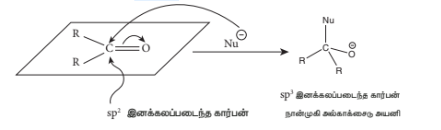

இந்த நான்முகி இடைநிலைக் கூறானது நீர் அல்லது அமிலத்தால் புரோட்டானேற்றம் பெற்று ஆல்கஹாலை உருவாக்குகிறது.

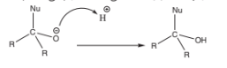

பொதுவாக, கருகவர் சேர்ப்பு வினைகளில் கீட்டோன்களை விட ஆல்டிஹைடுகள் அதிக வினைதிறன் கொண்டவைகளாக உள்ளன. ஆல்கைல் தொகுதிகளின்  \( +I \)  விளைவு மற்றும் கொள்ளிட விளைவே இதற்கு காரணமாக விளங்குகின்றன.

**எடுத்துக்காட்டுகள்**

**1) HCN சேர்த்தல்:**

கார்பனைல் கார்பன் மீதான \( CN^- \) அயனியின் தாக்குதலைத் தொடர்ந்து நிகழும் புரோட்டானேற்றத்தால் சயனோஹைட்ரின்கள் உருவாகின்றன.

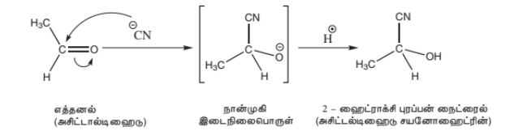

இந்த சயனோஹைட்ரின்களை அமிலங்களைக் கொண்டு நீராற்பகுத்து ஹைட்ராக்ஸி அமிலங்களாக மாற்ற முடியும். சயனோஹைட்ரின்களின் ஒடுக்கம் ஹைட்ராக்ஸி அமீன்களை தருகின்றன.

**2) \( NaHSO_3 \) சேர்த்தல்**

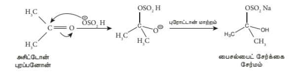

இந்த வினையானது கார்பனைல் சேர்மங்களை பிரித்தெடுக்கவும், தூய்மையாக்கவும் பயன்படுகிறது. இதில் உருவான பைசல்பேட் சேர்மமானது நீரில் கரையும் தன்மை கொண்டது. மேலும் அக்கரைசலை கனிம அமிலங்களுடன் வினைப்படுத்தும்போது கார்பனைல் சேர்மங்கள் மீள உருவாகின்றன.

**3) ஆல்கஹால் சேர்த்தல்**

அமில வினைவேக மாற்றி முன்னிலையில் ஆல்டிஹைடுகள் மற்றும் கீட்டோன்களை இரண்டு சமானங்கள் ஆல்கஹாலுடன் வினைப்படுத்தும்போது அசிட்டால்கள் உருவாகின்றன.

**எடுத்துக்காட்டு:** 

HCl முன்னிலையில், அசிட்டால்டிஹைடை, இரண்டு சமானங்கள் மெத்தனால் உடன் வினைப்படுத்தும்போது 1,1, - டைமீத்தாக்ஸி ஈத்தேன் உருவாகிறது.

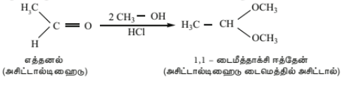

**வினைவழி முறை**

**4) அம்மோனியா மற்றும் அதன் பெறுதிகளை சேர்த்தல்**

அம்மோனியா மற்றும் அதன் பெறுதியான $\text{H}_2\ddot{\text{N}}\text{-G}$ ஆகியவற்றை கார்பனைல் சேர்மத்துடன் சேர்க்கும்போது கருகவர் சேர்ப்பு வினை நிகழ்கிறது. கார்பனைல் ஆக்ஸிஜன் அணுவானது புரோட்டானேற்றம் பெற்று பின்னர் நீக்க வினைக்கு உட்படுவதால் கார்பன் - நைட்ரஜன் இரட்டை பிணைப்பு உருவாகிறது \((>C=N-G)\)

இங்கு G என்பது –ஆல்கைல், அரைல், \(OH \), \( NH_2 \), \(C_6H_5NH \), \(NHCONH_2 \), போன்றவை.

| G | அம்மோனியா பெறுதி | கார்பனைல் பெறுதி | விளைபொருள் பெயர் |
| :---: | :---: | :---: | :---: |
| $-\text{OH}$ | ஹைட்ராக்சிலமீன் | $>\text{C}=\text{N}-\text{OH}$ | ஆக்சைம் |
| $-\text{NH}_2$ | ஹைட்ரசீன் | $>\text{C}=\text{N}-\text{NH}_2$ | ஹைட்ரசோன் |
| $-\text{HN}-\text{C}_6\text{H}_5$ | பீனைல் ஹைட்ரசீன் | $>\text{C}=\text{N}-\text{NH}-\text{C}_6\text{H}_5$ | பீனைல் ஹைட்ரசோன் |
| $$ \begin{array}{c} \text{O} \\[-0.5ex] \parallel \\[-0.5ex] -\text{NH}-\text{C}-\text{NH}_2 \end{array} $$ | செமி கார்பசைடு | $$ >\text{C}=\text{N}-\text{NH}-\begin{array}{c} \text{O} \\[-0.5ex] \parallel \\[-0.5ex] \text{C} \end{array}-\text{NH}_2 $$ | செமி கார்பசோன் |
| $$ \begin{array}{c} \text{NO}_2 \\[-0.5ex] \mid \\[-0.5ex] -\text{NH}-\text{⌬}-\text{NO}_2 \end{array} $$ | 2,4-டை-நைட்ரோ பீனைல் ஹைட்ரசீன் | $$ \begin{array}{c} \text{NO}_2 \\[-0.5ex] \mid \\[-0.5ex] >\text{C}=\text{N}-\text{NH}-\text{⌬}-\text{NO}_2 \end{array} $$ | 2,4- டைநைட்ரோ பீனைல் ஹைட்ரசோன் |

**i) ஹைட்ராக்ஸிலமீன் உடன் வினை**

ஆல்டிஹைடுகள் மற்றும் கீட்டோன்கள், ஹைட்ராக்ஸிலமீனுடன் வினைபுரிந்து ஆக்சைம்களை உருவாக்குகின்றன.

>**எடுத்துக்காட்டு:**
>
>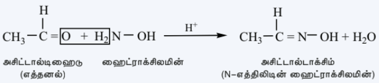

**ii) ஹைட்ரசீன் உடன் வினை**

ஆல்டிஹைடுகள் மற்றும் கீட்டோன்கள், ஹைட்ரசீனுடன் வினைபுரிந்து ஹைட்ரசோன்களை உருவாக்குகின்றன.

>**எடுத்துக்காட்டு:**
>
>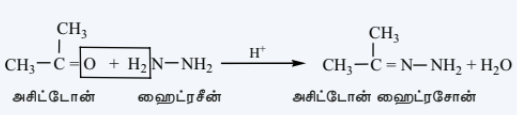

**iii) பீனைல் ஹைட்ரசீன் உடன் வினை**

ஆல்டிஹைடுகள் மற்றும் கீட்டோன்கள், பீனைல் ஹைட்ரசீனுடன் வினைபுரிந்து பீனைல் ஹைட்ரசோன்களை உருவாக்குகின்றன.

>**எடுத்துக்காட்டு:**
>
>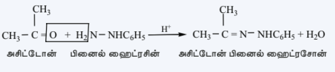

**4) \( NH_3 \) உடன் வினை**

i) அலிஃபாடிக் ஆல்டிஹைடுகள், (ஃபார்மால்டிஹைடு தவிர), ஈதரில் கரைந்த அம்மோனியாவுடன் வினைபுரிந்து ஆல்டிமீன்களை உருவாக்குகின்றன.

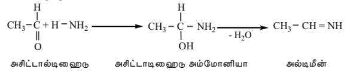

ii) ஃபார்மால்டிஹைடு, அம்மோனியா உடன் வினைபுரிந்து ஹெக்சாமெத்திலீன் டெட்ரமீனை உருவாக்குகிறது. இச்சேர்மம் யுரோட்ரோபின் எனவும் அழைக்கப்படுகிறது.

$$
\begin{array}{ccc}
6\text{HCHO} + 4\text{NH}_3 & \xrightarrow{\hspace{1.5cm}} & (\text{CH}_2)_6\text{N}_4 + 6\text{H}_2\text{O} \\
\text{\small பார்மால்டிஹைடு} & & \text{\small ஹெக்சாமெத்திலீன் டெட்ரமீன்}
\end{array}
$$

**அமைப்பு**

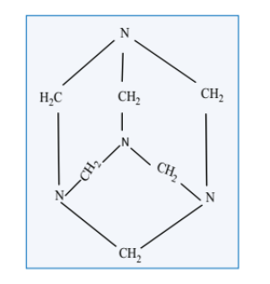

**பயன்கள்:** 
(i) யுரோட்ரோபின் ஆனது சிறுநீரக தொற்று நோய்க்கு சிகிச்சையளிக்க பயன்படுகிறது.
(ii) கட்டுப்படுத்தப்பட்ட சூழ்நிலையில் யுரோட்ரோபினை நைட்ரோ ஏற்றம் செய்யும்போது RDX
(Research and development explosive) எனும் வெடிபொருள் கிடைக்கிறது. இது சைக்ளோநைட்
அல்லது சைக்ளோ டிரை மெத்திலீன் டிரை நைட்ரமீன் எனவும் அறியப்படுகிறது.

iii) அசிட்டோன், அம்மோனியா உடன் வினைபுரிந்து டைஅசிட்டோன் அமீனை தருகிறது.

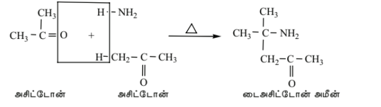

iv) பென்சால்டிஹைடு, அம்மோனியாவுடன் இணைந்து சிக்கலான குறுக்க விளைபொருளை
தருகிறது.

### B) ஆல்டிஹைடுகள் மற்றும் கீட்டோன்களின் ஆக்சிஜனேற்றம்

**a) ஆல்டிஹைடுகளின் ஆக்ஸிஜனேற்றம்**

ஆல்டிஹைடுகள் எளிதில் ஆக்ஸிஜனேற்றமடைந்து மூல ஆல்டிஹைடிலுள்ள அதே எண்ணிக்கையிலான கார்பன் அணுக்களைக் கொண்ட கார்பாக்சிலிக் அமிலங்களாக மாறுகின்றன. அமிலங்கலந்த \( K_2Cr_2O_7 \), அமிலம் அல்லது காரங்கலந்த \( KMnO_4 \) அல்லது குரோமிக் ஆக்சைடு ஆகியன பொதுவாக பயன்படுத்தப்படும் ஆக்ஸிஜனேற்றிகளாகும்.

**எடுத்துக்காட்டு:**

$$
\begin{array}{ccc}
\begin{array}{c} \text{H} \\[-0.5ex] \mid \\[-0.5ex] \text{CH}_3 - \text{C} = \text{O} \end{array} & \xrightarrow{[\text{O}]} & \begin{array}{c} \text{O} \\[-0.5ex] \parallel \\[-0.5ex] \text{CH}_3 - \text{C} - \text{OH} \end{array} \\
\text{\small அசிட்டால்டிஹைடு} & & \text{\small அசிட்டிக் அமிலம்}
\end{array}
$$

**b) கீட்டோன்களின் ஆக்ஸிஜனேற்றம்**

கீட்டோன்கள்எளிதில் ஆக்ஸிஜனேற்றமடைவதில்லை.இவை தீவிர சூழ்நிலையில் அல்லது அடர். \( Con.HNO_3 \), \( H^+/KMnO_4 \), \( H^+/K_2Cr_2O_7 \) O7போன்ற வலிமை மிக்க ஆக்ஸிஜனேற்றிகளுடன் வினைபுரியும்போது கார்பன்-கார்பன் பிணைப்பு பிளக்கப்பட்டு மூல கீட்டோன்களிலுள்ள கார்பன் அணுக்களைவிட குறைவான அணுக்களைக் கொண்ட கார்பாக்சிலிக் அமிலங்களின் கலவை உருவாகிறது.

$$
\begin{array}{ccc}
\begin{array}{c} \text{CH}_3 - \text{C} - \text{CH}_3 \\[-0.5ex] \parallel \\[-0.5ex] \text{O} \end{array} & \xrightarrow[\text{அடர் HNO}_3]{[\text{O}]} & \text{HCOOH} & + & \text{CH}_3\text{COOH} \\
& & \text{\small பார்மிக் அமிலம்} & & \text{\small அசிட்டிக் அமிலம்}
\end{array}
$$

பாபஃப் (Popoff’s) விதியினைக் கொண்டு சீர்மையற்ற கீட்டோன்களின் ஆக்ஸிஜனேற்றம்
விளக்கப்படுகிறது. இவ்விதிப்படி, சீர்மையற்ற கீட்டோன்களை ஆக்ஸிஜனேற்றம் செய்யும்போது
சிறிய ஆல்கைல் தொகுதியுடன் கீட்டோ தொகுதி இணைந்திருக்கும் வகையில் (C–CO) பிணைப்பு
பிளவுறுகிறது.

$$
\begin{array}{ccccc}
\begin{array}{c} \text{CH}_3 - \text{CH}_2 - \text{CH}_2 - \text{C} - \text{CH}_3 \\[-0.5ex] \parallel \\[-0.5ex] \text{O} \end{array} & \xrightarrow[\text{அடர் HNO}_3]{[\text{O}]} & \text{CH}_3\text{CH}_2 - \text{COOH} & + & \text{CH}_3\text{COOH} \\
\text{\small பென்டன்- 2 - ஓன்} & & \text{\small புரோபனாயிக் அமிலம்} & & \text{\small எத்தனாயிக் அமிலம்}
\end{array}
$$

### C) ஒடுக்க வினைகள்

**i) ஆல்கஹால்களாக ஒடுக்கமடைதல்**

ஆல்டிஹைடுகள் மற்றும் கீட்டோன்கள் எளிதில் ஆக்ஸிஜனேற்றமடைந்து முறையே ஓரிணைய மற்றும் ஈரிணைய ஆல்கஹால்களை உருவாக்குகின்றன என்பதை நாம் முன்னரே கற்றறிந்தோம். லித்தியம் அலுமினியம் ஹைட்ரைடு (\( LiAlH_4 \)) மற்றும் சோடியம் போரோ ஹைட்ரைடு (\( NaBH_4 \)) ஆகியன மிகப் பொதுவாக பயன்படுத்தப்படும் ஒடுக்கும் காரணிகளாகும்.

அ) ஆல்டிஹைடுகள், ஓரிணைய ஆல்கஹால்களாக ஒடுக்கப்படுகின்றன.

**எடுத்துக்காட்டு:**

$$
\begin{array}{ccc}
\begin{array}{c} \text{H} \\[-0.5ex] \mid \\[-0.5ex] \text{CH}_3 - \text{C} \\[-0.5ex] \parallel \\[-0.5ex] \text{O} \end{array} + 2\ [\text{H}] & \xrightarrow{\text{LiAlH}_4} & \text{CH}_3 - \text{CH}_2 - \text{OH} \\
\text{\small அசிட்டால்டிஹைடு} & & \text{\small எத்தில் ஆல்கஹால் (1}^\circ\text{)}
\end{array}
$$

**ஆ) கீட்டோன்கள், ஈரினைய ஆல்கஹால்களாக ஒடுக்கப்படுகின்றன.**

**எடுத்துக்காட்டு**

$$
\begin{array}{ccc}
\begin{array}{c} \text{CH}_3 - \text{C} - \text{CH}_3 \\[-0.5ex] \parallel \\[-0.5ex] \text{O} \end{array} + 2[\text{H}] & \xrightarrow{\text{NaBH}_4} & \begin{array}{c} \text{CH}_3 - \text{CH} - \text{CH}_3 \\[-0.5ex] \mid \\[-0.5ex] \text{OH} \end{array} \\
\text{\small அசிட்டோன்} & & \text{\small ஐசோபுரோபைல் ஆல்கஹால் (2}^\circ\text{)}
\end{array}
$$

Pt, Pd, அல்லது Ni போன்ற உலோக வினைவேகமாற்றிகள் முன்னிலையில் ஹைட்ரஜனுடன் வினைப்படுத்தியும் மேற்காண் வினைகளை நிகழ்த்த முடியும். $\text{LiAlH}_4$ மற்றும் $\text{NaBH}_4$ ஆகியன தனித்த கார்பன் – கார்பன் இரட்டை பிணைப்புகள் மற்றும் பென்சீனில் உள்ள இரட்டை பிணைப்புகளை ஒடுக்குவதில்லை. $\alpha, \beta$ நிறைவுறா ஆல்டிஹைடுகள் மற்றும் கீட்டோன்களில், $\text{LiAlH}_4$ ஆனது $\text{C} = \text{C}$ பிணைப்பை ஒடுக்காமல் $\text{C} = \text{O}$ தொகுதியை மட்டும் ஒடுக்குகிறது.

**ii) ஹைட்ரோகார்பனாக ஒடுக்கமடைதல்**

தகுந்த ஒடுக்கும் காரணிகளைப் பயன்படுத்துவதன் மூலம் ஆல்டிஹைடுகள் மற்றும் கீட்டோன்களிலுள்ள கார்பனைல் தொகுதியை மெத்திலீன் தொகுதியாக ஒடுக்கி ஹைட்ரோகார்பன்களைப் பெற முடியும்.

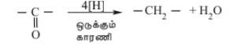

**அ) கிளமென்சன் ஒடுக்கம்:** 

ஆல்டிஹைடுகள்மற்றும் கீட்டோன்களை ஜிங்க் பாதரசக் கலவை மற்றும் அடர்ஹைட்ரோகுளோரிக் அமிலத்துடன் சேர்த்து வெப்பப்படுத்தும்போது ஹைட்ரோகார்பன்கள் பெறப்படுகின்றன.

**எடுத்துக்காட்டு:**

$$\begin{array}{ccc} \begin{array}{c} \text{CH}_3 - \text{C} - \text{H} \\ \parallel \\ \text{O} \end{array} + 4(\text{H}) & \xrightarrow[\text{அடர் HCl}]{\text{Zn - Hg}} & \text{CH}_3 - \text{CH}_3 + \text{H}_2\text{O} \\ \text{\small அசிட்டாடிஹைடு} & & \text{\small ஈத்தேன்} \\ \\ \begin{array}{c} \text{CH}_3 - \text{C} - \text{CH}_3 \\ \parallel \\ \text{O} \end{array} + 4(\text{H}) & \xrightarrow[\text{அடர் HCl}]{\text{Zn - Hg}} & \text{CH}_3\text{CH}_2\text{CH}_3 + \text{H}_2\text{O} \\ \text{\small அசிட்டோன்} & & \text{\small புரோபேன்} \end{array}$$

**ஆ) உல்ஃப்-கிஷ்னர் ஒடுக்கம்:**
ஆல்டிஹைடுகள் மற்றும் கீட்டோன்களை ஹைட்ரசீன் (\( NH_2NH_2 \))  மற்றும் சோடியம் ஈத்தாக்சைடுடன் சேர்த்து வெப்பப்படுத்தும்போது ஹைட்ரோகார்பன்கள் பெறப்படுகின்றன.இதில் ஹைட்ரசீன் ஒடுக்கும் காரணியாகவும், சோடியம் ஈத்தாக்சைடு வினைவேக மாற்றியாகவும் பயன்படுகின்றன.

**எடுத்துக்காட்டு:**

$$\begin{array}{ccc} \begin{array}{c} \text{CH}_3 - \text{C} - \text{H} \\ \parallel \\ \text{O} \end{array} + 4[\text{H}] & \xrightarrow[\text{C}_2\text{H}_5\text{ONa}]{\text{NH}_2 \text{NH}_2} & \text{CH}_3 - \text{CH}_3 + \text{H}_2\text{O} + \text{N}_2 \\ \text{\small அசிட்டால்டிஹைடு} & & \text{\small ஈத்தேன்} \\ \\ \begin{array}{c} \text{CH}_3 - \text{C} - \text{CH}_3 \\ \parallel \\ \text{O} \end{array} + 4 [\text{H}] & \xrightarrow[\text{C}_2\text{H}_5\text{ONa}]{\text{NH}_2-\text{NH}_2} & \text{CH}_3\text{CH}_2\text{CH}_3 + \text{H}_2\text{O} + \text{N}_2 \\ \text{\small அசிட்டோன்} & & \end{array}$$

ஆல்டிஹைடுகள் (அல்லது) கீட்டோன்கள் முதலில் அவற்றின் ஹைட்ரசோன்களாக மாற்றப்படுகின்றன. இந்த ஹைட்ரசோனை வலிமைமிகு காரத்துடன் வெப்பப்படுத்தும்போது ஹைட்ரோகார்பன்கள் உருவாகின்றன.

**(iii) பினகால்களாக ஒடுக்கமடைதல்:** கீட்டோன்களை, மெக்னீஷியம் இரசக் கலவை மற்றும் நீர் கொண்டு ஒடுக்கும்போது சீர்மையுள்ள டையால்கள் உருவாகின்றன, இவை பினகால்கள் என்று அறியப்படுகின்றன.

$$\begin{array}{ccc} 2(\text{CH}_3)_2\text{C}=\text{O} + 2[\text{H}] & \xrightarrow[\text{Hg}]{\text{Mg}-\text{Hg}/\text{H}_2\text{O}} & (\text{CH}_3)_2\text{C}(\text{OH})\text{C}(\text{OH})(\text{CH}_3)_2 \\ (\text{\small அசிட்டோன்}) & & (\text{\small 2,3-டைமெத்தில்பியூட்டேன்-2,3-டையால்}) \end{array}$$

### D) ஹேலோஃபார்ம் வினை
$$\begin{array}{c} \text{CH}_3 - \text{C} - \\ \parallel \\ \text{O} \end{array}$$ தொகுதியைக் கொண்டுள்ள அசிட்டால்டிஹைடு மற்றும் மெத்தில் கீட்டோன் சேர்மங்களை ஹேலஜன் மற்றும் காரக் கலவையுடன் சேர்த்து வினைப்படுத்தும்போது ஹேலோஃபார்ம்கள் உருவாகின்றன. இது ஹேலோஃபார்ம் வினை என அறியப்படுகிறது.

\[
CH_3COCH_3 \xrightarrow[NaOH]{3Cl_2} CCl_3COCH_3 \xrightarrow{NaOH} CHCl_3 + CH_3COONa
\]

### E) ஆல்கைல்தொகுதி ஈடுபடும் வினைகள்

**i) ஆல்டால் குறுக்க வினை**

கார்பனைல் கார்பனுடன் இணைந்துள்ள கார்பன் அணுவானது $\alpha$ - கார்பன் என்றழைக்கப்படுகிறது. $\alpha$ - கார்பனுடன் இணைந்துள்ள ஹைட்ரஜன் அணுவானது $\alpha$ - ஹைட்ரஜன் என்றழைக்கப்படுகிறது.

$\alpha$ - ஹைட்ரஜனைக் கொண்டுள்ள இரண்டு ஆல்டிஹைடு அல்லது கீட்டோன் மூலக்கூறுகள், நீர்த்த NaOH அல்லது KOH முன்னிலையில் ஒன்றிணைந்து $\beta$ - ஹைட்ராக்ஸி ஆல்டிஹைடு (ஆல்டால்) அல்லது $\beta$ - ஹைட்ராக்ஸி கீட்டோனை (கீட்டால்) தருகின்றன. இவ்வினையானது **ஆல்டால் குறுக்க வினை** என்றழைக்கப்படுகிறது. இந்த ஆல்டால் அல்லது கீட்டால் ஆனது எளிதில் நீர் மூலக்கூறை இழந்து ஆல்டால் குறுக்க விளைபொருட்களான $\alpha,\beta$ - நிறைவுறா சேர்மங்களை தருகின்றன.

அ) அசிட்டால்டிஹைடை நீர்த்த NaOH உடன் வெப்பபடுத்தும்போது \( \beta \)-ஹைட்ராக்ஸி
பியூட்ரால்டிஹைடை (அசிட்டால்டால்)தருகிறது.

$$\begin{array}{cccc} \begin{array}{c} \text{H} \\ \mid \\ \text{CH}_3 - \text{C} \\ \parallel \\ \text{O} \end{array} & + \ \text{H}-\text{CH}_2-\text{CHO} & \xrightarrow{\begin{array}{c}\text{\scriptsize நீரிய}\\\text{\scriptsize NaOH}\end{array}} & \begin{array}{c} \text{CH}_3 - \text{CH} - \text{CH}_2 - \text{CHO} \\ \mid \\ \text{OH} \end{array} \\ \text{\small அசிட்டால்டிஹைடு} & & & \begin{array}{c} \text{\small அசிட்டால்டால்} \\ \text{\small 3 - ஹைட்ராக்ஸி பியூட்டனால்} \end{array} \end{array}$$

**வினைவழி முறை**
அசிட்டால்டிஹைடின் ஆல்டால் குறுக்க வினையானது மூன்று படிகளில் நிகழ்கிறது.

**படி 1:** காரத்தின் உதவியுடன்\( \alpha \)- ஹைட்ரஜன் அணுவானது புரோட்டானாக நீக்கப்பட்டு கார்பன் எதிரயனி உருவாகிறது.

**படி 2:** இந்த கார்பன் எதிரயனியானது மற்றொரு அயனியுறா ஆல்டிஹைடிலுள்ள கார்பனைல்
கார்பனை தாக்கி ஆல்காக்சைடு அயனியை உருவாக்குகிறது.

**படி 3:** இவ்வாறு உருவான ஆல்காக்சைடு அயனியானது நீரினால் புரோட்டானேற்றம் பெற்று
ஆல்டாலை உருவாக்குகிறது.

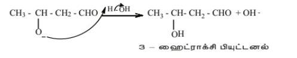

வெப்பப்படுத்தும்போது இந்த ஆல்டால் விரைவாக நீர்நீக்கம் அடைந்து \( \alpha,\beta \ நிறைவுறா ஆல்டிஹைடை உருவாக்குகிறது.

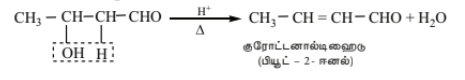

**ii) குறுக்க ஆல்டால் குறுக்கம்.**

இரண்டு வெவ்வேறு ஆல்டிஹைடுகள் அல்லது கீட்டோன்கள் அல்லது ஒரு ஆல்டிஹைடு மற்றும் ஒரு கீட்டோனுக்கு இடையிலும் ஆல்டால் குறுக்க வினை நிகழ முடியும். அத்தகைய ஆல்டால்  குறுக்க வினையானது குறுக்க ஆல்டால் குறுக்க வினை அல்லது கலப்பு ஆல்டால் குறுக்க வினை  என்றழைக்கப்படுகிறது. சாத்தியமுள்ள அனைத்து குறுக்கவினை விளைபொருட்களும் கலவையாக கிடைப்பதாலும், அவற்றை பிரித்தெடுத்தல் எளிதல்ல என்பதாலும் இந்த வினையானது அதிக பயனற்றது.

**எடுத்துக்காட்டு:**

$$\begin{array}{cccc} \text{HCHO} & + \ \text{CH}_3\text{CHO} & \xrightarrow{\begin{array}{c}\text{\scriptsize நீரிய}\\\text{\scriptsize NaOH}\end{array}} & \text{HO} - \text{CH}_2 - \text{CH}_2 - \text{CHO} \\ \text{\small பார்மால்டிஹைடு} & \text{\small அசிட்டால்டிஹைடு} & & \text{\small 3 - ஹைட்ராக்ஸி புரப்பனல்} \\ \\ \text{HCHO} & + \ \begin{array}{c} \text{CH}_3 - \text{C} - \text{CH}_3 \\ \parallel \\ \text{O} \end{array} & \xrightarrow{\begin{array}{c}\text{\scriptsize நீரிய}\\\text{\scriptsize NaOH}\end{array}} & \text{HO} - \text{CH}_2 - \text{CH}_2 - \begin{array}{c} \text{C} - \text{CH}_3 \\ \parallel \\ \text{O} \end{array} \\ \text{\small பார்மால்டிஹைடு} & \text{\small அசிட்டோன்} & & \text{\small 4- ஹைட்ராக்ஸிபியூட்டன் - 2-ஒன்} \end{array}$$

### F) பென்சால்டிஹைடின் சில முக்கியமான வினைகள்:

**i) கிளெய்சன்- ஸ்கிமிட் குறுக்க வினை:**

அறைவெப்பநிலையில், பென்சால்டிஹைடானது, நீர்த்த காரக் கரைசல் முன்னிலையில், அலிஃபாடிக் ஆல்டிஹைடு அல்லது மெத்தில் கீட்டொனுடன் வினைபுரிந்து நிறைவுறா ஆல்டிஹைடு அல்லது கீட்டோனை உருவாக்குகிறது. இவ்வகை வினையானது கிளெய்சந் ஸ்கிமிட் குறுக்கவினை என்றழைக்கப்படுகிறது.

**எடுத்துக்காட்டு:**

$$\begin{array}{cccc} \text{C}_6\text{H}_5\text{CH}=\text{O} + \text{H}_2\text{CH}-\text{CHO} & \xrightarrow{\text{dil NaOH}} & \text{C}_6\text{H}_5\text{CH}=\text{CH}-\text{CHO} + \text{H}_2\text{O} \\ \text{\small பென்சால்டிஹைடு} \quad \text{\small அசிட்டால்டிஹைடு} & & \text{\small சின்னமால்டிஹைடு} \\ \\ \text{C}_6\text{H}_5\text{CH}=\text{O} + \text{H}_2\text{CH}-\begin{array}{c} \text{C}-\text{CH}_3 \\ \parallel \\ \text{O} \end{array} & \xrightarrow{\text{dil NaOH}} & \text{C}_6\text{H}_5\text{CH}=\text{CH}-\begin{array}{c} \text{C}-\text{CH}_3 \\ \parallel \\ \text{O} \end{array} + \text{H}_2\text{O} \\ \text{\small பென்சால்டிஹைடு} \qquad \text{\small அசிட்டோன்} & & \begin{array}{c} \text{\small பென்சைலிடின் அசிட்டோன்} \\ \text{\small (பென்சால் அசிட்டோன்)} \end{array} \end{array}$$

**ii) கான்னிசரோ வினை:**

நீர் அல்லது ஆல்கஹாலில் கரைந்த அடர் காரக் கரைசல் முன்னிலையில் \( \alpha \)- ஹைட்ரஜனை பெற்றிறாத ஆல்டிஹைடுகள், சுய ஆக்ஸிஜனேற்றம் மற்றும் ஒடுக்கத்திற்கு உட்பட்டு ஆல்கஹால் மற்றும் கார்பாக்சிலிக் அமில உப்பு ஆகியவை சேர்ந்த கலவையை தருகின்றன. இந்த வினையானது கான்னிசரோ வினை என்றழைக்கப்படுகிறது.

பென்ஸால்டிஹைடை செறிவூட்டப்பட்ட NaOH (\( 50\% \)) உடன் வினைப்படுத்தும்போது பென்சைல்
ஆல்கஹாலையும் சோடியம் பென்சோயேட்டையும் தருகிறது.

$$\begin{array}{ccc} \text{C}_6\text{H}_5\text{CHO} \\ + & \xrightarrow{\text{50\% NaOH}} & \begin{array}{c} \text{C}_6\text{H}_5\text{CH}_2\text{OH} \\ \text{\small பென்சைல் ஆல்கஹால்} \end{array} \\ \text{C}_6\text{H}_5\text{CHO} & & + \\ \text{\small பென்சால்டிஹைடு} & & \begin{array}{c} \text{C}_6\text{H}_5\text{COONa} \\ \text{\small சோடியம் பென்சோயேட்} \end{array} \end{array}$$

இந்த வினையானது விகிதக்கூறு சிதைவு வினைக்கு எடுத்துக்காட்டாகும்.

**படி 1:** கார்பனைல் கார்பனின் மீது \( OH^- \) தாக்குதல்.
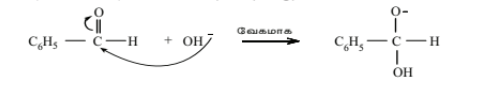
**படி 2:** ஹைட்ரைடு அயனி பரிமாற்றம்.
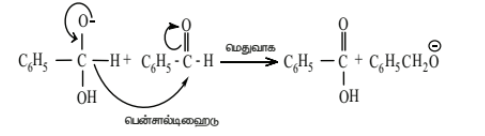
**படி 3:** அமில-கார வினை.

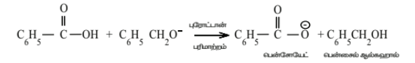

கான்னிசாரோ வினை என்பது \( \alpha \)-ஹைட்ரஜனைக் கொண்டிராத ஆல்டிஹைட்டின் சிறப்பியல்பு வினையாகும்.

**குறுக்கு கான்னிசாரோ வினை:** இரண்டு வெவ்வேறு ஆல்டிஹைடுகளுக்கிடையே கான்னிசாரோ வினை நடைபெறும்போது (இரண்டிலும் \( \alpha \) ஹைட்ரஜன் அணு இல்லை), வினை குறுக்கு கான்னிசாரோ வினை எனப்படும்.

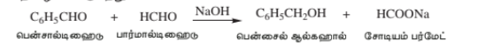

குறுக்கு கான்னிசாரோ வினையில், அதிக வினைத்திறன் கொண்ட ஆல்டிஹைடு ஆக்சிஜனேற்றம் செய்யப்படுகிறது, மற்றும் குறைந்த வினைத்திறன் கொண்ட ஆல்டிஹைடு ஒடுக்கப்படுகிறது.

**3) பென்சாயின் குறுக்கம்**

ஒரு அரோமேடிக் ஆல்டிஹைடை நீர்த்த ஆல்கஹாலில் கரைந்த KCN கரைசலுடன்  வினைப்படுத்தும்போது, ஹைட்ராக்ஸி கீட்டோன் உருவாகிறது. இவ்வினையானது பென்சாயின்  குறுக்கம் என்றழைக்கப்படுகிறது.

**எடுத்துக்காட்டு:** பென்ஸால்டிஹைடு ஆல்ககால் KCN உடன் வினைபுரிந்து பென்சோயினை உருவாக்குகிறது.

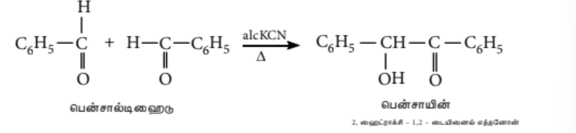

#### 4) பெர்க்கின் வினை

ஒரு அரோமேடிக் ஆல்டிஹைடை, ஒரு அலிஃபாடிக் அமில நீரிலியுடன் சேர்த்து ஒரு அமில நீரிலியுடன் தொடர்புடைய அமிலத்தின் சோடியம் உப்பின் முன்னிலையில் வெப்பப்படுத்தும்போது குறுக்க வினை நிகழ்ந்து ஒரு α, β நிறைவுறா அமிலம் பெறப்படுகிறது. இந்த வினையானது பெர்கின் வினை என அறியப்படுகிறது.

**எடுத்துக்காட்டு:**

#### 5) நோவினாகல் வினை

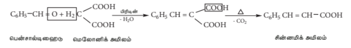

பிரிடின் முன்னிலையில் பென்சால்டிஹைடு ஆனது மலோனிக் அமில மூலக்கூறுடன் குறுக்க வினைக்கு உட்பட்டு சின்னமிக் அமிலத்தை தருகிறது. இவ்வினையில் பிரிடின், கார வினைவேக மாற்றியாக செயல்படுகிறது.

#### 6) அமினுடன் வினை

அமிலத்தின் முன்னிலையில், அரோமேடிக் ஆல்டிஹைடுகள், ஓரிணைய அமீன்களுடன் ( அலிஃபாடிக் அல்லது அரோமேடிக்) வினைப்பட்டு ஷிஃப் காரத்தை தருகின்றன.

**எடுத்துக்காட்டு:**

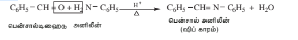

#### 7) மூன்றாம் நிலை நறுமண அமின்களுடன் ஒடுக்கம்

வலிமை மிகுந்த அமிலங்கள் முன்னிலையில், பென்சால்டிஹைடானது N, N – டைமெத்தில்  அனிலீன் போன்ற அரோமேடிக் அமீன்களூடன் குறுக்க வினைக்கு உட்பட்டு ட்ரைபீனைல் மீத்தேன்  சாயத்தை உருவாக்குகிறது.

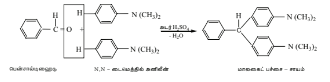

#### 8) பென்ஸால்டிஹைட்டின் மின்னணு மிகுபதிலீட்டு வினைகள்

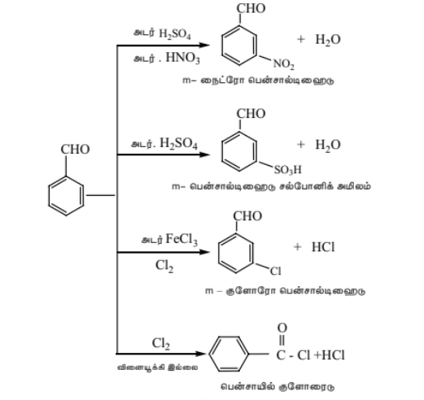
**அசிட்டோபீனோனின் எலக்ட்ரான் கவர் பதிலீட்டு வினை**
    அசிட்டோபீனோன், நைட்ரோ ஏற்ற கலவையுடன்
வினைப்பட்டு m – நைட்ரோ அசிட்டோபீனோனை
தருகிறது.

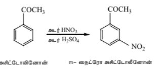

## 12.6 ஆல்டிஹைடுகளுக்கான சோதனைகள்

### i) டோலன்ஸ் வினைப்பொருள் சோதனை

டாலன்ஸ் வினைக்காரணி என்பது அம்மோனியாவில் கரைந்த வெள்ளி நைட்ரேட் கரைசலாகும். ஒரு ஆல்டிஹைடை டாலன்ஸ் வினைக்காரணியுடன் சேர்த்து வெப்பபடுத்தும்போது உலோக வெள்ளி வீழ்படிவாவதால் பளபளப்பான வெள்ளி ஆடி உருவாகிறது. இந்த வினையானது ஆல்டிஹைடுகளுக்கான வெள்ளி ஆடி சோதனை என்றழைக்கப்படுகிறது.

$$\begin{array}{ccc} \text{CH}_3\text{CHO} + 2\ [\text{Ag}(\text{NH}_3)_2]^+ + 3\text{OH}^- & \xrightarrow{\hspace{1.5cm}} & \text{CH}_3\text{COO}^- + 4\text{NH}_3 + 2\text{Ag} + 2\text{H}_2\text{O} \\ & & \text{\small வெள்ளி} \end{array}$$

**ii)ஃபெல்லிங் கரைசல் சோதனை**

சமகனஅளவு கொண்ட ஃபெல்லிங் கரைசல் - A (நீரிய காப்பர் சல்பேட் கரைசல்) ஃபெல்லிங் கரைசல் - B (காரங்கலந்த சோடியம் பொட்டாசியம் டார்டோரேட் கரைசல்- ரோசெல்லே உப்பு) ஆகியவற்றை ஒன்றாக கலந்து ஃபெல்லிங் கரைசல் பெறப்படுகிறது. ஆல்டிஹைடை ஃபெல்லிங் கரைசலுடன் சேர்த்து வெப்பப்படுத்தும்போது அடர் நீல நிற கரைசலானது செந்நிற வீழ்படிவாக (குப்ரஸ் ஆக்சைடு) மாறுகிறது.

$$\begin{array}{ccc} \text{CH}_3\text{CHO} + 2\text{Cu}^{2+} + 5\text{OH}^- & \xrightarrow{\hspace{1.5cm}} & \text{CH}_3\text{COO}^- + \text{Cu}_2\text{O} \downarrow + 3\text{H}_2\text{O} \\ (\text{\small நீலம்}) & & (\text{\small சிவப்பு}) \end{array}$$

### iii) பெனடிக்ட் கரைசல் சோதனை

பெனடிக்ட் கரைசல் என்பது \( CuSO_4 \) , சோடியம் சிட்ரேட் மற்றும் NaOH ஆகியவை கலந்த
கலவையாகும். இதிலுள்ள \( Cu^{2+} \) அயனிகள் ஆல்டிஹைடுகளால் ஒடுக்கப்பட்டு செந்நிற குபரஸ்
ஆக்சைடு வீழ்படிவாகிறது.

$$\begin{array}{ccc} \text{CH}_3\text{CHO} + 2\text{Cu}^{2+} + 5\text{OH}^- & \xrightarrow{\hspace{1.5cm}} & \text{CH}_3\text{COO}^- + \text{Cu}_2\text{O} \downarrow + 3\text{H}_2\text{O} \\ (\text{\small நீலம்}) & & (\text{\small சிவப்பு}) \end{array}$$

### iv) ஷிஃப்பின் வினைப்பொருள் சோதனை

 நீர்த்த ஆல்டிஹைடு கரைசல்களை ஷிஃப் வினைக்காரணியுடன் (ரோசனிலின் ஹைட்ரோ குளோரைடு நீரில் கரைக்கப்பட்டு,\( SO_2 \)அதன் சிவப்பு நிறம் நிறமிழக்கச் செய்யப்படுகிறது) சேர்க்கும்போது அதன் சிவப்பு நிறம் மீள உருவாகிறது. இந்த சோதனையானது ஆல்டிஹைடுகளுக்கான ஷிஃப் சோதனை என அறியப்படுகிறது. கீட்டோன்கள் இந்த சோதனையை தருவதில்லை. ஆனால், அசிட்டோன் மெதுவாக இந்த சோதனைக்கு உட்படுகிறது.

## 12.7 ஆல்டிஹைடுகள் மற்றும் கீட்டோன்களின் பயன்கள்

**ஃபார்மால்டிஹைடு**

(i) ஃபார்மால்டிஹைடின் 40% நீரிய கரைசலானது ஃபார்மலின் என்றழைக்கப்படுகிறது. இது உயிரியல் மாதிரிகளை பதப்படுத்த பயன்படுகிறது.

(ii) ஃபார்மலின் கடினமாக்கும் திறனைப் பெற்றிருப்பதால், தோல் பதனிடுதலில் பயன்படுத்தப்படுகிறது.

(iii) வெப்ப இறுகு பிளாஸ்டிக்கான பேக்லைட் தயாரிப்பில் ஃபார்மலின் பயன்படுகிறது. இது பீனால் மற்றும் ஃபார்மலினை வெப்பப்படுத்தி பெறப்படுகிறது.

**அசிட்டால்டிஹைடு**

(i) கண்ணாடியின் மீது வெள்ளி பூச்சை உருவாக்க அசிட்டால்டிஹைடு பயன்படுகிறது.

(ii) பாரால்டிஹைடு, மருத்துவத்துறையில் மனோவசிய மருந்தாக பயன்படுகிறது.

(iii) அசிட்டிக் அமிலம், எத்தில் அசிட்டேட் போன்ற கரிம சேர்மங்களின் தொழிற்முறை தயாரிப்பில்
அசிட்டால்டிஹைடு பயன்படுகிறது.

**அசிட்டோன்**

(i) புகையில்லா வெடிபொருள் (கார்டைட்) தயாரிப்பில் அசிட்டோன் கரைப்பானாகப் பயன்படுகிறது.

(ii) இது, நகப்பூச்சு நீக்கியாகப் பயன்படுகிறது.

(iii) இது சல்ஃபோனால் எனும் மனோவசிய மருந்து தயாரிப்பில் பயன்படுகிறது.

(iv) இது பெர்ஸ்பெக்ஸ் எனும் வெப்ப இளகு பிளாஸ்டிக் தயாரிப்பில் பயன்படுகிறது.

**பென்சால்டிஹைடு**

(i) இது நறுமணமூட்டும் பொருளாகப் பயன்படுகிறது.

(ii) இது வாசனை திரவியங்களில் பயன்படுகிறது.

(iii) இது சின்னமால்டிஹைடு, சின்னமிக் அமிலம், பென்சாயில் குளோரைடு போன்ற பல கரிம சேர்மங்கள் தயாரிப்பில் துவக்க வினைப்பொருளாகப் பயன்படுகிறது.

**அரோமேடிக் கீட்டோன்கள்**

(i) அசிட்டோபீனோன் வாசனை திரவியங்கள் தயாரிப்பிலும், ஹிப்னோன் எனும் பெயரில் மனோவசிய மருந்தாகவும் பயன்படுகிறது.

(ii) பென்சோபீனோன் வாசனை திரவியங்கள் தயாரிப்பிலும், பென்சைட்ரால் கண்மருந்து தயாரிப்பிலும் பயன்படுகிறது.

### கார்பாக்சிலிக் அமிலங்கள்

**அறிமுகம்**

$-\text{COOH}$ எனும் கார்பாக்சில் வினைச்செயல் தொகுதியை கொண்டுள்ள கார்பன் சேர்மங்கள் கார்பாக்சிலிக் அமிலங்கள் என்றழைக்கப்படுகின்றன. கார்பாக்சில் தொகுதி என்பது கார்பனைல் தொகுதி $\text{–} \underset{\substack{||\text{O}}}{\text{C}} \text{–}$  மற்றும் ஹைட்ராக்ஸி தொகுதி $(-\text{OH})$ ஆகியவற்றின் கூடுகை ஆகும்.

எனினும், கார்பாக்சில் தொகுதியானது தனக்கே உரித்தான சிறப்புப் பண்புகளைப் பெற்றுள்ளது. கார்பாக்சிலிக் அமிலங்களானவை, கார்பாக்சில் கார்பன் அணுவுடன் இணைந்துள்ள ஆல்கைல் அல்லது அரைல் தொகுதிகளைப் பொறுத்து அலிஃபாட்டிக் $(\text{R}-\text{COOH})$ சேர்மமாகவோ அல்லது அரோமேடிக் $(\text{Ar}-\text{COOH})$ சேர்மமாகவோ இருக்கலாம். அலிஃபாட்டிக் கார்பாக்சிலிக் அமிலங்களில் சில உயர் கார்பன் எண்ணிக்கை $\mathrm{C_{12}}$ முதல் $\mathrm{C_{18}}$ மூலக்கூறுகள் இயற்கை கொழுப்புகளில் கிளிசரால் எஸ்டர்களாக காணப்படுகின்றன., இவை கொழுப்பு அமிலங்கள் என அறியப்படுகின்றன.

## 12.8 கார்பாக்சிலிக் அமிலங்களின் IUPAC பெயரிடல்

| சேர்மம்  பொதுப்பெயர், அமைப்பு, IUPAC பெயர் | IUPAC பெயர் |  |  |  |
| --- | --- | --- | --- | --- |
|  | **இட எண்ணுடன் முன்னொட்டு** | **மூலச் சொல்** | **முதன்மை பின்னொட்டு** | **இரண்டாம் பின்னொட்டு** |
| ஃபார்மிக் அமிலம்    $\text{HCOOH}$    மெத்தனாயிக் அமிலம் | -- | மெத் | ஏன் | ஆயிக் அமிலம் |
| அசிட்டிக் அமிலம்    $\text{CH}_3\text{COOH}$    எத்தனாயிக் அமிலம் | -- | எத் | ஏன் | ஆயிக் அமிலம் |
| ஐசோபியூட்ரிக் அமிலம்    $(\text{CH}_3)_2\text{CHCOOH}$    2 –மெத்தில்புரப்பனாயிக் அமிலம் | 2 – மெத்தில் | புரப் | ஏன் | ஆயிக் அமிலம் |
| பீனைல் அசிட்டிக் அமிலம் < 2-பீனைல் எத்தனாயிக் அமிலம் | 2 – பீனைல் | எத் | ஏன் | ஆயிக் அமிலம் |
| ஆக்ஸாலிக் அமிலம்    $\text{HOOC} - \text{COOH}$    ஈத்தேன்-1,2-டையாயிக் அமிலம் | -- | ஈத் | ஏன் | 1,2 – டையாயிக் அமிலம் |
| மலோனிக் அமிலம்    $\text{HOOC}-\text{CH}_2-\text{COOH}$    புரப்பேன்-1,3- டையாயிக் அமிலம் | -- | புரப் | ஏன் | 1,3 – டையாயிக் அமிலம் |
| சக்சினிக் அமிலம்    $\text{HOOC}-(\text{CH}_2)_2-\text{COOH}$    பியூட்டேன்-1,4-டையாயிக் அமிலம் | -- | பியூட் | ஏன் | 1, 4 – டையாயிக் அமிலம் |
| குளுட்டாரிக் அமிலம்    $\text{HOOC}-(\text{CH}_2)_3-\text{COOH}$    பெண்டேன்-1,5-டையாயிக் அமிலம் | -- | பெண்ட் | ஏன் | 1,5 – டையாயிக் அமிலம் |
| அடிபிக் அமிலம்    $\text{HOOC}-(\text{CH}_2)_4-\text{COOH}$    ஹெக்ஸேன்-1,6-டையாயிக் அமிலம் | -- | ஹெக்ஸ் | ஏன் | 1,6 – டையாயிக் அமிலம் |

## 12.9 கார்பாக்சில் குழுவின் அமைப்பு

கார்பாக்சில் குழு அணுக்களின் ஒரு தள அமைப்பைக் குறிக்கிறது. -COOH குழுவில், மைய கார்பன் அணு மற்றும் இரண்டு ஆக்சிஜன் அணுக்களும் \( sp^2 \) கலப்பினமாக்கத்தில் உள்ளன. கார்பன் அணுவின் மூன்று \( sp^2 \) கலப்பின ஆர்பிட்டால்கள் ஒன்றுடன் ஒன்று மேற்பொருந்துகின்றன.

கார்பாக்சில் கார்பனின் இரண்டு \( sp^2 \) கலப்பின ஆர்பிட்டால்கள் ஒவ்வொரு ஆக்சிஜன் அணுவின் ஒரு \( sp^2 \) கலப்பின ஆர்பிட்டாலுடன் மேற்பொருந்துகின்றன, அதே நேரத்தில் கார்பனின் மூன்றாவது \( sp^2 \) கலப்பின ஆர்பிட்டால் H-அணுவின் s-ஆர்பிட்டால் அல்லது ஆல்க்கைல் குழுவின் C-அணுவின் \( sp^3 \) கலப்பின ஆர்பிட்டாலுடன் மேற்பொருந்தி மூன்று \( \sigma \)-பிணைப்புகளை உருவாக்குகிறது. இரண்டு ஆக்சிஜன் அணுக்கள் மற்றும் கார்பன் அணுக்கள் ஒவ்வொன்றும் ஒரு கலப்பினமாக்கப்படாத p-ஆர்பிட்டாலைக் கொண்டிருக்கும், இது \( \sigma \)-பிணைப்பு எலும்புக்கூட்டிற்குச் செங்குத்தாக உள்ளது.

இந்த மூன்று p–ஆர்பிட்டால்களும் ஒன்றுக்கொன்று இணையாக இருப்பதால் ஒரு π- பிணைப்பை உருவாக்குகின்றன. இந்த π- பிணைப்பானது ஒரு புறம் கார்பன் மற்றும் ஆக்ஸிஜன் அணுக்களுக்கிடையேயும், மற்றொரு புறம் கார்பன் மற்றும் OH தொகுதியிலுள்ள ஆக்ஸிஜன் அணுக்களுக்கிடையேயும் பகுதியளவு உள்ளடங்காத் தன்மையினை பெற்றுள்ளது. அதாவது, RCOOH ஐ பின்வரும் இரு வடிவமைப்புகளின் உடனிசைவு இனக்கலப்பாக குறிப்பிட முடியும்.

உடனிசைவு அமைப்புகளின் காரணமாக கார்பாக்சிலிக் கார்பன் அணுவானது, கார்பனைல் கார்பனை விட குறைந்த கருகவர் தன்மையினைப் பெற்றுள்ளது. அதாவது, ஹைட்ராக்ஸி தொகுதியிலுள்ள ஆக்ஸிஜன் அணுவிலுள்ள தனித்த இரட்டை எலக்ட்ரான்கள் உள்ளடங்கா தன்மையை பெற்றுள்ளன.

## 12.10 கார்பாக்சிலிக் அமிலங்களை தயாரிக்கும் முறைகள்

கார்பாக்சிலிக் அமிலங்களை தயாரிக்கும் சில முக்கியமான முறைகள் பின்வருமாறு :

**1. முதனிலை ஆல்கஹால்கள் மற்றும் ஆல்டிஹைடுகளிலிருந்து**

பொட்டாசியம் பெர்மாங்கனேட் (அமில அல்லது கார ஊடகத்தில்), பொட்டாசியம் டைகுரோமேட் (அமில ஊடகத்தில்) போன்ற ஆக்ஸிஜனேற்றிகளைக் கொண்டு, ஓரிணைய ஆல்கஹால்கள் மற்றும் ஆல்டிஹைடுகளை எளிதாக ஆக்ஸிஜனேற்றம் செய்து கார்பாக்சிலிக் அமிலங்களாக மாற்ற முடியும்.

**எடுத்துக்காட்டு:**

$$\begin{array}{ccccc} \text{CH}_3\text{CH}_2\text{OH} & \xrightarrow[\text{(O)}]{\text{H}^+ / \text{K}_2\text{Cr}_2\text{O}_7} & \text{CH}_3\text{CHO} & \xrightarrow[\text{(O)}]{} & \text{CH}_3\text{COOH} \\ \text{\small எத்தில் ஆல்கஹால்} & & \text{\small அசிட்டால்டிஹைடு} & & \text{\small அசிட்டிக் அமிலம்} \end{array}$$

**2. நைட்ரைல்களின் நீராற்பகுப்பு**

அமிலங்கள் அல்லது காரங்களைக் கொண்டு நைட்ரைல்களை நீராற்பகுப்பதன் மூலம் கார்பாக்சிலிக் அமிலங்கள் பெறப்படுகின்றன.

**எடுத்துக்காட்டு:**

$$\begin{array}{ccc} \text{CH}_3 - \text{C} \equiv \text{N} + 2\text{H}_2\text{O} & \xrightarrow{\text{H}^+} & \text{CH}_3\text{COOH} + \text{NH}_3 \\ \text{\small மெத்தில் சயனைடு} & & \text{\small அசிட்டிக் அமிலம்} \end{array}$$

 **3. எஸ்டர்களின் அமில நீராற்பகுப்பு**

நீர்த்த கனிம அமிலங்களைக் கொண்டு எஸ்டர்களை நீராற்பகுப்பதன் மூலம் கார்பாக்சிலிக் அமிலங்கள் பெறப்படுகின்றன.

**எடுத்துக்காட்டு:**

$$\begin{array}{cccc} \begin{array}{c} \text{O} \\ \parallel \\ \text{CH}_3 - \text{C} - \text{OC}_2\text{H}_5 \end{array} + \text{H}_2\text{O} & \xrightarrow{\text{H}^+} & \begin{array}{c} \text{O} \\ \parallel \\ \text{CH}_3 - \text{C} - \text{OH} \end{array} & + \ \text{C}_2\text{H}_5\text{OH} \\ \text{\small எத்தில் அசிட்டேட்} & & \text{\small அசிட்டிக் அமிலம்} & \text{\small எத்தில் ஆல்கஹால்} \end{array}$$

**4. கிரின்யார்டு வினைப்பொருளிலிருந்து**

கிரிக்னார்டு வினைக்காரணியானது கார்பன் டையாக்சைடுடன் (உலர் பனிக்கட்டி) வினைபுரிந்து கார்பாக்சிலிக் அமில உப்புகளை உருவாக்குகின்றன, இவற்றை கனிம அமிலங்களைக் கொண்டு நீராற்பகுக்கும்போது கார்பாக்சிலிக் அமிலங்கள் கிடைக்கின்றன.

**எடுத்துக்காட்டு:**

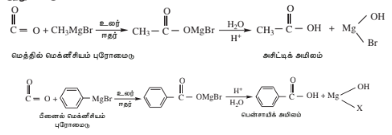
**5. அசைல் ஹலைடுகள் மற்றும் நீரிலிகளின் நீராற்பகுப்பு**

a) அமில குளோரைடுகள் நீரால் நீராற்பகுப்பு செய்யப்படும்போது கார்பாக்சிலிக் அமிலங்களைத் தருகின்றன.

**எடுத்துக்காட்டு:**

$$\begin{array}{ccc} \begin{array}{c} \text{CH}_3 - \text{C} - \text{Cl} \\ \parallel \\ \text{O} \end{array} + \text{H}_2\text{O} & \longrightarrow & \begin{array}{c} \text{CH}_3 - \text{C} - \text{OH} \\ \parallel \\ \text{O} \end{array} + \text{HCl} \\ \text{\small அசிட்டைல் குளோரைடு} & & \text{\small அசிட்டிக் அமிலம்} \end{array}$$

b) அமில நீரிலிகளை நீராற்பகுக்கும்போது அவை கார்பாக்சிலிக் அமிலங்களை தருகின்றன..

$$\begin{array}{ccc} \text{CH}_3 - \begin{array}{c} \text{C} \\ \parallel \\ \text{O} \end{array} - \text{O} - \begin{array}{c} \text{C} \\ \parallel \\ \text{O} \end{array} - \text{CH}_3 + \text{H}_2\text{O} & \longrightarrow & 2\text{CH}_3 - \begin{array}{c} \text{C} \\ \parallel \\ \text{O} \end{array} - \text{OH} \\ \text{\small அசிட்டிக் அமில நீரிலி} & & \text{\small அசிட்டிக் அமிலம்} \\ \\ \text{C}_6\text{H}_5 - \begin{array}{c} \text{C} \\ \parallel \\ \text{O} \end{array} - \text{O} - \begin{array}{c} \text{C} \\ \parallel \\ \text{O} \end{array} - \text{C}_6\text{H}_5 + \text{H}_2\text{O} & \longrightarrow & 2\text{C}_6\text{H}_5 - \begin{array}{c} \text{C} \\ \parallel \\ \text{O} \end{array} - \text{OH} \\ \text{\small பென்சாயிக் நீரிலி} & & \text{\small பென்சாயிக் அமிலம்} \end{array}$$

**6. ஆல்க்கைல் பென்சீன்களின் ஆக்சிஜனேற்றம்**

ஆல்கைல் பென்சீன்களை குரோமிக் அமிலம் அல்லது அமில அல்லது காரங்கலந்த பொட்டாசியம் பெர்மாங்கனேட்டை கொண்டு வலிமையாக ஆக்ஸிஜனேற்றம் செய்து அரோமேடிக் கார்பாக்சிலிக் அமிலங்களை தயாரிக்க முடியும். பக்கச் சங்கிலியின் நீளத்தை சாராமல் முழுமையாக ஆக்ஸிஜனேற்றமடைந்து –COOH தொகுதியாக மாறுகிறது.

**எடுத்துக்காட்டு:**

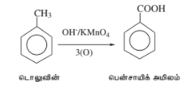

>**தன் மதிப்பீடு**
>
>1. n-புரப்பைல் பென்சீனை $\text{H}^+ / \text{KMnO}_4$ கொண்டு ஆக்சிஜனேற்றம் செய்யும்போது நிகழ்வதென்ன?
>2. கிரிக்னார்டு வினைக்காரணியை பயன்படுத்தி பென்சாயிக் அமிலத்தை எவ்வாறு தயாரிப்பாய்?

## 12.11 கார்பாக்சிலிக் அமிலங்களின் இயற்பண்புகள்.

i) ஒன்பது கார்பன் அணுக்கள் வரை கொண்ட அலிஃபாடிக் கார்பாக்சிலிக் அமிலங்கள் நிறமற்ற காரநெடியுடைய திரவங்களாகும். உயர் கார்பன் எண்ணிக்கை கொண்டவை மணமற்ற மெழுகுத் தன்மை கொண்ட திண்மங்களாகும்.

ii) ஒப்பிடத்தக்க மூலக்கூறு நிறைகள் கொண்ட ஆல்டிஹைடுகள், கீட்டோன்கள் ம்ற்றும் ஆல்கஹால்களை ஒப்பிடும்போது கார்பாக்சிலிக் அமிலங்கள் அதிக கொதிநிலையை பெற்றுள்ளன. கார்பாக்சிலிக் அமில மூலக்கூறுகளுக்கிடைப்பட்டஹைட்ரஜன் பிணைப்புகளால் உருவாகும் மூலக்கூறுகள் இணைவே இதற்கு காரணமாகும்.

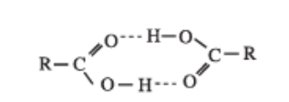

மூலக்கூறுகளுக்கிடைப்பட்ட ஹைட்ரஜன் பிணைப்பு

உண்மையில் பெரும்பாலான கார்பாக்சிலிக் அமிலங்கள் ஆவி நிலையில் இருபடி மூலக்கூறுகளாக காணப்படுகின்றன.

iii) குறைந்த கார்பன் எண்ணிக்கை (நான்கு கார்பன் அணுக்கள் வரை) கொண்ட அலிஃபாடிக் கார்பாக்சிலிக் அமிலங்கள் நீருடன் ஹைட்ரஜன் பிணைப்புகளை உருவாக்குவதால் நீரில் கரைகின்றன. உயர் கார்பாக்சிலிக் அமிலங்களின் ஹைட்ரோ கார்பன் பகுதியின் அதிகரிக்கப்பட்ட நீர்வெறுக்கும் தன்மை காரணமாக அவை நீரில் கரைவதில்லை. எளிய அரோமேடிக் கார்பாக்சிலிக் அமிலமான பென்சாயிக் அமிலம் நீரில் கரைவதில்லை.

iv) வினிகர் என்பது நீரில் உள்ள 6 முதல் 8% வரையிலான அசிட்டிக் அமில கரைசலாகும். தூய அசிட்டிக் அமிலமானது "உறை அசிட்டிக் அமிலம்" என்றழைக்கப்படுகிறது. ஏனெனில் இவற்றை குளிர்விக்கும் போது பனிக்கட்டி போன்ற படிகங்களை உருவாக்குகின்றன. நீர்த்த அசிட்டிக் அமிலத்தை 289.5 K வெப்பநிலைக்கு குளிர்விக்கும்போது அது உறைந்து பனிக்கட்டி போன்ற படிகங்களை உருவாகின்றன. நீர் திரவநிலையிலேயே இருப்பதால் வடிகட்டி நீக்கப்படுகிறது. இச்செயல்முறையானது மீண்டும் மீண்டும் நிகழ்த்தப்பட்டு உறை அசிட்டிக் அமிலம் உருவாகிறது.

## 12.12 கார்பாக்சிலிக் அமிலங்களின் வேதிப் பண்புகள்
கார்பாக்சிலிக் அமிலங்களிலுள்ள கார்பனைல் தொகுதியானது உடனிசைவில் ஈடுபடுவதால், ஆல்டிஹைடுகள் மற்றும் கீட்டோன்களைப் போல $\text{＞C = O}$
கார்பாக்சிலிக் அமிலங்கள் கார்பனைல்
தொகுதிக்கான சிறப்புப் பண்புகளை பெற்றிருக்கவில்லை.

கார்பாக்சிலிக் அமிலங்களின் வினைகளை பின்வருமாறு வகைப்படுத்தலாம்:

A) O – H பிணைப்பு பிளவுறும் வினைகள்.

B) C – OH பிணைப்பு பிளவுறும் வினைகள்.

C) – COOH தொகுதி பங்கேற்கும் வினைகள்

D) ஹைட்ரோகார்பன் பகுதி பங்கேற்கும் பதிலீட்டு வினைகள்.

### A) O-H பிணைப்பின் பிளவை உள்ளடக்கிய வினைகள்

**1) உலோகங்களுடனான வினைகள்**

Na, Mg, Zn போன்ற வினைத்திறன் மிக்க உலோகங்களுடன் கார்பாக்சிலிக் அமிலங்கள் வினைபட்டு ஹைட்ரஜன் வாயுவை வெளியேற்றி உப்புகளைத் தருகின்றன.

**எடுத்துக்காட்டு:**

$$\begin{array}{ccc} 2\ \begin{array}{c} \text{O} \\ \parallel \\ \text{CH}_3 - \text{C} - \text{OH} \end{array} + 2\text{Na} & \longrightarrow & 2\ \begin{array}{c} \text{O} \\ \parallel \\ \text{CH}_3 - \text{C} - \text{ONa} \end{array} + \text{H}_2 \\ \text{\small அசிட்டிக் அமிலம்} & & \text{\small சோடியம் அசிட்டேட்} \end{array}$$

#### 2) காரங்களுடனான வினை

கார்பாக்சிலிக் அமிலங்கள் காரங்களுடன் வினைப்பட்டு அவற்றை நடுநிலையாக்குவதன் மூலம் உப்புகளை தருகின்றன.

**எடுத்துக்காட்டு:**

$$\begin{array}{ccc} \begin{array}{c} \text{O} \\ \parallel \\ \text{CH}_3 - \text{C} - \text{OH} \end{array} + \text{NaOH} & \longrightarrow & \begin{array}{c} \text{O} \\ \parallel \\ \text{CH}_3 - \text{C} - \text{ONa} \end{array} + \text{H}_2\text{O} \\ \text{\small அசிட்டிக் அமிலம்} & & \text{\small சோடியம் அசிட்டேட்} \end{array}$$

**3) கார்பனேட்டுகள் மற்றும் பைகார்பனேட்டுகளுடன் வினை (கார்பாக்சிலிக் அமில தொகுதிக்கான சோதனை)**

கார்பாக்சிலிக் அமிலங்கள், கார்பனேட்டுகள் மற்றும் பைகார்பனேட்டுகளை சிதைப்பதால் நுரைத்த பொங்குதலுடன் கார்பன் டை ஆக்சைடு வெளியேறுகிறது.

**எடுத்துக்காட்டு**

$$\begin{array}{ccc} 2\text{CH}_3 - \begin{array}{c} \text{O} \\ \parallel \\ \text{C} \end{array} - \text{OH} + \text{Na}_2\text{CO}_3 & \longrightarrow & 2\text{CH}_3 - \begin{array}{c} \text{O} \\ \parallel \\ \text{C} \end{array} - \text{ONa} + \text{CO}_2 + \text{H}_2\text{O} \\ \text{\small அசிட்டிக் அமிலம்} & & \text{\small சோடியம் அசிட்டேட்} \end{array}$$

**4) அனைத்து கார்பாக்சிலிக் அமிலங்களும் நீல நிற லிட்மஸ் தாளை சிவப்பாக மாற்றுகின்றன.**

**B) $\text{C} - \text{OH}$ பிணைப்பு பிளவுறும் வினைகள்.**

**1) $\text{PCl}_5$, $\text{PCl}_3$ மற்றும் $\text{SOCl}_2$ உடன் வினை:**

கார்பாக்சிலிக் அமிலங்களின் ஹைட்ராக்சில் தொகுதியானது, ஆல்கஹால் தொகுதியைப் போலவே நடந்துகொள்கின்றன, மேலும், $\text{PCl}_5$, $\text{PCl}_3$ மற்றும் $\text{SOCl}_2$ ஆகியவற்றுடன் வினைப்படுத்தும்போது குளோரின் அணுக்களால் எளிதில் பதிலீடு செய்யப்படுகிறது.

**எடுத்துக்காட்டு**

$$\begin{array}{ccc} \text{CH}_3 - \begin{array}{c} \text{O} \\ \parallel \\ \text{C} \end{array} - \text{OH} + \text{PCl}_5 & \longrightarrow & \text{CH}_3 - \begin{array}{c} \text{O} \\ \parallel \\ \text{C} \end{array} - \text{Cl} + \text{POCl}_3 + \text{HCl} \\ \text{\small அசிட்டிக் அமிலம்} & & \text{\small அசிட்டைல் குளோரைடு} \end{array}$$

$$\begin{array}{ccc} \text{C}_6\text{H}_5 - \begin{array}{c} \text{O} \\ \parallel \\ \text{C} \end{array} - \text{OH} + \text{SOCl}_2 & \longrightarrow & \text{C}_6\text{H}_5 - \begin{array}{c} \text{O} \\ \parallel \\ \text{C} \end{array} - \text{Cl} + \text{SO}_2 + \text{HCl} \\ \text{\small பென்சாயிக் அமிலம்} & & \text{\small பென்சாயில் குளோரைடு} \end{array}$$

**2) ஆல்கஹால்களுடன் வினைகள் ( எஸ்டராக்கல்)**

கார்பாக்சிலிக் அமிலங்களை அடர். $\text{H}_2\text{SO}_4$ அல்லது உலர் $\text{HCl}$ வாயு முன்னிலையில் ஆல்கஹால்களுடன் சேர்த்து வெப்பப்படுத்தும்போது எஸ்டர்கள் உருவாகின்றன. இது ஒரு மீள்வினையாகும், மேலும் இது எஸ்டராக்கல் என்றழைக்கப்படுகிறது.

**எடுத்துக்காட்டு**

$$\begin{array}{ccc} \text{C}_6\text{H}_5 - \begin{array}{c} \text{O} \\ \parallel \\ \text{C} \end{array} - \text{OH} + \text{C}_2\text{H}_5\text{OH} & \xrightarrow{\text{H}^+} & \text{C}_6\text{H}_5 - \begin{array}{c} \text{O} \\ \parallel \\ \text{C} \end{array} - \text{OC}_2\text{H}_5 + \text{H}_2\text{O} \\ \text{\small பென்சாயிக் அமிலம்} & & \text{\small எத்தில் பென்சோயேட்} \end{array}$$

**எஸ்டராக்கல் வினையின் வினைவழி முறை:**

எஸ்டராக்கல் வினையானது பின்வரும் படிகளில் நிகழ்கிறது.

**C) $\mathbf{- \text{COOH}}$ தொகுதி ஈடுபடும் வினைகள்**

**1) ஒடுக்கம்**

**i) ஆல்கஹால்களாக பகுதியளவு ஒடுக்கமடைதல்**
கார்பாக்சிலிக் அமிலங்கள், $\text{LiAlH}_4$ அல்லது காப்பர் குரோமைட் வினைவேக மாற்றி முன்னிலையில் ஹைட்ரஜனுடன் சேர்ந்து ஒடுக்கமடைந்து ஒரிணைய ஆல்கஹால்களாக மாறுகின்றன. சோடியம் போரோஹைட்ரைடு $-\text{COOH}$ தொகுதியை ஒடுக்குவதில்லை.

**எடுத்துக்காட்டு**

$$\begin{array}{ccc} \text{CH}_3 - \begin{array}{c} \text{O} \\ \parallel \\ \text{C} \end{array} - \text{OH} & \xrightarrow[\text{4(H)}]{\text{LiAlH}_4} & \text{CH}_3\text{CH}_2\text{OH} + \text{H}_2\text{O} \\ \text{\small எத்தனோயிக் அமிலம்} & & \text{\small எத்தனால்} \end{array}$$

**ii) ஆல்கேன்களாக முழுமையாக ஒடுக்கமடைதல்**
$\text{HI}$ மற்றும் சிவப்பு பாஸ்பரசுடன் வினைப்படுத்தும்போது கார்பாக்சிலிக் அமிலமானது முழுமையாக ஒடுக்கமடைந்து அதே எண்ணிக்கையிலான கார்பன் அணுக்களைக் கொண்ட ஆல்கேன்களாக மாறுகின்றன.

**எடுத்துக்காட்டு**

$$\begin{array}{ccc} \text{CH}_3 - \begin{array}{c} \text{O} \\ \parallel \\ \text{C} \end{array} - \text{OH} + 6\text{HI} & \xrightarrow[\text{473 K}]{\text{சிவப்பு P}} & \text{CH}_3 - \text{CH}_3 + 3\text{I}_2 + 2\text{H}_2\text{O} \\ \text{\small அசிட்டிக் அமிலம்} & & \text{\small ஈத்தேன்} \end{array}$$

**2) கார்பாக்சில் தொகுதி நீக்க வினை:**
கார்பாக்சில் தொகுதியிலிருந்து $\text{CO}_2$ வாயு நீங்கும் வினையானது கார்பாக்சில் தொகுதி நீக்க வினை என்றழைக்கப்படுகிறது. கார்பாக்சிலிக் அமிலங்களின் சோடியம் உப்பை சோடா சுண்ணாம்புடன் (3:1 என்ற விகிதத்தில் $\text{NaOH}$ மற்றும் $\text{CaO}$) வெப்பப்படுத்தும்போது, அவை கார்பன் டை ஆக்சைடை இழந்து ஹைட்ரோ கார்பன்களை உருவாக்குகின்றன.

**எடுத்துக்காட்டு**

$$\begin{array}{ccc} \text{CH}_3 - \begin{array}{c} \text{O} \\ \parallel \\ \text{C} \end{array} - \text{ONa} + \text{NaOH} & \xrightarrow[\Delta]{\text{CaO}} & \text{CH}_4 + \text{Na}_2\text{CO}_3 \\ \text{\small சோடியம் அசிட்டேட்} & & \text{\small மீத்தேன்} \end{array}$$

**3) கோல்ப் மின்னாற்பகுப்பு கார்பாக்சில் தொகுதி நீக்கம்**
கார்பாக்சிலிக் அமிலங்களின் சோடியம் அல்லது பொட்டாசியம் உப்புகளின் நீர்க்கரைசல்களை மின்னாற்பகுக்கும்போது நேர்மின்முனையில் ஆல்கேன்கள் வெளியேறுகின்றன. இவ்வினையானது கோல்ப் மின்னாற்பகுத்தல் வினை என்றழைக்கப்படுகிறது.

$$\begin{array}{ccccc} \begin{array}{c} \text{CH}_3\text{COONa} \\ + \\ \text{CH}_3\text{COONa} \end{array} & \xrightarrow{\text{\scriptsize மின்னாற்பகுப்பு}} & \begin{array}{c} \text{CH}_3 \\ \vert{} \\ \text{CH}_3 \end{array} + 2\text{CO}_2 & + & 2\text{Na} \\ \text{\small சோடியம் அசிட்டேட்} & & \text{\small நேர்மின்வாய்} & & \text{\small எதிர்மின்வாய்} \end{array}$$

நீராற்பகுத்தலில், சோடியம் ஃபார்மேட் கரைசலானது ஹைட்ரஜனைத் தருகிறது.

#### 4) அம்மோனியாவுடனான வினை

கார்பாக்சிலிக் அமிலங்கள் அம்மோனியாவுடன் வினைபுரிந்து அம்மோனியம் உப்பை உருவாக்குகின்றன, இது அதிக வெப்பநிலையில் மேலும் சூடுபடுத்தப்படும்போது அமைடுகளைத் தருகிறது.

**எடுத்துக்காட்டு:**
$$\begin{array}{rccrc} \begin{array}{c} \text{O} \\ \parallel \\ \text{CH}_3 - \text{C} - \text{OH} \end{array} + \text{NH}_3 & \longrightarrow & \begin{array}{c} \text{O} \\ \parallel \\ \text{CH}_3 - \text{C} - \bar{\text{O}}\overset{+}{\text{N}}\text{H}_4 \end{array} & \xrightarrow{\quad\Delta\quad} & \begin{array}{c} \text{O} \\ \parallel \\ \text{CH}_3 - \text{C} - \text{NH}_2 \end{array} + \text{H}_2\text{O} \\ \text{\small அசிட்டிக் அமிலம்} \qquad\qquad & & \text{\small அம்மோனியம் அசிட்டேட்} \qquad & & \text{\small அசிட்டமைடு} \qquad\qquad \end{array}$$

**5) $\mathbf{P_2O_5}$ முன்னிலையில் வெப்பத்தின் விளைவு**

$\mathbf{P_2O_5}$ போன்ற வலிமை மிகுந்த நீர்நீக்கும் காரணிகளுடன் சேர்த்து வெப்பப்படுத்தும்போது கார்பாக்சிலிக் அமிலங்கள் அவற்றின் அமில நீரிலிகளை உருவாக்குகின்றன.

**எடுத்துக்காட்டு**

**D) ஹைட்ரோகார்பன் பகுதி பங்கேற்கும் பதிலீட்டு வினைகள்.**

**1) $\mathbf{\alpha}$ - ஹேலஜனேற்றம்**

$\alpha$ - ஹைட்ரஜனைக் கொண்டுள்ள கார்பாக்சிலிக் அமிலங்களை, சிறிதளவு சிவப்பு பாஸ்பரஸ் முன்னிலையில், குளோரின் அல்லது புரோமின் உடன் வினைப்படுத்தும்போது $\alpha$ - கார்பன் அணுவில் ஹேலஜனேற்றம் அடைந்து $\alpha$ ஹேலோ கார்பாக்சிலிக் அமிலங்களை உருவாக்குகின்றன. இந்த வினையானது ஹெல் – வோல்ஹார்ட் – ஜெலின்ஸ்கி வினை (HVZ வினை) என்றழைக்கப்படுகிறது. இந்த $\alpha$ - ஹேலஜனேற்றம் பெற்ற அமிலங்களானவை, $\alpha$ - பதிலீடு செய்யப்பட்ட அமிலங்களை தயாரிப்பதற்கான உகந்த துவக்கச் சேர்மங்களாக விளங்குகின்றன.

$$\begin{array}{ccc} \text{CH}_3 - \text{COOH} & \xrightarrow[\text{H}_2\text{O}]{\text{Cl}_2 \ / \ \text{சிவப்பு P}_4} & \begin{array}{c} \text{CH}_2 - \text{COOH} \\ \vert{} \\ \text{Cl} \end{array} \\ \text{\small அசிட்டிக் அமிலம்} & & \begin{array}{c} \text{\small மோனோ குளோரோ} \\ \text{\small அசிட்டிக் அமிலம்} \end{array} \end{array}$$

**2) அரோமேடிக் கார்பாக்சிலிக் அமிலங்களில் எலக்ட்ரான் கவர் பதிலீட்டு வினைகள்**

அரோமேடிக் கார்பாக்சிலிக் அமிலங்கள் எலக்ட்ரான் கவர் பதிலீட்டு வினைகளுக்கு உட்படுகின்றன. கார்பாக்சில் தொகுதியானது கிளர்வுநீக்கும் மற்றும் மெட்டா ஆற்றுப்படுத்தும் தொகுதியாகும். பென்சாயிக் அமிலத்தின் சில பொதுவான எலக்ட்ரான் கவர் பதிலீட்டு வினைகள் கீழே கொடுக்கப்பட்டுள்ளன.

**i) ஹலோஜனேற்றம்**

**ii) நைட்ரேற்றம்**

**iii) சல்ஃபோனேற்றம்**

iv) பென்சாயிக் அமிலம் ஃப்ரீடல்-கிராஃப்ட்ஸ் வினைகளுக்கு உட்படுவதில்லை. இது கார்பாக்சில் குழுவின் வலுவான செயலிழக்கச் செய்யும் தன்மை காரணமாகும்.

### E) ஃபார்மிக் அமிலத்தின் ஒடுக்கும் பண்பு

ஃபார்மிக் அமிலமானது ஆல்டிஹைடு மற்றும் அமில தொகுதி என இரண்டையும் ஒருசேர கொண்டுள்ளது. எனவே மற்ற ஆல்டிஹைடுகளைப் போல ஃபார்மிக் அமிலமும் எளிதில் ஆக்ஸிஜனேற்றம் அடைவதால், அது, ஒடுக்கும் காரணியாக செயல்படுகிறது.

i) ஃபார்மிக் அமிலம் டோலன்ஸ் வினைப்பொருளை (அம்மோனியாகல் வெள்ளி நைட்ரேட் கரைசல்) உலோக வெள்ளியாக ஒடுக்குகிறது.
$$\begin{array}{ccc} \text{HCOO}^- + 2\text{Ag}^+ + 3\text{OH}^- & \longrightarrow & 2\text{Ag} \downarrow + \text{CO}_3^{2-} + 2\text{H}_2\text{O} \\ (\text{\small டாலன்ஸ் காரணி}) & & \text{\small வெள்ளி ஆடி} \end{array}$$

ii) ஃபார்மிக் அமிலம், ஃபெலிங் கரைசலை ஒடுக்குகிறது. இது நீல நிற குப்ரிக் அயனிகளை சிவப்பு நிற குப்ரஸ் அயனிகளாக ஒடுக்குகிறது.

$$\begin{array}{ccc} \text{HCOO}^- + 2\text{Cu}^{2+} + 5\text{OH}^- & \longrightarrow & \text{Cu}_2\text{O} \downarrow + \text{CO}_3^{2-} + 3\text{H}_2\text{O} \\ \text{\small ஃபெலிங் கரைசல்} & & \text{\small சிவப்பு நிற வீழ்படிவு} \end{array}$$

**கார்பாக்சிலிக் அமில தொகுதிக்கான சோதனைகள்**

i) கார்பாக்சிலிக் அமிலங்களின் நீர்த்த கரைசல்கள் நீல நிற லிட்மஸ் தாளை சிவப்பு நிறமாக மாற்றுகின்றன.

ii) கார்பாக்சிலிக் அமிலங்களை, சோடியம் பைகார்பனேட் கரைசலுடன் சேர்க்கும்போது நுரைத்த பொங்குதலுடன் கார்பன் டை ஆக்சைடு வெளியேறுகிறது.

iii) கார்பாக்சிலிக் அமிலத்தை, ஆல்கஹால் மற்றும் அடர் $\text{H}_2\text{SO}_4$ உடன் சேர்த்து வெப்பப்படுத்தும்போது அவை எஸ்டரை உருவாக்குகின்றன. இந்த எஸ்டரானது அதன் பழ மணத்தினால் கண்டறியப்படுகிறது.

## 12.13 கார்பாக்சிலிக் அமிலங்களின் அமிலத்தன்மை

**12.13 கார்பாக்சிலிக் அமிலங்களின் அமிலத்தன்மை**

நீரில் கரைக்கப்படும்போது, கார்பாக்சிலிக் அமிலங்கள் அயனியாக்கமடைந்து $\text{H}^+$ அயனிகள் மற்றும் கார்பாக்சிலேட் அயனிகளை தருகின்றன. இந்த கார்பாக்சிலேட் அயனிகள் உடனிசைவால் நிலைப்புத்தன்மையை பெறுகின்றன. இதனால் கார்பாக்சிலிக் அமிலங்கள் எளிதாக ஒரு புரோட்டானை இழக்கும் தன்மையினைப் பெறுகின்றன.

$$\begin{array}{ccc} \begin{array}{c} \text{O} \\ \parallel \\ \text{R} - \text{C} - \text{OH} \end{array} & \rightleftharpoons & \begin{array}{c} \text{O} \\ \parallel \\ \text{R} - \text{C} - \text{O}^- \end{array} + \text{H}^+ \\ \text{\small கார்பாக்சிலிக் அமிலம்} & & \text{\small கார்பாக்சிலேட் அயனி} \end{array}$$

கார்பாக்சிலேட் அயனியின் உடனிசைவு அமைப்புகள் கீழே கொடுக்கப்பட்டுள்ளன.

கார்பாக்சிலிக் அமிலங்களின் வலிமையை அவற்றின் பிரிகை மாறிலி $(\text{Ka})$ மதிப்புகள் வாயிலாக குறிப்பிட முடியும்.

ஒரு அமிலத்தின் பிரிகை மாறிலியானது, அதன் ஒப்பு அமிலத்தன்மையை குறிப்பிடும் அளவாக இருப்பதால், பொதுவாக "அமிலத்துவ மாறிலி" என்றழைக்கப்படுகிறது. அமிலம் வலிமை மிகுந்ததாக இருப்பின் அதன் $\text{Ka}$ மதிப்பு அதிகமாக இருக்கும்.

அமிலத்தின் பிரிகை மாறிலியை அதன் $\text{pKa}$ மதிப்பாகவும் குறிப்பிட முடியும்.

$$\text{pKa} = -\log \text{Ka}$$

வலிமைமிகு அமிலமானது உயர் $\text{Ka}$ மதிப்பையும், தாழ்ந்த $\text{pKa}$ மதிப்பையும்கொண்டிருக்கும்.

**298 K வெப்பநிலையில் சில கார்பாக்சிலிக் அமிலங்களின் Ka மற்றும் pKa மதிப்புகள்**

| **கார்பாக்சிலிக் அமிலம்** |  |**pKa மதிப்பு**  |
| --- | --- | --- |
| **அமிலத்தின் பெயர்** | **மூலக்கூறு வாய்ப்பாடு** |  |
| ட்ரைகுளோரோ அசிட்டிக் அமிலம் | $\text{Cl}_3\text{CCOOH}$ | 0.64 |
| டைகுளோரோ அசிட்டிக் அமிலம் | $\text{Cl}_2\text{CHCOOH}$ | 1.26 |
| புளுரோ அசிட்டிக் அமிலம் | $\text{FCH}_2\text{COOH}$ | 2.59 |
| குளோரோ அசிட்டிக் அமிலம் | $\text{ClCH}_2\text{COOH}$ | 2.87 |
| புரோமோஅசிட்டிக் அமிலம் | $\text{BrCH}_2\text{COOH}$ | 2.90 |
| அயோடோ அசிட்டிக் அமிலம் | $\text{ICH}_2\text{COOH}$ | 3.17 |
| ஃபார்மிக் அமிலம் | $\text{HCOOH}$ | 3.75 |
| பென்சாயிக் அமிலம் | $\text{C}_6\text{H}_5\text{COOH}$ | 4.20 |
| அசிட்டிக் அமிலம் | $\text{CH}_3\text{COOH}$ | 4.76 |
| புரப்பனாயிக் அமிலம் | $\text{CH}_3\text{CH}_2\text{COOH}$ | 4.88 |
| o - நைட்ரோபென்சாயிக் அமிலம் | $o\text{-NO}_2\text{C}_6\text{H}_4\text{COOH}$ | 2.17 |
| m- நைட்ரோபென்சாயிக் அமிலம் | $m\text{-NO}_2\text{C}_6\text{H}_4\text{COOH}$ | 3.49 |
| p- நைட்ரோபென்சாயிக் அமிலம் | $p\text{-NO}_2\text{C}_6\text{H}_4\text{COOH}$ | 3.44 |

**கார்பாக்சிலிக் அமிலங்களின் அமிலத்தன்மை மீதான பதிலீடு தொகுதிகளின் விளைவு.**

**i) எலக்ட்ரான் உள்தள்ளும் ஆல்கைல் தொகுதி அமிலத்தன்மையை குறைக்கின்றது.**

எலக்ட்ரான் உள்தள்ளும் தொகுதிகள் ($+\text{I}$ தொகுதிகள்) கார்பாக்சிலேட் அயனியின் மீதுள்ள எதிர்மின்சுமையை அதிகரிப்பதால், அதன் நிலைப்புத் தன்மையை குறைகிறது. இதனால் புரோட்டான் வெளியேற்றம் கடினமாகிறது. எடுத்துக்காட்டாக, ஃபார்மிக் அமிலமானது அசிட்டிக் அமிலத்தை விட அதிக அமிலத்தன்மையை கொண்டுள்ளது.
$$\begin{array}{ccccc} \begin{array}{c} \text{O} \\ \parallel \\ \text{H} - \text{C} - \text{OH} \end{array} & > & \begin{array}{c} \text{O} \\ \parallel \\ \text{CH}_3 - \text{C} - \text{OH} \end{array} & > & \begin{array}{c} \text{O} \\ \parallel \\ \text{CH}_3 - \text{CH}_2 - \text{C} - \text{OH} \end{array} \\ \text{\small ஃபார்மிக் அமிலம்} & & \text{\small அசிட்டிக் அமிலம்} & & \text{\small புரப்பனாயிக் அமிலம்} \end{array}$$

**ii) எலக்ட்ரான் வெளியீர்க்கும் தொகுதிகள் அமிலத்தன்மையை அதிகரிக்கின்றன.**

எலக்ட்ரான் வெளியீர்க்கும் தன்மை கொண்ட பதிலீடு தொகுதிகள், கார்பாக்சிலேட் அயனியின் மீதுள்ள எதிர்மின்சுமையை குறைப்பதால், அதன் நிலைப்புத் தன்மையை அதிகரிக்கிறது. இதனால் புரோட்டான் வெளியேற்றம் ஒப்பீட்டளவில் எளிதாக நிகழ்கிறது.

பதிலீடுகளின் எலக்ட்ரான் கவர்தன்மை அதிகரிக்கும்போது அமிலத்தன்மையும் அதிகரிக்கிறது. எடுத்துக்காட்டாக, பல்வேறு ஹேலோ அசிட்டிக் அமிலங்களின் அமிலத்தன்மை பின்வரும் வரிசையில் அமைகிறது.

$$\text{F} - \text{CH}_2 - \text{COOH} > \text{Cl} - \text{CH}_2 - \text{COOH} > \text{Br} - \text{CH}_2 - \text{COOH} > \text{I} - \text{CH}_2 - \text{COOH}$$

$\alpha$ - கார்பனில் இணைந்துள்ள எலக்ட்ரான் வெளியீர்க்கும் தொகுதிகளின் எண்ணிக்கை அதிகரிக்கும்போது அமிலத்தன்மை அதிகரிக்கிறது. எடுத்துக்காட்டாக

$$\text{Cl}_3\text{C} - \text{COOH} > \text{Cl}_2\text{CH} - \text{COOH} > \text{ClCH}_2\text{COOH} > \text{CH}_3\text{COOH}$$

கார்பாக்சிலிக் அமிலத்தின் அமிலத்தன்மை மீதான பல்வேறு எலக்ட்ரான் வெளியீர்க்கும் தொகுதிகளின் விளைவுகள் பின்வரும் வரிசையில் அமைகிறது.

$$-\text{NO}_2 > -\text{CN} > -\text{F} > -\text{Cl} > -\text{Br} > -\text{I} > -\text{Ph}$$

பல்வேறு கரிம சேர்மங்களின் ஒப்பு அமிலத்தன்மை பின்வருமாறு

$$\text{RCOOH} > \text{ArOH} > \text{H}_2\text{O} > \text{ROH} > \text{RC} \equiv \text{CH}$$

## 12.14 கார்பாக்சிலிக் அமிலங்களின் செயல் வழிப்பொருட்கள்
**12.14 கார்பாக்சிலிக் அமில பெறுதிகள்**

அமில குளோரைடுகள், அமைடுகள், எஸ்டர்கள் போன்றவை கார்பாக்சிலிக் அமில பெறுதிகள் என்றழைக்கப்படுகின்றன. ஏனெனில், அவை கார்பாக்சிலிக் அமிலத்தின் $-\text{OH}$ தொகுதியை பதிலீடு செய்த அணு அல்லது தொகுதியின் தன்மையில் மட்டுமே கார்பாக்சிலிக் அமிலங்களிலிருந்து வேறுபடுகின்றன.

|  $-\text{OH}$ ஐ பதிலீடு செய்யும் தொகுதி | பெயர் | அமைப்பு | எடுத்துக்காட்டு |
| :---: | :---: | :---: | :---: |
| $-\text{Cl}$ | அமில குளோரைடு | $$ \begin{array}{c} \text{O} \\ \parallel \\ \text{R}-\text{C}-\text{Cl} \end{array} $$ | $$ \begin{array}{c} \text{O} \\ \parallel \\ \text{CH}_3-\text{C}-\text{Cl} \\ \text{அசிடடைல் குளோரைடு} \end{array} $$ |
| $-\text{NH}_2$ | அமில அமைடு | $$ \begin{array}{c} \text{O} \\ \parallel \\ \text{R}-\text{C}-\text{NH}_2 \end{array} $$ | $$ \begin{array}{c} \text{O} \\ \parallel \\ \text{CH}_3-\text{C}-\text{NH}_2 \\ \text{அசிட்டமைடு} \end{array} $$ |
| $-\text{OR}'$ | எஸ்டர் | $$ \begin{array}{c} \text{O} \\ \parallel \\ \text{R}-\text{C}-\text{OR}' \end{array} $$ | $$ \begin{array}{c} \text{O} \\ \parallel \\ \text{CH}_3-\text{C}-\text{OCH}_3 \\ \text{மெத்தில் அசிட்டேட்} \end{array} $$ |
| $-\text{OOCR}$ | அமில நீரிலி | $$ \begin{array}{ccc} \text{O} & & \text{O} \\ \parallel & & \parallel \\ \text{R}-\text{C} & -\text{O}-&\text{C}-\text{R} \end{array} $$ | $$\begin{array}{ccc}\text{O} & & \text{O} \\[-0.5ex]\parallel & & \parallel \\[-0.5ex]\text{CH}_3-\text{C} & \!-\text{O}-\! & \text{C}-\text{R} \\& \text{அசிட்டிக் அமில நீரிலி} & \end{array}$$|

**அமில பெறுதிகளின் ஒப்பு வினைத்திறன்**

பெறுதிகளின் ஒப்பு வினைத்திறனானது பின்வரும் வரிசையில் அமைகிறது:

$$\begin{array}{ccccccc} \begin{array}{c} \text{O} \\ \parallel \\ \text{R} - \text{C} - \text{Cl} \end{array} & > & \begin{array}{c} \text{O} \qquad \text{O} \\ \parallel \qquad \parallel \\ \text{R} - \text{C} - \text{O} - \text{C} - \text{R} \end{array} & > & \begin{array}{c} \text{O} \\ \parallel \\ \text{R} - \text{C} - \text{OR}' \end{array} & > & \begin{array}{c} \text{O} \\ \parallel \\ \text{R} - \text{C} - \text{NH}_2 \end{array} \end{array}$$

i) விட்டுவிலகும் தொகுதியின் காரத்தன்மை, ii) உடனிசைவு விளைவு ஆகிய பண்புகளின் அடிப்படையில் மேற்காண் வினைத்திறன் வரிசையை விளக்க முடியும்.

**(i) விட்டுவிலகும் தொகுதியின் காரத்தன்மை**

வலிமை குறைந்த காரத் தொகுதிகள், சிறந்த விலகிச்செல்லும் தொகுதிகளாகச் செயல்படுகின்றன. எனவே, எளிதாக விலகிச் செல்லும் வலிமை குறைந்த காரத் தொகுதியை ($\text{L}$) கொண்ட அசைல் பெறுதிகள் எளிதாக பிணைப்பை முறித்துக்கொள்வதால் அவை வினைத்திறன் மிக்கவையாகும். விட்டுவிலகிச் செல்லும் தொகுதியின் காரத்தன்மையின் சரியான வரிசை $\text{H}_2\text{N}^- > \text{}^-\text{OR} > \text{RCOO}^- > \text{Cl}^-$. இதன் தலைகீழ் வரிசையில் அவற்றின் வினைத்திறன் அமைகிறது.

**(ii) உடனிசைவு விளைவு**

விட்டு விலகிச்செல்லும் தொகுதியின் எலக்ட்ரான் கவர்தன்மை குறையும்போது, அதன் உடனிசைவு நிலைப்புத்தன்மை கீழே காட்டியுள்ளவாறு அதிகரிக்கிறது.

இந்த விளைவின் காரணமாக மூலக்கூறு அதிக நிலைப்புத்தன்மையை பெறுவதால் அசைல் சேர்மத்தின் வினைத்திறன் குறைகிறது. விலகிச்செல்லும் தொகுதிகளின் எலக்ட்ரான் கவர்தன்மை பின்வரும் வரிசையில் அமைகிறது:

$$\text{Cl} > -\text{OCOR} > -\text{OR} > -\text{NH}_2$$

எனவே, கருக்கவர் காரணிகளுடனான அமில பெறுதிகளின் வினைத்திறன் வரிசை:
**அமில ஹேலைடுகள் > அமில நீரிலிகள் > எஸ்டர்கள் > அமில அமைடுகள்**
#### 12.14.1 பெயரிடல்
Here is the transcription of the Tamil tables from the provided images, formatted to match the English structure:

| சேர்மம்   (பொதுப்பெயர், அமைப்பு   வாய்ப்பாடு, IUPAC பெயர்) | IUPAC பெயர் |  |  |  |
| --- | --- | --- | --- | --- |
|  | இட எண்ணுடன்  முன்னொட்டு | **மூலச் சொல்** | முதன்மை  பின்னொட்டு | இரண்டாம் பின்னொட்டு |
| அசிட்டைல் குளோரைடு   $$\begin{array}{c} \text{CH}_3-\text{C}-\text{Cl} \\ \parallel \\ \text{O} \end{array}$$  எத்தனாயில்குளோரைடு | $-$ | எத் | ஏன் | ஆயில்   குளோரைடு |
| புரப்பியோனைல் குளோரைடு   $$\begin{array}{c} \text{C}_2\text{H}_5-\text{C}-\text{Cl} \\ \parallel \\ \text{O} \end{array}$$  புரப்பனாயில்குளோரைடு | $-$ | புரப் | ஏன் | ஆயில்   குளோரைடு |
| பென்சாயில் குளோரைடு   $$\begin{array}{c} \text{C}_6\text{H}_5-\text{C}-\text{Cl} \\ \parallel \\ \text{O} \end{array}$$  பென்சாயில்குளோரைடு | $-$ | பென்ச் | ஏன் | ஆயில்   குளோரைடு |
| அசிட்டிக் நீரிலி   $$\begin{array}{ccc} \text{CH}_3-\text{C} & -\text{O}- & \text{C}-\text{CH}_3 \\ \parallel & & \parallel \\ \text{O} & & \text{O} \end{array}$$  எத்தனாயிக் நீரிலி | $-$ | எத் | ஏன் | ஆயிக்   நீரிலி |
| புரப்பியானிக் நீரிலி  $$\begin{array}{ccc} \text{CH}_3-\text{CH}_2-\text{C} & -\text{O}- & \text{C}-\text{CH}_2-\text{CH}_3 \\ \parallel & & \parallel \\ \text{O} & & \text{O} \end{array}$$  புரப்பனாயிக் நீரிலி | $-$ | புரப் | ஏன் | ஆயிக்  நீரிலி |
| பென்சாயிக் நீரிலி    $$\begin{array}{ccc} \text{C}_6\text{H}_5-\text{C} & -\text{O}- & \text{C}-\text{C}_6\text{H}_5 \\ \parallel & & \parallel \\ \text{O} & & \text{O} \end{array}$$  பென்சாயிக் நீரிலி | $-$ | பென்ச் |  | ஆயிக்  நீரிலி |
| **எஸ்டர்கள்** |  |  |  |  |
| மெத்தில் அசிட்டேட்  $$\begin{array}{c} \text{CH}_3-\text{C}-\text{O}-\text{CH}_3 \\ \parallel \\ \text{O} \end{array}$$  மெத்தில் எத்தனோயேட் | மெத்தில் | எத் | என் | ஓயேட் |
| எத்தில் அசிட்டேட்  $$\begin{array}{c} \text{CH}_3-\text{C}-\text{O}-\text{C}_2\text{H}_5 \\ \parallel \\ \text{O} \end{array}$$  எத்தில் எத்தனோயேட் | எத்தில் | எத் | என் | ஓயேட் |
| பீனைல் அசிட்டேட்  $$\begin{array}{c} \text{CH}_3-\text{C}-\text{O}-\text{C}_6\text{H}_5 \\ \parallel \\ \text{O} \end{array}$$  பீனைல் எத்தனோயேட் | பீனைல் | எத் | என் | ஓயேட் |
| **அமில அமைடுகள்** |  |  |  |  |
| அசிட்டமைடு   $$\begin{array}{c} \text{CH}_3-\text{C}-\text{NH}_2 \\ \parallel \\ \text{O} \end{array}$$  எத்தனமைடு | $-$ | எத் | என் | அமைடு |
| புரப்பியோனமைடு  $$\begin{array}{c} \text{C}_2\text{H}_5-\text{C}-\text{NH}_2 \\ \parallel \\ \text{O} \end{array}$$  புரப்பனமைடு | $-$ | புரப் | என் | அமைடு |
| பென்சமைடு   $$\begin{array}{c} \text{C}_6\text{H}_5-\text{C}-\text{NH}_2 \\ \parallel \\ \text{O} \end{array}$$  பென்சமைடு | $-$ | பென்ச் | $-$ | அமைடு |

### 12.14.2 அமில ஹலைடுகள்

**அமில குளோரைடுகளின் தயாரிப்பு முறைகள்:**

அமில குளோரைடுகள் \( SOCl_2 \), \( PCl_5 \) அல்லது \( PCl_3 \) போன்ற குளோரினேற்றும் முகவர்களில் ஒன்றுடன் கார்பாக்சிலிக் அமிலத்தைச் சேர்ப்பதன் மூலம் தயாரிக்கப்படுகின்றன.

**1) தயோனைல் குளோரைடுடன் (SOCl_2) வினை:**

$$\begin{array}{c} \text{O} \\ \parallel \\ \text{CH}_3-\text{C}-\text{OH} \end{array} + \text{SOCl}_2 \longrightarrow \begin{array}{c} \text{O} \\ \parallel \\ \text{CH}_3-\text{C}-\text{Cl} \end{array} + \text{HCl} + \text{SO}_2$$

$$\text{அசிட்டிக் அமிலம் \qquad\qquad\qquad அசிட்டைல் குளோரைடு}$$

இந்த முறை மற்றவற்றை விடச் சிறந்தது, ஏனெனில் உருவாகும் துணை விளைபொருள்கள் வாயுக்களாக வெளியேறி அமில குளோரைடைத் தூய நிலையில் விட்டுச் செல்கின்றன.

**இயற் பண்புகள்:**

- காற்றில் வெளிக்காட்டப்படும் போது இவை நீருடன் வினைபுரிவதால், ஹைட்ரஜன் குளோரைடு வெளிரிய புகையை உருவாக்குகின்றன.

- அவை நீரில் கரையாது, ஆனால் நீராற்பகுத்தலின் காரணமாக மெதுவாக கரையத் தொடங்குகிறது.

**வேதிப் பண்புகள்:**

அமில ஹேலைடுகள், வலிமைகுறைந்த கருகவர் காரணிகளான நீர், ஆல்கஹால்கள், அம்மோனியா மற்றும் அமீன்கள் போன்றவற்றுடன் வினைப்பட்டு அமிலம், எஸ்டர், அமைடு அல்லது பதிலீடு செய்யப்பட்ட அமைடுகளை உருவாக்குகின்றன.

**1) நீராற்பகுப்பு:** அசைல் ஹேலைடுகள் நீராற்பகுப்படைந்து அவற்றின் கார்பாக்சிலிக் அமிலங்களை உருவாக்குகின்றன

$$\begin{array}{c} \text{O} \\ \parallel \\ \text{CH}_3-\text{C}-\text{Cl} \end{array} + \text{HOH} \longrightarrow \begin{array}{c} \text{O} \\ \parallel \\ \text{CH}_3-\text{C}-\text{OH} \end{array} + \text{HCl}$$

$$\text{அசிட்டைல் குளோரைடு \qquad\qquad\qquad அசிட்டிக் அமிலம்}$$

**2) ஆல்கஹால்களுடன் வினைப்பட்டு (ஆல்கஹால்பகுப்பு) எஸ்டர்களைத் தருகின்றன.**

$$\begin{array}{c} \text{O} \\ \parallel \\ \text{CH}_3-\text{C}-\text{Cl} \end{array} + \text{HOC}_2\text{H}_5 \longrightarrow \begin{array}{c} \text{O} \\ \parallel \\ \text{CH}_3-\text{C}-\text{OC}_2\text{H}_5 \end{array} + \text{HCl}$$

$$\text{அசிட்டைல் குளோரைடு \qquad ஆல்கஹால் \qquad\qquad எத்தில் அசிட்டேட்}$$

**3) அம்மோனியாவுடன் வினைப்பட்டு (அம்மோனியாபகுப்பு) அமில அமைடுகளைத் தருகின்றன .**

$$\begin{array}{c} \text{O} \\ \parallel \\ \text{CH}_3-\text{C}-\text{Cl} \end{array} + \text{H}-\text{NH}_2 \longrightarrow \begin{array}{c} \text{O} \\ \parallel \\ \text{CH}_3-\text{C}-\text{NH}_2 \end{array} + \text{HCl}$$

$$\text{அசிட்டைல் குளோரைடு \qquad அம்மோனியா \qquad\qquad அசிட்டமைடு}$$

**4) \( 1^\circ \) மற்றும் \( 2^\circ \) அமின்களுடனான வினை N-ஆல்க்கைல் அமைடுகளைத் தருகிறது.**

$$\begin{array}{c} \text{O} \\ \parallel \\ \text{R}-\text{C}-\text{Cl} \end{array} + \text{H}-\text{NHR}' \longrightarrow \begin{array}{c} \text{O} \\ \parallel \\ \text{R}-\text{C}-\text{NHR}' \end{array} + \text{HCl}$$

$$\text{ஓரிணைய அமீன் \qquad\qquad\qquad N - அல்கைல் அமைடு}$$

$$\begin{array}{c} \text{O} \\ \parallel \\ \text{R}-\text{C}-\text{Cl} \end{array} + \text{H}-\text{NR}'_2 \longrightarrow \begin{array}{c} \text{O} \\ \parallel \\ \text{R}-\text{C}-\text{NR}'_2 \end{array} + \text{HCl}$$

$$\text{ஈரிணைய அமீன் \qquad\qquad\qquad N,N' - டை அல்கைல் அமைடு}$$

**(5) ஒடுக்கம்:**

(a) இவற்றை, நச்சுப்படுத்தப்பட்ட பெல்லாடியம் வினைவேக மாற்றி முன்னிலையில் ஹைட்ரஜன் கொண்டு ஒடுக்கும்போது ஆல்டிஹைடுகளை தருகின்றன. இந்த வினையானது ரோசன்மன்ட் ஒடுக்கவினை என்றழைக்கப்படுகிறது. ஆல்டிஹைடுகளின் தயாரிப்பு முறைகள் எனும் தலைப்பின்கீழ் இந்த வினையை நாம் ஏற்கனவே கற்றறிந்தோம்.

$$\begin{array}{c} \text{O} \\ \parallel \\ \text{CH}_3-\text{C}-\text{Cl} \end{array} + \text{H}_2 \xrightarrow[2[\text{H}]]{\text{Pd} - \text{BaSO}_4} \begin{array}{c} \text{O} \\ \parallel \\ \text{CH}_3-\text{C}-\text{H} \end{array} + \text{HCl}$$

$$\text{அசிட்டைல் குளோரைடு \qquad\qquad\qquad\qquad அசிட்டால்டிஹைடு}$$

(ஆ) $\text{LiAlH}_4$ கொண்டு ஒடுக்கும்போது ஓரிணைய ஆல்கஹால்களைத் தருகின்றன.

$$\begin{array}{c} \text{O} \\ \parallel \\ \text{CH}_3-\text{C}-\text{Cl} \end{array} + 4(\text{H}) \xrightarrow{\quad\text{LiAlH}_4\quad} \text{CH}_3-\text{CH}_2-\text{OH} + \text{HCl}$$

$$\text{\qquad\qquad\qquad\qquad\qquad\qquad\qquad\qquad\qquad எத்தில் ஆல்கஹால்}$$

### 12.14.3 அமில நீரிலி

**தயாரிப்பு முறைகள்:**

**1. கார்பாக்சிலிக் அமிலத்தை \( P_2O_5 \) உடன் சூடுபடுத்துதல்:** கார்பாக்சிலிக் அமிலங்கள் \( P_2O_5 \) உடன் சூடுபடுத்தப்படும்போது நீர்நீக்கம் நடைபெற்று அமில நீரிலியை உருவாக்குகிறது என்பதை நாம் ஏற்கனவே கற்றுள்ளோம்.

**2. அமில ஹலைடை கார்பாக்சிலிக் அமிலங்களின் உப்புடன் வினைப்படுத்துதல்:** அமில குளோரைடுகள் கார்பாக்சிலிக் அமிலங்களின் சோடியம் உப்புடன் சூடுபடுத்தப்படும்போது தொடர்புடைய நீரிலியைக் கொடுக்கின்றன.

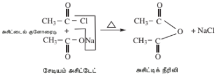

**வேதிப் பண்புகள்:**

**1. நீராற்பகுப்பு:** அமில நீரிலிகள் நீரால் மெதுவாக நீராற்பகுப்பு செய்யப்பட்டு தொடர்புடைய கார்பாக்சிலிக் அமிலங்களை உருவாக்குகின்றன.

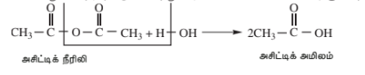
**2. ஆல்கஹாலுடனான வினை:** அமில நீரிலி ஆல்கஹால்களுடன் வினைபுரிந்து எஸ்டர்களை உருவாக்குகிறது.

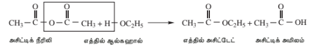
**3. அம்மோனியாவுடனான வினை:** அமில நீரிலி அம்மோனியாவுடன் வினைபுரிந்து அமைடுகளை உருவாக்குகிறது.

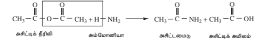

**4. \( PCl_5 \) உடனான வினை:** அமில நீரிலி \( PCl_5 \) உடன் வினைபுரிந்து அசைல் குளோரைடுகளை உருவாக்குகிறது.

$$\begin{array}{ccc} \text{O} & & \text{O} \\ \parallel & & \parallel \\ \text{CH}_3-\text{C} & -\text{O}- & \text{C}-\text{CH}_3 \end{array} + \text{PCl}_5 \longrightarrow \begin{array}{c} \text{O} \\ \parallel \\ 2\text{CH}_3-\text{C}-\text{Cl} \end{array} + \text{POCl}_3$$

$$\text{அசிட்டிக் நீரிலி \qquad\qquad\qquad\qquad\qquad அசிட்டைல் குளோரைடு}$$

### 12.14.4 எஸ்டர்கள்

**தயாரிப்பு முறைகள்:**

**1. எஸ்டராக்கம்:** ஆல்கஹால்களை, கனிம அமிலங்கள் முன்னிலையில் கார்பாக்சிலிக் அமிலங்களுடன் வினைப்படுத்தும்போது எஸ்டர்கள் உருவாகின்றன என்பதை நாம் முன்னரே கற்றறிந்தோம். அதிகளவு வினைப்பொருட்களை பயன்படுத்தியோ அல்லது வினைக்கலவையிலிருந்து நீரை நீக்கியோ இந்த வினையானது முடித்துவைக்கப்படுகிறது.

**2. அமில குளோரைடு அல்லது அமில நீரிலியின் ஆல்கஹோலிசிஸ்:** அமில குளோரைடுகள் அல்லது அமில நீரிலிகளை, ஆல்கஹாலுடன் வினைப்படுத்தும் போதும் எஸ்டர்கள் உருவாகின்றன.

**இயற் பண்புகள்:**

எஸ்டர்கள் நிறமற்ற திரவங்களாகவோ அல்லது திண்மங்களாகவோ உள்ளன. இவை தங்களுக்கே உரித்தான தனித்தன்மை வாய்ந்த பழ நறுமணத்தை பெற்றுள்ளன. சில குறிப்பிட்ட எஸ்டர்களின் நறுமணங்கள் கீழே கொடுக்கப்பட்டுள்ளன.

| S.No | எஸ்டர் | சுவை |
|---|---|---|
| 1 | அமைல் அசிடேட் | வாழைப்பழ மணம்|
| 2 | எத்தில் பியூட்ரேட் | அன்னாசிப்பழ மணம் |
| 3 | ஆக்டைல் அசிட்டேட் |ஆரஞ்சுபழ மணம் |
| 4 | ஐசோபியூட்டில் ஃபார்மேட் | ராஸ்பெர்ரி பழ மணம் |
| 5 | அமைல் பியூட்ரேட் | வாதுமைப் பழ மணம் |

**வேதிப் பண்புகள்:**

**1. நீராற்பகுப்பு:** எஸ்டர்கள் நீராற்பகுப்படைந்து ஆல்கஹால்கள் மற்றும் கார்பாக்சிலிக் அமிலங்கள் உருவாகின்றன என்பதை நாம் ஏற்கனவே கற்றறிந்தோம்.

**2. ஆல்கஹால் உடன் வினை ( டிரான்ஸ் எஸ்டராக்கல்):** ஒரு ஆல்கஹாலின் எஸ்டரானது, கனிம அமிலங்களின் முன்னிலையில் மற்றொரு ஆல்கஹாலுடன் வினைப்பட்டு இரண்டாம் ஆல்கஹாலின் எஸ்டரை உருவாக்குகிறது. எஸ்டர்களுக்கிடையே நிகழும் இந்த ஆல்கஹால் பகுதி பரிமாற்றமானது, டிரான்ஸ் எஸ்டராக்கல் எனப்படுகிறது.

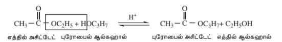

குறைந்தகார்பன்எண்ணிக்கைகொண்டஆல்கஹாலின்எஸ்டர்களிலிருந்துஉயர்ஆல்கஹால் எஸ்டர்களை தயாரிக்க இந்த வினை பயன்படுத்தப்படுகிறது.

**3. அம்மோனியா (அம்மோனியா பகுத்தல்) உடன் வினை:** எஸ்டர்கள், அம்மோனியா உடன் மெதுவாக வினைபுரிந்து அமைடுகளையும், ஆல்கஹால்களையும் உருவாக்குகின்றன.

$$\begin{array}{c} \text{O} \\ \parallel \\ \text{CH}_3-\text{C}-\text{OC}_2\text{H}_5 \end{array} + \text{H}-\text{NH}_2 \longrightarrow \begin{array}{c} \text{O} \\ \parallel \\ \text{CH}_3-\text{C}-\text{NH}_2 \end{array} + \text{C}_2\text{H}_5\text{OH}$$

$$\text{எத்தில் அசிட்டேட் \qquad\qquad\qquad\qquad\qquad அசிட்டமைடு \quad எத்தில் ஆல்கஹால்}$$

**4. கிளைசென் ஒடுக்கம்:** குறைந்தபட்சம் ஒரு \( \alpha \)-ஹைட்ரஜன் அணுவைக் கொண்ட எஸ்டர்கள் சோடியம் எத்தாக்சைடு போன்ற வலிமையான காரத்தின் முன்னிலையில் தன்னொடுக்கத்திற்கு உட்பட்டு \( \beta \)-கீட்டோ எஸ்டரை உருவாக்குகின்றன.

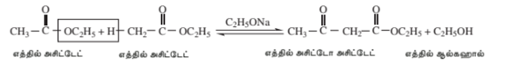

**5. \( PCl_5 \) உடனான வினை:** எஸ்டர்கள் \( PCl_5 \) உடன்வினைப்பட்டு அசைல் மற்றும் ஆல்கைல் குளோரைடுகளின் கலவையை தருகின்றன.

$$\begin{array}{c} \text{O} \\ \parallel \\ \text{CH}_3-\text{C}-\text{OC}_2\text{H}_5 \end{array} + \text{PCl}_5 \longrightarrow \begin{array}{c} \text{O} \\ \parallel \\ \text{CH}_3-\text{C}-\text{Cl} \end{array} + \text{C}_2\text{H}_5\text{Cl} + \text{POCl}_3$$

$$\text{எத்தில் அசிட்டேட் \qquad\qquad\qquad அசிட்டைல்குளோரைடு \quad எத்தில் குளோரைடு}$$

>**மதிப்பீடு - 3:** அசைலேற்ற வினைகளை மேற்கொள்வதற்கு அசைல் குளோரைடை விட அமில நீரிலி ஏன் விரும்பப்படுகிறது?

### 12.14.5 அமில அமைடுகள்

அமில அமைடுகள் கார்பாக்சிலிக் அமிலத்தின் வழிப்பொருட்களாகும், இதில் கார்பாக்சில் குழுவின் -OH பகுதி \( -NH_2 \) குழுவால் மாற்றப்பட்டுள்ளது. அமைடுகளின் பொதுவாய்பாடு பின்வருமாறு கொடுக்கப்பட்டுள்ளது.

இப்போது, நாம் அசிடமைட்டின் வேதியியலைப் பற்றிய ஆய்வில் முக்கியமாகக் கவனம் செலுத்துவோம். \( R-CONH_2 \)

**தயாரிப்பு முறைகள்:**

**1. அமில வழிப்பொருட்களின் அம்மோனோலிசிஸ்:** அமில குளோரைடுகள் அல்லது அமில நீரிலிகளுடன் அம்மோனியாவின் வினையால் அமில அமைடுகள் தயாரிக்கப்படுகின்றன.

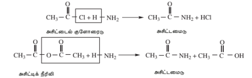

**2) அம்மோனியம் கார்பாக்சிலேட்டுகளைச் சூடுபடுத்துதல்:** கார்பாக்சிலிக் அமிலங்களின் அம்மோனியம் உப்புகள் (அம்மோனியம் கார்பாக்சிலேட்டுகள்) சூடுபடுத்தப்படும்போது, ஒரு நீர் மூலக்கூறை இழந்து அமைடுகளை உருவாக்குகின்றன.

$$\begin{array}{c} \text{O} \\ \parallel \\ \text{CH}_3-\text{C}-\text{O}^-\text{NH}_4^+ \end{array} \xrightarrow{\quad\Delta\quad} \begin{array}{c} \text{O} \\ \parallel \\ \text{CH}_3-\text{C}-\text{NH}_2 \end{array} + \text{H}_2\text{O}$$

$$\text{அம்மோனியம் அசிட்டேட் \qquad\qquad\qquad அசிட்டமைடு}$$

**3) ஆல்க்கைல் சயனைடுகளின் (நைட்ரைல்கள்) பகுதி நீராற்பகுப்பு:** குளிர் செறிவூட்டப்பட்ட HCl உடன் ஆல்க்கைல் சயனைடுகளின் பகுதி நீராற்பகுப்பு அமைடுகளைத் தருகிறது.

$$\text{CH}_3-\text{C}\equiv\text{N} \xrightarrow{\quad\text{அடர் HCl / }\text{H}_2\text{O / OH}^-\quad} \begin{array}{c} \text{CH}_3-\text{C}-\text{NH}_2 \\ \parallel \\ \text{O} \end{array}$$

$$\text{மெத்தில் சயனைடு \qquad\qquad\qquad\qquad அசிட்டமைடு}$$

**வேதிப் பண்புகள்:**

**1. ஈரியல்புத் தன்மை::** அமைடு சேர்மங்கள் வலிமை குறைந்த அமிலம் மற்றும் வலிமை குறைந்த காரம் என இரண்டினைப் போலவும் நடந்து கொள்கின்றன, அதாவது ஈரியல்புத் தன்மையை பெற்றுள்ளன. இதனை பின்வரும் வினைகளின் வாயிலாக நிரூபிக்க இயலும்.
அசிட்டமைடு (காரத்தைப் போல), ஹைட்ரோ குளோரிக் அமிலத்துடன் வினைப்பட்டு உப்பைத் தருகிறது.

$$\begin{array}{c} \text{O} \\ \parallel \\ \text{CH}_3-\text{C}-\text{NH}_2 \end{array} + \text{HCl} \longrightarrow \begin{array}{c} \text{O} \\ \parallel \\ \text{CH}_3-\text{C}-\text{NH}_3\text{ Cl}^- \end{array}$$

$$\text{அசிட்டமைடு \qquad\qquad\qquad\qquad அசிட்டமைடுஹைட்ரோகுளோரைடு}$$

அசிட்டமைடு (அமிலத்தைப் போல), சோடியத்துடன் வினைப்பட்டு சோடியம் உப்பு மற்றும் ஹைட்ரஜன் வாயுவை வெளியேற்றுகிறது.

$$2\text{CH}_3-\begin{array}{c} \text{O} \\ \parallel \\ \text{C} \end{array}-\text{NH}_2 + 2\text{Na} \longrightarrow 2\text{CH}_3-\begin{array}{c} \text{O} \\ \parallel \\ \text{C} \end{array}-\text{NHNa} + \text{H}_2$$

$$\text{\small அசிட்டமைடு \qquad\qquad\qquad\qquad\qquad\qquad சோடியம் அசிட்டமைடு}$$

 **2) நீராற்பகுத்தல்**

அமில அல்லது காரக் கரைசல்களில் தொடர்ந்து வெப்பப்படுத்தும்போது அமைடுகள் நீராற்பகுப்படைகின்றன.

$$\begin{array}{c} \text{O} \\ \parallel \\ \text{CH}_3-\text{C}-\text{NH}_2 \end{array} + \text{H}_2\text{O} \xrightarrow{\quad\text{dil HCl}\quad} \begin{array}{c} \text{O} \\ \parallel \\ \text{CH}_3-\text{C}-\text{OH} \end{array} + \text{NH}_4\text{Cl}$$

$$\text{\small அசிட்டமைடு \qquad\qquad\qquad\qquad\qquad\qquad அசிட்டிக் அமிலம்}$$

$$\begin{array}{c} \text{O} \\ \parallel \\ \text{CH}_3-\text{C}-\text{NH}_2 \end{array} \xrightarrow{\quad\text{NaOH}\quad} \begin{array}{c} \text{O} \\ \parallel \\ \text{CH}_3-\text{C}-\text{ONa} \end{array} + \text{NH}_3$$

$$\text{\small அசிட்டமைடு \qquad\qquad\qquad\qquad\qquad\qquad சோடியம் அசிட்டேட்}$$

**3) நீர்நீக்கம்**

$\text{P}_2\text{O}_5$ போன்ற வலிமையான நீர்நீக்கும் காரணிகளுடன் சேர்த்து வெப்பப்படுத்தும்போது, அமைடுகள் நீர்நீக்கமடைந்து, சயனைடுகள் உருவாகின்றன.

$$\begin{array}{c} \text{O} \\ \parallel \\ \text{CH}_3-\text{C}-\text{NH}_2 \end{array} \xrightarrow{\quad\Delta\quad}^{\text{P}_2\text{O}_5} \text{CH}_3-\text{C}\equiv\text{N} + \text{H}_2\text{O}$$

 **4) ஹாஃப்மன் குறைப்பு வினை**

காரங்களின் முன்னிலையில் அமைடுகள், புரோமினுடன் வினைப்பட்டு மூல அமைடு மூலக்கூறைவிட ஒரு கார்பன் குறைவாக உள்ள ஓரிணைய அமீனைத் தருகின்றன.

$$\begin{array}{c} \text{O} \\ \parallel \\ \text{CH}_3-\text{C}-\text{NH}_2 \end{array} + \text{Br}_2 + 4\text{KOH} \xrightarrow{\quad\Delta\quad} \text{CH}_3\text{NH}_2 \quad + \text{K}_2\text{CO}_3 + 2\text{KBr} + 2\text{H}_2\text{O}$$

$$\text{\small அசிட்டமைடு \qquad\qquad\qquad\qquad\qquad மெத்தில் அமீன்}$$

#### **5) ஒடுக்கம்**

அமைடுகளை, $\text{LiAlH}_4$ அல்லது சோடியம்- எத்தனால் கலவை கொண்டு ஒடுக்கும்போது அமீன்கள் உருவாகின்றன.

$$\begin{array}{c} \text{O} \\ \parallel \\ \text{CH}_3-\text{C}-\text{NH}_2 \end{array} + 4\,(\text{H}) \xrightarrow{\quad\text{LiAlH}_4\quad} \text{CH}_3-\text{CH}_2-\text{NH}_2 + \text{H}_2\text{O}$$

$$\text{\small அசிட்டமைடு \qquad\qquad\qquad\qquad\qquad\qquad எத்தில் அமீன்}$$

## 12.15 கார்பாக்சிலிக் அமிலங்கள் மற்றும் அதன் பெறுதிகளின் பயன்கள்

### ஃபார்மிக் அமிலம்

i) தோல் பொருட்களை உலரவைக்கப் பயன்படுகிறது.

ii) இரப்பர் பாலை கெட்டிப்படுத்தப் பயன்படுகிறது.

iii) மருத்துவத் துறையில் கீழ்வாத நோயை குணப்படுத்தப் பயன்படுகிறது.

iv) புரைதடுப்பானாகவும், பழச்சாறுகளை பதப்படுத்தவும் பயன்படுகிறது.

### அசிட்டிக் அமிலம்

i) சமையல் வினிகராகப் பயன்படுகிறது.

ii) இரப்பர் பாலை கெட்டிப்படுத்தப் பயன்படுகிறது.

iii) செல்லுலோஸ் அசிட்டேட் மற்றும் பாலிவினைல் அசிட்டேட் ஆகியவற்றை தயாரிக்கப் பயன்படுகிறது.

### பென்சாயிக் அமிலம்

i) தூய நிலை பென்சாயிக் அமிலம் அல்லது சோடியம் பென்சோயேட் ஆகியன உணவு பதப்படுத்திகளாகப் பயன்படுகின்றன.

ii) மருத்துவத்துறையில் சிறுநீரக புரை தடுப்பானாகப் பயன்படுகிறது.

iii) சாயங்கள் தயாரிப்பில் பயன்படுகிறது.

### அசிட்டைல் குளோரைடு

i) கரிம தொகுப்பு வினைகளில் அசிட்டைலேற்றக் காரணியாகப் பயன்படுகிறது.

ii) கரிம சேர்மங்களிலுள்ள $-\text{OH}$, $-\text{NH}_2$ தொகுதிகளை கண்டறியவும், அளந்தறியவும் பயன்படுகிறது.

### அசிட்டிக் அமில நீரிலி

i) அசிட்டைலேற்றக் காரணியாகப் பயன்படுகிறது.

ii) ஆஸ்பிரின் மற்றும் பினசிடின் போன்ற மருந்துகள் தயாரிப்பில் பயன்படுகிறது.

iii) செல்லுலோஸ் அசிட்டேட் மற்றும் பாலி வினைல் அசிட்டேட் போன்ற பிளாஸ்டிக்குகள் தயாரிப்பில் பயன்படுகிறது.

### எத்தில் அசிட்டேட்

i) செயற்கை பழச்சாறுகள் தயாரிக்கப் பயன்படுகிறது.

ii) மெருகுப் பூச்சுகளுக்கு கரைப்பானாகப் பயன்படுகிறது.

iii) எத்தில் அசிட்டோஅசிட்டேட் போன்ற கரிம தொகுப்பு காரணிகளை தயாரிக்கப் பயன்படுகிறது.

## மதிப்பீடு

### சரியான விடையைத் தேர்ந்தெடுத்து எழுதுக.

1. கீழ்க்கண்ட வினையில் விளைபொருள் 'A' ன் சரியான அமைப்பு (NEET)

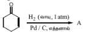

2. அசிட்டோனிலிருந்து சயனோஹைட்ரின் உருவாகும் வினை பின்வருவனவற்றுள் எதற்கு சான்றாக உள்ளது?

அ) கருகவர் பதிலீட்டு வினை 

ஆ) எலக்ட்ரான் கவர் பதிலீட்டு வினை

இ) எலக்ட்ரான் கவர் சேர்ப்பு வினை 

ஈ) கருகவர் சேர்ப்பு வினை

3. பின்வரும் ஒரு வினைக்காரணியுடன் அசிட்டோன் கருகவர் சேர்ப்பு வினையில் ஈடுபட்டு அதன் பின்னர் நீர்நீக்கமடைகிறது. அந்த வினைக்காரணி

அ) கிரிக்னார்டு வினைக்காரணி

ஆ)$\text{Sn} / \text{HCl}$

இ) அமிலக்கரைசலிலுள்ள ஹைட்ரசீன்

ஈ) ஹைட்ரோசயனிக் அமிலம்

4. பின்வரும் வினையில்,

$$\text{HC}\equiv\text{CH} \xrightarrow[\text{HgSO}_4]{\text{H}_2\text{SO}_4} \text{X}$$
விளைபொருள் 'X' ஆனது ________ சோதனைக்கு தராது.

    அ) டாலன்ஸ் சோதனை

    ஆ) விக்டர் மேயர் சோதனை

    இ) அயோடோஃபார்ம் சோதனை

    ஈ) ஃபெலிங் கரைசல் சோதனை

5.

$$\text{CH}_2=\text{CH}_2 \xrightarrow[\text{ii) Zn / H}_2\text{O}]{\text{i) O}_3} \text{X} \xrightarrow{\text{NH}_3} \text{Y, 'Y' என்பது}$$

    அ) ஃபார்மால்டிஹைடு
    ஆ) டை அசிட்டோன் அம்மோனியா
    இ) ஹெக்ஸாமெத்திலீன் டெட்ராஅமீன்
    ஈ) ஆக்சைம்

6. பின்வரும் வினைவரிசையில் விளைபொருள் Z ஐ கண்டறிக.

$$\text{எத்தனாயிக் அமிலம்} \xrightarrow{\text{PCl}_5} \text{X} \xrightarrow[\text{உலர் }\text{AlCl}_3]{\text{C}_6\text{H}_6} \text{Y} \xrightarrow[\text{ii) H}_3\text{O}^+]{\text{i) CH}_3\text{MgBr}} \text{Z}$$

அ) $(\text{CH}_3)_2\text{C(OH)}\text{C}_6\text{H}_5$

ஆ) $\text{CH}_3\text{CH(OH)}\text{C}_6\text{H}_5$

இ) $\text{CH}_3\text{CH(OH)}\text{CH}_2-\text{CH}_3$
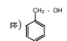

7.கூற்று: 2,2-டைமெத்தில் புரோப்பனாயிக் அமிலம் HVZ வினையை தருவதில்லை.
காரணம்:2,2-டைமெத்தில் புரோப்பனாயிக் அமிலம் $\alpha$-ஹைட்ரஜன் அணுவை கொண்டிருக்கவில்லை.

அ) கூற்று, காரணம் இரண்டும் சரி, மேலும் காரணம் கூற்றிற்கான சரியான விளக்கமாகும்.

ஆ) கூற்று, காரணம் இரண்டும் சரி, ஆனால், காரணம் கூற்றிற்கான சரியான விளக்கமல்ல.

இ) கூற்று சரி ஆனால் காரணம் தவறு

ஈ) கூற்று, காரணம் இரண்டும் தவறு.

8. பின்வருவனவற்றுள் கொடுக்கப்பட்ட சேர்மங்களின் அமிலத்தன்மையின் அடிப்படையிலான சரியான வரிசை:

அ) $\text{FCH}_2\text{COOH} > \text{CH}_3\text{COOH} > \text{BrCH}_2\text{COOH} > \text{ClCH}_2\text{COOH}$

ஆ) $\text{FCH}_2\text{COOH} > \text{ClCH}_2\text{COOH} > \text{BrCH}_2\text{COOH} > \text{CH}_3\text{COOH}$

இ) $\text{CH}_3\text{COOH} > \text{ClCH}_2\text{COOH} > \text{FCH}_2\text{COOH} > \text{Br-CH}_2\text{COOH}$

ஈ) $\text{ClCH}_2\text{COOH} > \text{CH}_3\text{COOH} > \text{BrCH}_2\text{COOH} > \text{ICH}_2\text{COOH}$

 9.$$\text{பென்சாயிக் அமிலம்} \xrightarrow[\text{ii) }\Delta]{\text{i) NH}_3} \text{A} \xrightarrow{\text{NaOBr}} \text{B} \xrightarrow{\text{NaNO}_2/\text{HCl}} \text{C, C என்பது}$$

அ) அனிலினியம் குளோரைடு

ஆ) $o$-நைட்ரோ அனிலீன்

இ) பென்சீன் டையசோனியம் குளோரைடு

ஈ) $m$-நைட்ரோ பென்சாயிக் அமிலம்

 10.

$$\text{எத்தனாயிக் அமிலம்} \xrightarrow{\text{P/Br}_2} 2\text{-புரோமோஎத்தனாயிக் அமிலம்}$$ இந்த வினையானது ________ என்று அழைக்கப்படுகிறது.

அ) பிங்கல்ஸ்டீன் வினை

ஆ) ஹேலோஃபார்ம் வினை

இ) ஹெல் – வோல்ஹார்ட்– ஜெலின்ஸ்கி வினை

ஈ) இவற்றில் ஏதுமில்லை

11.$$\text{CH}_3\text{Br} \xrightarrow{\text{KCN}} (\text{A}) \xrightarrow{\text{H}_3\text{O}^+} (\text{B}) \xrightarrow{\text{PCl}_5} (\text{C}) \text{ விளைபொருள் (C) என்பது}$$

அ) அசிட்டைல் குளோரைடு

ஆ) குளோரோ அசிட்டிக் அமிலம்

இ) $\alpha$-குளோரோ சயனோ எத்தனாயிக் அமிலம்

ஈ) இவற்றில் எதுவுமில்லை

 12. பின்வருவனவற்றுள் எந்த ஒன்று டாலன்ஸ் வினைக்காரணியை ஒடுக்குகிறது?

அ) ஃபார்மிக் அமிலம்

ஆ) அசிட்டிக் அமிலம்

இ) பென்சோபீனோன்

ஈ) இவற்றில் எதுவுமில்லை

 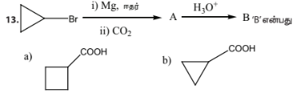

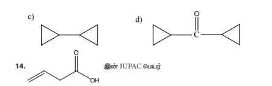

அ) பியூட்-3-ஈனாயிக்அமிலம்

ஆ) பியூட்-1-ஈன்-4-ஆயிக்அமிலம்

இ) பியூட்-2-ஈன்-1-ஆயிக்அமிலம்

ஈ) பியூட்-3-ஈன்-1-ஆயிக்அமிலம்

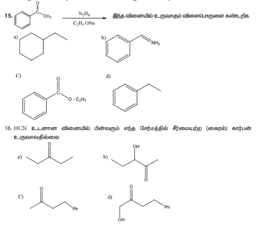
 17. கூற்று: $p\text{-N,N-}$டைமெத்தில் அமினோபென்சால்டிஹைடு, பென்சாயின் குறுக்கவினைக்கு உட்படுகிறது.

காரணம்: ஆல்டிஹைடு ($-\text{CHO}$) தொகுதியானது மெட்டா ஆற்றுப்படுத்தும் தொகுதியாகும்.

அ) கூற்று, காரணம் இரண்டும் சரி, மேலும் காரணம் கூற்றிற்கான சரியான விளக்கமாகும்.

ஆ) கூற்று, காரணம் இரண்டும் சரி, ஆனால், காரணம் கூற்றிற்கான சரியான விளக்கமல்ல.

இ) கூற்று சரி ஆனால் காரணம் தவறு

ஈ) கூற்று, காரணம் இரண்டும் தவறு.

 18. பின்வருவனவற்றுள் எந்த ஒன்று விcontradictory/விகிதச்சிதைவு வினைக்கு எடுத்துக்காட்டாகும்?

அ) ஆல்டால் குறுக்கம் 

ஆ) கான்னிசரோ வினை

இ) பென்சாயின் குறுக்கம் 

ஈ) இவற்றில் ஏதுமில்லை

 19. பின்வருவனவற்றுள் எந்த ஒன்று 50% சோடியம் ஹைட்ராக்சைடு கரைசலுடன் வினைப்பட்டு ஆல்கஹாலையும், அமிலத்தையும் தருகிறது?

அ) பீனைல்மெத்தனல் 

ஆ) எத்தனல் 

இ) எத்தனால் 

ஈ) மெத்தனால்

 20. அசிட்டால்டிஹைடு மற்றும் பென்சால்டிஹைடை வேறுபடுத்தியறிய பயன்படுத்தப்படும் வினைக்கரணி:

அ) டாலன்ஸ் வினைக்காரணி

ஆ) ஃபெலிங் கரைசல்

இ) 2,4 – டைநைட்ரோபீனைல் ஹைட்ரசீன்

 ஈ) செமிகார்பசைடு

 21. பென்சால்டிஹைடு, அடர் $\text{NaOH}$ உடன் வினைப்பட்டு $\text{X}$ மற்றும் $\text{Y}$ எனும் இரண்டு விளைபொருள்களைத் தருகிறது. சேர்மம் $\text{X}$ ஆனது உலோக சோடியத்துடன் வினைப்பட்டு ஹைட்ரஜன் வாயுவை வெளியேற்றுகிறது எனில் $\text{X}$ மற்றும் $\text{Y}$ என்பவை முறையே:

அ) சோடியம்பென்சோயேட் மற்றும் பீனால்

ஆ) சோடியம் பென்சோயேட் மற்றும் பீனைல்மெத்தனால்

இ) பீனைல்மெத்தனால் மற்றும் சோடியம் பென்சோயேட்

ஈ) இவற்றில் ஏதுமில்லை

22. பின்வரும் வினைகளில் எதில் புதிய கார்பன் – கார்பன் பிணைப்பு உருவாகவில்லை?

அ) ஆல்டால் குறுக்கம் 

ஆ) பிரீடல் கிராஃப்ட் வினை

இ) கோல்ப் வினை 

ஈ) உல்ஃப் கிஷ்னர் வினை

23. (A) எனும் ஒரு ஆல்கீன் $\text{O}_3$ மற்றும் $\text{Zn - H}_2\text{O}$ உடன் வினைப்பட்டு புரோப்பனோன் மற்றும் எத்தனால் ஆகியவற்றை சம மோலார் அளவுகளில் உருவாக்குகிறது. ஆல்கீன் (A) உடன் $\text{HCl}$ ஐ சேர்க்கும்போது சேர்மம் (B) முதன்மையான விளைபொருளாக கிடைக்கிறது. விளைபொருள் (B) யின் அமைப்பு:

 24. ஒப்பிடத்தக்க மூலக்கூறு நிறைகள் கொண்ட ஆல்டிஹைடுகள், கீட்டோன்கள் மற்றும் ஆல்கஹால்களை ஒப்பிடும்போது கார்பாக்ஸிலிக் அமிலங்கள் அதிக கொதிநிலையைப் பெற்றுள்ளன. இதற்கு காரணம் (NEET):

அ) வான்கோயர்வால்ஸ் கவர்ச்சி விசைகளின் காரணமாக ஏற்படும் கார்பாக்ஸிலிக் அமில மூலக்கூறுகளின் கூட்டமைப்பு

ஆ) கார்பாக்சிலேட் அயனி உருவாதல்

இ) ஒரே மூலக்கூறினுள் H-பிணைப்புகள் உருவாதல்

ஈ) மூலக்கூறுகளுக்கிடைப்பட்ட H-பிணைப்புகள் உருவாதல்

## சுருக்கமாக விடையளி

 1. (அ) ஒரு ஆல்கஹால்  (ஆ) ஒரு ஆல்கைல்ஹேலைடு (இ) ஒரு ஆல்கீன் ஆகியவற்றை தொடக்கச் சேர்மங்களாகக் கொண்டு புரோப்பனாயிக் அமிலம் எவ்வாறு தயாரிக்கப்படுகிறது?

2. $\text{C}_2\text{H}_3\text{N}$ எனும் மூலக்கூறு வாய்பாடு கொண்ட சேர்மம் (A) ஆனது அமில நீர்பகுப்பில் (B) ஐ தருகிறது. (B) ஆனது தையோனைல்குளோரைடுடன் வினைப்பட்டு சேர்மம் (C) ஐ தருகிறது. பென்சீன், உலர் $\text{AlCl}_3$ முன்னிலையில் (C) உடன் வினைப்பட்டு சேர்மம் (D) ஐ தருகிறது. மேலும் (D) $\text{Zn/Hg}$ மற்றும் அடர் $\text{HCl}$ ஆல் ஒடுக்கமடைந்து சேர்மம் (E) ஐ தருகிறது. (A), (B), (C), (D) மற்றும் (E) ஆகியவற்றை கண்டறிக. சமன்பாடுகளை எழுதுக.
3. X மற்றும் Y ஆகியவற்றை கண்டறிக.
$$\text{CH}_3\text{COCH}_2\text{CH}_2\text{COOC}_2\text{H}_5 \xrightarrow{\text{CH}_3\text{MgBr}} \text{X} \xrightarrow{\text{H}_3\text{O}^+} \text{Y}$$

4. A, B மற்றும் C ஆகியவற்றை கண்டறிக.
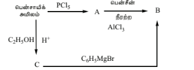

5. பின்வரும் வினையில் A, B, C மற்றும் D ஆகியவற்றை கண்டறிக
$$\text{எத்தனாயிக் அமிலம்} \xrightarrow{\text{SOCl}_2} \text{A} \xrightarrow{\text{Pd/BaSO}_4} \text{B} \xrightarrow{\text{NaOH}} \text{C} \xrightarrow{\Delta} \text{D}$$

6. (A) எனும் ஆல்கீன் ஓசோனேற்றவினையில் புரோப்பனோன் மற்றும் ஒரு ஆல்டிஹைடு (B) ஆகியவற்றை தருகிறது. சேர்மம் (B) ஐ ஆக்சிஜனேற்றம் செய்யும்போது (C) கிடைக்கிறது. சேர்மம் (C) ஐ $\text{Br}_2/\text{P}$ உடன் வினைப்படுத்தும்போது சேர்மம் (D) கிடைக்கிறது. இத நீரார்பகுக்கும்போது (E) ஐ தருகிறது. புரோப்பனோனை $\text{HCN}$ உடன் வினைப்படுத்தி நீரார்பகுக்கும்போது சேர்மம் (E) உருவாகிறது. A, B, C, D மற்றும் E ஆகியவற்றை கண்டறிக.
7. பென்சால்டிஹைடை பின்வரும் சேர்மங்களாக எவ்வாறு மாற்றுவாய்?
(i) பென்சோபீனோன் $\quad$ (ii) பென்சாயிக் அமிலம்
(iii) $\alpha$-ஹைட்ராக்ஸி பினைல் அசிட்டிக் அமிலம்.

8. பின்வருவனவற்றின் மீது $\text{HCN}$ ன் செயல்பாடு யாது?
(i) புரப்பனோன் $\quad$ (ii) 2,4-டைகுளோரோபென்சால்டிஹைடு. $\quad$ iii) எத்தனல்
9. C_5 H_10 O  எனும் மூலக்கூறு வாய்பாடு கொண்ட (A) எனும் கார்பனைல் சேர்மமானது, சோடியம் பைசல்பைட்டுடன் படிக வீழ்படிவை தருகிறது. மேலும் அது அயோடோஃபார்ம் வினைக்கு உட்படுகிறது. சேர்மம் (A) ஃபெலிங் கரைசலை ஒடுக்குவதில்லை. சேர்மம் (A) யை கண்டறிக.
10. அசிட்டோனுடன் பென்சால்டிஹைடின் ஆல்டால் குறுக்கவினையில் உருவாகும் முதன்மையான விளைபொருளின் அமைப்பு வாய்ப்பாட்டை எழுதுக.
11. பின்வரும் மாற்றங்கள் எவ்வாறு நிகழ்த்தப்படுகின்றன?
(a) புரப்பனால் $\rightarrow$ பியூட்டனோன்
(b) ஹெக்ஸ்-3-ஐன் $\rightarrow$ ஹெக்ஸன்-3-ஒன்
(c) பீனைல்மெத்தனால் $\rightarrow$ பென்சாயிக் அமிலம்
(d) பீனைல்மெத்தனால் $\rightarrow$ பென்சாயின்
12. பின்வரும் வினையை நிரப்புக.

$$\text{CH}_3\text{-CH}_2\text{-CH}_2\text{-C(=O)-CH}_3 \xrightarrow[\text{dry HCl}]{\text{HO-CH}_2\text{-CH}_2\text{-CH}_2\text{-OH}} \text{?}$$

13. A, B மற்றும் C ஆகியவற்றை கண்டறிக.

14. கீட்டோன்களை ஆக்சிஜனேற்றம் செய்யும்போது கார்பன் - கார்பன் பிணைப்பு பிளக்கப்படுகிறது. வலிமையான ஆக்சிஜனேற்றியை கொண்டு 2,5 - டைமெத்தில்ஹெக்சன் - 3- ஒன் எனும் சேர்மத்தை ஆக்சிஜனேற்றம் செய்யும்போது கிடைக்கப்பெறும் விளைபொரு(ட்க)ளின் பெயர்(களை) எழுதுக

15. எவ்வாறு தயாரிப்பாய்?

i. அசிட்டிக் அமிலத்திலிருந்து அசிட்டிக் அமில நீரிலி

ii. மெத்தில் அசிட்டேட்டிலிருந்து எத்தில் அசிட்டேட்

iii. மெத்தில்சயனைடிலிருந்து அசிட்டமைடு

iv. எத்தனாலிலிருந்து லாக்டிக் அமிலம்

v. அசிட்டைல் குளோரைடிலிருந்து அசிட்டோபீனோன்

vi. சோடியம் அசிட்டேட்டிலிருந்து ஈத்தேன்

vii. டொலுயீனிலிருந்து பென்சாயிக் அமிலம்

viii. பென்சால்டிஹைடிலிருந்து மாலகைட் பச்சை

ix. பென்சால்டிஹைடிலிருந்து சின்னமிக் அமிலம்

x. ஈத்தைனிலிருந்து அசிட்டால்டிஹைடு

கார்பனைல் சேர்மங்கள்

