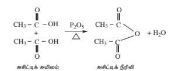
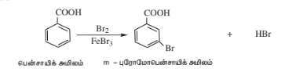
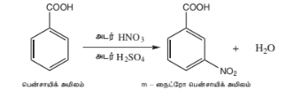
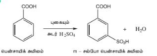
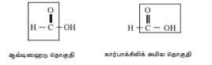

## 12.12 கார்பாக்சிலிக் அமிலங்களின் வேதிப் பண்புகள்
கார்பாக்சிலிக் அமிலங்களிலுள்ள கார்பனைல் தொகுதியானது உடனிசைவில் ஈடுபடுவதால், ஆல்டிஹைடுகள் மற்றும் கீட்டோன்களைப் போல $\text{＞C = O}$
கார்பாக்சிலிக் அமிலங்கள் கார்பனைல்
தொகுதிக்கான சிறப்புப் பண்புகளை பெற்றிருக்கவில்லை.

கார்பாக்சிலிக் அமிலங்களின் வினைகளை பின்வருமாறு வகைப்படுத்தலாம்:

A) O – H பிணைப்பு பிளவுறும் வினைகள்.

B) C – OH பிணைப்பு பிளவுறும் வினைகள்.

C) – COOH தொகுதி பங்கேற்கும் வினைகள்

D) ஹைட்ரோகார்பன் பகுதி பங்கேற்கும் பதிலீட்டு வினைகள்.

### A) O-H பிணைப்பின் பிளவை உள்ளடக்கிய வினைகள்

**1) உலோகங்களுடனான வினைகள்**

Na, Mg, Zn போன்ற வினைத்திறன் மிக்க உலோகங்களுடன் கார்பாக்சிலிக் அமிலங்கள் வினைபட்டு ஹைட்ரஜன் வாயுவை வெளியேற்றி உப்புகளைத் தருகின்றன.

**எடுத்துக்காட்டு:**

$$\begin{array}{ccc} 2\ \begin{array}{c} \text{O} \\ \parallel \\ \text{CH}_3 - \text{C} - \text{OH} \end{array} + 2\text{Na} & \longrightarrow & 2\ \begin{array}{c} \text{O} \\ \parallel \\ \text{CH}_3 - \text{C} - \text{ONa} \end{array} + \text{H}_2 \\ \text{\small அசிட்டிக் அமிலம்} & & \text{\small சோடியம் அசிட்டேட்} \end{array}$$

#### 2) காரங்களுடனான வினை

கார்பாக்சிலிக் அமிலங்கள் காரங்களுடன் வினைப்பட்டு அவற்றை நடுநிலையாக்குவதன் மூலம் உப்புகளை தருகின்றன.

**எடுத்துக்காட்டு:**

$$\begin{array}{ccc} \begin{array}{c} \text{O} \\ \parallel \\ \text{CH}_3 - \text{C} - \text{OH} \end{array} + \text{NaOH} & \longrightarrow & \begin{array}{c} \text{O} \\ \parallel \\ \text{CH}_3 - \text{C} - \text{ONa} \end{array} + \text{H}_2\text{O} \\ \text{\small அசிட்டிக் அமிலம்} & & \text{\small சோடியம் அசிட்டேட்} \end{array}$$

**3) கார்பனேட்டுகள் மற்றும் பைகார்பனேட்டுகளுடன் வினை (கார்பாக்சிலிக் அமில தொகுதிக்கான சோதனை)**

கார்பாக்சிலிக் அமிலங்கள், கார்பனேட்டுகள் மற்றும் பைகார்பனேட்டுகளை சிதைப்பதால் நுரைத்த பொங்குதலுடன் கார்பன் டை ஆக்சைடு வெளியேறுகிறது.

**எடுத்துக்காட்டு**

$$\begin{array}{ccc} 2\text{CH}_3 - \begin{array}{c} \text{O} \\ \parallel \\ \text{C} \end{array} - \text{OH} + \text{Na}_2\text{CO}_3 & \longrightarrow & 2\text{CH}_3 - \begin{array}{c} \text{O} \\ \parallel \\ \text{C} \end{array} - \text{ONa} + \text{CO}_2 + \text{H}_2\text{O} \\ \text{\small அசிட்டிக் அமிலம்} & & \text{\small சோடியம் அசிட்டேட்} \end{array}$$

**4) அனைத்து கார்பாக்சிலிக் அமிலங்களும் நீல நிற லிட்மஸ் தாளை சிவப்பாக மாற்றுகின்றன.**

**B) $\text{C} - \text{OH}$ பிணைப்பு பிளவுறும் வினைகள்.**

**1) $\text{PCl}_5$, $\text{PCl}_3$ மற்றும் $\text{SOCl}_2$ உடன் வினை:**

கார்பாக்சிலிக் அமிலங்களின் ஹைட்ராக்சில் தொகுதியானது, ஆல்கஹால் தொகுதியைப் போலவே நடந்துகொள்கின்றன, மேலும், $\text{PCl}_5$, $\text{PCl}_3$ மற்றும் $\text{SOCl}_2$ ஆகியவற்றுடன் வினைப்படுத்தும்போது குளோரின் அணுக்களால் எளிதில் பதிலீடு செய்யப்படுகிறது.

**எடுத்துக்காட்டு**

$$\begin{array}{ccc} \text{CH}_3 - \begin{array}{c} \text{O} \\ \parallel \\ \text{C} \end{array} - \text{OH} + \text{PCl}_5 & \longrightarrow & \text{CH}_3 - \begin{array}{c} \text{O} \\ \parallel \\ \text{C} \end{array} - \text{Cl} + \text{POCl}_3 + \text{HCl} \\ \text{\small அசிட்டிக் அமிலம்} & & \text{\small அசிட்டைல் குளோரைடு} \end{array}$$

$$\begin{array}{ccc} \text{C}_6\text{H}_5 - \begin{array}{c} \text{O} \\ \parallel \\ \text{C} \end{array} - \text{OH} + \text{SOCl}_2 & \longrightarrow & \text{C}_6\text{H}_5 - \begin{array}{c} \text{O} \\ \parallel \\ \text{C} \end{array} - \text{Cl} + \text{SO}_2 + \text{HCl} \\ \text{\small பென்சாயிக் அமிலம்} & & \text{\small பென்சாயில் குளோரைடு} \end{array}$$

**2) ஆல்கஹால்களுடன் வினைகள் ( எஸ்டராக்கல்)**

கார்பாக்சிலிக் அமிலங்களை அடர். $\text{H}_2\text{SO}_4$ அல்லது உலர் $\text{HCl}$ வாயு முன்னிலையில் ஆல்கஹால்களுடன் சேர்த்து வெப்பப்படுத்தும்போது எஸ்டர்கள் உருவாகின்றன. இது ஒரு மீள்வினையாகும், மேலும் இது எஸ்டராக்கல் என்றழைக்கப்படுகிறது.

**எடுத்துக்காட்டு**

$$\begin{array}{ccc} \text{C}_6\text{H}_5 - \begin{array}{c} \text{O} \\ \parallel \\ \text{C} \end{array} - \text{OH} + \text{C}_2\text{H}_5\text{OH} & \xrightarrow{\text{H}^+} & \text{C}_6\text{H}_5 - \begin{array}{c} \text{O} \\ \parallel \\ \text{C} \end{array} - \text{OC}_2\text{H}_5 + \text{H}_2\text{O} \\ \text{\small பென்சாயிக் அமிலம்} & & \text{\small எத்தில் பென்சோயேட்} \end{array}$$

**எஸ்டராக்கல் வினையின் வினைவழி முறை:**

எஸ்டராக்கல் வினையானது பின்வரும் படிகளில் நிகழ்கிறது.

**C) $\mathbf{- \text{COOH}}$ தொகுதி ஈடுபடும் வினைகள்**

**1) ஒடுக்கம்**

**i) ஆல்கஹால்களாக பகுதியளவு ஒடுக்கமடைதல்**
கார்பாக்சிலிக் அமிலங்கள், $\text{LiAlH}_4$ அல்லது காப்பர் குரோமைட் வினைவேக மாற்றி முன்னிலையில் ஹைட்ரஜனுடன் சேர்ந்து ஒடுக்கமடைந்து ஒரிணைய ஆல்கஹால்களாக மாறுகின்றன. சோடியம் போரோஹைட்ரைடு $-\text{COOH}$ தொகுதியை ஒடுக்குவதில்லை.

**எடுத்துக்காட்டு**

$$\begin{array}{ccc} \text{CH}_3 - \begin{array}{c} \text{O} \\ \parallel \\ \text{C} \end{array} - \text{OH} & \xrightarrow[\text{4(H)}]{\text{LiAlH}_4} & \text{CH}_3\text{CH}_2\text{OH} + \text{H}_2\text{O} \\ \text{\small எத்தனோயிக் அமிலம்} & & \text{\small எத்தனால்} \end{array}$$

**ii) ஆல்கேன்களாக முழுமையாக ஒடுக்கமடைதல்**
$\text{HI}$ மற்றும் சிவப்பு பாஸ்பரசுடன் வினைப்படுத்தும்போது கார்பாக்சிலிக் அமிலமானது முழுமையாக ஒடுக்கமடைந்து அதே எண்ணிக்கையிலான கார்பன் அணுக்களைக் கொண்ட ஆல்கேன்களாக மாறுகின்றன.

**எடுத்துக்காட்டு**

$$\begin{array}{ccc} \text{CH}_3 - \begin{array}{c} \text{O} \\ \parallel \\ \text{C} \end{array} - \text{OH} + 6\text{HI} & \xrightarrow[\text{473 K}]{\text{சிவப்பு P}} & \text{CH}_3 - \text{CH}_3 + 3\text{I}_2 + 2\text{H}_2\text{O} \\ \text{\small அசிட்டிக் அமிலம்} & & \text{\small ஈத்தேன்} \end{array}$$

**2) கார்பாக்சில் தொகுதி நீக்க வினை:**
கார்பாக்சில் தொகுதியிலிருந்து $\text{CO}_2$ வாயு நீங்கும் வினையானது கார்பாக்சில் தொகுதி நீக்க வினை என்றழைக்கப்படுகிறது. கார்பாக்சிலிக் அமிலங்களின் சோடியம் உப்பை சோடா சுண்ணாம்புடன் (3:1 என்ற விகிதத்தில் $\text{NaOH}$ மற்றும் $\text{CaO}$) வெப்பப்படுத்தும்போது, அவை கார்பன் டை ஆக்சைடை இழந்து ஹைட்ரோ கார்பன்களை உருவாக்குகின்றன.

**எடுத்துக்காட்டு**

$$\begin{array}{ccc} \text{CH}_3 - \begin{array}{c} \text{O} \\ \parallel \\ \text{C} \end{array} - \text{ONa} + \text{NaOH} & \xrightarrow[\Delta]{\text{CaO}} & \text{CH}_4 + \text{Na}_2\text{CO}_3 \\ \text{\small சோடியம் அசிட்டேட்} & & \text{\small மீத்தேன்} \end{array}$$

**3) கோல்ப் மின்னாற்பகுப்பு கார்பாக்சில் தொகுதி நீக்கம்**
கார்பாக்சிலிக் அமிலங்களின் சோடியம் அல்லது பொட்டாசியம் உப்புகளின் நீர்க்கரைசல்களை மின்னாற்பகுக்கும்போது நேர்மின்முனையில் ஆல்கேன்கள் வெளியேறுகின்றன. இவ்வினையானது கோல்ப் மின்னாற்பகுத்தல் வினை என்றழைக்கப்படுகிறது.

$$\begin{array}{ccccc} \begin{array}{c} \text{CH}_3\text{COONa} \\ + \\ \text{CH}_3\text{COONa} \end{array} & \xrightarrow{\text{\scriptsize மின்னாற்பகுப்பு}} & \begin{array}{c} \text{CH}_3 \\ \vert{} \\ \text{CH}_3 \end{array} + 2\text{CO}_2 & + & 2\text{Na} \\ \text{\small சோடியம் அசிட்டேட்} & & \text{\small நேர்மின்வாய்} & & \text{\small எதிர்மின்வாய்} \end{array}$$

நீராற்பகுத்தலில், சோடியம் ஃபார்மேட் கரைசலானது ஹைட்ரஜனைத் தருகிறது.

#### 4) அம்மோனியாவுடனான வினை

கார்பாக்சிலிக் அமிலங்கள் அம்மோனியாவுடன் வினைபுரிந்து அம்மோனியம் உப்பை உருவாக்குகின்றன, இது அதிக வெப்பநிலையில் மேலும் சூடுபடுத்தப்படும்போது அமைடுகளைத் தருகிறது.

**எடுத்துக்காட்டு:**
$$\begin{array}{rccrc} \begin{array}{c} \text{O} \\ \parallel \\ \text{CH}_3 - \text{C} - \text{OH} \end{array} + \text{NH}_3 & \longrightarrow & \begin{array}{c} \text{O} \\ \parallel \\ \text{CH}_3 - \text{C} - \bar{\text{O}}\overset{+}{\text{N}}\text{H}_4 \end{array} & \xrightarrow{\quad\Delta\quad} & \begin{array}{c} \text{O} \\ \parallel \\ \text{CH}_3 - \text{C} - \text{NH}_2 \end{array} + \text{H}_2\text{O} \\ \text{\small அசிட்டிக் அமிலம்} \qquad\qquad & & \text{\small அம்மோனியம் அசிட்டேட்} \qquad & & \text{\small அசிட்டமைடு} \qquad\qquad \end{array}$$

**5) $\mathbf{P_2O_5}$ முன்னிலையில் வெப்பத்தின் விளைவு**

$\mathbf{P_2O_5}$ போன்ற வலிமை மிகுந்த நீர்நீக்கும் காரணிகளுடன் சேர்த்து வெப்பப்படுத்தும்போது கார்பாக்சிலிக் அமிலங்கள் அவற்றின் அமில நீரிலிகளை உருவாக்குகின்றன.

**எடுத்துக்காட்டு**

**D) ஹைட்ரோகார்பன் பகுதி பங்கேற்கும் பதிலீட்டு வினைகள்.**

**1) $\mathbf{\alpha}$ - ஹேலஜனேற்றம்**

$\alpha$ - ஹைட்ரஜனைக் கொண்டுள்ள கார்பாக்சிலிக் அமிலங்களை, சிறிதளவு சிவப்பு பாஸ்பரஸ் முன்னிலையில், குளோரின் அல்லது புரோமின் உடன் வினைப்படுத்தும்போது $\alpha$ - கார்பன் அணுவில் ஹேலஜனேற்றம் அடைந்து $\alpha$ ஹேலோ கார்பாக்சிலிக் அமிலங்களை உருவாக்குகின்றன. இந்த வினையானது ஹெல் – வோல்ஹார்ட் – ஜெலின்ஸ்கி வினை (HVZ வினை) என்றழைக்கப்படுகிறது. இந்த $\alpha$ - ஹேலஜனேற்றம் பெற்ற அமிலங்களானவை, $\alpha$ - பதிலீடு செய்யப்பட்ட அமிலங்களை தயாரிப்பதற்கான உகந்த துவக்கச் சேர்மங்களாக விளங்குகின்றன.

$$\begin{array}{ccc} \text{CH}_3 - \text{COOH} & \xrightarrow[\text{H}_2\text{O}]{\text{Cl}_2 \ / \ \text{சிவப்பு P}_4} & \begin{array}{c} \text{CH}_2 - \text{COOH} \\ \vert{} \\ \text{Cl} \end{array} \\ \text{\small அசிட்டிக் அமிலம்} & & \begin{array}{c} \text{\small மோனோ குளோரோ} \\ \text{\small அசிட்டிக் அமிலம்} \end{array} \end{array}$$

**2) அரோமேடிக் கார்பாக்சிலிக் அமிலங்களில் எலக்ட்ரான் கவர் பதிலீட்டு வினைகள்**

அரோமேடிக் கார்பாக்சிலிக் அமிலங்கள் எலக்ட்ரான் கவர் பதிலீட்டு வினைகளுக்கு உட்படுகின்றன. கார்பாக்சில் தொகுதியானது கிளர்வுநீக்கும் மற்றும் மெட்டா ஆற்றுப்படுத்தும் தொகுதியாகும். பென்சாயிக் அமிலத்தின் சில பொதுவான எலக்ட்ரான் கவர் பதிலீட்டு வினைகள் கீழே கொடுக்கப்பட்டுள்ளன.

**i) ஹலோஜனேற்றம்**

**ii) நைட்ரேற்றம்**

**iii) சல்ஃபோனேற்றம்**

iv) பென்சாயிக் அமிலம் ஃப்ரீடல்-கிராஃப்ட்ஸ் வினைகளுக்கு உட்படுவதில்லை. இது கார்பாக்சில் குழுவின் வலுவான செயலிழக்கச் செய்யும் தன்மை காரணமாகும்.

### E) ஃபார்மிக் அமிலத்தின் ஒடுக்கும் பண்பு

ஃபார்மிக் அமிலமானது ஆல்டிஹைடு மற்றும் அமில தொகுதி என இரண்டையும் ஒருசேர கொண்டுள்ளது. எனவே மற்ற ஆல்டிஹைடுகளைப் போல ஃபார்மிக் அமிலமும் எளிதில் ஆக்ஸிஜனேற்றம் அடைவதால், அது, ஒடுக்கும் காரணியாக செயல்படுகிறது.

i) ஃபார்மிக் அமிலம் டோலன்ஸ் வினைப்பொருளை (அம்மோனியாகல் வெள்ளி நைட்ரேட் கரைசல்) உலோக வெள்ளியாக ஒடுக்குகிறது.
$$\begin{array}{ccc} \text{HCOO}^- + 2\text{Ag}^+ + 3\text{OH}^- & \longrightarrow & 2\text{Ag} \downarrow + \text{CO}_3^{2-} + 2\text{H}_2\text{O} \\ (\text{\small டாலன்ஸ் காரணி}) & & \text{\small வெள்ளி ஆடி} \end{array}$$

ii) ஃபார்மிக் அமிலம், ஃபெலிங் கரைசலை ஒடுக்குகிறது. இது நீல நிற குப்ரிக் அயனிகளை சிவப்பு நிற குப்ரஸ் அயனிகளாக ஒடுக்குகிறது.

$$\begin{array}{ccc} \text{HCOO}^- + 2\text{Cu}^{2+} + 5\text{OH}^- & \longrightarrow & \text{Cu}_2\text{O} \downarrow + \text{CO}_3^{2-} + 3\text{H}_2\text{O} \\ \text{\small ஃபெலிங் கரைசல்} & & \text{\small சிவப்பு நிற வீழ்படிவு} \end{array}$$

**கார்பாக்சிலிக் அமில தொகுதிக்கான சோதனைகள்**

i) கார்பாக்சிலிக் அமிலங்களின் நீர்த்த கரைசல்கள் நீல நிற லிட்மஸ் தாளை சிவப்பு நிறமாக மாற்றுகின்றன.

ii) கார்பாக்சிலிக் அமிலங்களை, சோடியம் பைகார்பனேட் கரைசலுடன் சேர்க்கும்போது நுரைத்த பொங்குதலுடன் கார்பன் டை ஆக்சைடு வெளியேறுகிறது.

iii) கார்பாக்சிலிக் அமிலத்தை, ஆல்கஹால் மற்றும் அடர் $\text{H}_2\text{SO}_4$ உடன் சேர்த்து வெப்பப்படுத்தும்போது அவை எஸ்டரை உருவாக்குகின்றன. இந்த எஸ்டரானது அதன் பழ மணத்தினால் கண்டறியப்படுகிறது.