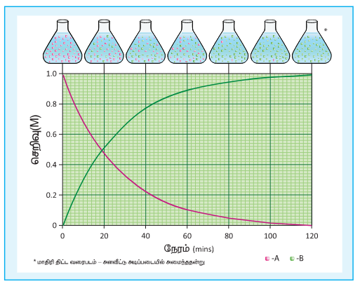
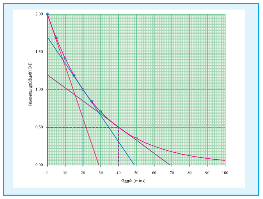
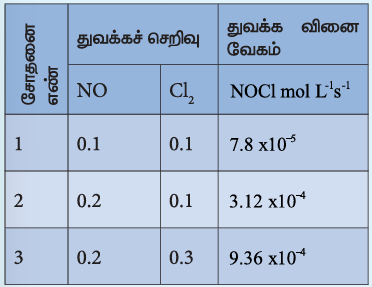
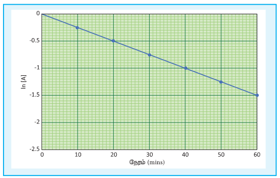
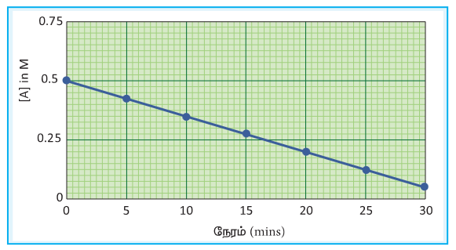
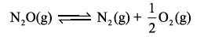
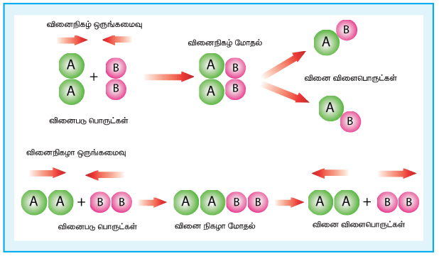

# வேதியியல் இயக்கவியல் 7

## கற்றல் நோக்கங்கள்

இப்பாடப்பகுதியைக் கற்றறிந்த பின்னர்,

• வினைவேகம் மற்றும் வினை வகையை வரையறுத்தல்

• பூஜ்ய மற்றும் முதல் வகை வினைகளுக்கான தொகைப்படுத்தப்பட்ட சமன்பாட்டினை வருவித்தல்.

• அரை வாழ் காலத்தை விவரித்தல்

• மோதல் கொள்கையை விவரித்தல்

• வினைவேகமானது எவ்வாறு வெப்பநிலையினைச் சார்ந்து அமைகிறது என விவாதித்தல் மற்றும்

• வினைவேகத்தை பாதிக்கும் பல்வேறு காரணிகளை விளக்குதல் ஆகிய திறன்களை மாணவர்கள் பெற இயலும்.

## அறிமுகம்

வெப்ப இயக்கவியற் கொள்கைகளைப் பயன்படுத்தி, கொடுக்கப்பட்ட நிபந்தனைகளில் ஒரு வேதி வினை நிகழ் சாத்தியமுள்ளதா என்பதனைக் கண்டறிய இயலும் என்பதை நாம் பதினொன்றாம் வகுப்பில் ஏற்கனவே கற்றறிந்துள்ளோம். எனினும் ஒரு வேதிவினையானது எவ்வளவு வேகத்தில் நடைபெறும் என்ற முக்கியமான ஒரு வினாவிற்கு சரியான ஒரு தீர்வினை வெப்ப இயக்கவியல் மூலம் பெற இயலாது. அனைத்து வேதி வினைகளும் நிறைவடைய சிறிது காலம் எடுத்துக் கொள்ளும் என்பதை நாம் நமது அனுபவ அறிவின் மூலம் அறிந்துள்ளோம். வேதிவினைகள், மிகக் குறுகிய கால அளவான பெம்போ செகன்டு முதல் ஆண்டுக்கணக்கில் நிகழும் வகையில் வெவ்வேறு வினை வேகங்களைப் பெற்றிருக்கின்றன. எடுத்துக்காட்டாக, பேரியம் குளோரைடு கரைசல் மற்றும் நீர்த்த \( H_2SO_4 \) ஆகிய இரண்டையும் கலந்தவுடன், வெண்மை நிற \( BaSO_4 \) வீழ்படிவு உடனடியாக உருவாகிறது, மாறாக இரும்பு துருப்பிடித்தல் போன்ற வினைகள் பல ஆண்டுகள் தொடர்ந்து நிகழ்கின்றன. ஒரு வேதி வினையில், (i) வேதி மாற்றம் எவ்வளவு வேகத்தில் நிகழும்? (ii) வினையின் ஆரம்ப மற்றும் இறுதி நிலைகளுக்கிடையே என்ன நிகழ்கிறது போன்ற வினாக்களுக்கான விடையினை வேதி வினைவேகவியல் (Chemical kinetics) தருகிறது. Kinetics என்ற வார்த்தை, இயக்கம் (movement) என்ற பொருள் தரும் 'Kinesis' என்ற கிரேக்கச் சொல்லிலிருந்து வருவிக்கப்பட்டதாகும்.

வேதி வினைவேகவியல் என்பது வெப்பநிலை, அழுத்தம், செறிவு போன்ற கொடுக்கப்பட்ட நிபந்தனைகளில் வேதிவினைகளின் வேகம் மற்றும் அவைகளின் வினை வழிமுறைகளைப் பற்றி கற்றறிவதாகும்.

வேதி வினைவேகவியலைக் கற்றறிவதன் மூலம் ஒரு வேதிவினையின் வினை வேகத்தை தீர்மானிப்பது மட்டுமன்றி தொழிற்சாலையில் முக்கியத்துவம் வாய்ந்த வேதிச் செயல்முறைகள், கரிம மற்றும் கனிம தொகுப்பு வினைகள் போன்றவற்றில் அதிக விளைபொருள் பெறுவதற்குத் தகுந்த சாதகமான வினை நிகழ நிபந்தனைகளையும் தீர்மானிக்க இயலும்.

இப்பாடப்பகுதியில், ஒரு வேதி வினையின் வினைவேகம் மற்றும் வேதி வினை வேகத்தை பாதிக்கும் காரணிகள் ஆகியவற்றை நாம் கற்றறிவதுடன், வினைவேகத்திற்கான கொள்கைகள் மற்றும் வெப்பநிலையினைப் பொறுத்து ஒரு வினையின் வேகம் எவ்வாறு மாற்றம் அடைகிறது ஆகியன பற்றியும் கற்றறிய உள்ளோம்.

## 7.1 ஒரு வேதிவினையின் வினை வேகம்

ஓரலகு காலத்தில் ஒரு குறிப்பிட்ட மாறியில் ஏற்படும் மாற்றம் வீதம் (rate) எனப்படும். இயற்பியல் பாடப்பகுதியில், ஓரலகு காலத்தில் ஒரு துகளின் இடப்பெயர்ச்சியில் ஏற்படும் மாற்றம் அதன் திசை வேகத்தைத் தரும் என தாங்கள் ஏற்கனவே கற்றறிந்துள்ளீர்கள். அதைப் போலவே, ஓரலகு காலத்தில் ஒரு வேதிவினையில் இடம்பெற்றுள்ள வினைப்பொருட்களின் செறிவில் ஏற்படும் மாற்றம் அவ்வினையின் வினைவேகம் எனப்படுகிறது.

பின்வரும் பொதுவான எளிய வினை ஒன்றினைக் கருதுக.

\[ A \longrightarrow B \]

வினைபடி பொருளின் செறிவினை [A] வெவ்வேறு கால இடைவெளிகள் கண்டறிய இயலும். அவ்வாறு \( t_1 \) மற்றும் \( t_2 \) ஆகிய இரு நேரங்களில் (\( t_2 > t_1 \)) கண்டறியப்பட்ட A ன் செறிவுகள் முறையே \([A_1]\) மற்றும் \([A_2]\) எனக் கருதுவோம்.

படம் 7.1 \( A \rightarrow B \) என்ற வினையில் A மற்றும் B ஆகியனவற்றின் செறிவில் ஏற்படும் மாற்றம்

அதாவது வினைவேகம் =

\[ -\frac{\text{[வினைபடு பொருட்களின் செறிவில் ஏற்படும் மாற்றம்]}}{\text{[நேரத்தில் ஏற்படும் மாற்றம்]}} = -\frac{([A_2] - [A_1])}{(t_2 - t_1)} \]

= \( -\left( \frac{\Delta[A]}{\Delta t} \right) \)

வினை நிகழும் போது, வினைபடு பொருட்களின் செறிவு குறையும் அதாவது \([A_2] < [A_1]\) எனவே செறிவில் ஏற்படும் மாற்றம் \([A_2] - [A_1]\) ஆனது எதிர்க்குறி மதிப்பினைப் பெறும். வினைவேகமானது நேர்குறி மதிப்பினை உடையது என மரபு வழி கருதப்படுவதால், வினை வேகத்தைக் குறிப்பிடும் சமன்பாடு (7.1) ல் எதிர்க்குறி அறிமுகப்படுத்தப்பட்டுள்ளது.

வினைவேக பொருட்களின் செறிவினை அளந்தறிவதன் மூலம் ஒரு வினை நிகழ்வதை நாம் கண்காணித்தால், வினைவேகமானது \( \left( \frac{\Delta [B]}{\Delta t} \right) \) ஆல் தரப்படுகிறது. இந்நேர்வில் \([B_2] > [B_1]\) என்பதால் இங்கு எதிர்க்குறி தேவையில்லை.

**வினை வேகத்தின் அலகு**

வினை வேகத்தின் அலகு = \( \frac{\text{செறிவின் அலகு}}{\text{நேரத்தின் அலகு}} \)

வழக்கமாக, செறிவானது ஒரு லிட்டரில் உள்ள மோல்களின் எண்ணிக்கையிலும் (moles per litre) நேரமானது வினாடிகளிலும் (seconds) குறிப்பிடப்படும். எனவே வினை வேகத்தின் அலகு \( mol \ L^{-1} s^{-1} \). வினையின் தன்மையினைப் பொறுத்து, நிமிடம், மணி, ஆண்டு... போன்ற நேரத்தினைக் குறிக்கும் பிற அலகுகளும் பயன்படுத்தப்படுகின்றன.

ஒரு வாயுநிலை வினைக்கு, வாயுக்களின் செறிவானது வழக்கமாக அவைகளின் பகுதி அழுத்தங்களால் குறிப்பிடப்படுகின்றன. இத்தகைய நேர்வுகளில் வினை வேகத்தின் அலகு \( atm \ s^{-1} \) ஆகும்.

### 7.1.1 வேதிவினைக் கூறு விகிதம் மற்றும் வினையின் வேகம்

\( A \rightarrow B \) என்ற வினையில், வினைபடி பொருள் மற்றும் வினைவினை பொருள் ஆகிய இரண்டின் வேதிவினைக்கூறு விகிதங்களும் சமம். எனவே (A) ன் மறையும் வேகமும் (B) ன் உருவாகும் வேகமும் சமம்.

\( A \rightarrow 2B \) என்ற மற்றொரு வினையைக் கருதுவோம்.

இவ்வினையில், ஒவ்வொரு மோல் A மறையும் போதும், இரண்டு மோல்கள் B உருவாகிறது. அதாவது Bன் உருவாதல் வேகமானது. Aன் மறைதல் வேகத்தைக் காட்டிலும் இருமடங்கு அதிகம். எனவே, வினை வேகமானது பின்வருமாறு குறிப்பிடப்படுகின்றது.

\[ \text{வினைவேகம்} = + \frac{d[B]}{dt} = 2 \left( -\frac{d[A]}{dt} \right) \]

\[ \text{வினைவேகம்} = -\frac{d[A]}{dt} = \frac{1}{2} \frac{d[B]}{dt} \]

ஒரு பொதுவான வினைக்கு, வினைபடி பொருட்களின் வினைபடும் வேகம் (அல்லது) வினைவினை பொருட்களின் உருவாதல் வேகம் ஆகியனவற்றை, அவ்வினையின் சமன்படுத்தப்பட்ட வேதிச் சமன்பாட்டிலுள்ள தொடர்புடைய வினைப்பொருட்களின் வேதிவினைக்கூறு விகித குணகங்களால் வகுப்பதன் மூலம் வினைவேகமானது பெறப்படுகிறது.

\[ xA + yB \rightarrow lC + mD \]

\[ \text{வினைவேகம்} = \frac{-1}{x} \frac{d[A]}{dt} = \frac{-1}{y} \frac{d[B]}{dt} = \frac{1}{l} \frac{d[C]}{dt} = \frac{1}{m} \frac{d[D]}{dt} \]

### 7.1.2 சராசரி மற்றும் ஒரு குறிப்பிட்ட நேரத்தில் வினைவேகம்

வளைய புரப்பேனின் மாற்றியமாதல் வினையினைக் கருத்திற் கொண்டு 
மற்றும் ஒரு குறிப்பிட்ட நேரத்தில் வினைவேகக் கூறியனவற்றை நாம் புரிந்து கொள்வோம்.

சீரான நேர இடைவெளிகளில், வளையபுரோப்பேனின் செறிவினை அளந்தறிவதன் மூலம் இவ்வினையின் வினைவேகவியலானது அறியப்படுகிறது. பரிசோதனை முடிவுகள் பின்வருமாறு அட்டவணைப் படுத்தப்பட்டுள்ளன (அட்டவணை 7.1)

**அட்டவணை 7.1: 780 K வெப்பநிலையில் மாற்றியமாதல் வினை நிகழும் போது வெவ்வேறு நேரங்களில் வளையபுரோப்பேனின் செறிவு.**

| நேரம் (min) | [வளையபுரோப்பேன்] (mol L\(^{-1})\) |
| :--- | :--- |
| 0 | 2.00 |
| 5 | 1.67 |
| 10 | 1.40 |
| 15 | 1.17 |
| 20 | 0.98 |
| 25 | 0.82 |
| 30 | 0.69 |

\[ \text{வினையின் சராசரி வேகம்} = -\frac{\Delta[\text{வளைய புரப்பேன்}]}{\Delta t} \]

30 நிமிட கால அளவில் வினையின் வேகம் = \( -\frac{(0.69 - 2.00) \ mol L^{-1}}{(30-0) \ min} = \frac{1.31}{30} = 4.36 \times 10^{-2} \ mol L^{-1} min^{-1} \)

வினை நிகழும் முதல் 30 நிமிடங்களில், வினைபடுபொருளான வளைய புரப்பேனின் செறிவு சராசரியாக ஒவ்வொரு நிமிடத்திற்கும் \( 4.36 \times 10^{-2} \ mol L^{-1} \) என்ற அளவில் குறைந்து வருகிறது என இதன் மூலம் அறியலாம்.

வினையின் துவக்க நிலை மற்றும் பின்னர் ஏதேனும் ஒரு நேரத்தில் குறுகிய இடைவெளியில் வினையின் சராசரி வேகத்தினை நாம் கணக்கிடுவோம்.

(வினைவேகம்) துவக்க நிலையில்:

\[ -\frac{(1.40 - 2.00)}{(10-0)} = \frac{0.60}{10} = 6 \times 10^{-2} \ mol L^{-1} min^{-1} \]

(வினைவேகம்) பின்னர் ஏதேனும் ஒரு நிலையில்:

\[ -\frac{(0.69 - 0.98)}{(30-20)} = \frac{0.29}{10} = 2.9 \times 10^{-2} \ mol L^{-1} min^{-1} \]

மேற்கண்டுள்ள கணக்கீடுகளில் இருந்து வினை தொடர்ந்து நிகழும் போது, நேரத்தைப் பொறுத்து வினைவேகம் குறைகிறது எனவும் , மேலும் எந்த ஒரு நேரத்திலும், வினையின் வேகத்தினை சராசரி வினைவேகத்தைக் கொண்டு தீர்மானிக்க இயலாது எனவும் நாம் அறிய முடிகிறது.

வினை நிகழும் போது, ஒரு குறிப்பிட்ட நேரத்தில் வினையின் வேகமானது அக்கணத்தில் வினைவேகம் (instantaneous rate) என அழைக்கப்படுகிறது. நாம் தேர்ந்தெடுக்கும் நேர இடைவெளியினைக் குறைத்துக் கொண்டே வரும் போது, வினைவேகத்தின் மதிப்பு, ஒரு குறிப்பிட்ட நேரத்தில் கண்டறியப்படும் வினைவேக மதிப்பினை நெருங்குகிறது.

\[ \Delta t \rightarrow 0; \ -\frac{\Delta[\text{வளைய புரப்பேன்}]}{\Delta t} = -\frac{d[\text{வளைய புரப்பேன்}]}{dt} \]

[வளையபுரப்பேன்] vs நேரம்- வரைபடமானது படம் 7.2ல் காட்டப்பட்டுள்ளது. ஒரு குறிப்பிட்ட நேரம் 't' ல் வினைவேகமானது \( -\frac{d[\text{வளைய புரப்பேன்}]}{dt} \), அந்நேரத்தில் வளைகோட்டிற்கு வரையப்படும் தொடுகோட்டினுடைய சாய்வின் மூலம் பெறப்படுகிறது.

பொதுவாக, வினைபடு பொருட்களை ஒன்றோடொன்று சேர்க்கும் நேரத்தில், (t=0 எனும் போது) வரையப்படும் தொடுகோட்டின் சாய்வின் மூலம் பெறப்படும் வினைவேகத்தின் மதிப்பானது துவக்க வினைவேகத்தினைத் தருகிறது.

வளையபுரப்பேனின் மாற்றியமாதல் வினையில், ஒரு குறிப்பிட்ட நேரத்தில் அதாவது 2 M, 1M மற்றும் 0.5 M ஆகிய வெவ்வேறு செறிவுகளில் வினைவேகத்தினை படம் 7.2ல் தரப்பட்டுள்ள வரைபடத்திலிருந்து நாம் கணக்கிட இயலும். அவ்வாறு கண்டறியப்பட்ட மதிப்புகள் பின்வருமாறு அட்டவணைப்படுத்தப்பட்டுள்ளன.

| [வளைய புரப்பேன்] \( mol L^{-1} \) | வினைவேகம் \( mol L^{-1} min^{-1} \) |
|---|---|
| 2 | \( 6.92 \times 10^{-2} \) |
| 1 | \( 3.46 \times 10^{-2} \) |
| 0.5 | \( 1.73 \times 10^{-2} \) |

**அட்டவணை 7.2 வளையபுரப்பேனின் மாற்றியமாதல் வினையின் வினைவேகம்**

### 7.3 வேக விதி மற்றும் வினைவேக மாறி

ஒரு வேதி வினையின் வேகமானது வினைபடு பொருட்களின் செறிவினைப் பொறுத்து அமையும் என நாம் கற்றறிந்தோம். இப்பாடப்பகுதியில், ஒரு வினையின் வேகமானது அவ்வினையில் ஈடுபடும் வினைப்பொருட்களின் செறிவு மதிப்புகளோடு அளவியல் ரீதியாக எவ்வாறு தொடர்புபடுத்தப்படுகிறது என்பதனை பின்வரும் பொதுவான ஒரு வினையினைக் கருத்திற்கொண்டு நாம் புரிந்து கொள்வோம்.

\[ xA + yB \longrightarrow \text{வினைப்பொருள்} \]

மேற்கண்டுள்ள வினைக்கான பொதுவான ஒரு வேகவிதியினை பின்வருமாறு குறிப்பிடலாம்.

வினைவேகம் = \( k [A]^m [B]^n \)

இங்கு \( k \) என்பது விகித மாறிலியாகும். இது வினை வேக மாறிலி என அழைக்கப்படுகிறது.

மேலும் m மற்றும் n என்பன முறையே A மற்றும் B ஆகியனவற்றைப் பொறுத்து வினைவகை (order) ஆகும். வினையின் ஒட்டுமொத்த வினைவகை (m+n). செறிவு  அடுக்குகளான m மற்றும் n ஆகியனவற்றை பரிசோதனைகளின் அடிப்படையில் மட்டுமே கண்டறிய இயலும்; மேலும் அவ்வேதி வினையின் வேதி வினைக்கூறு விகித  அடிப்படையில் கண்டறிய இயலாது. எடுத்துக்காட்டாக, நாம் ஏற்கெனவே விவாதித்த வனைய புரப்பேனின் மாற்றியமாதல் வினையினைக் கருத்திற் கொள்வோம்.  

அட்டவணை 7.2ல் கண்டுள்ள சோதனை முடிவுகளின் படி, வனைய புரப்பேனின் செறிவினை பாதியாகக் குறைக்கும் போது,  
வினைவேகமும் பாதியாகக் குறைக்கிறது. அதாவது, வினைவேகமானது, வனைய புரப்பேனின் செறிவின் முதல் படிக்கு நேர்விகிதத்தில் உள்ளது. வினைவேகம் = k [ வனைய புரப்பேன்]  

\[\Rightarrow \frac{\text{வினை வேகம்}}{\text{வனைய புரப்பேன்}} = k\]

**அட்டவணை 7.3 மாற்றியமாக்க வினையின் வினைவேக மாறிலி.**

| வினைவேகம் mol L\(^{-1}\)min\(^{-1}\) | வனைய புரப்பேன் | k = \(\frac{\text{வனைய புரப்பேன்}}{\text{வினைய புரப்பேன்.}}\) |
|---|---|---|
| 6.92 × 10\(^{-2}\)    | 2    | 3.46 × 10\(^{-2}\)    |
| 3.46 × 10\(^{-2}\)    | 1    | 3.46 × 10\(^{-2}\)    |
| 1.73 × 10\(^{-2}\)    | 0.5    | 3.46 × 10\(^{-2}\)    |

நைட்ரிக் ஆக்சைடு (NO) ஆக்ஸிஜநேற்றமடையும் வினையினை நாம் கருதுவோம்.  

\[ 2NO(g) + O_2(g) \longrightarrow 2NO_2(g) \]

ஒரு வினைபடு பொருளின் செறிவினை மாறிலியாக வைத்து, மற்ற வினைபடு பொருட்களின் செறிவினை மாற்றியமைத்து தொடர்ச்சியாக சோதனைகள் மேற்கொள்ளப்பட்டன. அதன் முடிவுகள் பின்வருமாறு:

| [NO] X 10\(^{-2}\) (mol L\(^{-1}\)) | [O\(_2\)] X 10\(^{-2}\) (mol L\(^{-1}\)) | ஆரம்ப வினைவேகம் X 10\(^{-2}\) (mol L\(^{-1}\) min\(^{-1}\)) |
|---|---|---|
| 1.3    | 1.1    | 19.26    |
| 1.3    | 2.2    | 38.40    |
| 2.6    | 1.1    | 76.80    |

வினைவேகம் = k [NO]\(^m\) [O\(_2\)]\(^n\)

முதல் சோதனைக்கான வேக விதி:

வேகம்\(_1\) = k [NO]\(^m\) [O\(_2\)]\(^n\)

19.26 X 10\(^{-2}\) = k [1.3]\(^m\) [1.1]\(^n\) ...(1)

அதைப்போலவே, சோதனை (2)ற்கு:

வேகம்\(_2\) = k [NO]\(^m\) [O\(_2\)]\(^n\)

38.40 X 10\(^{-2}\) = k [1.3]\(^m\) [2.2]\(^n\) ...(2)

சோதனை (3)ற்கு  
வேகம்₃ = k [NO]ᵐ [O₂]ⁿ  

76.8 × 10⁻² = k [2.6]ᵐ [1.1]ⁿ ...(3)  

\[\frac{(2)}{(1)} \implies \frac{38.40 \times 10^{-2}}{19.26 \times 10^{-2}} = \frac{k [1.3]^{m} [2.2]^{n}}{k [1.3]^{m} [1.1]^{n}}\]  

\[2 = \left(\frac{2.2}{1.1}\right)^n\]  

\[2 = 2^n \quad \text{i.e., } n = 1\]  

எனவே, வினையானது O₂பொறுத்து முதல் வகை வினையாகும்.  

\[\frac{(3)}{(1)} \implies \frac{76.8 \times 10^{-2}}{19.26 \times 10^{-2}} = \frac{k [2.6]^{m} [1.1]^{n}}{k [1.3]^{m} [1.1]^{n}}\]  

\[4 = \left(\frac{2.6}{1.3}\right)^m\]  

\[4 = 2^m \quad \text{i.e., } m = 2\]  

எனவே, வினையானது NO வைப் பொறுத்து இரண்டாம் வகை வினையாகும்.  

வேக விதியானது: வேகம் = k [NO]² [O₂]  

ஒட்டுமொத்த வினைவகை = (2 + 1) = 3

**வினைவேகம் மற்றும் வினைவேக மாறிலி ஆகியவற்றிற்கிடையேயான வேறுபாடுகள்**

| வ.எண். | வினைவேகம் | வினைவேக மாறிலி |
|---|---|---|
| 1    | எந்த ஒரு நேரத்திலும் வினைபடு பொருள்கள், வினைவிளை பொருட்களாக மாற்றப்படும் வேகத்தினை இது குறிப்பிடுகின்றது. | இது ஒரு விகித மாறிலியாகும். |
| 2    | வினைபடு பொருட்களின் செறிவு குறைவு அல்லது வினைவிளை பொருட்களின் செறிவு அதிகரிப்பால் இது அளக்கப்படுகிறது. | ஒரு வினையில் ஈடுபடும் ஒவ்வொரு வினைபடு பொருளின் செறிவும் 1 mol L⁻¹ ஆக உள்ளபோது, அத்தருணத்தில் வினையின் வேகமானது, அவ்வினையின் வினைவேக மாறிலிக்குச் சமமாகிறது. |
| 3    | இது வினைபடு பொருட்களின் துவக்கச் செறிவினைப் பொறுத்து அமையும். | இது வினைபடு பொருட்களின் துவக்கச் செறிவினைப் பொறுத்து அமையாது. |

## 7.4 மூலக்கூறு எண்

வினைவேகவியல் சோதனைகள் மூலம் ஒரு வேதி வினையின் வினைவேகத்தினைக் கண்டறிவதோடு மட்டுமல்லாமல், அவ்வினை எவ்வழிமுறையில் நடைபெற்றிருக்கக் கூடும் என்பதற்கான தகுந்த வினைவழி முறையினையும் தீர்மானிக்கலாம். ஒரு வினைவழி முறையில் அடங்கியுள்ள ஒவ்வொரு தனித்த படிநிலையும் அடிப்படை வினைகள் என அழைக்கப்படுகின்றன.

ஒரு அடிப்படை வினையானது அதன் மூலக்கூறு எண்ணின் அடிப்படையில் அறியப்படுகிறது. ஒரு அடிப்படை படிநிலையில், வினையில் ஈடுபடும் வினைபடு பொருள்களின் மொத்த எண்ணிக்கை அப்படிநிலையின் மூலக்கூறு எண் என வரையறுக்கப்படுகிறது. நாம் பதினொன்றாம் வகுப்பில் பயின்ற மூவிணையத்தை பிடிப்படைப் புரோமேடின் நீராற்பகுப்பு வினையினை மீட்டறிவோம். அவ்வினையின் வினைவேகத்தை தீர்மானிக்கும் படிநிலையில், மூவிணையத்தை பிடிப்படைப் புரோமேடு மட்டுமே பங்கு பெறுவதால் அவ்வினை ஒரு மூலக்கூறு கருக்கவர் பொருள் பதிலீட்டு வினை \[ S_N^1 \] என அழைக்கப்படுகிறது.

அடிப்படை வினைகளை நாம் மேலும் புரிந்து கொள்ளும் பொருட்டு \[ I^- \] வினைவேகமாற்றி முன்னிலையில் \( H_2O_2 \) சிதைவடையும், மற்றுமொரு வினையினைக் கருதுவோம்.

\[ 2H_2O_2(aq) \longrightarrow 2H_2O(l) + O_2(g) \]

மேற்கண்டுள்ள வினையானது, \( H_2O_2 \) மற்றும் \( I^- \) இரண்டையும் பொறுத்து முதல் வகை வினை என சோதனை மூலம் கண்டறியப்பட்டது. இதிலிருந்து \( H_2O_2 \) சிதைவடையும் வினையில் \( I^- \) இடம் பெறுகிறது என நாம் அறிய முடிகிறது. இதன் அடிப்படையில் பின்வரும் படிநிலைகளை உள்ளடக்கிய வினைவழி முறையினைப் பின்பற்றி இவ்வினை நிகழ்ந்துள்ளது எனலாம்.

**படிநிலை 1:**

\[ H_2O_2(aq) + I^-(aq) \longrightarrow H_2O(l) + OI^-(aq) \]

**படி நிலை 2:**

\[ H_2O_2(aq) + OI^-(aq) \longrightarrow H_2O(l) + I^-(aq) + O_2(g) \]

**ஒட்டு மொத்த வினை:**

\[ 2H_2O_2(aq) \longrightarrow 2H_2O(l) + O_2(g) \]

மேற்கண்டுள்ள இரு வினைகளும் அடிப்படை வினைகளாகும். படிநிலை (1) மற்றும் படிநிலை (2) ல் உள்ள வினைகளுக்கான சமன்பாட்டினை ஒன்று சேர்ப்பதன் மூலம் ஒட்டு மொத்த வினையின் சமன்பாட்டினைப் பெறலாம். படிநிலை (1) ல் \( H_2O_2 \) மற்றும் \( I^- \) ஆகிய இரண்டு வினைபடு பொருட்களும் இடம் பெறுவதால் அப்படிநிலையே வினை வேகத்தினை தீர்மானிக்கும் படிநிலையாகும். மேலும், ஒட்டு மொத்த வினை, ஒரு இருமூலக்கூறு வினையாகும்.

**வினைவகை மற்றும் மூலக்கூறு எண் ஆகியவற்றிற்கிடையேயான வேறுபாடுகள்**

| எண் | வினைவகை | மூலக்கூறு எண் |
| :--- | :--- | :--- |
| 1 | சோதனை மூலம் கண்டறியப்பட்ட வேகவிதியில் இடம் பெற்றுள்ள செறிவு உறுப்புகளின் அடுக்குகளின் கூடுதல் வினைவகை எனப்படும் | ஒரு அடிப்படை வினையில், இடம் பெறும் வினைபடு மூலக்கூறுகளின் மொத்த எண்ணிக்கை மூலக்கூறு எண் எனப்படும். |
| 2 | பூஜ்ஜியமாகவோ, பின்னமாகவோ அல்லது முழு எண்களாகவோ இருக்கலாம். | இது எப்போதும் முழு எண் மதிப்பினை மட்டுமே பெறும். பூஜ்ஜியமாகவோ, பின்ன எண்ணாகவோ இருக்க முடியாது. |
| 3 | ஒட்டுமொத்த வினைக்கும் வினைவகை வழங்கப்படுகிறது. | வினை வழிமுறையில் இடம் பெற்றுள்ள ஒவ்வொரு படிநிலைக்கும் மூலக்கூறு எண் வழங்கப்படுகிறது. |

> **எடுத்துக்காட்டு 1:**
>
> நைட்ரிக் ஆக்ஸிஜனானது, ஆக்ஸிஜனேற்றம் அடைந்து \( \mathrm{NO}_2 \) உருவாகும் வினையினைக் கருதுவோம்.
>
> \[
2\mathrm{NO}(g) + \mathrm{O}_2(g) \longrightarrow 2\mathrm{NO}_2(g)
\]
>
> (அ) \( \mathrm{NO} \), \( \mathrm{O}_2 \) மற்றும் \( \mathrm{NO}_2 \) ஆகியனவற்றின் செறிவுகளில் ஏற்படும் மாறுபாடுகளின் அடிப்படையில் வினை வேகத்தினைக் குறிப்பிடுக.
>
> (ஆ) ஒரு குறிப்பிட்ட நேரத்தில் \( [\mathrm{O}_2] \) ன் செறிவு \( 0.2\ \mathrm{mol\ L^{-1}\ s^{-1}} \) என்ற அளவில் குறைகிறது எனில் அந்நேரத்தில், \( [\mathrm{NO}_2] \) ன் செறிவு எந்த வீதத்தில் அதிகரிக்கும்?

**தீர்வு:**

\[
\text{(அ) வினை} = \frac{-1}{2}\frac{d[\mathrm{NO}]}{dt} = \frac{-d[\mathrm{O}_2]}{dt} = \frac{1}{2}\frac{d[\mathrm{NO}_2]}{dt}
\]

\[
\text{(ஆ) } \frac{-d[\mathrm{O}_2]}{dt} = \frac{1}{2}\frac{d[\mathrm{NO}_2]}{dt}
\]

\[
\frac{d[\mathrm{NO}_2]}{dt} = 2 \times \left(\frac{-d[\mathrm{O}_2]}{dt}\right) = 2 \times 0.2\ \mathrm{mol\ L^{-1}\ s^{-1}}
\]

\[ = 0.4\ \text{mol L}^{-1} \text{s}^{-1} \]

> **தன் மதிப்பீடு 1**
>
> 1). பின்வரும் வினைகளை அடிப்படை வினைகளாகக் கருத்திற்கொண்டு அவற்றிற்கான குறிப்பிடும் சமன்பாடுகளை எழுதுக.
>
>(i) \( 3\mathrm{A} + 5\mathrm{B}_2 \longrightarrow 4\mathrm{CD} \)
>
>(ii) \( \mathrm{X}_2 + \mathrm{Y}_2 \longrightarrow 2\mathrm{XY} \)
>
> 2). \( N_2O_5(g) \) சிதைவடைந்து \( NO_2(g) \) மற்றும் \( O_2(g) \) ஆகியவற்றைத் தரும் வினையைக் கருதுக. ஒரு குறிப்பிட்ட
>
> நிலையில் \( N_2O_5(g) \) இன் மறைவு வேகம் 
\( 2.5 \times 10^{-2} \, \text{mol dm}^{-3} \, text{s}^{-1} \) என்றால், \( NO_2 \) மற்றும் \( O_2 \) ஆகியனவற்றின் உருவாதல் வேகத்தின் மதிப்புகளைக் காண்க. வினையின் வினைவேகம் என்ன?

> **எடுத்துக்காட்டு 2**
>
> 1.பின்வரும் வினைகளில், ஒவ்வொரு வினைப்படு பொருள்களைப் பொறுத்து வினைவேகங்களைக் குறிப்பிடுக. வினையின் ஒட்டுமொத்த வினைவகையைக் கண்டறிக.
> 
> (அ). \( 5\mathrm{Br}^-(aq) + \mathrm{BrO}_3^-(aq) + 6\mathrm{H}^+(aq) \longrightarrow 3\mathrm{Br}_2(l) + 3\mathrm{H}_2\mathrm{O}(l) \)
>
> சோதனை மூலம் கண்டறியப்பட்ட வேகவிதி
>
> வினைவேகம் = \( k[\mathrm{Br}^-][\mathrm{BrO}_3^-][\mathrm{H}^+]^2 \)
>
> (ஆ). \( \mathrm{CH}_3\mathrm{CHO}(g) \longrightarrow \mathrm{CH}_4(g) + \mathrm{CO}(g) \)
>
> சோதனை மூலம் கண்டறியப்பட்ட வேகவிதி
> வினைவேகம் = \( k[\mathrm{CH}_3\mathrm{CHO}]^{3/2} \)

**தீர்வு**

(அ) \( \mathrm{Br}^- \) ஐப் பொறுத்து முதல் வகை மேலும் \( \mathrm{BrO}_3^- \) ஐப் பொறுத்து முதல் வகை. எனவே, வினையின் ஒட்டுமொத்த வினைவகை 1 + 1 + 2 = 4

(ஆ) அசிட்டால்டிஹைடைப் பொறுத்த வரையில் வினைவகை \( \frac{3}{2} \). ஒட்டு மொத்த வினை வகையின் மதிப்பும் \( \frac{3}{2} \) ஆகும்.

**எடுத்துக்காட்டு 3**

2. \( x + 2y \rightarrow \) வினைப்பொருள், \([x]=[y]=0.2 \, \text{M}\) என்ற வினையின் வினைவேகமானது \( 4 \times 10^{-3} \, \text{mol} \, \text{L}^{-1} \, \text{s}^{-1} \) எனும் போது, 400 Kல் வினைவேக மாறிலி \( 2 \times 10^{-2} \, \text{s}^{-1} \)இவ்வினையின் ஒட்டுமொத்த வினைவகையைக் கண்டறிக.

**தீர்வு:**

வினைவேகம் = k [x]ⁿ [y]ᵐ

4 × 10⁻³ mol L⁻¹ s⁻¹ = 2 × 10⁻² s⁻¹ (0.2 mol L⁻¹)ⁿ (0.2 mol L⁻¹)ᵐ

\[\frac{4 \times 10^{-3} \text{ mol L}^{-1} \text{ s}^{-1}}{2 \times 10^{-2} \text{ s}^{-1}} = (0.2)^{n+m} (\text{mol L}^{-1})^{n+m}\]

\[0.2 (\text{mol L}^{-1}) = (0.2)^{n+m} (\text{mol L}^{-1})^{n+m}\]

இருபுறமும் அடுக்குகளை ஒப்பிடுக, வினையின் ஒட்டுமொத்த வினைவகம் n + m = 1

> **தன்மதிப்பீடு 2**
>
> 1). \( X + Y \longrightarrow \) வினைப்பொருள் என்ற வினையில், \([X]\) ஐ நான்கு மடங்காக்கும் போது வினைவேகம் எட்டு மடங்காகிறது; மேலும் \([X]\) மற்றும் \([Y]\) ஆகிய இரண்டையும் நான்கு மடங்காக்கும் போது வினைவேகம் பதினாறு மடங்காகிறது எனில், \(X\) மற்றும் \(Y\) ஐப் பொறுத்து வினைவகை மற்றும் ஒட்டுமொத்த வினைவகை ஆகியனவற்றினைக் கண்டறிக.
>
>2). \( 2NO(g) + Cl_2(g) \longrightarrow 2NOCl(g) \) என்ற வினைக்கு, கீழே கொடுக்கப்பட்டுள்ள தரவுகளின் அடிப்படையில் ஒவ்வொரு வினைப்பொருளைப் பொறுத்து வினைவகை மற்றும் ஒட்டுமொத்த வினைவகை ஆகியனவற்றின் மதிப்புகளைக் காண்க.
>
>

## 7.5 தொகைப்படுத்தப்பட்ட வினைவேகச் சமன்பாடுகள் (The integrated rate equation)

வினைவேகம், அதாவது வினைபடி பொருள்களின் செறிவு மாறுபாட்டு வீதமானது, அத்தருணத்தில் வினைபடுபொருள்களின் செறிவிற்கு நேர்விகிதத்தில் இருக்கும் என நாம் கற்றறிந்துள்ளோம். ஒரு பொதுவான வினைக்கு,

\[ A \longrightarrow \text{விளைபொருள்} \]

வேக விதியானது,

\[ \text{வினைவேகம்} = \frac{-d[A]}{dt} = k[A]^x \]

இங்கு k என்பது வினைவேக மாறிலி, x என்பது வினைவகை. மேற்கண்டுள்ள சமன்பாடு ஒரு வகைக்கெழுச் சமன்பாடாகும். இச்சமன்பாட்டில் \( -\frac{d[A]}{dt} \) இடம் பெற்றுள்ளதால் இச்சமன்பாட்டினைப் பயன்படுத்தி எந்த ஒரு நேரத்திலும் வினைவேகத்தைக் கண்டறியலாம். எனினும் மேற்கண்டுள்ள சமன்பாட்டினைப் பயன்படுத்தி

(i) ஒரு குறிப்பிட்ட அளவு வினைபடு பொருள் (A) வினைபுரிய எவ்வளவு நேரமாகும்?

(ii) 't' நேரத்திற்குப் பின் வினைபடு பொருளின் செறிவு என்னவாக இருக்கும்? போன்ற வினாக்களுக்கு உரிய விடையினை நேரடியாக பெற இயலாது.

எனவே, நேரத்தை ஒரு மாறியாகக் கொண்டிருக்கக்கூடிய வேக விதியின் தொகைப்படுத்தப்பட்ட சமன்பாடு வடிவத்தினை பெறுவதன் மூலம் நாம் மேற்கண்டுள்ளவற்றிற்கு தீர்வு காண இயலும்.

### 7.5.1 ஒரு முதல் வகை வினைக்கான தொகைப்படுத்தப்பட்ட சமன்பாடு

ஒரு வினையின் வினைவேகமானது, அவ்வினையில் ஈடுபடும் வினைபடு பொருள்களின் செறிவுகளின் முதல் படியினைப் பொறுத்து அமையுமானால், அவ்வினைகள் முதல் வகை வினைகள் எனப்படும். பின்வரும் முதல் வகை வினையினைக் கருதுக.

\[ A \longrightarrow \text{விளைபொருள்} \]

படம் 7.3 துவக்கச் செறிவு \([A_0] = 1.00M\) மற்றும் \(k = 2.5 \times 10^{-2} \ min^{-1}\) ஆக உள்ள \( A \rightarrow \text{product} \) என்ற வினைக்கு \( \ln[A] \ Vs \ t \) வரைபடம்.

வேக விதியானது

\[ \text{வினைவேகம்} = k [A]^1 \]

இங்கு k என்பது முதல் வகை வினையின் வினைவேக மாறிலி

\[ -\frac{d[A]}{dt} = k [A]^1 \]

\[ \Rightarrow -\frac{d[A]}{[A]} = k \ dt \quad ...(1) \]

நேரம் t=0 முதல் t=t என அமையும் நேர எல்லையில், வினைபடுபொருள்களின் மேற்கண்டுள்ள சமன்பாட்டினைத் தொகைப்படுத்துதல், செறிவு எல்லை \([A_0]\) முதல் \([A]\) ஆக அமைகிறது எனில், இந்த எல்லை மதிப்புகளில்

$$
\int_{[A_0]}^{[A]} \frac{-d[A]}{[A]} = k \int_{0}^{t} dt
$$

$$
\left(-\ln[A]\right)_{[A_0]}^{[A]} = k\left[t\right]_{0}^{t}
$$

$$
-\left(\ln[A]-\ln[A_0]\right)=k(t-0)
$$

$$
-\ln[A]+\ln[A_0]=kt
$$

$$
\ln\left(\frac{[A_0]}{[A]}\right)=kt
$$

இச்சமன்பாடு இயல் மடக்கையில் அமைந்துள்ளது. இதனை வழக்கமான 10ஐ அடிமானமாகக் கொண்ட, மடக்கைக்கு மாற்ற சமன்பாட்டினை 2.303 ஆல் பெருக்க வேண்டும்.

\[ 2.303 \log\left(\frac{[A_0]}{[A]}\right) = kt \]

\[ k = \frac{2.303}{t} \log\left(\frac{[A_0]}{[A]}\right) \quad \text{--- (3)} \]

சமன்பாடு (2) ஐ \( y = mx + c \) என்ற வடிவில் பின்வருமாறு எழுதலாம்.

\[ \ln[A_0] - \ln[A] = kt \]

\[ \ln[A] = \ln[A_0] - kt \]

\[ \Rightarrow y = c + mx \]

சீரான நேர இடைவெளிகள், வினைபடி பொருட்களின் செறிவினைக் கண்டறிவதன் மூலம் வினை நிகழ்வதைக் கண்காணித்தால் அம்முடிவுகளின் அடிப்படையில் வரையப்படும், \( \ln[A] \) vs t வரைபடமானது எதிர்க்குறி சாய்வுடன் கூடிய நேர்கோட்டினைத் தரும். இதிலிருந்து வினை வேக மாறிலியின் மதிப்பினை நாம் கண்டறியலாம்.

**முதல் வகை வினைக்கான எடுத்துக்காட்டுகள்**

(i) நைட்ரஜன் பென்டாக்சைடு சிதைவுறுதல்: \( N_2O_5(g) \longrightarrow 2NO_2(g) + \frac{1}{2} O_2(g) \)

(ii) சல்பியூரஸ் குளோரைடு சிதைவுறுதல்: \( SO_2Cl_2(l) \longrightarrow SO_2(g) + Cl_2(g) \)

(iii) \( H_2O_2 \) ன் நீர்க்கரைசல் சிதைவடைதல்: \( H_2O_2(aq) \longrightarrow H_2O(l) + \frac{1}{2} O_2(g) \)

(iv) வளைய புரப்பேனானது புரப்பீனாக மாற்றியமாதல்.

**போலி முதல் வகை வினைகள்**

உயர் வகை வினைகளின் வேதி வினை வேகவியல் ஆய்வுகள் சிக்கலானவை. எடுத்துக்காட்டாக, இரு வேறு வினைபடுபொருட்கள் வினைபடும் ஒரு இரண்டாம் வகை வினையில், இரு வினைபடுபொருட்களின் செறிவுகளில் ஏற்படும் மாறுபாடுகளை ஒரே நேரத்தில் கண்டறிதல் என்பது எளிதானதன்று. இத்தகைய நடைமுறைச் சிக்கல்களைத் தவிர்க்க, ஒரு இரண்டாம் வகை வினையில், ஏதேனும் ஒரு வினைபடுபொருளின் அளவினை மிக அதிக அளவில் எடுத்துக்கொள்வதன் மூலம் அவ்வினையினை முதல் வகை வினையாக மாற்றியமைக்கலாம். இவ்வாறு மாற்றியமைக்கப்படும் வினைகள் போலி முதல் வகை வினைகள் என அழைக்கப்படுகின்றன. அமில முன்னிலையில் எஸ்டர்களின் நீராற்பகுப்பினைக் கருதுவோம்.

\[ CH_3COOCH_3(aq) + H_2O(l) \xrightarrow{H^+} CH_3COOH(aq) + CH_3OH(aq) \]

\[ \text{வினைவேகம்} = k [CH_3COOCH_3] [H_2O] \]

இவ்வினையானது, அதிக அளவு நீரைக் கொண்டு நிகழ்த்தப்படின், நீராற்பகுப்பின் போது, அதன் செறிவில் குறிப்பிடத் தகுந்த அளவு மாற்றம் ஏற்படுவதில்லை. அதாவது, ஏறத்தாழ நீரின் செறிவு மாறிலியாகும்.

இந்நிலையில், \( k [H_2O] = k' \) என வரையறுக்க, எனவே மேற்கண்டுள்ள வேகச் சமன்பாடானது பின்வருமாறு மாற்றமடையும்.

\[ \text{வினைவேகம்} = k' [CH_3COOCH_3] \]

எனவே இவ்வினை முதல்வகை வினையாகிறது.

### 7.5.2 பூஜ்ய வகை வினைக்கான தொகைப்படுத்தப்பட்ட வேக விதி

செறிவு எல்லை முழுமைக்கும் ஒரு வினையின் வினைவேகமானது, வினைபடு பொருட்களின் செறிவினைப் பொறுத்து அமையவில்லை எனில் அவ்வினை பூஜ்ய வகை வினை என அழைக்கப்படுகிறது. இத்தகைய வினைகள் அரிதானவை. பின்வரும் கருத்தியலான பூஜ்ய வகை வினையைக் கருத்திற் கொள்வோம்.

\[ A \longrightarrow \text{விளை பொருள்} \]

வேகவிதியினைப் பின்வருமாறு எழுதலாம்.

\[ \text{வினைவேகம்} = k [A]^0 \]

\[ -\frac{d[A]}{dt} = k \quad (1) \quad (\because [A]^0 = 1) \]

\[ \Rightarrow -d[A] = k \ dt \]

t=0 எனும் போது செறிவு \([A_0]\) மற்றும், t=t எனும் போது செறிவு \([A]\) என அமையும் எல்லையில் மேற்கண்டுள்ள சமன்பாட்டைத் தொகையிட

$$
-\int_{[A_0]}^{[A]} d[A] = k \int_{0}^{t} dt
$$

$$
-\left([A]\right)_{[A_0]}^{[A]} = k\left(t\right)_{0}^{t}
$$

$$
[A_0]-[A]=kt
$$

$$
k=\frac{[A_0]-[A]}{t}
$$
சமன்பாடு (2) ஆனது y = mx + c வடிவில் உள்ளது.

அதாவது, \([A] = -kt + [A_0]\)

\[ \Rightarrow y = c + mx \]

[A] vs நேரம் – வரைபடமானது -k என்ற சாய்வு மதிப்பினையும், \([A_0]\) என்ற y-வெட்டுத்துண்டு மதிப்பினையும் பெற்றுள்ள ஒரு நேர்கோட்டினைத் தரும்.

படம் 7.4 துவக்கச் செறிவு \([A_0] = 0.5 \, \text{M}\) மற்றும் வினைவேக மாறிலி \(k = 1.5 \times 10^{-2} \, \text{mol}^{-1} \text{L}^{-1} \text{min}^{-1}\) என அமையும் \(A \longrightarrow\) வினைப்பொருள் என்ற பூச்சிய வகை வினைக்கான \([A]\) Vs \(t\) வரைபடம்.

**பூஜ்ய வினைக்கான சான்றுகள்:**

1. \( H_2 \) மற்றும் \( Cl_2 \) ஆகியவற்றிற்கிடையேயான ஒளி வேதிவினை: \( H_2(g) + Cl_2(g) \longrightarrow 2HCl(g) \)

2. சூடான பிளாட்டினம் புறப்பரப்பில் \( N_2O \) சிதைவடைதல்: 

3. அசிட்டோன் அமில ஊடகத்தில் அயோடினேற்றம் அடைதல், அயோடினைப் பொறுத்து பூஜ்ய வகை வினை:

\[ CH_3COCH_3 + I_2 \xrightarrow{H^+} ICH_2COCH_3 + HI \]

\[ \text{வினைவேகம்} = k [CH_3COCH_3] [H^+] \]

> A என்ற ஒரு வினைபொருள் மட்டுமே பங்கேற்கும் nth வகை வினைக்கான பொதுவான வினைவேகச் சமன்பாடு
>
> \( A \longrightarrow \text{வினைபொருள்} \)
>
> வேகவிதி:
>
> \[ -\frac{d[A]}{dt} = k[A]^n \]
>
> n ≠ 1 எனும் நிலையைக் கருதுக. மேற்கண்டுள்ள சமன்பாட்டை t = 0 எனும் போது செறிவு \([A_0]\) ஆகவும் t = t எனும் போது செறிவு \([A]\) ஆகவும் உள்ள எல்லையில் தொகையீடு செய்யும் போது பின்வரும் சமன்பாடு பெறப்படுகிறது.
>
> \[ \frac{1}{[A]^{n-1}} - \frac{1}{[A_0]^{n-1}} = (n-1)kt \]

## 7.6 ஒரு வினையின் அரைவாழ்காலம்

ஒரு வினையில் வினைபடுபொருளின் செறிவானது அதன் துவக்க அளவில் சரிபாதியாக குறைவதற்குத் தேவைப்படும் காலம் அவ்வினையின் அரைவாழ் காலம் என அழைக்கப்படுகின்றது.

முதல் வகை வினையினைப் பொறுத்த வரையில் அரைவாழ் காலமானது மாறிலியாகும். அதாவது, அரை வாழ் காலமானது வினைபடு பொருளின் துவக்கச் செறிவினைப் பொறுத்து அமைவதில்லை.

ஒரு முதல் வகை வினைக்கான வினைவேக மாறிலியானது,

\[ k = \frac{2.303}{t} \log \left( \frac{[A_0]}{[A]} \right) \]

\( t = t_{\frac{1}{2}}; \) எனில் \( [A] = \frac{[A_0]}{2} \)

\[ k = \frac{2.303}{t_{\frac{1}{2}}} \log \left( \frac{[A_0]}{\frac{[A_0]}{2}} \right) \]

\[ k = \frac{2.303}{t_{\frac{1}{2}}} \log 2 \]

\[ k = \frac{2.303 \times 0.3010}{t_{\frac{1}{2}}} = \frac{0.6932}{t_{\frac{1}{2}}} \]

\[ t_{\frac{1}{2}} = \frac{0.6932}{k} \]

பூஜ்ய வகை வினைக்கான அரைவாழ்காலத்தை நாம் கண்டறிவோம்.

\[ \text{வினைவேக மாறிலி,} \ k = \frac{[A_0] - [A]}{t} \]

\( t = t_{\frac{1}{2}}; \) எனில் \( [A] = \frac{[A_0]}{2} \)

\[ k = \frac{[A_0] - \frac{[A_0]}{2}}{t_{\frac{1}{2}}} \]

\[ k = \frac{[A_0]}{2t_{\frac{1}{2}}} \]

\[ t_{\frac{1}{2}} = \frac{[A_0]}{2k} \]

எனவே, முதல் வகை வினையைப்போல் அல்லாமல், பூஜ்ய வகை வினையின் அரைவாழ் காலமானது, வினைபடுபொருட்களின் துவக்கச் செறிவிற்கு நேர்விகிதத்தில் அமைந்துள்ளது என அறிகிறோம்.

> A மட்டும் வினைபடு பொருளாக உள்ள n≠1 ஆக உள்ள n-வகை வினைகளுக்கான அரை வாழ்காலம்:
>
> \[ t_{\frac{1}{2}} = \frac{2^{n-1} - 1}{(n-1)k [A_0]^{n-1}} \]

> **எடுத்துக்காட்டு 4**
>
> ஒரு முதல்வகை வினையானது 90% நிறைவு பெற 8 மணி நேரம் தேவைப்படுகிறது எனில், அவ்வினை 80% நிறைவு பெற தேவையான நேரத்தினைக் கணக்கிடுக. (\(\log 5 = 0.6989; \log 10 = 1\))

**தீர்வு:**

ஒரு முதல் வகை வினைக்கு

\[ k = \frac{2.303}{t} \log \left( \frac{[A_0]}{[A]} \right) \quad \dots (1) \]

\([A_0] = 100M\) என்க. \( t = t_{90\%}; [A] = 10M \) (கொடுக்கப்பட்டது \( t_{90\%} = 8h \))

\[ t = t_{80\%}; [A] = 20M \]

\[ k = \frac{2.303}{t_{90\%}} \log \left( \frac{100}{10} \right) \]

\[ t_{80\%} = \frac{2.303}{k} \log (5) \quad \dots (2) \]

கொடுக்கப்பட்ட விவரங்களிலிருந்து k மதிப்பினைக் கண்டறிதல்.

\[ k = \frac{2.303}{t_{80\%}} \log \left( \frac{100}{20} \right) \]

\[ k = \frac{2.303}{8 \text{ hours}} \log 10 \]

\[ k = \frac{2.303}{8 \text{ hours}} (1) \]

k ன் மதிப்பினைச் சமன் (2) ல் பிரதியிட,

\[ t_{80\%} = \frac{2.303}{\frac{2.303}{8 \text{ hours}}} \log(5) \]

\[ t_{80\%} = 8 \text{ hours} \times 0.6989 \]

\[ t_{80\%} = 5.59 \text{ hours} \]

> **எடுத்துக்காட்டு 5**
>
> 500K வெப்பநிலையில், \( x \rightarrow \) வினைபொருள் என்ற ஒரு முதல் வகை வினையின் அரை வாழ் காலம் \( 6.932 \times 10^4 s \) at 500K வெப்பநிலையில் x ஐ வெப்பப்படுத்தும் போது 100 நிமிடங்களில், அது எவ்வளவு சதவீதம் சிதைவடைந்திருக்கும்? (\( e^{0.06} = 1.06 \))

**தீர்வு:**

கொடுக்கப்பட்டவை \( t_{\frac{1}{2}} = 6.932 \times 10^4 s \) தீர்க்க \( t=100 \ min \) எனும் போது, \( \frac{[A_0] - [A]}{[A_0]} \times 100 = ? \)

முதல் வகை வினைக்கு \( t_{\frac{1}{2}} = \frac{0.6932}{k} \) என நாம் அறிவோம்.

\[ k = \frac{0.6932}{6.932 \times 10^4} = 10^{-5} s^{-1} \]

\[ k = \left( \frac{1}{t} \right) \ln \left( \frac{[A_0]}{[A]} \right) \]

\[ 10^{-5} s^{-1} \times 100 \times 60 \ s = \ln \left( \frac{[A_0]}{[A]} \right) \]

\[ 0.06 = \ln \left( \frac{[A_0]}{[A]} \right) \]

\[ \frac{[A_0]}{[A]} = e^{0.06} = 1.06 \]

\[ \therefore \frac{[A_0] - [A]}{[A_0]} \times 100\% = \left( 1 - \frac{[A]}{[A_0]} \right) \times 100\% \]

\[ = \left( 1 - \frac{1}{1.06} \right) \times 100\% = 5.6\% \]

> **எடுத்துக்காட்டு 6**
>
> ஒரு முதல் வகை வினையானது 99.9% நிறைவடைய தேவையான நேரமானது, அவ்வினை பாதியளவு நிறைவடைய தேவையான நேரத்தைப் போல தோராயமாக பத்து மடங்கு எனக் காட்டுக.

**தீர்வு:**

\([A_0] = 100;\) எனக் கொள்க. \( t = t_{99.9\%}; [A] = (100-99.9) = 0.1 \)

\[ k = \frac{2.303}{t} \log \left( \frac{[A_0]}{[A]} \right) \]

\[ t_{99.9\%} = \frac{2.303}{k} \log \left( \frac{100}{0.1} \right) \]

\[ t_{99.9\%} = \frac{2.303}{k} \log 1000 \]

\[ t_{99.9\%} = \frac{2.303}{k} (3) = \frac{6.909}{k} \]

\[ t_{99.9\%} = 10 \times \frac{0.6909}{k} \]

\[ t_{99.9\%} = 10 \ t_{\frac{1}{2}} \]

> **தன்மதிப்பீடு 3**
>
> (1) \( A \longrightarrow \) வினைபொருள் என்ற முதல் வகை வினையில் A ஆனது 60% சிதைவடைய 40 நிமிடங்கள் தேவைப்படுகிறது. இவ்வினையின் அரை வாழ் காலம் என்ன?
>
> (2) ஒரு முதல் வகை வினையின் வினைவேக மாறிலி \( 2.3 \times 10^{-4} s^{-1} \) வினைபடுபொருட்களின் ஆரம்பச் செறிவு 0.01M எனில் 1 மணி நேரத்திற்குப் பின்னர் எஞ்சியிருக்கும் வினைபடு பொருளின் செறிவு யாது?
>
> (3) ஒரு எஸ்டரின் நீராற்பகுப்பு வினையானது அவ்வினையில் உருவாகும் கார்பாக்சிலிக் அமிலத்தை சோடியம் ஹைட்ராக்சைடிற்கு எதிராக தரம் பார்த்தல் மூலம் கண்காணிக்கப்படுகிறது. வெவ்வேறு கால இடைவெளிகளில் எஸ்டரின் செறிவானது பின்வரும் அட்டவணையில் தரப்பட்டுள்ளது.
>
>| நேரம் (min) | 0 | 30 | 60 | 90 |
>|---|---|---|---|---|
>| எஸ்டரின் செறிவு \( mol L^{-1} \) | 0.850 | 0.800 | 0.754 | 0.710 |
>
> மேற்க்கண்ட வினை ஒரு முதல் வகை எனக் காட்டுக.

## 7.7 மோதல் கொள்கை

1916ல் மேக்ஸ் ட்ராட்ஸ் என்பவராலும் 1918ல் வில்லியம் லூயிஸ் என்பவராலும் இக்கொள்கை தனித்தனியே முன்மொழியப்பட்டது.

மோதல் கொள்கையானது வாயுக்களின் இயக்கவியற்கொள்கையை அடிப்படையாகக் கொண்டது. இக்கொள்கையின்படி, வினைபடு பொருட்களின் மூலக்கூறுகளுக்கிடையே மோதல் நிகழ்வதால் வேதி வினைகள் நிகழ்கின்றன. பின்வரும் வினையினைக் கருத்திற் கொண்டு மோதல் கொள்கையினை நாம் புரிந்துக் கொள்வோம்.

\[ A_2(g) + B_2(g) \longrightarrow 2AB(g) \]

\( A_2 \) மற்றும் \( B_2 \) ஆகிய மூலக்கூறுகளுக்கிடையே நிகழும் மோதலின் காரணமாக அவைகளுக்கிடையே வேதி வினை நிகழ்வதாக நாம் கருதினால், அவ்வினையின் வேகமானது ஒரு வினாடியில் அம்மூலக்கூறுகளுக்கிடையே நடைபெறும் மோதல்களின் எண்ணிக்கைக்கு நேர விகிதத்திலிருக்கும்.

\[ \text{வினைவேகம்} \propto \text{ஒரு லிட்டர் கன அளவில் ஒரு வினாடியில் மோதலுறும் மூலக்கூறுகளின் எண்ணிக்கை (மோதல் வீதம்)} \]

மோதல்களின் எண்ணிக்கையானது \( A_2 \) மற்றும் \( B_2 \) ஆகியனவற்றின் செறிவுகளுக்கு நேர்விகிதத்திலிருக்கும்.

\[ \text{மோதல் வீதம்} \propto [A_2][B_2] \]

\[ \text{மோதல் வீதம்} = Z [A_2] [B_2] \]

இங்கு Z என்பது மாறிலி

வாயுக்களில் மோதல் வீதத்தினை வாயுக்களின் இயக்கவியற் கொள்கையின் அடிப்படையில் கணக்கிட இயலும். அறை வெப்பநிலை (298K)ல் மற்றும் 1 atm அழுத்தத்தில் ஒவ்வொரு மூலக்கூறும் ஒரு வினாடியில் \( 10^9 \) மோதல்களுக்கு உட்படுவதாகக் கருதினால் அதாவது \( 10^{-9} \) வினாடியில் 1 மோதல் நடப்பதாகக் கருதுவோம். ஒவ்வொரு மோதலும் வினை நிகழ காரணமாக அமையுமேயானால் வினையானது \( 10^{-9} \) வினாடியில் நிறைவடைந்திருக்க வேண்டும். ஆனால் நடைமுறையில் இவ்வாறு நிகழ்வதில்லை. இதிலிருந்து அனைத்து மோதல்களும் வினை நிகழ காரணமாக அமைவதில்லை என அறிய முடிகிறது. வினை நிகழ வேண்டுமெனில், மோதலுறும் மூலக்கூறுகள் ஒரு குறிப்பிட்ட அளவு குறைந்தபட்ச ஆற்றலைப் பெற்றிருக்க வேண்டும் அவ்வாற்றல் கிளர்வு ஆற்றல் என அழைக்கப்படுகிறது. கிளர்வு ஆற்றலை விட குறைவான ஆற்றலைக் கொண்டுள்ள மூலக்கூறுகளுக்கிடையே மோதல் நிகழும் போது அவைகள் எவ்வித மாற்றங்களுக்கும் உட்படுவதில்லை. ஆதலால் அம்மோதலின் காரணமாக வினையேதும் நிகழ்வதில்லை.

வினைநிகழ காரணமாக அமையும் மோதல்களின் விகிதம் (f) ஆனது பின்வரும் சமன்பாட்டால் தரப்படுகிறது.

\[ f = e^{\frac{-E_a}{RT}} \]

இங்கு (f) என்பது மோதல் காரணி எனப்படுகிறது. இதன் எண் மதிப்பின் அளவினை புரிந்து கொள்ளும் பொருட்டு 300K வெப்பநிலையில் 100 kJ mol-1 கிளர்வு ஆற்றலுடைய ஒரு வினைக்கு f' ன் மதிப்பை நாம் கணக்கிடுவோம்.

\[
f = e^{-\left(\frac{100 \times 10^3\ \mathrm{J\,mol^{-1}}}{8.314\ \mathrm{J\,K^{-1}\,mol^{-1}} \times 300\ \mathrm{K}}\right)}
\]

\[
f = e^{-40} \approx 4 \times 10^{-18}
\]

எனவே, \( 10^{18} \) மோதல்கள் நிகழும் போது நான்கு மோதல்கள் மட்டுமே வினைபடுபொருட்களை வினைவினைபொருளாக மாற்றுவதற்குத் தேவையான ஆற்றலைப் பெற்றுள்ளன என அறிகிறோம்.

இந்த விகிதமானது வினைபடுபொருட்களின் திசைப்போக்கினைப் (Orientation) பொறுத்து மேலும் குறையும். அதாவது வினைபடு பொருட்கள் வினை நிகழத் தேவையான ஆற்றலைப் பெற்றிருந்தாலும் வினை இடைநிலை உருவாக சாதகமான திசைப்போக்கில் வினைபடு பொருட்களின் மோதல் நிகழ்ந்தால் மட்டுமே அவை வினைபுரியும். படம் 7.6 ஆனது வினை நிகழ்வதில், வினைபடு பொருட்களின் திசைப்போக்கின் முக்கியத்துவத்தினை விளக்குகிறது.

தகுந்த திசைப்போக்குடன் அமைந்துள்ள வினை நிகழ காரணமாக உள்ள மோதல்களின் எண்ணிக்கையை இட அமைவுக் காரணி p தருகிறது.

⇒ வினைவேகம் = p x f x மோதல் அதிர்வெண்

எனவே,
\[
\text{வினைவேகம் } = p \times e^{-\frac{E_a}{RT}} \times Z[\mathrm{A}_2][\mathrm{B}_2] \quad \dots (1)
\]
வேக விதிப்படி,
\[
\text{வினைவேகம்} = k[\mathrm{A}_2][\mathrm{B}_2] \quad \dots (2)
\]

மேற்கண்ட k க்கான வினைவேக மதிப்பை
சமன்பாடு (1) மற்றும் (2) இலிருந்து,

வினைவேக மதிப்பான k ஆனது

\[
k = p Z e^{-\frac{E_a}{RT}}
\]

## 7.8 அர்ஹீனியஸ் சமன்பாடு – வினைவேகத்தின் மீது வெப்பநிலையின் விளைவு

பொதுவாக, வெப்பநிலை அதிகரிக்கும் போது, வினைவேகமும் அதிகரிக்கும். எனினும் இதில் சில விதிவிலக்குகளும் உண்டு. மேலும் வினைவேக அதிகரிப்பின் மதிப்பானது வினைக்கு வினை மாறுபடும். பெரும்பாலான வினைகளுக்கு \( 10^\circ C \) வெப்ப நிலை அதிகரிப்பிற்கு வினைவேகம் தோராயமாக இரு மடங்கு அதிகரிக்கும் எனலாம்.

> **செயல்பாடு**
>
> வினைவேகத்தின் மீது வெப்பநிலையின் விளைவினை புரிந்து கொள்ள நாம் இச்சோதனையினை மேற்கொள்வோம்.
>
> (i) இரு சோதனைக் குழாய்களை எடுத்துக் கொண்டு, அவற்றை A, B எனப் பெயரிடுக.
>
> (ii) Aல் 5ml குளிர்ந்த நீர், ஒரு துளி ஃபினாப்தலின் நிறங்காட்டி மற்றும் மெக்னீசியத் துருவல் ஆகியனவற்றைச் சேர்க்க.
>
> (iii) Bல் இதே சோதனையை 5 ml சூடான நீரைக் கொண்டு மேற்கொள்ளவும்.
>
> (iv) இரு சோதனைக் குழாய்களையும் உற்றுநோக்க.
>
> (v) உற்றுநோக்கலின் மூலம் சோதனைக் குழாய் Bல் உள்ள கரைசல் இளஞ்சிவப்பு நிறமாக மாற்றமடைவதையும், அவ்வாறான மாற்றம் ஏதும் சோதனைக் குழாய் Aல் ஏற்படுவதில்லை என்பதனையும் அறியலாம். அதாவது சூடான நீர் மெக்னீசியத்துடன் பின்வருமாறு வினைபுரிகிறது. இவ்வினை குளிர்ந்த நீரில் நிகழ்வதில்லை.
>
> \[ Mg + 2H_2O \longrightarrow Mg(OH)_2 + H_2 \uparrow \]
>
> 
>
> (vi) இவ்வினையின் காரணமாக கரைசல் காரத் தன்மை பெறுவதால் ஃபினாப்தலின் இளஞ்சிவப்பு நிறமாகிறது.

அறைவெப்பநிலையில் நிகழாத பல வினைகள், உயர் வெப்பநிலையில் நிகழ்வதை நாம் அறிவோம். எடுத்துக்காட்டாக, அறைவெப்பநிலையில் \( H_2 \) மற்றும் \( O_2 \) வினைபுரிந்து நீரைத் தருவதில்லை ஆனால் மின்பாய்ச்சல் நிகழ்த்தும் போது \( H_2O \) உருவாகிறது.

பெரும்பாலான வினைகளில், அவ்வினையின் வினைவேக மாறிலியானது, \( e^{\frac{-E_a}{RT}} \) க்கு நேர்விகிதத்தில் அமையுமாறு வெப்பநிலையைப் பொறுத்து வினைவேகம் மாறுபடுகிறது என அர்ஹீனியஸ் கருதினார். மேலும் அவைகளுக்கிடையேயான பின்வரும் தொடர்பினையும் அவர் முன்மொழிந்தார்.

\[ k = A e^{-\left( \frac{E_a}{RT} \right)} \qquad \dots(1) \]

இங்கு A என்பது அதிர்வெண் காரணி, R என்பது வாயு மாறிலி, \( E_a \) என்பது வினையின் கிளர்வு ஆற்றல் மற்றும் T என்பது தனிவெப்பநிலை (K அலகில்)

அதிர்வெண் காரணி (A) ஆனது ஒரு வினாடியில் வினைபடும் மூலக்கூறுகளுக்கிடையே நிகழும் மோதல்களின் எண்ணிக்கையோடு தொடர்புடையது. இது வெப்பநிலையைப் பொறுத்து குறிப்பிடத்தக்க அளவு மாற்றமடையாததால் இதனை நாம் மாறிலியாகக் கருதலாம்.

\( E_a \) என்பது கிளர்வு ஆற்றலாகும். ஒரு மூலக்கூறானது வேதி வினைபுரிய பெற்றிருக்க வேண்டிய குறைந்தபட்ச ஆற்றல் என இதனை அர்ஹீனியஸ் கருதினார்.

சமன்பாடு (1)ன் இருபுறமும் மடக்கை எடுக்க:

$$
\ln k=\ln A+\ln e^{-\left(\frac{E_a}{RT}\right)}
$$

\[ \ln k = \ln A - \frac{E_a}{RT} \]

\[ \Rightarrow \ln k = \ln A - \left( \frac{E_a}{R} \right) \left( \frac{1}{T} \right) \]

\[ y = c + mx \]

மேற்கண்டுள்ள சமன்பாடு y = mx + c என்ற வடிவில் உள்ளது.

ln k Vs \( \frac{1}{T} \) ஆகியவற்றிற்கிடையேயான வரைபடம் ஆனது \( -\frac{E_a}{R} \) ஐ சாய்வாக உடைய ஒரு நேர்கோடாகும். இரு வேறு வெப்பநிலைகளில், வினைவேக மாறிலியின் மதிப்புகள் தெரிந்திருப்பின், கிளர்வு ஆற்றலை நாம் கணக்கிட இயலும்.

\( T = T_1 \) எனும் போது வினைவேக மாறிலி \( k = k_1 \)

\[ \ln k_1 = \ln A - \frac{E_a}{RT_1} \quad \dots (3) \]

வெப்பநிலை \( T = T_2 \) எனும் போது, வினைவேக மாறிலி \( k = k_2 \)

\[ \ln k_2 = \ln A - \frac{E_a}{RT_2} \quad \dots (4) \]

(4) – (3):

\[ \ln k_2 - \ln k_1 = -\frac{E_a}{RT_2} + \frac{E_a}{RT_1} \]

\[ \ln \left( \frac{k_2}{k_1} \right) = \frac{E_a}{R} \left( \frac{1}{T_1} - \frac{1}{T_2} \right) \]

\[ 2.303 \log \left( \frac{k_2}{k_1} \right) = \frac{E_a}{R} \left( \frac{T_2 - T_1}{T_1 T_2} \right) \]

\[ \log \left( \frac{k_2}{k_1} \right) = \frac{E_a}{2.303R} \left( \frac{T_2 - T_1}{T_1 T_2} \right) \]

$$
\ln k_2-\ln k_1 = -\left(\frac{E_a}{RT_2}\right) + \left(\frac{E_a}{RT_1}\right)
$$
\( T_1 \) மற்றும் \( T_2 \) வெப்பநிலைகளில் வினைவேக மாறிலிகள் \( k_1 \) மற்றும் \( k_2 \) ஆகியனவற்றின் மதிப்புகளிலிருந்து மேற்கண்டுள்ள சமன்பாட்டினைப் பயன்படுத்திக் கிளர்வு ஆற்றல் \( E_a \) -ஐ கண்டறியலாம்.

> **எடுத்துக்காட்டு 7**
>
> 400K மற்றும் 200K ஆகிய வெப்பநிலைகளில் வினைவேக மாறிலிகள் முறையே 0.04 மற்றும் 0.02 s⁻¹ எனில் கிளர்வு ஆற்றலைக் கணக்கிடுக.

**தீர்வு:**

அர்ஹீனியஸ் சமன்பாட்டின்படி,

\[ \log \left( \frac{k_2}{k_1} \right) = \frac{E_a}{2.303R} \left( \frac{T_2 - T_1}{T_1 T_2} \right) \]

\( T_2 = 400K; k_2 = 0.04 \ s^{-1} \)

\( T_1 = 200K; k_1 = 0.02 \ s^{-1} \)

\[ \log \left( \frac{0.04}{0.02} \right) = \frac{E_a}{2.303 \times 8.314 \ JK^{-1}mol^{-1}} \left( \frac{400K - 200K}{200K \times 400K} \right) \]

\[ \log (2) = \frac{E_a}{2.303 \times 8.314} \left( \frac{200K}{80000K} \right) \]

\[ 0.3010 = \frac{E_a}{2.303 \times 8.314} \left( \frac{1}{400K} \right) \]

$$
E_a=\log(2)\times 2.303\times 8.314\ \mathrm{J\,K^{-1}\,mol^{-1}}\times 400\ \mathrm{K}
$$

$$
E_a=2305\ \mathrm{J\,mol^{-1}}
$$

> **எடுத்துக்காட்டு 8**
>
> ஒரு வினையின் வினைவேக மாறிலி k ஆனது வெப்பநிலையைப் பொறுத்து பின்வருமாறு அர்ஹீனியஸ் சமன்பாட்டின் படி மாற்றமடைகிறது.
>
> \[ \log k = \log A - \frac{E_a}{2.303R T} \]
>
> இங்கு \( E_a \) என்பது கிளர்வு ஆற்றல். log k Vs \( \frac{1}{T} \) வரைபடம் வரையும் போது – 4000K சாய்வு உடைய நேர்கோடு பெறப்படுகிறது. கிளர்வு ஆற்றலைக் கணக்கிடுக.

**தீர்வு:**

\[ \log k = \log A - \frac{E_a}{2.303R} \cdot \frac{1}{T} \]

\[ y = c + mx \]

\[ m = -\frac{E_a}{2.303R} \]

\[ E_a = -2.303R \ m \]

\[ E_a = -2.303 \times 8.314 \ J \ K^{-1} \ mol^{-1} \times (-4000K) \]

\[ E_a = 76,589 \ J \ mol^{-1} \]

\[ E_a = 76.589 \ kJ \ mol^{-1} \]

> **தன்மதிப்பீடு 4**
> 
> 500K வெப்பநிலையில், ஒரு முதல் வகை வினைக்கு வினைவேக மாறிலி \( 8 \times 10^{-4} s^{-1} \) ஆகும். அவ்வினையின் கிளர்வு ஆற்றல் 190 kJ mol⁻¹ எனில் அதிர்வுக் காரணியைக் கணக்கிடுக.
