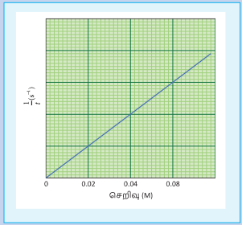
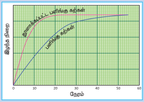
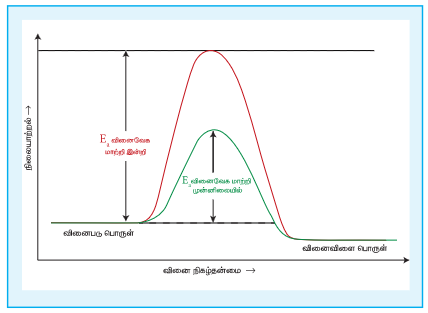

## 7.9 வினைவேகத்தை பாதிக்கும் காரணிகள்

ஒரு வினையின் வினை வேகத்தினைப் பின்வரும் காரணிகள் பாதிக்கின்றன

1. வினைபடி பொருட்களின் நிலைமை மற்றும் இயைபு
2. வினைபடி பொருட்களின் செறிவு
3. வினைபடி பொருட்களின் புறப்பரப்பளவு
4. வினையின் வெப்பநிலை
5. வினைவேக மாற்றியைப் பயன்படுத்துதல்.

### 7.9.1 வினைபடி பொருட்களின் நிலைமை மற்றும் இயைபு

ஒரு வேதி வினையில், வினைபடி பொருட்களில் உள்ள சில பிணைப்புகள் பிளவுறுதல், மற்றும் சில புதிய பிணைப்புகள் உருவாதல் ஆகியனவற்றின் காரணமாக வினைவினை பொருட்கள் உருவாகின்றன என நாம் அறிவோம். இச்செயல்முறையோடு தொடர்புடைய நிகர ஆற்றல் மாற்றமானது, வினைபடி பொருட்களின் தன்மையைப் பொறுத்து அமைவதால், வெவ்வேறு வினைகள் வெவ்வேறு வினைவேகங்களைப் பெற்றுள்ளன.

பருமனறி பகுப்பாய்வில் தாங்கள் நன்கறிந்த பின்வரும் இரு வினைகளை ஒப்பிடுவோம்.

1). பெர்ரஸ் அம்மோனியம் சல்பேட் (FAS) மற்றும் \( KMnO_4 \) இடையே நிகழும் ஆக்சிஜனேற்ற ஒடுக்க வினை.

2). ஆக்சாலிக் அமிலம் மற்றும் \( KMnO_4 \) இடையே நிகழும் ஆக்சிஜனேற்ற ஒடுக்க வினை.

\( KMnO_4 \) ஆல் \( Fe^{2+} \) ஆக்சிஜனேற்றமடைவதை ஒப்பிடும் போது ஆக்சாலிக் அமிலம் ஆக்சிஜனேற்றம் அடையும் வினை மிக மெதுவாக நிகழும் ஒரு வினையாகும். மேலும் \( KMnO_4 \) மற்றும் ஆக்சாலிக் அமிலத்திற்கு இடையேயான வினை சுமார் 60°C ல் நிகழ்த்தப்படுவதையும் நாம் அறிவோம்.

திட மற்றும் திரவ நிலைகளில் வினைபடுபொருட்கள் காணப்படும் வினைகளோடு ஒப்பிடும் போது வினை பொருட்கள் வாயு நிலையில் காணப்பட்டால் அவ்வினையின் வினைவேகம் அதிகமாக இருக்கும். எடுத்துக்காட்டாக, திட சோடியம் மற்றும் திட அயோடினுக்கு இடையேயான வினையோடு ஒப்பிடும் போது, அயோடின் ஆவியுடன் உலோக சோடியத்தின் வினையானது வேகமாக நடைபெறும்.

தாங்கள் காரீய உப்புகளைக் கண்டறிய பண்பறி பகுப்பாய்வில் மேற்கொள்ளும் மற்றுமொரு சோதனையைக் கருத்திற்கொள்வோம். நிறமற்ற காரீய நைட்ரேட் உப்புக்கரைசலுடன், நிறமற்ற பொட்டாசியம் அயோடைடின் நீர்க்கரைசலைச் சேர்க்கும் போது, இரு திரவங்களும் கலந்தவுடன் மஞ்சள் நிற காரீய அயோடைடு வீழ்படிவு உருவாகிறது. மாறாக திண்ம காரீய நைட்ரேட்டை திண்ம பொட்டாசியம் அயோடைடுடன் கலக்கும் போது மஞ்சள் நிறம் மெதுவாக உருவாகிறது.

### 7.9.2 வினைபடி பொருட்களின் செறிவு

வினைபடுபொருட்களின் செறிவு அதிகரிக்கும் போது வினையின் வேகமும் அதிகரிக்கின்றது. வினை வேகத்தின் மீதான வினைபடு பொருட்களினுடைய செறிவின் விளைவினை, மோதல் கொள்கையைப் பயன்படுத்தி நாம் விளக்க இயலும். மோதல் கொள்கையின் படி, வினைவேகமானது, வினைபடும் மூலக்கூறுகளுக்கிடையேயான மோதல்களின் எண்ணிக்கையினைப் பொறுத்து அமைகிறது. செறிவு அதிகரிக்கும் போது, மோதல் நிகழ அதிக வாய்ப்பு ஏற்படுகிறது. எனவே வினைவேகமும் அதிகரிக்கின்றது.

> **செயல்பாடு**
>
> 1. மூன்று கூம்புக்குடுவைகளை எடுத்துக் கொள்க. அவற்றை A, B, மற்றும் C எனப் பெயரிடுக.
> 2. A, B, மற்றும் C ஆகிய கூம்புக்குடுவைகளில் முறையே பியூரெட்டினைப் பயன்படுத்தி 0.1M சோடியம் தயோசல்பேட் கரைசலில் 10ml, 20ml, 40ml எடுத்துக் கொள்வோம். அவைகளில் முறையே 40ml, 30ml மற்றும் 10ml வாலைவடிநீரைச் சேர்த்து ஒவ்வொரு கூம்புக்குடுவையில் உள்ள கரைசலின் கனஅளவினையும் 50ml ஆக்குக.
> 3. கூம்புக்குடுவை Aல் 10ml 1M HCl ஐச் சேர்க்க. பாதியளவு HCl சேர்க்கப்படும் நிலையில் நிறுத்துக்கடிகாரத்தை இயக்கவும். கூம்புக்குடுவையை கவனமாக குலுக்கிக் குறுக்குக் குறியிடப்பட்ட ஒரு பீங்கான் தட்டின் மீது படத்தில் காட்டியுள்ளவாறு வைக்கவும். கூம்புக் குடுவையை அதன் மேல்பகுதியிலிருந்து உற்று நோக்கு. குறுக்குக் குறியீடு பார்வையிலிருந்து மறையும் தருணத்தில் நிறுத்து கடிகாரத்தை நிறுத்தி நேரத்தைக் குறித்துக் கொள்ளவும்.
> 4. B மற்றும் C ஆகியனவற்றில் உள்ள கரைசல்களைக் கொண்டு மீளவும் சோதனைகளை மேற்கொள்ளவும். இந்நேர்வுகளில் நேரங்களை அட்டவணையில் குறித்துக் கொள்ளவும்.
>
> | குடுவை | \( Na_2S_2O_3 \) ன் கன அளவு mL | நீரின் கன அளவு mL | \( Na_2S_2O_3 \) ன் செறிவு | எடுத்துக் கொள்ளப்பட்ட நேரம் (t) |
> |---|---|---|---|---|
> | A | 10 | 40 | 0.02 | |
> | B | 20 | 30 | 0.04 | |
> | C | 40 | 10 | 0.08 | |
>
> \( \frac{1}{t} \) Vs சோடியம் தயோசல்பேட் கரைசலின் செறிவு ஆகியவற்றிற்கிடையே வரைபடம் வரைக. படத்தில் காட்டியுள்ளவாறு வரைபடம் பெறப்படும்.
> 
> இங்கு \( \frac{1}{t} \) ஆனது வினை வேகத்தினை நேரிடையாக அளந்தறிய பயன்படுகிறது. எனவே, வினைபொருளின் \( Na_2S_2O_3 \) செறிவு அதிகரிப்பானது வினை வேகத்தினை அதிகரிக்கின்றது என அறிய முடிகிறது.
>
>
>

### 7.9.3 வினைபொருளின் புறப்பரப்பினால் ஏற்படும் விளைவு

பல படித்தான வினைகளில் திட வினைபொருட்களின் புறப்பரப்பானது வினைவேகத்தினைத் தீர்மானிப்பதில் ஒரு முக்கிய பங்காற்றுகிறது. கொடுக்கப்பட்டுள்ள ஒரு குறிப்பிட்ட எடையுடைய வினைபொருளின் உருவளவு குறையும் போது அதன் புறப்பரப்பு அதிகரிக்கிறது. வினைபடுபொருட்களின் புறப்பரப்பு அதிகரிப்பதன் காரணமாக ஒரு லிட்டர் கன அளவில் ஒரு வினாடியில் அதிக மோதல்கள் நடைபெற வாய்ப்பு ஏற்படுகிறது. எனவே வினைவேகம் அதிகரிக்கின்றது. எடுத்துக்காட்டாக, தூளாக்கப்பட்ட கால்சியம் கார்பனேட் ஆனது அதே அளவுடைய \( CaCO_3 \) பளிங்குக் கல்லுடன் ஒப்பிடும் போது நீர்த்த HCl அமிலத்துடன் வேகமாக வினைபுரிகின்றது.

> # செயல்பாடு
>
> ஒரு குவளையில், நிறை அறியப்பட்ட பளிங்கு கற்கள் எடுத்துக் கொள்ளப்படுகின்றன, அதனுடன் குறிப்பிட்ட கனஅளவுடைய நீர்த்த HCl சேர்க்கப்படுகிறது. HCl சேர்க்கப்படும் போது நிறுத்துக் கடிகாரம் இயக்கப்படுகிறது. வினை முழுவதும் நிறைவடையும் வகையில் சீரான கால இடைவெளிகளில் நிறை அளந்தறியப்படுகிறது. இதே சோதனையானது அதே நிறையுடைய நன்கு தூளாக்கப்பட்ட பளிங்குக் கற்களைக் கொண்டு நிகழ்த்தப்பட்ட முடிவுகள் அட்டவணைப்படுத்தப்படுகின்றன.
>
> வினை $\text{CaCO}_3(s) + 2\text{HCl(aq)} \rightarrow \text{CaCl}_2(aq) + \text{H}_2\text{O(l)} + \text{CO}_2(g)$
>
> வினை நிகழும் போது, கார்பன் டை ஆக்சைடு வெளியேறுவதால், வினை நிகழ நிகழ குவளையின் நிறை குறைந்து கொண்டே வருகிறது. எனவே, குவளையின் நிறை இழப்பை அளந்தறிவதன் மூலம், வேதிவினையின் வேகத்தினை நாம் அறிய இயலும்.
>
> நிறை இழப்பு Vs நேரம் இவற்றிற்கிடையே வரைபடம் வரையும் போது படத்தில் காட்டியுள்ளவாறு வரைபடம் பெறப்படுகிறது.
>
> தூளாக்கப்பட்ட பளிங்குக் கற்களைக் கொண்டு இச்சோதனையை நிகழ்த்தும் போது, வினையானது குறைவான நேரத்திலேயே நிறைவடைகின்றது. அதாவது, திட வினைபடுபொருட்களின் புறப்பரப்பளவு அதிகரிக்கும் போது வினைவேகம் அதிகரிக்கின்றது என அறிகிறோம்.
>
> 

### 7.9.4 வினைவேக மாற்றியினைப் பயன்படுத்துவதன் விளைவு

வினைபடுபொருட்களின் செறிவு, வெப்பநிலை மற்றும் புறப்பரப்பளவு அதிகரிக்கும் போது வினைவேகம் ஓரளவிற்கு அதிகரிக்கும் என நாம் கற்றிருந்தோம். எனினும், சிறிதளவு வினை வேக மாற்றியினை பயன்படுத்துவதன் மூலம் வினை வேகத்தில் குறிப்பிடத்தக்க மாற்றத்தினை ஏற்படுத்த இயலும். ஒரு பொருள் தான் எந்த ஒரு நிரந்தரமான வேதிமாற்றத்திற்கும் உட்படாமல் வினையின் வேகத்தினை மாற்றியமைக்குமானால் அப்பொருள் வினை வேக மாற்றி எனப்படும். இவைகள் வேதி வினைகளில் பங்கேற்றுமாயின், வினையின் இறுதியில் மீளவும் பெறப்படுகின்றன.

வினைவேக மாற்றியினைப் பயன்படுத்துவதால் வினையின் கிளர்வு ஆற்றல் குறைகிறது. எனவே, ஆற்றல் தடையினை கடந்து சென்று விளைபொருளாக மாறும் வினைபடு மூலக்கூறுகளின் எண்ணிக்கை அதிகரிக்கின்றன. இதன் காரணமாக வினைவேகமும் அதிகரிக்கின்றது.

> **செயல்பாடு:**
>
> இரு சோதனைக் குழாய்களை எடுத்துக் கொண்டு A மற்றும் B எனப் பெயரிடுக. 7ml 0.1N ஆக்சாலிக் அமிலக் கரைசல், 5ml 0.1N \( KMnO_4 \) கரைசல் மற்றும் 5ml 2N நீர்த்த \( H_2SO_4 \) கரைசல் ஆகியனவற்றை இரு சோதனைக் குழாய்களிலும் எடுத்துக் கொள்ளவும். இரு சோதனைக் குழாய்களிலும் உள்ள கரைசல்கள் இளஞ்சிவப்பு நிறத்திலிருக்கும்.
>
> இப்போது சிறிதளவு மாங்கனீஸ் சல்பேட் படிகங்களை A சோதனைக் குழாயிலிடவும். இளஞ்சிவப்பு நிறமானது மறையத் துவங்கி இறுதியில் முழுவதும் மறைகிறது. ஏனெனில் இந்நிகழ்வில் \( MnSO_4 \) வினைவேக மாற்றியாக செயல்பட்டு \( MnO_4^- \) ஆல் \( C_2O_4^{2-} \) ன் ஆக்சிஜனேற்றமடையும் வினையின் வேகத்தினை அதிகரிக்கின்றது.

> **மருந்தாக்க வேதியியலில் வேதி வினைவேகவியல்**
>
> மருந்தாக்க வேதியியலில், வேதி வினைவேகவியல் முக்கியப் பங்காற்றுகின்றது. மருந்துகள் உடலினுள் செயல்திறன் மிக்கதாகச் செயல்படும் கால அளவு மற்றும் உயிர் செயல்பாடுகளுக்கு பயன்படும் அதன் அளவு ஆகியனவற்றைப் பற்றிப் படிக்கும் பிரிவு மருந்தாக்க வேதிவினை வேகவியல் என அழைக்கப்படுகிறது. மருந்துவர்கள் மருந்துகளை பரிந்துரைக்கும் போது, ஒரு நாளுக்கு மூன்று முறை, இருமுறை அல்லது ஒரே ஒருமுறை என மருந்துகளின் தன்மையினைப் பொறுத்து வெவ்வேறு கால அளவுகளில் பரிந்துரைப்பார்கள். இவ்வாறு பரிந்துரை செய்வதற்கு மருந்தாக்க வேதிவினை வேகவியல் ஆய்வுகள் பயன்படுகின்றன. எடுத்துக்காட்டாக, நாம் நன்கு அறிந்த வலி மற்றும் சுர நிவாரணியாகப் பயன்படும் பாராசிட்டமாலைக் கருதுவோம். மருந்தாக்க வேதிவினை வேகவியல் ஆய்வுகளின் அடிப்படையில் உடலினுள் இதன் அரை வாழ் காலம் 2.5 மணி நேரம் என கண்டறியப்பட்டுள்ளது. அதாவது, இரத்த பிளாஸ்மாவில் இம்மருந்தின் அளவானது 2.5 மணி நேரத்தில் பாதியாகக் குறைகிறது. பத்துமணி நேரத்திற்குப் பின்னர் (நான்கு அரைவாழ்காலங்கள்) 6.25% மருந்து மட்டுமே எஞ்சியிருக்கும். இத்தகைய சோதனைகளின் அடிப்படையில் மருந்துகள் கொடுக்கப்படும் கால இடைவெளி தீர்மானிக்கப்படுகிறது. வழக்கமாக பாரசிட்டமால் மருந்தானது உடல் நிலையினைப் பொறுத்து ஆறு மணி நேரத்திற்கு ஒரு முறை எடுத்துக் கொள்ள பரிந்துரைக்கப்படுகிறது.

## பாடச் சுருக்கம்

- வேதி வினைவேகவியல் என்பது வெப்பநிலை, அழுத்தம், செறிவு போன்ற கொடுக்கப்பட்ட நிபந்தனைகளில் வேதிவினைகளின் வேகம் மற்றும் அவைகளின் வினை வழிமுறைகளைப் பற்றி கற்றறிவதாகும்.

- ஓரலகு காலத்தில் ஒரு வேதிவினையில் இடம்பெற்றுள்ள வினைப்பொருட்களின் செறிவில் ஏற்படும் மாற்றம் அவ்வினையின் வினைவேகம் எனப்படுகிறது.

- வினை நிகழும் போது, ஒரு குறிப்பிட்ட நேரத்தில் வினையின் வேகமானது அக்கணத்தில் வினைவேகம் (instantaneous rate) என அழைக்கப்படுகிறது. நாம் தேர்ந்தெடுக்கும் நேர இடைவெளியினைக் குறைத்துக் கொண்டே வரும் போது, வினைவேகத்தின் மதிப்பு, ஒரு குறிப்பிட்ட நேரத்தில் கண்டறியப்படும் வினைவேக மதிப்பினை நெருங்குகிறது.

- எந்த ஒரு நேரத்திலும் வினைபடி பொருள்கள், வினைவினைப் பொருட்களாக மாற்றப்படும் வேகத்தினை வினைவேகம் என்பது குறிப்பிடுகின்றது.

- ஒரு வினையில் ஈடுபடும் ஒவ்வொரு வினைபடி பொருளின் செறிவும் \( 1 \ mol L^{-1} \) ஆக உள்ளபோது, அத்தருணத்தில் வினையின் வேகமானது, அவ்வினையின் வினைவேக மாறிலிக்குச் சமமாகிறது.

- சோதனை மூலம் கண்டறியப்பட்ட வேகவிதியில் இடம் பெற்றுள்ள செறிவு உறுப்புகளின் அடுக்குகளின் கூடுதல் வினைவகை எனப்படும். மூலக்கூறு எண் ஒரு அடிப்படை வினையில், இடம் பெறும் வினைபடி மூலக்கூறுகளின் மொத்த எண்ணிக்கை மூலக்கூறு எண் எனப்படும்.

- ஒரு வினையில் வினைபடுபொருளின் செறிவானது அதன் துவக்க அளவில் சரிபாதியாக குறைவதற்குத் தேவைப்படும் காலம் அவ்வினையின் அரைவாழ் காலம் என அழைக்கப்படுகின்றது. முதல் வகை வினையினைப் பொறுத்த வரையில் அரைவாழ் காலமானது மாறிலியாகும். அதாவது, அரை வாழ் காலமானது வினைபடு பொருளின் துவக்கச் செறிவினைப் பொறுத்து அமைவதில்லை.

- மோதல் கொள்கையின்படி, வினைபடி பொருட்களின் மூலக்கூறுகளுக்கிடையே மோதல் நிகழ்வதால் வேதி வினைகள் நிகழ்கின்றன.

- பொதுவாக, வெப்பநிலை அதிகரிக்கும் போது, வினைவேகமும் அதிகரிக்கும். எனினும் இதில் சில விதிவிலக்குகளும் உண்டு. மேலும் வினைவேக அதிகரிப்பின் மதிப்பானது வினைக்கு வினை மாறுபடும். பெரும்பாலான வினைகளுக்கு \( 10^\circ C \) வெப்ப நிலை அதிகரிப்பிற்கு வினைவேகம் தோராயமாக இரு மடங்கு அதிகரிக்கும் எனலாம்.

- \( E_a \) என்பது கிளர்வு ஆற்றலாகும். ஒரு மூலக்கூறானது வேதி வினைபுரிய பெற்றிருக்க வேண்டிய குறைந்தபட்ச ஆற்றல் என இதனை அர்ஹீனியஸ் கருதினார்.

- ஒரு வினையின் வினை வேகத்தினைப் பின்வரும் காரணிகள் பாதிக்கின்றன:
  1. வினைபடி பொருட்களின் நிலைமை மற்றும் இயைபு
  2. வினைபடி பொருட்களின் செறிவு
  3. வினைபடி பொருட்களின் புறப்பரப்பளவு
  4. வினையின் வெப்பநிலை
  5. வினைவேக மாற்றியைப் பயன்படுத்துதல்.
