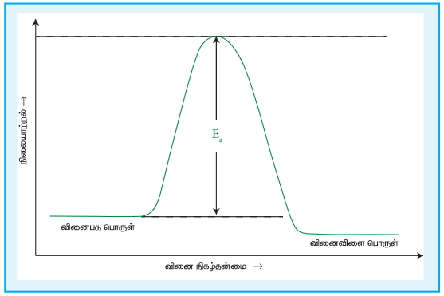

## 7.6 ஒரு வினையின் அரைவாழ்காலம்

ஒரு வினையில் வினைபடுபொருளின் செறிவானது அதன் துவக்க அளவில் சரிபாதியாக குறைவதற்குத் தேவைப்படும் காலம் அவ்வினையின் அரைவாழ் காலம் என அழைக்கப்படுகின்றது.

முதல் வகை வினையினைப் பொறுத்த வரையில் அரைவாழ் காலமானது மாறிலியாகும். அதாவது, அரை வாழ் காலமானது வினைபடு பொருளின் துவக்கச் செறிவினைப் பொறுத்து அமைவதில்லை.

ஒரு முதல் வகை வினைக்கான வினைவேக மாறிலியானது,

\[ k = \frac{2.303}{t} \log \left( \frac{[A_0]}{[A]} \right) \]

\( t = t_{\frac{1}{2}}; \) எனில் \( [A] = \frac{[A_0]}{2} \)

\[ k = \frac{2.303}{t_{\frac{1}{2}}} \log \left( \frac{[A_0]}{\frac{[A_0]}{2}} \right) \]

\[ k = \frac{2.303}{t_{\frac{1}{2}}} \log 2 \]

\[ k = \frac{2.303 \times 0.3010}{t_{\frac{1}{2}}} = \frac{0.6932}{t_{\frac{1}{2}}} \]

\[ t_{\frac{1}{2}} = \frac{0.6932}{k} \]

பூஜ்ய வகை வினைக்கான அரைவாழ்காலத்தை நாம் கண்டறிவோம்.

\[ \text{வினைவேக மாறிலி,} \ k = \frac{[A_0] - [A]}{t} \]

\( t = t_{\frac{1}{2}}; \) எனில் \( [A] = \frac{[A_0]}{2} \)

\[ k = \frac{[A_0] - \frac{[A_0]}{2}}{t_{\frac{1}{2}}} \]

\[ k = \frac{[A_0]}{2t_{\frac{1}{2}}} \]

\[ t_{\frac{1}{2}} = \frac{[A_0]}{2k} \]

எனவே, முதல் வகை வினையைப்போல் அல்லாமல், பூஜ்ய வகை வினையின் அரைவாழ் காலமானது, வினைபடுபொருட்களின் துவக்கச் செறிவிற்கு நேர்விகிதத்தில் அமைந்துள்ளது என அறிகிறோம்.

> A மட்டும் வினைபடு பொருளாக உள்ள n≠1 ஆக உள்ள n-வகை வினைகளுக்கான அரை வாழ்காலம்:
>
> \[ t_{\frac{1}{2}} = \frac{2^{n-1} - 1}{(n-1)k [A_0]^{n-1}} \]

> **எடுத்துக்காட்டு 4**
>
> ஒரு முதல்வகை வினையானது 90% நிறைவு பெற 8 மணி நேரம் தேவைப்படுகிறது எனில், அவ்வினை 80% நிறைவு பெற தேவையான நேரத்தினைக் கணக்கிடுக. (\(\log 5 = 0.6989; \log 10 = 1\))

**தீர்வு:**

ஒரு முதல் வகை வினைக்கு

\[ k = \frac{2.303}{t} \log \left( \frac{[A_0]}{[A]} \right) \quad \dots (1) \]

\([A_0] = 100M\) என்க. \( t = t_{90\%}; [A] = 10M \) (கொடுக்கப்பட்டது \( t_{90\%} = 8h \))

\[ t = t_{80\%}; [A] = 20M \]

\[ k = \frac{2.303}{t_{90\%}} \log \left( \frac{100}{10} \right) \]

\[ t_{80\%} = \frac{2.303}{k} \log (5) \quad \dots (2) \]

கொடுக்கப்பட்ட விவரங்களிலிருந்து k மதிப்பினைக் கண்டறிதல்.

\[ k = \frac{2.303}{t_{80\%}} \log \left( \frac{100}{20} \right) \]

\[ k = \frac{2.303}{8 \text{ hours}} \log 10 \]

\[ k = \frac{2.303}{8 \text{ hours}} (1) \]

k ன் மதிப்பினைச் சமன் (2) ல் பிரதியிட,

\[ t_{80\%} = \frac{2.303}{\frac{2.303}{8 \text{ hours}}} \log(5) \]

\[ t_{80\%} = 8 \text{ hours} \times 0.6989 \]

\[ t_{80\%} = 5.59 \text{ hours} \]

> **எடுத்துக்காட்டு 5**
>
> 500K வெப்பநிலையில், x வினைபொருள் என்ற ஒரு முதல் வகை வினையின் அரை வாழ் காலம் \( 6.932 \times 10^4 s \) at 500K வெப்பநிலையில் x ஐ வெப்பப்படுத்தும் போது 100 நிமிடங்களில், அது எவ்வளவு சதவீதம் சிதைவடைந்திருக்கும்? (\( e^{0.06} = 1.06 \))

**தீர்வு:**

கொடுக்கப்பட்டவை \( t_{\frac{1}{2}} = 6.932 \times 10^4 s \) தீர்க்க \( t=100 \ min \) எனும் போது, \( \frac{[A_0] - [A]}{[A_0]} \times 100 = ? \)

முதல் வகை வினைக்கு \( t_{\frac{1}{2}} = \frac{0.6932}{k} \) என நாம் அறிவோம்.

\[ k = \frac{0.6932}{6.932 \times 10^4} = 10^{-5} s^{-1} \]

\[ k = \left( \frac{1}{t} \right) \ln \left( \frac{[A_0]}{[A]} \right) \]

\[ 10^{-5} s^{-1} \times 100 \times 60 \ s = \ln \left( \frac{[A_0]}{[A]} \right) \]

\[ 0.06 = \ln \left( \frac{[A_0]}{[A]} \right) \]

\[ \frac{[A_0]}{[A]} = e^{0.06} = 1.06 \]

\[ \therefore \frac{[A_0] - [A]}{[A_0]} \times 100\% = \left( 1 - \frac{[A]}{[A_0]} \right) \times 100\% \]

\[ = \left( 1 - \frac{1}{1.06} \right) \times 100\% = 5.6\% \]

> **எடுத்துக்காட்டு 6**
>
> ஒரு முதல் வகை வினையானது 99.9% நிறைவடைய தேவையான நேரமானது, அவ்வினை பாதியளவு நிறைவடைய தேவையான நேரத்தைப் போல தோராயமாக பத்து மடங்கு எனக் காட்டுக.

**தீர்வு:**

\([A_0] = 100;\) எனக் கொள்க. \( t = t_{99.9\%}; [A] = (100-99.9) = 0.1 \)

\[ k = \frac{2.303}{t} \log \left( \frac{[A_0]}{[A]} \right) \]

\[ t_{99.9\%} = \frac{2.303}{k} \log \left( \frac{100}{0.1} \right) \]

\[ t_{99.9\%} = \frac{2.303}{k} \log 1000 \]

\[ t_{99.9\%} = \frac{2.303}{k} (3) = \frac{6.909}{k} \]

\[ t_{99.9\%} = 10 \times \frac{0.6909}{k} \]

\[ t_{99.9\%} = 10 \ t_{\frac{1}{2}} \]

> **தன்மதிப்பீடு 3**
>
> (1) \( A \longrightarrow \) வினைபொருள் என்ற முதல் வகை வினையில் A ஆனது 60% சிதைவடைய 40 நிமிடங்கள் தேவைப்படுகிறது. இவ்வினையின் அரை வாழ் காலம் என்ன?
>
> (2) ஒரு முதல் வகை வினையின் வினைவேக மாறிலி \( 2.3 \times 10^{-4} s^{-1} \) வினைபடுபொருட்களின் ஆரம்பச் செறிவு 0.01M எனில் 1 மணி நேரத்திற்குப் பின்னர் எஞ்சியிருக்கும் வினைபடு பொருளின் செறிவு யாது?
>
> (3) ஒரு எஸ்டரின் நீராற்பகுப்பு வினையானது அவ்வினையில் உருவாகும் கார்பாக்சிலிக் அமிலத்தை சோடியம் ஹைட்ராக்சைடிற்கு எதிராக தரம் பார்த்தல் மூலம் கண்காணிக்கப்படுகிறது. வெவ்வேறு கால இடைவெளிகளில் எஸ்டரின் செறிவானது பின்வரும் அட்டவணையில் தரப்பட்டுள்ளது.
>
>| நேரம் (min) | 0 | 30 | 60 | 90 |
>|---|---|---|---|---|
>| எஸ்டரின் செறிவு \( mol L^{-1} \) | 0.850 | 0.800 | 0.754 | 0.710 |
>
> மேற்க்கண்ட வினை ஒரு முதல் வகை எனக் காட்டுக.
