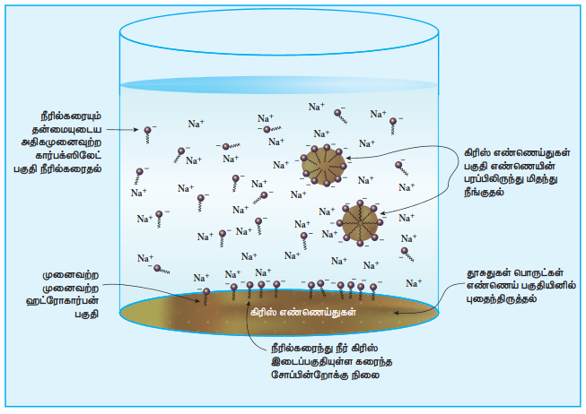
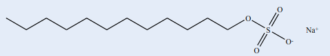
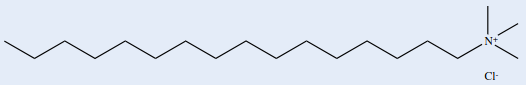
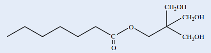

## 15.3 அழுக்கு நீக்கும் காரணிகள்

சோப்புகளும், டிடர்ஜெண்டுகளும் அழுக்கு நீக்கும் காரணிகளாக பயன்படுத்தப்படுகின்றன. வேதியியலாக சோப்புகள் என்பவை உயர் கொழுப்பு அமிலங்களின் சோடியம் அல்லது பொட்டாசியம் உப்புகளாகும். டிடர்ஜெண்டுகள் என்பவை ஆல்கைல் ஹைட்ரஜன் சல்பேட்டுகளின் சோடியம் உப்பு அல்லது ஆல்கைல் பென்சீன் சல்ஃபோனிக் அமிலங்களாகும்.

### 15.3.1 சோப்புகள்

சோப்புகள், விலங்கு கொழுப்பு அல்லது தாவர எண்ணெய்களிலிருந்து தயாரிக்கப்படுகின்றன. அவை நீண்ட சங்கிலி கொழுப்பு அமிலங்களின் கிளிசரால் எஸ்டர்களைக் கொண்டுள்ளன. கிளிசரைடுகளை சோடியம் ஹைட்ராக்சைடு கரைசலுடன் சேர்த்து வெப்பப்படுத்தும் போது அவை சோப்பாகவும், கிளிசராலாகவும் மாறுகின்றன. சோப்பாதல் வினையின் விளைவாக கிளிசரால் தயாரித்தலில் இந்த வினையை நாம் ஏற்கனவே கற்றறிந்தோம். சோப்பின் கரைதிறனை குறைப்பதற்கான வினைக்காகவும் சாதாரண உப்பு சேர்க்கப்படுகிறது. இது, நீர்த்த கரைசலிலிருந்து எளிதாக வீழ்படிவாவதற்கு உதவுகிறது. பின்னர் சோப்பானது தகுந்த நிறமிகள், வாசனைப் பொருட்கள் மற்றும் மற்றும் மருத்துவ ரீதியாக நன்மை தரும் வேதிப்பொருட்களுடன் கலக்கப்படுகிறது.

**மொத்த கொழுப்பளவு (TFM)**

ஒரு சோப்பின் தரமானது அதன் மொத்த கொழுப்பளவு (TFM மதிப்பு) மதிப்பின் அடிப்படையில் குறிப்பிடப்படுகிறது. இது, கனிம அமிலங்களுடன் சேர்த்து பகுக்கும் போது தனியாக பிரியும் கொழுப்புப் பொருளின் மொத்த அளவு என வரையறுக்கப்படுகிறது. அதிக TFM மதிப்பு கொண்ட சோப்பு அதிக தரமுடையதாகும். BIS தரநிர்ணயத்தின்படி, முதல்தர சோப்புகள் குறைந்தபட்சம் \( 76\% \) TFM மதிப்பை கொண்டிருக்க வேண்டும். அதே சமயம் இரண்டாம் மற்றும் மூன்றாம் தர சோப்புகள் முறையே குறைந்தபட்சம் \( 70\% \) மற்றும் \( 60\% \) சதவீத TFM மதிப்பை கொண்டிருக்க வேண்டும். நுரைத்தல், ஈரப்பதம், கொழகொழப்புத்தன்மை, ஆல்கஹாலில் கரையாத பொருட்கள் போன்றவை மற்ற தர நிர்ணய கூறுகளாக விளங்குகின்றன.

**சோப்பின் அழுக்கு நீக்கும் செயல்பாடு**

சோப்புகளின் அழுக்கு நீக்கும் செயல்பாட்டை புரிந்து கொள்வதற்காக, சோடியம் பால்மிட்டேட்டை சோப்பிற்கான எடுத்துக்காட்டாக கருதுவோம். சோப்பின் அழுக்கு நீக்கும் செயல்பாடானது சோப்பில் உள்ள கார்பாக்சிலேட் அயனியின் (பால்மிட்டேட் அயனி) அமைப்புடன் நேரடியாக தொடர்புபடுத்தப்பட்டுள்ளது. பால்மிட்டேட் அயனி இருமுனை அமைப்பை கொண்டுள்ளது. ஹைட்ரோகார்பன் பகுதியானது முனைவற்ற பகுதியாகவும் கார்பாக்சில் பகுதி முனைவுற்ற பகுதியாகவும் உள்ளது.

முனைவற்ற பகுதியானது நீர்வெறுக்கும் தன்மை கொண்டது. ஆனால் முனைவுற்ற பகுதியானது நீர்விரும்பும் தன்மை கொண்டது. நீர்வெறுக்கும் முனைவற்ற பகுதியானது எண்ணெய் மற்றும் பிசுக்கில் கரைகிறது. ஆனால் நீரில் கரைவதில்லை. நீர்விரும்பும் கார்பாக்சிலேட் தொகுதியானது நீரில் கரைகிறது. தூசித் துகள்கள் அல்லது எண்ணெய் பிசுக்கு ஆகியன துணிகளில் அழுக்காக ஒட்டிக்கொண்டுள்ளன. துணிகளில் எண்ணெய் அல்லது பிசுக்கு ஒட்டிக்கொண்டுள்ள பகுதியில் சோப்புகளை சேர்த்தும்போது, சோப்பின் ஹைட்ரோகார்பன் பகுதியானது பிசுக்கில் கரைகிறது, எதிர்மின் சுமை கொண்ட கார்பாக்சிலேட் முனையானது பிசுக்கின் மேற்பகுதியில் வெளியே நீட்டிக்கொண்டுள்ளது.

அதே நேரத்தில் எதிர்மின்சுமை கொண்ட கார்பாக்சிலேட் தொகுதிகள் நீரினால் வலுவாக கவரப்படுகின்றன. இதன் காரணமாக சிறிய நுண்கொழுப்புப் பொருள் (micelles) திவலை உருவாகிறது. மேலும், பிசுக்கானது திடப் பொருளிலிருந்து வெளியேற்றப்பட்டு மிதக்கிறது. நீரில் அலசும் போது இந்த பிசுக்கானது நீருடன் வெளியேறுகிறது. இதனால் துணிகளிலிருந்து விரும்பப்படும் நுண்கொழுப்புப் பொருட்கள் நீரில் கழுவி நீக்கப்படுகின்றன. நுண்கொழுப்புப் பொருட்களின் மேற்பரப்பானது எதிர்மின் சுமையை பெற்றிருப்பதால் துகள்கள் ஒன்றுடன் ஒன்று சேர்ந்து பெரிய குமிழாக மாறுவதில்லை. நீருக்கும், நீரில் கரையாத பிசுக்கிற்கும் இடையே பால்மமாக்கும் காரணியாக செயல்படும் தன்மையை பொருத்தே சோப்பின் அழுக்கு நீக்கும் தன்மை அமைகிறது.

### 15.3.2 டிடர்ஜெண்டுகள்

தொகுப்பு டிடர்ஜெண்டுகள் என்பவை ஆல்கைல் ஹைட்ரஜன் சல்பேட்டுகளின் சோடியம் உப்புகள் அல்லது நீண்ட சங்கிலி ஆல்கைல் பென்சீன் சல்போனிக் அமிலங்களின் சோடியம் உப்புகளைக் கொண்ட உருவாக்கப்பட்ட விளைபொருட்களாகும். மூன்று வகையான டிடர்ஜெண்டுகள் உள்ளன.

| அழுக்கு நீக்கியின் வகை | எடுத்துக்காட்டு |
|---|---|
| எதிரயனி டிடர்ஜெண்ட்கள் |  |
| நேரயனி டிடர்ஜெண்ட்கள் |  |
| அயனித் தன்மையற்ற டிடர்ஜெண்ட்கள் |  |

கடின நீரிலும், அமிலச் சூழல்களிலும் டிடர்ஜெண்டுகளை பயன்படுத்த முடியும் என்பதால் இவை சோப்புகளை விட மேம்பட்டவைகளாக கருதப்படுகின்றன. டிடர்ஜெண்டுகளின் அழுக்கு நீக்கும் செயல்பாடானது அழுக்கு நீக்கிகளின் சோப்புகளின் அழுக்கு நீக்கும் செயல்பாட்டை ஒத்துள்ளது.