## 15.1 மருந்துப் பொருட்கள்

மருந்து (drug) எனும் சொல்லானது "காய்ந்த மூலிகை" எனும் பொருள்படும் "drogue" எனும் பிரெஞ்சு மொழிச் சொல்லிருந்து வருவிக்கப்பட்டதாகும். மருந்து என்பது அதை பெறுபவரின் உடலியல் அமைப்பை அல்லது நோயுற்ற நிலையை மாற்றக்கூடிய அல்லது ஆய்வு செய்யக்கூடிய சேர்மமாகும். இது நோய் கண்டறிதலுக்காகவும், நோயை தடுக்கவும், நோயிலிருந்து குணமடையச் செய்யவும் பயன்படுத்தப்படுகிறது. புரதங்கள் போன்ற பெருமூலக்கூறு இலக்குகளுடன் இடையீடு செய்து, நோயாற்றுதல் மற்றும் பயனுள்ள உயிரியல் துலங்கல்களை உருவாக்கும் பொருட்கள் நோய் நீக்கும் மருந்துகள் என்றமைக்கப்படுகின்றன. மருந்துகளைக் கொண்டு ஒரு குறிப்பிட்ட நோயை குணப்படுத்தும் செயல்முறையானது வேதிச் சிகிச்சை (chemotherapy) என அறியப்படுகிறது. ஒரு முழுநிலை மருந்து என்பது நச்சுத் தன்மையற்ற, உயிரி இசைவுறு மற்றும் மக்கும் சேர்மமாகும், மேலும் அது எவ்வித பக்கவிளைவுகளையும் உருவாக்காமல் இருந்தல் அவசியம். பொதுவாக தற்காலத்தில் பயன்படுத்தப்படும் பெரும்பாலான மருந்துப் பொருள் மூலக்கூறுகள் குறைந்த செறிவில் பயன்படுத்தப்படும் போது மேற்கூறிய பண்புகளைப் பெற்றுள்ளன. எனினும், அதிக செறிவில் பயன்படுத்தப்பட்டால் அவை பக்கவிளைவுகளை உருவாக்கி நச்சுத் தன்மை கொண்டவைகளாக மாறுகின்றன. மருந்துகளின் தரமானது அவற்றின் மருத்தாக்க எண் அடிப்படையில் அளவிடப்படுகிறது. ஒரு குறிப்பிட்ட மருந்தின் அதிகபட்ச தாங்கும் மருந்தளவு (அதற்கு மேல் நச்சுத்தன்மை கொண்டதாக மாறும்) மற்றும் குறைந்தபட்ச குணப்படுத்தும் மருந்தளவு (இதற்கு கீழ் மருந்துகள் பயனற்றவை) ஆகியவற்றிற்கிடையே உள்ள விகிதம் அதன் மருத்தாக்க எண் என வரையறுக்கப்படுகிறது. உயர் மருத்தாக்க எண் மதிப்பை கொண்ட மருந்துகள் பாதுகாப்பான மருந்துகளாகும்.

### 15.1.1 மருந்துகளின் வகைப்பாடு

மருந்துகள், அவற்றின் வேதி அமைப்பு, மருத்தியல் விளைவுகள், இலக்கு அமைப்பு, செயல்பாட்டுத் தளம் போன்ற பண்புகளின் அடிப்படையில் வகைப்படுத்தப்படுகின்றன. இங்கு சில பொதுவான வகைப்பாட்டினை நாம் விவாதிக்க உள்ளோம்.

**வேதி அமைப்பின் அடிப்படையில் வகைப்பாடு**

இந்த வகைப்பாட்டில், பொதுவான அடிப்படை வேதி அமைப்பை கொண்ட மருந்துப் பொருட்கள் ஒரே குழுவாக வைக்கப்படுகின்றன. எடுத்துக்காட்டாக, ஆம்பிசிலின், அமாக்சிலின், மெத்திசிலின் போன்ற மருந்துகள் அனைத்தும் ஒத்த அமைப்பை கொண்டிருப்பதால், பெனிசிலின் என்றழைக்கப்படும் ஒரே தொகுதியில் வகைப்படுத்தப்படுகின்றன. இதே போல, ஓபியாய்டுகள், ஸ்டீராய்டுகள், கேடகோலமின்கள் போன்ற மற்ற தொகுதி மருந்துகளும் நம்மிடம் உள்ளன. ஒத்த வேதி அமைப்பை கொண்ட சேர்மங்கள் ஒத்த வேதிப்பண்புகளை கொண்டிருக்க வேண்டும் என எதிர்பார்க்கப்படுகின்றன. எனினும், அவற்றின் உயிர்வேதி செயல்பாடுகள் எப்பொழுதும் ஒரே மாதிரியாக இருப்பதில்லை. எடுத்துக்காட்டாக, பெனிசிலின் வகையைச் சார்ந்த மருந்துகள் அனைத்தும் ஒரே உயிரியல் செயல்பாடுகளைக் கொண்டுள்ளன, ஆனால் பார்பிட்யூரேட்டுகள், ஸ்டீராய்டுகள் ஆகியன மாறுபட்ட உயிரியல் செயல்பாட்டைக் கொண்டுள்ளன.

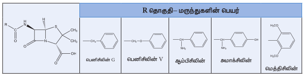

**மருத்தியல் விளைவின் அடிப்படையில் வகைப்பாடு**

இவ்வகைப்பாட்டில், நோயாளி மீது மருந்துகள் உண்டாக்கும் உயிரியல் விளைவுகளை அடிப்படையாக கொண்டு மருந்துகள் வெவ்வேறு தொகுதிகளாக வகைப்படுத்தப்படுகின்றன. எடுத்துக்காட்டாக, நோயுண்டாக்கும் பாக்டீரியாக்களை கொல்லும் திறனுடைய மருந்துகள் அனைத்தும் எதிர்உயிரிகள் என வகைப்படுத்தப்படுகின்றன. ஒரு குறிப்பிட்ட நோய்க்கு சிகிச்சையளிக்க தேவைப்படும் அனைத்து வகை மருந்துகளையும் இந்த வகைப்பாடு வழங்கும். கிடைக்கக்கூடிய மருந்துகளிலிருந்து, மருந்துவர் நோயாளியின் மருத்துவ நிலையை கருத்திற் கொண்டு, தகுந்த மருந்தை கவனமாக தேர்ந்தெடுக்க வேண்டும். எடுத்துக்காட்டுகள்:

எதிர்உயிரி மருந்துகள்: எரித்ரோமைசின், டெட்ராசைக்ளின் போன்றவை.

உயர் இரத்த அழுத்த எதிர்ப்பு மருந்துகள்: புரோபிரனோலால், அடினலால், மெடோப்பிரோலால் சக்சினேட், ஆம்லோடிபைன் போன்றவை.

**இலக்கு அமைப்பின் அடிப்படையில் வகைப்பாடு (மருந்துச் செயல்பாடு)**

இதில், நோயாளியின் உயிரியல் அமைப்பு அல்லது செயல்பாட்டில் மருந்துகளின் இலக்கின் அடிப்படையில் வகைப்படுத்தப்படுகின்றன. இந்த வகைப்பாடானது மருந்தியல் விளைவின் அடிப்படையில் நிகழ்த்தப்படும் வகைப்பாட்டைவிட அதிக தனித்தன்மை வாய்ந்தது. எடுத்துக்காட்டாக, பாக்டீரியாக்களில் புரத தொகுப்பைத் தடுக்கும் எதிர் உயிரிகளான ஸ்ட்ரெப்டோமைசின் மற்றும் எரித்ரோமைசின் ஆகியன ஒரே தொகுதியில் வகைப்படுத்தப்படுள்ளன. எனினும், அவற்றின் செயல்படு முறைமை வித்தியாசமானது. ஸ்ட்ரெப்டோமைசின் புரதம் தொகுப்பு துவங்குதலை தடுக்கிறது, ஆனால் எரித்ரோமைசின் புரதத்துடன் புதிய அமினோ அமிலங்கள் இணைதலை தடுக்கிறது.

**செயல்படு தளத்தின் அடிப்படையில் வகைப்பாடு (மூலக்கூறு இலக்கு)**

மருந்து மூலக்கூறானது நொதிகள், உணர்வேற்பிகள் போன்ற உயிரியல் மூலக்கூறுகளுடன் இடையீடு செய்கின்றன. இந்த உயிரியல் மூலக்கூறுகள் மருந்து இலக்குகள் என குறிப்பிடப்படுகின்றன. மருந்துகள் பிணையும் இலக்குகளின் அடிப்படையில் மருந்துகளை நம்மால் வகைப்படுத்த முடியும். மற்ற வகைப்பாடுகளுடன் ஒப்பிடும் போது இந்த வகைப்பாடானது அதிக சிறப்பு வாய்ந்தது. இலக்கு ஒன்றாக இருப்பதால் இந்த மருந்துகள் செயல்படும் வழிமுறையும் ஒன்றாகவே உள்ளது.

**15.1.2 மருந்துகள்-இலக்கு இடையீடு**

நம் உடல் இயல்பாக செயலாற்றுவதற்கு வளர்சிதை மாற்றம் (உணவு மூலக்கூறுகளை உடைத்து அதை ATP வடிவில் ஆற்றலாக மாற்றுதல் மற்றும் பல்வேறு நொதிகளை பயன்படுத்தி, கிடைக்கக்கூடிய முன்பொருள் மூலக்கூறுகளிலிருந்து அவசியமான உயிரியல் மூலக்கூறுகளின் உயிர்த்தொகுப்பு ஆகியவற்றிற்கு காரணமாக அமைகிறது), செல் சமிக்ஞை (சூழலில் நிகழும் எந்த மாற்றத்தையும் உணர்வேற்பிகளைப் பயன்படுத்தி உணர்தல் மற்றும் அதற்குண்டான துலங்கலை வெளிப்படுத்த தேவையான பல்வேறு செயல்முறைகளுக்கு சமிக்ஞை அனுப்புதல்) போன்ற உயிர்வேதிச் செயல்முறைகள் அத்தியாவசியமானவைகளாகும். நுண்ணுயிரிகள், வேதிப்பொருட்கள் போன்ற புறக்காரணிகளாலோ அல்லது அமைப்பிலேயே உண்டாகும் சீர்துறைவு காரணமாகவோ இந்த ஒழுங்கான நடைமுறைகள் பாதிக்கப்படலாம். அத்தகைய நிலைமைகளில், உடலின் இயல்பான செயல்பாட்டை மீளக்கொண்டு வருவதற்காக நாம் மருந்துகளை உட்கொள்ள நேரலாம். இந்த மருந்துகள் உடலில் நிகழும் பல்வேறு செயல்பாடுகளுக்கு காரணமான புரதங்கள், வளர்ச்சிக் காரணிகள் போன்ற உயிரியல் மூலக்கூறுகளுடன் இடையீடு செய்கின்றன. எடுத்துக்காட்டாக, உயிரியல் வினைவேக மாற்றிகளாக செயல்படும் புரதங்கள், நொதிகள் என்றழைக்கப்படுகின்றன. மேலும் தகவல் தொடர்பு அமைப்பிற்கு முக்கியமான புரதங்கள், உணர்வேற்பிகள் என்றழைக்கப்படுகின்றன. மருந்துகள் இந்த மூலக்கூறுகளுடன் இடையீடு செய்து, நொதி செயல்பாட்டை மாற்றுவதன் மூலமாகவோ அல்லது குறிப்பிட்ட உணர்வேற்பிகளை ஊக்குவித்தோ அல்லது அடக்கியோ அவற்றின் இயல்பான உயிர்வேதி வினைகளை திருத்தி அமைக்கின்றன.

**மருந்து இலக்குகளாக நொதிகள்**

அனைத்து உயிரின அமைப்புகளில் நிகழும் உயிர்வேதி வினைகள் அனைத்தும் நொதிகளால் தான் வினையூக்கப் பெறுகின்றன. எனவே, அமைப்பின் இயல்பான செயல்பாட்டிற்கு நொதிகளின் செயல்பாடு மிக அத்தியாவசியமானது. அவற்றின் இயல்பான நொதிச் செயல்பாடு தடுக்கப்பட்டால், அமைப்பானது பாதிக்கப்படும். பொதுவாக, இந்த தத்துவமானது பல்வேறு நோயுண்டாக்கும் நுண்ணுயிரிகளை அழிக்க பயன்படுத்தப்படுகிறது.

நொதி வினையூக்க வினைகளில், கிளர்வு மையம் மற்றும் வினைப்பொருள் ஆகியவற்றில் காணப்படும் அமினோ அமிலங்களுக்கிடையேயான ஹைட்ரஜன் பிணைப்பு, வாண்டர் வால்ஸ் வினைகள் போன்ற வலிமை குறைந்த இடையீறுகளின் வாயிலாக வினைப்பொருளானது நொதியின் கிளர்வு மையத்துடன் பிணைக்கப்படுகிறது என்பதை நாம் முன்னரே கற்றறிந்தோம். வினைப்பொருளின் வடிவமைப்பை ஒத்த மருந்து மூலக்கூறானது உட்செலுத்தப்படும்போது, அதுவும் நொதியுடன் பிணைந்து அதன் செயல்பாட்டை முடக்குகிறது. அதாவது, மருந்து பொருட்கள் நொதி வினையூக்கி தடுப்பான்களாக செயல்படுகின்றன. இவ்வகை தடுப்பான்கள் போட்டித் தன்மையுள்ள தடுப்பான்கள் (competitive inhibitors) என்றழைக்கப்படுகின்றன. எடுத்துக்காட்டாக, p-அமினோபென்சாயிக் அமிலத்தின் (PABA) வடிவமைப்பை ஒத்த அமைப்பு கொண்ட சல்ஃபோனமைடு எனும் எதிர்உயிரி மருந்தானது பாக்டீரியா வளர்ச்சியை தடுக்கிறது. ஃபோலிக் அமிலம் எனும் துணைநொதியை உற்பத்தி செய்வதற்கு பல பாக்டீரியாக்களுக்கு PABA தேவைப்படுகிறது. சல்ஃபோனமைடு எதிர்உயிரியை உட்செலுத்தும்போது, பாக்டீரியாக்களில் PABA வை ஃபோலிக் அமிலமாக மாற்றமடையும் உயிர்வேதி தொகுப்பில் முக்கிய பங்காற்றும் டைஹைட்ரோப்பீரோயேட் சின்தேடேஸ் (DHPS) எனும் நொதிக்கு போட்டித் தன்மையுள்ள தடுப்பானாக செயல்படுகிறது. இது ஃபோலிக் அமில பற்றாக்குறையை உருவாக்குகிறது, இதன் விளைவாக பாக்டீரியாவின் வளர்ச்சி தடைசெய்யப்பட்டு அவை கொல்லப்படுகின்றன.

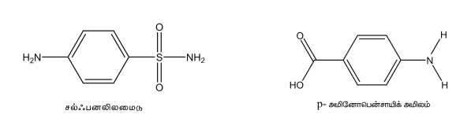

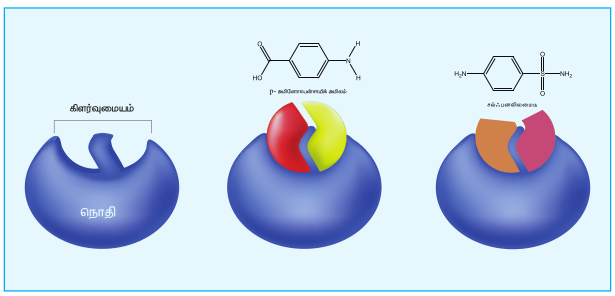

சில நொதிகளில், தடுப்பான் மூலக்கூறானது கிளர்வு மையங்களில் பிணையாமல் வேறு சில மையங்களில் சென்று பிணைகிறது. இந்த மையங்கள் பொதுவாக பிறமையங்கள் (allosteric site) என குறிப்பிடப்படுகின்றன. இவை நொதியிலுள்ள கிளர்வு மையங்களின் வடிவங்களை மாற்றமடையச் செய்கின்றன. இதன் விளைவாக வினைப்பொருள் மூலக்கூறுகள் நொதியுடன் பிணைய இயலாமல் போகிறது. இவ்வகை தடுப்பான்கள் பிறமைய தடுப்பான்கள் (allosteric inhibitors) என்றழைக்கப்படுகின்றன.

**மருந்து இலக்குகளாக உணர்வேற்பிகள்**

பல மருந்துகள், உணர்வேற்பி என்றழைக்கப்படும் குறிப்பிட்ட மூலக்கூறுடன் பிணைந்து அவற்றின் உடலியல் விளைவுகளை உண்டாக்குகின்றன. செல்லில் துலங்கலை தூண்டுவதே இந்த உணர்வேற்பிகளின் முக்கிய வேலையாகும். பெரும்பாலான உணர்வேற்பிகள் செல் சவ்வுகளுடன் இணைந்தே காணப்படுகின்றன. மேலும் இவற்றின் கிளர்வு மையங்கள் செல் சவ்வின் வெளிப்பகுதியில் வெளியே தெரியும்படி அமைந்துள்ளன. செல்களுக்கு தகவல்களை தாங்கிச் செல்லும் வேதித்தூதுவர்கள் இந்த உணர்வேற்பிகளின் கிளர்வு மையங்களுடன் பிணைகின்றன. இதன் மூலம் தகவல் செல்லினுள் தகவல் கடத்தப்படுகிறது. இந்த உணர்வேற்பிகள் ஒரு குறிப்பிட்ட வேதித் தூதுவர்க்கு மட்டும் தேர்ந்து செயலாற்றுகின்றன. ஒரு தகவலை நாம் தடுக்க வேண்டுமானில், உணர்வேற்பியின் கிளர்வு மையத்துடன் பிணையும் தன்மை கொண்ட ஒரு மருந்துப் பொருள் பிணைந்து உணர்வேற்பியின் இயல்பான செயல்பாட்டை தடுக்க வேண்டும். இத்தகைய மருந்துகள் எதிர்விளைவுக்கிகள் (antagonists) என்றழைக்கப்படுகின்றன. இதற்கு மாறாக, சில மருந்துப் பொருட்கள் உணர்வேற்பிகளில் இயற்கையான வேதித்தூதுவர்களுக்கு பதிலாக பிணைகின்றன. இவ்வகை மருந்துகள் முதன்மை இயக்கிகள் (agonists) என்றழைக்கப்படுகின்றன, மேலும் வேதித்தூதுவர்களின் பற்றாக்குறை ஏற்படும்போது இவை பயன்படுத்தப்படுகின்றன.

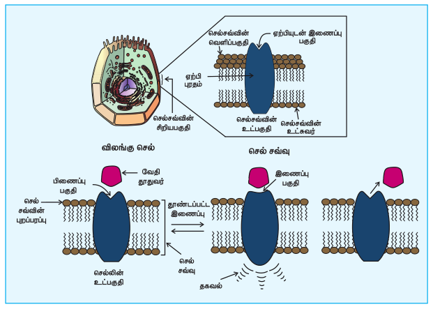

எடுத்துக்காட்டாக, அடினோசின் ஆனது அடினோசின் உணர்வேற்பியுடன் பிணையும்போது தூக்கத்தை தூண்டுகிறது. ஆனால், எதிர்விளைவுக்கி மருந்துப் பொருளான காஃபின் ஆனது அடினோசின் உணர்வேற்பியுடன் பிணைந்து அதை செயல்திறனற்றதாக்குகிறது. இதனால் தூக்கக் கலக்கம் குறைகிறது. வலிநிவாரணியாக பயன்படும், முதன்மை இயக்கியான மார்பின் ஆனது ஓபியாய்டு உணர்வேற்பிகளுடன் பிணைந்து அவற்றை கிளர்வுறுத்துகிறது. இது, வலியை உண்டாக்கும் நரம்புத் தூண்டல் கடத்திகளை அடக்கிவைக்கிறது.

> பெரும்பாலான உணர்வேற்பிகள் கைரல் தன்மை கொண்டவைகளாக உள்ளன. எனவே ஒரு மருந்தின் வெவ்வேறு முனையிடோமர்கள் வேறுபட்ட விளைவுகளை உருவாக்கக்கூடும்.

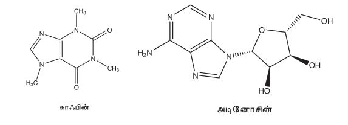

**பல்வேறு வகை மருந்துப் பொருட்களின் மருந்தியல் செயல்பாடு**

பல்வேறு உயிரியல் செயல் முறைகள் மற்றும் அவற்றின் வினைவழி முறைகளை நாம் தெளிவாக புரிந்து கொள்ள உயிரியல் துறையில் ஏற்பட்ட முன்னேற்றங்கள் உதவுகின்றன. இதனால் அதிக திறனுள்ள புதிய மருந்துகளை நம்மால் உருவாக்க முடிந்தது. எடுத்துக்காட்டாக, அமிலத்தன்மையை நீக்க நாம் அலுமினியம் மற்றும் மெக்னீசியம் ஹைட்ராக்சைடு போன்ற வலிமை குறைந்த காரங்களை பயன்படுத்தி வருகிறோம். ஆனால் இவை வயிற்றில் காரத்தன்மையை உண்டுபண்ணுகின்றன. மேலும், அதிகமான அமில சுரப்பிற்கும் வழிவகுக்கின்றன. மேலும் இந்த சிகிச்சையானது நோய் அறிகுறியை தணிக்கிறதே தவிர, நோய்க்கான காரணத்தை கட்டுப்படுத்தவில்லை. ஹிஸ்டமின்கள், இரைப்பை சுவரில் உள்ள உணர்வேற்பிகளை கிளர்வுறுத்தி, HCl சுரப்பை தூண்டுகின்றன என்பதை விரிவான ஆராய்ச்சிகள் காட்டுகின்றன. இந்த கண்டுபிடிப்பானது, சிமிடிடின், ரானிடிடின் போன்ற புதிய மருந்துகளை வடிவமைக்க உதவியது. இந்த மருந்துகள் உணர்வேற்பிகளுடன் பிணைந்து அவற்றை செயலிழக்கச் செய்கின்றன. இந்த மருந்துப் பொருட்களின் வடிவமைப்பானது ஹிஸ்டமினின் வடிவமைப்புடன் ஒத்துள்ளன. இப்பாடப்பகுதியில், சில முக்கிய மருந்து வகைகளின் மருந்தியல் செயல்பாட்டுடன் பற்றி விவாதிக்க உள்ளோம்.

| மருந்துப் பொருட்களின் வகை | செயல்படும் வழிமுறை | சில மருந்துகளின் வேதி அமைப்பு |
|---|---|---|
| **1) மன அமைதிப்படுத்திகள்**  இவை நரம்பு மண்டலத்தை தாக்கும் மருந்துகளாகும்.  **i) முக்கிய மன அமைதிப்படுத்திகள்:**  **எடுத்துக்காட்டுகள்:**<ul><li>ஹேலோபெரிடால்</li><li>குளோசாபைன்</li></ul> **ii) சிறிய மன அமைதிப்படுத்திகள்:**  **எடுத்துக்காட்டுகள்:**<ul><li>டையசிபாம் (வேலியம்)</li><li>ஆல்ப்ராசோலம்</li></ul> | மூளையிலுள்ள டோபமைன் எனும் நரம்புத் தூண்டல் கடத்தியை முடக்குவதன் மூலம் மைய நரம்பு மண்டலத்தின்மீது செயல்புரிகின்றன.  **பயன்கள்**<ul><li>மன உளைச்சல்</li><li>பதற்றம்</li><li>மனச்சோர்வு</li><li>தூக்கக் குறைபாடு</li><li>தீவிர மனச்சிதைவு ஆகியவற்றிற்கு சிகிச்சை அளித்தலில் பயன்படுகிறது.</li></ul> | 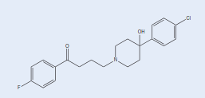  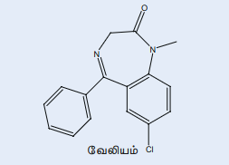  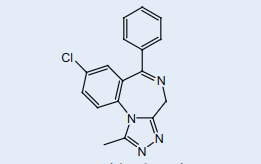 |
| **2) வலிநிவாரணிகள் (போதை தராதவை)**  வலிநிவாரணிகள் சுய உணர்வு நிலையை பாதிக்காமல் வலியை குறைக்கின்றன.  **i) அழற்சி எதிர்ப்புமருந்துகள்:**  **எடுத்துக்காட்டு:**<ul><li>அசிட்டமினோஃபீன் அல்லது பாராசிட்டமால்</li><li>புரூஃபென்</li><li>ஆஸ்பிரின்</li></ul> **ii) காய்ச்சல் மருந்துகள்**  **எடுத்துக்காட்டு:**<ul><li>சாலிசிலேட்டுகள்</li><li>அசிட்டைல் சாலிசிலிக் அமிலம் (ஆஸ்பிரின்)</li><li>அசிட்டமினோஃபீன் அல்லது பாராசிட்டமால்</li></ul> **iii) ஸ்டீராய்டு அல்லாத அழற்சி எதிர்ப்புமருந்துகள் (NSAIDs)**  **எடுத்துக்காட்டு:**<ul><li>புரூஃபென்</li></ul> | **i) அழற்சி எதிர்ப்புமருந்துகள்** குறிப்பிட்ட இடத்திலுள்ள அழற்சி துலங்கல்களை குறைத்து வலியை நீக்குகின்றன.  **பயன்கள்**<ul><li>குறுகிய கால வலிநிவாரணியாகவும்,</li><li>தலைவலி, தசைவலி, சிராய்ப்பு அல்லது மூட்டு அழற்சி போன்ற மிதமான வலிகளை போக்கவும் பயன்படுகிறது.</li></ul> **ii) காய்ச்சல் மருந்துகள்** இந்த மருந்துகள், காய்ச்சலை குறைத்தல் மற்றும் சிறுதட்டணுக்கள் உறைதலை தடுத்தல் போன்ற வேறு பல விளைவுகளையும் கொண்டுள்ளன. இந்த பண்பின் காரணமாக, ஆஸ்பிரின் மாரடைப்பை தடுக்கும் மருந்தாகவும் பயன்படுகிறது.  **iii) ஸ்டீராய்டு அல்லாத அழற்சி எதிர்ப்புமருந்துகள் (NSAIDs)** மூளையின் அடிப்பகுதியை (ஹைப்போதலாமஸ்) தூண்டி மென்தசை சுருக்கியினால் (prostaglandin) உருவாக்கப்பட்ட உயர் உடல் வெப்பநிலையை குறைக்கின்றன. | 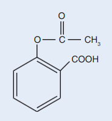  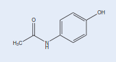  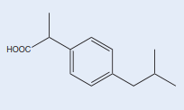 |
| **3) ஓபியாய்டுகள் (போதை தரும் வலிநிவாரணிகள்)**  **எடுத்துக்காட்டுகள்:**<ul><li>மார்ஃபின்</li><li>கொடீனைக்</li></ul> | வலியை நீக்கி தூக்கத்தைக் கொடுக்கின்றன. இந்த மருந்துகள் போதை தரக்கூடியவை. மிக குறைந்தளவு கோமா மற்றும் உயிரிழத்தலை உருவாக்கலாம்.  **பயன்கள்**<ul><li>கடுமையான வலியிலிருந்து நிவாரணம் அளிக்க குறைந்த அல்லது நீண்ட காலத்திற்கு பயன்படுத்தப்படுகிறது.</li><li>பொதுவாக அறுவைசிகிச்சைக்கு பிறகு உண்டாகும் வலி, இறுதிநிலைப் புற்றுநோய் ஆகியவற்றிற்கு பயன்படுகிறது.</li></ul> | 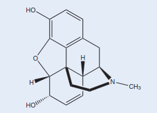  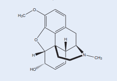 |
| **4) உணர்விழப்பு ஊக்கிகள்**  **i) மரப்பு மருந்துகள்**  **எடுத்துக்காட்டுகள்:**<ul><li>எஸ்டர் - பிணைந்த மரப்பு மருந்து – புரோகைன்</li><li>அமைடு - பிணைந்த மரப்பு மருந்து – லிடோகைன்</li></ul>  **ii) பொது உணர்விழப்பு ஊக்கிகள்**  **எடுத்துக்காட்டுகள்:**<ul><li>சிரைவழி பொது உணர்விழப்பு ஊக்கிகள் – ப்ரொபோஃபால்</li><li>சுவாசவழி பொது உணர்விழப்பு ஊக்கிகள் – ஐசோஃபுளூரேன்</li></ul> | **i) மரப்பு மருந்துகள்** இது, உணர்விழக்கச் செய்யாமல், அவை பூசப்பட்ட உடற்பகுதியில் மட்டும் மரத்துப் போகச் செய்கின்றன. இவை புற நரம்பு இழைகளின் வழியாக மூளைக்கு வலி உணர்வு கடத்தப்படுதலை தடுக்கின்றன.  **பயன்கள்**<ul><li>இவை சிறிய அறுவை சிகிச்சையின்போது பயன்படுத்தப்படுகின்றன.</li></ul>  **ii) பொது உணர்விழப்பு ஊக்கிகள்** இவை மைய நரம்பு மண்டலத்தை தாக்கி, கட்டுப்படுத்தப்பட்ட, மீள்தன்மையுடைய உணர்விழப்பை (மயக்கம்) உண்டாக்குகிறது.  **பயன்கள்**<ul><li>இவை பெரிய அறுவை சிகிச்சையின்போது பயன்படுத்தப்படுகின்றன.</li></ul> | 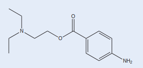  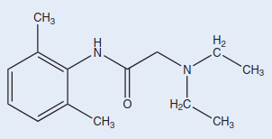  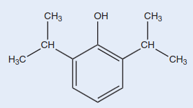 |
| **5) அமிலநீக்கிகள்**  **எடுத்துக்காட்டுகள்:**<ul><li>மெக்னீஷியா பால்மம்</li><li>சோடியம் பைகார்பனேட்</li><li>கால்சியம் பைகார்பனேட்</li><li>அலுமினியம் ஹைட்ராக்சைடு</li><li>ரேனிடிடின்</li><li>செமிடிடின்</li><li>ஒமிபிரசோல்</li><li>ரபிபிரசோல்</li></ul> | வயிற்றில் அமிலத்தன்மையை உருவாக்கும் அமிலத்தை நடுநிலையாக்குகின்றன.  **பயன்கள்**<ul><li>அமில எதிர்வினையால் நெஞ்சு மற்றும் தொண்டைப் பகுதியில் ஏற்படும் எரிச்சல் உணர்வை நீக்குகின்றன.</li></ul> | 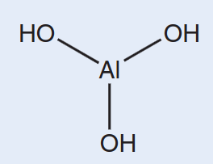 |
| **6) ஒவ்வாமை முறிவு மருந்துகள்**  **எடுத்துக்காட்டுகள்:**<ul><li>செட்ரிஜின்</li><li>லீவோசெட்ரிஜின்</li><li>டெஸ்லோரோட்டைன்</li><li>புரோம்ஃபினைரமின்</li><li>டெர்ஃபினடைன்</li></ul> | ஹிஸ்டமின் -1 உணர் வேற்பிகளிலிருந்து ஹிஸ்டமின் வெளிப்படுதலை தடுக்கின்றன.  **பயன்கள்**<ul><li>ஒவ்வாமை விளைவுகளிலிருந்து நிவாரணம் அளிக்கின்றன.</li></ul> | 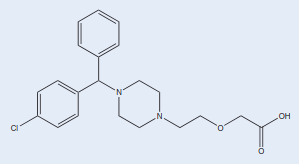 |
| **7) நுண்ணுயிர் எதிரிகள்**  **i). பீட்டா லாக்டம்கள்**  **எடுத்துக்காட்டுகள்:**<ul><li>பெனிசிலின்கள்</li><li>ஆம்பிசிலின்</li><li>செஃபாலோஸ்போரின்கள்</li><li>கார்பாபீனம்கள்</li><li>மோனோபேக்டம்கள்</li></ul>  **ii). மேக்ரோலைடுகள்**  **எடுத்துக்காட்டுகள்:**<ul><li>எரித்ரோமைசின்</li><li>அசித்ரோமைசின்</li></ul>  **iii). ஃபுளூரோகுயினலோன்கள்**  **எடுத்துக்காட்டுகள்:**<ul><li>கிளினாஃபிளாக்ஸசின்</li><li>சிப்ரோஃபிளாக்ஸசின்</li><li>லீவோஃபிளாக்ஸசின்</li></ul>  **iv). டெட்ராசைக்ளின்கள்**  **எடுத்துக்காட்டுகள்:**<ul><li>டாக்ஸிசைக்ளின்</li><li>மினோசைக்ளின்</li><li>ஆக்ஸி டெட்ராசைக்ளின்</li></ul>  **v). அமினோ கிளைகோசைடுகள்**  **எடுத்துக்காட்டுகள்:**<ul><li>கெனாமைசின்</li><li>ஜென்டாமைசின்</li><li>நியோமைசின்</li></ul> | **i). பீட்டா லாக்டம்கள்** பாக்டீரியா செல் சுவரின் உயிர்த் தொகுப்பை தடுக்கின்றன.  **பயன்கள்**<ul><li>தோல், பல், காது, சுவாசக்குழல், சிறுநீர்குழாய் ஆகியவற்றில் ஏற்படும் தொற்று நோய்கள், நிமோனியா, மற்றும் மேகவெட்டை நோய் ஆகியவற்றிற்கு சிகிச்சையளிக்க பயன்படுகின்றன.</li></ul>  **ii). மேக்ரோலைடுகள்** பாக்டீரியாவின் ரிபோசோம்களை தாக்கி புரத தயாரிப்பை தடுக்கின்றன.  **பயன்கள்:**<ul><li>சுவாச குழல், பாலின உறுப்புகள், இரைப்பை-குடல் வழி மற்றும் தோல் தொற்று நோய்களுக்கு சிகிச்சையளிக்க பயன்படுகின்றன.</li></ul>  **iii). ஃபுளூரோகுயினலோன்கள்** பாக்டீரியா நொதியான DNA கைரேஸை தடுக்கிறது.  **பயன்கள்**<ul><li>சிறுநீர்குழாய், தோல் மற்றும் சுவாசக்குழல் தொற்று நோய்கள் (சுவாசகுழலறை அழற்சி, நிமோனியா, சுவாசகுழல் அழற்சி போன்றவை), நுரையீரலில் நீர்மத்திசு அழற்சி ஆகியவற்றிற்கு சிகிச்சையளிக்க பயன்படுகின்றன.</li></ul>  **iv). டெட்ராசைக்ளின்கள்** பாக்டீரியா ரிபோசோமின் துணை அலகான 30S உடன் இடையீடு செய்வதன் மூலம் புரத தொகுப்பை தடுக்கிறது.  **பயன்கள்**<ul><li>குடற்புண், சுவாசக் குழல் தொற்று, காலரா, முகப்பரு ஆகியவற்றிற்கு சிகிச்சையளிக்க பயன்படுகின்றன.</li></ul>  **v). அமினோ கிளைகோசைடுகள்** பாக்டீரியா ரிபோசோமின் துணை அலகான 30S உடன் இடையீடு செய்வதன் மூலம் புரத தொகுப்பை தடுக்கிறது.  **பயன்கள்**<ul><li>இனக்கீற்று ஏற்காத (gram-negative) பாக்டீரியாக்களால் உருவாகும் தொற்று நோய்களுக்கு சிகிச்சையளிக்க பயன்படுகின்றன.</li></ul> | 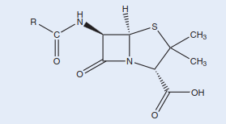  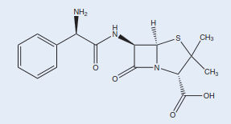  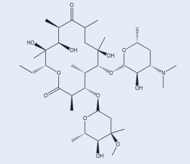  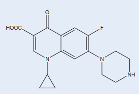  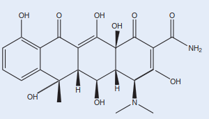  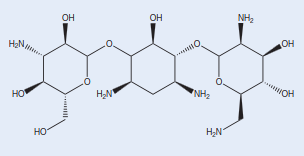 |
| **8. புரைதடுப்பான்கள்:**  **எடுத்துக்காட்டுகள்:**<ul><li>ஹைட்ரஜன் பெராக்சைடு</li><li>போவிடோன்-அயோடின்</li><li>பென்சல்கோனியம் குளோரைடு</li></ul> | நுண்ணுயிரிகளின் வளர்ச்சியை தடுக்கின்றன அல்லது குறைக்கின்றன. – உயிருள்ள திசுக்களின் மீது பயன்படுத்தப்படுகிறது.  **பயன்கள்**<ul><li>அறுவை சிகிச்சையின்போது தொற்று ஏற்படும் அபாயத்தை குறைக்க பயன்படுகிறது.</li></ul> | 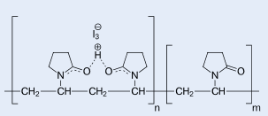  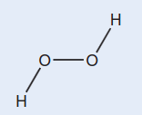 |
| **9. கிருமிநாசினிகள்**  **எடுத்துக்காட்டுகள்:**<ul><li>குளோரின் சேர்மங்கள்</li><li>ஆல்கஹால்</li><li>ஹைட்ரஜன் பெராக்சைடு</li></ul> | நுண்ணுயிரிகளின் வளர்ச்சியை தடுக்கின்றன அல்லது குறைக்கின்றன. – பொதுவாக உயிரற்ற பொருட்களின் மீது பயன்படுத்தப்படுகிறது. |  |
| **10. கருத்தடை மருந்துகள்**  **எடுத்துக்காட்டு:**  **தொகுப்பு ஈஸ்ட்ரோஜன்**<ul><li>எத்தினைல் ஈஸ்ட்ராடையால்</li><li>மென்ஸ்ட்ரனால்</li></ul> **தொகுப்பு புரொஜஸ்ட்ரோன்**<ul><li>நாரீதின்ட்ரோன்</li><li>நாரீதைநோட்ரெல்</li></ul> | இந்த தொகுப்பு ஹார்மோன்கள் அண்ட விடுவிப்பு / கருத்தரித்தலை தடுக்கின்றன.  **பயன்கள்**<ul><li>கருத்தடை மாத்திரைகளில் பயன்படுத்தப்படுகிறது.</li></ul> | 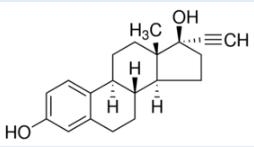 |
