## 15.4 பலபடிகள்

பலபடி (polymer) எனும் சொல்லானது 'polumeres' எனும் கிரேக்கச் சொல்லிருந்து வருவிக்கப்பட்டதாகும். இதன் பொருள் "பல பாகங்களைக் கொண்டது" என்பதாகும். ஒரு பலபடியின் உள்ளமைப்பானது, அதன் கட்டமைப்பு அலகுகளான ஒற்றைப்படி மூலக்கூறுகளால் விளக்கப்படுகிறது. பலபடிகள், எளிய மூலக்கூறுகளிலிருந்து வருவிக்கப்பட்ட அதிக எண்ணிக்கையிலான ஒற்றைப்படி அலகுகளை கொண்டுள்ளன. எடுத்துக்காட்டாக: PVC (பாலி வினைல் குளோரைடு) என்பது வினைல் குளோரைடு எனும் ஒற்றைப்படி அலகுகளிலிருந்து உருவாக்கப்பட்ட பலபடியாகும். பலபடிகள் அவற்றின் மூலங்கள், அமைப்பு, மூலக்கூறு விசைகள் மற்றும் தயாரிப்பு முறை ஆகியவற்றின் அடிப்படையில் வகைப்படுத்தப்படுகின்றன. பின்வரும் அட்டவணையானது பலபடிகளின் பல்வேறு வகைகளை விளக்குகிறது.

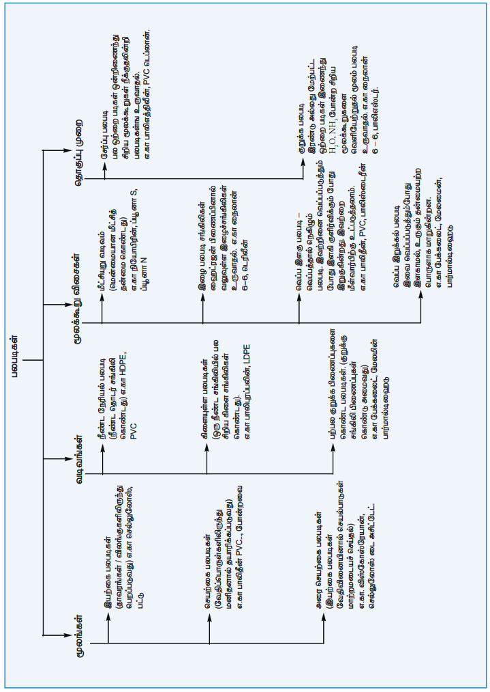

### 15.4.2 பலபடியாக்கலின் வகைகள்

சிறிய கட்டமைப்பு அலகுகளிலிருந்து அதாவது ஒற்றைப்படி மூலக்கூறுகளிலிருந்து மிகப்பெரிய அதிக மூலக்கூறு நிறை கொண்ட பலபடிகளை உருவாக்கும் செயல்முறையானது பலபடியாக்கல் என்றமைக்கப்படுகிறது. பலபடியாக்கல் பின்வரும் இரண்டு வழிகளில் நிகழ்கிறது.

i. சேர்ப்பு பலபடியாக்கல் அல்லது சங்கிலி வளர்ச்சி பலபடியாக்கல்
ii. குறுக்க பலபடியாக்கல் அல்லது படி வளர்ச்சி பலபடியாக்கல்

**சேர்ப்பு பலபடியாக்கல்**

பல ஆல்கீன்கள் தகுந்த சூழலில் பலபடியாக்கலுக்கு உட்படுகின்றன. சங்கிலி வளர்ச்சி வழிமுறையில், வளர்ந்து கொண்டே செல்லும் சங்கிலியின் வீரிய முனையானது ஒற்றைப்படி மூலக்கூறின் இரட்டைப் பிணைப்பினூடே இணைக்கிறது. வினையில் ஈடுபடும் இடைநிலை அமைப்பை பொருத்து பின்வரும் மூன்று வழிமுறைகளில் ஏதேனும் ஒன்றை பின்பற்றி சேர்ப்பு பலபடியாக்கல் நிகழ்கிறது.

i. தனி உறுப்பு பலபடியாக்கல்
ii. நேரயனி பலபடியாக்கல்
iii. எதிரயனி பலபடியாக்கல்

**தனி உறுப்பு பலபடியாக்கல்**

ஆல்கீன்களை, பென்சாயில் பெராக்சைடு போன்ற தனி உறுப்பு துவக்கிகளுடன் வெப்பப்படுத்தும்போது அவை பலபடியாக்கல் வினைக்கு உட்படுகின்றன. எடுத்துக்காட்டாக பெராக்சைடு துவக்கி முன்னிலையில் ஸ்டைரீன் பலபடியாக்கலுக்கு உட்பட்டு பாலிஸ்டைரீனை தருகிறது. இந்த வினையின் வினைவழி முறையானது பின்வரும் படிகளில் நிகழ்கிறது.

**1. தொடக்கம் – தனி உறுப்பு உருவாதல்**
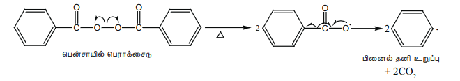
**2. சங்கிலி நீட்சி**
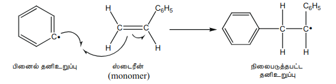
நிலைப்பூத்த தனி உறுப்பானது மற்றொரு ஒற்றைப்படி மூலக்கூறை தாக்கி நீட்டப்பட்ட தனி உறுப்பை உருவாக்குகிறது.
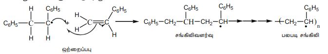
பல்லாயிரக்கணக்கான ஒற்றைப்படி அலகுகள் தொடர்ந்து ஒன்றிணைவதால் சங்கிலி தொடர்ந்து வளர்ந்து கொண்டே செல்கிறது.
**3. சங்கிலி நிறுத்தம்**
ஒற்றைப்படி மூலக்கூறுகள் வழங்கப்படுவதை நிறுத்தியோ அல்லது இரண்டு சங்கிலிகளை இணைத்தோ அல்லது ஆக்ஸிஜன் போன்ற மாசுகளுடன் வினைப்படுத்தியோ மேற்கண்ட சங்கிலி வினையை நிறுத்த முடியும்.
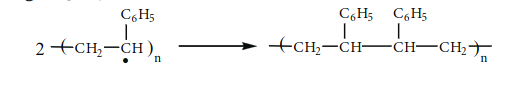

### 15.4.3 சில முக்கியமான பலபடிகளை தயாரித்தல்

**1. பாலித்தீனின் தயாரிப்பு**

இது ஈத்தீனின் சேர்ப்பு பலபடியாகும். இரண்டு வகையான பாலித்தீன்கள் உள்ளன.

i) HDPE (உயர் அடர்த்தி பாலித்தீன்)
ii) LDPE (குறை அடர்த்தி பாலித்தீன்)

**LDPE - குறை அடர்த்தி பாலித்தீன்**

இது, ஈத்தீனை 200 முதல் 300°C வெப்பநிலையில் ஆக்ஸிஜனை வினைவேகமாற்றியாக கொண்டு வெப்பப்படுத்தி பெறப்படுகிறது. இவ்வினையானது தனி உறுப்பு வினைவழிமுறையை பின்பற்றி நிகழ்கிறது. ஆக்ஸிஜனிலிருந்து உருவாகும் பெராக்சைடுகள் தனி உறுப்பு துவக்கிகளாக செயல்படுகின்றன.

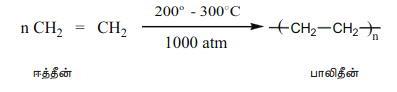

இது மின்கம்பிகளுக்கு காப்புப் பொருளாகவும், பொம்மைகள் செய்யவும் பயன்படுகிறது.

**HDPE - உயர் அடர்த்தி பாலித்தீன்**

373K வெப்பநிலை மற்றும் 6 முதல் 7 atm வரையான அழுத்தத்தில் ஜீக்லர் – நட்டா வினைவேகமாற்றி \([TiCl_4 + (C_2H_5)_3Al]\) முன்னிலையில் எத்திலீனை பலபடியாக்கல் வினைக்கு உட்படுத்தும்போது HDPE பெறப்படுகிறது. இது அதிக அடர்த்தி மற்றும் உருகுநிலையை பெற்றுள்ளது. மேலும் பாட்டில்கள், குழாய்கள் போன்றவற்றின் தயாரிப்பில் பயன்படுகிறது.

**டெஃப்ளான் (PTFE) தயாரித்தல்**

இதன் ஒற்றைப்படி மூலக்கூறு டெட்ராபுளோரோ எத்திலீன் ஆகும். இந்த ஒற்றைப்படி மூலக்கூறை ஆக்ஸிஜன் அல்லது அம்மோனியம் பெர்சல்பேட்டுடன் அதிக அழுத்தத்தில் வெப்பப்படுத்தும்போது டெஃப்ளான் (PTFE) கிடைக்கிறது.

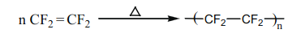

இது பொருட்களின் மீது மேல் பூச்சாக பூசவும், ஒட்டா சமையல் பாத்திரங்கள் செய்யவும் பயன்படுகிறது.

**2. ஆர்லான் தயாரித்தல் (பாலிஅக்ரிலோ நைட்ரைல் – PAN)**

பெராக்சைடு துவக்கி முன்னிலையில் வினைல் சயனைடு (அக்ரிலோ நைட்ரைல்) மூலக்கூறுகள் கூட்டு பலபடியாக்கலுக்கு உட்படும்போது ஆர்லான் கிடைக்கிறது.

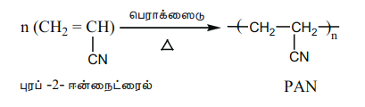
இது, போர்வைகள், ஸ்வெட்டர்கள் தயாரிப்பில் கம்பளிக்கு மாற்றாக பயன்படுகிறது.

**குறுக்க பலபடியாக்கல்**

அருகருகே உள்ள ஒற்றைப்படி மூலக்கூறுகளின் வினைச்செயல் தொகுதிகள் வினைப்பட்டு, \( H_2O \), \( NH_3 \) போன்ற சிறிய மூலக்கூறுகள் வெளியேற்றப்படுவதால் குறுக்க பலபடிகள் கிடைக்கப்பெறுகின்றன. பலபடி சங்கிலி தொடர்ந்து வளர வேண்டுமெனில், ஒவ்வொரு ஒற்றைப்படி மூலக்கூறும் கண்டிப்பாக குறைந்த பட்சம் இரண்டு குறுக்க வினைகளுக்காவது உட்பட வேண்டும். அதாவது ஒற்றைப்படி மூலக்கூறானது குறைந்தபட்சம் இரண்டு வினைச்செயல் தொகுதிகளையாவது பெற்றிருக்க வேண்டும். எடுத்துக்காட்டுகள்: நைலான்–6,6, டெரிலீன் போன்றவை.

**நைலான் – 6,6**

சமஅளவு மோல் எண்ணிக்கையில் அடிபிக் அமிலம் மற்றும் ஹெக்சா மெத்திலீன் டையமீன் கலந்து நைலான் உப்பு பெறப்படுகிறது. இந்த உப்பை வெப்பப்படுத்தும்போது நீர் மூலக்கூறு வெளியேறுவதால் அமைடு பிணைப்புகள் உருவாகி நைலான் – 6,6 கிடைக்கிறது.

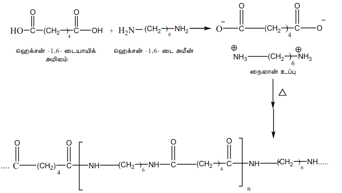

இது, ஜவுளித் துறையிலும், அட்டைகள் தயாரிப்பிலும் பயன்படுகிறது.

**நைலான் – 6**

533K வெப்பநிலையில், மந்த வாயுச் சூழலில் சிறிதளவு நீருடன் காப்ரோலாக்டம் (ஒற்றைப்படி மூலக்கூறு) ஐ வெப்பப்படுத்தும்போது Є - அமினோ காப்ரோயிக் அமிலம் பெறப்படுகிறது, இது பலபடியாக்கல் அடைந்து நைலான் – 6 எனும் பலபடி கிடைக்கிறது.

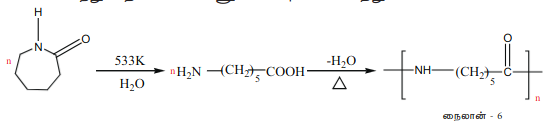
இது, டயர்கள் மற்றும் இழைகள் தயாரிக்க பயன்படுகிறது.

**3. டெரிலீன் தயாரித்தல் (டெக்ரான்)**

இதில் எத்திலீன் கிளைக்கால் மற்றும் டெரிப்தாலிக் அமிலம் (அல்லது டைமெத்தில் டெரிப்தாலேட்) ஆகியன ஒற்றைப்படிகளாக உள்ளன. இந்த ஒற்றைப்படி மூலக்கூறுகளை கலந்து ஜிங்க் அசிட்டேட் மற்றும் ஆன்டிமனி ட்ரையாக்சைடு வினையூக்கி முன்னிலையில் 500K வெப்பநிலைக்கு வெப்பப்படுத்தும்போது டெரிலீன் உருவாகிறது.

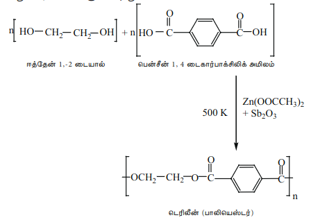

இது, பஞ்சு அல்லது கம்பளி இழைகளுடன் கலத்தலிலும், பாதுகாப்பு தலைக்கவசங்களில் கண்ணாடி வலுவூட்டு பொருளாகவும் பயன்படுகிறது.

**4. பேக்கலைட் தயாரித்தல்**

பீனால் மற்றும் ஃபார்மால்டிஹைடு ஆகியன இதில் ஒற்றைப்படிகளாக உள்ளன. அமிலம் அல்லது கார வினையூக்கி முன்னிலையில் இந்த ஒற்றைப்படி மூலக்கூறுகளை குறுக்க பலபடியாக்கல் வினைக்கு உட்படுத்தி இந்த பலபடி பெறப்படுகிறது. பீனால் மூலக்கூறுகள் ஃபார்மால்டிஹைடுடன் வினைப்பட்டு ஆர்த்தோ மற்றும் பாரா ஹைட்ராக்ஸி மெத்தில் பீனால்களை உருவாக்குகிறது, இவை பீனாலுடன் தொடர்ச்சியாக வினைப்பட்டு நோவோலேக் என்றழைக்கப்படும் நேர்கோட்டுச் சங்கிலிப் பலபடிகளை உருவாக்குகின்றன. நோவோலேக் பலபடியை தொடர்ந்து ஃபார்மால்டிஹைடுடன் வெப்பப்படுத்தும்போது குறுக்க பிணைப்புகளைக் கொண்ட பேக்கலைட் உருவாகிறது.

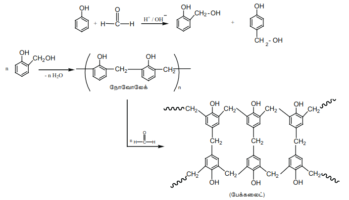

**பயன்கள்:**

நோவோலேக் ஆனது பெயின்டுகளில் பயன்படுகிறது. அட்டை மரப்பலகைகளை ஒட்டுவதற்கு பயன்படும் பசை மற்றும் வார்னிஷ்களில் மேலான பேக்கலைட்டுகள் பயன்படுகின்றன. சுவிட்சுகள், ஃபோனாக்கள் போன்றவற்றை தயாரிக்க கடினமான பேக்கலைட்டுகள் பயன்படுகின்றன.

**5. மெலமைன் (ஃபார்மால்டிஹைடு மெலமைன்)**

மெலமைன் மற்றும் ஃபார்மால்டிஹைடு ஆகியன இதன் ஒற்றைப்படி மூலக்கூறுகளாகும். இந்த ஒற்றைப்படி மூலக்கூறுகள் குறுக்க பலபடியாக்கல் வினைக்கு உட்பட்டு மெலமைன் ஃபார்மால்டிஹைடு பிசினை உருவாக்குகின்றன.

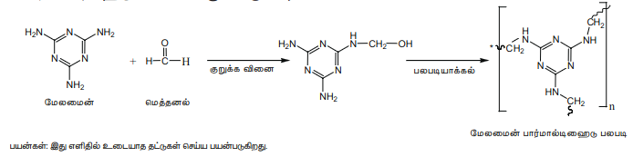

**6. யூரியா ஃபார்மால்டிஹைடு பலபடி**

யூரியா மற்றும் ஃபார்மால்டிஹைடு ஆகிய ஒற்றைப்படி மூலக்கூறுகளை குறுக்க பலபடியாக்கல் வினைக்கு உட்படுத்தும்போது இந்த பலபடி உருவாகிறது.

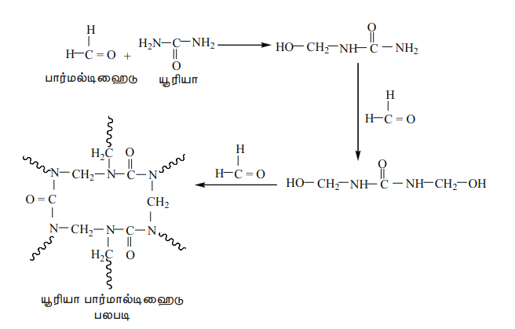

### 15.4.4 பல்லினப் பலபடிகள்

இரண்டு அல்லது அதற்கு மேற்பட்ட வெவ்வேறு வகை ஒற்றைப்படி மூலக்கூறுகளைக் கொண்டுள்ள பலபடியானது, பல்வின பலபடி என்றமைக்கப்படுகிறது. எடுத்துக்காட்டாக, SBR ரப்பர் (Buna-S) எனும் பலபடியானது ஸ்டைரீன் மற்றும் பியூட்டாடையீன் ஆகிய ஒற்றைப்படி மூலக்கூறுகளைக் கொண்டுள்ளது. பல்வின பலபடிகள், ஒற்றைப்படிகளிலிருந்து முற்றிலும் மாறுபட்ட பண்புகளைக் கொண்டுள்ளன.

### 15.4.5 இயற்கை மற்றும் செயற்கை ரப்பர்கள்

ரப்பர் என்பது இயற்கையில் காணப்படும் பலபடி ஆகும். ரப்பர் மரத்தின் (Ficus elastic) பட்டைகளில் உண்டாக்கப்படும் வெட்டுகளிலிருந்து வழியும் ரப்பர் பாலிலிருந்து இவை பெறப்படுகின்றன. இயற்கை ரப்பரில் சிஸ் ஐசோபிரீன் (2-மெத்தில் பியூட்டா-1,3-டையீன்) எனப்படும் ஒற்றைப்படி அலகு காணப்படுகிறது. இயற்கை ரப்பரில் ஆயிரக்கணக்கான ஐசோபிரீன் அலகுகள் ஒரே சங்கிலியாக இணைந்துள்ளன. இயற்கை ரப்பரானது வலிமையானதாகவோ அல்லது நீளும் தன்மை கொண்டதாகவோ இருப்பதில்லை. ரப்பர் உரனூட்டல் (வல்கனைசேஷன்) எனும் செயல்முறையின் மூலம் இயற்கை ரப்பரின் பண்புகளை மாற்றியமைக்க முடியும்.

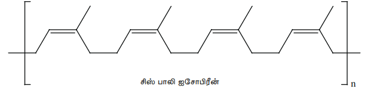

**இரப்பர் உரனுட்டல்: இரப்பரை குறுக்கிணைத்தல்**
1839 ஆம் ஆண்டு, சார்லஸ் குட் இயர் என்பவர் இயற்கை ரப்பர் மற்றும் சல்பர் சேர்ந்த கலவையை சூடான அடுப்பின் மீது தவறவிட்டார். அந்த ரப்பரானது வலிமையானதாகவும், நீளும் தன்மை கொண்டதாகவும் மாறியதைக் கண்டு அவர் ஆச்சரியமடைந்தார். குட் இயர் இந்த செயல்முறையை "ரப்பர் உரனூட்டல்" அல்லது வல்கனைசேஷன் என்றழைத்தார். இயற்கை ரப்பரை, 3-5% சல்பருடன் சேர்த்து 100-150°C வெப்பநிலையில் வெப்பப்படுத்தும்போது சிஸ்-1,4-பாலிஐசோபிரீன் சங்கிலிகள் டைசல்பைடு பிணைப்புகளால் \((-S-S-)\) குறுக்க பிணைக்கப்படுகின்றன. வல்கனைசேஷனுக்கு பயன்படுத்தப்படும் சல்பரின் அளவை கட்டுப்படுத்துவதன் மூலமாக ரப்பரின் இயற் பண்புகளை மாற்றியமைக்க முடியும். 1 முதல் 3% வரை சல்பரைக் கொண்டுள்ள ரப்பரானது மிருதுவானதாகவும், நீளும் தன்மை கொண்டதாகவும் உள்ளது. 3 முதல் 10% வரை சல்பரைப் பயன்படுத்தும்போது ரப்பரானது கடினமானதாக ஆனால், நெகிழும் தன்மை கொண்டதாக மாறுகிறது.

**செயற்கை ரப்பர்**

பியூட்டா-1,3-டையீன் போன்ற கரிம சேர்மங்கள் அல்லது அவற்றின் பெறுதிகளை பலபடியாக்கல் வினைக்கு உட்படுத்தும்போது ரப்பரைப் போன்ற பலபடிகள் கிடைக்கின்றன. இவை அதிக நீளும் தன்மை போன்ற விரும்பத்தக்க பண்புகளை பெற்றுள்ளன. இத்தகைய பலபடிகளானவை செயற்கை ரப்பர்கள் என்றழைக்கப்படுகின்றன.

**நியோப்ரீன் தயாரித்தல்:**

2-குளோரோ பியூட்டா-1,3-டையீன் (குளோரோப்ரீன்) எனும் ஒற்றைப்படி சேர்மத்தை தனி உறுப்பு பலபடியாக்கலுக்கு உட்படுத்தும்போது நியோப்ரீன் கிடைக்கிறது.

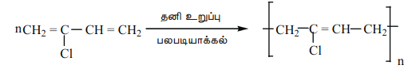
இது ரப்பரை விட மேம்பட்டது, மேலும் இது வேதிப்பொருட்களால் பாதிக்கப்படுவதில்லை.

பயன்கள்: இது வேதிப்பொருள் சேமிப்பு கலன்கள் மற்றும் இடமாற்றுப் பட்டைகள் தயாரிக்க பயன்படுகிறது.

**பியூனா-N தயாரித்தல்:**

இது அக்ரிலோ நைட்ரைல் மற்றும் பியூட்டா-1,3-டையீன் இணைந்த பல்லின பலபடியாகும்.

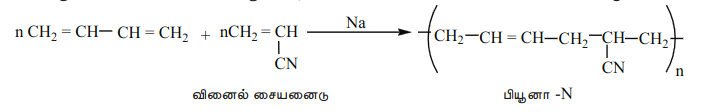
இது நெளிகுழல்கள் தயாரிக்கவும், தண்ணீர்த் தொட்டியின் உள்பூச்சாகவும் பயன்படுகிறது.

**பியூனா -S தயாரித்தல்:**

இது ஒரு பல்லின பலபடியாகும். இது, சோடியம் முன்னிலையில் பியூட்டா-1,3-டையீன் மற்றும் ஸ்டைரீன் ஆகியவற்றை 3:1 என்ற விகிதத்தில் கலந்து பலபடியாக்கலுக்கு உட்படுத்துவதன் மூலம் பெறப்படுகிறது.

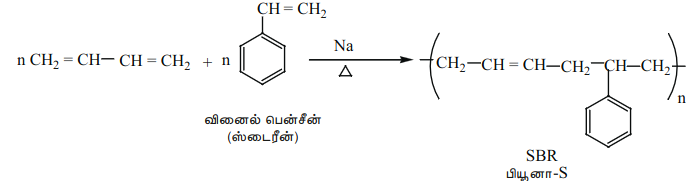
### 15.4.6 மக்கும் பலபடிகள்

சுற்றுச் சூழலில் காணப்படும் நுண்ணுயிரிகளால் எளிதாக சிதைக்கப்படும் பொருட்களானவை மக்கும் பொருட்கள் என்றழைக்கப்படுகின்றன. இயற்கைப் பலபடிகள் குறிப்பிட்ட காலத்திற்கு பிறகு தாமாகவே மக்குகின்றன ஆனால், செயற்கைப் பலபடிகள் மக்குவதில்லை. இது தீவிர சூழல் மாசுபாட்டிற்கு வழிவகுக்கிறது. மண்ணில் காணப்படும் நுண்ணுயிரிகளால் சிதைக்கப்படக்கூடிய மக்கும் பலபடிகளை தயாரிப்பதே இத்தகைய பிரச்சனைக்கான ஒரே தீர்வாக அமையும்.

**எடுத்துக்காட்டுகள்:**

* பாலிஹைட்ராக்ஸி பியூட்டிரேட் (PHB)
* பாலி(3-ஹைட்ராக்ஸி பியூட்டிரேட் -co-3- ஹைட்ராக்ஸி வேலரேட்) (PHBV)
* பாலிகிளைக்காலிக் அமிலம் (PGA)
* பாலிலாக்டிக் அமிலம் (PLA)
* பாலி (Є காப்ரோலாக்டோன்) (PCL)

அறுவைசிகிச்சையில் தையலிடுதல், பிளாஸ்மா மாற்றுப் பொருள் போன்றவற்றில் மக்கும் பலபடிகள் பயன்படுத்தப்படுகின்றன. இந்த பலபடிகள் நொதி செயல்பாட்டின் மூலம் சிதைக்கப்பட்டு வளர்சிதைமாற்றத்திற்கு உட்படுகின்றன அல்லது உடலிலிருந்து வெளியேற்றப்படுகின்றன.

**PHBV தயாரித்தல்:**

இது, 3 – ஹைட்ராக்ஸி பியூட்டனாயிக் அமிலம் மற்றும் 3-ஹைட்ராக்ஸி பென்டனாயிக் அமிலம் போன்ற ஒற்றைப்படிகள் இணைந்த பல்லின பலபடியாகும். PHBV யில், ஒற்றைப்படி மூலக்கூறுகள் எஸ்டர் பிணைப்புகளால் பிணைக்கப்பட்டுள்ளன.

பயன்கள்: இது எலும்பியல் சாதனங்களிலும், கட்டுப்படுத்தப்பட்ட மருந்து விடுவிப்பிலும் பயன்படுகிறது.

**நைலான்– 2-நைலான் -6**

இது பாலிஅமைடு பிணைப்புகளைக் கொண்டுள்ள ஒரு பல்லின பலபடியாகும். கிளைசீன் மற்றும் Є –அமினோ காப்ரோயிக் அமிலம் ஆகிய ஒற்றைப்படிகளை பலபடியாக்கலுக்கு உட்படுத்துவதன் மூலம் இந்த பலபடி பெறப்படுகிறது.

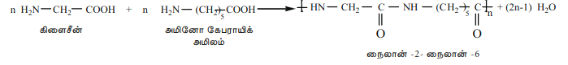