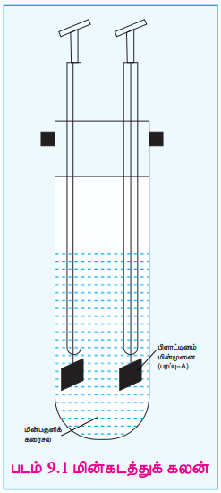
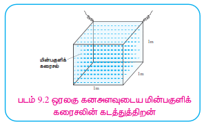
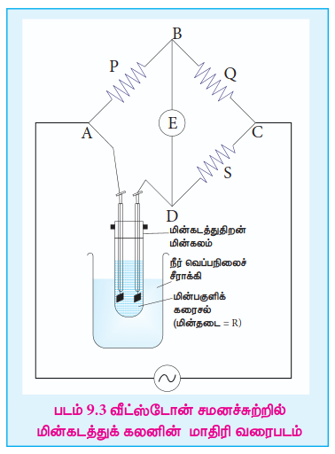

## 9.1 மின்பகுளிக் கரைசலின் கடத்துத்திறன்

சோடியம் குளோரைடு, பொட்டாசியம் குளோரைடு போன்ற மின்பகுளிகளை, நீர் போன்ற கரைப்பான்களில் கரைக்கும் போது அவை அயனியாகமாக பிரிந்து அவற்றின் அயனிக் கூறுகளை (நேரயனிகள் மற்றும் எதிரயனிகள்) உருவாக்குகின்றன என்பதை முன்னரே கற்றிருக்கிறோம். இத்தகைய மின்பகுளிக் கரைசல்களில் மின்னோட்டத்தை செலுத்தும் போது, அவற்றுள்ள அயனிகள் ஒரு மின்முனையிலிருந்து மற்றொரு மின்முனைக்கு மின்னூட்டத்தை தாங்கிச் செல்வதன் மூலம் மின்சாரத்தை கடத்துகின்றன. மின்கடத்துக் கலன் (conductivity cell) (படம் 9.1) பயன்படுத்தி, மின்பகுளிக் கரைசலின் கடத்துத்திறனை அளவிடப்படுகிறது. மின்கடத்துக் கலனானது மின்பகுளிக் கரைசலில் மூழ்க வைக்கப்பட்டுள்ள இரண்டு பிளாட்டின மின்முனைகளை கொண்டுள்ளது. இது மெல்லிய கம்பிகளைப் போல் ஓம் விதிக்கு கீழ்படிகிறது. அதாவது, ஒரு மின்கலத்தின் வழியே பாயும் மின்னோட்டமானது (I), அந்த மின்கலத்தின் மின்னழுத்த வேறுபாட்டிற்கு (V) நேர்விகிதத்திலிருக்கும்.

\( I \propto V \) (or) \( I = \frac{V}{R} \)
\( \Rightarrow V = IR \) ..... (9.1)

இங்கு 'R' என்பது ஓம் (\( \Omega \)) அலகில் கரைசலின் மின்தடை. மின்தடை என்பது மின்னோட்டத்திற்கு எதிராக மின்கலன் அளிக்கும் எதிர்ப்பு ஆகும்.

**நியம மின்தடை (\( \rho \))**

'l' இடைவெளியில் பிரித்து வைக்கப்பட்டுள்ள, (A) குறுக்குவெட்டுப்பரப்பு கொண்ட இரண்டு மின்முனைகளுக்கிடையே மின்பகுளிக்கரைசல் நிரம்பிய மின்கடத்துக் கலனை நாம் கருதுவோம். உலோக கடத்திகளைப் போன்றே, மின்பகுளிக் கரைசலின் மின்தடையானது, நீளத்திற்கு (l) நேர்விகிதத்திலும், குறுக்குப்பரப்பிற்கு (A) எதிர்விகிதத்திலும் அமைகிறது.

\( R \propto \frac{l}{A} \)
\( R = \rho \frac{l}{A} \) ..... (9.2)

இங்கு \( \rho \) (rho) என்பது நியம மின்தடை அல்லது மின்தடை எண் என்றழைக்கப்படுகிறது. இது மின்பகுளியின் தன்மையை பொறுத்து அமைகிறது.

\( \frac{l}{A} = 1 \ m^{-1} \), எனில், \( \rho = R \). நியம மின்தடை என்பது "ஓரலகு குறுக்குப்பரப்பு மற்றும், ஓரலகு நீளத்திற்குள் அடைபட்ட மின்பகுளிக் கரைசலின் மின்தடை" என வரையறுக்கப்படுகிறது. விகிதம் \( \frac{l}{A} \) ஆனது கலமாறிலி என்றழைக்கப்படுகிறது. நியம மின்தடையின் அலகு ஓம்.மீட்டர் (\( \Omega m \)).

**கடத்துத்திறன்**

மின்தடையை விட கடத்துத்திறனை பயன்படுத்துவது மிகவும் வசதியானது. ஒரு மின்பகுளிக் கரைசலின் கடத்துத்திறன் என்பது அதன் மின்தடையின் தலைகீழ் \( \frac{1}{R} \) மதிப்பாகும். கடத்துத்திறனின் SI அலகு சைமென் (S).

\( C = \frac{1}{R} \) ..... (9.3)

(9.2) லிருந்து (R) மதிப்பை (9.3) ல் பிரதியிட

\( \Rightarrow \) i.e., \( C = \frac{1}{\rho} \cdot \frac{A}{l} \) ..... (9.4)

நியம மின்தடையின் தலைகீழி \( \frac{1}{\rho} \) என்பது **நியம கடத்துத்திறன்** (அல்லது) **மின்கடத்து எண்** என்றழைக்கப்படுகிறது. இது கப்பா \( \kappa \) (kappa) எனும் குறியீட்டால் குறிக்கப்படுகிறது.

\( \kappa = \frac{1}{R} \cdot \frac{l}{A} \) ..... (9.5)

\( A = 1m^2 \) மற்றும் \( l = 1m \) எனில் \( \kappa = C \).

நியம கடத்துத்திறன் என்பது ஓரலகு கனஅளவுடைய மின்பகுளிக் கரைசலின் கடத்துத்திறன் என வரையறுக்கப்படுகிறது. (படம் 9.2). நியம கடத்துத்திறனின் SI அலகு \( Sm^{-1} \).

> **k வின் அலகு**
>
> $K = \frac{1}{R} \cdot \frac{l}{A}$
>
> $= \frac{1}{\text{ohm}} \cdot \frac{m}{m^2}$
>
> $= \text{ohm}^{-1} \, \text{m}^{-1} = \text{mho} \, \text{m}^{-1}$ (or $\text{S m}^{-1}$

சமன்பாடு (9.4) ல் பிரதியிட்டு மாற்றி எழுதும்போது,

$\Rightarrow \kappa = C \cdot \left( \frac{l}{A} \right)$ $\dots$ (9.5)

$A = 1 \, \text{m}^2$ மற்றும் $l = 1 \, \text{m}$ எனில் $\kappa = C$ .

நியம கடத்துத்திறன் என்பது ஒரே கனஅளவுடைய மின்பகுளிக் கரைசலின் கடத்துத்திறன் என வரையறுக்கப்படுகிறது. (படம் 9.2). நியம கடத்துத்திறனின் SI அலகு $\text{S m}^{-1}$ .

## எடுத்துக்காட்டு

ஒரு மின்கடத்துக் கலனிலுள்ள இரண்டு பிளாட்டின மின்முனைகளுக்கு இடைப்பட்ட தூரம் 1.5 செ.மீ. ஒவ்வொரு மின்முனையும் குறுக்குப் பரப்பும் 4.5 ச.செ.மீ என்க. 0.5 N மின்பகுளிக் கரைசலுக்கு மின்கடத்தை பயன்படுத்தி கண்டறியப்பட்ட மின்தடை மதிப்பு 15 $\Omega$ எனில், கரைசலின் நியம கடத்துத்திறன் மதிப்பை காண்க.

## தீர்வு

$$
\kappa=\frac{1}{R}\left(\frac{l}{A}\right)
\qquad\qquad\qquad
l=1.5\ \mathrm{cm}=1.5\times10^{-2}\ \mathrm{m}
$$

$$
\kappa=\frac{1}{15\,\Omega}\times\frac{1.5\times10^{-2}\ \mathrm{m}}{4.5\times10^{-4}\ \mathrm{m^2}}
\qquad\qquad
A=4.5\ \mathrm{cm^2}=4.5\times(10^{-4})\ \mathrm{m^2}
$$

$$
=2.22\ \mathrm{S\,m^{-1}}
\qquad\qquad\qquad\qquad\qquad\qquad
R=15\Omega
$$

### 9.1.1 மோலார் கடத்துத்திறன் (\( \Lambda_m \))

வெவ்வேறு செறிவுடைய கரைசல்கள், குறிப்பிட்ட கனஅளவில் வெவ்வேறு எண்ணிக்கையிலான மின்பகுளி அயனிகளைக் கொண்டுள்ளதால் அவற்றின் நியம கடத்துத்திறன் மதிப்புகளும் வெவ்வேறாக உள்ளன. எனவே, மோலார் கடத்துத்திறன் (\( \Lambda_m \)) என்றழைக்கப்படும் புதிய எண்ணளவு அறிமுகப்படுத்தப்பட்டது.

V \( m^3 \) கன அளவில் 1 மோல் மின்பகுளி கரைந்துள்ள கரைசலைக் கொண்டுள்ள மின்கடத்துக் கலனை கற்பனை செய்வோம். அத்தகைய அமைப்பின் கடத்துத்திறன் மோலார் கடத்துத்திறன் (\( \Lambda_m \)) என்றழைக்கப்படுகிறது.

1 \( m^3 \) கனஅளவுள்ள மின்பகுளிக் கரைசலின் கடத்துத்திறனானது நியம கடத்துத்திறன் (\( \kappa \)) என்றழைக்கப்படுகிறது என்பதை முன்னர்தான் நாம் கற்றோம். எனவே, மேலே குறிப்பிட்ட V \( m^3 \) கனஅளவுள்ள மின்பகுளிக் கரைசலின் கடத்துத்திறனை (\( \Lambda_m \)) பின்வரும் சமன்பாடு குறிப்பிடுகிறது.

\( (\Lambda_m) = \kappa \times V \) ..... (9.6)

நாமறிந்தபடி மோலாரிட்டி \( (M) = \frac{\text{கரைபொருளின் மோல் எண்ணிக்கை} (n)}{\text{கரைசலின் கனஅளவு} (V \ dm^3 \text{ அலகில்})} \)

எனவே, 1 மோல் கரைபொருளைக் கொண்டுள்ள கரைசலின் கனஅளவு \( = \frac{1}{M} \ (mol^{-1} L) \)

\( \therefore \) கனஅளவு \( m^3 \) அலகில் \( = \frac{1}{M} \times 10^{-3} \ mol^{-1} m^3 \)

(9.7) ஐ (9.6) இல் பிரதியிட

\( (9.6) \Rightarrow \Lambda_m = \frac{\kappa (Sm^{-1}) \times 10^{-3}}{M} \ mol^{-1} m^3 \) ..... (9.8)

மேற்கண்ட சமன்பாடானது, நியம கடத்துத்திறன், மின்பகுளிக்கரைசலின் செறிவு ஆகியவற்றிலிருந்து மோலார் கடத்துத்திறன் மதிப்பை தருகிறது.

**எடுத்துக்காட்டு**

25°C வெப்பநிலையில் 0.025M செறிவுடைய நீர்த்த கால்சியம் குளோரைடு கரைசலின் மோலார் கடத்துத்திறனை கணக்கிடுக. கால்சியம் குளோரைடு கரைசலின் நியம கடத்துத்திறன் மதிப்பு \( 12.04 \times 10^{-2} Sm^{-1} \).

**தீர்வு**

மோலார் கடத்துத்திறன் = $\Lambda_m = \frac{\kappa (S m^{-1}) \times 10^{-3}}{M}$ mol$^{-1}$ m$^3$

$= \frac{(12.04 \times 10^{-2} \, S m^{-1}) \times 10^{-3} \, (mol^{-1} m^3)}{0.025}$

$= 481.6 \times 10^{-5} \, S m^2 mol^{-1}$

> **தன் மதிப்பீர் : 1**
>
> 25°C வெப்பநிலையில் 0.01M செறிவுடைய நீர்த்த KCl கரைசலின் மோலார் கடத்துத்திறனை கணக்கிடுக. 25°C வெப்பநிலையில் KCl கரைசலின் நியம கடத்துத்திறன் மதிப்பு \( 14.114 \times 10^{-2} Sm^{-1} \).

### 9.1.2 சமான கடத்துத்திறன் (\( \Lambda \))

சமான கடத்துத்திறன் என்பது "ஒரு மீட்டர் இடைவெளியில் அமைந்துள்ள இரண்டு மின்முனைகளுக்கிடையே நிரம்பியுள்ள, ஒரு கிராம் சமான எடை மின்பகுளியை கொண்டுள்ள 'V' \( m^3 \) கன அளவுடைய கரைசலின் கடத்துத்திறன்" என வரையறுக்கப்படுகிறது.

சமான கடத்துத்திறனுக்கும், நியம கடத்துத்திறனுக்கும் இடையே உள்ள தொடர்பு கீழே கொடுக்கப்பட்டுள்ளது.

\( \Lambda = \frac{\kappa (Sm^{-1}) \times 10^{-3} \ (gram \ equivalent^{-1}) m^3}{N} \) ..... (9.9)

இங்கு \( \kappa \) என்பது நியம கடத்துத்திறன் மற்றும் N என்பது நார்மாலிட்டியில் குறிப்பிடப்படும் மின்பகுளிக் கரைசலின் செறிவு.

> **தன் மதிப்பீடு : 2**
>
> 0.15 M செறிவுடைய மின்பகுளி கரைசலின் மின்தடை 50 Ω. அக்கரைசலின் நியம கடத்துத்திறன் 2.4 S m⁻¹. அதே மின்கடத்துக் கலனைக் கொண்டு அளவிடப்பட்ட, 0.5 N செறிவுடைய அதே மின்பகுளிக் கரைசலின் மின்தடை 480 Ω ஆகும். 0.5 N செறிவுடைய மின்பகுளி கரைசலின் சமான கடத்துத்திறனை கணக்கிடுக.
>
> **கொடுக்கப்பட்டது**
>
> $ R_1=50\ \Omega \qquad\qquad R_2=480\ \Omega $
>
> $ \kappa_1=2.4\ \mathrm{Sm^{-1}} \qquad \kappa_2=? $
>
> $ N_1=0.15\ \mathrm{N} \qquad\qquad N_2=0.5\ \mathrm{N} $
>
> $\Lambda = \frac{\kappa_2 \, (\text{S m}^{-1}) \times 10^{-3} \, (\text{கிராம் சமானம்})^{-1} \, \text{m}^3}{N}$
>
> $= \frac{0.25 \times 10^{-3} \, \text{S} \, (\text{கிராம் சமானம்})^{-1} \, \text{m}^2}{0.5}$
>
> $\Lambda = 5 \times 10^{-4} \, \text{S m}^2 \, (\text{கிராம் சமானம்})^{-1}$
>
> $$ \kappa=\frac{\text{கலமாறிலி}}{R} $$
>
> $$ \text{என அறிகிறோம்} $$
>
> $$ \therefore\ \frac{\kappa_2}{\kappa_1}=\frac{R_1}{R_2} $$
>
> $$ \kappa_2=\kappa_1\times\frac{R_1}{R_2} $$
>
> $$ =2.4\ \mathrm{Sm^{-1}}\times\frac{50\ \Omega}{480\ \Omega} $$
>
> $$ =0.25\ \mathrm{Sm^{-1}} $$

### 9.1.3 மின்பகுளிக் கடத்துத்திறனை பாதிக்கும் காரணிகள்

- கரைபொருளின் எதிரெதிர் மின்சுமை பெற்றுள்ள அயனிகளுக்கிடையே இடையீர் அதிகரிக்கும்போது, கடத்துத்திறன் மதிப்பு குறையும்.
- அதிக மின்காப்பு மாறிலியை (dielectric constant) கொண்ட கரைப்பானில் கரைசல் அதிக கடத்துத்திறனைக் கொண்டுள்ளது.
- கடத்துத்திறன் மதிப்பு, ஊடகத்தின் பாகுநிலைத் தன்மைக்கு எதிர்விகிதத்தில் இருக்கும். அதாவது, பாகுநிலைத்தன்மை குறையும்போது கடத்துத்திறன் அதிகரிக்கிறது.
- வெப்பநிலை அதிகரிக்கும்போது மின்பகுளிக் கரைசலின், கடத்துத்திறனும் அதிகரிக்கிறது. வெப்பநிலை அதிகரிக்கும்போது அயனிகளின் இயக்க ஆற்றல் அதிகரிப்பதால், எதிரெதிர் மின்சுமை கொண்ட அயனிகளுக்கிடைப்பட்ட கவர்ச்சி விசைகள் குறைகிறது. இதனால், கடத்துத்திறன் அதிகரிக்கிறது.
- ஒரு கரைசலின் மோலார் கடத்துத்திறன் மதிப்பு நீர்த்தலின் போது அதிகரிக்கிறது. ஏனெனில், ஒரு வலிமைமிகு மின்பகுளியை நீர்க்கும்போது அயனிகளுக்கிடைப்பட்ட கவர்ச்சி விசைகள் குறைகின்றன. ஒரு வலிமை குறைந்த மின்பகுளிக்கு, நீர்த்தல் அதிகரிக்கும்போது பிரிகை வீதம் அதிகரிக்கிறது.

### 9.1.4 அயனிக் கரைசல்களின் கடத்துத்திறனை அளவிடல்

நீங்கள் இயற்பியல் செய்முறை பாடத்தில், மீட்டர் சமனச்சுற்றை பயன்படுத்தி ஒரு உலோக கம்பியின் நியம மின்தடையை அளவிடுதலைப் பற்றி கற்றிருப்பீர்கள். வீட்ஸ்டோன் சமனச்சுற்று கொள்கையின் அடிப்படையில்தான் இது இயங்குகிறது என்பதை நாம் அறிவோம். இதேபோல, வீட்ஸ்டோன் சமனச்சுற்று அமைப்பை கொண்டு ஒரு மின்பகுளிக் கரைசலின் கடத்துத்திறன் அளவிடப்படுகிறது. இதில் ஒரு மின்தடைக்கு பதிலாக கடத்துத்திறன் அறியவேண்டிய மின்பகுளிக் கரைசல் நிரம்பிய மின்கடத்து கலன் இணைக்கப்படுகிறது.

ஒரு உலோக கம்பியின் நியம மின்தடையை அளவிடும்போது DC மின்சாரம் பயன்படுத்தப்படுகிறது. இங்கு, மின்கடத்துக் கலன்வழியே DC மின்சாரத்தை செலுத்தும்போது, கலனில் எடுத்துக்கொள்ளப்பட்ட கரைசல் மின்னாற்பகுத்தலுக்கு உள்ளாகிறது. எனவே, மின்னாற்பகுத்தலை தடுக்கும் பொருட்டு AC மின்சாரம் பயன்படுத்தப்படுகிறது.

படம் 9.3 ல் காட்டியவாறு மின்தடை தெரிந்த மின்தடைகள் P, Q, நிலையற்ற மின்தடை S மற்றும் மின்கடத்து மின்கலன் ஆகியவற்றைக் கொண்டு வீட்ஸ்டோன் சமனச்சுற்று அமைக்கப்படுகிறது. (இதில் எடுத்துக்கொள்ளப்பட்ட மின்பகுளிக் கரைசலின் மின்தடை R எனக் கொள்க). A மற்றும் C ஆகிய சந்திப்புகளுக்கிடையே ஒரு AC மின்மூலம் (550 Hz முதல் 5 KHz வரை) இணைக்கப்படுகிறது. 'B' மற்றும் 'D' ஆகிய சந்திப்புகளுக்கிடையே ஒரு தகுத்த உணர்கருவி E (தொலைபேசி செவி உணர் கருவி) இணைக்கப்பட்டுள்ளது.

சமனச்சுற்றானது சமநிலையை அடையும்வரை நிலையற்ற மின்தடை 'S' ஆனது சரிசெய்யப்படுகிறது. இந்த நிலையில் உணர்கருவி வழியே மின்னோட்டம் பாய்வதில்லை.

சமநிலையில்,

\( \frac{P}{Q} = \frac{R}{S} \)
\( \therefore R = \frac{P}{Q} \times S \) ..... (9.10)

தெரிந்த மின்தடைகள் P, Q மற்றும் சமநிலையில் மேற்காண் சமன்பாடு (9.10) ஐக் கொண்டு அளவிடப்பட்ட S மதிப்பு ஆகியவற்றிலிருந்து மின்பகுளிக் கரைசலின் மின்தடை (R) கணக்கிடப்படுகிறது.

**கடத்துத்திறன் கணக்கிடல்:**

பின்வரும் சமன்பாட்டை பயன்படுத்தி மின்தடை மதிப்பிலிருந்து, ஒரு மின்பகுளிக் கரைசலின் நியம கடத்துத்திறன் (அல்லது) மின்கடத்து எண் மதிப்பை கணக்கிட முடியும்.

\( \kappa = \frac{1}{R} \left( \frac{l}{A} \right) \) [9.5]

வழக்கமாக மின்கல மாறிலி \( \frac{l}{A} \) மதிப்பானது மின்கல தயாரிப்பாளர்களால் குறிக்கப்படுகிறது. அல்லது, செறிவு மற்றும் நியம கடத்துத்திறன் மதிப்புகள் தெரிந்த KCl கரைசலை பயன்படுத்தியும் கலமாறிலியின் மதிப்பை கணக்கிடலாம்.

**எடுத்துக்காட்டு**

0.1M KCl கரைசலை பயன்படுத்தி கண்டறியப்பட்ட மின்கடத்து கலனின் மின்தடை 190 \( \Omega \) (0.1M KCl கரைசலின் நியம கடத்துத்திறன் மதிப்பு 1.3 \( Sm^{-1} \)). அதே கலனில் 0.003M செறிவுள்ள சோடியம் குளோரைடு கரைசலை நிரப்பும்போது அளவிடப்பட்ட மின்தடை மதிப்பு 6.3 \( K\Omega \). இவை இரண்டும் ஒரு குறிப்பிட்ட வெப்பநிலையில் கண்டறியப்பட்ட அளவீடுகளாகும். NaCl கரைசலின் நியம மற்றும் மோலார் கடத்துத்திறன் மதிப்புகளை கணக்கிடுக.

**கொடுக்கப்பட்டது**

$\kappa = 1.3 \, \text{S m}^{-1}$ (0.1 M KCl கரைசல்)

$R = 190 \, \Omega$

$\left( \frac{l}{A} \right) = \kappa \cdot R = (1.3 \, \text{S m}^{-1}) \, (190 \, \Omega)$

$= 247 \, \text{m}^{-1}$

$\kappa_{\text{(NaCl)}} = \frac{1}{R_{\text{(NaCl)}}} \left( \frac{l}{A} \right)$

$= \frac{1}{6.3 \, \text{K}\Omega} \, (247 \, \text{m}^{-1}) \qquad\qquad\qquad\qquad\qquad\qquad 6.3 \, \text{K}\Omega = 6.3 \times 10^3 \, \Omega$ 

$= 39.2 \times 10^{-3} \, \text{S m}^{-1}$

$\Lambda_m = \frac{\kappa \times 10^{-3} \, \text{mol}^{-1} \, \text{m}^3}{M}$

$= \frac{39.2 \times 10^{-3} \, (\text{S m}^{-1}) \times 10^{-3} \, (\text{mol}^{-1} \, \text{m}^3)}{0.003}$

$\Lambda_m = 13.04 \times 10^{-3} \, \text{S m}^2 \, \text{mol}^{-1}$