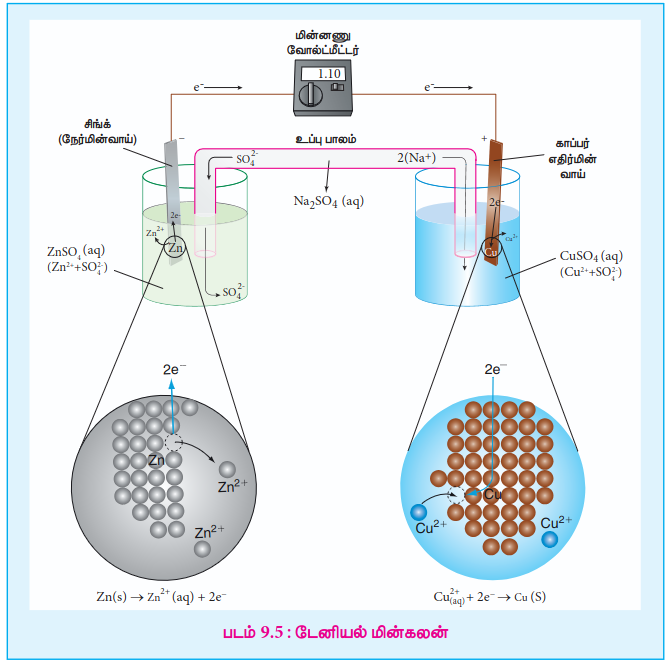
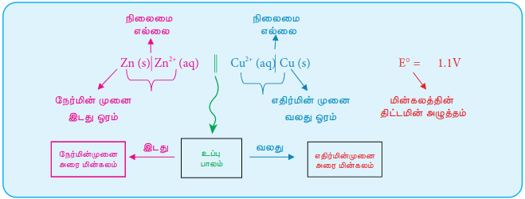
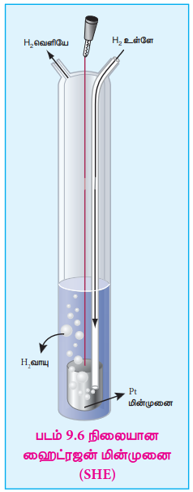
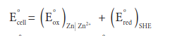
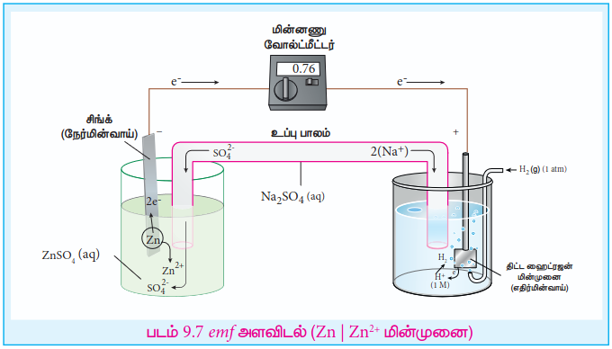

## 9.3 மின்வேதிக் கலன்

மின்வேதிக் கலன் என்பது வேதி ஆற்றலை மின்னாற்றலாகவும், மின்னாற்றலை வேதி ஆற்றலாகவும் மாற்றும் ஒரு அமைப்பாகும். இதில் இரண்டு வெவ்வேறு மின்பகுளி கரைசல்களுடன் தொடர்பிலுள்ள இரண்டு தனித்தனி மின்முனைகள் உள்ளன. மின்வேதிக் கலன்கள் பொதுவாக பின்வரும் இரண்டு வகைகளாக பிரிக்கப்படுகின்றன.

1. **கால்வானிக் மின்கலன் (வோல்டா மின்கலன்):** இந்த மின்கலத்தில் தன்னிச்சையான வேதி வினையினால் மின்னோட்டம் உருவாகிறது. அதாவது, இந்த மின்கலம் வேதி ஆற்றலை மின்னாற்றலாக மாற்றுகிறது. பொதுவாக இவை சேமிப்பு மின்கலன்கள் என அறியப்படுகின்றன.

2. **மின்னாற்பகுப்புக் கலன்:** இந்த மின்கலத்தில் வெளி மின்மூலத்திலிருந்து பெறப்படும் மின்னோட்டத்தைக் கொண்டு தன்னிச்சையற்ற வினை நிகழ்த்தப்படுகிறது. அதாவது, இந்த மின்கலன் மின்னாற்றலை, வேதி ஆற்றலாக மாற்றுகிறது.

### 9.3.1 கால்வானிக் மின்கலன்

ஜிங்க் உலோக பட்டையை, காப்பர் சல்பேட் கரைசலில் வைக்கும்போது, கரைசலின் நீல நிறம் வெளுத்து, ஜிங்க் பட்டை மீது சிவப்பு-பழுப்பு நிறத்தில் காப்பர் படிகிறது, என்பதை நாம், XI வகுப்பிலேயே கற்றறிந்தோம். இதற்கு காரணம் பின்வரும் தன்னிச்சை வினையாகும்.

\( Zn_{(s)} + CuSO_{4(aq)} \rightarrow ZnSO_{4(aq)} + Cu_{(s)} \)

மேற்கண்ட வினையில் உருவாக்கப்படும் ஆற்றலானது, வெப்ப ஆற்றலாக சூழலுக்கு இழக்கப்படுகிறது.

மேற்காண் ஆக்ஸிஜனேற்ற ஒடுக்க வினையில், ஜிங்க் ஆக்ஸிஜனேற்றமடைந்து Zn\(^{2+}\) அயனிகளும், Cu\(^{2+}\) அயனிகள் ஒடுக்கமடைந்து உலோக காப்பரும் உருவாகின்றன. இந்த அரை வினைகள் கீழே குறிப்பிடப்பட்டுள்ளன.

\( Zn_{(s)} \rightarrow Zn^{2+}_{(aq)} + 2e^- \) (ஆக்ஸிஜனேற்றம்)

\( Cu^{2+}_{(aq)} + 2e^- \rightarrow Cu_{(s)} \) (ஒடுக்கம்)

மேற்கூறிய இரண்டு அரை வினைகளை படம் 9.5 ல் காட்டியுள்ளவாறான அமைப்பில் தனித்தனியாக நிகழ்த்தும்போது, உருவாக்கப்படும் ஆற்றலின் ஒரு பகுதியானது மின்னாற்றலாக மாற்றப்படக் கூடும். டேனியல் மின்கலத்தை எடுத்துக்காட்டாக கொண்டு கால்வானிக் மின்கலத்தின் செயல்பாட்டை புரிந்து கொள்வோம். இந்த மின்கலமானது மேற்கூறிய வினையை பயன்படுத்தி மின்னாற்றலை உருவாக்குகிறது.

இந்த அரை வினைகளை தனித்தனியாக நடத்துதலே டேனியல் மின்கல கட்டமைப்பின் அடிப்படை ஆகும். இது இரண்டு அரை மின்கலங்களை கொண்டுள்ளது.

**ஆக்ஸிஜனேற்ற அரை மின்கலன்**

படம் 9.5 ல் காட்டியுள்ளவாறு முகவையிலுள்ள நீர்த்த ஜிங்க் சல்பேட் கரைசலில் ஜிங்க் உலோகப் பட்டை மூழ்க வைக்கப்பட்டுள்ளது.

**ஒடுக்க அரை மின்கலன்**

படம் 9.5 ல் காட்டியுள்ளவாறு முகவையிலுள்ள நீர்த்த காப்பர் சல்பேட் கரைசலில் காப்பர் உலோகப் பட்டை மூழ்க வைக்கப்பட்டுள்ளது.

**அரை மின்கலங்களை இணைத்தல்**

ஜிங்க் மற்றும் காப்பர் பட்டைகள் வெளிப்புறமாக ஒரு கம்பி மூலம் இணைக்கப்படுகின்றன. இதனூடே ஒரு இணைப்பியும் (k) ஒரு மின்மூலமும் இணைக்கப்பட்டுள்ளன. (எடுத்துக்காட்டு: வோல்ட் மீட்டர்). எதிர்மின்முனைப் பகுதி மற்றும் நேர்மின்முனைப் பகுதிகளிலுள்ள மின்பகுளிக் கரைசல்கள், தலைகீழாக கவிழ்த்து வைக்கப்பட்டுள்ள U வடிவ குழாய் மூலம் இணைக்கப்பட்டுள்ளன. இந்த U வடிவ குழாயில், அகார்-அகார் ஜெல்லுடன் KCl, Na\(_2\)SO\(_4\) போன்ற வினையுறா மின்பகுளிகள் கலந்த பசை வைக்கப்பட்டுள்ளது. இந்த வினையுறா மின்பகுளிகளின் அயனிகள் அரை மின்கலன்களிலுள்ள மற்ற அயனிகளுடன் வினைபுரிவதில்லை, மேலும் அவை மின்முனைகளில் ஆக்ஸிஜனேற்றமோ அல்லது ஒடுக்கமோ அடைவதில்லை. உப்புப்பாலத்தில் உள்ள கரைசல் வழிவதில்லை ஆனால், இந்த உப்புப்பாலத்தின் வழியே அயனிகள் அரை மின்கலத்திலிருந்து உள்ளேயோ அல்லது வெளியேயோ செல்ல முடியும்.

இணைப்பி (k) மூலம் மின்சுற்றை மூடும்போது, எலக்ட்ரான்கள் ஜிங்க் பட்டையிலிருந்து காப்பர் பட்டைக்கு பாய்கின்றன. இதற்கு காரணம் அந்தந்த மின்முனைகளில் நிகழும் ஆக்ஸிஜனேற்ற ஒடுக்க வினைகளே ஆகும்.

**நேர்மின்வாய் (ஆக்ஸிஜனேற்றம்)**

எந்த மின்முனையில் ஆக்ஸிஜனேற்றம் நிகழ்கிறதோ அது, நேர்மின்முனை என்றழைக்கப்படுகிறது. டேனியல் மின்கலத்தின், ஜிங்க் மின்முனையில் ஆக்ஸிஜனேற்றம் நிகழ்கிறது. அதாவது, ஜிங்க் ஆனது Zn\(^{2+}\) அயனிகளாகவும், எலக்ட்ரான்களாகவும் ஆக்ஸிஜனேற்றமடைகின்றன. இந்த Zn\(^{2+}\) அயனிகள் கரைசலுக்குள் நுழைகின்றன. மேலும், எலக்ட்ரான்கள் கம்பியின் வழியே வெளிச்சுற்றிற்கு பாய்கின்றன, பின்னர் அவை காப்பர் பட்டைக்குள் நுழைகின்றன. ஜிங்க் மின்முனையில் எலக்ட்ரான்கள் விடுவிக்கப்படுவதால், எதிர்க்குறியை (-ve) பெறுகிறது.

\( Zn_{(s)} \rightarrow Zn^{2+}_{(aq)} + 2e^- \) (எலக்ட்ரான் இழப்பு - ஆக்ஸிஜனேற்றம்)

**எதிர்மின்வாய் (ஒடுக்கம்)**

முன்னரே விவாதித்தபடி, எலக்ட்ரான்கள் மின்சுற்று வழியே ஜிங்க் பட்டையிலிருந்து காப்பர் பட்டைக்கு பாய்கின்றன. இங்கு கரைசலிலுள்ள Cu\(^{2+}\) அயனிகள் எலக்ட்ரான்களை ஏற்றுக்கொண்டு காப்பர் உலோகமாக ஒடுக்கமடைகின்றன, மேலும் இவை காப்பர் மின்முனையின்மீதே படிகின்றன. காப்பர் மின்முனை எலக்ட்ரான்களை உட்கொள்ளப்படுவதால் நேர்க்குறியை (+ve) பெறுகிறது.

\( Cu^{2+}_{(aq)} + 2e^- \rightarrow Cu_{(s)} \) (எலக்ட்ரான் ஏற்பு - ஒடுக்கம்)

**உப்புப் பாலம்**

இரண்டு அரை மின்கலன்களிலுள்ள மின்பகுளிக் கரைசல்கள் உப்புப் பாலத்தை பயன்படுத்தி இணைக்கப்படுகின்றன. ஜிங்க் மின்முனையின் நேர்மின்முனை ஆக்ஸிஜனேற்றத்தால் கரைசலில் Zn\(^{2+}\) அயனிச் செறிவு அதிகரிக்கிறது என்பதை நாம் கற்றறிந்தோம். அதாவது, SO\(_4^{2-}\) அயனிகளுடன் ஒப்பிடும்போது அதிகளவில் Zn\(^{2+}\) அயனிகளை கொண்டிருப்பதால் நேர்மின்முனைப்பகுதியானது அதிக நேர்மின்சுமையை பெறுகிறது. இதேபோல, எதிர்மின்முனைப் பகுதியில் Cu\(^{2+}\) அயனிகள் காப்பராக ஒடுக்கப்படுவதால், அதிக எதிர்மின்சுமையை பெறுகிறது. அதாவது Cu\(^{2+}\) அயனிகளுடன் ஒப்பிடும்போது SO\(_4^{2-}\) அயனிகள் அதிகமாக உள்ளன.

இரண்டு பகுதிகளிலும் மின்நடுநிலைத்தன்மையை பராமரிக்கும் பொருட்டு, வினையுறா எதிரயனிகள் Cl\(^-\) (உப்புப் பாலத்தில் வைக்கப்பட்டுள்ள KCl லிருந்து) உப்புப் பாலத்திலிருந்து நேர்மின்முனைப்பகுதிக்குள் நுழைகின்றன. அதே நேரத்தில் K\(^+\) அயனிகள் உப்புப்பாலத்திலிருந்து எதிர்மின்முனைப்பகுதிக்குள் நகருகின்றன.

**மின்சுற்று முழுமையடைதல்**

எதிர்மின்சுமை கொண்ட ஜிங்க் மின்முனையிலிருந்து, நேர்மின்சுமை கொண்ட காப்பர் மின்முனையை நோக்கி வெளிச்சுற்றின் வழியே எலக்ட்ரான்கள் பாய்கின்றன. அதே நேரத்தில், எதிரயனிகள் நேர்மின்முனைப் பகுதியை நோக்கியும், நேரயனிகள் எதிர்மின்முனைப் பகுதியை நோக்கியும் நகருகின்றன. இதனால் மின்சுற்று முழுமையடைகிறது.

**மின்முனைகள் அழிதல்**

டேனியல் மின்கலமானது செயல்பட, ஜிங்க் மின்முனையில் நிறை தொடர்ந்து குறைகிறது, ஆனால் காப்பர் மின்முனையின் நிறை தொடர்ந்து அதிகரிக்கிறது. எனவே ஜிங்க் மின்முனையானது முற்றிலுமாக Zn\(^{2+}\) அயனிகளாக மாறும் வரையிலோ அல்லது மொத்த Cu\(^{2+}\) அயனிகளும் உலோக காப்பராக மாறும் வரையிலோ மின்கலன் வேலை செய்யும்.

டேனியல் மின்கலம் போலல்லாமல், சில நேர்வுகளில், வினைபடு பொருட்கள் அல்லது வினைவிளை பொருட்கள் மின்முனைகளாக செயல்படுவதில்லை, அத்தகைய நேர்வுகளில் கிராஃபைட் அல்லது பிளாட்டினம் போன்ற வினையுறா மின்முனைகளை பயன்படுத்தப்படுகின்றன, இவை மின்னோட்டத்தை வெளிச்சுற்றுக்கு கடத்துகின்றன.

### 9.3.2 கால்வானிக் மின்கலம் குறியீடு

கால்வானிக் மின்கலமானது மின்கல குறியீட்டின் மூலம் குறிப்பிடப்படுகிறது. எடுத்துக்காட்டாக டேனியல் மின்கலமானது பின்வருமாறு குறிப்பிடப்படுகிறது.

\( Zn (s) | Zn^{2+} (aq) || Cu^{2+} (aq) | Cu (s) \)

மேற்காண் குறியீட்டில், ஒற்றை செங்குத்துக் கோடானது (|) நிலைமை எல்லையையும், இரட்டை செங்குத்து கோடானது (||) உப்புப் பாலத்தையும் குறிப்பிடுகிறது.

- நேர்மின்முனை அரை மின்கலமானது உப்புப்பாலத்திற்கு இடது புறத்திலும், எதிர்மின்முனை அரை மின்கலமானது உப்புப்பாலத்திற்கு வலது புறத்திலும் எழுதப்படுகின்றன.
- நேர்மின்முனை மற்றும் எதிர்மின்முனைகள் முறையே இடது ஓரத்திலும், வலது ஓரத்திலும் எழுதப்படுகின்றன.
- மின்கலத்தின் emf மதிப்பானது மின்கல குறியீட்டின் வலது புறத்தில் எழுதப்படுகிறது.

**எடுத்துக்காட்டு**

கால்வானிக் மின்கலத்தில் நிகழும் நிகர வினையானது கீழே கொடுக்கப்பட்டுள்ளது.

\( 2 Cr (s) + 3 Cu^{2+} (aq) \rightarrow 2 Cr^{3+} (aq) + 3 Cu (s) \)

மின்கல குறியீட்டை பயன்படுத்தி மின்கலத்தை விளக்குக, மேலும் அரை வினைகளை எழுதுக.

**தீர்வு**

நேர்மின்வாய் ஆக்ஸிஜனேற்றம்: \( 2Cr (s) \rightarrow 2Cr^{3+} (aq) + 6e^- \) ..... (1)

எதிர்மின்வாய் ஒடுக்கம்: \( 3Cu^{2+} (aq) + 6e^- \rightarrow 3 Cu (s) \) ..... (2)

மின்கலக் குறியீடு:

\( Cr (s) | Cr^{3+} (aq) || Cu^{2+} (aq) | Cu(s) \)

### 9.3.3 மின்கலத்தின் emf மதிப்பு

டேனியல் மின்கலத்தின் இரண்டு அரை மின்கலங்களை ஒன்றாக இணைக்கும்போது தன்னிச்சையான ஆக்ஸிஜனேற்ற ஒடுக்க வினை நிகழ்கிறது. இதனால் நேர்மின்முனையிலிருந்து எதிர்மின்முனைக்கு எலக்ட்ரான்கள் பாய்கின்றன. நேர்மின்முனையிலிருந்து எலக்ட்ரான்களை வெளித்தள்ளவும், எலக்ட்ரான்களை எதிர்மின்முனை நோக்கி இழுக்கவும் காரணமான விசையானது **மின்னியக்குவிசை (emf)** அல்லது **மின்கல மின்னழுத்தம்** என்றழைக்கப்படுகிறது. மின்கல மின்னழுத்தத்தின் SI அலகு வோல்ட் (V).

நேர் மற்றும் எதிர்மின்முனைக்கிடையே ஒரு வோல்ட் மின்னழுத்த வேறுபாடு இருக்கும்போது, அவற்றிற்கிடையே ஒவ்வொரு கூலும் மின்னூட்டம் நகரும்போதும் ஒரு ஜூல் ஆற்றல் வெளிப்படுகிறது.

i.e., \( 1J = 1C \times 1V \) ..... (9.18)

கல மின்னழுத்தமானது மின்முனைகளின் தன்மை, மின்பகுளிகளின் செறிவு மற்றும் மின்கலம் செயல்படும் வெப்பநிலை ஆகியவற்றை பொருத்தது.

எடுத்துக்காட்டாக 25°C வெப்பநிலையில், கீழே குறிப்பிடப்பட்டுள்ள டேனியல் மின்கலத்தின் emf மதிப்பு 1.107 வோல்ட் ஆகும்.

\( Zn(s)|Zn^{2+}(aq,1M)||Cu^{2+}(aq,1M)|Cu(s) \)
\( E^0 = 1.107 \ V \)

### 9.3.4 மின்முனை மின்னழுத்தத்தை அளவிடல்

ஒரு மொத்த ஆக்ஸிஜனேற்ற–ஒடுக்க வினையானது இரண்டு அரை வினைகளின் கூடுதலாக கருதப்படுகிறது. அதாவது, ஆக்ஸிஜனேற்றம் மற்றும் ஒடுக்கம். இதேபோல, மின்கலத்தின் emf மதிப்பும், எதிர்மின்முனை மற்றும் நேர்மின்முனைகளில் உள்ள மின்முனை மின்னழுத்தங்களின் கூடுதலாக கருதப்படுகிறது.

\( E_{\text{cell}} = (E_{\text{ox}})_{\text{anode}} + (E_{\text{red}})_{\text{cathode}} \) ..... (9.19)

இங்கு, \( E_{\text{ox}} \) என்பது நேர்மின்முனையின் ஆக்ஸிஜனேற்ற மின்னழுத்தத்தையும், \( E_{\text{red}} \) என்பது எதிர்மின்முனையின் ஒடுக்க மின்னழுத்தத்தை குறிப்பிடுகிறது. ஒரு தனித்த மின்முனையின் emf மதிப்பைக் கணக்கிடுவது எளிதல்ல. ஆனால், வோல்ட் மீட்டரை பயன்படுத்தி இரண்டு மின்முனைகளுக்கிடைப்பட்ட மின்னழுத்த வேறுபாட்டை (\( E_{\text{cell}} \)) நம்மால் அளவிட முடியும். மின்கலத்திலுள்ள ஏதேனும் ஒரு மின்முனையின் emf மதிப்பு நமக்கு தெரிந்தால், அளவிடப்பட்ட மின்கல மின்னழுத்த (சமன்பாடு 9.19) மதிப்பைக் கொண்டு மற்றொரு மின்முனையின் emf மதிப்பை நம்மால் கணக்கிட முடியும். எனவே, emf மதிப்பு தெரிந்த ஒரு குறிப்பீட்டு மின்முனை நமக்குத் தேவை.

இந்த நோக்கத்திற்காக, **திட்ட ஹைட்ரஜன் மின்முனையானது (SHE)** குறிப்பீட்டு மின்முனையாக (reference electrode) பயன்படுத்தப்படுகிறது. இதன் emf மதிப்பு தன்னிச்சையாக பூஜ்ஜியம் வோல்ட் என நிர்ணயிக்கப்பட்டது. இது, 1M HCl கரைசல் மற்றும் 1 atm ஹைட்ரஜன் வாயுவுடன் தொடர்பிலுள்ள பிளாட்டின மின்முனையைக் கொண்டுள்ளது. படம் 9.6 ல் காட்டியுள்ளவாறு 25°C வெப்பநிலையில் ஹைட்ரஜன் வாயுவானது கரைசலின் வழியே குமிழிகளாக செலுத்தப்படுகிறது. SHE எதிர்மின்முனையாகவும், நேர்மின்முனையாகவும் செயல்பட முடியும். அரைக்கல வினைகள் கீழே கொடுக்கப்பட்டுள்ளன.

SHE ஆனது எதிர்மின்வாயாக பயன்படுத்தப்பட்டால் நிகழும் ஒடுக்கம் வினை

\( 2H^+(aq,1M) + 2e^- \rightarrow H_2(g, 1 \ atm) \quad E^0 = 0 \ volt \)

SHE ஆனது நேர்மின்வாயாக பயன்படுத்தப்பட்டால் நிகழும் ஆக்ஸிஜனேற்ற வினை

\( H_2(g, 1 \ atm) \rightarrow 2H^+ (aq, 1M) + 2e^- \quad E^0 = 0 \ volt \)

**விளக்கம்**

ஜிங்க் சல்பேட் கரைசலில் மூழ்கவைக்கப்பட்டுள்ள ஜிங்க் மின்முனையின் ஒடுக்க மின்னழுத்தத்தை SHE ஐ பயன்படுத்தி நாம் கணக்கிடுவோம்.

**படி:1** SHE ஐ பயன்படுத்தி பின்வரும் கால்வானிக் மின்கலம் கட்டமைக்கப்படுகிறது.

\( Zn(s) \mid Zn^{2+}(aq, 1M) \mid H^+(aq, 1M) \mid H_2(g, 1atm) \mid Pt(s) \)

**படி:2** மேலே குறிப்பிட்ட கால்வானிக் மின்கலத்தின் emf மதிப்பானது வோல்ட் மீட்டரை பயன்படுத்தி அளக்கப்படுகிறது. இந்த நேர்வில் மேற்காண் கால்வானிக் மின்கலத்தின் அளவிடப்பட்ட emf மதிப்பு 0.76V.

**கணக்கீடு**

**நாமறிந்த படி,**

$E^\circ_{\text{cell}}=0.76$ and $\left(E^\circ_{\text{red}}\right)_{\mathrm{SHE}}=0\ \mathrm{V}$. இந்த மதிப்புகளை மேலே உள்ள சமன்பாட்டில் பிரதியிட.

$ \Rightarrow 0.76\ \mathrm{V} = \left(E^\circ_{\text{ஆக்சிகரிப்பு}}\right)_{\mathrm{Zn/Zn^{2+}}} +0 $

$ \Rightarrow \left(E^\circ_{\text{ஆக்சிகரிப்பு}}\right)_{\mathrm{Zn/Zn^{2+}}} = 0.76\ \mathrm{V} $

இந்த ஆக்ஸிஜனேற்ற மின்னழுத்தமானது கீழே குறிப்பிடப்பட்டுள்ள நேர்மின்முனையில் நிகழும் அரைக்கல வினையுடன் தொடர்புடையதாகும்.

\( Zn \rightarrow Zn^{2+} + 2e^- \)

இதன் மறுதலை வினையின் emf மதிப்பானது ஒடுக்க மின்னழுத்தத்தை தருகிறது.

\( Zn^{2+} + 2e^- \rightarrow Zn \ ; \ E^0 = -0.76V \)

\( \therefore (E_{\text{red}}^0)_{Zn^{2+}/Zn} = -0.76V \).

> **IUPAC வரையறை**
>
> **மின்முனை மின்னழுத்தம்** (E) என்பது திட்ட ஹைட்ரஜன் மின்முனையை இடதுற அரை மின்கலமாகவும், கொடுக்கப்பட்ட மின்முனையை வலதுற அரை மின்கலமாகவும் கொண்டுள்ள மின்கலத்தின் மின்னியக்குவிசை ஆகும்.
>
> **திட்ட மின்முனை மின்னழுத்தம்** (E°) என்பது இடதுற அரை மின்கலத்தில் திட்ட அழுத்த நிலையில் மூலக்கூறு ஹைட்ரஜன் ஆக்ஸிஜனேற்றமடைந்து நீரேற்றம் பெற்ற புரோட்டான்களாக மாற்றமடையும் மின்கலத்தின் திட்ட emf ஆகும்.

> **தன் மதிப்பீடு**
>
> 1. 25°C ல் பின்வரும் மின்கலத்தின் emf மதிப்பு 0.34V. காப்பர் மின்முனையின் ஒடுக்க மின்னழுத்த மதிப்பை கணக்கிடுக.
>
> \( Pt (s) | H_2 (g, 1atm) | H^+ (aq, 1M) || Cu^{2+} (aq, 1M) | Cu (s) \)
>
> 2. ஜிங்க் மற்றும் காப்பர் மின்முனைகளின் கணக்கிடப்பட்ட emf மதிப்புகளைப் பயன்படுத்தி, 25°C ல் பின்வரும் மின்கலத்தின் emf மதிப்பை காண்க.
>
> \( Zn (s) | Zn^{2+} (aq, 1M) || Cu^{2+} (aq, 1M) | Cu (s) \)

> **தன் மதிப்பீடு**
>
> பின்வரும் கால்வானிக் மின்கலத்தில் நிகழும் ஒட்டுமொத்த ஆக்ஸிஜனேற்ற ஒடுக்க வினையை எழுதுக.
>
> \( Pt(s) | Fe^{2+}(aq), Fe^{3+}(aq) || MnO_4^-(aq), H^+(aq), Mn^{2+}(aq) | Pt(s) \)

