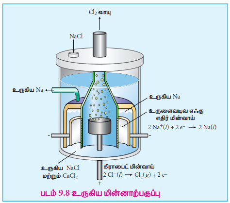
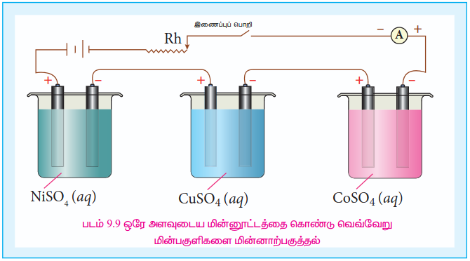
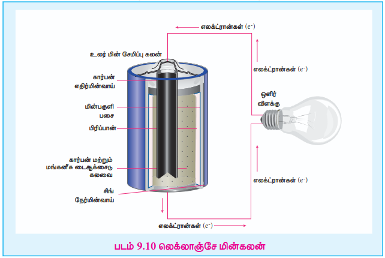
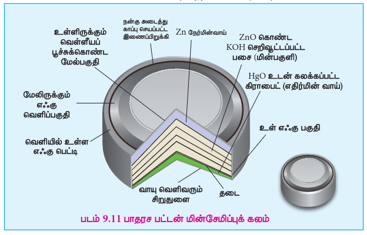
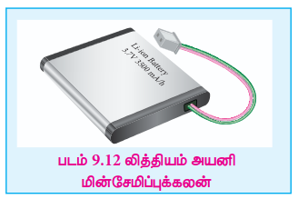
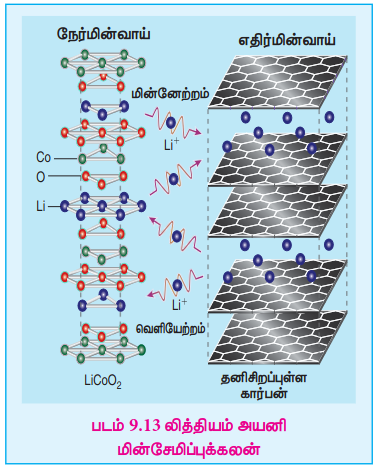
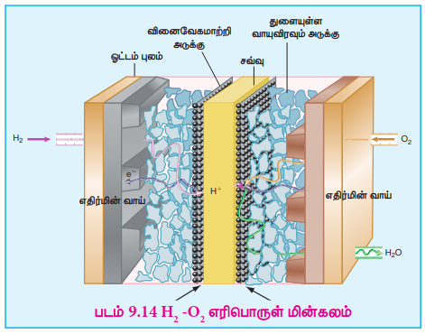
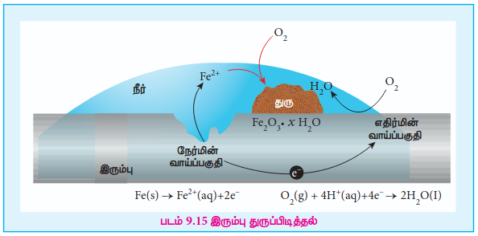
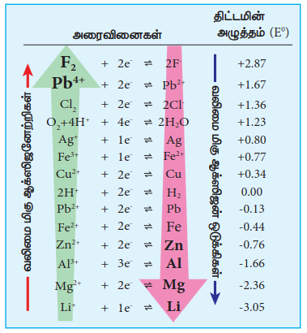

## 9.4 கலவினைகளின் வெப்ப இயக்கவியல்

கால்வானிக் மின்கலத்தில் வேதி ஆற்றலானது மின்னாற்றலாக மாற்றப்படுகிறது என்பதை நாம் கற்றறிந்தோம். மின்கலத்தில் உருவாக்கப்பட்ட மின்னாற்றலானது, எலக்ட்ரான்களின் மொத்த மின்சுமை மற்றும், மின்முனைகளுக்கிடையே எலக்ட்ரான்களை இயக்க உதவும் மின்கலத்தின் emf மதிப்பு ஆகியவற்றின் பெருக்குத் தொகைக்கு சமமாக இருக்கும்.

ஒட்டுமொத்த கலவினையில் ஆக்ஸிஜனேற்றி மற்றும் ஒடுக்கிகளுக்கிடையே பரிமாற்றம் செய்யப்பட்ட எலக்ட்ரான்களின் மோல் எண்ணிக்கையை 'n' எனக் கொண்டால், மின்கலத்தில் உருவாக்கப்பட்ட மின்னாற்றலின் அளவு கீழே கொடுக்கப்பட்டுள்ளது.

மின்னாற்றல் = n மோல் எலக்ட்ரான்களின் மின்னூட்டம் × \( E_{\text{cell}} \)

1 மோல் எலக்ட்ரான்களின் மின்னூட்டம் = ஒரு ஃபாரடே (1F)

\( \therefore \) n மோல் எலக்ட்ரான்களின் மின்னூட்டம் = nF

சமன்பாடு (9.20) \( \Rightarrow \) மின்னாற்றல் = nF \( E_{\text{cell}} \) ..... (9.21)

> 1 எலக்ட்ரானின் மின்சுமை = \( 1.602 \times 10^{-19} C \)
>
> \( \therefore \) 1 மோல் எலக்ட்ரான்களின் மின்சுமை = \( 6.023 \times 10^{23} \times 1.602 \times 10^{-19} C \)
>
> = 96488 C
>
> i.e., 1F = 96500 C

இந்த ஆற்றலானது, மின்னாற் வேலை செய்ய பயன்படுத்தப்படுகிறது. எனவே, ஒரு கால்வானிக் மின்கலத்திலிருந்து பெறக்கூடிய அதிகபட்ச வேலை

\( (W_{\text{max}})_{\text{cell}} = -nF E_{\text{cell}} \) ..... (9.22)

அமைப்பானது சூழலின்மீது வேலையை செய்வதை குறிப்பிட (-) குறி அறிமுகப்படுத்தப்பட்டுள்ளது.

வெப்ப இயக்கவியலின் இரண்டாம் விதிப்படி, அமைப்பினால் செய்யப்பட்ட வேலையானது, அமைப்பின் கிப்ஸ் ஆற்றலில் ஏற்பட்ட மாற்றத்திற்கு சமமாக இருக்கும் என்பதை நாம் அறிவோம்.

i.e., \( W_{\text{max}} = \Delta G \) ..... (9.23)

(9.22) மற்றும் (9.23) இலிருந்து,

\( \Delta G = -nF E_{\text{cell}} \) ..... (9.24)

தன்னிச்சையான கலவினைகளுக்கு, \( \Delta G \) மதிப்பு எதிர்க்குறி மதிப்பாக இருப்பது அவசியம். எதிர்க்குறி \( \Delta G \) மதிப்பை பெற \( E_{\text{cell}} \) மதிப்பானது நேர்க்குறி கொண்டதாக இருப்பது அவசியம் என்பதை சமன்பாடு (9.24) காட்டுகிறது.

மின்கலத்தின் அனைத்து உட்கூறுகளும் அவற்றின் திட்ட நிலைகளில் உள்ளபோது, சமன்பாடு (9.24) ஆனது பின்வருமாறு மாறுகிறது.

\( \Delta G^o = -nF E_{\text{cell}}^o \) ..... (9.25)

திட்ட கிப்ஸ் ஆற்றல் மாற்றமானது சமநிலை மாறிலியுடன் பின்வரும் சமன்பாட்டினால் தொடர்பு படுத்தப்பட்டுள்ளதை நாம் அறிவோம்.

\( \Delta G^o = -RT \ln K_{\text{eq}} \) ..... (9.26)

(9.25) மற்றும் (9.26) ஆகியவற்றை ஒப்பிடும்போது,

$ nFE^\circ_{\mathrm{cell}}=RT\ln K_{\mathrm{eq}} $

$ \Rightarrow\ E^\circ_{\mathrm{cell}} = \frac{2.303\,RT}{nF}\log K_{\mathrm{eq}} $ ..... (9.27)

### 9.4.1 நெர்ன்ஸ்ட் சமன்பாடு

நெர்ன்ஸ்ட் சமன்பாடு என்பது மின்கல மின்னழுத்தம் மற்றும் மின்வேதி வினையில் ஈடுபடும் கூறுகளின் செறிவு ஆகியவற்றை தொடர்புபடுத்தும் சமன்பாடாகும். பின்வரும் ஒட்டுமொத்த ஆக்ஸிஜனேற்ற ஒடுக்க வினை நிகழும் ஒரு மின்வேதிக் கலனை கருதுவோம்,

\( xA + yB \rightleftharpoons lC + mD \)

மேற்காண் வினைக்கான வினைக்கூறு (Q) மதிப்பு கீழே கொடுக்கப்பட்டுள்ளது

\( Q = \frac{[C]^l [D]^m}{[A]^x [B]^y} \) ..... (9.28)

நாம் முன்னர் கற்றறிந்தபடி,

\( \Delta G = \Delta G^o + RT \ln Q \) ..... (9.29)

கிப்ஸ் கட்டில் ஆற்றலை மின்கல emf உடன் பின்வருமாறு தொடர்பு படுத்த முடியும்.

[சமன்பாடுகள் (9.24) மற்றும் (9.25)]

\( \Delta G = -nF E_{\text{cell}} \ ; \ \Delta G^o = -nF E_{\text{cell}}^o \)

இந்த மதிப்புகளையும், சமன்பாடு (9.28) இலிருந்து Q மதிப்பையும் சமன்பாடு (9.29) ல் பிரதியிட

\( (9.29) \Rightarrow -nF E_{\text{cell}} = -nF E_{\text{cell}}^o + RT \ln \frac{[C]^l [D]^m}{[A]^x [B]^y} \) ..... (9.30)

சமன்பாடு (9.30) முழுவதையும் (-nF) ஆல் வகுக்க

\( (9.25) \Rightarrow E_{\text{cell}} = E_{\text{cell}}^o - \frac{RT}{nF} \ln \frac{[C]^l [D]^m}{[A]^x [B]^y} \) ..... (9.31)

(அல்லது) \( E_{\text{cell}} = E_{\text{cell}}^o - \frac{2.303RT}{nF} \log \frac{[C]^l [D]^m}{[A]^x [B]^y} \) ..... (9.31)

மேற்காண் சமன்பாடு (9.31) ஆனது **நெர்ன்ஸ்ட் சமன்பாடு** என்றழைக்கப்படுகிறது.

25°C (298K) வெப்பநிலையில் சமன்பாடு (9.31) ஐ பின்வருமாறு எழுதலாம்,

\( E_{\text{cell}} = E_{\text{cell}}^o - \frac{2.303 \times 8.314 \times 298}{n(96500)} \log \frac{[C]^l [D]^m}{[A]^x [B]^y} \)

\( E_{\text{cell}} = E_{\text{cell}}^o - \frac{0.0591}{n} \log \frac{[C]^l [D]^m}{[A]^x [B]^y} \)
\( \begin{array}{l} \therefore R = 8.314 \ JK^{-1} mol^{-1} \\ T = 298 \ K \\ 1F = 96500 \ C \ mol^{-1} \end{array} \) ..... (9.32)

25°C வெப்பநிலையில் நெர்ன்ஸ்ட் சமன்பாட்டை பயன்படுத்தி பின்வரும் மின்கலத்தின் emf மதிப்பை நாம் கணக்கிடுவோம்.

\( Cu (s) | Cu^{2+} (0.25 \ M, aq) || Fe^{3+} (0.005 \ M, aq), Fe^{2+} (0.1 \ M, aq) | Pt (s) \)

Given : \( (E^0)_{Fe^{3+}|Fe^{2+}} = 0.77V \) and \( (E^0)_{Cu^{2+}|Cu} = 0.34V \)

**தீர்வு**

நிகழும் அரைக்கல வினைகள்

\( Cu (s) \rightarrow Cu^{2+} (aq) + 2e^- \) ...... (1)

\( 2Fe^{3+} (aq) + 2e^- \rightarrow 2Fe^{2+} (aq) \) ...... (2)

ஒட்டுமொத்த வினை

\( Cu (s) + 2 Fe^{3+} (aq) \rightarrow Cu^{2+} (aq) + 2 Fe^{2+} (aq) \), and n = 2

25°C வெப்பநிலையில் நெர்ன்ஸ்ட் சமன்பாட்டை பயன்படுத்த

\( E_{\text{cell}} = E_{\text{cell}}^o - \frac{0.0591}{2} \log \frac{[Cu^{2+}] [Fe^{2+}]^2}{[Fe^{3+}]^2} \) ( [Cu (s)] = 1)

\( E_{\text{cell}}^o = (E_{\text{ox}})_{Cu/Cu^{2+}} + (E_{\text{red}})_{Fe^{3+}|Fe^{2+}} \)

\( Cu^{2+}|Cu \) வின் திட்ட ஒடுக்க மின்னழுத்த மதிப்பு 0.34 V

\( \therefore (E_{\text{ox}}^o)_{Cu/Cu^{2+}} = -0.34V \)

\( (E_{\text{red}}^o)_{Fe^{3+}|Fe^{2+}} = 0.77V \)

\( \therefore E_{\text{cell}}^o = -0.34 + 0.77 \)

\( E_{\text{cell}}^o = 0.43V \)

$ \therefore\ E_{\mathrm{cell}} = 0.43-\frac{0.0591}{2}\times\log\frac{(0.25)(0.1)^2}{(0.005)^2} \qquad\qquad =\log\frac{(0.25)(0.1)^2}{(0.005)^2} $

$ =0.43-\frac{0.0591}{2}\times2 \qquad\qquad\qquad\qquad =\log\frac{25\times10^2}{25\times10^{-6}}\times1\times10^{-2} $

$ =0.43-0.0591 \qquad\qquad\qquad\qquad\qquad\qquad =\log10^2 $

$ =0.3709\mathrm{V}. \qquad\qquad\qquad\qquad\qquad\qquad\qquad =2\log_{10}10 $

$ \qquad\qquad\qquad\qquad\qquad\qquad\qquad\qquad\qquad =2. $

> **தன் மதிப்பீடு**
>
> டேனியல் மின்கலத்தில் நிகழும் மின்வேதிக் கலவினை
>
> \( Zn(s) + Cu^{2+}(aq) \rightarrow Zn^{2+}(aq) + Cu(s) \)
>
> நேர்மின்முனைப் பகுதியில் அயனிச் செறிவை 10 மடங்கு அதிகரிக்கும்போது மின்கல மின்னழுத்தத்தில் ஏற்படும் மாற்றம் என்ன?

**மின்னாற்பகுப்புக் கலன் மற்றும் மின்னாற்பகுத்தல்**

மின்னாற்பகுத்தல் என்பது, மின்னாற்றலைப் பயன்படுத்தி தன்னிச்சையற்ற ஒரு வினையை நிகழ்த்தும் செயல்முறையாகும். பெரும்பாலான நேரங்களில், சேர்மத்தை அதன் தனிமங்களாக பிரிப்பதற்கு மின்னாற்றல் பயன்படுத்தப்படுகிறது. மின்னாற்பகுத்தலை நிகழ்த்தப் பயன்படும் மின்கலனானது, **மின்னாற்பகுப்புக் கலன்** என்றழைக்கப்படுகிறது. மின்னாற்பகுப்புக் கலன் மற்றும் கால்வானிக் மின்கலன்களில் நிகழும் மின்வேதிச் செயல்முறைகள் ஒன்றுக்கொன்று எதிரானவைகளாகும். உருகிய சோடியம் குளோரைடு கரைசலை மின்னாற்பகுப்பதன் மூலம் மின்னாற்பகுப்புக் கலனின் செயல்பாட்டை நாம் அறிந்து கொள்வோம்.

மின்னாற்பகுப்புக் கலனில் இரண்டு மின்முனைகள் உள்ளன. ஒன்று உருளை வடிவ எஃகு எதிர் மின்வாய் மற்றொன்று கிராஃபைட் நேர் மின்வாய். இரண்டும் உருகிய சோடியம் குளோரைடினுள் மூழ்கவைக்கப்பட்டுள்ளன, மேலும் அவை DC மின் மூலத்துடன் சாவியின் உதவியால் இணைக்கப்பட்டுள்ளன. மின் மூலத்தின் எதிர் முனையுடன் இணைக்கப்பட்டுள்ள மின்முனையானது **எதிர்மின்முனை** என்றழைக்கப்படுகிறது. மின்மூலத்தின் நேர முனையுடன் இணைக்கப்பட்டுள்ள மின்முனையானது **நேர்மின்முனை** என்றழைக்கப்படுகிறது. சாவி கொண்டு மூடிய உடன் வெளிப்புற DC மின்மூலமானது, எதிர்மின்முனை வழியே எலக்ட்ரான்களை பாய்ச்சுகிறது. அதே நேரத்தில், நேர்மின்முனை வழியே எலக்ட்ரான்களை இழுக்கிறது.

**கலவினைகள்**

Na\(^+\) அயனிகள் எதிர்மின்முனையை நோக்கி கவரப்படுகின்றன, அங்கு அவை எலக்ட்ரான்களுடன் இணைந்து, திரவ சோடியமாக ஒடுக்கமடைகின்றன.

**எதிர்மின்முனை (ஒடுக்கம்)**

\( Na^+(l) + e^- \rightarrow Na(l) \)
\( E^0 = -2.71V \)

இதேபோல Cl\(^-\) அயனிகள் நேர்மின்முனையை நோக்கி கவரப்படுகின்றன, அங்கு அவை அவற்றின் எலக்ட்ரான்களை இழந்து ஆக்ஸிஜனேற்றமடைந்து குளோரின் வாயுவாக மாறுகின்றன.

**நேர்மின்முனை (ஆக்ஸிஜனேற்றம்)**

\( 2Cl^-(l) \rightarrow Cl_2(g) + 2e^- \)
\( E^0 = -1.36V \)

**ஒட்டுமொத்த வினை,**

\( 2Na^+(l) + 2Cl^-(l) \rightarrow 2Na(l) + Cl_2(g) \)
\( E^0 = -4.07V \)

மேற்காண் வினை தன்னிச்சையற்றது என்பதை எதிர்க்குறி E° மதிப்பு காட்டுகிறது. எனவே, உருகிய சோடியம் NaCl ன் மின்னாற்பகுத்தலை நிகழ்த்த 4.07V ஐ விட அதிகமான மின்னழுத்தத்தை நாம் செலுத்த வேண்டும்.

மின்னாற்பகுப்புக் கலனில், கால்வானிக் மின்கலத்தில் நிகழ்வதைப்போலவே நேர்மின்முனை ஆக்ஸிஜனேற்றமும், எதிர்மின்முனையில் ஒடுக்கமும் நிகழ்கின்றன, ஆனால் மின்முனைகளின் குறி எதிரானது. அதாவது மின்னாற்பகுப்புக் கலனில் எதிர்மின்முனையின் குறி -ve மற்றும் நேர்மின்முனையின் குறி +ve.

**மின்னாற்பகுத்தல் பற்றிய ஃபாரடே விதிகள்:**

**முதல் விதி**

மின்னாற்பகுத்தலின் போது மின்முனைகளில் விடுவிக்கப்படும் பொருளின் நிறையானது (m) மின்கலத்தின் வழியே பாயும் மின்னூட்டத்தின் அளவிற்கு (Q) நேர்விகிதத்தில் இருக்கும்.

i.e. \( m \propto Q \)

மின்னோட்டத்தின் அளவானது, மின்னூட்டத்துடன் பின்வரும் சமன்பாட்டின் மூலம் தொடர்பு படுத்தப்படுகிறது என்பதை நாம் அறிவோம். \( I = \frac{Q}{t} \Rightarrow Q = It \)

\( \therefore m \propto It \)
(அல்லது)
\( m = ZIt \) ..... (9.33)

இங்கு Z என்பது மின்முனையில் விடுவிக்கப்பட்ட பொருளின் மின்வேதிச் சமானம் ஆகும்.

I = 1A மற்றும் t = 1 விநாடி, Q = 1C , எனில் அத்தகைய நேர்வுகளில் சமன்பாடு (9.33) ஆனது (9.34) போல மாறுகிறது

\( \Rightarrow m = Z \)

அதாவது, மின்வேதிச் சமானம் என்பது 1 கூலும் மின்னூட்டத்தால் மின்முனையில் விடுவிக்கப்பட்ட பொருளின் அளவு என வரையறுக்கப்படுகிறது.

**மின்வேதிச் சமான நிறை மற்றும் மோலார் நிறை**

பின்வரும் பொதுவான மின்வேதி ஆக்ஸிஜனேற்ற ஒடுக்க வினையை கருதுக.

\( M^{n+}(aq) + ne^- \rightarrow M(s) \)

மேற்காண் சமன்பாட்டிலிருந்து 1 மோல் M\(^{n+}\) அயனிகளை M(s) ஆக வீழ்படிவாக்குவதற்கு n மோல்கள் எலக்ட்ரான்கள் தேவைப்படும் என்பதை அறியலாம்.

1 மோல் M\(^{n+}\) அயனிகளை வீழ்படிவாக்க தேவைப்படும் மின்னூட்டம் = 'n' மோல் எலக்ட்ரான்களின் மின்சுமை
= nF

ஒரு கூலாம் மின்னூட்டத்தினால் வீழ்படிவாக்கப்பட்ட பொருளின் நிறை

$M^{n+}$ ன் மின்வேதிச் சமான நிறை $=\dfrac{M\text{ ன் மோலார் நிறை}}{n\ (96500)}$

$$ (அல்லது) $$

$$Z=\dfrac{M\text{ ன் சமான நிறை}}{96500}.....(9.35)$$

**இரண்டாம் விதி**

ஒரே அளவு மின்னோட்டத்தை வெவ்வேறு மின்பகுளிக் கரைசல்களின் வழியே செலுத்தும்போது, மின்முனைகளில் விடுவிக்கப்படும் பொருளின் அளவானது அவற்றின் மின்வேதிச் சமானங்களுக்கு நேர்விகிதத்தில் இருக்கும்.

படம் 9.9ல் காட்டியுள்ளவாறு ஒரே DC மின்மூலத்துடன் தொடர் இணைப்பில் இணைக்கப்பட்டுள்ள மூன்று மின்னாற்பகுப்புக் கலன்களை கருதுவோம். ஒவ்வொரு மின்கலமும் வெவ்வேறு மின்பகுளிகளை முறையே NiSO\(_4\), CuSO\(_4\) மற்றும் CoSO\(_4\) கரைசல்களைக் கொண்டு நிரப்பப்பட்டுள்ளன. Q கூலூம் மின்னூட்டத்தை மின்னாற்பகுப்புக் கலன்களின் வழியே செலுத்தும்போது அந்தந்த மின்முனைகளில் விடுவிக்கப்பட்ட உலோகங்கள் நிக்கல், காப்பர் மற்றும் கோபால்ட் ஆகியவற்றின் நிறைகள் முறையே \( m_{Ni}, m_{Cu} \) மற்றும் \( m_{Co} \). ஃபாரடேயின் இரண்டாம் விதிப்படி

\( m_{Ni} \propto Z_{Ni}, m_{Cu} \propto Z_{Cu} \) மற்றும் \( m_{Co} \propto Z_{Co} \)

(அல்லது)

\( \frac{m_{Ni}}{Z_{Ni}} = \frac{m_{Cu}}{Z_{Cu}} = \frac{m_{Co}}{Z_{Co}} \) ..... (9.36)

> **எடுத்துக்காட்டு**
>
> 2 ஆம்பியர் மின்னோட்டத்தைக் கொண்டு, சில்வர் நைட்ரேட் கரைசலானது 20 நிமிடங்களுக்கு மின்னாற்பகுக்கப்படுகிறது எனில், எதிர்மின்முனையில் வீழ்படிவாகும் சில்வரின் நிறையை கணக்கிடுக.
>
> **தீர்வு**
>
> எதிர்மின்முனையில் நிகழும் மின்வேதி வினை \( Ag^+ + e^- \rightarrow Ag \) (ஒடுக்கம்)
> 
> \( Z = \frac{Ag \ \text{ன் மோலார் நிறை}}{96500} = \frac{108 \ g mol^{-1}}{96500 \ C \ mol^{-1}} \)
> \( I = 2 \ A \)
> \( t = 20 \times 60 \ S = 1200 \ S \)
> \( It = 2 \ A \times 1200 \ S = 2400 \ C \)
> \( m = ZIt \)
> \( m = \frac{108 \ gmol^{-1}}{96500 \ C \ mol^{-1}} \times 2400 \ C \)
> \( m = 2.68 \ g \)

> **தன் மதிப்பீடு**
>
> 0.15 ஆம்பியர் மின்னோட்டத்தை கொண்டு, ஒரு உலோக உப்புக் கரைசலானது 15 நிமிடங்களுக்கு மின்னாற்பகுக்கப்படும்போது, எதிர்மின்முனையில் விடுவிக்கப்பட்ட உலோகத்தின் நிறை 0.783 கிராம் எனில், அந்த உலோகத்தின் சமான நிறையை கணக்கிடுக.

**மின்னே சமிப்புக் கலன்கள்**

நவீன மின்னணு உலகில் மின்னே சமிப்புக் கலன்கள் இன்றியமையாதவைகளாகும். எடுத்துக்காட்டாக, கைப்பேசிகளில் பயன்படும் Li – அயனி சேமிப்புக் கலன்கள், மின்கலவிகளில் பயன்படும் பசை மின்கலன்கள் போன்றவை. இந்த மின்னே சமிப்புக் கலன்கள் நிலையான மின்னழுத்தம் கொண்ட நேர்மின்னோட்ட மூலங்களாக பயன்படுத்தப்படுகின்றன. நாம் இந்த மின்னே சமிப்புக் கலன்களை முதன்மை மின்கலன்கள் (மின்னேற்றம் செய்ய இயலாதவை - non-rechargeable) மற்றும் துணை மின்கலன்கள் (மின்னேற்றம் செய்ய இயல்பவை - rechargeable) என இருமைகளாக வகைப்படுத்தலாம். இந்த பாடப்பகுதியில் சில மின்னே சமிப்புக் கலன்களின் மின்வேதியியலைப் பற்றி சுருக்கமாக விவாதிப்போம்.

**லெக்லாஞ்சே மின்கலம்**

**நேர்மின்முனை :** ஜிங்க் கலன்

**எதிர்மின்முனை :** MnO\(_2\) உடன் தொடர்பிலுள்ள கிராஃபைட் தண்டு

**மின்பகுளி :** நீரிலுள்ள அம்மோனியம் குளோரைடு மற்றும் ஜிங்க் குளோரைடு

மின்கலத்தின் Emf மதிப்பு ஏறத்தாழ 1.5V

**கலவினைகள்:**

**நேர்மின்முனையில் ஆக்ஸிஜனேற்றம்**

\( Zn (s) \rightarrow Zn^{2+} (aq) + 2e^- \) ...... (1)

**எதிர்மின்முனையில் ஒடுக்கம்**

\( 2NH_4^+ (aq) + 2e^- \rightarrow 2NH_3 (aq) + H_2 (g) \) ...... (2)

ஹைட்ரஜன் வாயுவானது MnO\(_2\) வினால் நீராக ஆக்ஸிஜனேற்றம் செய்யப்படுகிறது

\( H_2 (g) + 2MnO_2 (s) \rightarrow Mn_2O_3 (s) + H_2O (l) \) ...... (3)

சமன்பாடுகள் (1) + (2) + (3) ஐ கூட்ட ஒட்டுமொத்த ஆக்ஸிஜனேற்ற ஒடுக்க வினை

\( Zn (s) + 2NH_4^+ (aq) + 2MnO_2 (s) \rightarrow Zn^{2+} (aq) + Mn_2O_3 (s) + H_2O (l) + 2NH_3 \) ...... (4)

எதிர்மின்முனையில் உருவாக்கப்பட்ட அம்மோனியாவானது Zn\(^{2+}\) அயனிகளுடன் இணைந்து [Zn(NH\(_3\))\(_4\)]\(^{2+}\) (aq) எனும் அணைவு அயனியை உருவாக்குகிறது. வினை நிகழ, நிகழ NH\(_4^+\) அயனிச் செறிவு குறைந்து கொண்டே செல்கிறது, மேலும் நீரிய NH\(_3\) அதிகரித்துக்கொண்டே இருப்பதால் மின்கலனின் emf குறைகிறது.

**பாதரச பட்டன் மின்சேமிப்புக் கலன்**

**நேர்மின்முனை :** பாதரசத்துடன் இரசக்கலவையாக்கப்பட்ட ஜிங்க்

**எதிர்மின்முனை :** கிராஃபைட்டுடன் கலக்கப்பட்ட HgO

**மின்பகுளி :** KOH மற்றும் ZnO கலந்த பசை

**நேர்மின்முனையில் ஆக்ஸிஜனேற்றம் நிகழ்கிறது**
\( Zn(s) + 2OH^-(aq) \rightarrow ZnO(s) + H_2O(l) + 2e^- \) (KOH இலிருந்து)

**எதிர்மின்முனையில் ஒடுக்கம் நிகழ்கிறது**
\( HgO(s) + H_2O(l) + 2e^- \rightarrow Hg(l) + 2OH^-(aq) \)

**ஒட்டுமொத்த வினை**
\( Zn(s) + HgO(s) \rightarrow ZnO(s) + Hg(l) \)

**மின்கல emf :** ஏறத்தாழ 1.35V.

**பயன்கள் :** இது அதிக திறன் மற்றும் நீண்ட ஆயுள் கொண்டது. பேஸ்மேக்கர், மின்னணு கடிகாரங்கள், கேமராக்கள் போன்றவற்றில் பயன்படுகின்றன.

**துணை மின்கலங்கள்**

கால்வானிக் மின்கலன்களில் நிகழும் மின்வேதி வினைகளை, அந்த மின்கலன் உருவாக்கிய emf மதிப்பை விட சற்றே அதிகமான மின்னழுத்தத்தை செலுத்துவதன் மூலம் எதிர்திசையில் நிகழச்செய்யலாம் என முன்னர் கற்றறிந்தோம். இந்தக்கொள்கையானது, துணை மின்கலங்களில், ஆரம்ப வினைப்படு பொருட்களை மீளுருவாக்குவதற்காக பயன்படுத்தப்படுகிறது. லெட் சேமிப்புக் கலனை எடுத்துக்காட்டாக கொண்டு துணை மின்கலன்களின் செயல்பாட்டை நாம் புரிந்து கொள்வோம்.

**லெட் சேமிப்பு கலன்**

**நேர்மின்முனை :** மெல்லிய ஈயத் தகடு

**எதிர்மின்முனை :** PbO\(_2\) பூசப்பட்ட ஈயத் தகடு

**மின்பகுளி :** 38% நிறை சதவீதமுடைய, 1.2 g/mL அடர்த்தி கொண்ட H\(_2\)SO\(_4\)

**நேர்மின்முனையில் ஆக்ஸிஜனேற்றம் நிகழ்கிறது**
\( Pb(s) \rightarrow Pb^{2+} + 2e^- \) ..... (1)

Pb\(^{2+}\) அயனிகள் SO\(_4^{2-}\) உடன் இணைந்து PbSO\(_4\) வீழ்படிவை உருவாக்குகின்றன.
\( Pb^{2+}(aq) + SO_4^{2-}(aq) \rightarrow PbSO_4(s) \) ..... (2)

**எதிர்மின்முனையில் ஒடுக்கம் நிகழ்கிறது**
\( PbO_2(s) + 4H^+(aq) + 2e^- \rightarrow Pb^{2+}(aq) + 2H_2O(l) \) ..... (3)

இந்த Pb\(^{2+}\) அயனிகள் H\(_2\)SO\(_4\) இல் உள்ள SO\(_4^{2-}\) உடன் இணைந்து PbSO\(_4\) வீழ்படிவை உருவாக்குகின்றன.
\( Pb^{2+}(aq) + SO_4^{2-}(aq) \rightarrow PbSO_4(s) \) ..... (4)

**ஒட்டுமொத்த வினைகள்**

சமன்பாடுகள் (1) + (2) + (3) + (4)

\( Pb(s) + PbO_2(s) + 4H^+(aq) + 2SO_4^{2-}(aq) \rightarrow 2PbSO_4(s) + 2H_2O(l) \)

ஒரு மின்கலத்தின் emf மதிப்பு ஏறக்குறைய 2V. வழக்கமாக ஆறு மின்கலன்களை தொடர் வரிசையில் இணைத்து 12 வோல்ட் உருவாக்கப்படுகிறது.

மின்கலத்தின் emf ஆனது H\(_2\)SO\(_4\) ன் செறிவைப் பொறுத்தமைகிறது. கலவினையில் SO\(_4^{2-}\) அயனிகள் பயன்படுத்தப்பட்டுவிடுவதால் H\(_2\)SO\(_4\) ன் செறிவு குறைகிறது. மின்கல மின்னழுத்தம் ஏறக்குறைய 1.8V ஆக குறையும்போது, மின்கலம் மின்னேற்றம் செய்யப்பட வேண்டும்.

**மின்கலத்தை மின்னேற்றம் (recharge) செய்தல்**

முன்னர் கூறியவாறு, 2V க்கும் அதிகமான மின்னழுத்தம் மின்முனைகளுக்கிடையே வழங்கப்படுதல், மின்னிறக்க (discharge) செயல்பாட்டின்போது நிகழ்ந்த கலவினைகள் தற்பொழுது எதிர்திசையில் நிகழ்கின்றன. மின்னேற்றம் செய்யும் செயல்முறையில், நேர்மின்முனை மற்றும் எதிர்மின்முனையின் பங்கு தலைகீழாக மாறுகிறது, மேலும் H\(_2\)SO\(_4\) மீளுருவாக்கப்படுகிறது.

**எதிர்மின்முனையில் ஆக்ஸிஜனேற்றம் நிகழ்கிறது** (தற்போது நேர்மின்முனையாக செயல்படுகிறது)

\( PbSO_4(s) + 2H_2O(l) \rightarrow PbO_2(s) + 4H^+(aq) + SO_4^{2-}(aq) + 2e^- \)

**நேர்மின்முனையில் ஒடுக்கம் நிகழ்கிறது** (தற்போது எதிர்மின்முனையாக செயல்படுகிறது)

\( PbSO_4(s) + 2e^- \rightarrow Pb(s) + SO_4^{2-}(aq) \)

**ஒட்டுமொத்த வினை**

\( 2PbSO_4(s) + 2H_2O(l) \rightarrow Pb(s) + PbO_2(s) + 4H^+(aq) + 2SO_4^{2-}(aq) \)

அதாவது ஒட்டுமொத்த கலவினையானது, மின்னிறக்கத்தின்போது நிகழ்ந்த ஆக்ஸிஜனேற்ற ஒடுக்க வினைக்கு எதிர்திசையில் நிகழும் வினையாகும்.

**பயன்கள்:** தானியங்கி மோட்டார் வாகனங்கள், இரயில்கள், மாறுதிசை மின்மாற்றி ஆகியவற்றில் பயன்படுகிறது.

**வித்தியம்- அயனி மின்சேமிப்புக் கலன்**

**நேர்மின்முனை :** துளைகளுடைய கிராஃபைட்

**எதிர்மின்முனை :** CoO\(_2\) போன்ற இடைநிலை உலோக ஆக்சைடு

**மின்பகுளி :** கரிம கரைப்பானில் கரைந்த வித்தியம் உப்பு

**நேர்மின்முனையில் ஆக்ஸிஜனேற்றம் நிகழ்கிறது**

\( Li(s) \rightarrow Li^+(aq) + e^- \)

**எதிர்மின்முனையில் ஒடுக்கம் நிகழ்கிறது**

\( Li^+ + CoO_2(s) + e^- \rightarrow LiCoO_2(s) \)

**ஒட்டுமொத்த வினை**

\( Li(s) + CoO_2 \rightarrow LiCoO_2(s) \)

இந்த இரண்டு மின்முனைகளும் தங்களின் அமைப்பிற்குள்ளேயும் வெளியேயும் சென்று வர Li\(^+\) அயனிகளை அனுமதிக்கின்றன.

மின்னிறக்கத்தின்போது, நேர்மின்முனையில் உருவாக்கப்பட்ட Li\(^+\) அயனிகள் கரிம மின்பகுளி வழியாக எதிர்மின்முனையை நோக்கி நகருகின்றன. மின்கலத்தால் உருவாக்கப்பட்ட emf ஐ விட அதிகமான மின்னழுத்தத்தை, மின்முனைகளுக்கிடையே செலுத்தும்போது கலவினையானது எதிர்திசையில் நிகழ்கிறது. மேலும் இப்போது Li\(^+\) அயனிகள் எதிர்மின்முனையிலிருந்து நேர்மின்முனை நோக்கி நகருகின்றன, அங்கு அவை நுண்துளைகளுடைய மின்முனையின்மீது சென்று படிகின்றன. இந்நிகழ்ச்சியானது **ஊடுகலத்தல் (intercalation)** என அறியப்படுகிறது.

**பயன்கள் :** இவை கைப்பேசி, மடிகணினி, கணினிகள், கேமராக்கள் போன்றவற்றில் பயன்படுத்தப்படுகின்றன.

**எரிபொருள் மின்கலம்**

எரிபொருட்களை எரிப்பதால் உருவாகும் ஆற்றலை மின்னாற்றலாக மாற்றக்கூடிய கால்வானிக் மின்கலமானது **எரிபொருள் மின்கலம்** என்றழைக்கப்படுகிறது. இது தொடர்ந்து வேலை செய்வதற்கு, வினைப்பொருள் தொடர்ந்து வழங்கப்பட வேண்டும். பொதுவாக, எரிபொருள் மின்கலமானது பின்வருமாறு குறிப்பிடப்படுகிறது.

எரிபொருள் | மின்முனை | மின்பகுளி | மின்முனை | ஆக்ஸிஜனேற்றி

ஹைட்ரஜன் – ஆக்ஸிஜன் எரிபொருள் மின்கலத்தை கருதுவதன் மூலம் எரிபொருள் மின்கலத்தின் செயல்பாட்டை நாம் புரிந்து கொள்வோம். இந்த நேர்வில், ஹைட்ரஜன், எரிபொருளாகவும், ஆக்ஸிஜன், ஆக்ஸிஜனேற்றியாகவும், 200°C வெப்பநிலை மற்றும் 20 – 40 atm அழுத்தத்தில் பராமரிக்கப்படும் நீர்த்த KOH கரைசல் மின்பகுளியாகவும் செயல்படுகின்றன. Ni மற்றும் NiO ஆகியவற்றைக் கொண்டுள்ள நுண்துளைகளையுடைய கிராஃபைட் மின்முனையானது வினையுறா மின்முனையாக செயல்படுகிறது.

ஹைட்ரஜன் மற்றும் ஆக்ஸிஜன் வாயுக்கள் முறையே நேர்மின்முனை மற்றும் எதிர்மின்முனைகளில் குமிழிகளாக செலுத்தப்படுகின்றன.

**நேர்மின்முனையில் ஆக்ஸிஜனேற்றம் நிகழ்கிறது:**

\( 2H_2(g) + 4OH^-(aq) \rightarrow 4H_2O(l) + 4e^- \)

**எதிர்மின்முனையில் ஒடுக்கம் நிகழ்கிறது**

\( O_2(g) + 2H_2O(l) + 4e^- \rightarrow 4OH^-(aq) \)

**ஒட்டுமொத்த வினை**

\( 2H_2(g) + O_2(g) \rightarrow 2H_2O(l) \)

மேற்கண்ட வினையானது ஹைட்ரஜனின் எரிதல் வினையை ஒத்துள்ளது. எனினும், அவை நேரடியாக வினைபுரிவதில்லை. அதாவது, ஆக்ஸிஜனேற்றம் மற்றும் ஒடுக்கம் வினைகள் முறையே நேர்மின்முனை மற்றும் எதிர்மின்முனைகளில் தனித்தனியாக நிகழ்கின்றன. H\(_2\)-O\(_2\) எரிபொருள் மின்கலத்தைப் போலவே புரொப்பேன் -O\(_2\) மற்றும் மீத்தேன் -O\(_2\) போன்ற எரிபொருள் கலன்களும் உருவாக்கப்பட்டுள்ளன.

**அரிமானம்**

இரும்பு துருப்பிடித்தல் பற்றி நாம் நன்றாக அறிவோம். காப்பர் மற்றும் பித்தளை பாத்திரங்களின் மீது பச்சை நிற படலம் உருவாவதை நீங்கள் கவனித்ததுண்டா? இவ்விரண்டிலும், ஈரப்பதத்தின் முன்னிலையில், ஆக்ஸிஜனால் உலோகங்கள் ஆக்ஸிஜனேற்றம் செய்யப்படுகின்றன. இந்த ஆக்ஸிஜனேற்ற ஒடுக்க செயல்முறைகளால் உலோகங்கள் சீர்குலையும் நிகழ்வானது **அரிமானம்** என்றழைக்கப்படுகிறது. இரும்பு அரிக்கப்படுவதால் கட்டிடங்கள், பாலங்கள் போன்றவை சேதமடைகின்றன, எனவே, துருப்பிடித்தல் நிகழ்விலுள்ள வேதியியல் மற்றும் அதனை எவ்வாறு தடுப்பது என்பதை அறிந்து கொள்ளுதல் ஆகியன மிக முக்கியமானவைகளாகும். இரும்பு துருப்பிடித்தல் என்பது ஒரு மின்வேதிச் செயல்முறையாகும்.

**அரித்தலின் மின்வேதி வழிமுறை:**

துருப்பிடித்தலுக்கு ஆக்ஸிஜனும் நீரும் அவசியம். இது ஒரு மின்வேதி ஆக்ஸிஜனேற்ற ஒடுக்க செயல்முறை என்பதால், இரும்பின் வெவ்வேறு புறப்பரப்புகளில் நேர்மின்முனை மற்றும் எதிர்மின்முனை தேவைப்படுகிறது. இரும்பின் புறப்பரப்பு மற்றும் நீர்த்துளி ஆகியன படம் (9.15)ல் காட்டியுள்ளவாறு ஒரு நுண்ணிய கால்வானிக் மின்கலத்தை உருவாக்குகின்றன. நீரினால் சூழப்பட்ட பகுதியானது குறைந்தளவு ஆக்ஸிஜனுக்கு வெளிக்காட்டப்படுவதால் **நேர்மின்முனையாக** செயல்படுகிறது. மீதமுள்ள பகுதிகள் அதிகளவு ஆக்ஸிஜனை கொண்டிருப்பதால் **எதிர்மின்முனைகளாக** செயல்படுகின்றன. ஆதலால், ஆக்ஸிஜனின் அளவைப் பொருத்து ஒரு மின்வேதிக் கலம் உருவாக்கப்படுகிறது. நேர்மின்முனையில், அதாவது நீரினால் சூழப்பட்டுள்ள பகுதியில் கீழே விளக்கியுள்ளவாறு அரித்தல் நிகழ்கிறது.

**நேர்மின்முனை (ஆக்ஸிஜனேற்றம்)**

நேர்மின்முனைப் பகுதியில் இரும்பு கரைகிறது.

\( 2Fe(s) \rightarrow 2Fe^{2+}(aq) + 4e^- \quad E^0 = 0.44V \)

இந்த எலக்ட்ரான்கள் நேர்மின்முனைப் பகுதியிலிருந்து எதிர்மின்முனைப் பகுதிக்கு உலோகத்தின் வழியே நகருகின்றன. இங்கு நீரில் கரைந்துள்ள ஆக்ஸிஜன் நீராக ஒடுக்கப்படுகிறது.

**எதிர்மின்முனை (ஒடுக்கம்)**

வளிமண்டல கார்பன் டை ஆக்சைடானது நீருடன் வினைப்பட்டு கார்பானிக் அமிலத்தை தருகிறது. இந்த அமிலமானது, ஒடுக்கத்திற்கு தேவையான H\(^+\) அயனிகளை வழங்குகிறது.

\( O_2(g) + 4H^+(aq) + 4e^- \rightarrow 2H_2O(l) \quad E^0 = 1.23V \)

நீர்த்துளியின் வழியே அயனிகள் நகர்வதால் மின்சுற்று முழுமையடைகிறது.

**ஒட்டுமொத்த ஆக்ஸிஜனேற்ற ஒடுக்க வினைகள்,**

\( 2Fe(s) + O_2(g) + 4H^+(aq) \rightarrow 2Fe^{2+}(aq) + 2H_2O(l) \quad E^0 = 0.444 + 1.23 = 1.67V \)

வினை தன்னிச்சையாக நிகழ்கிறது என்பதை நேர்க்குறி emf மதிப்பு காட்டுகிறது.

Fe\(^{2+}\) அயனிகள் மேலும் ஆக்ஸிஜனேற்றமடைந்து Fe\(^{3+}\) அயனிகளாக மாறுகின்றன, இவை மேலும் ஆக்ஸிஜனுடன் வினைப்பட்டு துரு (rust) உருவாகிறது.

\( 4Fe^{2+}(aq) + O_2(g) + 4H^+(aq) \rightarrow 4Fe^{3+}(aq) + 2H_2O(l) \)

\( 2Fe^{3+}(aq) + 4H_2O(l) \rightarrow Fe_2O_3 \cdot H_2O(s) + 6H^+(aq) \)

அலுமினியம், காப்பர் போன்ற பிற உலோகங்களும், சில்வரும் அரித்தலுக்கு உட்படுகின்றன. ஆனால் இவை இரும்பை விட குறைவான வேகத்தில் அரிக்கப்படுகின்றன. எடுத்துக்காட்டாக, அலுமினியத்தின் ஆக்ஸிஜனேற்றத்தை கருதுவோம்.

\( Al(s) \rightarrow Al^{3+}(aq) + 3e^- \)

Al\(^{3+}\) அயனிகள் காற்றிலுள்ள ஆக்ஸிஜனுடன் வினைப்பட்டு Al\(_2\)O\(_3\) எனும் பாதுகாப்பு அடுக்கை உருவாக்குகின்றன, இந்த அடுக்கானது உள்பரப்பை பாதுகாக்கக்கூடிய பாதுகாப்பு உறையாக செயல்படுகிறது, எனவே தொடர்ந்து அரித்தல் நிகழ்வது தடுக்கப்படுகிறது.

**உலோகங்களை அரித்தலிலிருந்து பாதுகாத்தல்**

இது பின்வரும் முறைகளில் சாத்தியமாகிறது.

i. உலோக பரப்புகளின் மீது வர்ணம் பூசுதல்.

ii. **துத்தநாக முலாம் பூசுதல்:** ஜிங்க் போன்ற மற்ற உலோகங்களைக் கொண்ட முலாம் பூசுதல். ஜிங்க் உலோகமானது இரும்பை விட வலிமைமிகுந்த ஒடுக்கியாகும், அதாவது, இரும்பிற்கு பதிலாக ஜிங்க் ஆக்ஸிஜனேற்றமடைகிறது.

iii. **எதிர்முனைப் பாதுகாப்பு:** மின்முலாம் பூசுதலைப் போலல்லாமல், இந்த தொழிற்நுட்ப உத்தியில் பாதுகாக்கப்படவேண்டிய உலோகம் முழுவதும் பாதுகாப்பு உலோகத்தை பூச வேண்டிய அவசியமில்லை. மாறாக, Mg அல்லது ஜிங்க் போன்ற இரும்பைவிட எளிதில் அரிமானமடையும் உலோகங்களை **தன்னிழப்பு நேர்மின்முனையாக (sacrificial anode)** பயன்படுத்த முடியும். இரும்பு எதிர்மின்முனையாக செயலாற்றுகிறது. எனவே இரும்பு பாதுகாக்கப்படுகிறது. ஆனால் Mg அல்லது Zn அரித்தலுக்கு உள்ளாகின்றன.

iv. **செயறுத்தல் (Passivation):** உலோகமானது, அடர் HNO\(_3\) போன்ற வலிமைமிகு ஆக்ஸிஜனேற்ற காரணிகளுடன் வினைபுரிய அனுமதிக்கப்படுகின்றது. இதனால், உலோக புறப்பரப்பின்மீது ஒரு பாதுகாப்பு அடுக்கு உருவாக்கப்படுகிறது.

v. **உலோகக் கலவை உருவாக்கம்:** மற்ற அதிக நேர்மின் தன்மை கொண்ட உலோகங்களுடன் சேர்ந்து உலோகக் கலவைகளை உருவாக்குவதன் மூலம் இரும்பின் ஆக்ஸிஜனேற்றமடையும் திறனை குறைக்க முடியும். எடுத்துக்காட்டு, துருப்பிடிக்கா எஃகு – Fe மற்றும் Cr சேர்ந்த உலோகக் கலவை.

**மின்வேதி வரிசை**

திட்ட ஹைட்ரஜன் மின்முனையை பயன்படுத்தி திட்ட மின்முனை மின்னழுத்தங்கள் அளவிடப்படுகின்றன என்பதை நாம் முன்னர் கற்றறிந்தோம். 298K வெப்பநிலையில் பல்வேறு உலோகம்– உலோக அயனி மின்முனைகளின் திட்ட ஒடுக்க மின்னழுத்தங்களின் இறங்கு வரிசையில் படத்தில் காட்டியபடி அமைக்கப்பட்டுள்ளன.

இந்த வரிசையானது **மின்வேதி வரிசை** என்றழைக்கப்படுகிறது.

திட்ட ஒடுக்க மின்னழுத்தம் (E°) என்பது ஒரு குறிப்பிட்ட கூறின் ஆக்ஸிஜனேற்றமடையும் திறனின் அளவீடாகும். ஒரு கூறின் E° மதிப்பு அதிகம் எனில் அக்கூறானது எலக்ட்ரானை ஏற்றுக்கொண்டு ஒடுக்கமடையும் திறனும் அதிகமாக இருக்கும். எனவே, (E°) மதிப்பு அதிகம் எனில் அதன் அரிமானம் அடையும் திறன் குறைவாக இருக்கும்.

