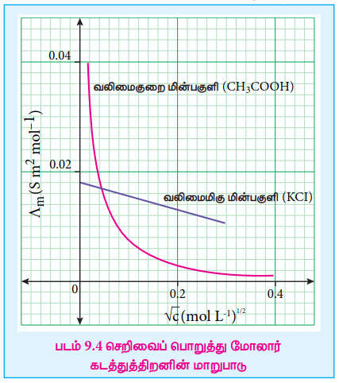
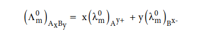
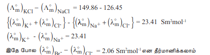
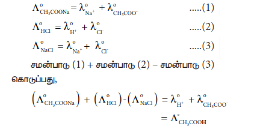

## 9.2 செறிவைப் பொறுத்து மோலார் கடத்துத்திறனில் ஏற்படும் மாற்றம்

பிரட்ரிச் கோல்ராஷ் என்பவர் வெவ்வேறு செறிவுகளைக் கொண்ட வெவ்வேறு மின்பகுளிக் கரைசல்களின் மோலார் கடத்துத்திறன்களை ஆராய்ந்தார். நீர்த்தல் அதிகரிக்கும்போது ஒரு மின்பகுளிக்கரைசலின் மோலார் கடத்துத்திறன் மதிப்பும் அதிகரிக்கிறது என்பதை அவர் கண்டறிந்தார். இதை சரியாக புரிந்து கொள்வதற்கான ஒரு சோதனை முடிவுகள் பின்வரும் அட்டவணையில் கொடுக்கப்பட்டுள்ளது.

| செறிவு (M) | மோலார் | கடத்துத்திறன் |(×10-3 Sm2 mol-1) |
| :---: | :---: | :---: | :---: |
|  | NaCl | KCl | HCl |
| 0.1 | 10.674 | 12.896 | 39.132 |
| 0.01 | 11.851 | 14.127 | 41.20 |
| 0.0001 | 12.374 | 14.695 | 42.136 |

மேற்காண் முடிவுகளின் அடிப்படையில், மோலார் கடத்துத்திறன் (\( \Lambda_m \)) மற்றும் மின்பகுளிக் கரைசலின் செறிவு (C) ஆகியவற்றிற்கிடையேயான எளிய தொடர்பை கோல்ராஷ் வருவித்தார்.

\( \Lambda_m = \Lambda_m^o - k\sqrt{C} \) ...... (9.11)

மேற்காண் சமன்பாடானது y = mx + c வடிவிலுள்ள நேர்கோட்டு சமன்பாடாகும். எனவே, \( \Lambda_m \) Vs \( \sqrt{C} \) வரைபடமானது ஒரு நேர்கோட்டை தருகிறது. இதன் சாய்வு -k மற்றும் y அச்சு வெட்டுத்துண்டு \( \Lambda_m^o \). இங்கு \( \Lambda_m^o \) என்பது **வரம்பு நிலை மோலார் கடத்துத்திறன்** என்றழைக்கப்படுகிறது. அதாவது, மோலார் கடத்துத்திறனானது அதீத நீர்த்த கரைசலில் வரம்பு நிலை மதிப்பை அடைகிறது.

படம் 9.4 ல் காட்டியுள்ளவாறு KCl, NaCl போன்ற வலிமைமிகு மின்பகுளிகளுக்கு \( \Lambda_m \) Vs \( \sqrt{C} \), வரைபடம் ஒரு நேர்கோட்டை தருகிறது. இந்த வரைபடம் வலிமை குறைந்த மின்பகுளிகளுக்கு நேர்கோடாக அமையவில்லை என்பதையும் அறிய முடிகிறது.

வலிமைமிகு மின்பகுளிக்கு, உயர் செறிவில், கொடுக்கப்பட்ட கனஅளவிலுள்ள மின்பகுளியின் பகுதிக்கூறு அயனிகளின் எண்ணிக்கை அதிகமாக இருக்கும். எனவே, எதிரெதிர் மின்சுமை கொண்ட அயனிகளுக்கிடைப்பட்ட கவர்ச்சி விசையும் அதிகமாக இருக்கும். மேலும், கரைப்பானேற்றத்தின் காரணமாக, அயனிகள் பாகுத்தன்மைப் பின்னணியை உணர்கின்றன. உயர் செறிவு கொண்ட கரைசல்களின் குறைந்த மோலார் கடத்துத்திறனுக்கு இந்த காரணிகள் காரணமாகின்றன. நீர்த்தல் அதிகரிக்கும்போது, அயனிகள் தொலைவில் உள்ளதால் அவற்றிற்கிடையே கவர்ச்சி விசை குறைகிறது. அளவிலா நீர்த்தலில் அயனிகள் வெகு தொலைவில் இருப்பதால், அயனிகளுக்கிடைப்பட்ட கவர்ச்சி விசையானது முக்கியத்துவத்தை இழக்கிறது, இதனால், மோலார் கடத்துத்திறன் அதிகரித்து அளவிலா நீர்த்தலில் உச்சபட்ச மதிப்பை அடைகிறது.

வலிமை குறைந்த மின்பகுளிக்கு, உயர் செறிவில், வரைபடமானது ஏறக்குறைய செறிவு அச்சிற்கு இணையாக நகர்கிறது. நீர்த்தல் அதிகரிக்கும்போது கடத்துத்திறன் சிறிதளவு அதிகரிக்கிறது. செறிவு பூஜ்ஜியத்தை அடையும்போது திடீரென மோலார் கடத்துத்திறன் அதிகரித்து ஏறக்குறைய \( \Lambda_m^o \) அச்சிற்கு இணையாகிறது. இதற்கு காரணம், நீர்த்தல் அதிகரிக்கும்போது வலிமை குறைந்த மின்பகுளியின் பிரிகையடைதல் அதிகரிக்கிறது (ஆஸ்வால்ட் நீர்த்தல் விதி). படம் (9.2) ல் காட்டியுள்ளவாறு வலிமைமிகு மின்பகுளிகளுக்கு நேர்க்கோட்டை நீட்டி \( \Lambda_m^o \) மதிப்பை பெற முடியும். ஆனால், வரைபடம் நேர்க்கோடாக இல்லாததால், இதே செயல்முறையை வலிமை குறைந்த மின்பகுளிகளுக்கு பயன்படுத்த இயலாது. வலிமை குறை மின்பகுளிகளுக்கு \( \Lambda_m^o \) மதிப்பை கோல்ராஷ் விதியை பயன்படுத்தி பெற முடியும்.

### 9.2.1 டிபை – ஹூக்கல் மற்றும் ஆன்சாகர் சமன்பாடு

அளவிலா நீர்த்தலில், மின்பகுளிக் கரைசலிலுள்ள அயனிகளுக்கிடைப்பட்ட இடையீடுகள் ஒதுக்கத்தக்கவை என்பதை நாம் கற்றறிந்தோம். இதைத் தவிர, அயனிகளுக்கிடைப்பட்ட நிலைமின்னியல் கவர்ச்சி விசைகள், தனி அயனி மதிப்புகளிலிருந்து எதிர்பார்க்கப்பட்ட கரைசலின் பண்புகளை மாறுபாடு அடையச் செய்கின்றன. வலிமைமிகு மின்பகுளிகளின் கடத்துத்திறனின் மீது அயனி-அயனி இடையீடுகளின் விளைவை டிபை மற்றும் ஹூக்கல் ஆகியோர் ஆராய்ந்தனர். ஒவ்வொரு அயனியும், தமக்கு எதிரான மின்சுமை கொண்ட அயனிகளாலான அயனி மண்டலத்தால் சூழப்பட்டுள்ளன எனக் கருதினர். மேலும், அவர்கள் வலிமைமிகு மின்பகுளிகள் முழுவதுமாக அயனியுறுவதாக கருதி அவற்றின் மோலார் கடத்துத்திறனையும், செறிவையும் தொடர்புபடுத்தும் சமன்பாட்டை வருவித்தனர். அதன் பின்னர், அச்சமன்பாடானது ஆன்சாகர் என்பவரால் மாற்றியமைக்கப்பட்டது. ஒரு ஒற்றை-ஒற்றை இணைதிற மின்பகுளிக்கான டிபை-ஹூக்கல் மற்றும் ஆன்சாகர் சமன்பாடு கீழே கொடுக்கப்பட்டுள்ளது.

\( \Lambda_m = \Lambda_m^o - (A + B \Lambda_m^o) \sqrt{C} \) ..... (9.12)

இங்கு A மற்றும் B ஆகியன மாறிலிகளாகும், இவை கரைப்பானின் தன்மை மற்றும் வெப்பநிலையை மட்டும் சார்ந்து அமைகின்றன. A மற்றும் B க்கான கோவைகள் பின்வருமாறு

\( A = \frac{82.4}{D\sqrt{T}} \) ; \( B = \frac{8.20 \times 10^5}{D\sqrt{T}} \cdot \frac{1}{\eta} \)

இங்கு, D என்பது ஊடகத்தின் மின்காப்பு மாறிலி ஆகும். \( \eta \) என்பது ஊடகத்தின் பாகுநிலைத்தன்மை மற்றும் T என்பது கெல்வின் வெப்பநிலை.

### 9.2.2 கோல்ராஷ் விதி

வரம்புநிலை மோலார் கடத்துத்திறன் \( \Lambda_m^o \) மதிப்பானது கோல்ராஷ் விதிக்கு அடிப்படையாக விளங்குகிறது. அளவிலா நீர்த்தலில், ஒரு மின்பகுளியின் வரம்புநிலை மோலார் கடத்துத்திறன் மதிப்பானது, அதன் பகுதிக்கூறு அயனிகளின் வரம்புநிலை மோலார் கடத்துத்திறன்களின் கூடுதலுக்கு சமமாக இருக்கும். அதாவது நேரயனிகள் ஒரு திசையிலும், எதிரயனிகள் அதற்கு எதிர்திசையிலும் ஒன்றையொன்று சாராமல் நகர்வதால் மோலார் கடத்துத்திறன் கிடைக்கிறது.

NaCl போன்ற ஒற்றை-ஒற்றை இணைதிற மின்பகுளிக்கு கோல்ராஷ் விதியானது பின்வருமாறு குறிப்பிடப்படுகிறது.

பொதுவாக, அளவிலா நீர்த்தலில் \( A_xB_y \) எனும் வாய்ப்பாடு கொண்ட ஒரு மின்பகுளியின் மோலார் கடத்துத்திறனை கோல்ராஷ் விதிப்படி பின்வருமாறு எழுதலாம்.

சோதனை முடிவுகளின் அடிப்படையில் கோல்ராஷ் மேற்கூறிய தொடர்பை வருவித்தார். அத்தகைய ஒரு சோதனை முடிவு அட்டவணையில் காட்டப்பட்டுள்ளன.

அளவிலா நீர்த்தலில் மின்பகுளியின் ஒவ்வொரு பகுதிக்கூறு அயனியும் உடனமைந்த மற்ற அயனிகளின் தன்மையை சாராமல் மின்பகுளியின் மோலார் கடத்துத்திறனுக்கு நிகர பங்களிப்பை அளிக்கின்றன என்பதை மேற்காண் முடிவுகள் காட்டுகின்றன.

**கோல்ராஷ் விதியின் பயன்கள்**

1. **அளவிலா நீர்த்தலில் வலிமை குறைந்த மின்பகுளியின் மோலார் கடத்துத்திறனை கணக்கிடல்.**

அளவிலா நீர்த்தலில் ஒரு வலிமை குறைந்த மின்பகுளியின் மோலார் கடத்துத்திறனை சோதனை மூலம் நிர்ணயித்தல் என்பது சாத்தியமே இல்லாத ஒன்றாகும். எனினும், அதே மதிப்பை கோல்ராஷ் விதியை பயன்படுத்தி கணக்கிட முடியும். எடுத்துக்காட்டாக, HCl, NaCl மற்றும் \( CH_3COONa \) போன்ற வலிமைமிகு மின்பகுளிகளின் சோதனை மூலம் கண்டறியப்பட்ட மோலார் கடத்துத்திறன் மதிப்புகளிலிருந்து \( CH_3COOH \) அமிலத்தின் மோலார் கடத்துத்திறன் மதிப்பை கணக்கிட முடியும்.

| மின்பகுளி | 298 K ல் \( \Lambda_m^o \) (\( Sm^2 mol^{-1} \)) | வேறுபாடு (\( Sm^2 mol^{-1} \)) |
|---|---|---|
| KCl | 149.86 | 23.41 |
| NaCl | 126.45 | |
| | | |
| KBr | 151.92 | 23.41 |
| NaBr | 128.51 | |
| | | |
| KNO\(_3\) | 144.96 | 23.41 |
| NaNO\(_3\) | 121.55 | |

| மின்பகுளி | 298 K ல் \( \Lambda_m^o \) (\( Sm^2 mol^{-1} \)) | வேறுபாடு (\( Sm^2 mol^{-1} \)) |
|---|---|---|
| KBr | 151.92 | 2.06 |
| KCl | 149.86 | |
| | | |
| NaBr | 128.51 | 2.06 |
| NaCl | 126.45 | |
| | | |
| LiBr | 117.09 | 2.06 |
| LiCl | 115.03 | |

2. **வலிமை குறைந்த மின்பகுளியின் பிரிகை வீதத்தை கணக்கிடல்**

குறிப்பிட்ட செறிவில் மோலார் கடத்துத்திறன் மற்றும் அளவிலா நீர்த்தலில் மோலார் கடத்துத்திறன் ஆகிய மதிப்புகளிலிருந்து பின்வரும் சமன்பாட்டை பயன்படுத்தி வலிமை குறைந்த மின்பகுளியின் பிரிகை வீதத்தை கணக்கிட முடியும்.

\( \alpha = \frac{\Lambda_m}{\Lambda_m^o} \) ..... (9.14)

\( \Lambda_m \) மதிப்புகளை பயன்படுத்தி பிரிகை மாறிலியை கணக்கிடல். ஆஸ்வால்ட் நீர்த்தல் விதிப்படி,

\( K_a = \frac{\alpha^2 C}{(1 - \alpha)} \) ..... (9.15)

மேற்காண் சமன்பாடு (9.15) ல் \( \alpha \) மதிப்பை பிரதியிட

\( K_a = \frac{\left( \frac{\Lambda_m}{\Lambda_m^o} \right)^2 C}{\left(1 - \frac{\Lambda_m}{\Lambda_m^o}\right)} \)

\( K_a = \frac{\Lambda_m^2 C}{\Lambda_m^{o2} \left( \frac{\Lambda_m^o - \Lambda_m}{\Lambda_m^o} \right)} \)

\( \Rightarrow K_a = \frac{\Lambda_m^2 C}{\Lambda_m^o (\Lambda_m^o - \Lambda_m)} \) ..... (9.16)

3. **சொற்ப அளவு கரையும் உப்புகளின் கரைதிறன்களை கணக்கிடல்**

AgCl, PbSO\(_4\) போன்ற உப்புகள் நீரில் மிகச் சிறிதளவே கரைகின்றன. கடத்துத்திறன் அளவீடுகளை பயன்படுத்தி, இந்த சேர்மங்களின் கரைதிறன் பெருக்க மதிப்புகளை கணக்கிட முடியும்.

AgCl ஐ ஒரு எடுத்துக்காட்டாக கருதுவோம்

\( AgCl (s) \rightleftharpoons Ag^+ + Cl^- \)

\( K_{sp} = [Ag^+] [Cl^-] \)

செறிவு [Ag\(^+\)] இன் செறிவை 'C' mol L\(^{-1}\) எனக் கொள்க.

விகிதக் கூறு அடிப்படையில் [Ag\(^+\)] = C, எனில், [Cl\(^-\)] இன் செறிவும் 'C' mol L\(^{-1}\) க்கு சமமாகவே இருக்கும்.

\( K_{sp} = C \cdot C \)
\( \Rightarrow K_{sp} = C^2 \)

கரைசலின் செறிவானது (mol dm\(^{-3}\) அலகில்) மோலார் மற்றும் நியம கடத்துத்திறன் மதிப்புகளுடன் பின்வரும் சமன்பாட்டால் தொடர்புபடுத்தப்படுகிறது என்பதை நாம் அறிவோம்.

\( \Lambda_m^o = \frac{\kappa \times 10^{-3}}{C \ (mol L^{-1})} \)

(அல்லது)

\( C = \frac{\kappa \times 10^{-3}}{\Lambda_m^o} \)

செறிவு மதிப்புகளை \( K_{sp} = C^2 \) எனும் தொடர்பில் பிரதியிட

\( K_{sp} = \left( \frac{\kappa \times 10^{-3}}{\Lambda_m^o} \right)^2 \) ..... (9.17)

