# 11. ஹைட்ராக்ஸி சேர்மங்கள் மற்றும் ஈதர்கள்

## ஆல்பிரட் பெர்ன்ஹார்ட் நோபல்

ஆல்பிரட் பெர்ன்ஹார்ட் நோபல் என்பவர் ஸ்வீடன் நாட்டைச் சேர்ந்த ஒரு வேதியியல் அறிஞர் மற்றும் பொறியாளர் கண்டுபிடிப்பாளர் மட்டுமல்லாமல் கொடையாளரும் ஆவார். நைட்ரோகிளிசரினை கிசில்கர் என்னும் மண் போன்ற பொருளில் புதைத்து எடுக்கும் போது அது கையாள்வதற்கு எளிதாகவும் பாதுகாப்பாக இருப்பதைக் கண்டறிந்தார். 1867 இக்கலவையை பதிவு செய்து டைனமைட் என பெயரிட்டு காப்புரிமையும் பெற்றார். நோபல் பரிசுகளுக்கான உயிலினையும் ஏற்படுத்தினார். நோபல் பரிசு என்ற இப்பெருமை வாய்ந்த விருது வேதியியல் இலக்கியம் அமைதி, இயற்பியல் உடற்கூற்றியல் அல்லது மருத்துவத்திற்காக வழங்கப்படுகின்றது.
## கற்றலின் நோக்கங்கள் :

இப்பாடப்பகுதியை கற்றறிந்த பின்,

*   ஆல்கஹால்களின் முக்கியமான தயாரிப்பு முறைகள் மற்றும் ஆல்கஹால்களின் வினைகளை பற்றி விவரித்தல்
*   ஆல்கஹால் மற்றும் ஈத்தர்களின் கருக்கவர் பதிலீட்டு வினைகளின் வழிமுறையை விளக்குதல்.
*   ஆல்கஹால்களின் நீக்குதல் வினைகளை விளக்குதல்.
*   பீனால்களின் தயாரிப்பு மற்றும் பண்புகளை விவரிக்கவும்
*   ஈதர்கள் தயாரிப்பது பற்றியும் அவற்றின் வேதி வினைகளையும் விவாதித்து விளக்குதல்.
*   ஆல்கஹால் மற்றும் ஈத்தர்களின் பயன்பாடுகளை கண்டுணர்தல் ஆகிய திறன்களை மாணவர்கள் பெறுவர்.

## பாட அறிமுகம்

ஆல்கைல் ஹேலைடுகளை  நீராற்பகுக்கும்  போது -OH தொகுதியை வினைசெயல் தொகுதியாகப் பெற்றிருக்கும் ஆல்கஹால்கள்  எனும் கரிமச் சேர்மம் உருவாகிறது. என்பதனை நாம் ஏற்கனவே  பதினோறாம்  வகுப்பில் கற்றறிந்துள்ளோம். -OH தொகுதியைக் கொண்டுள்ள பல கரிமச் சேர்மங்கள் நமது உடற்செயல்பாடுகளில் முக்கியப் பங்கு வகிக்கின்றன. எடுத்துக்காட்டாக, கொலஸ்டிரால் என்றழைக்கப்படும் கொலஸ்டிரைல் ஆல்கஹால் நமது செல்சவ்வின் ஒரு முக்கியமான பகுதிப் பொருளாகும். நமது உடலில் ஏற்படும் ஆல்கஹால் வகைச் சேர்மமான டைட்டமின் A நமது கண்களின் இயல்பான செயல்பாட்டிற்கு காரணமாக அமைகிறது. மருந்துப் பொருட்கள், தொழிற்சாலைகள் முதலிய பல்வேறு பிரிவுகளில் ஆல்கஹால்கள் முக்கியமான செயல்பாடுகளைப் பெற்றுள்ளன. எடுத்துக்காட்டாக, மெத்தனால் தொழிற்சாலைகளில் கரைப்பானாகவும், பெட்ரோலுடன் சேர்க்கப்படும் பொருளாக எத்தனாலும், ஊசி போடும் இடத்தில் தோலினை தூய்மையாக்க ஐசோபுரப்பைல் ஆல்கஹால்
பயன்படுவது போன்றவற்றைக் கூறலாம். கரிமவேதி தொகுப்பு வினைகளில் ஆல்கஹால்கள் மிக முக்கிய மூலப்பொருட்களாகும். ஆல்கஹால்கள், பீனால்கள் மற்றும் ஈதர்களின் பொதுவான தயாரிப்பு முறைகள், வேதிவினைகள் மற்றும் பயன்களை இப்பாடப்பகுதியில் கற்றறிவோம

## 11.1 ஆல்கஹால்களை வகைப்படுத்துதல்

ஆல்கஹால்களில் காணப்படும் -OH தொகுதிகளின் எண்ணிக்கை மற்றும் -OH தொகுதி இணைக்கப்பட்டிருக்கும் கார்பனின் தன்மை இவைகளைப் பொருத்து ஆல்கஹால்களை பின்வருமாறு வகைப்படுத்தலாம்.

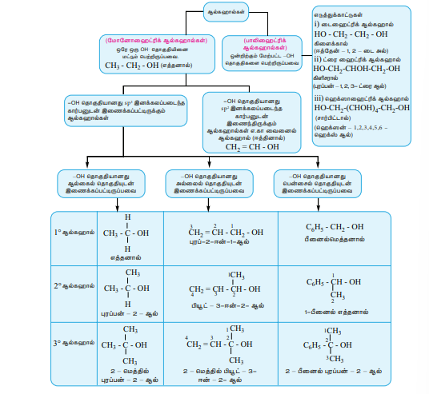

## 11.2 IUPAC பெயரிடும் முறை

IUPAC ன் பரிந்துரைகளின் அடிப்படையில் கரிமச் சேர்மங்களுக்கு எவ்வாறு பெயரிடுவது என நாம் பதினோறாம் வகுப்பில் ஏற்கனவே கற்றறிந்துள்ளோம். அம்முறையின் அடிப்படையில் ஆல்கஹால்களை பெயரிடுவதற்கான அடிப்படைய விதிகளை நினைவு கூர்வோம்.

1.  -OH தொகுதியைக் கொண்டுள்ள நீண்ட தொடர்ச்சியான கார்பன் சங்கிலியினைத் ( மூலவார்த்தை - root word ) தெரிவு செய்தல்.
2.  OH தொகுதியினைக் கொண்டுள்ள கார்பன் குறைவான எண்ணை பெரும் வகையில் நீண்ட சங்கிலி தொடரில் உள்ள கார்பன் அணுக்களுக்கு ஒரு முனையிலிருந்து மறு முனைக்கு எண் இடுதல்.
3.  பதிலிகளுக்கு (ஏதேனும் இருப்பின்) பெயரிடுதல்.
4.  ஆல்கஹாலுக்கு பின்வருமாறு பெயரிடுதல்.

பின்வரும் அட்டவணையில் ஆல்கஹால்களுக்கு IUPAC முறையில் பெயரிடுதல் விளக்கப்பட்டுள்ளது.

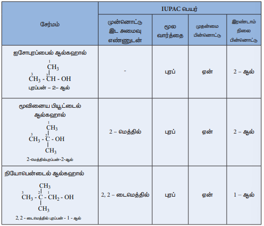
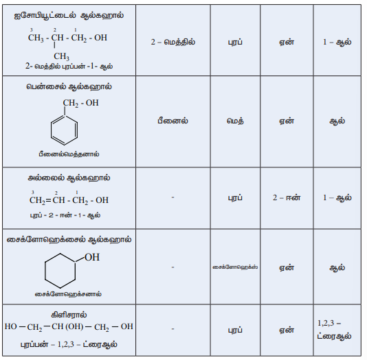

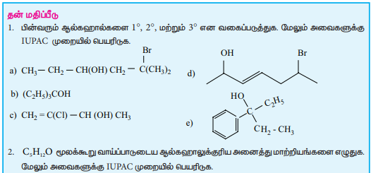

### ஆல்கஹால் வினைசெயல் தொகுதியின் அமைப்பு

\( sp^3 \) இனக்கலப்பைடந்த கார்பனுடன் இணைக்கப்பட்டுள்ள -OH தொகுதியின் அமைப்பானது நீர் மூலக்கூறில் ஹைட்ரஜனோடு இணைக்கப்பட்டுள்ள -OH தொகுதியின் அமைப்பினை ஒத்துள்ளது. அதாவது, V
வடிவத்தை பெற்றுள்ளது. ஆக்சிஜனின் ஒரு \( sp^3 \) இனக்கலப்பைடந்த ஆர்பிட்டால் கார்பனின் ஒரு \( sp^3 \) இனக்கலப்பைடந்த ஆர்பிட்டாலுடன் நேர்கோட்டில் மேற்பொருந்தி ஒரு C-O, \( \sigma \) பிணைப்பை ஏற்படுத்துகிறது. மேலும், ஆக்சிஜனின்  மற்றுமொரு இனக்கலப்பைடந்த ஆர்பிட்டால் ஹைட்ரஜனின் \( 1s \) ஆர்ப்பிட்டாலுடன் நேர்கோட்டில் மேற்பொருந்தி O-H \( \sigma \) பிணைப்பை ஏற்படுத்துகிறது. ஆக்சிஜனின் எஞ்சியுள்ள இரண்டு \( sp^3 \) இனக்கலப்பைடந்த ஆர்ப்பிட்டால்களில்  ஆக்சிஜனின்  தனித்த ஜோடி எலக்ட்ரான்கள் இடம் கொண்டுள்ளன. தனித்த இரட்டை – தனித்த இரட்டை விலக்கு விசையின் காரணமாக, மெத்தனாலின் C-O-H பிணைப்புக் கோணம் நான்முகியின் பிணைப்புக் கோணமான \( 109.5^\circ \) ல் இருந்து \( 108.9^\circ \) ஆக குறைந்து காணப்படுகிறது.

படம் \( sp^3 \) இனக்கல்ப்படைந்த கார்பன்

### ஆல்கஹால்களைத் தயாரித்தல்

நீர்த்த காரங்களுடன் ஆல்கைல் ஹாலைடுகளின் கருக்கவர் பொருள் பதிலீட்டு வினை, ஆல்கீனின் நீரேற்ற வினையின் மூலம் அதனை ஆல்கஹாலாக மாற்றுதல் மற்றும் கிரிக்னார்டு வினைப்பொருளை பயன்படுத்தி ஆல்கஹால்களைத் தயாரித்தல் ஆகிய வினைகளை நாம் ஏற்கனவே பதினோராம் வகுப்பில் கற்றிருந்தோம். அவ்வினைகளின் சுருக்கமான விளக்கம் பின்வருமாறு

#### 1. ஆல்கைல் ஹாலைடுகளிலிருந்து

ஆல்கைல் ஹாலைடுகளை நீர்த்த NaOH உடன் வெப்பப்படுத்தும் போது ஆல்கஹால்கள் உருவாகின்றன. ஓரிணைய ஆல்கைல் ஹாலைடுகள் \( S_N2 \) வினை வழிமுறையில் கருக்கவர் பொருள் பதிலீட்டு வினைக்கு உட்படுகின்றன. ஈரிணைய மற்றும் மூவிணைய ஆல்கைல் ஹாலைடுகள் வழக்கமாக \( S_N1 \) வினை வழிமுறையில் பதிலீட்டு வினைக்கு உட்படுகின்றன.

\[ R-X+NaOH(aq) \xrightarrow{\Delta} R-OH+NaX \]

R = t – பியூட்டைல், எனில் வினையானது t – பியூட்டைல் கார்பன் நேரயனி உருவாதல் வழிமுறையில் நிகழ்கிறது.

#### 2. ஆல்கீன்களிலிருந்து

ஆல்கீன்களின் இரட்டை பிணைப்பின் குறுக்கே, கந்தக அமிலத்தின் முன்னிலையில் நீர் மூலக்கூறு சேர்க்கை வினை புரிவதால் ஆல்கஹால்கள் உருவாகின்றன. இச்சேர்க்கை வினையானது மார்கானிகாஃப் வினையினை பின்பற்றி நிகழ்கிறது.

எடுத்துக்காட்டு:

\[ CH_3-CH=CH_2+H_2O \xrightarrow{H_2SO_4} CH_3-CH(OH)-CH_3 \]

(புரப்பிலீன்)        (புரப்பன் - 2 - ஆல்)

#### 3. கிரிக்னார்டு வினைப்பொருளிலிருந்து

ஆல்டிஹைடுகள் / கீட்டோன்களுடன் உலர் ஈதர் முன்னிலையில் கிரிக்னார்டு வினைப்பொருளினை கருக்கவர் பொருள் சேர்க்கை வினை புரியச் செய்து பின் அமில முன்னிலையில் நீராற் பகுக்கும் போது ஆல்கஹால்கள் உருவாகின்றன. ஃபார்மால்டிஹைடானது ஓரிணைய ஆல்கஹாலையும், மற்ற ஆல்டிஹைடுகள் ஈரிணைய ஆல்கஹாலையும், கீட்டோன்கள் மூவிணைய ஆல்கஹாலையும் தருகின்றன.

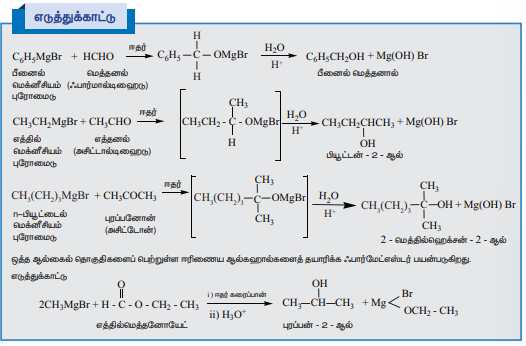

#### 4. ஹைட்ரோபோரோ ஏற்றம

டைபோரேன் ஆல்கீன்களுடன் வினைப்பட்டு ட்ரைஆல்கைல் போரேனைத் தருகிறது. இதனை மேலும், \( NaOH \) முன்னிலையில் \( H_2O_2 \) உடன் வினைப்படுத்த ஆல்கஹால் உருவாகிறது. ஒட்டுமொத்த வினையானது ஆல்கீனின் நீரேற்ற வினையாகும். இவ்வினையில் எதிர் மார்க்கோனிகாப் விளைபொருள் உருவாகிறது.
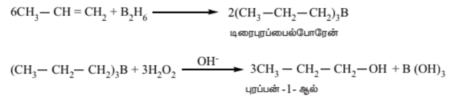

#### 5. கார்பனைல் சேர்மங்களை ஒடுக்குதல்

டெட்ராஹைட்ரோபியூரான் (THF) போன்ற கரைப்பான்களின் முன்னிலையில் ஆல்டிஹைடுகள் / கீட்டோன்களை \( LiAlH_4 \) கொண்டு ஒடுக்கமடையச் செய்து பின் நீராற்பகுக்க ஆல்கஹால்கள் உருவாகின்றன. ரானே  நிக்கல், \( Na-Hg/H_2O \) போன்ற பிற ஒடுக்கும் காரணிகளைப் போலன்றி லித்தியம் அலுமினியம் ஹைட்ரைடானது  கார்பனைல் சேர்மங்களில் காணப்படும் இரட்டைப்பிணைப்பினை ஒடுக்குவதில்லை. எனவே நிறைவுறா ஆல்கஹால்களைத் தயாரிக்க இது ஒரு சிறந்த ஒடுக்கும் காரணியாகும்.

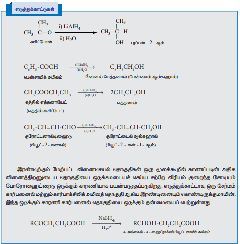

### கிளைக்காலைத் தயாரித்தல்

எத்திலீனை குளிர்ந்த காரம் கலந்த பொட்டாசியம் பெர்மாங்கனேட்டை (பேயரின் காரணி) பயன்படுத்தி ஹைட்ராக்சிலேற்றம் செய்யும் போது எத்திலின் கிளைக்கால் உருவாகிறது என நாம் ஏற்கனவே கற்றறிந்துள்ளோம்.

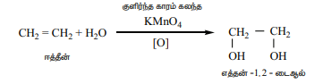

### கிளிசரால் தயாரித்தல்

பல்வேறு இயற்கை கொழுப்புகளில் கிளிசரால் காணப்படுகிறது. மேலும் இது நீண்ட சங்கிலி அமைப்பை உடைய உயர் கொழுப்பு அமிலங்களில் கிளிசரைல் எஸ்டர்களாக (ட்ரைகிளிசரைடு) காணப்படுகிறது. இந்த கொழுப்புகளை கார நீராற்பகுப்பிற்கு உட்படுத்தும் போது கிளிசரால் உருவாகிறது. இவ்வினை சோப்பாகுதல் வினை எனப்படும்.

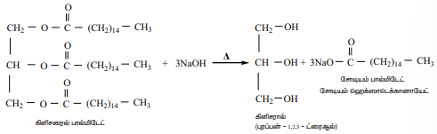

### தன் மதிப்பீடு

1.  \( LiAlH_4 \) ஐப் பயன்படுத்தி பென்ட் – 2 – ஈன் – 1 – ஆல் ஐத் தயாரிக்க உதவும் தகுந்த கார்பனைல் சேர்மத்தினை பரிந்துரைக்க.
2.  2 – மெத்தில் புரோப்பீன் \( H_2SO_4/H_2O \rightarrow \) ?
3.  பின்வருவனவற்றை கிரிக்னார்டு வினைப்பொருளைப் பயன்படுத்தி எவ்வாறு தயாரிப்பாய்?
    i) மூவிணைய – பியூட்டைல் ஆல்கஹால்
    ii) அல்லைல் ஆல்கஹால்

### ஓரிணைய, ஈரிணைய மற்றும் மூவிணைய ஆல்கஹால்களை வேறுபடுத்தி அறிதல்

\( 1^\circ, 2^\circ \) மற்றும் \( 3^\circ \) ஆல்கஹால்களை வேறுபடுத்தி அறிய பின்வரும் முறைகள் பயன்படுகின்றன.

#### அ) லூகாஸ் சோதனை

ஆல்கஹால்களை லூகாஸ் காரணியுடன் (அடர் \( HCl \) மற்றும் நீரற்ற \( ZnCl_2 \) கலவை) அறை வெப்பநிலையில் வினைப்படுத்தும் போது, மூவிணைய ஆல்கஹால்கள் உடனடியாக ஆல்கைல் ஹாலைடுகளைத் தருகின்றன. இது வினை நிகழ்வு ஊடகத்தில் கரையாத் தன்மையினைப் பெற்றிருப்பதால் உடனடியாக கலங்கல் தன்மை உருவாகிறது. ஈரிணைய ஆல்கஹால்கள் 5 முதல் 10 நிமிடங்களில் ஆல்கைல் குளோரைடைத் தருவதால் கலங்கல் தன்மை தாமதமாக ஏற்படுகிறது. ஆனால் அறை வெப்பநிலையில் ஓரிணைய ஆல்கஹால்கள் லூகாஸ் காரணியுடன் எவ்வித வினையிலும் ஈடுபடாததால் கலங்கல் தன்மையினைத் தருவதில்லை.

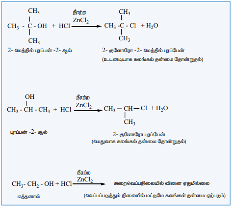

#### விக்டர் மேயர் சோதனை

வெவ்வேறு வகையான ஆல்கஹால்கள் உருவாக்கும் நைட்ரோ ஆல்கேன்கள், நைட்ரஸ் அமிலத்துடன் எத்தகைய வினைபுரியும் தன்மையைப் பெற்றுள்ளன என்பதனை அடிப்படையாகக் கொண்டது. மேலும் இம்முறை பின்வரும் படிநிலைகளை உள்ளடக்கியது.

i.  ஆல்கஹால்களை \( I_2/P \) உடன் வினைப்படுத்த ஆல்கைல் அயோடைடு உருவாக்குதல்

ii.  இவ்வாறு உருவான ஆல்கைல் அயோடைடை \( AgNO_2 \) உடன் வினைப்படுத்தி நைட்ரோ ஆல்கேன்களை உருவாக்குதல்.

iii. இறுதியாக நைட்ரோ ஆல்கேன்கள் \( HNO_2 \) உடன் (\( NaNO_2 / HCl \) கலவை) வினைப்படுத்தி பெறப்படும் வினைப்பொருளுடன் \( KOH \) சேர்க்கப்பட்டு கரைசல் காரத்தன்மை  பெறச் செய்தல்.

முடிவு

*   ஓரிணைய ஆல்கஹால்கள் சிவப்பு நிறத்தினைத் தருகின்றன.
*   ஈரிணைய ஆல்கஹால்கள் நீல நிறத்தைத் தருகின்றன.
*   மூவிணைய ஆல்கஹால்கள் எவ்வித நிறத்தையும் தருவதில்லை.

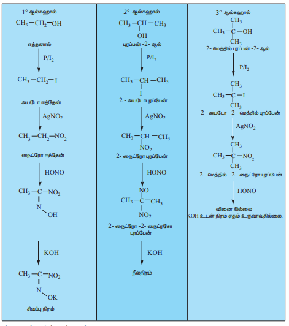

### ஆல்கஹால்களின் பண்புகள்

#### இயற்பண்புகள்

i.  குறைவான கார்பன் எண்ணிக்கை உடைய ஆல்கஹால்கள் நிறமற்ற நீர்மங்கள். மேலும் உயர் எண்ணிக்கையுடையவை மெழுகு போன்ற திண்மங்கள்.

ii. ஆல்கேன்கள், ஆல்டிஹைடுகள், எஸ்டர்கள் போன்ற பிற கரிமச் சேர்மங்களைக் காட்டிலும் இவை அதிகமான கொதிநிலையைப் பெற்றுள்ளன.
ஆல்கஹால்களில் மூலக்கூறுகளுக்கிடையே காணப்படும் ஹைட்ரஜன் பிணைப்பே இதற்கு காரணமாக அமைகின்றது.

iii. மாற்றிய ஆல்கஹால்களுக்கிடையே ஓரிணைய ஆல்கஹால்கள் அதிக கொதிநிலையையும்  மேலும் மூவிணைய ஆல்கஹால்கள் குறைவான கொதிநிலையையும் கொண்டுள்ளன.

iv. குறைவான கார்பன் அணுக்களின் எண்ணிக்கையைக் கொண்டுள்ள ஆல்கஹால்கள், நீருடன் ஹைட்ரஜன் பிணைப்பினை ஏற்படுத்தும் தன்மையினைப் பெற்றிருப்பதால் அவைகள் நீரில் அதிகம் கரையும் தன்மையினைக் கொண்டுள்ளன.

**அட்டவணை : ஆல்கஹால்களின் கொதிநிலை பிற கரிமச் சேர்மங்களுடன் ஒரு ஒப்பீடு**

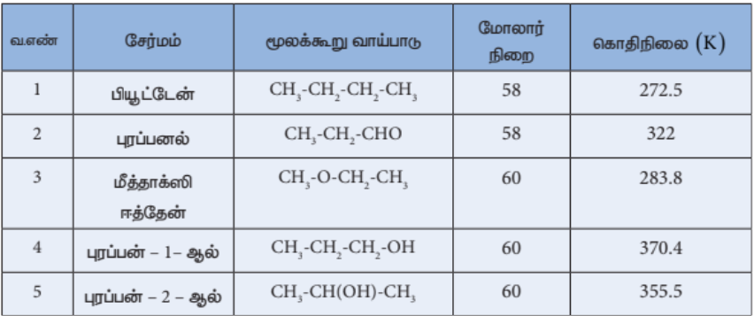

#### ஆல்கஹால்களின் வேதிப்பண்புகள்

#### i) ஆல்கஹால்களின் கருக்கவர் பொருள் பதிலீட்டு வினை

ஆல்கஹால்கள் வலிமையான காரத்தன்மையுடைய ( \( OH^- \) ) எனும் நீங்கும் தொகுதியைக்கொண்டுள்ளன. எனவே அமிலத்தை சேர்த்து -OH தொகுதியானது முதலில் \( -OH_2^+ \) ஆக மாற்றப்படுகிறது. புரோட்டானேற்றம் அடைந்த ஆல்கஹாலில் காணப்படும் \( -OH_2^+ \) தொகுதியை \( Br^- \) போன்ற கருக்கவர் பொருட்கள் எளிதாக பதிலீடு செய்து ஆல்கைல் ஹாலைடுகளைத் தருகின்றன.

எடுத்துக்காட்டு:

ஆல்கஹால்கள் ஹைட்ரோ ஹேலிக் அமிலங்களுடன் கருக்கவர் பதிலீட்டு வினைக்கு உட்பட்டு ஆல்கைல் ஹாலைடுகளைத் தருகின்றன. மூவிணைய ஆலகஹால்களைப் பொறுத்த வரையில்
வினை நிகழ வெப்பப்படுத்துதல் தேவைப்படுகிறத

$$\text{CH}_3-\text{CH}_2-\text{OH} \xrightarrow{\quad\text{HBr}\quad -\text{H}_2\text{O}\quad} \text{CH}_3-\text{CH}_2-\text{Br}$$$$\text{எத்தனால்} \qquad\qquad\qquad\qquad\qquad \text{புரோமோ ஈத்தேன்}$$

ஓரிணைய ஆல்கஹால்களிலிருந்து ஆல்கைல் ஹாலைடுகள் உருவாகும் வினை \( S_N2 \) வினை வழிமுறையைப் பின்பற்றுகிறது.

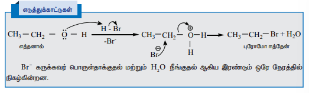
மூவிணைய ஆல்கஹால்களிலிருந்து ஆல்கைல் ஹாலைடுகள் உருவாகும் வினை \( S_N1 \) வினை வழிமுறையை பின்பற்றுகிறது.

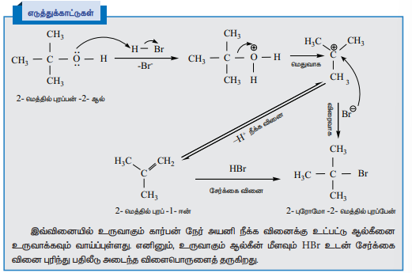

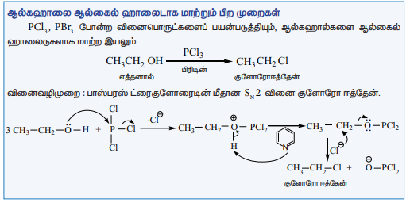

ஒரு ஆல்கஹால் ஆல்கைல்  ஹைலைடாக  மாற்றப்படுவதும் தயோனைல் குளோரைடைப் பயன்படுத்தி செயல்படுத்தப்படலாம்

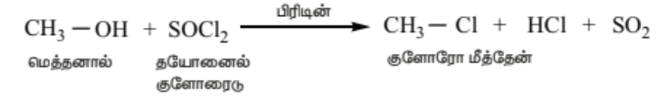

இவ்வினையும் $\text{S}_\text{N}\text{i}$ வினை வழிமுறையைப் பின்பற்றுகிறது.

##### ii) ஆல்கஹால்களின் நீக்க வினைகள்

ஆல்கஹால்களை, கந்தக அமிலம் போன்ற தகுந்த நீரகற்றும் வினைப்பொருளுடன் வினைப்படுத்தும் போது, அடுத்தடுத்த கார்பன்களில் முறையே காணப்படும் H மற்றும் OH ஆகியன இழக்கப்பட்ட கார்பன் – கார்பன் இரட்டைப் பிணைப்பு உருவாகிறது. பாஸ்பரிக் அமிலம், நீரற்ற \( ZnCl_2 \), அலுமினா முதலியனவும் நீரகற்றும் வினைப்பொருட்களாக பயன்படுகின்றன.

எடுத்துக்காட்டு:

\[ CH_3-CH_2-OH \xrightarrow[H_2SO_4]{443 K} CH_2=CH_2 + H_2O \]

**வினைவழிமுறை**

ஓரிணைய ஆல்கஹால்கள் \( E_2 \) வினை வழிமுறையினைப் பின்பற்றி நீரகற்றும் வினைக்கு உட்படுகின்றன.

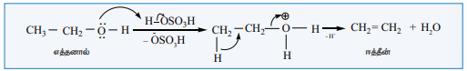

மூவிணைய ஆல்கஹால்கள் \( E_1 \) வினை வழிமுறையினைப் பின்பற்றி நீரகற்றம் அடைகின்றன. இவ்வினை வழிமுறையில் கார்பன் நேர் அயனி உருவாகிறது.

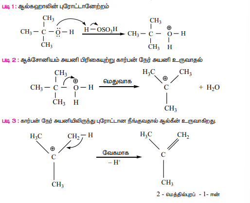

##### வினைத்திறனின் வரிசை

நீரகற்றும் வினையில், ஆல்கஹால்களின் ஒப்பீட்டு வினைத்திறன் வரிசை பின்வருமாறு 

ஓரிணைய < ஈரிணைய < மூவிணைய

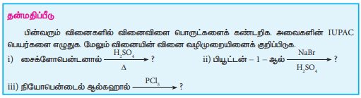

### செயிட்செவ் விதி
மூலக்கூறுகளுக்கிடையே நிகழும் நீர்கற்ற  வினைகளில் ஒன்றிற்கும் மேற்பட்ட வழிகளில் கார்பன் – கார்பன் இரட்டைப் பிணைப்பு உருவாக வாய்ப்பிருக்கும் எனில், அதிக அளவில் பதிலீடு அடைய வாய்ப்பிருக்குமானால், அதிக அளவில் பதிலீடு அடைந்த ஆல்கீன் அதாவது நிலைப்புத் தன்மையுடைய ஆல்கீன் முதன்மை விளைபொருளாக உருவாகிறது.

எடுத்துக்காட்டாக, 3,3 – டை மெத்தில் -2- பியூட்டனாலின்  நீரகற்றும் வினையில் ஆல்கீன்களின் கலவை உருவாகிறது. இவ்வினையில் உருவாகும் ஈரிணைய கார்பன் நேர் அயனி வடிவமைப்பு மாற்றத்திற்கு (Rearrangement) உட்பட்டு அதிக நிலைப்புத் தன்மை உடைய மூவிணைய கார்பன் நேர் அயனியைத் தருகிறது.
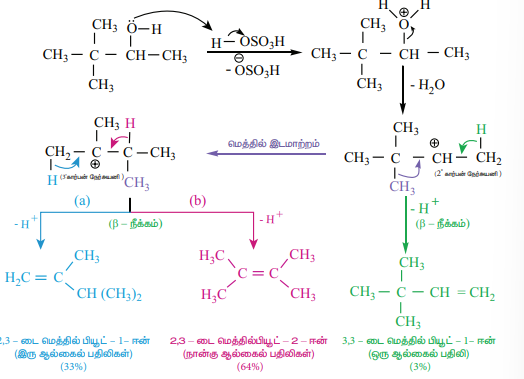

>### தன்மதிப்பீடு
>
>2,3-டைமெத்தில்பென்டன்-3-ஆல் ஆனது \( H_2SO_4 \) முன்னிலையில் வெப்பப்படுத்தும் போது உருவாகும் முதன்மை விளைபொருள் என்ன?

### iii) ஆல்கஹால்களின் ஆக்சிஜனேற்றம்

ஆல்கஹால்களின் முக்கியமான ஒரு வேதிவினை அவைகள் கார்பனைல் சேர்மங்களாக ஆக்சிஜனேற்றம் அடைவது ஆகும் அமிலம் கலந்த சோடியம் டைகுரோமேட் ஆனது வழக்கமாக ஆக்சிஜனேற்றியாகப் பயன்படுத்தப்படுகிறது. ஓரிணைய ஆல்கஹால்கள் ஆக்சிஜனேற்றம் அடைந்து ஆல்டிஹைடைத் தருகிறது. இது மேலும் ஆக்சிஜனேற்றம் அடைந்து கார்பாக்சிலிக் அமிலத்தினைத் தருகிறது. ஆல்டிஹைடுகள் / கீட்டோன்கள் உருவாகும் நிலையிலேயே ஆக்சிஜனேற்ற வினையை நிறைவு செய்ய, பிரிடினியம் குளோரோ குரோமேட் (PCC) யானது ஆக்சிஜனேற்றியாகப் பயன்படுத்தப்படுகிறது.

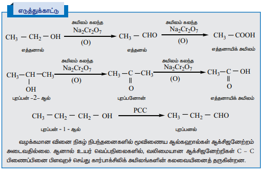

**ஸ்வர்ன் ஆக்சிஜனேற்றம்**

இம்முறையில், டைமெத்தில் சல்பாக்ஸைடு (DMSO) ஆனது ஆக்சிஜனேற்றியாகப் பயன்படுகிறது. இது ஆல்கஹால்களை ஆல்டிஹைடுகள் / கீட்டோன்களாக மாற்றமடையச் செய்கிறது. இம்முறையில், ஆல்கஹாலை DMSO மற்றும் ஆக்சலைல் குளோரைடுடன் வினைபுரியச் செய்து பின் ட்ரை எத்தில் அமினுடன் சேர்க்கை வினை நிகழ்த்தப்படுகிறது.

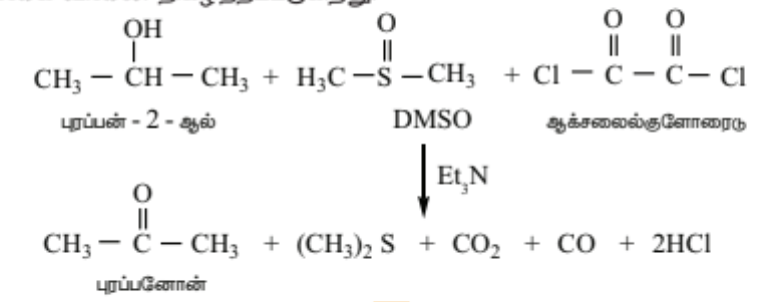

**உயிர் ஆக்சிஜனேற்றம்**

உயிரினங்கள் உட்கொள்ளும் உணவானது நொதிக்கப்படுவதால் ஆல்கஹால் உருவாகிறது. ஆல்கஹாலை நச்சு நீக்கம் செய்ய, கல்லீரலானது ஆல்கஹால் டீஹைட்ரோஜெனேஸ் (ADH) எனும் நொதியினை உற்பத்தி செய்கிறது. விலங்கினங்களில் காணப்படும் நிகோடினமைடு அடினைன் டைநியூக்ளியோடைடு (NAD) ஆக்சிஜனேற்றியாக செயல்படுகிறது. மேலும் ADH ஆனது நச்சுத் தன்மையுடைய ஆல்கஹாலை நச்சுத் தன்மையற்ற ஆல்டிஹைடுகளாக ஆக்சிஜனேற்றம் அடையச் செய்ய வினைவேகமாற்றியாக செயல்படுகிறது.

$$\text{CH}_3\text{CH}_2\text{OH} + \text{NAD}^+ \xrightarrow{\quad\text{ADH}\quad} \text{CH}_3\text{CHO} + \text{NADH} + \text{H}^+$$$$\text{எத்தனால்} \qquad\qquad\qquad\qquad\qquad\qquad\ \ \text{எத்தனல்}$$

**வினைவேக மாற்றியின் முன்னிலையில் ஹைட்ரஜன் நீக்கம்**

ஓரிணைய மற்றும் ஈரிணைய ஆல்கஹால்களின் ஆவியினை நன்கு வெப்பப்படுத்தப்பட்ட தாமிரத்தின் வழியே செலுத்தும் போது, ஹைட்ரஜன் நீக்கம் நடைபெற்று ஆல்டிஹைடுகள் அல்லது கீட்டோன்கள் உருவாகின்றன.

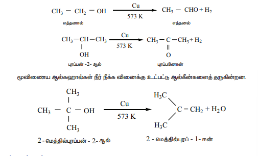

**எஸ்டராக்குதல்**

ஆல்கஹால் ஒரு அமிலத்தின் முன்னிலையில் கார்பாக்சிலிக் அமிலங்களுடன் வினைபுரிந்து எஸ்டர்களைக் கொடுக்கும்.

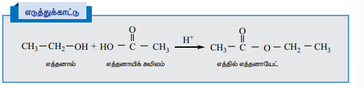

### கிளைக்காலின் வினைகள்

எத்திலீன் கிளைக்கால் இரு ஓரிணைய ஆல்கஹால் தொகுதிகளைக் கொண்டுள்ளது. மேலும் இது ஹைட்ராக்சில் தொகுதியின் வழக்கமான வினைகளில் ஈடுபடுகிறது. மற்ற பிற ஓரிணைய ஆல்கஹால்களைப் போன்று இது உலோக சோடியத்துடன் வினைபுரிந்து மோனோ சோடியம் கிளைக்கோலேட் மற்றும் டைசோடியம் கிளைக்கோலேட் ஆகியனவற்றைத் தருகிறது.

ஹேலிக் அமிலங்கள் அல்லது \( PCl_5 / PCl_3 / SOCl_2 \). ஆகியனவற்றுடன் கிளைக்காலை வினைபடுத்த ஹைட்ராக்சில் தொகுதியினை ஹாலைடு தொகுதியாக மாற்றலாம்.

எத்திலீன் கிளைக்காலை HI அல்லது \( P/I_2 \), உடன் வினைப்படுத்தும் போது 1,2 – டை அயோடோ ஈத்தேன் முதலில் உருவாகிறது. இது சிதைவடைந்து ஈத்தினைத் தருகிறது.

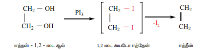

அடர் கந்தக அமிலத்தின் முன்னிலையில் அடர் \( HNO_3 \) உடன் வெப்பப்படுத்தும் போது, எத்திலீன் கிளைக்கால் டை நைட்ரோ கிளைக்காலைத் தருகிறது.

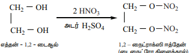

**நீரகற்றும் வினைகள்**

எத்திலீன் கிளைக்கால் பல்வேறு நிபந்தனைகளில் நீரகற்றும் வினைக்கு உட்பட்டு வெவ்வேறு விளைபொருட்களைத் தருகிறது.

1.  773K வெப்பநிலைக்கு வெப்பப்படுத்த, இது ஈப்பாக்சைடைத் தருகிறது.

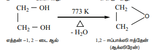

2.  நீர்த்த கந்தக அமிலம் அல்லது நீரற்ற \( ZnCl_2 \) அதிக அழுத்தத்தில் மூடப்பட்ட குழாயில் வெப்பப்படுத்தும் போது அசிட்டால்டிஹைடு உருவாகிறது.

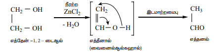

3.  அடர் \( H_2SO_4 \) உடன் வாலைவடிக்கும் போது, கிளைக்கால் டை ஆக்சேனைத் தருகிறது.

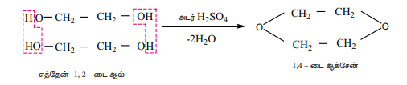

**கிளைக்காலின் ஆக்சிஜனேற்றம்**

ஆக்சிஜனேற்றியின்  தன்மை மற்றும் வினை நிகழ் நிபந்தனைகளைப் ஆக்சிஜனேற்றத்தில் கிளைக்கால் பல்வேறு விளைபொருட்களைத் தருகிறது.

i)  நைட்ரிக் அமிலம் (அல்லது) காரம் கலந்த பொட்டாசியம் பெர்மாங்கனேட்டை ஆக்சிஜனேற்றியாக பயன்படுத்தும் போது பின்வரும் வினைபொருட்கள் உருவாகின்றன

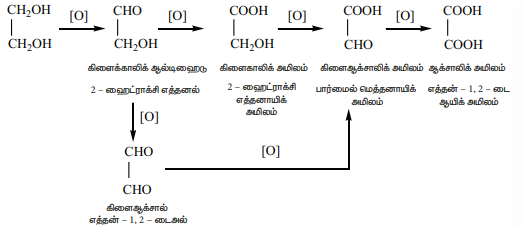

ii) **பெர்அயோடிக் அமிலத்துடன் ஆக்சிஜனேற்றம்**

எத்திலீன் கிளைக்காலை பெர்அயோடிக் அமிலத்துடன் வினைபுரியச் செய்யும் போது பார்மால்டிஹைடைத் தருகிறது.

இவ்வினையானது விசினல் 1,2 –டை ஆல்களுக்கான தேர்ந்தெடுக்கப்பட்ட ஒரு குறிப்பிட்ட விளைப்பொருளைத் தரும் வினையாகும். இவ்வினையானது வளைய பெர்அயோடேட் எஸ்டர் இடைநிலை உருவாதல் வழி நிகழ்கிறது.

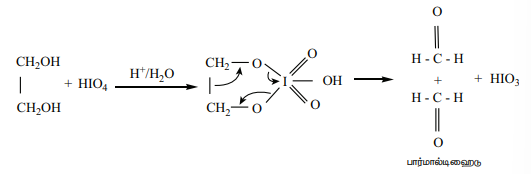

### கிளிசராலின் வேதிவினைகள்

**நைட்ரோ ஏற்றம்** : கிளிசரால், கந்தக அமிலத்தின் முன்னிலையில் நைட்ரிக் அமிலத்துடன் வினைபுரிந்து TNG (ட்ரைநைட்ரோகிளிசரின்) தருகிறது.

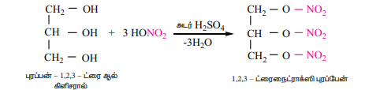

**நீர் நீக்கம்**

கிளிசராலை அடர் \( H_2SO_4, KHSO_4 \) போன்ற நீர் நீக்கும் வினைப்பொருளுடன் வினைப்படுத்தும் போது இது நீர் நீக்க வினைக்கு உட்பட்டு அக்ரோலினைத் தருகிறது.

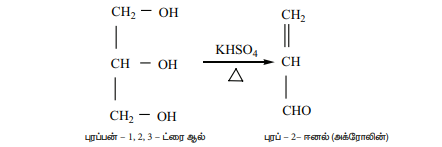

**ஆக்சிஜனேற்றம**

ஆக்சிஜனேற்றத்திற்க பயன்படுத்தப்படும் ஆக்சிஜனேற்றியைப் பொருத்து கிளிசரால் வெவ்வேறு ஆக்சிஜனேற்ற விளைபொருட்களைத் தருகிறது.

கிளிசரால் ஆனது.

அ) நீர்த்த \( HNO_3 \) உடன் கிளிசரிக் அமிலம் மற்றும் டார்ட்ரோனிக் அமிலம் கிடைக்கிறது.

ஆ) அடர் \( HNO_3 \) உடன்  ஆக்சிஜனேற்ற்ம்  செய்யும் போது முக்கியமாக கிளிசரிக் அமிலம் உருவாகிறது.

இ) பிஸ்மத்நைட்ரேட் உடன் ஆக்சிஜனேற்றம செய்யும் போது  மீசோ ஆக்சாலிக் அமிலம் உருவாகிறது.

ஈ) \( Br_2/H_2O \) அல்லது \( NaOBr \) (அல்லது)  பென்டான்  வினைப்பொருள் \( FeSO_4 + H_2O_2 \) ஆகியனவற்றுள் ஒன்றை ஆக்சிஜனேற்றியாக பயன்படுத்தும் போது கிளிசரால்டிஹைடு மற்றும் டைஹைட்ராக்சி அசிட்டோன் ஆகிய   விளைபொருட்களின் கலவை உருவாகிறது. இந்த கலவையின் பெயர் கிளிசரோஸ்.

உ) \( HIO_4 \) அல்லது LTA (லெட் டெட்ரா அசிடேட்) உடன் ஆக்சிஜனேற்றம்  செய்யும் போது பார்மால்டிஹைடு மற்றும் பார்மிக் அமிலம் உருவாகிறது.

ஊ) அமிலம் கலந்த \( KMnO_4 \) ஐ பயன்படுத்தி ஆக்ஸிஜனேற்றம் அடையச் செய்யும் போது கிளிசரால்  ஆக்சாலிக் அமிலத்தை தருகிறது.

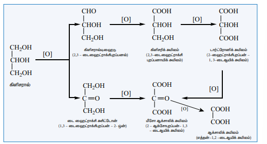

### ஆல்கஹால்களின் பயன்கள்

**மெத்தனாலின் பயன்கள்**

1.  பெயிண்டுகள், வார்னிஷ்கள், ஷெல்லாக், பசை, சிமெண்ட் போன்றவற்றிற்கு மெத்தனால் கரைப்பானாகப் பயன்படுகிறது.
2.  சாயங்கள், மருந்துப் பொருட்கள், வாசனை திரவியங்கள் மற்றும் பார்மால்டிஹைடு ஆகியன தயாரிப்பில் பயன்படுகிறது.

**எத்தனாலின் பயன்கள்**

1.  எத்தனால் பெயின்டுகள் மற்றும் வார்னிஷ் தயாரிப்பில் பயன்படுகிறது. மேலும் ஈதர், குளோரோபார்ம், அயடோபார்ம், சாயங்கள், ஊடுருவும் சோப்புகள் ஆகியனவற்றின் தயாரிப்பில் பயன்படுகிறது.
2.  திறன்மிகு ஆல்கஹால் என்ற பெயரில் ஆகாய விமானங்களில் எரிபொருளாகப் பெட்ரோலுக்கு மாற்றாக பயன்படுகிறது.
3.  உயிர்பொருள் மாதிரிகளுக்கு பதப்படுத்தும் பொருளாகப் பயன்படுகிறது.

**எத்திலீன் கிளைக்காலின் பயன்கள்**

1.  தானியங்கி இயந்திரங்களின் ரேடியேட்டர்களில் உறை எதிர்பொருளாகப் பயன்படுகிறது.
2.  TNG உடன் சேர்த்து இதன் நைட்ரேட் வெடி பொருளாகப் பயன்படுகிறது.

**கிளிசராலின் பயன்கள்**

1.  திண்பண்டங்கள் மற்றும் பானங்கள் தயாரிப்பில் இனிப்பு சுவையூட்டியாக கிளிசரால் பயன்படுகிறது.
2.  அழகு சாதனப் பொருட்கள் மற்றும் ஒளி ஊடுருவும் சோப்புகள் தயாரிப்பில் இது பயன்படுகிறது.
3.  மை மற்றும்  மை உறிஞ்சும் முத்திரை திண்டு ஆகியன தயாரிப்பிலும் கடிகாரங்களில் உயவுப் பொருளாகவும் பயன்படுகிறது.
4.  டைனமைட், கார்டைட் போன்ற வெடிபொருட்கள் தயாரிப்பில் இது சைனா களிமண்ணுடன் கலந்து பயன்படுத்தப்படுகிறது.

### ஆல்கஹால்களின் அமிலத் தன்மை

ப்ரான்ஸ்டட் கொள்கைப்படி, அமிலம் என்பது புரோட்டான் வழங்கியாகும். மேலும் புரோட்டானை வழங்கும் அதன் திறன் அமில வலிமையாகும். ஆல்கஹால்கள், நீருடன் ஒப்பிடத்தக்க அளவில் வலிமை குறைவான அமிலமாகும். மெத்தனாலைத் தவிர பிற அனைத்து ஆல்கஹால்களும் நீரைவிட வலிமை குறைந்தவை. நீரின் \( K_a \) மதிப்பு \( 1.8 \times 10^{-16} \) ஆனால் ஆல்கஹால்களின் \( K_a \) மதிப்பானது \( 10^{-18} \) முதல் \( 10^{-16} \) என்ற அளவில் இருக்கும்.

ஆல்கஹால்கள் சோடியம், அலுமினியம் போன்ற வினைத்திறன் மிக்க உலோகங்களுடன் வினைபுரிந்து ஆல்காக்சைடுகளைத் தருகின்றன. மேலும் இவ்வினையில் ஹைட்ரஜன் வாயு வெளியேறுகிறது. ஆனால், ஆல்கஹால்கள் \( NaOH \) உடன் வினைபுரிந்து ஆல்காக்சைடுகளைத் தருவதில்லை.

\[ 2C_2H_5-OH + 2Na \rightarrow 2C_2H_5ONa + H_2 \uparrow \]

மேற்கண்டுள்ள வினை ஆல்கஹால்களின் அமிலத் தன்மையை விளக்குகிறது.

#### 1°, 2° மற்றும் 3° ஆல்கஹால்களின் அமிலத் தன்மையை ஒப்பிடுதல்

ஆல்கஹால்களின் அமிலத்தன்மைக்கு அதன் O-H தொகுதியின் முனைவுத் தன்மையுடைய பிணைப்பு காரணமாக அமைகிறது. OH தொகுதி பிணைக்கப்பட்டுள்ள கார்பனுடன், எலக்ட்ரானை தன்னை நோக்கி கவரும் இயல்புடைய -Cl, -F போன்ற -I தொகுதிகள் இணைக்கப்பட்டிருப்பின் அத்தகைய தொகுதிகள் எலக்ட்ரான் அடர்த்தியை தம்மை நோக்கி கவர்வதன் மூலம் புரோட்டான் வழங்குதலை சாதகமாக்குகின்றன. மாறாக, ஆல்கைல் தொகுதி போன்ற எலக்ட்ரானை விருவிக்கும் இயல்புடைய +I தொகுதிகள், ஆக்ஸிஜன் மீதான எலக்ட்ரான் அடர்வினை அதிகரிக்கின்றன மேலும், O - H பிணைப்பின் முனைவுத் தன்மையினை குறைக்கின்றன. எனவே, இதன் விளைவாக அமிலத்தன்மை குறைகிறது.

ஓரிணைய, ஈரிணைய மற்றும் மூவிணைய ஆல்கஹால்களை ஒப்பிடும் போது -OH தொகுதி இடம் பெற்றுள்ள கார்பனுடன் இணைக்கப்பட்டுள்ள ஆல்கைல் தொகுதிகளின் எண்ணிக்கை மூவிணைய ஆல்கஹாலில் அதிகம். இதன் விளைவாக அமிலத்தன்மை பின்வரும் வரிசையில் அமைகிறது.

\[ 1^\circ \text{ ஆல்கஹால்கள்} > 2^\circ \text{ ஆல்கஹால்} > 3^\circ \text{ ஆல்கஹால்} \]

ஆல்கஹால்கள்  பிரான்ஸ்டட்  காரமாகவும் செயல்பட இயலும். -OH தொகுதியின் ஆக்ஸிஜன் தனித்த பிணைப்பில் ஈடுபடாத எலக்ட்ரான் இரட்டைகளைக் கொண்டிருப்பதன் காரணமாக புரோட்டானை ஏற்கும் இயல்பினைப் பெற்றுள்ளது.

### பீனால்களின் அமிலத்தன்மை

அலிபாட்டிக் ஆல்கஹால்களைக் காட்டிலும் பீனால் அதிக அமிலத்தன்மை உடையது. ஆல்கஹாலைப் போலன்றி \( NaOH \) உடன் வினைப்பட்டு சோடியம் பீனாக்சைடைத் தருகிறது. இவ்வினை பீனாலின் அமிலத்தன்மையை விளக்குகிறது. பீனாலின் நீர்க்கரைசலைக் கருதுவோம், அதில் பின்வரும் சமநிலை நிலவுகிறது.

\[ C_6H_5-OH + H_2O \rightleftharpoons C_6H_5-O^- + H_3O^+ \]

மேற்கண்டுள்ள சமநிலைக்கு, \( 25^\circ C \) ல் \( K_a \) ன் மதிப்பு \( 1 \times 10^{-10} \) ஆகும். இதிலிருந்து  பீனாலானது ஆல்கஹாலை விட அதிக அமிலத்தன்மை பெற்றுள்ளதை அறியலாம். இவ்வாறான பீனாலின் அதிக அமிலத்தன்மையினை பீனாக்சைடு அயனியின் நிலைப்புத் தன்மையின் மூலம்  விளக்கலாம். உடனிசைவினால் பீனாக்சைடு அயனியானது, பீனாலைக் காட்டிலும் அதிக நிலைப்புத் தன்மையைப் பெறுகிறது என நாம் ஏற்கனவே பதினோராம் வகுப்பில் கற்றறிந்துள்ளோம்.

பதிலிகளைப் பெற்றுள்ள பீனால்களில், \( -NO_2, -Cl \) போன்ற எலக்ட்ரான் கவர் தொகுதிகள் குறிப்பாக இத்தொகுதிகள் ஆர்த்தோ மற்றும் பாரா நிலைகளில் காணப்படும் போது, அத்தகைய பதிலிகளை உடைய பீனால்கள், பீனாலைக்காட்டிலும் அதிக அமிலத் தன்மையைப் பெறுகின்றன.

**அட்டவணை: சில ஆல்கஹால் மற்றும் பினோல்களின் \( pK_a \) மதிப்பு**

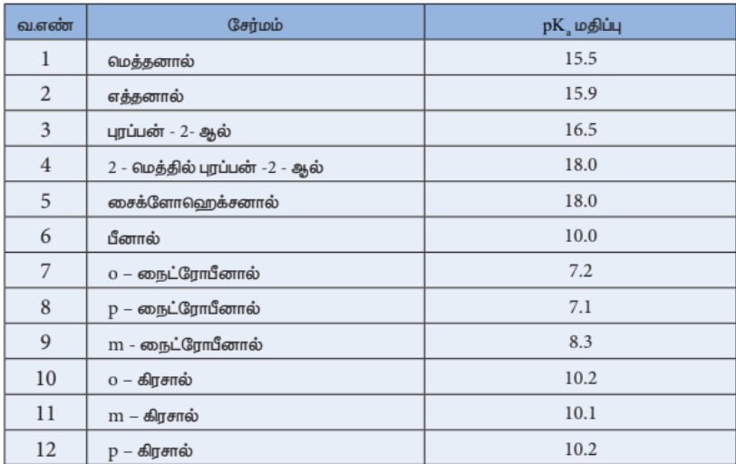

## பீனால்கள்

பென்சீனில் -OH தொகுதியை நேரடியாக பெற்றுள்ள கரிம சேர்மங்கள் பீனால்கள் என அழைக்கப்படுகிறது. -OH தொகுதியை கொண்டுள்ள கார்பன் அணு sp² இனக்கலப்பினமாதலை பெற்றுள்ளது.

## அட்டவணை : பீனால்கள் வகைப்பாரு

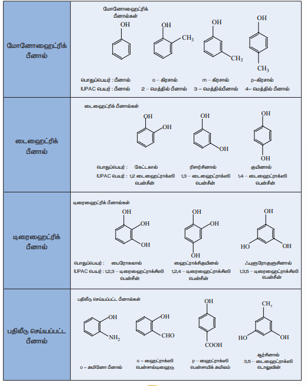

### பீனால்களின் தயாரிப்பு முறைகள்

#### அ) ஹேலோ அரீனில் இருந்து (டவ் முறை)

300 வளிமண்டல அழுத்தம் மற்றும் 633K வெப்பநிலை கொண்ட மூடிய கலனில் வைத்து குளோரோ பென்சீனை \( 6–8\% NaOH \) கொண்டு நீராற்பகுக்கும் போது முதலில் சோடியம் பீனாக்ஸைடு கிடைக்கிறது. இதனை நீர்த்த \( HCl \) கொண்டு வினைப்படுத்த பீனால் கிடைக்கிறது.

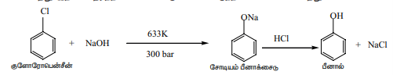

#### ஆ) பென்சீன் சல்போனிக் அமிலத்தில் இருந்து

பென்சீனை ஒலியம் கொண்டு சல்போனேற்றம் செய்யும் போது பென்சீன் சல்போனிக் அமிலம் கிடைக்கிறது. இதனை 623K வெப்பநிலையில் \( NaOH \) கொண்டு வெப்பப்படுத்தும் போது உருவாகும் சோடியம் பீனாக்ஸைடு சேர்மத்தை அமிலமாக்கலுக்கு உட்படுத்தும் போது பீனால் கிடைக்கிறது.

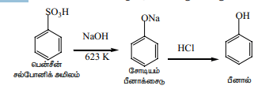

#### இ) அனிலினில் இருந்து

அனிலினை 273 – 278K வெப்பநிலையில் நைட்ரஸ் அமிலத்துடன் (\( NaNO_2+HCl \)) டயசோ ஆக்கலுக்கு உட்படுத்தும் போது முதலில் பென்சீன் டயசோனியம் குளோரைடு கிடைக்கிறது. இதனை கனிம அமில முன்னிலையில் சூடான நீருடன் வினைப்படுத்தும் போது பீனால் கிடைக்கிறது.

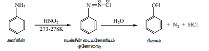

#### ஈ) கியூமினில் இருந்து

523K வெப்பநிலையில் \( H_3PO_4 \) வினையூக்கி முன்னிலையில் ஒரு மூடிய கலனில் பென்சீன் மற்றும் புரோப்பீன் கலந்த கலவையை வெப்பப்படுத்தும் போது கியூமின் (ஐசோரோப்பைல் பென்சீன்) கிடைக்கிறது. கியூமின் மற்றும் 5% நீரிய சோடியம் கார்பனேட் கரைசலுடன் காற்றை செலுத்தும் போது ஆக்ஸிஜனேற்றமடைந்து கியூமின் ஹைட்ரோபெராக்ஸைடு கிடைக்கிறது. இதனை நீத்த அமிலத்துடன் வினைப்படுத்தும் போது பீனால் மற்றும் அசிட்டோன் கிடைக்கிறது. அசிட்டோன் இவ்வினையில் முக்கிய துணை வினைப்பொருளாக கிடைக்கிறது.

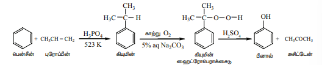

### இயற்பியல் பண்புகள்

பீனால்கள் நிறமற்ற, ஊசி வடிவமுடைய படிகம். இது நீர் உறிஞ்சும் தன்மை, அரிக்கும் தன்மை மற்றும்  விஷத் தன்மை கொண்டதாகவும் உள்ளது. காற்று மற்றும் ஒளி பீனாலின் மீது படும் போது இளஞ்சிவப்பு நிறமாக மாறும். எளிய பீனால்கள் நீர்மமாகவும் அல்லது குறைந்த உருகுநிலை கொண்ட திண்மங்களாகவும் உள்ளன. இவை மிக அதிக கொதிநிலைகளைக் கொண்டுள்ளன. பீனாலில் ஹைட்ரஜன் பிணைப்பு இருப்பதால் நீரில் குறைந்த அளவு கரைகிறது. இருப்பினும் பதிலீடு செய்யப்பட்ட பீனால்கள் நீரில் கரைவதில்லை.

### **வேதிப்பண்புகள்**

 -OH தொகுதிக்கான வினைகள்

##### **அ) Zn தூளுடன் வினை**

பீனால் Zn தூளுடன் வினைப்படுத்தும் போது பென்சீன் கிடைக்கிறது. இவ்வினையில் அரோமாட்டிக் வளையத்தில் உள்ள -OH தொகுதி நீக்கப்படுகிறது.

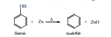

##### **ஆ) அம்மோனியாவுடன் வினை**

நீரற்ற \( ZnCl_2 \) முன்னிலையில் பீனால் அம்மோனியாவுடன் வினைப்பட்டு  அனிலீனை  தருகிறது.

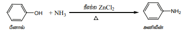

##### **இ) எஸ்டர் உருவாதல்**

**ஸ்காட்டன் – பௌமன் வினை**

பீனால் அமிலக்குளோரைடுடன் வினைப்பட்டு எஸ்டர்களை தருகிறது. பீனாலின் அசிடைலேற்ற மற்றும் பென்சாயிலேற்ற வினைகளுக்கு ஸ்காட்டன் பௌமன் வினை என்று பெயர்.

$$\text{C}_6\text{H}_5\text{OH} + \text{CH}_3\text{COCl} \xrightarrow{\quad\frac{\text{NaOH}}{\text{Py}}\quad} \text{CH}_3-\text{COOC}_6\text{H}_5 + \text{HCl}$$

$$\text{பீனால்} \qquad \text{அசிட்டைல் குளோரைடு} \qquad\quad \text{பினைல் எத்தனோயேட்}$$

$$\text{C}_6\text{H}_5\text{OH} + \text{C}_6\text{H}_5\text{COCl} \xrightarrow{\quad\frac{\text{NaOH}}{\text{Py}}\quad} \text{C}_6\text{H}_5-\text{COOC}_6\text{H}_5 + \text{HCl}$$

$$\text{பீனால்} \qquad\qquad \text{பென்சோயில் குளோரைடு} \qquad\qquad\quad \text{பினைல் பென்சோயேட்}$$

##### **ஈ) ஈதர்கள் உருவாதல்**

**வில்லியம்சன் ஈதர் தொகுப்பு வினை**

பீனாலின் காரக்கரைசல் ஆல்கைல் ஹாலைடுகளுடன் வினைப்பட்டு ஈதர்கள் தருகிறது. ஆல்கைல் ஹேலைடு காரமுன்னிலையில் பீனாக்ஸைடு அயனியால் கருகவர் பதிலீட்டு வினைகளுக்கு உட்படுகிறது.

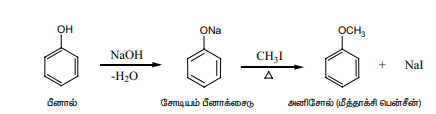

#####  **உ) ஆக்சிஜனேற்றம் :**

பீனால், அடர் $\text{H}_2\text{SO}_4$ அமிலம்கலந்த $\text{K}_2\text{Cr}_2\text{O}_7$ முன்னிலையில் காற்றில் ஆக்சிஜனேற்றம்  அடைந்து 1,4 பென்சோகுயினோன் சேர்மத்தினை தரும்.

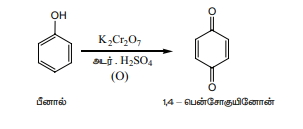

##### **ஊ) ஒடுக்கம்**

பீனாலை வினையூக்கி முன்னிலையில் ஹைட்ரஜன் ஏற்றம் செய்யும் போது வளைய ஹெக்சனால் கிடைக்கிறது.

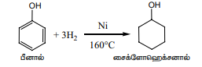

#### பென்சீன் வளையத்திற்கான வினைகள்

**எலக்ட்ரான் கவர் அரோமேட்டிக் பதிலீட்டு வினைகள்**

-\( \ddot{O}H \), -\( \ddot{N}H_2 \), etc., போன்ற தொகுதிகள் பென்சீன் வளையத்தின் நேரடியாக இடம் பெற்றிருக்கும் போது அவைகள் பென்சீன் வளையத்தை கிளர்வுறுத்துவதால் வரக்கூடிய எலக்ட்ரான் கவர் பொருள்கள் ஆர்த்தோ மற்றும் பாரா இடத்தை ஆக்கிரமித்துக் கொள்கின்றன என்பதை பதினொராம் வகுப்பில் படித்துள்ளோம்.

**பொதுவான எலக்ட்ரான் கவர் அரோமேட்டிக் பதிலீட்டு வினைகள்**

##### i) **நைட்ரசோ ஏற்றம்**

குறைந்த வெப்பநிலையில் பீனால் \( HNO_2 \) உடன் எளியதாக நைட்ரசோ ஏற்றம் அடைகிறது.

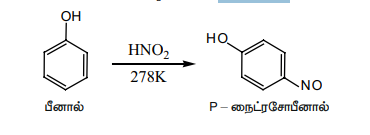

##### ii) **நைட்ரோ ஏற்றம்**

பீனால் அறை வெப்பநிலையில் 20% நைட்ரிக் அமிலத்துடன் வினைப்பட்டு ஆர்த்தோ மற்றும் பாரா நைட்ரோ பீனால் கலவையை தருகிறது.

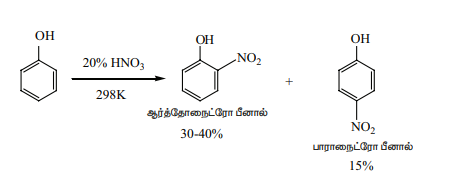

ஆர்த்தோ மற்றும் பாரா மாற்றியங்கள் நீராவியால் காய்ச்சி வடித்தல் மூலம் பிரித்தெடுக்கப்படுகிறது. ஆர்த்தோ நைட்ரோ பீனாலில் மூலக்கூறினுள் நிகழும் ஹைட்ரஜன் பிணைப்பு இருப்பதால் நீரில் கரையும் திறன் குறைவாகவும் எளிதில் ஆவியாகும் தன்மையுடையதாகவும் உள்ளது. மாறாக பாரா நைட்ரோ பீனாலில் மூலக்கூறுகளுக்கு இடைப்பட்ட ஹைட்ரஜன் பிணைப்பு காணப்படுவதால் நீரில் எளிதில் கரையும் தன்மையும், குறைந்த ஆவியாகும் தன்மையும் கொண்டதாக உள்ளது.

அடர் HNO₃ + அடர் H₂SO₄ உடன் பீனால் நைட்ரோ ஏற்றும் அடைந்து பிக்ரிக் அமிலத்தை தருகிறது.

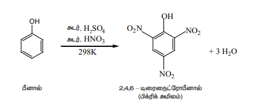

##### iii) **சல்போனேற்றம்**

280K வெப்பநிலையில் பீனால் அடர் அடர் \( H_2SO_4 \) உடன் வினைப்பட்டு O – பீனால் சல்போனிக் அமிலம் முக்கிய விளைபொருளாக கிடைக்கிறது. மாறாக 373K வெப்பநிலையில் p – பீனால் சல்போனிக் அமிலம் முக்கிய விளை பொருளாக கிடைக்கிறது.

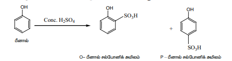

##### iv) **ஹேலஜனேற்றம்**

பீனால் புரோமின் நீருடன் வினைப்பட்டு 2,4,6 டிரை புரோமோ பீனால் எனும் வெண்மை நிற வீழ்படிவை தருகிறது.

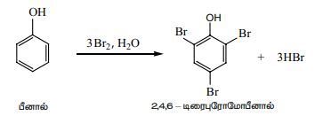

278K வெப்பநிலையில் \( CS_2 \) அல்லது \( CCl_4 \) உடன் இவ்வினை நிகழ்த்தப்பட்டால் ஆர்த்தோ மற்றும் பாரா புரோமோ பீனால் கலவை கிடைக்கிறது.

##### v) **கோல்ப் (அல்லது)  கோல்ப்ஸ்கிமிட்  வினை**

இவ்வினையில் பீனால் முதலில் சோடியம் பீனாக்ஸைடாக மாற்றப்படுகிறது. இது பீனாலை விட \( CO_2 \) உடன் எலக்ட்ரான் கவர் பதிலீட்டு வேகமாக வினைபடுகிறது.  400K வெப்பநிலை மற்றும் 4–7 வளிமண்டல அழுத்தத்தில் சோடியம் பீனாக்ஸைடை  அமில நீராற்பகுப்பிற்கு உட்படுத்தும்போது சாலிசிலிக் அமிலம் கிடைக்கிறது.

##### vi) **ரீமர் – டீமன் வினை**

\( CHCl_3/NaOH \), முன்னிலையில் ஒரு -CHO உடன் பீனால் வினைப்படும் போது ஆர்த்தோ இடத்தில் –CHO தொகுதி இடம் பெறுகிறது. இவ்வினையானது பதிலீடு செய்யப்பட்ட பென்சால் குளோரைடு எனும் இடைநிலை பொருள் மூலமாக நடைபெறுகிறது.

##### vii) **பீனால்ப்தலின் வினை**

அடர் \( H_2SO_4 \) முன்னிலையில் பீனால் தாலிக் நீரிலியுடன் வினைப்பட்டு பீனால்ப்தலின் கிடைக்கிறது.

##### viii) **இணைப்பு வினை**

காரம் கலந்த பென்சீன் டயசோனியம் குளோரைடுடன் பீனால் இணைந்து p-ஹைட்ராக்ஸி அசோபென்சீன் (ஆரஞ்சு சிவப்பு நிற சாயம்) கிடைக்கிறது.

### ஆல்கஹால் மற்றும் பீனால்களை வேறுபடுத்தி அறியும் சோதனைகள்

i)  பென்சீன் டயசோனியம் குளோரைடுடன் ஆரஞ்சு சிவப்பு நிற சாயம் கிடைக்கிறது.  மாறாக எத்தனால் தருவதில்லை.

ii) நடுநிலை \( FeCl_3 \) உடன் பீனால் கரு ஊதா நிறத்தை தருகிறது. ஆனால் ஆல்கஹால்கள் தருவதில்லை.

iii) பீனால் \( NaOH \) உடன் சோடியம் பீனாக்ஸைடை தருகிறது. ஆனால் எத்தனால் \( NaOH \) உடன் வினைபடுவதில்லை.

### பீனாலின் பயன்கள்

1.  உலகில் உற்பத்தியாகும் பாதியளவு பீனால்கள் பீனால்-பார்மால்டிஹைடு (பேக்கலைட்) பிசின் தயாரிக்கப்பயன்படுகிறது.
2.  கீழ்கண்ட பொருட்கள் தயாரிக்க பீனால்கள் துவக்கப்பொருளாக பயன்படுகிறது.
   
    i) பினசெடின், சலால், ஆஸ்பிரின் போன்ற மருந்துகளுக்கு
   
    ii) பீனால்ப்தலின் நிறங்காட்டி தயாரிக்க
   
    iii) பிக்ரிக் அமிலம் எனும் வெடி மருந்து தயாரிக்க
3.  கார்பாலிக் சோப்புகள் மற்றும் புரைத்தடுக்கும் கார்பாலிக் கிரிம்களில்  பயன்படுகிறது.

### ஈதர்கள்

இரண்டு ஆல்கைல் / அரைல் தொகுதிகளை ஒரு ஆக்ஸிஜன் அணுவின் மூலம் ( \( R - \ddot O - R \) ) இணைக்கும் கரிமச் சேர்மங்களுக்கு ஈதர்கள் என்று பெயர். ஹைட்ரோ கார்பனில் உள்ள ஒரு ஹைட்ரஜன் அணுவிற்கு பதிலாக ஆல்காக்ஸி ( \( -OR \) ) அல்லது அரைலாக்ஸி தொகுதி ( \( -OAr \) ) களால் பதிலீடு செய்யப்பட்ட ஹைட்ரோ கார்பனின் பெறுதிகள் என ஈதர்கள் கருதப்படுகின்றன. அலிபாட்டிக் ஈதர்களின் பொதுவாய்பாடு \( C_nH_{2n+2}O \).

### வினைசெயல் தொகுதியின் அமைப்பு

ஈதரில் உள்ள இரண்டு ஆல்கைல் தொகுதிகளுக்கு இடையில் அமையும் ஆக்ஸிஜன் அணு ஆல்கஹாலில் உள்ள -O-H தொகுதியை ஒத்துள்ளது. ஆக்ஸிஜன் அணு \( sp^3 \) இனக்கலப்பைப் பெற்றுள்ளது. ஆக்ஸிஜனின் \( sp^3 \) இனக்கலப்பு ஆர்பிட்டால் அதனுடன் இணைந்துள்ள இரண்டு ஆல்கைல் தொகுதி Cன் \( sp^3 \) இனக்கலப்பு ஆர்பிட்டாலுடன் நேர்கோட்டில் மேல் பொருந்தி இரண்டு \( \sigma \) பிணைப்பை உருவாக்குகிறது. C-O-C பிணைப்பு கோணம் நான்முகி பிணைப்பு கோணத்தை விட சற்று அதிகமாக இருக்கும். ஏனெனில் இரண்டு பெரிய ஆல்கைல் தொகுதிகளுக்கிடையே விலக்கு இடையீடு இருப்பதே காரணமாகும்.

### IUPAC பெயரிடும் முறை:

பின்வரும் அட்டவணையில் ஈதர்களுக்கு IUPAC முறையில் பெயரிடுதல் விளக்கப்பட்டுள்ளது.

### ஈதர் தயாரிக்கும் முறைகள்

#### 1. ஆல்கஹாலின் மூலக்கூறுகளுக்கு இடைப்பட்ட நீர்நீக்கம்

443K வெப்பநிலையில் எத்தனால் அடர் \( H_2SO_4 \) உடன் வினைப்படும் போது நீர்நீக்கம் நடைபெற்று ஈத்தீன் கிடைக்கிறது என்பதை நாம் ஏற்கனவே கற்றிருந்தோம். அதேபோல் 413K வெப்பநிலையில், நீர்நீக்கத்திற்கு பதிலாக பதிலீட்டு வினைகள் நடைபெற்று ஈதர்கள் உருவாகின்றன.

\[ 2CH_3-CH_2-OH \xrightarrow[H_2SO_4]{413K} CH_3-CH_2-O-CH_2-CH_3 \]
எத்தனால்\(\qquad\qquad\qquad\) டைஎத்தில் ஈதர்

**வினைவழிமுறை**

இவ்வினை கலப்பின  ஈதர்கள்  விட எளிய ஈதர்களை தயாரிக்க சிறந்த முறையாகும். இரண்டு வெவ்வேறு ஆல்கஹால்களை சேர்க்கும் போது, வெவ்வேறு ஈதர்களின் கலவை உருவாகிறது. இதனை பிரித்தெடுப்பது மிகவும் கடினம்.

#### 2. வில்லியம்சன் தொகுப்பு முறை

ஆல்கைல் ஹாலைடை ஆல்கஹால் கலந்த சோடியம் ஆல்காக்ஸைடு உடன் வினைப்படுத்தும் போது அதனோடு தொடர்புடைய ஈதர் உருவாகிறது. இது \( S_N2 \) வினை வழி முறைக்கு உட்படுகிறது.

\[ CH_3-ONa + Br-C_2H_5 \xrightarrow{\Delta} CH_3-O-C_2H_5 + NaBr \]

**வினைவழிமுறை**

ஆல்கைல் ஹாலைடு \( S_N2 \) வினைக்கு எளிதில் உட்படும் என நமக்கு தெரியும். எனவே ஓரிணைய ஆல்கைல் மற்றும் மூவிணைய ஆல்கைல் கொண்ட கலப்பின ஈதர் தயாரிக்க மூவிணைய ஆல்காக்சைடையும் ஓரிணைய ஆல்கைல் ஹேலைடும் எடுக்க வேண்டும். அவ்வாறு இல்லாமல் ஓரிணைய ஆல்காக்சைடையும் மூவிணைய ஆல்கைல் ஹேலைடும்  எடுப்போமேயானால் மூவிணைய ஆல்கஹால் பதிலீட்டு வினைக்கு பதிலாக நீக்கல் வினையில் ஈடுபட்டு ஆல்கீனை உருவாக்கும்.

#### 3. ஆல்கஹாலின் மெத்திலேற்ற வினை

புளூரோபோரிக் அமில வினையூக்கியின் முன்னிலையில் ஆல்கஹால் டயசோ மீத்தேனுடன் வினைப்பட்டு எத்தில் மெத்தில் ஈதரை தருகிறது.

\[ CH_3-CH_2-OH+CH_2N_2 \xrightarrow{HBF_4} CH_3-CH_2-O-CH_3+N_2 \]

### இயற்பியல் பண்புகள்

ஈதர்கள் முனைவுத் தன்மை உடையது. ஈதர்களின் இருமுனைத் திருப்புத்திறன் 2 தனித்த இணை எலக்ட்ரான்களின் பங்களிப்புடன் கூடிய 2 C-O பிணைப்புகளின் வெக்டார் கூடுதலிலிருந்து அறியலாம். உதாரணமாக, டை எத்தில் ஈதரின் இருமுனை திருப்புதிறன் மதிப்பு 1.18D. ஈதர்களின் கொதிநிலை அதனை ஒத்த ஆல்கேன்களை விட அதிகமாகவும், அதனை ஒத்த ஆல்கஹால்களை விட குறைவாகவும் உள்ளது.

ஈதரில் உள்ள ஆக்ஸிஜன் நீருடன் ஹைட்ரஜன் பிணைப்பை உருவாக்குகிறது. இதனால் நீரில் கரையும் திறன் பெறுகிறது. ஈதர்கள் முனைவு மற்றும் முனைவற்ற பொருட்களில் வெகுவாக  வெகுவாக கரைகிறது. 

### ஈதர்களின் வேதிப் பண்புகள்

#### 1. ஈதர்களின் கருக்கவர் பதிலீட்டு வினைகள்

HBr அல்லது HI உடன் ஈதர் கருக்கவர் பதிலீட்டு வினைகளில் ஈடுபடும். HI ஆனது HBr ஐ விட அதிக வினையாற்றல் கொண்டது.

**வினைவழிமுறை**

ஈதரில் ஓரிணைய ஆல்கைல் தொகுதி இருந்தால் \( S_N2 \) வினையிலும், மூவிணைய ஆல்கைல் தொகுதி இருந்தால் \( S_N1 \) வினையிலும் ஈடுபடும். ஈதரில் புரோட்டான் ஏற்றம் நடைபெற்ற உடன் ஹாலைடு அயனி வினைபுரிய ஆரம்பிக்கிறது. இந்த ஹாலைடு அயனி ஈதர் ஆக்ஸிஜனுடன் இரண்டு ஆல்கைல் தொகுதிகளில் எந்த தொகுதியில் கொள்ளிட தடை குறைவாக உள்ளதோ அத்தொகுதியுடன் வினைபுரிகிறது.

அதிக அளவு HI அல்லது HBr சேர்க்கும் போது ஆல்கஹால் மற்றும் ஆல்கைல் ஹாலைடைத் தருகிறது.

$$\text{CH}_3\text{-CH}_2\text{-OH} \xrightarrow{\text{அதிக அளவு HBr}} \text{CH}_3\text{-CH}_2\text{-Br}$$

$$\text{எத்தனால்} \qquad\qquad\qquad\qquad\qquad\ \ \text{புரோமோ மீத்தேன்}$$

>### தன் மதிப்பீடு
>
>1 மோல் HI மூவிணைய பியூட்டைல் மெத்தில் ஈதர் உடன் வினைபுரிகிறது. எனில் வினைப்பொருள் மற்றும் வினை வழிமுறைகளை எழுதுக.

#### ஈதர்களில் சுய ஆக்ஸிஜனேற்றம்

வளிமண்டல ஆக்ஸிஜன் முன்னிலையில் ஈதர்களை சேமித்து வைக்கும் போது, அது மெதுவாக ஆக்ஸிஜனேற்றம் அடைந்து ஹைட்ரோபெராக்சைடு மற்றும் டை ஆல்கைல்  பெர்ராக்சைடு  தருகிறது. இது வெடிக்கும் தன்மையுடையது. இவ்வாறு வளிமண்டலஆக்சிஜனுடன் தானாக நடக்கும் வினைக்கு சுய ஆக்ஸிஜனேற்ற வினை என்று பெயர்.

#### அரோமேட்டிக் எலக்ட்ரான் கவர் பதிலீட்டு வினைகள்

ஆல்காக்சி தொகுதி ( \( -OR \) ) அரோமாட்டிக் வளையத்தை எலக்ட்ரான் கவர் பதிலீட்டு வினைக்கு தூண்டுகிறது. மேலும், இது ஆர்த்தோ, பாரா வழிநடத்தும் தொகுதியாகும்.

##### i) ஹேலோஜனேற்றம்

வினைவேகமாற்றி இல்லாத சூழ்நிலையிலும் அனிசோல் அசிட்டிக் அமிலத்தில் கலந்த புரோமினுடன் புரோமினேற்றம் அடைகிறது. இதில் பாரா புரோமோ அனிசோல் முக்கிய வினைப்பொருளாக கிடைக்கிறது.

##### ii) நைட்ரோ ஏற்றம்

அனிசோல் நைட்ரோ ஏற்ற கலவை (அடர் \( H_2SO_4 \)/அடர் \( HNO_3 \)) உடன் வினைப்பட்டு ஆர்த்தோ நைட்ரோ அனிசோல் மற்றும் பாரா நைட்ரோ அனிசோலின் கலவையைக் கொடுக்கிறது.

##### iii) பிரீடல் கிராப்ட்ஸ் வினை

நீரற்ற \( AlCl_3 \) முன்னிலையில் அனிசோல் ப்ரீடல் கிராப்ட்ஸ் வினைக்கு உட்படுகிறது.

### ஈதர்களின் பயன்கள்

**டைஎத்தில் ஈதர்**

i.  அறுவை சிகிச்சையில் மயக்க மருந்தாக பயன்படுகிறது.

ii. கரிம சேர்மங்களை பிரித்தெடுத்தல் மற்றும் கரிம வினைகளில் சிறந்த 
கரைப்பானாக பயன்படுகிறது.

iii. டீசல் மற்றும் பெட்ரோல் எஞ்சின்களில் ஆவியாகும் தொடக்க திரவமாக டைஎத்தில் ஈத்தர் பயன்படுகிறது.

iv. இது ஒரு குளிரூட்டியாகவும் பயன்படுகிறது.

**அனிசோல்**

i.  அனிசோல் வாசனை திரவியங்கள் மற்றும் பூச்சிக்கொல்லி  பெரோமொநெஸ் தொகுப்புக்கான முன்னோடியாகும்.

ii. அனிசோல் மருந்து ஊடகமாக பயன்படுகிறது.