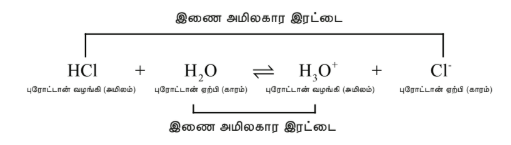
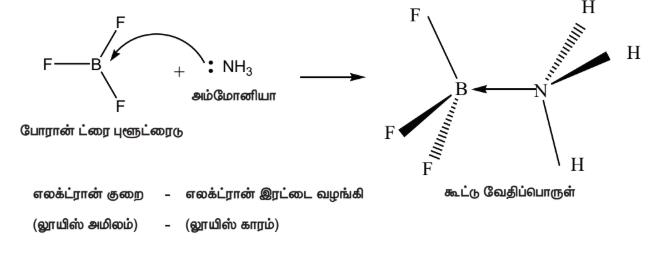
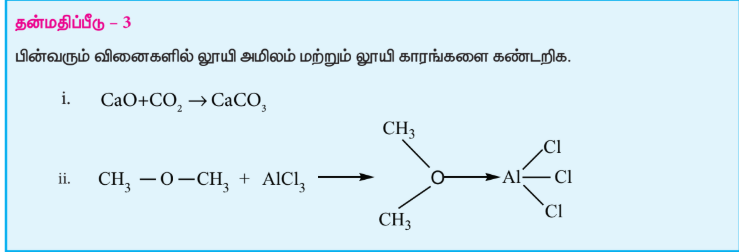
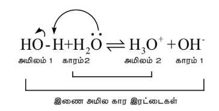

# அயனி சமநிலை 8

**
பீட்டர் ஜோசப் வில்லியம் டீபை
**

பீட்டர் ஜோசப் வில்லியம் டீபை என்பார் ஒரு டச்சு அமெரிக்க நாடுகளைச் சார்ந்த வேதியியல் அறிஞர் ஆவார். இவர் மின்பகுளிக் கரைசல் கொள்கையினையளித்து பெரும் பங்காற்றினார். மேலும் மூலக்கூறுகளின் இரு முனை திருப்புதிறன் பற்றி ஆய்ந்தளித்தார். விளிம்பு வரைபடம் மற்றும் இருமுனை திருப்புதிறனைக் கொண்டு மூலக்கூறுகளின் வடிவமைப்பு கண்டறிந்தலுக்காக டீபே 1936 ஆம் ஆண்டிற்கான வேதியியலில் நோபல் பரிசினைப் பெற்றார்.

## கற்றலின் நோக்கங்கள் :

இந்த பாடப்பகுதியை கற்றறிந்த பின்னர்,

* அரீனியஸ், லெளரி – ப்ரான்ஸ்டட் மற்றும் லூயி கொள்கை ஆகியவற்றின் அடிப்படையில் சேர்மங்களை அமிலங்கள் மற்றும் காரங்கள் என வகைப்படுத்துதல்.

* pH அளவீட்டை வரையறுத்தல், pH மற்றும் pOH ஆகியவற்றிற்கிடையே உள்ள தொடர்பை நிறுவுதல்.

* நீர் அயனியாக்கத்தில் நிலவும் சமநிலையை விளக்குதல் .

* ஆஸ்வால்ட் நீர்த்தல் விதியை விளக்குதல் மற்றும் ஒரு வலிமை குறைந்த மின்பகுளியின் பிரிகை மாறிலி மற்றும் பிரிகை வீதம் ஆகியவற்றிற்கிடையே உள்ள தொடர்பை வருவித்தல்.

* பொது அயனி விளைவுக் கொள்கை மற்றும் தாங்கல் செயல்முறையை விளக்குதல்.

* தாங்கல் கரைசலை தயாரிக்க ஹென்டர்சன் சமன்பாட்டை பயன்படுத்துதல்

* கரைதிறன் பெருக்கத்தை கணக்கிடுதல், கரைதிறன் மற்றும் கரைதிறன் பெருக்கத்திற்கு இடையே உள்ள தொடர்பை புரிந்து கொள்ளுதல்.

* அயனிச் சமநிலை தொடர்பான கணக்கீடுகளை தீர்த்தல்.

ஆகிய திறன்களை மாணவர்கள் பெறுவர்.

## பாட அறிமுகம்:

வேதிச் சமநிலை பற்றி XI வகுப்பில் நாம் முன்னர் கற்றறிந்தோம். இந்தப் பாடப்பகுதியில், அயனிச் சமநிலை குறிப்பாக அமில-காரச் சமநிலை பற்றி கற்க உள்ளோம். நம் உடலில் நிகழும் பல்வேறு முக்கிய செயல்முறைகளில் நீர்ச் சமநிலை நிலவுகிறது. எடுத்துக்காட்டு: இரத்தத்தில் காணப்படும் கார்பானிக் அமிலம் – பைகார்பனேட் தாங்கல் கரைசல்.

\[
\text{H}_3\text{O}^+(\text{aq}) + \text{HCO}_3^-(\text{aq}) \rightleftharpoons \text{H}_2\text{CO}_3(\text{aq}) + \text{H}_2\text{O}(\text{l})
\]

நம் அன்றாட வாழ்வில் பல்வேறு வேதிப் பொருட்களை கடந்து செல்கிறோம். அவற்றில், அமிலங்களும், காரங்களும் மிக முக்கியமானவையாகும். எடுத்துக்காட்டாக, பாலில் லாக்டிக் அமிலமும், வினிகரில் அசிட்டிக் அமிலமும், தேனீரில் டானிக் அமிலமும் உள்ளன. மேலும், அமிலநீக்கி மாத்திரைகளில் அலுமினியம் ஹைட்ராக்சைடு / மெக்னீஷியம் ஹைட்ராக்சைடு ஆகியவை உள்ளன. அமிலங்கள் மற்றும் காரங்கள் பல்வேறு தொழிற் பயன்களை பெற்றுள்ளன. எடுத்துக்காட்டாக, உரத் தொழிலில் கந்தக அமிலமும், சோப்பு தொழிலில் சோடியம் ஹைட்ராக்சைடும் பயன்படுத்தப்படுகின்றன. எனவே, அமிலங்கள் மற்றும் காரங்களின் பண்புகளை புரிந்துகொள்ளுதல் முக்கியமானது.

அமிலங்கள், காரங்கள் பற்றிய வரையறைகள் மற்றும் நீர்க்கரைசல்களில் அவற்றின் அயனியாதல் ஆகியவை குறித்து இந்தப் பாடப்பகுதியில் கற்க உள்ளோம். pH அளவீடு மற்றும் அமிலங்கள், காரங்கள் அவற்றின் நீர்க்கரைசல்களில் உருவாக்கும் கூறுகளின் செறிவுகளை நிர்ணயிக்க வேதிச் சமநிலை கொள்கைகளை பயன்படுத்துதல் ஆகியவற்றை பற்றி நாம் கற்போம்.

## 8.1 அமிலங்கள் மற்றும் காரங்கள்

'அமிலம்' எனும் சொல்லானது 'acidus' எனும் புளிப்பு எனப் பொருள்படும் கிரேக்க மொழிச் சொல்லிலிருந்து வருவிக்கப்பட்டது. இதன் பொருள் "புளிப்புச் சுவை" என்பதாகும். அமிலங்கள் புளிப்புச் சுவையுடையவை, நீல நிற லிட்மஸ் தாளை சிவப்பாக மாற்றக்கூடியவை. மேலும், ஜிங்க் போன்ற உலோகங்களுடன் வினைப்பட்டு ஹைட்ரஜன் வாயுவை வெளியேற்றக்கூடியவை. இதே போல காரங்கள் கசப்பு சுவையுடையவை மேலும், இவை சிவப்பு நிற லிட்மஸ் விடமஸ் தாளை நீல நிறமாக மாற்றக்கூடியவை என்பதை நாம் முந்தைய வகுப்புகளில் கற்றறிந்துள்ளோம்.

அமிலங்கள் மற்றும் காரங்களின் பண்புகளை விளக்குவதற்கு இந்த பழமையான கொள்கைகள் போதுமானவைகளாக இல்லை. எனவே, அறிவியலாளர்கள் அமில-காரங்களின் பண்புகளை அடிப்படையாகக் கொண்டு புதிய கொள்கைகளை உருவாக்கினர்.

அமிலங்கள் மற்றும் காரங்களின் பண்புகளை விளக்குவதற்காக அரீனியஸ், ப்ரான்ஸ்டட் மற்றும் லௌரி மற்றும் லூயி ஆகிய அறிவியலாளர்களால் உருவாக்கப்பட்ட கொள்கைகளை நாம் கற்போம்.

### 8.1.1 அரீனியஸ் கொள்கை

அமிலங்கள் மற்றும் காரங்கள் பற்றிய பழமையான கொள்கைகளில் ஒன்று ஸ்வீடன் நாட்டு வேதியியலாளர் ஸ்வாண்டே அரீனியஸ் என்பவரால் முன்மொழியப்பட்டது. அவரின் கூற்றுப்படி, அமிலம் என்பது, நீர்க்கரைசலில் பிரிகையடைந்து ஹைட்ரஜன் அயனிகளை தரவல்ல ஒரு சேர்மமாகும். எடுத்துக்காட்டாக, \( \text{HCl} \), \( \text{H}_2\text{SO}_4 \) போன்றவை அமிலங்களாகும். நீர்க்கரைசலில் அவற்றின் பிரிகையாதல் பின்வருமாறு குறிப்பிடப்படுகிறது.

$$\text{HCl}(g) \xrightleftharpoons{\text{H}_2\text{O}} \text{H}^+(aq) + \text{Cl}^-(aq)$$

நீர்க்கரைசலிலுள்ள \( \text{H}^+ \) அயனியானது அதிகளவில் நீரேற்றமடைந்து காணப்படுகிறது, பொதுவாக \( \text{H}_3\text{O}^+ \) என குறிப்பிடப்படுகின்றன. \( [\text{H}(\text{H}_2\text{O})]^+ \) என்பது புரோட்டானின் மிக எளிய நீரேறிய அமைப்பாகும். இதை குறிப்பிட \( \text{H}^+ \) மற்றும் \( \text{H}_3\text{O}^+ \) ஆகிய இரண்டையும் பயன்படுத்துவோம்.

அதே போல, காரம் என்பது, நீர்க்கரைசலில் பிரிகையடைந்து ஹைட்ராக்ஸில் அயனிகளை தரவல்ல ஒரு சேர்மமாகும். எடுத்துக்காட்டாக, \( \text{NaOH} \), \( \text{Ca(OH)}_2 \) போன்ற சேர்மங்கள் காரங்களாகும்.

\[
\text{Ca(OH)}_2 \xrightleftharpoons {\text{H}_2\text{O}} \text{Ca}^{2+} (\text{aq}) + 2\text{OH}^- (\text{aq})
\]

#### அரீனியஸ் கொள்கையின் வரம்புகள்

i. அசிடேட்டான், டெட்ராஹைட்ரோஃப்யுரான் போன்ற கரிம கரைப்பான்களில் அமில மற்றும் காரங்களின் பண்பினை அரீனியஸ் கொள்கை விளக்கவில்லை.

ii. ஹைட்ராக்ஸில் தொகுதியை கொண்டிராத அம்மோனியா (\( \text{NH}_3 \)) போன்ற சேர்மங்களின் காரத்தன்மையினை இக்கொள்கை விளக்கவில்லை.

**தன்மதிப்பீடு - 1**

அரீனியஸ் கொள்கையை பயன்படுத்தி பின்வருவனவற்றை அமிலம் (அல்லது) காரம் என வகைப்படுத்துக.

i) \( \text{HNO}_3 \) ii) \( \text{Ba(OH)}_2 \) iii) \( \text{H}_3\text{PO}_4 \) iv) \( \text{CH}_3\text{COOH} \)

### 8.1.2 லெளரி – ப்ரான்ஸ்டட் கொள்கை (புரோட்டான் கொள்கை)

1923 ஆம் ஆண்டு, லெளரி மற்றும் ப்ரான்ஸ்டட் ஆகியோர் அமிலங்கள் மற்றும் காரங்கள் பற்றிய மிகப் பொதுவான ஒரு கொள்கையை முன்மொழிந்தனர். அவர்களின் கொள்கைப்படி, அமிலம் என்பது மற்றொரு பொருளுக்கு ஒரு புரோட்டானை வழங்கக்கூடிய ஒரு பொருளாகும். காரம் என்பது மற்றொரு பொருளிலிருந்து ஒரு புரோட்டானை ஏற்கக்கூடிய ஒரு பொருளாகும். அதாவது, அமிலம் என்பது ஒரு புரோட்டான் வழங்கி, மற்றும் காரம் என்பது ஒரு புரோட்டான் ஏற்பி.

ஹைட்ரஜன் குளோரைடை நீரில் கரைக்கும் போது, அது, நீர் மூலக்கூறுக்கு ஒரு புரோட்டானை வழங்குகிறது. அதாவது, \( \text{HCl} \) ஒரு அமிலமாகவும், \( \text{H}_2\text{O} \) ஒரு காரமாகவும் நடந்துகொள்கின்றன. அமிலத்திலிருந்து காரத்திற்கு புரோட்டான் மாற்றப்படும் நிகழ்வை பின்வருமாறு குறிப்பிடலாம்.

\[
\text{HCl} + \text{H}_2\text{O} \rightleftharpoons \text{H}_3\text{O}^+ + \text{Cl}^-
\]

அம்மோனியாவை நீரில் கரைக்கும்போது, அது நீரிலிருந்து ஒரு புரோட்டானை ஏற்றுக்கொள்கிறது. இந்த நேர்வில், அம்மோனியா (\( \text{NH}_3 \)) மூலக்கூறு ஒரு காரமாகவும், \( \text{H}_2\text{O} \) மூலக்கூறு அமிலமாகவும் செயல்படுகின்றன. வினையானது பின்வருமாறு குறிப்பிடப்படுகிறது

\[
\text{H}_2\text{O} + \text{NH}_3 \rightleftharpoons \text{NH}_4^+ + \text{OH}^-
\]

இதன் மறுதலை வினையை பின்வரும் சமநிலையில் கருதுவோம்.

\[
\text{HCl} + \text{H}_2\text{O} \rightleftharpoons \text{H}_3\text{O}^+ + \text{Cl}^-
\]
\[
\text{புரோட்டான் வழங்கி (அமிலம்)} \quad \text{புரோட்டான் ஏற்பி} \quad \text{புரோட்டான் வழங்கி (அமிலம்)} \quad \text{புரோட்டான் ஏற்பி (காரம்)}
\]

\( \text{H}_3\text{O}^+ \) ஆனது \( \text{Cl}^- \) க்கு ஒரு புரோட்டானை வழங்கி \( \text{HCl} \) ஐ உருவாக்குகிறது. அதாவது, வினைபொருட்களும் அமிலம் மற்றும் காரங்களாக செயல்படுகின்றன. பொதுவாக, லெளரி – ப்ரான்ஸ்டட் (அமிலம் – காரம்) வினையை பின்வருமாறு எழுதப்படுகிறது.

$$\text{அமிலம்}_1 + \text{காரம்}_2 \rightleftharpoons \text{அமிலம்}_1 + \text{காரம்}_2$$

ஒரு புரோட்டானை வழங்கிய பிறகு எஞ்சியுள்ள பகுதி ஒரு காரமாகும் ($\text{காரம்}_1$) மேலும் இது ப்ரான்ஸ்டட் அமிலத்தின் ($\text{அமிலம்}_1$) இணைக் காரம் என்றழைக்கப்படுகிறது. அதாவது ஒரு புரோட்டானால் மட்டும் வேறுபடும் வேதிக்கூறுகள் இணை அமில-கார இரட்டைகள் என்றழைக்கப்படுகின்றன.

\( \text{HCl} \) மற்றும் \( \text{Cl}^- \), \( \text{H}_2\text{O} \) மற்றும் \( \text{H}_3\text{O}^+ \) ஆகியன இரண்டும், வெவ்வேறு இணை அமில – கார இரட்டைகளாகும். அதாவது, \( \text{Cl}^- \) என்பது \( \text{HCl} \) அமிலத்தின் இணை காரம் (அல்லது) \( \text{HCl} \) என்பது \( \text{Cl}^- \) அயனியின் இணை அமிலம் ஆகும். இதே போல \( \text{H}_3\text{O}^+ \) என்பது \( \text{H}_2\text{O} \) வின் இணை அமிலமாகும்.

#### லெளரி – ப்ரான்ஸ்டட் வகைகையின் வரம்புகள்

i. \( \text{BF}_3 \), \( \text{AlCl}_3 \) போன்ற புரோட்டான்களை வழங்க இயலாத சேர்மங்களும் அமிலங்கள் போல செயல்படுவதை இக் கொள்கை விளக்கவில்லை.

**தன்மதிப்பீடு – 2**

பின்வருவனவற்றிற்கு, அவற்றின் நீர்க்கரைசலில் பிரிகையடைதலுக்கான சமன்படுத்தப்பட்ட சமன்பாட்டை எழுதுக. மேலும், இணை அமில – கார இரட்டைகளை கண்டறிக.

i) \( \text{NH}_4^+ \) ii) \( \text{H}_2\text{SO}_4 \) iii) \( \text{CH}_3\text{COOH} \).

### 8.1.3 லூயி கொள்கை

1923 ஆம் ஆண்டு, கில்பர்ட். N. லூயி என்பவர், அமில மற்றும் காரங்கள் பற்றிய மிகப் பொதுவான ஒரு கொள்கையை முன்மொழிந்தார். இவர் எலக்ட்ரான் இரட்டைகளை கருத்திற்கொண்டு ஒரு சேர்மத்தை அமிலம் அல்லது காரம் என வரையறுத்தார். இவரின் கருத்துப்படி, எலக்ட்ரான் இரட்டையை ஏற்றுக்கொள்ளும் சேர்மம் அமிலம் ஆகும். காரம் என்பது எலக்ட்ரான் இரட்டையை வழங்கும் சேர்மமாகும். இத்தகைய சேர்மங்களை நாம் லூயி அமிலங்கள் மற்றும் லூயி காரங்கள் என அழைக்கிறோம்.

லூயி அமிலம் என்பது ஒரு நேர்மின் அயனி (அல்லது) ஒரு எலக்ட்ரான் குறை மூலக்கூறு ஆகும். லூயி காரம் என்பது ஒரு எதிரயனி (அல்லது) குறைந்தபட்சம் ஒரு தனித்த இரட்டை எலக்ட்ரான்களை கொண்ட நடுநிலை மூலக்கூறு ஆகும்.

போரான் ட்ரைபுளூரைடு மற்றும் அம்மோனியா ஆகியவற்றிற்கிடையே நிகழும் வினையை கருதுவோம்.

இங்கு, போரான் அணு ஒரு காலியான 2p ஆர்ப்பிட்டாலைக் கொண்டுள்ளது. இது, அம்மோனியாவால் வழங்கப்படும் தனித்த எலக்ட்ரான் இரட்டையை ஏற்றுக்கொண்டு ஒரு புதிய ஈதல் சகப்பிணைப்பை உருவாக்குகிறது. அணைவுச் சேர்மங்களிலுள்ள ஈனிகள், லூயி காரங்களாகவும், ஈனிகளிடமிருந்து தனித்த எலக்ட்ரான் இரட்டைகளை ஏற்றுக்கொள்ளும் மைய உலோக அணு அல்லது அயனியானது லூயி அமிலமாகவும் செயல்படுகிறது என்பதை நாம் முன்னரே கற்றறிந்தோம்.

| லூயி அமிலங்கள் | லூயி காரங்கள் |
|---|---|
| \( \text{BF}_3 \), \( \text{AlCl}_3 \), \( \text{BeF}_2 \) போன்ற எலக்ட்ரான் குறை மூலக்கூறுகள் | ஒன்று அல்லது அதற்கு மேற்பட்ட தனித்த எலக்ட்ரான் இரட்டைகளை கொண்டுள்ள மூலக்கூறுகள் \( \text{NH}_3 \), \( \text{H}_2\text{O} \), \( \text{R-O-H} \), \( \text{R-O-R} \), \( \text{R-NH}_2 \) |
| அனைத்து உலோக அயனிகள் எடுத்துக்காட்டுகள்: \( \text{Fe}^{2+} \), \( \text{Fe}^{3+} \), \( \text{Cr}^{3+} \), \( \text{Cu}^{2+} \) போன்றவை... | அனைத்து எதிரயனிகள் எடுத்துக்காட்டுகள்: \( \text{F}^- \), \( \text{Cl}^- \), \( \text{CN}^- \), \( \text{SCN}^- \), \( \text{SO}_4^{2-} \) போன்றவை... |
| ஒரு முனைவுற்ற இரட்டைப் பிணைப்பை கொண்டுள்ள மூலக்கூறுகள். எடுத்துக்காட்டுகள்: \( \text{SO}_2 \), \( \text{CO}_2 \), \( \text{SO}_3 \) போன்றவை... | கார்பன் - கார்பன் பல்பிணைப்புகளை கொண்டுள்ள மூலக்கூறுகள். எடுத்துக்காட்டுகள்: \( \text{CH}_2 = \text{CH}_2 \), \( \text{CH} \equiv \text{CH} \) போன்றவை... |
| காலியான d - ஆர்ப்பிட்டால்களை கொண்டிருப்பதால் தன்னுடைய எண்மத்தை நீட்டிக்கொள்ளும் மைய அணுவை பெற்றுள்ள மூலக்கூறுகள். எடுத்துக்காட்டுகள்: \( \text{SiF}_4 \), \( \text{SF}_4 \), \( \text{FeCl}_3 \) போன்றவை. | அனைத்து உலோக ஆக்சைடுகள் எடுத்துக்காட்டுகள்: \( \text{CaO} \), \( \text{MgO} \), \( \text{Na}_2\text{O} \) போன்றவை... |
| கார்பன் நேரயனி \( (\text{CH}_3)_3 \text{C}^+ \) | கார்பன் எதிரயனி \( \text{CH}_3^- \) |

#### எடுத்துக்காட்டு

பின்வரும் வினையில் உள்ள லூயி அமிலம் மற்றும் லூயி காரங்களை கண்டறிக.

\[
\text{Cr}^{3+} + 6 \text{H}_2\text{O} \rightarrow [\text{Cr}(\text{H}_2\text{O})_6]^{3+}
\]

அயனியின் நீரேற்றத்தில், ஒவ்வொரு நீர் மூலக்கூறும் ஒரு எலக்ட்ரான் இரட்டையை \( \text{Cr}^{3+} \) அயனிக்கு வழங்குவதால் ஹெக்ஸாஅக்குவாகுரோமியம் (III) அயனி எனும் நீரேற்றம் பெற்ற அயனி உருவாகிறது. அதாவது, \( \text{Cr}^{3+} \) அயனி லூயி அமிலமாகவும் மற்றும் \( \text{H}_2\text{O} \) மூலக்கூறு லூயி காரமாகவும் செயல்படுகின்றன.

**தன்மதிப்பீடு - 4**

கீழே குறிப்பிடப்பட்டுள்ளவாறு \( \text{H}_3\text{BO}_3 \) மூலக்கூறானது நீரிடமிருந்து ஹைட்ராக்சைடு அயனியை ஏற்றுக்கொள்கிறது

\[
\text{H}_3\text{BO}_3(\text{aq}) + \text{H}_2\text{O}(\text{l}) \rightleftharpoons \text{B(OH)}_4^- + \text{H}^+
\]

லூயி கொள்கையை பயன்படுத்தி \( \text{H}_3\text{BO}_3 \) மூலக்கூறின் தன்மையை கண்டறிக.

## 8.2 அமிலங்கள் மற்றும் காரங்களின் வலிமை:

ஒரு மோல் சேர்மத்தை \( \text{H}_2\text{O} \) ல் கரைக்கும்போது உருவாகும் \( \text{H}_3\text{O}^+ \) அல்லது \( \text{H}^+ \) அயனிகளின் செறிவைக் கொண்டு அமிலங்கள் மற்றும் காரங்களின் வலிமை நிர்ணயிக்கப்படுகிறது. பொதுவாக, அமிலங்கள் மற்றும் காரங்களை வலிமை மிகுந்தவை அல்லது வலிமை குறைந்தவை என வகைப்படுத்தலாம். வலிமைமிக்க அமிலம் என்பது நீரில் முழுமையாக பிரிகையடைகிறது. வலிமை குறைந்த அமிலம் பகுதியளவே நீரில் பிரிகையடைகிறது.

பின்வரும் பொதுவான சமநிலையை கருத்திற்கொண்டு ஒரு அமிலத்தின் (HA) வலிமையை கணிதவியலாக வரையறுப்போம்.

\[
\text{HA} + \text{H}_2\text{O} \rightleftharpoons \text{H}_3\text{O}^+ + \text{A}^-
\]
\[
\text{அமிலம்}_1 \quad \text{காரம்}_1 \quad \text{அமிலம்}_2 \quad \text{அமிலம்}_1
\]

மேற்காண் அயனியாதல் வினைக்கான சமநிலை மாறிலி பின்வரும் சமன்பாட்டால் குறிப்பிடப்படுகிறது.

\[
K = \frac{[\text{H}_3\text{O}^+][\text{A}^-]}{[\text{HA}][\text{H}_2\text{O}]} \qquad \dots \dots (8.1)
\]

மேற்காண் சமன்பாட்டில், \( \text{H}_2\text{O} \) மிக அதிகளவில் உள்ளதாலும், அடிப்படையில் மாறாமல் உள்ளதாலும் அதன் செறிவை நாம் ஒதுக்கிவிட முடியும்.

\[
K_a = \frac{[\text{H}_3\text{O}^+][\text{A}^-]}{[\text{HA}]} \qquad \dots \dots (8.2)
\]

இங்கு, \( K_a \) என்பது அமிலத்தின் அயனியாதல் மாறிலி அல்லது பிரிகை மாறிலி என்றழைக்கப்படுகிறது. ஒரு அமிலத்தின் வலிமையை இது அளக்கிறது. \( \text{HCl} \), \( \text{HNO}_3 \) போன்ற அமிலங்கள் ஏறக்குறைய முழுமையாக அயனியுறுகின்றன. எனவே அவை உயர் \( K_a \) மதிப்புகளை (\( 25^\circ \text{C} \) ல் \( \text{HCl} \) இன் \( K_a \) மதிப்பு \( 2 \times 10^6 \)) பெற்றுள்ளன. ஃபார்மிக் அமிலம் (\( 25^\circ \text{C} \) ல் \( K_a = 1.8 \times 10^{-4} \)), அசிட்டிக் அமிலம் (\( 25^\circ \text{C} \) ல் \( K_a = 1.8 \times 10^{-5} \)) போன்ற அமிலங்கள் கரைசலில் பகுதியளவே அயனியுறுகின்றன. இத்தகைய நேர்வுகளில், அயனியுறா அமில மூலக்கூறுகளுக்கும், பிரிகையடைந்த அயனிகளுக்கும் இடையே ஒரு சமநிலை நிலவுகிறது. பொதுவாக, பத்தை விட அதிகமான \( K_a \) மதிப்பை கொண்ட அமிலங்கள் வலிமை மிகு அமிலங்கள் எனவும், ஒன்றைவிட குறைவான \( K_a \) மதிப்பை கொண்ட அமிலங்கள் வலிமை குறைந்த அமிலங்கள் எனவும் கருதப்படுகின்றன.

நீர்க்கரைசலில் \( \text{HCl} \) பிரிகையடைதலை கருதுவோம்.

\[
\text{HCl} + \text{H} - \text{OH} \rightleftharpoons \text{H}_3\text{O}^+ + \text{Cl}^-
\]
\[
\text{அமிலம்}_1 \quad \text{காரம்}_2 \quad \text{அமிலம்}_2 \quad \text{காரம்}_1
\]

முன்னர் விவாதித்தபடி, முழுமையான பிரிகையடைதலால், சமநிலையானது ஏறக்குறைய 100% வலப்புறமாக நகர்ந்துள்ளது. அதாவது, \( \text{H}_3\text{O}^+ \) விடமிருந்து ஒரு புரோட்டானை \( \text{Cl}^- \) அயனி ஏற்றுக்கொள்ளும் திறன் ஒதுக்கத்தக்கது. ஒரு வலிமை மிகு அமிலத்தின் இணை காரம் ஒரு வலிமை குறைந்த காரமாகும் மற்றும் இதன் மறுதலையும் சரியானதாகும்.

இணை அமிலம் – கார இரட்டைகளின் ஒப்பு வலிமையை பின்வரும் அட்டவணை விளக்குகிறது.

## 8.3 நீரின் சுய அயனியாக்கம்

அமிலத்தன்மை அல்லது காரத்தன்மை கொண்ட சேர்மத்தை நீரில் கரைக்கும்போது அதன் தன்மையை பொறுத்து ஒரு புரோட்டானை வழங்கவோ அல்லது ஏற்கவோ முடியும். கூடுதலாக, தூய நீரும் தானே சிறிதளவு பிரிகையடையும் திறனைக் கொண்டுள்ளது. அதாவது, ஒரு நீர் மூலக்கூறானது மற்றொரு நீர் மூலக்கூறுக்கு ஒரு புரோட்டானை வழங்குகிறது. இது நீரின் அயனியாக்கம் என அறியப்படுகிறது. இது கீழ்காணுமாறு குறிப்பிடப்படுகிறது.

மேற்காண் அயனியாதலில், ஒரு நீர் மூலக்கூறு அமிலமாகவும், அதே சமயம் மற்றொரு நீர் மூலக்கூறு காரமாகவும் செயல்படுகிறது.

மேற்காண் அயனியாதலுக்கான பிரிகை மாறிலியை பின்வரும் சமன்பாடு குறிப்பிடுகிறது.

\[
K = \frac{[\text{H}_3\text{O}^+] [\text{OH}^-]}{[\text{H}_2\text{O}]^2} \qquad \dots(8.3)
\]

வெவ்வேறு வெப்பநிலைகளில் \(K_w\) மதிப்புகள் கீழே கொடுக்கப்பட்டுள்ளன
| வெப்பநிலை (°C) | \( K_w \) |
|---|---|
| 0 | \( 1.14 \times 10^{-15} \) |
| 10 | \( 2.95 \times 10^{-15} \) |
| 25 | \( 1.00 \times 10^{-14} \) |
| 40 | \( 2.71 \times 10^{-14} \) |
| 50 | \( 5.30 \times 10^{-14} \) |

தூய திரவ நீரின் செறிவு. அதாவது, \( [\text{H}_2\text{O}]^2 = 1 \)

\[
\therefore K_w = [\text{H}_3\text{O}^+] [\text{OH}^-] \qquad \dots(8.4)
\]

இங்கு \( K_w \) என்பது நீரின் அயனிப் பெருக்கத்தை (அயனிப் பெருக்கம் மாறிலி) குறிப்பிடுகிறது. \( 25^\circ \text{C} \) வெப்பநிலையில் தூய நீரில் \( \text{H}_3\text{O}^+ \) அயனியின் செறிவு \( 1 \times 10^{-7} \) ஆக இருக்கும் என்பது சோதனை மூலம் கண்டறியப்பட்டுள்ளது. நீர் பிரிகையடையும் போது சம எண்ணிக்கையில் \( \text{H}_3\text{O}^+ \) மற்றும் \( \text{OH}^- \) அயனிகள் உருவாக்கப்படுவதால் \( \text{OH}^- \) அயனிச் செறிவு மதிப்பும் \( 25^\circ \text{C} \) வெப்பநிலையில் \( 1 \times 10^{-7} \) க்கு சமமாக இருக்கும்.

எனவே, \( 25^\circ \text{C} \) ல் நீரின் அயனிப் பெருக்கம்

K_w = [\text{H}_3\text{O}^+] [\text{OH}^-] \qquad \dots(8.4)
\[
K_w = (1 \times 10^{-7})(1 \times 10^{-7}) = 1 \times 10^{-14}
\]

மற்ற எல்லா சமநிலை மாறிலிகளைப் போலவே, ஒரு குறிப்பிட்ட வெப்பநிலையில் \( K_w \) யும் ஒரு மாறிலி. நீரின் அயனியாக்கம் ஒரு வெப்பம் கொள் வினையாகும். வெப்பநிலை அதிகரிக்கும் போது, \( \text{H}_3\text{O}^+ \) மற்றும் \( \text{OH}^- \) அயனிச் செறிவுகளும் அதிகரிக்கின்றன, எனவே அயனிப் பெருக்கமும் அதிகரிக்கிறது.

\( \text{NaCl} \) போன்ற நடுநிலையான நீர்க்கரைசல்களில், \( \text{H}_3\text{O}^+ \) அயனிகளின் செறிவானது எப்போதும் \( \text{OH}^- \) அயனிகளின் செறிவிற்கு சமமாக இருக்கும். ஆனால் அமிலமாகவோ அல்லது காரமாகவோ செயல்படும் ஒரு பொருளின் நீர்க்கரைசலில் \( [\text{H}_3\text{O}^+] \) அயனியின் செறிவானது, \( [\text{OH}^-] \) அயனிச் செறிவிற்கு சமமாக இருக்காது.

நீரிய \( \text{HCl} \) கரைசலை ஒரு எடுத்துக்காட்டாக கருதுவதன் மூலம் இதை நாம் புரிந்து கொள்ள முடியும். நீரின் சுய அயனியாதலுடன் கூடுதலாக, \( \text{HCl} \) பிரிகையடைவதால் ஏற்படும் பின்வரும் சமநிலையும் உள்ளது.

\[
\text{HCl} + \text{H}_2\text{O} \rightleftharpoons \text{H}_3\text{O}^+ + \text{Cl}^-
\]

இந்த நேர்வில், நீரின் சுய அயனியாதலுடன் கூடுதலாக, \( \text{HCl} \) மூலக்கூறுகளும் நீருக்கு ஒரு புரோட்டானை வழங்கி \( \text{H}_3\text{O}^+ \) அயனிகளை உருவாக்குகின்றன. எனவே, \( [\text{H}_3\text{O}^+] > [\text{OH}^-] \). அதாவது நீரிய \( \text{HCl} \) கரைசல் அமிலத்தன்மை வாய்ந்தது. இதே போல, \( \text{NH}_3 \), \( \text{NaOH} \) போன்ற நீரிய காரக் கரைசல்களில் \( [\text{OH}^-] > [\text{H}_3\text{O}^+] \).

#### எடுத்துக்காட்டு 8.1

\( 2 \times 10^{-3} \) M, \( \text{H}_3\text{O}^+ \) அயனிச் செறிவைக் கொண்டுள்ள ஒரு பழரசத்தில் \( \text{OH}^- \) அயனிச் செறிவை கணக்கிடுக. கரைசலின் தன்மையை கண்டறிக.

கொடுக்கப்பட்டது \( [\text{H}_3\text{O}^+] = 2 \times 10^{-3} \) M

\[
K_w = [\text{H}_3\text{O}^+] [\text{OH}^-]
\]

\[
\therefore [\text{OH}^-] = \frac{K_w}{[\text{H}_3\text{O}^+]} = \frac{1 \times 10^{-14}}{2 \times 10^{-3}} = 5 \times 10^{-12} \text{ M}
\]

\[
2 \times 10^{-3} \gg 5 \times 10^{-12}
\]

அதாவது \( [\text{H}_3\text{O}^+] \gg [\text{OH}^-] \), எனவே பழச்சாறு அமிலத்தன்மை கொண்டது

**தன்மதிப்பீடு – 5**

ஒரு குறிப்பிட்ட வெப்பநிலையில் ஒரு நடுநிலைக் கரைசலின் \( K_w \) மதிப்பு \( 4 \times 10^{-14} \) எனில், \( [\text{H}_3\text{O}^+] \) மற்றும் \( [\text{OH}^-] \) அயனிச் செறிவுகளை கணக்கிடுக.

## 8.4 pH அளவீடு

பொதுவாக \( 10^{-1} \) M முதல் \( 10^{-7} \) M வரையிலான செறிவுகளைக் கொண்ட அமில, கார கரைசல்களை நாம் பயன்படுத்துகிறோம். இத்தகைய குறைவான செறிவுகளில் வலிமையை குறிப்பிடுவதற்காக, சோரன்சன் என்பவர் pH அளவீடு எனப்படும் மடக்கை அளவீட்டை அறிமுகப்படுத்தினார். pH என்ற சொல் ‘Puissance de hydrogene’ பிரஞ்சு மொழிச் சொல்லிலிருந்து வருவிக்கப்பட்டதாகும். இதன் பொருள், "The power of hydrogen - ஹைட்ரஜனின் வலிமை." ஒரு கரைசலின் pH என்பது அக்கரைசலில் உள்ள ஹைட்ரோனியம் அயனிகள் மோலார் செறிவின், 10ஐ அடிப்படையாக கொண்ட எதிர்குறி மடக்கை மதிப்புகள் என வரையறுக்கப்படுகிறது.

\[
\text{pH} = -\log_{10}[\text{H}_3\text{O}^+] \qquad (8.5)
\]

pH மதிப்பு தெரிந்த ஒரு கரைசலிலுள்ள \( \text{H}_3\text{O}^+ \) அயனிச் செறிவை பின்வரும் சமன்பாட்டை பயன்படுத்தி கணக்கிட முடியும்.

\[
[\text{H}_3\text{O}^+] = 10^{-\text{pH}} \quad (\text{or}) \quad [\text{H}_3\text{O}^+] = \text{antilog} \; (-\text{pH}) \qquad (8.6)
\]

இதே போல, pOH ஐயும் பின்வருமாறு வரையறுக்கலாம்

\[
\text{pOH} = -\log_{10}[\text{OH}^-] \qquad (8.7)
\]

முன்னர் விவாதித்தபடி, நடுநிலைக் கரைசல்களில், \( [\text{H}_3\text{O}^+] \), \( [\text{OH}^-] \) செறிவுகள் \( 25^\circ \text{C} \) இல் \( 1 \times 10^{-7} \) M க்கு சமமாக இருக்கும். இந்த \( [\text{H}_3\text{O}^+] \) செறிவை சமன்பாடு (8.5) இல் பிரதியிடுவதன் மூலம் ஒரு நடுநிலைக் கரைசலின் pH மதிப்பை கணக்கிடலாம்.

\[
\begin{aligned}
\text{pH} &= -\log_{10} [\text{H}_3\text{O}^+] \\
&= -\log_{10} (10^{-7}) \\
&= -(-7) \log_{10} 10 = +7(1) = 7 \\
&[\because \log_{10} 10 = 1]
\end{aligned}
\]

இதே போல, சமன்பாடு (8.7) ஐ பயன்படுத்தி ஒரு நடுநிலைக் கரைசலின் pOH மதிப்பை நாம் கணக்கிட முடியும். இதன் மதிப்பும் 7 க்கு சமமாக உள்ளது.

சமன்பாடு (8.5) யிலுள்ள எதிர்குறியானது \( [\text{H}_3\text{O}^+] \) செறிவு அதிகரிக்கும்போது கரைசலின் pH மதிப்பு குறையும் என்பதை காட்டுகிறது. எடுத்துக்காட்டாக, \( [\text{H}_3\text{O}^+] \) செறிவு \( 10^{-7} \) விருந்து \( 10^{-5} \) M ஆக அதிகரிக்கும்போது, கரைசலின் pH மதிப்பு 7 விருந்து 5 ஆக குறைகிறது. அமிலக் கரைசலில், \( [\text{H}_3\text{O}^+] > [\text{OH}^-] \), அதாவது \( [\text{H}_3\text{O}^+] > 10^{-7} \). இதே போல, காரக் கரைசலில் \( [\text{H}_3\text{O}^+] < 10^{-7} \). எனவே, அமிலக் கரைசலானது 7 ஐ விட குறைந்த pH மதிப்பை கொண்டிருக்க வேண்டும், மற்றும் காரக் கரைசலானது 7 ஐ விட அதிகமான pH மதிப்பை கொண்டிருக்க வேண்டும்.

### 8.4.1 pH மற்றும் pOH ஆகியவற்றிற்கிடையே உள்ள தொடர்பு

பின்வரும் வரையறைகளை பயன்படுத்தி pH மற்றும் pOH க்கு இடையேயான தொடர்பை நிறுவ முடியும்.

\[
\text{pH} = -\log_{10}[\text{H}_3\text{O}^+] \qquad (8.5)
\]
\[
\text{pOH} = -\log_{10}[\text{OH}^-] \qquad (8.7)
\]

சமன்பாடுகள் (8.5) மற்றும் (8.7) ஆகியவற்றை கூட்ட

\[
\begin{aligned}
\text{pH} + \text{pOH} &= -\log_{10}[\text{H}_3\text{O}^+] - \log_{10}[\text{OH}^-] \\
&= -(\log_{10}[\text{H}_3\text{O}^+] + \log_{10}[\text{OH}^-])
\end{aligned}
\]

\[
\text{pH} + \text{pOH} = -\log_{10}[\text{H}_3\text{O}^+] [\text{OH}^-] \qquad [\because \log a + \log b = \log ab]
\]

நாமறிந்தபடி \( [\text{H}_3\text{O}^+] [\text{OH}^-] = K_w \)

\[
\Rightarrow \text{pH} + \text{pOH} = -\log_{10} K_w
\]

\[
\Rightarrow \text{pH} + \text{pOH} = \text{p}K_w \qquad [\because \text{p}K_w = -\log_{10} K_w]
\]

\( 25^\circ \text{C} \) இல் நீரின் சுய அயனி பெருக்கம், \( K_w = 1 \times 10^{-14} \)

\[
\text{p}K_w = -\log_{10} (10^{-14}) = 14 \log_{10} 10 = 14
\]

\[
\therefore (8.7) \Rightarrow \text{At } 25^\circ \text{C}, \text{pH} + \text{pOH} = 14
\]

#### எடுத்துக்காட்டு 8.2

\( 0.001 \) M \( \text{HCl} \) கரைசலின் pH மதிப்பை கணக்கிடுக

$$\text{HCl} \xrightleftharpoons{\text{H}_2\text{O}} \text{H}_3\text{O}^+ + \text{Cl}^-$$

\[
0.001 \text{ M} \quad 0.001 \text{ M} \quad 0.001 \text{ M}
\]

\( 10^{-3} \) M \( \text{HCl} \) மில் உள்ள \( [\text{H}_3\text{O}^+] \) செறிவுடன் ஒப்பிடும்போது, நீரின் சுய அயனியாக்கத்திலிருந்து உருவாகும் \( [\text{H}_3\text{O}^+] \) (\( 10^{-7} \) M) செறிவு ஒதுக்கத்தக்கது.

\[
\text{எனவே } [\text{H}_3\text{O}^+] = 0.001 \text{ mol dm}^{-3}
\]

\[
\begin{aligned}
\text{pH} &= -\log_{10}[\text{H}_3\text{O}^+] \\
&= -\log_{10} (0.001) \\
&= -\log_{10} (10^{-3}) = 3
\end{aligned}
\]

**குறிப்பு:** ஒரு அமிலம் அல்லது காரத்தின் செறிவு \( 10^{-6} \) M ஐ விட குறைவாக இருந்தால், நீரின் சுய அயனியாக்கத்திலிருந்து உருவாகும் \( \text{H}_3\text{O}^+ \) செறிவை நாம் ஒதுக்க இயலாது. இத்தகைய நேர்வுகளில்

\[
[\text{H}_3\text{O}^+] = 10^{-7} \text{ (நீரிலிருந்து)} + [\text{H}_3\text{O}^+] \text{ (அமிலத்திலிருந்து)}
\]

இதே போல, \( [\text{OH}^-] = 10^{-7} \text{ M (நீரிலிருந்து)} + [\text{OH}^-] \text{ (காரத்திலிருந்து)} \)

#### எடுத்துக்காட்டு 8.3

\( 10^{-7} \) M \( \text{HCl} \) ன் pH மதிப்பை கணக்கிடுக.

\( \text{H}_2\text{O} \) அயனியாவதிலிருந்து உருவாகும் \( [\text{H}_3\text{O}^+] \) கருத்தில் கொள்ளாத போது

\[
[\text{H}_3\text{O}^+] = [\text{HCl}] = 10^{-7} \text{ M}
\]

i.e., pH = 7, இது நடுநிலைக் கரைசலின் pH மதிப்பாகும். \( \text{HCl} \) கரைசலின் செறிவு எதுவாயினும் அக்கரைசல் அமிலத்தன்மை கொண்டது என்பதை நாம் அறிவோம். அதாவது pH மதிப்பு 7 ஐ விட குறைவாக இருக்க வேண்டும். இந்த நேர்வில் அமிலத்தின் செறிவு மிகக் குறைவு (\( 10^{-7} \) M) எனவே, நீரின் சுய அயனியாக்கத்திலிருந்து உருவாகும் \( [\text{H}_3\text{O}^+] \) (\( 10^{-7} \) M) செறிவை நாம் ஒதுக்க முடியாது.

எனவே, இதில் நீரின் சுய அயனியாக்கத்திலிருந்து உருவாகும் \( [\text{H}_3\text{O}^+] \) செறிவை கருத்தில் கொள்ள வேண்டும்.

\[
\begin{aligned}
[\text{H}_3\text{O}^+] &= 10^{-7} \text{ (நீரிலிருந்து)} + [\text{H}_3\text{O}^+] \text{ (HCl அமிலத்திலிருந்து)} \\
&= 10^{-7} (1+1) = 2 \times 10^{-7}
\end{aligned}
\]

\[
\begin{aligned}
\text{pH} &= -\log_{10}[\text{H}_3\text{O}^+] \\
&= -\log_{10}(2 \times 10^{-7}) = -[\log 2 + \log 10^{-7}] \\
&= -\log 2 - (-7) \log_{10} 10 \\
&= 7 - \log 2 \\
&= 7 - 0.3010 = 6.6990 \\
&= 6.70
\end{aligned}
\]

**தன்மதிப்பீடு - 6**

அ) \( 10^{-8} \) M செறிவுள்ள \( \text{H}_2\text{SO}_4 \) அமிலத்தின் pH மதிப்பை கணக்கிடுக.

ஆ) pH = 5.4 எனக்கொண்ட ஒரு கரைசலின் ஹைட்ரஜன் அயனிச் செறிவை மோல்/லிட்டர் அலகில் கணக்கிடுக.

இ) 50 ml 0.2 M \( \text{HCl} \) உடன் 50 ml 0.1 M \( \text{NaOH} \) ஐ கலந்த பின் கிடைக்கும் நீர்க்கரைசலின் pH மதிப்பை கணக்கிடுக.

## 8.5 வலிமை குறைந்த அமிலங்களின் அயனியாதல்

வலிமை குறைந்த அமிலங்கள் நீரில் பகுதியளவே பிரிகையடைகின்றன. மேலும், பிரிகையடையாத அமிலத்திற்கும், பிரிகையடைந்த அயனிகளுக்கும் இடையே சமநிலை நிலவுகிறது என்பதையும் நாம் முன்னர் கற்போம்.

நீரில், ஒரு வலிமை குறைந்த ஒற்றைக் கார அமிலத்தின் (HA) அயனியாதலை கருதுக.

\[
\text{HA} + \text{H}_2\text{O} \rightleftharpoons \text{H}_3\text{O}^+ + \text{A}^-
\]

வேதிச் சமநிலை விதிகளை பயன்படுத்தி, பெறப்பட்ட சமநிலை மாறிலிக்கான \( K_c \) சமன்பாடு

\[
K_c = \frac{[\text{H}_3\text{O}^+][\text{A}^-]}{[\text{HA}][\text{H}_2\text{O}]}
\]

வழக்கமானபடி சதுர அடைப்புக் குறிகள் அயனிக்கூறுகளின் செறிவை மோல்/லிட்டர் அலகில் குறிப்பிடுகின்றன.

நீர்க்கப்பட்ட கரைசல்களில், நீர் மிக அதிகளவில் உள்ளதால் அதன் செறிவை மாறிலியாக (K என்க) கருதலாம். மேலும், ஹைட்ரஜன் அயனியானது நீரேற்றம் பெற்றுள்ளது என்பதை \( [\text{H}_3\text{O}]^+ \) காட்டுகிறது, இதை எளிமையாக்கி \( \text{H}^+ \) என குறிப்பிடலாம். மேற்காண் சமன்பாட்டை கீழ்காணுமாறு எழுதலாம்,

\[
K_c = \frac{[\text{H}^+][\text{A}^-]}{[\text{HA}] \times K} \qquad (8.10)
\]

மாறிலிகள் \( K_c \) மற்றும் K ஆகியவற்றின் பெருக்குத்திறன் மற்றொரு மாறிலியை தருகிறது. அதை \( K_a \) என்க,

\[
K_a = \frac{[\text{H}^+][\text{A}^-]}{[\text{HA}]} \qquad (8.11)
\]

\( K_a \) என்பது அமிலத்தின் பிரிகை மாறிலி என்றழைக்கப்படுகிறது. மற்ற சமநிலை மாறிலிகளைப் போலவே \( K_a \) வும் வெப்பநிலையை மட்டும் சார்ந்து மாறுகிறது. அதே போல, ஒரு வலிமை குறைந்த காரத்திற்கான பிரிகை மாறிலியை பின்வருமாறு எழுதலாம்.

\[
K_b = \frac{[\text{B}^+][\text{OH}^-]}{[\text{BOH}]} \qquad (8.12)
\]

### 8.5.1 ஆஸ்வால்ட் நீர்த்தல் விதி

ஆஸ்வால்ட் நீர்த்தல் விதியானது, ஒரு வலிமை குறைந்த அமிலத்தின் பிரிகை மாறிலியை (\( K_a \)) அதன் பிரிகை வீதம் (\( \alpha \)) மற்றும் செறிவுடன் (c) தொடர்புபடுத்துகிறது. ஒரு சேர்மத்தின் மொத்த மோல் எண்ணிக்கையில், சமநிலையில் பிரிகையடைந்த மோல்களின் பின்னம், பிரிகை வீதம் (\( \alpha \)) என்றழைக்கப்படுகிறது.

\[
\alpha = \frac{\text{பிரிகையடைந்த மோல்களின் எண்ணிக்கை}}{\text{மொத்த மோல்களின் எண்ணிக்கை}}
\]

ஒரு வலிமை குறைந்த அமிலம், அதாவது அசிட்டிக் அமிலத்தை (\( \text{CH}_3\text{COOH} \)) எடுத்துக்காட்டாக கொண்டு ஆஸ்வால்ட் நீர்த்தல் விதிக்கான சமன்பாட்டை நாம் வருவிப்போம். அசிட்டிக் அமிலத்தின் பிரிகையடைதலை பின்வருமாறு குறிப்பிடலாம்

\[
\text{CH}_3\text{COOH} \rightleftharpoons \text{H}^+ + \text{CH}_3\text{COO}^-
\]

அசிட்டிக் அமிலத்தின் பிரிகை மாறிலி,

\[
K_a = \frac{[\text{H}^+][\text{CH}_3\text{COO}^-]}{[\text{CH}_3\text{COOH}]} \qquad (8.13)
\]

| | \( \text{CH}_3\text{COOH} \) | \( \text{H}^+ \) | \( \text{CH}_3\text{COO}^- \) |
|---|---|---|---|
| ஆரம்பநிலை மோல்களின் எண்ணிக்கை | 1 | - | - |
| \( \text{CH}_3\text{COOH} \) ன் பிரிகை வீதம்  | \( \alpha \) | - | - |
| சமநிலையில் மோல்களின் எண்ணிக்கை | \( 1 - \alpha \) | \( \alpha \) | \( \alpha \) |
| சமநிலைச் செறிவு | \( (1 - \alpha)C \) | \( \alpha C \) | \( \alpha C \) |

சமன்பாடு (8.13) இல் சமநிலைச் செறிவை பிரதியிட

\[
K_a = \frac{(\alpha C)(\alpha C)}{(1-\alpha)C}
\]

\[
K_a = \frac{\alpha^2 C}{1-\alpha} \qquad (8.14)
\]

வலிமை குறைந்த அமிலமானது மிகக் குறைந்தளவே பிரிகையடைகிறது என்பதை நாம் அறிவோம். எண் ஒன்றுடன் ஒப்பிடும்போது \( \alpha \) மதிப்பு மிகச்சிறியது. எனவே, சமன்பாட்டின் விகுதியிலுள்ள \( (1 - \alpha) \approx 1 \). இப்போது சமன்பாடு (8.14) பின்வருமாறு எழுதலாம்

\[
K_a = \alpha^2 C
\]

\[
\Rightarrow \alpha^2 = \frac{K_a}{C} \quad \Rightarrow \quad \alpha = \sqrt{\frac{K_a}{C}} \qquad (8.15)
\]

\( K_a \) மதிப்பு \( 4 \times 10^{-4} \) எனக் கொண்ட ஒரு அமிலத்தை கருத்திற்கொண்டு, மேற்கண்ட சமன்பாட்டை (8.15) பயன்படுத்தி, \( 1 \times 10^{-2} \) M மற்றும் \( 1 \times 10^{-4} \) M ஆகிய இரு செறிவுகளில் அந்த அமிலத்தின் பிரிகை வீதத்தை கணக்கிடுவோம்.

செறிவு \( 1 \times 10^{-2} \) M,

\[
\alpha = \sqrt{\frac{4 \times 10^{-4}}{10^{-2}}} = \sqrt{4 \times 10^{-2}} = 2 \times 10^{-1} = 0.2
\]

\( 1 \times 10^{-4} \) M அமிலச் செறிவிற்கு,

\[
\alpha = \sqrt{\frac{4 \times 10^{-4}}{10^{-4}}} = \sqrt{4} = 2
\]

அதாவது, நீர்த்தல் 100 மடங்கு அதிகரிக்கும்போது, (செறிவு \( 1 \times 10^{-2} \) M விருந்து \( 1 \times 10^{-4} \) M ஆக குறைகிறது), பிரிகையாதலானது 10 மடங்கு அதிகரிக்கிறது.

அதாவது, "நீர்த்தல் அதிகரிக்கும்போது, ஒரு வலிமை குறைந்த மின்பகுளியின் பிரிகை வீதமும் அதிகரிக்கிறது" எனும் முடிவுக்கு நம்மால் வரமுடியும். இந்த கூற்றானது ஆஸ்வால்ட் நீர்த்தல் விதி என அறியப்படுகிறது.

\( K_a \) மதிப்பை பயன்படுத்தி \( \text{H}^+ \) (\( \text{H}_3\text{O}^+ \)) அயனிச் செறிவை கீழ்காணுமாறு கணக்கிட முடியும்.

\[
[\text{H}^+] = \alpha C \qquad (8.16)
\]

\( [\text{H}^+] \) அயனியின் சமநிலைச் மோலார் செறிவானது \( \alpha C \) க்கு சமம்.

\[
\therefore [\text{H}^+] = \sqrt{\frac{K_a}{C}} \cdot C = \sqrt{\frac{K_a C^2}{C}} = \sqrt{K_a C} \qquad (8.17)
\]

இதே போல, ஒரு வலிமை குறைந்த காரத்திற்கு

\[
K_b = \alpha^2 C \quad \text{மற்றும்} \quad \alpha = \sqrt{\frac{K_b}{C}}
\]

\[
[\text{OH}^-] = \alpha C \quad \text{அல்லது} \quad [\text{OH}^-] = \sqrt{K_b C} \qquad (8.18)
\]

#### எடுத்துக்காட்டு 8.4

ஒரு வலிமை குறைந்த மின்பகுளியின் 0.10 M செறிவுடைய கரைசல் \( 25^\circ \text{C} \) ல் 1.20% வரை பிரிகையடைகிறது என கண்டறியப்பட்டுள்ளது. அமிலத்தின் பிரிகை மாறிலி மதிப்பை காண்க.

\[
\text{கொடுக்கப்பட்டது } \alpha = 1.20\% = \frac{1.20}{100} = 1.2 \times 10^{-2}
\]

\[
K_a = \alpha^2 c = (1.2 \times 10^{-2})^2 (0.1) = 1.44 \times 10^{-4} \times 10^{-1} = 1.44 \times 10^{-5}
\]

#### எடுத்துக்காட்டு 8.5

0.1 M \( \text{CH}_3\text{COOH} \) கரைசலின் pH மதிப்பை கணக்கிடுக. அசிட்டிக் அமிலத்தின் பிரிகை மாறிலி மதிப்பு \( 1.8 \times 10^{-5} \).

\[
\begin{aligned}
\text{pH} &= -\log [\text{H}^+] \\
[\text{H}^+] &= \sqrt{K_a \cdot C} = \sqrt{1.8 \times 10^{-5} \times 0.1} = 1.34 \times 10^{-3} \text{ M} \\
&= 3 - \log 1.34 = 3 - 0.1271 = 2.8729 \approx 2.87
\end{aligned}
\]

**தன்மதிப்பீடு – 7**

\( \text{NH}_4\text{OH} \) ன் \( K_b \) மதிப்பு \( 1.8 \times 10^{-5} \) எனில், 0.06 M அம்மோனியம் ஹைட்ராக்சைடு கரைசலின் அயனியாதல் சதவீதத்தை கணக்கிடுக.

## 8.8 உப்பு நீராற்பகுத்தல்

ஒரு அமிலம், ஒரு காரத்துடன் வினைபுரிந்து ஒரு உப்பையும், நீரையும் உருவாக்கும் வினையானது நடுநிலையாக்கல் வினை என்றழைக்கப்படுகிறது. நீர்த்த கரைசல்களில் இந்த உப்புகள் முழுமையாக பிரிகையடைந்து அவற்றின் அயனிகளை உருவாக்குகின்றன. இவ்வாறு உருவான அயனிகள் நீரேற்றம் அடைகின்றன. சில குறிப்பிட்ட நேர்வுகளில், நேரயனி, எதிரயனி அல்லது இரண்டும் நீருடன் வினைபுரிகின்றன. இந்த வினையானது உப்பு நீராற்பகுத்தல் என்றழைக்கப்படுகிறது. அதாவது உப்பு நீராற்பகுத்தல் என்பது நடுநிலையாக்கல் வினையின் மறுதலை வினையாகும்.

### 8.8.1 வலிமை மிகு அமிலம் மற்றும் வலிமை மிகு காரத்தின் உப்புகளை நீராற்பகுத்தல்

\( \text{NaOH} \) மற்றும் நைட்ரிக் அமிலம் ஆகியவற்றிற்கிடையே வினை நிகழ்ந்து சோடியம் நைட்ரேட் மற்றும் நீர் ஆகியவை உருவாகும் வினையை கருதுவோம்.

\[
\text{NaOH}(\text{aq}) + \text{HNO}_3(\text{aq}) \rightarrow \text{NaNO}_3(\text{aq}) + \text{H}_2\text{O}
\]

\( \text{NaNO}_3 \) உப்பானது நீரில் முழுமையாக பிரிகையடைந்து \( \text{Na}^+ \) மற்றும் \( \text{NO}_3^- \) அயனிகளை உருவாக்குகின்றன.

\[
\text{NaNO}_3(\text{aq}) \rightarrow \text{Na}^+(\text{aq}) + \text{NO}_3^-(\text{aq})
\]

நீரானது மிகக் குறைந்தளவே பிரிகையடைந்து

\[
\text{H}_2\text{O}(\text{l}) \rightleftharpoons \text{H}^+(\text{aq}) + \text{OH}^-(\text{aq})
\]

\( [\text{H}^+] = [\text{OH}^-] \), எனவே, நீர் நடுநிலைத்தன்மை வாய்ந்தது.

\( \text{NO}_3^- \) அயனியானது, \( \text{HNO}_3 \) வலிமை மிகு அமிலத்தின் இணைக் காரமாகும். மேலும், இது \( \text{H}^+ \) அயனியுடன் வினைபுரியும் திறனற்றது.

இதே போல, \( \text{Na}^+ \) அயனியானது, \( \text{NaOH} \) எனும் வலிமை மிகு காரத்தின் இணை அமிலமாகும். மேலும், இது \( \text{OH}^- \) அயனியுடன் வினைபுரியும் திறனற்றது.

நீராற்பகுத்தல் நிகழவில்லை என்பதே இதன் பொருளாகும். இத்தகைய நேர்வுகளில் \( [\text{H}^+] = [\text{OH}^-] \) எனவே கரைசலின் pH பராமரிக்கப்படுகிறது. மேலும் கரைசல் நடுநிலைத்தன்மை கொண்டது.

### 8.8.2 வலிமை மிகு காரம் மற்றும் வலிமை குறைந்த அமிலத்தின் உப்புகளை நீராற்பகுத்தல் (எதிர் அயனியின் நீராற்பகுப்பு)

சோடியம் ஹைட்ராக்சைடு மற்றும் அசிட்டிக் அமிலம் ஆகியவற்றிற்கிடையே வினை நிகழ்ந்து சோடியம் அசிட்டேட் மற்றும் நீர் ஆகியவை உருவாகும் வினையை கருதுவோம்.

\[
\text{NaOH}(\text{aq}) + \text{CH}_3\text{COOH}(\text{aq}) \rightleftharpoons \text{CH}_3\text{COONa}(\text{aq}) + \text{H}_2\text{O}(\text{l})
\]

நீர்க்கரைசல்களில், கீழே குறிப்பிடுள்ளவாறு \( \text{CH}_3\text{COONa} \) முழுமையாக பிரிகையடைகிறது.

\[
\text{CH}_3\text{COONa}(\text{aq}) \rightarrow \text{CH}_3\text{COO}^-(\text{aq}) + \text{Na}^+(\text{aq})
\]

\( \text{CH}_3\text{COO}^- \) அயனியானது, \( \text{CH}_3\text{COOH} \) எனும் வலிமை குறைந்த அமிலத்தின் இணை காரமாகும். மேலும், இது நீரிலிருந்து உருவாக்கப்பட்ட \( \text{H}^+ \) அயனியுடன் வினைபுரிந்து அயனியுறா அமிலத்தை உருவாக்கும் திறனைப் பெற்றுள்ளது.

\( \text{Na}^+ \) அயனியானது \( \text{OH}^- \) அயனிகளுடன் வினைபுரியும் திறனற்றது.

\[
\text{CH}_3\text{COO}^-(\text{aq}) + \text{H}_2\text{O}(\text{l}) \rightleftharpoons \text{CH}_3\text{COOH}(\text{aq}) + \text{OH}^-(\text{aq})
\]

எனவே \( [\text{OH}^-] > [\text{H}^+] \), இத்தகைய நேர்வுகளில், நீராற்பகுத்தலின் காரணமாக கரைசலானது காரத்தன்மையை பெறுகிறது, மேலும் கரைசலின் pH மதிப்பு 7 ஐ விட அதிகமாக உள்ளது. இந்த நீராற்பகுத்தல் வினைக்கான சமநிலை மாறிலிக்கும் (நீராற்பகுத்தல் மாறிலி) மற்றும் அமிலத்தின் பிரிகை மாறிலிக்கும் இடையே உள்ள தொடர்பை காண்போம்.

$$\text{K}_\text{h} = \frac{[\text{CH}_3\text{COOH}][\text{OH}^-]}{[\text{CH}_3\text{COO}^-][\text{H}_2\text{O}]}$$

$$\text{K}_\text{h} = \frac{[\text{CH}_3\text{COOH}][\text{OH}^-]}{[\text{CH}_3\text{COO}^-]} \quad \text{--- (1)}$$

$$\text{CH}_3\text{COOH (aq)} \rightleftharpoons \text{CH}_3\text{COO}^-\text{(aq)} + \text{H}^+\text{(aq)}$$

$$\text{K}_\text{a} = \frac{[\text{CH}_3\text{COO}^-][\text{H}^+]}{[\text{CH}_3\text{COOH}]} \quad \text{--- (2)}$$

$$(1) \times (2)$$

$$\Rightarrow \text{K}_\text{h} \cdot \text{K}_\text{a} = \left( \frac{[\text{CH}_3\text{COOH}][\text{OH}^-]}{[\text{CH}_3\text{COO}^-]} \right) \times \left( \frac{[\text{CH}_3\text{COO}^-][\text{H}^+]}{[\text{CH}_3\text{COOH}]} \right)$$

$$\Rightarrow \text{K}_\text{h} \cdot \text{K}_\text{a} = [\text{H}^+][\text{OH}^-]$$

$[\text{H}^+][\text{OH}^-] = \text{K}_\text{w}$ என நாம் அறிவோம்

$$\text{K}_\text{h} \cdot \text{K}_\text{a} = \text{K}_\text{w}$$

ஆஸ்வால்ட் நீர்த்தல் விதியில் பெறப்பட்டதைப் போலவே, நீராற்பகுத்தல் வீதம் (h) மற்றும் உப்பின் செறிவு (C) ஆகியவற்றினால் \( K_h \) மதிப்பை வருவிக்க முடியும்.

\[
K_h = h^2 C
\]

மேலும் \( [\text{OH}^-] = \sqrt{K_h C} \)

**\( K_a \) மற்றும் மின்பகுளியின் செறிவுகளின் அடிப்படையில் உப்பு கரைசலின் pH.**

\[
\text{pH} + \text{pOH} = 14
\]

\[
\text{pH} = 14 - \text{pOH} = 14 - (-\log [\text{OH}^-]) = 14 + \log [\text{OH}^-]
\]

\[
\therefore \text{pH} = 14 + \log \sqrt{K_h C} = 14 + \log \sqrt{\frac{K_w}{K_a} \cdot C}
\]

\[
\text{pH} = 14 + \frac{1}{2} \log K_w - \frac{1}{2} \log K_a + \frac{1}{2} \log C
\]

\[
\text{pH} = 14 - 7 + \frac{1}{2} \log C + \frac{1}{2} \text{p}K_a \quad [\because K_w = 10^{-14}, \frac{1}{2} \log K_w = \frac{1}{2} \times (-14) = -7; -\log K_a = \text{p}K_a]
\]

\[
\text{pH} = 7 + \frac{1}{2} \text{p}K_a + \frac{1}{2} \log C
\]

### 8.8.3 வலிமை மிகு அமிலம் மற்றும் வலிமை குறைந்த காரத்தின் உப்புகளை நீராற்பகுத்தல் (நேர் அயனியின் நீராற்பகுப்பு)

ஒரு வலிமை மிகு அமிலம் \( \text{HCl} \) மற்றும் ஒரு வலிமை குறைந்த காரம் \( \text{NH}_4\text{OH} \) ஆகியவை வினைபுரிந்து \( \text{NH}_4\text{Cl} \) உப்பு மற்றும் நீர் ஆகியவை உருவாகும் வினையை கருதுவோம்.

\[
\text{HCl} (\text{aq}) + \text{NH}_4\text{OH} (\text{aq}) \rightleftharpoons \text{NH}_4\text{Cl}(\text{aq}) + \text{H}_2\text{O}(\text{l})
\]

\[
\text{NH}_4\text{Cl}(\text{aq}) \rightarrow \text{NH}_4^+ + \text{Cl}^-(\text{aq})
\]

\( \text{NH}_4^+ \) அயனியானது, \( \text{NH}_4\text{OH} \) எனும் வலிமை குறைந்த காரத்தின் இணை அமிலமாகும். மேலும், இது நீரிலிருந்து உருவாக்கப்பட்ட \( \text{OH}^- \) அயனியுடன் வினைபுரிந்து அயனியுறா \( \text{NH}_4\text{OH} \) காரத்தை உருவாக்கும் திறனைப் பெற்றுள்ளது.

\[
\text{NH}_4^+(\text{aq}) + \text{H}_2\text{O}(\text{l}) \rightleftharpoons \text{NH}_4\text{OH}(\text{aq}) + \text{H}^+(\text{aq})
\]

இத்தகைய திறனை \( \text{Cl}^- \) அயனி பெறவில்லை, எனவே \( [\text{H}^+] > [\text{OH}^-] \); கரைசலானது அமிலத்தன்மை பெற்றுள்ளது, மேலும் அதன் pH மதிப்பு 7 ஐ விட குறைவாக உள்ளது.

வலிமை மிகு காரம் மற்றும் வலிமை குறைந்த அமிலத்தின் உப்பு நீராற்பகுத்தலில் விவாதிக்கப்பட்டதைப் போன்றே, இந்த நேர்விலும், \( K_h \) மற்றும் \( K_b \) க்கு இடையேயுள்ள தொடர்பை நம்மால் நிறுவ முடியும்.

\[
K_h \cdot K_b = K_w
\]

நீராற்பகுத்தல் வீதம் (h) மற்றும் உப்பின் செறிவு ஆகியவற்றின் அடிப்படையில் \( K_h \) மதிப்பை நாம் கணக்கிடுவோம்.

\[
K_h = h^2 C \quad \text{மற்றும்} \quad [\text{H}^+] = \sqrt{K_h C}
\]

\[
[\text{H}^+] = \sqrt{\frac{K_w}{K_b} \cdot C}
\]

\[
\begin{aligned}
\text{pH} &= -\log [\text{H}^+] \\
&= -\log \left( \frac{K_w \cdot C}{K_b} \right)^{\frac{1}{2}} \\
&= -\frac{1}{2} \log K_w - \frac{1}{2} \log C + \frac{1}{2} \log K_b \\
&= \frac{1}{2} (14) - \frac{1}{2} \log C - \frac{1}{2} (-\log K_b) \\
&= 7 - \frac{1}{2} \log C - \frac{1}{2} \text{p}K_b \\
&= 7 - \frac{1}{2} \text{p}K_b - \frac{1}{2} \log C
\end{aligned}
\]

### 8.8.4 வலிமை குறைந்த அமிலம் மற்றும் வலிமை குறைந்த காரத்தின் உப்புகளை நீராற்பகுத்தல் (எதிர் அயனி மற்றும் நேர் அயனியின் நீராற்பகுப்பு)

அம்மோனியம் அசிட்டேட்டின் நீராற்பகுத்தலை கருதுவோம்.

\[
\text{CH}_3\text{COONH}_4 (\text{aq}) \rightarrow \text{CH}_3\text{COO}^- (\text{aq}) + \text{NH}_4^+ (\text{aq})
\]

இந்த நேர்வில், நேரயனி (\( \text{NH}_4^+ \)) மற்றும் எதிரயனி (\( \text{CH}_3\text{COO}^- \)) இரண்டுமே நீருடன் வினைபுரியும் திறனைப் பெற்றுள்ளன.

\[
\text{CH}_3\text{COO}^- + \text{H}_2\text{O} \rightleftharpoons \text{CH}_3\text{COOH} + \text{OH}^-
\]

\[
\text{NH}_4^+ + \text{H}_2\text{O} \rightleftharpoons \text{NH}_4\text{OH} + \text{H}^+
\]

கரைசலின் தன்மையானது அதிலுள்ள அமிலம் (அல்லது) காரத்தின் வலிமையை சார்ந்து அமைகிறது. அதாவது, \( K_a > K_b \) எனில் கரைசல் அமிலத்தன்மை கொண்டது மற்றும் அதன் pH < 7,

\( K_a < K_b \) எனில் கரைசல் காரத்தன்மை கொண்டது மற்றும் அதன் pH > 7,

\( K_a = K_b \) எனில் கரைசல் நடுநிலைத் தன்மை வாய்ந்தது.

பிரிகை மாறிலிகளுக்கும் (\( K_a, K_b \)), நீராற்பகுத்தல் மாறிலிக்கும் இடையே உள்ள தொடர்பை பின்வரும் சமன்பாடு குறிக்கிறது.

\[
K_a \cdot K_b \cdot K_h = K_w
\]

**கரைசலின் pH மதிப்பு**

கரைசலின் pH மதிப்பை பின்வரும் சமன்பாட்டை பயன்படுத்தி கணக்கிட முடியும்.

\[
\text{pH} = 7 + \frac{1}{2} \text{p}K_a - \frac{1}{2} \text{p}K_b
\]

#### எடுத்துக்காட்டு 8.8

0.1 M திறனுடைய \( \text{CH}_3\text{COONa} \) கரைசலின் i) நீராற்பகுத்தல் வீதம், ii) நீராற்பகுத்தல் மாறிலி, மற்றும் iii) pH ஆகியவற்றைக் கணக்கிடுக. (\( \text{CH}_3\text{COOH} \) அமிலத்தின் \( \text{p}K_a \) மதிப்பு 4.74).

**தீர்வு:** \( \text{CH}_3\text{COONa} \) என்பது, ஒரு வலிமை குறைந்த அமிலம் (\( \text{CH}_3\text{COOH} \)) மற்றும் ஒரு வலிமை மிகு காரம் (\( \text{NaOH} \)) ஆகியவற்றின் உப்பாகும். எனவே, நீராற்பகுத்தலின் காரணமாக கரைசலானது காரத் தன்மையை பெற்றுள்ளது.

\[
\text{CH}_3\text{COO}^-(\text{aq}) + \text{H}_2\text{O}(\text{aq}) \rightleftharpoons \text{CH}_3\text{COOH}(\text{aq}) + \text{OH}^-(\text{aq})
\]

\[
\begin{aligned}
\text{i) } h &= \sqrt{\frac{K_w}{K_a \times C}} = \sqrt{\frac{1 \times 10^{-14}}{1.8 \times 10^{-5} \times 0.1}} = 7.5 \times 10^{-5} \\
\text{ii) } K_h &= \frac{K_w}{K_a} = \frac{1 \times 10^{-14}}{1.8 \times 10^{-5}} = 5.56 \times 10^{-10} \\
\text{iii) } \text{pH} &= 7 + \frac{\text{p}K_a}{2} + \frac{\log C}{2} = 7 + \frac{4.74}{2} + \frac{\log 0.1}{2} = 7 + 2.37 + \frac{-1}{2} = 9.37 - 0.5 = 8.87
\end{aligned}
\]

\[
\begin{aligned}
\text{p}K_a &= -\log K_a \\
\text{i.e., } K_a &= \text{antilog} (-\text{p}K_a) = \text{antilog} (-4.74) = \text{antilog} (-5 + 0.26) = 10^{-5} \times 1.8
\end{aligned}
\]

**தன்மதிப்பீடு – 10**

\( \text{HCO}_3^- \) அயனியின் \( \text{p}K_a \) மதிப்பு 10.26 எனில், 0.05 M திறனுடைய சோடியம் கார்பனேட் கரைசலின் i) நீராற்பகுத்தல் மாறிலி, ii) நீராற்பகுத்தல் வீதம் மற்றும் iii) pH ஆகியவற்றைக் கணக்கிடுக.

## 8.9 கரைதிறன் பெருக்கம்

கனிமப் பண்பறி பகுப்பாய்வில், பல்வேறு வீழ்படிவாதல் வினைகளை, நாம் கடந்து வந்துள்ளோம். எடுத்துக்காட்டாக, நீரில் மிகக்குறைந்தளவே கரையும் தன்மையை பெற்றுள்ள, \( \text{PbCl}_2 \) விருந்து \( \text{Pb}^{2+} \) அயனிகளை வீழ்படிவாக்குவதற்கு நீர்த்த \( \text{HCl} \) பயன்படுத்தப்படுகிறது. நீண்ட காலத்திற்கு \( \text{Ca}^{2+} \) (கால்சியம் ஆக்ஸலேட் போன்றவை) அயனிகள் வீழ்படிவாதல் சிறுநீரக கற்கள் உருவாகின்றன. வீழ்படிவாதலை புரிந்து கொள்வதற்காக, மிகக் குறைந்தளவு கரையும் உப்பு மற்றும் கரைசலிலுள்ள அதன் அயனிகள் ஆகியவற்றிற்கிடையே நிலவும் கரைதிறன் சமநிலையை கருதுவோம்.

\( X_m Y_n \) எனும் ஒரு பொதுவான உப்பிற்கு,

$$\text{X}_\text{m}\text{Y}_\text{n}\text{(s)} \overset{\text{H}_2\text{O}}{\rightleftharpoons} \text{mX}^{\text{n}+}\text{(aq)} + \text{nY}^{\text{m}-}\text{(aq)}$$

மேற்கண்ட வினைக்கான சமநிலை மாறிலி

\[
K = \frac{[X^{n+}]^m [Y^{m-}]^n}{[X_m Y_n]}
\]

கரைதிறன் சமநிலையில், சமநிலை மாறிலியானது கரைதிறன் பெருக்க மாறிலி (அல்லது) கரைதிறன் பெருக்கம் என குறிப்பிடப்படுகிறது.

இத்தகைய பலபடித்தான சமநிலையில், திண்மப் பொருளின் செறிவு ஒரு மாறிலியாகும், எனவே அது சமன்பாட்டிலிருந்து நீக்கப்படுகிறது.

\[
K_{sp} = [X^{n+}]^m [Y^{m-}]^n
\]

சமன்படுத்தப்பட்ட சமநிலை சமன்பாட்டிலுள்ள வேதிவினைக்கூறு குணகங்களை அடுக்குகளாக கொண்ட, பகுதிக்கூறு அயனிகளின், மோலார் செறிவுகளின் பெருக்குத்தொகை கரைதிறன் பெருக்கம் என வரையறுக்கப்படுகிறது.

குறிப்பிட்ட அயனிச் சேர்மத்தின் பகுதிக்கூறு அயனிகளைக் கொண்டுள்ள கரைசல்களை ஒன்றாக கலக்கும்போது அந்த அயனிச் சேர்மம் வீழ்படிவாகுமா? என்பதை தீர்மானிக்க இந்த கரைதிறன் பெருக்க மதிப்புகள் உதவுகின்றன.

பகுதிக்கூறு அயனிகளின் மோலார் செறிவுகளின் பெருக்கற்பலன், அதாவது அயனிப் பெருக்க மதிப்பானது, கரைதிறன் பெருக்க மதிப்பை விட அதிகமாக உள்ள போது சேர்மம் வீழ்படிவாகிறது.

கரைதிறன் பெருக்கம் மற்றும் அயனிப் பெருக்கம் இரண்டிற்கான சமன்பாடுகளும் ஒரே மாதிரியாக உள்ளன, ஆனால், கரைதிறன் பெருக்க சமன்பாட்டில் உள்ள மோலார் செறிவுகளானவை சமநிலை செறிவுகளை குறிப்பிடுகின்றன. மேலும், அயனிப் பெருக்க சமன்பாட்டில் துவக்கச் செறிவுகள் (அல்லது) ஒரு குறிப்பிட்ட நேரம் ‘t’ யில் உள்ள செறிவுகள் பயன்படுத்தப்படுகின்றன.

பொதுவாக, இதை கீழ்காணுமாறு சுருக்கமாக கூறலாம்,

* அயனிப் பெருக்கம் > \( K_{sp} \), மீதெவிட்டிய கரைசல், வீழ்படிவாதல் நிகழும்.
* அயனிப் பெருக்கம் < \( K_{sp} \), தெவிட்டாத கரைசல், வீழ்படிவாதல் நிகழாது.
* அயனிப் பெருக்கம் = \( K_{sp} \), தெவிட்டிய கரைசல், சமநிலை நிலவுகிறது.

#### எடுத்துக்காட்டு 8.9

1 mL 0.1 M லெட் நைட்ரேட் கரைசல் மற்றும் 0.5 mL 0.2 M \( \text{NaCl} \) கரைசல் ஆகியவற்றை ஒன்றாக கலக்கும்போது லெட் குளோரைடு வீழ்படிவாகுமா? வீழ்படிவாகாதா? என கண்டறிக. \( \text{PbCl}_2 \) இன் \( K_{sp} \) மதிப்பு \( 1.2 \times 10^{-5} \).

அயனிப் பெருக்க மதிப்பு \( 3.01 \times 10^{-4} \) ஆனது கரைதிறன் பெருக்க மதிப்பை (\( 1.2 \times 10^{-5} \)) விட அதிகமாக இருப்பதால் \( \text{PbCl}_2 \) வீழ்படிவாகிறது.

### 8.9.1 மோலார் கரைதிறன் மதிப்பிலிருந்து கரைதிறன் பெருக்க மதிப்பை நிர்ணயித்தல்

கரைதிறன் பெருக்க மதிப்பை மோலார் கரைதிறன் மதிப்பிலிருந்து கணக்கிட முடியும். மோலார் கரைதிறன் என்பது ஒரு லிட்டர் கரைசலில் கரையக்கூடிய கரைபொருளின் அதிகபட்ச மோல் எண்ணிக்கை ஆகும். \( X_m Y_n \) எனும் கரைபொருளுக்கு,

\[
X_m Y_n (s) \rightleftharpoons m X^{n+} (\text{aq}) + n Y^{m-} (\text{aq})
\]

மேற்காண் விகிதக்கூறு சமன்படுத்தப்பட்ட சமன்பாட்டிலிருந்து, 1 மோல் \( X_m Y_n (s) \) பிரிகையடைந்து ‘m’ மோல்கள் \( X^{n+} \) அயனிகளையும், ‘n’ மோல்கள் \( Y^{m-} \) அயனிகளையும், உருவாக்குகிறது என்பதை நாம் அறிகிறோம். ‘s’ என்பது \( X_m Y_n \) இன் மோலார் கரைதிறன் எனில்

\[
[X^{n+}] = ms \quad \text{மற்றும்} \quad [Y^{m-}] = ns
\]

\[
\therefore K_{sp} = [X^{n+}]^m [Y^{m-}]^n = (ms)^m (ns)^n = (m)^m (n)^n (s)^{m+n}
\]

#### எடுத்துக்காட்டு 8.10

பின்வருவனவற்றிற்கு, கரைதிறன் பெருக்கம் மற்றும் மோலார் கரைதிறன் ஆகியவற்றிற்கிடையே உள்ள தொடர்பை நிறுவுக.

a) \( \text{BaSO}_4 \)

$$\text{BaSO}_4\text{(s)} \overset{\text{H}_2\text{O}}{\rightleftharpoons} \text{Ba}^{2+}\text{(aq)} + \text{SO}_4^{2-}\text{(aq)}$$

\[
K_{sp} = [\text{Ba}^{2+}][\text{SO}_4^{2-}] = (s)(s) = s^2
\]

b) \( \text{Ag}_2\text{CrO}_4 \)

$$\text{Ag}_2\text{CrO}_4\text{(s)} \overset{\text{H}_2\text{O}}{\rightleftharpoons} 2\text{Ag}^+\text{(aq)} + \text{CrO}_4^{2-}\text{(aq)}$$

\[
K_{sp} = [\text{Ag}^+]^2 [\text{CrO}_4^{2-}] = (2s)^2 (s) = 4s^3
\]

---

## பாடச்சுருக்கம்

* அரீனியஸ் கூற்றுப்படி, அமிலம் என்பது, நீர்க்கரைசலில் பிரிகையடைந்து ஹைட்ரஜன் அயனிகளை தரவல்ல ஒரு சேர்மமாகும்.

* லெளரி – ப்ரான்ஸ்டட் கொள்கை அவர்களின் கொள்கைப்படி, அமிலம் என்பது மற்றொரு பொருளுக்கு ஒரு புரோட்டானை வழங்கக்கூடிய ஒரு பொருளாகும். காரம் என்பது மற்றொரு பொருளிலிருந்து ஒரு புரோட்டானை ஏற்கக்கூடிய ஒரு பொருளாகும்.

* லூயி கொள்கை கருத்துப்படி, எலக்ட்ரான் இரட்டையை ஏற்றுக்கொள்ளும் பொருள் அமிலம். ஆனால், காரம் என்பது எலக்ட்ரான் இரட்டையை வழங்கும் பொருளாகும்.

* நீரின் அயனிப் பெருக்கம் \( K_w = [\text{H}_3\text{O}^+] [\text{OH}^-] \)

* ஒரு கரைசலின் pH என்பது அக்கரைசலில் உள்ள ஹைட்ரஜன் அயனிகளின், மோலார் செறிவின், 10ஐ அடிப்படையாக கொண்ட எதிர்குறி மடக்கை என வரையறுக்கப்படுகிறது. \( \text{pH} = -\log_{10} [\text{H}_3\text{O}^+] \)

* நீர்த்தல் அதிகரிக்கும்போது, ஒரு வலிமை குறைந்த மின்பகுளியின் பிரிகை வீதமும் அதிகரிக்கிறது” எனும் முடிவுக்கு நம்மால் வரமுடியும். இந்த கூற்றானது ஆஸ்வால்ட் நீர்த்தல் விதி என அறியப்படுகிறது.

* வலிமை குறைந்த மின்பகுளியுடன், ஒரு பொது அயனியை கொண்டுள்ள உப்பை (\( \text{CH}_3\text{COONa} \)) சேர்க்கும்போது அந்த வலிமை குறைந்த மின்பகுளியின் (\( \text{CH}_3\text{COOH} \)) பிரிகை வீதம் குறைகிறது. இது பொது அயனி விளைவு என்றழைக்கப்படுகிறது.

* தாங்கல் கரைசல் என்பது, ஒரு வலிமை குறைந்த அமிலம் மற்றும் அதன் இணைக் காரம் (அல்லது) ஒரு வலிமை குறைந்த காரம் மற்றும் இணை அமிலம் ஆகியவற்றைக் கொண்டுள்ள கரைசல் கலவையாகும்.

* சமன்படுத்தப்பட்ட சமநிலை சமன்பாட்டிலுள்ள வேதிவினைக்கூறு குணகங்களை அடுக்குகளாக கொண்ட, பகுதிக்கூறு அயனிகளின், மோலார் செறிவுகளின் பெருக்குத்தொகை கரைதிறன் பெருக்கம் என வரையறுக்கப்படுகிறது.

* தாங்கல் திறன் என்பது, ஒரு லிட்டர் தாங்கல் கரைசலின் pH மதிப்பை ஓரலகு மாற்றுவதற்காக, அக்கரைசலுடன் சேர்க்கப்படும் அமிலம் அல்லது காரத்தின் கிராம் சமானங்களின் எண்ணிக்கை என வரையறுக்கப்படுகிறது.

\[
\beta = \frac{dB}{d(\text{pH})}
\]

* ஹென்டர்சன் – ஹேசல்பாக் சமன்பாடு pH, அமிலத் தாங்கல் கரைசலில்

\[
\text{pH} = \text{p}K_a + \log \frac{[\text{உப்பு}]}{[\text{அமிலம்}]}
\]

காரத் தாங்கல் கரைசலில்

\[
\text{pOH} = \text{p}K_b + \log \frac{[\text{உப்பு}]}{[\text{காரம்}]}
\]

* வலிமை மிகு காரம் மற்றும் வலிமை குறைந்த அமிலத்தின் உப்புகளை நீராற்பகுத்தல்

\[
K_h \cdot K_a = K_w
\]

\[
\text{pH} = 7 + \frac{1}{2} \text{p}K_a + \frac{1}{2} \log C
\]

* வலிமை மிகு அமிலம் மற்றும் வலிமை குறைந்த காரத்தின் உப்பு நீராற்பகுத்தலில் விவாதிக்கப்பட்டதைப் போன்றே, இந்த நேர்விலும், \( K_h \) மற்றும் \( K_b \) க்கு இடையேயுள்ள தொடர்பை நம்மால் நிறுவ முடியும். \( K_h \cdot K_b = K_w \)

\[
\text{pH} = 7 - \frac{1}{2} \text{p}K_b - \frac{1}{2} \log C
\]

* வலிமை குறைந்த அமிலம் மற்றும் வலிமை குறைந்த காரத்தின் உப்புகளை நீராற்பகுத்தல்.

\[
K_a \cdot K_b \cdot K_h = K_w
\]

\[
\text{pH} = 7 + \frac{1}{2} \text{p}K_a - \frac{1}{2} \text{p}K_b
\]
