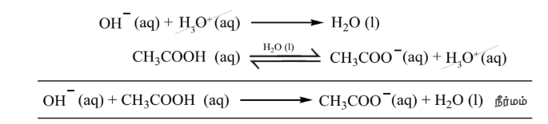

## 8.7 தாங்கல் கரைசல்

நமது உடலிலுள்ள இரத்தம், பலவிதமான அமில-கார செல்வினைகளுக்கு நடுவிலும் தன்னுடைய pH மதிப்பை மாறாமல் பராமரிக்கிறது என்பதை நீ அறிவாயா? அத்தகைய வினைகளில் ஹைட்ரோனியம் அயனிச் செறிவை மாறாமல் பராமரிப்பது சாத்தியமா? ஆம், தாங்கல் செயல்முறையின் காரணமாக இது சாத்தியமே.

தாங்கல் கரைசல் என்பது, ஒரு வலிமை குறைந்த அமிலம் மற்றும் அதன் இணை காரம் (அல்லது) ஒரு வலிமை குறைந்த காரம் மற்றும் இணை அமிலம் ஆகியவற்றைக் கொண்டுள்ள கரைசல் கலவையாகும். இந்த தாங்கல் கரைசலானது, சிறிதளவு அமிலம் அல்லது காரம் சேர்ப்பதினால் உருவாகும் தீவிர pH மாற்றத்தை தடுக்கிறது. மேலும், இந்த திறனானது தாங்கல் செயல்முறை என்றழைக்கப்படுகிறது. கார்பானிக் அமிலம் (\( \text{H}_2\text{CO}_3 \)) மற்றும் அதன் இணை காரம் \( \text{HCO}_3^- \) ஆகியவற்றை கொண்ட தாங்கல் கரைசல் நம் இரத்தத்தில் காணப்படுகிறது. இரண்டு வகையான தாங்கல் கரைசல்கள் உள்ளன. அவையாவன.

1. **அமில தாங்கல் கரைசல்:** ஒரு வலிமை குறைந்த அமிலம் மற்றும் அதன் உப்பு கொண்டுள்ள கரைசல். எடுத்துக்காட்டு: அசிட்டிக் அமிலம் மற்றும் சோடியம் அசிட்டேட் ஆகியவை கொண்டுள்ள கரைசல்.
2. **காரத் தாங்கல் கரைசல்:** ஒரு வலிமை குறைந்த காரம் மற்றும் அதன் உப்பு கரைந்துள்ள கரைசல். எடுத்துக்காட்டு: \( \text{NH}_4\text{OH} \) மற்றும் \( \text{NH}_4\text{Cl} \) ஆகியவை கரைந்துள்ள கரைசல்.

### 8.7.1 தாங்கல் செயல்முறை

அமிலம் (அல்லது) காரத்தை சேர்ப்பதினால் உண்டாகும் pH மாற்றத்தை தடுப்பதற்காகவும், சேர்க்கப்படும் அமிலம் அல்லது காரத்தை நடுநிலையாக்குவதற்காகவும், தாங்கல் கரைசலில் அமிலம் மற்றும் காரத்தன்மை கொண்ட சேர்மங்கள் இருந்தால் அவசியம். அதே நேரத்தில் இந்த சேர்மங்கள் ஒன்றுடன் ஒன்று வினைபுரிதல் கூடாது.

\( \text{CH}_3\text{COOH} \) மற்றும் \( \text{CH}_3\text{COONa} \) ஆகியவற்றைக் கொண்ட கரைசலின் தாங்கல் செயல்முறையை நாம் விளக்குவோம். தாங்கல் கரைசலிலுள்ள கூறுகள் கீழே காண்பிக்கப்பட்டுள்ளவாறு பிரிகையடைகின்றன.

\[
\text{CH}_3\text{COOH} (\text{aq}) \xrightleftharpoons{} \text{CH}_3\text{COO}^- (\text{aq}) + \text{H}^+ (\text{aq})
\]

\[
\text{CH}_3\text{COONa} (\text{S}) \xrightarrow{\text{H}_2\text{O(l)}} \text{CH}_3\text{-COO}^-_{(\text{aq})} + \text{Na}^+_{(\text{aq})}
\]

இக்கலவையுடன் அமிலத்தை சேர்க்கும்போது அந்த அமிலமானது, கரைசலிலுள்ள இணைக் காரம் \( \text{CH}_3\text{COO}^- \) உடன் வினைப்பட்டு பிரிகையடையாத வலிமை குறைந்த அமிலமாக மாறுகிறது. அதாவது, \( \text{H}^+ \) அயனிச் செறிவு அதிகரிப்பினால் கரைசலின் pH மதிப்பு பெரியளவு அதிகரிப்பதில்லை.

\[
\text{CH}_3\text{COO}^-_{(\text{aq})} + \text{H}^+_{(\text{aq})} \rightarrow \text{CH}_3\text{COOH} (\text{aq})
\]

இக்கலவையுடன் காரத்தை சேர்க்கும்போது அந்த காரமானது, கரைசலிலுள்ள \( \text{H}^+ \) அயனிகளால் நடுநிலையாக்கப்படுகின்றன. மேலும், சமநிலையை பராமரிக்க அசிட்டிக் அமிலம் மேலும் சிறிதளவு பிரிகையடைகிறது. எனவே pH மதிப்பில் குறிப்பிட்டளவு மாற்றம் ஏதும் ஏற்படுவதில்லை.

இந்த நடுநிலையாக்கல் வினைகள், பொது அயனி விளைவில் விவாதிக்கப்பட்ட வினைகளை ஒத்துள்ளன. 0.8 M \( \text{CH}_3\text{COOH} \) மற்றும் 0.8 M \( \text{CH}_3\text{COONa} \) கரைந்துள்ள ஒரு லிட்டர் தாங்கல் கரைசலுடன் 0.01 மோல் திண்ம சோடியம் ஹைட்ராக்சைடு சேர்ப்பதினால் உண்டாகும் வினையை ஆராய்வோம். \( \text{NaOH} \) சேர்ப்பதினால் உண்டாகும் கனஅளவு மாற்றத்தை ஒதுக்கத்தக்கதாக கருதுக. (கொடுக்கப்பட்டது: \( \text{CH}_3\text{COOH} \) அமிலத்தின் \( K_a \) மதிப்பு \( 1.8 \times 10^{-5} \))

\[
\text{CH}_3\text{-COOH} (\text{aq}) \xrightleftharpoons{\text{H}_2\text{O}} \text{CH}_3\text{COO}^- (\text{aq}) + \text{H}^+ (\text{aq})
\]
$$\text{0.8} - \alpha \qquad\qquad\ \alpha \qquad\ \alpha$$
\[
\text{CH}_3\text{COONa}(\text{aq}) \xrightarrow{\text{H}_2\text{O}} \text{CH}_3\text{COO}^- (\text{aq}) + \text{Na}^+ (\text{aq})
\]
$$\text{0.8} \qquad\qquad\qquad\ \ \text{0.8} \qquad\quad \text{0.8}$$
\( \text{CH}_3\text{COOH} \) அமிலத்தின் பிரிகை மாறிலி

\[
K_a = \frac{[\text{CH}_3\text{COO}^-][\text{H}^+]}{[\text{CH}_3\text{COOH}]}
\]

\[
[\text{H}^+] = K_a \frac{[\text{CH}_3\text{COOH}]}{[\text{CH}_3\text{COO}^-]}
\]

$$[\text{H}^+] \text{ செறிவு} \frac{[\text{CH}_3\text{COOH}]}{[\text{CH}_3\text{COO}^-]}$$

 க்கு நேர்விகிதத்தில் இருக்கும் என்பதை இந்த சமன்பாடு காட்டுகிறது.

\( \text{CH}_3\text{COOH} \) அமிலத்தின் பிரிகை வீதத்தை \( \alpha \) எனக் கொண்டால், \( [\text{CH}_3\text{COOH}] = 0.8 - \alpha \) மற்றும் \( [\text{CH}_3\text{COO}^-] = \alpha + 0.8 \)

\[
\therefore [\text{H}^+] = K_a \frac{(0.8 - \alpha)}{(0.8 + \alpha)}
\]

\[
\alpha \ll 0.8, \quad \therefore 0.8 - \alpha \approx 0.8 \text{ மற்றும் } 0.8 + \alpha \approx 0.8
\]

\[
[\text{H}^+] = \frac{K_a(0.8)}{(0.8)} \Rightarrow [\text{H}^+] = K_a
\]

\( \text{CH}_3\text{COOH} \) ன் \( K_a \) மதிப்பு \( 1.8 \times 10^{-5} \)

\[
\therefore [\text{H}^+] = 1.8 \times 10^{-5}; \quad \text{pH} = -\log(1.8 \times 10^{-5}) = 5 - \log 1.8 = 5 - 0.26 = 4.74
\]

1 லிட்டர் தாங்கல் கரைசலுடன் 0.01 மோல் \( \text{NaOH} \) ஐ சேர்த்தபின்பு pH ஐ கணக்கிடுக.

\( \text{NaOH} \) சேர்ப்பதினால் உண்டாகும் கன அளவு ஒதுக்கத்தக்கது. \( \therefore [\text{OH}^-] = 0.01 \) M.

\( \text{OH}^- \) அயனிகளின் நுகர்வு பின்வரும் சமன்பாடுகளால் விளக்கப்படுகிறது.

$$\text{CH}_3\text{COOH நீர் கரைசல்} \rightleftharpoons \text{CH}_3\text{COO}^-(aq) + \text{H}^+ \text{ நீர் கரைசல்}$$$$\text{0.8} - \alpha \qquad\qquad\qquad\qquad\quad \alpha \qquad\qquad\qquad\quad \alpha \qquad\quad$$

$$\text{CH}_3\text{COONa}(aq) \rightarrow \text{CH}_3\text{COO}^-(aq) + \text{Na}^+(aq)$$$$\text{0.8} \qquad\qquad\qquad\quad \text{0.8} \qquad\qquad\qquad \text{0.8}$$

\[
\text{CH}_3\text{COOH} + \text{OH}^- \rightarrow \text{CH}_3\text{COO}^- + \text{H}_2\text{O}
\]

\[
\therefore [\text{CH}_3\text{COOH}] = 0.8 - \alpha - 0.01 = 0.79 - \alpha
\]

\[
[\text{CH}_3\text{COO}^-] = \alpha + 0.8 + 0.01 = 0.81 + \alpha \quad \alpha \ll 0.8;
\]

\[
0.79 - \alpha \approx 0.79 \text{ மற்றும் } 0.81 + \alpha \approx 0.81
\]

\[
\therefore [\text{H}^+] = (1.8 \times 10^{-5}) \times \frac{0.79}{0.81} = 1.76 \times 10^{-5}
\]

\[
\therefore \text{pH} = -\log (1.76 \times 10^{-5}) = 5 - \log 1.76 = 5 - 0.25 = 4.75
\]

ஒரு வலிமை மிகு காரத்தை (0.01 M \( \text{NaOH} \)) சேர்ப்பதினால் pH குறைந்தளவு மட்டுமே அதிகரிக்கிறது. அதாவது 4.74 விருந்து 4.75 க்கு அதிகரிக்கிறது. எனவே தாங்கல் செயல்முறை சரிபார்க்கப்பட்டது.

**தன்மதிப்பீடு - 8**

அ) சம மோலார் அம்மோனியம் ஹைட்ராக்சைடு மற்றும் அம்மோனியம் குளோரைடு கொண்டுள்ள ஒரு காரத் தாங்கல் கரைசலின் தாங்கல் செயல்முறையை விளக்குக.

ஆ) 0.4 M \( \text{CH}_3\text{COOH} \) மற்றும் 0.4 M \( \text{CH}_3\text{COONa} \) ஆகியவற்றைக் கொண்டுள்ள ஒரு தாங்கல் கரைசலின் pH மதிப்பை கணக்கிடுக. 500 ml மேற்கண்ட கரைசலுடன் 0.01 மோல் \( \text{HCl} \) ஐ சேர்த்த பின்பு pH ல் மாற்றம் என்ன? (\( K_a = 1.8 \times 10^{-5} \)) \( \text{HCl} \) ஐ சேர்ப்பதினால் ஏற்படும் கன அளவு மாற்றத்தை ஒதுக்கத்தக்கதாக கருதுக.

### 8.7.2 தாங்கல் திறன் மற்றும் தாங்கல் எண்

தாங்கல் கரைசலாக செயல்படும் தன்மையை, தாங்கல் திறன் எனும் மதிப்பால் அளக்க முடியும். ஒரு கரைசலின் தாங்கல் திறனை எண்ணியலாக வெளிப்படுத்துவதற்காக வாண்ஸ்லைக் என்பவர் தாங்கல் எண் \( \beta \) என்றழைக்கப்படும் மதிப்பை அறிமுகப்படுத்தினார். தாங்கல் திறன் என்பது, ஒரு லிட்டர் தாங்கல் கரைசலின் pH மதிப்பை ஓரலகு மாற்றுவதற்காக, அக்கரைசலுடன் சேர்க்கப்படும் அமிலம் அல்லது காரத்தின் கிராம் சமானங்களின் எண்ணிக்கை என வரையறுக்கப்படுகிறது.

\[
\beta = \frac{dB}{d(\text{pH})} \qquad (8.19)
\]

இங்கு, \( dB \) = ஒரு லிட்டர் தாங்கல் கரைசலுடன் சேர்க்கப்பட்ட அமிலம் அல்லது காரத்தின் கிராம் சமானங்களின் எண்ணிக்கை, \( d(\text{pH}) \) = அமிலம் அல்லது காரம் சேர்க்கப்பட்ட பின்னர் pH ல் ஏற்படும் மாற்றம்.

### 8.7.3 ஹென்டர்சன் – ஹேசல்பாக் சமன்பாடு

ஒரு அமில தாங்கல் கரைசலில் உள்ள ஹைட்ரோனியம் அயனிச் செறிவானது, கரைசலில் உள்ள வலிமை குறைந்த அமிலத்தின் செறிவு மற்றும் அதன் இணைக் காரத்தின் செறிவு ஆகியவற்றிற்கிடையே உள்ள விகிதத்தை சார்ந்திருக்கும் என்பதை நாம் முன்னரே கற்றறிந்தோம்.

$$[\text{H}_3\text{O}^+] = \text{K}_\text{a} \frac{[\text{அமிலம்}]_{\text{eq}}}{[\text{காரம்}]_{\text{eq}}} \qquad (8.20) $$

வலிமை குறைந்த அமிலமானது மிகக் குறைந்தளவு மட்டுமே பிரிகையடைகிறது. மேலும், பொது அயனி விளைவின் காரணமாக, பிரிகையடைதல் மேலும் குறைகிறது. எனவே, அமிலத்தின் சமநிலை செறிவானது, அயனியுறா அமிலத்தின் துவக்கச் செறிவிற்கு ஏறத்தாழ் சமமாக உள்ளது. இதே போல, இணைக் காரத்தின் செறிவானது, சேர்க்கப்பட்ட உப்பின் துவக்கச் செறிவிற்கு ஏறத்தாழ் சமமாக உள்ளது.

\[
[\text{H}_3\text{O}^+] = K_a \frac{[\text{அமிலம்}]}{[\text{உப்பு}]} \qquad (8.21)
\]

இங்கு \( [\text{அமிலம்}] \) மற்றும் \( [\text{உப்பு}] \) ஆகியன முறையே தாங்கல் கரைசல்கள் தயாரிக்க பயன்படுத்தப்பட்ட அமிலம் மற்றும் உப்பின் துவக்கச் செறிவுகளாகும்.

சமன்பாட்டின் இருமுறையும் மடக்கை எடுக்கும் போது

\[
\log [\text{H}_3\text{O}^+] = \log K_a + \log \frac{[\text{அமிலம்}]}{[\text{உப்பு}]} \qquad (8.22)
\]

இருமுறையும் குறியீடு மாற்றம் செய்யும்போது

\[
-\log [\text{H}_3\text{O}^+] = -\log K_a - \log \frac{[\text{அமிலம்}]}{[\text{உப்பு}]} \qquad (8.23)
\]

\[
\text{pH} = -\log [\text{H}_3\text{O}^+] \text{ மற்றும் } \text{p}K_a = -\log K_a
\]

\[
\Rightarrow \text{pH} = \text{p}K_a - \log \frac{[\text{அமிலம்}]}{[\text{உப்பு}]} \qquad (8.24)
\]

\[
\Rightarrow \text{pH} = \text{p}K_a + \log \frac{[\text{உப்பு}]}{[\text{அமிலம்}]} \qquad (8.25)
\]

இதே போன்று ஒரு காரத் தாங்கல் கரைசலில்

\[
\text{pOH} = \text{p}K_b + \log \frac{[\text{உப்பு}]}{[\text{காரம்}]} \qquad (8.26)
\]

#### எடுத்துக்காட்டு 8.6

0.20 மோல் லிட்டர்\(^{-1}\) சோடியம் அசிட்டேட் மற்றும் 0.18 மோல் லிட்டர்\(^{-1}\) அசிட்டிக் அமிலம் ஆகியவை கலந்துள்ள ஒரு தாங்கல் கரைசலின் pH மதிப்பை கணக்கிடுக. அசிட்டிக் அமிலத்தின் \( K_a \) மதிப்பு \( 1.8 \times 10^{-5} \).

\[
\text{pH} = \text{p}K_a + \log \frac{[\text{உப்பு}]}{[\text{காரம்}]}
\]

கொடுக்கப்பட்டது \( K_a = 1.8 \times 10^{-5} \)

\[
\therefore \text{p}K_a = -\log(1.8 \times 10^{-5}) = 5 - \log 1.8 = 5 - 0.26 = 4.74
\]

\[
\therefore \text{pH} = 4.74 + \log \frac{0.20}{0.18} = 4.74 + \log \frac{10}{9} = 4.74 + \log 10 - \log 9 = 4.74 + 1 - 0.95 = 5.74 - 0.95 = 4.79
\]

#### எடுத்துக்காட்டு 8.7

500 ml கனஅளவுள்ள நீரில், 6 கிராம் அசிட்டிக் அமிலம் மற்றும் 8.2 கிராம் சோடியம் அசிட்டேட் ஆகியவற்றை நீரில் கரைத்து பெறப்பட்ட கரைசலின் pH மதிப்பு என்ன? (கொடுக்கப்பட்டது அசிட்டிக் அமிலத்தின் \( K_a \) மதிப்பு \( 1.8 \times 10^{-5} \))

ஹென்டர்சன் – ஹேசல்பாக் சமன்பாட்டின்படி,

\[
\text{pH} = \text{p}K_a + \log \frac{[\text{உப்பு}]}{[\text{அமிலம்}]}
\]

\[
\text{p}K_a = -\log K_a = -\log(1.8 \times 10^{-5}) = 4.74 \quad (\text{எடுத்துக்காட்டு 8.6-ஐ காண்க})
\]

\[
[\text{உப்பு}] = \frac{\text{சோடியம் அசிட்டேட்டின் மோல்களின் எண்ணிக்கை}}{\text{கரைசலின் கன அளவு (litre)}}
\]

சோடியம் அசிட்டேட்டின் மோல்களின் எண்ணிக்கை = \( \frac{8.2}{82} = 0.1 \)

\[
\therefore [\text{உப்பு}] = \frac{0.1 \text{ mole}}{\frac{1}{2} \text{ Litre}} = 0.2 \text{ M}
\]

\[
[\text{அமிலம்}] = \frac{\frac{6}{60}}{\frac{1}{2}} = 0.2 \text{ M}
\]

\[
\therefore \text{pH} = 4.74 + \log \frac{0.2}{0.2} = 4.74 + \log 1 = 4.74 + 0 = 4.74
\]

**தன்மதிப்பீடு - 9**

a) 0.1 M \( \text{NH}_4\text{OH} \) கரைசல் மற்றும் அம்மோனியம் குளோரைடு படிகங்கள் உன்னிடம் கொடுக்கப்பட்டால், pH = 9 எனக் கொண்ட தாங்கல் கரைசலை எவ்வாறு தயாரிப்பாய்? ( \( 25^\circ \text{C} \) ல் \( \text{NH}_4\text{OH} \) ன் \( \text{p}K_b \) மதிப்பு 4.7 ).

b) 100 ml 0.8 M ஃபார்மிக் அமிலத்துடன் எவ்வளவு கன அளவு 0.6 M சோடியம் ஃபார்மேட் கரைசல் கலந்து pH மதிப்பு 4.0 கொண்ட ஒரு தாங்கல் கரைசலை தயாரிப்பாய். (ஃபார்மிக் அமிலத்தின் \( \text{p}K_a \) மதிப்பு 3.75.)
