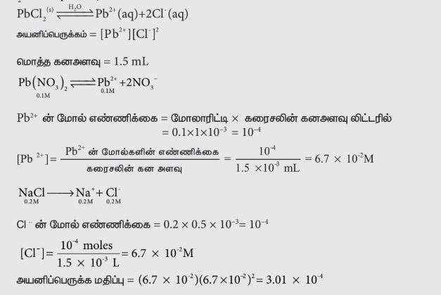

## 8.9 கரைதிறன் பெருக்கம்

கனிமப் பண்பறி பகுப்பாய்வில், பல்வேறு வீழ்படிவாதல் வினைகளை, நாம் கடந்து வந்துள்ளோம். எடுத்துக்காட்டாக, நீரில் மிகக்குறைந்தளவே கரையும் தன்மையை பெற்றுள்ள, \( \text{PbCl}_2 \) விருந்து \( \text{Pb}^{2+} \) அயனிகளை வீழ்படிவாக்குவதற்கு நீர்த்த \( \text{HCl} \) பயன்படுத்தப்படுகிறது. நீண்ட காலத்திற்கு \( \text{Ca}^{2+} \) (கால்சியம் ஆக்ஸலேட் போன்றவை) அயனிகள் வீழ்படிவாதல் சிறுநீரக கற்கள் உருவாகின்றன. வீழ்படிவாதலை புரிந்து கொள்வதற்காக, மிகக் குறைந்தளவு கரையும் உப்பு மற்றும் கரைசலிலுள்ள அதன் அயனிகள் ஆகியவற்றிற்கிடையே நிலவும் கரைதிறன் சமநிலையை கருதுவோம்.

\( X_m Y_n \) எனும் ஒரு பொதுவான உப்பிற்கு,

$$\text{X}_\text{m}\text{Y}_\text{n}\text{(s)} \overset{\text{H}_2\text{O}}{\rightleftharpoons} \text{mX}^{\text{n}+}\text{(aq)} + \text{nY}^{\text{m}-}\text{(aq)}$$

மேற்கண்ட வினைக்கான சமநிலை மாறிலி

\[
K = \frac{[X^{n+}]^m [Y^{m-}]^n}{[X_m Y_n]}
\]

கரைதிறன் சமநிலையில், சமநிலை மாறிலியானது கரைதிறன் பெருக்க மாறிலி (அல்லது) கரைதிறன் பெருக்கம் என குறிப்பிடப்படுகிறது.

இத்தகைய பலபடித்தான சமநிலையில், திண்மப் பொருளின் செறிவு ஒரு மாறிலியாகும், எனவே அது சமன்பாட்டிலிருந்து நீக்கப்படுகிறது.

\[
K_{sp} = [X^{n+}]^m [Y^{m-}]^n
\]

சமன்படுத்தப்பட்ட சமநிலை சமன்பாட்டிலுள்ள வேதிவினைக்கூறு குணகங்களை அடுக்குகளாக கொண்ட, பகுதிக்கூறு அயனிகளின், மோலார் செறிவுகளின் பெருக்குத்தொகை கரைதிறன் பெருக்கம் என வரையறுக்கப்படுகிறது.

குறிப்பிட்ட அயனிச் சேர்மத்தின் பகுதிக்கூறு அயனிகளைக் கொண்டுள்ள கரைசல்களை ஒன்றாக கலக்கும்போது அந்த அயனிச் சேர்மம் வீழ்படிவாகுமா? என்பதை தீர்மானிக்க இந்த கரைதிறன் பெருக்க மதிப்புகள் உதவுகின்றன.

பகுதிக்கூறு அயனிகளின் மோலார் செறிவுகளின் பெருக்கற்பலன், அதாவது அயனிப் பெருக்க மதிப்பானது, கரைதிறன் பெருக்க மதிப்பை விட அதிகமாக உள்ள போது சேர்மம் வீழ்படிவாகிறது.

கரைதிறன் பெருக்கம் மற்றும் அயனிப் பெருக்கம் இரண்டிற்கான சமன்பாடுகளும் ஒரே மாதிரியாக உள்ளன, ஆனால், கரைதிறன் பெருக்க சமன்பாட்டில் உள்ள மோலார் செறிவுகளானவை சமநிலை செறிவுகளை குறிப்பிடுகின்றன. மேலும், அயனிப் பெருக்க சமன்பாட்டில் துவக்கச் செறிவுகள் (அல்லது) ஒரு குறிப்பிட்ட நேரம் ‘t’ யில் உள்ள செறிவுகள் பயன்படுத்தப்படுகின்றன.

பொதுவாக, இதை கீழ்காணுமாறு சுருக்கமாக கூறலாம்,

* அயனிப் பெருக்கம் > \( K_{sp} \), மீதெவிட்டிய கரைசல், வீழ்படிவாதல் நிகழும்.
* அயனிப் பெருக்கம் < \( K_{sp} \), தெவிட்டாத கரைசல், வீழ்படிவாதல் நிகழாது.
* அயனிப் பெருக்கம் = \( K_{sp} \), தெவிட்டிய கரைசல், சமநிலை நிலவுகிறது.

#### எடுத்துக்காட்டு 8.9

1 mL 0.1 M லெட் நைட்ரேட் கரைசல் மற்றும் 0.5 mL 0.2 M \( \text{NaCl} \) கரைசல் ஆகியவற்றை ஒன்றாக கலக்கும்போது லெட் குளோரைடு வீழ்படிவாகுமா? வீழ்படிவாகாதா? என கண்டறிக. \( \text{PbCl}_2 \) இன் \( K_{sp} \) மதிப்பு \( 1.2 \times 10^{-5} \).

அயனிப் பெருக்க மதிப்பு \( 3.01 \times 10^{-4} \) ஆனது கரைதிறன் பெருக்க மதிப்பை (\( 1.2 \times 10^{-5} \)) விட அதிகமாக இருப்பதால் \( \text{PbCl}_2 \) வீழ்படிவாகிறது.

### 8.9.1 மோலார் கரைதிறன் மதிப்பிலிருந்து கரைதிறன் பெருக்க மதிப்பை நிர்ணயித்தல்

கரைதிறன் பெருக்க மதிப்பை மோலார் கரைதிறன் மதிப்பிலிருந்து கணக்கிட முடியும். மோலார் கரைதிறன் என்பது ஒரு லிட்டர் கரைசலில் கரையக்கூடிய கரைபொருளின் அதிகபட்ச மோல் எண்ணிக்கை ஆகும். \( X_m Y_n \) எனும் கரைபொருளுக்கு,

\[
X_m Y_n (s) \rightleftharpoons m X^{n+} (\text{aq}) + n Y^{m-} (\text{aq})
\]

மேற்காண் விகிதக்கூறு சமன்படுத்தப்பட்ட சமன்பாட்டிலிருந்து, 1 மோல் \( X_m Y_n (s) \) பிரிகையடைந்து ‘m’ மோல்கள் \( X^{n+} \) அயனிகளையும், ‘n’ மோல்கள் \( Y^{m-} \) அயனிகளையும், உருவாக்குகிறது என்பதை நாம் அறிகிறோம். ‘s’ என்பது \( X_m Y_n \) இன் மோலார் கரைதிறன் எனில்

\[
[X^{n+}] = ms \quad \text{மற்றும்} \quad [Y^{m-}] = ns
\]

\[
\therefore K_{sp} = [X^{n+}]^m [Y^{m-}]^n = (ms)^m (ns)^n = (m)^m (n)^n (s)^{m+n}
\]

#### எடுத்துக்காட்டு 8.10

பின்வருவனவற்றிற்கு, கரைதிறன் பெருக்கம் மற்றும் மோலார் கரைதிறன் ஆகியவற்றிற்கிடையே உள்ள தொடர்பை நிறுவுக.

a) \( \text{BaSO}_4 \)

$$\text{BaSO}_4\text{(s)} \overset{\text{H}_2\text{O}}{\rightleftharpoons} \text{Ba}^{2+}\text{(aq)} + \text{SO}_4^{2-}\text{(aq)}$$

\[
K_{sp} = [\text{Ba}^{2+}][\text{SO}_4^{2-}] = (s)(s) = s^2
\]

b) \( \text{Ag}_2\text{CrO}_4 \)

$$\text{Ag}_2\text{CrO}_4\text{(s)} \overset{\text{H}_2\text{O}}{\rightleftharpoons} 2\text{Ag}^+\text{(aq)} + \text{CrO}_4^{2-}\text{(aq)}$$

\[
K_{sp} = [\text{Ag}^+]^2 [\text{CrO}_4^{2-}] = (2s)^2 (s) = 4s^3
\]

---

## பாடச்சுருக்கம்

* அரீனியஸ் கூற்றுப்படி, அமிலம் என்பது, நீர்க்கரைசலில் பிரிகையடைந்து ஹைட்ரஜன் அயனிகளை தரவல்ல ஒரு சேர்மமாகும்.

* லெளரி – ப்ரான்ஸ்டட் கொள்கை அவர்களின் கொள்கைப்படி, அமிலம் என்பது மற்றொரு பொருளுக்கு ஒரு புரோட்டானை வழங்கக்கூடிய ஒரு பொருளாகும். காரம் என்பது மற்றொரு பொருளிலிருந்து ஒரு புரோட்டானை ஏற்கக்கூடிய ஒரு பொருளாகும்.

* லூயி கொள்கை கருத்துப்படி, எலக்ட்ரான் இரட்டையை ஏற்றுக்கொள்ளும் பொருள் அமிலம். ஆனால், காரம் என்பது எலக்ட்ரான் இரட்டையை வழங்கும் பொருளாகும்.

* நீரின் அயனிப் பெருக்கம் \( K_w = [\text{H}_3\text{O}^+] [\text{OH}^-] \)

* ஒரு கரைசலின் pH என்பது அக்கரைசலில் உள்ள ஹைட்ரஜன் அயனிகளின், மோலார் செறிவின், 10ஐ அடிப்படையாக கொண்ட எதிர்குறி மடக்கை என வரையறுக்கப்படுகிறது. \( \text{pH} = -\log_{10} [\text{H}_3\text{O}^+] \)

* நீர்த்தல் அதிகரிக்கும்போது, ஒரு வலிமை குறைந்த மின்பகுளியின் பிரிகை வீதமும் அதிகரிக்கிறது” எனும் முடிவுக்கு நம்மால் வரமுடியும். இந்த கூற்றானது ஆஸ்வால்ட் நீர்த்தல் விதி என அறியப்படுகிறது.

* வலிமை குறைந்த மின்பகுளியுடன், ஒரு பொது அயனியை கொண்டுள்ள உப்பை (\( \text{CH}_3\text{COONa} \)) சேர்க்கும்போது அந்த வலிமை குறைந்த மின்பகுளியின் (\( \text{CH}_3\text{COOH} \)) பிரிகை வீதம் குறைகிறது. இது பொது அயனி விளைவு என்றழைக்கப்படுகிறது.

* தாங்கல் கரைசல் என்பது, ஒரு வலிமை குறைந்த அமிலம் மற்றும் அதன் இணைக் காரம் (அல்லது) ஒரு வலிமை குறைந்த காரம் மற்றும் இணை அமிலம் ஆகியவற்றைக் கொண்டுள்ள கரைசல் கலவையாகும்.

* சமன்படுத்தப்பட்ட சமநிலை சமன்பாட்டிலுள்ள வேதிவினைக்கூறு குணகங்களை அடுக்குகளாக கொண்ட, பகுதிக்கூறு அயனிகளின், மோலார் செறிவுகளின் பெருக்குத்தொகை கரைதிறன் பெருக்கம் என வரையறுக்கப்படுகிறது.

* தாங்கல் திறன் என்பது, ஒரு லிட்டர் தாங்கல் கரைசலின் pH மதிப்பை ஓரலகு மாற்றுவதற்காக, அக்கரைசலுடன் சேர்க்கப்படும் அமிலம் அல்லது காரத்தின் கிராம் சமானங்களின் எண்ணிக்கை என வரையறுக்கப்படுகிறது.

\[
\beta = \frac{dB}{d(\text{pH})}
\]

* ஹென்டர்சன் – ஹேசல்பாக் சமன்பாடு pH, அமிலத் தாங்கல் கரைசலில்

\[
\text{pH} = \text{p}K_a + \log \frac{[\text{உப்பு}]}{[\text{அமிலம்}]}
\]

காரத் தாங்கல் கரைசலில்

\[
\text{pOH} = \text{p}K_b + \log \frac{[\text{உப்பு}]}{[\text{காரம்}]}
\]

* வலிமை மிகு காரம் மற்றும் வலிமை குறைந்த அமிலத்தின் உப்புகளை நீராற்பகுத்தல்

\[
K_h \cdot K_a = K_w
\]

\[
\text{pH} = 7 + \frac{1}{2} \text{p}K_a + \frac{1}{2} \log C
\]

* வலிமை மிகு அமிலம் மற்றும் வலிமை குறைந்த காரத்தின் உப்பு நீராற்பகுத்தலில் விவாதிக்கப்பட்டதைப் போன்றே, இந்த நேர்விலும், \( K_h \) மற்றும் \( K_b \) க்கு இடையேயுள்ள தொடர்பை நம்மால் நிறுவ முடியும். \( K_h \cdot K_b = K_w \)

\[
\text{pH} = 7 - \frac{1}{2} \text{p}K_b - \frac{1}{2} \log C
\]

* வலிமை குறைந்த அமிலம் மற்றும் வலிமை குறைந்த காரத்தின் உப்புகளை நீராற்பகுத்தல்.

\[
K_a \cdot K_b \cdot K_h = K_w
\]

\[
\text{pH} = 7 + \frac{1}{2} \text{p}K_a - \frac{1}{2} \text{p}K_b
\]
