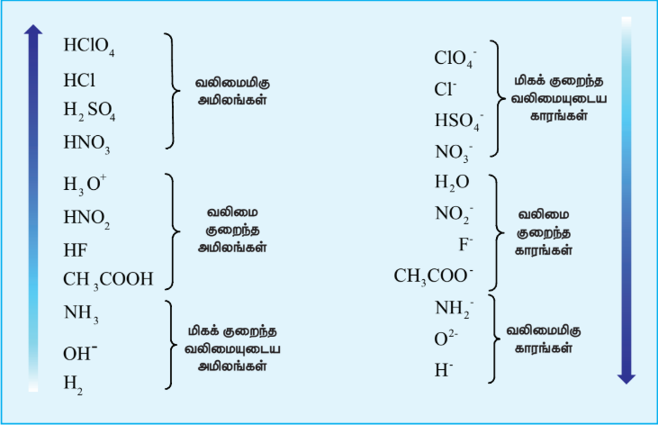

## 8.2 அமிலங்கள் மற்றும் காரங்களின் வலிமை:

ஒரு மோல் சேர்மத்தை \( \text{H}_2\text{O} \) ல் கரைக்கும்போது உருவாகும் \( \text{H}_3\text{O}^+ \) அல்லது \( \text{H}^+ \) அயனிகளின் செறிவைக் கொண்டு அமிலங்கள் மற்றும் காரங்களின் வலிமை நிர்ணயிக்கப்படுகிறது. பொதுவாக, அமிலங்கள் மற்றும் காரங்களை வலிமை மிகுந்தவை அல்லது வலிமை குறைந்தவை என வகைப்படுத்தலாம். வலிமைமிக்க அமிலம் என்பது நீரில் முழுமையாக பிரிகையடைகிறது. வலிமை குறைந்த அமிலம் பகுதியளவே நீரில் பிரிகையடைகிறது.

பின்வரும் பொதுவான சமநிலையை கருத்திற்கொண்டு ஒரு அமிலத்தின் (HA) வலிமையை கணிதவியலாக வரையறுப்போம்.

\[
\text{HA} + \text{H}_2\text{O} \rightleftharpoons \text{H}_3\text{O}^+ + \text{A}^-
\]
\[
\text{அமிலம்}_1 \quad \text{காரம்}_1 \quad \text{அமிலம்}_2 \quad \text{அமிலம்}_1
\]

மேற்காண் அயனியாதல் வினைக்கான சமநிலை மாறிலி பின்வரும் சமன்பாட்டால் குறிப்பிடப்படுகிறது.

\[
K = \frac{[\text{H}_3\text{O}^+][\text{A}^-]}{[\text{HA}][\text{H}_2\text{O}]} \qquad \dots \dots (8.1)
\]

மேற்காண் சமன்பாட்டில், \( \text{H}_2\text{O} \) மிக அதிகளவில் உள்ளதாலும், அடிப்படையில் மாறாமல் உள்ளதாலும் அதன் செறிவை நாம் ஒதுக்கிவிட முடியும்.

\[
K_a = \frac{[\text{H}_3\text{O}^+][\text{A}^-]}{[\text{HA}]} \qquad \dots \dots (8.2)
\]

இங்கு, \( K_a \) என்பது அமிலத்தின் அயனியாதல் மாறிலி அல்லது பிரிகை மாறிலி என்றழைக்கப்படுகிறது. ஒரு அமிலத்தின் வலிமையை இது அளக்கிறது. \( \text{HCl} \), \( \text{HNO}_3 \) போன்ற அமிலங்கள் ஏறக்குறைய முழுமையாக அயனியுறுகின்றன. எனவே அவை உயர் \( K_a \) மதிப்புகளை (\( 25^\circ \text{C} \) ல் \( \text{HCl} \) இன் \( K_a \) மதிப்பு \( 2 \times 10^6 \)) பெற்றுள்ளன. ஃபார்மிக் அமிலம் (\( 25^\circ \text{C} \) ல் \( K_a = 1.8 \times 10^{-4} \)), அசிட்டிக் அமிலம் (\( 25^\circ \text{C} \) ல் \( K_a = 1.8 \times 10^{-5} \)) போன்ற அமிலங்கள் கரைசலில் பகுதியளவே அயனியுறுகின்றன. இத்தகைய நேர்வுகளில், அயனியுறா அமில மூலக்கூறுகளுக்கும், பிரிகையடைந்த அயனிகளுக்கும் இடையே ஒரு சமநிலை நிலவுகிறது. பொதுவாக, பத்தை விட அதிகமான \( K_a \) மதிப்பை கொண்ட அமிலங்கள் வலிமை மிகு அமிலங்கள் எனவும், ஒன்றைவிட குறைவான \( K_a \) மதிப்பை கொண்ட அமிலங்கள் வலிமை குறைந்த அமிலங்கள் எனவும் கருதப்படுகின்றன.

நீர்க்கரைசலில் \( \text{HCl} \) பிரிகையடைதலை கருதுவோம்.

\[
\text{HCl} + \text{H} - \text{OH} \rightleftharpoons \text{H}_3\text{O}^+ + \text{Cl}^-
\]
\[
\text{அமிலம்}_1 \quad \text{காரம்}_2 \quad \text{அமிலம்}_2 \quad \text{காரம்}_1
\]

முன்னர் விவாதித்தபடி, முழுமையான பிரிகையடைதலால், சமநிலையானது ஏறக்குறைய 100% வலப்புறமாக நகர்ந்துள்ளது. அதாவது, \( \text{H}_3\text{O}^+ \) விடமிருந்து ஒரு புரோட்டானை \( \text{Cl}^- \) அயனி ஏற்றுக்கொள்ளும் திறன் ஒதுக்கத்தக்கது. ஒரு வலிமை மிகு அமிலத்தின் இணை காரம் ஒரு வலிமை குறைந்த காரமாகும் மற்றும் இதன் மறுதலையும் சரியானதாகும்.

இணை அமிலம் – கார இரட்டைகளின் ஒப்பு வலிமையை பின்வரும் அட்டவணை விளக்குகிறது.

