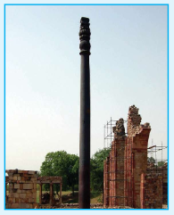

## 1.7 உலோகங்களின் பயன்கள்

### 1.7.1 அலுமினியத்தின் பயன்பாடுகள் (Al)

- அலுமினியமானது புவிப்பரப்பில் அதிக அளவில் கிடைக்கும் ஒரு உலோகம். இது ஒரு அதி வெப்ப மற்றும் மின் கடத்தியாகும். மேலும் இது எளிதில் அரிமானம் அடைவதில்லை. இதன் பயன்பாடுகள் பின்வருமாறு.
- நம் அன்றாட வாழ்வில் அதிக அளவில் பயன்படும் சமையல் கலன்கள், வெப்பப் பரிமாற்றி ஆகியன தயாரித்தலில் அலுமினியம் பயன்படுகிறது.
- அலுமினியத்தால் உணவுப் பொருட்களை எடுத்துச் செல்வதற்கும் பொருளாக பயன்படுகிறது.
- இது ஒரு மென்மையான உலோகமாகும். எனினும் இது காப்பர், மாங்கனீசு, மக்னீசியம் மற்றும் சிலிக்கான் போன்ற உலோகங்களுடன் சேர்ந்து குறைவான எடையும் வலிமையும் உடைய உலோகக் கலவைகளைத் தருகிறது. இவை ஆகாய விமானங்கள் மற்றும் பிற போக்குவரத்து வாகனங்களை வடிவமைப்பதில் பயன்படுகிறது. அலுமினியம் எளிதாக அரிமானம் அடைவதில்லை. எனவே, இது வேதி உலைகள், மருத்துவ உபகரணங்கள், குளிர் சாதனப் பொருட்கள் மற்றும் வாயுக்களை எடுத்துச் செல்லும் குழாய்கள் ஆகியனவற்றில் பயன்படுத்தப்படுகிறது. அலுமினியம் விலை குறைவான வெப்பத்தை நன்கு கடத்தும் ஒரு உலோகம். எனவே, இது இரும்பு உள்ளகத்துடன் கூடிய உயர் அழுத்த மின்கம்பிகளில் பயன்படுகிறது.

### 1.7.2 துத்தநாகத்தின் பயன்பாடுகள் (Zn)

* எஃகு மற்றும் இரும்பு அமைப்புகள் அரிமானம் மற்றும் துருப்பிடிக்காமல் பாதுகாக்கும் துத்தநாகப் பூச்சில் (Galvanizing) இது பயன்படுகிறது. மேலும், துத்தநாகம் மோட்டார் வாகன அச்சுவார்ப்பு மற்றும் மின் சாதன பொருட்களில் பயன்படுகிறது. பெயின்ட், ரப்பர், அழகு சாதனப் பொருட்கள், மருந்துப் பொருட்கள், நெகிழிகள், மை, மின்கலன்கள் போன்ற பல பொருட்கள் தயாரிப்பதற்கு துத்தநாக ஆக்சைடு பயன்படுகிறது.
* ஒளிரும் பெயின்ட், ஒளிரும் விளக்குகள் மற்றும் X – கதிர் திரை ஆகியன தயாரிப்பில் துத்தநாக சல்பைடு பயன்படுகிறது. துத்தநாகத்தின் உலோகக் கலவையான பித்தளை (brass) அரிமானம் அடையாத தன்மையினைப் பெற்றிருப்பதால் குழாய் வால்வுகள் மற்றும் தகவல் தொடர்பு சாதனங்களின் தயாரிப்பில் பயன்படுகிறது.

### 1.7.3 இரும்பின் பயன்கள் (Fe)

* இரும்பானது மிக அதிக பயன்களைக் கொண்டுள்ள உலோகமாகும் மற்றும் இதன் உலோகக் கலவைகள் பல்வேறு பயன்பாடுகளைக் கொண்டுள்ளன. பாலங்கள், உயர்மின்னழுத்த கோபுரங்கள், மிதிவண்டி சங்கிலிகள், நறுக்க பயன்படும் உபகரணங்கள் மற்றும் துப்பாக்கி குழாய் போன்ற பல வகைகளில் பயன்படுகிறது. வார்ப்பிரும்பானது குழாய்கள், வால்வுகள், எரிபொருள் காற்றடைப்பு அடிப்புகள் ஆகியன தயாரிக்கப் பயன்படுகிறது.
* இரும்பு, அதன் உலோகக் கலவைகள் மற்றும் அதன் சேர்மங்கள் காந்தங்களை தயாரிக்கப் பயன்படுகிறது.
* துருப்பிடிக்காத எஃகு ஆனது அதிக அளவில் அரிமானத்திற்குட்படாததால் இது கட்டிடத்தொழிலிலும், தாங்கிகள், முனை மடிக்கும் உளிகள், வெல்ட் கருவிகள், நகை பொருட்கள் மற்றும் அறுவை சிகிச்சைக்கு பயன்படும் கருவிகள் தயாரிக்கவும் பயன்படுகிறது. நிக்கல் எஃகு ஆனது கம்பிவடங்கள் (cables) மோட்டார் வாகன மற்றும் விமான பகுதிப் பொருட்களின் தயாரிப்பில் பயன்படுகின்றது. குரோம் எஃகு ஆனது வெல்ட்கருவிகள் மற்றும் நொறுக்கும் எந்திரங்கள் தயாரிப்பில் பயன்படுகிறது.

### 1.7.4 தாமிரத்தின் பயன்கள் (Cu)

* முதன் முதலில் மனிதர்களால் பயன்படுத்தப்பட்ட உலோகம் தாமிரம் ஆகும். மேலும் இதன் உலோகக் கலவையான வெண்கலத்தின் பயன்பாட்டினால் 'வெண்கலக் காலம்' என்ற ஒரு சகாப்தம் உருவாக இது காரணமாக அமைந்தது.
* தாமிரமானது, தங்கம் மற்றும் பிற உலோகங்களோடு இணைந்து நாணயங்கள், நகைப்பொருட்கள் போன்றவை தயாரிக்கப் பயன்படுகிறது. தாமிரம் மற்றும் இதன் உலோகக் கலவைகள் ஆகியன மின்கம்பிகள், நீர் செல்லும் குழாய்கள் மற்றும் பல மின் பொருள்களின் பாகங்கள் தயாரிப்பில் பயன்படுகின்றன.

### 1.7.5 தங்கத்தின் பயன்பாடுகள் (Au)

* தங்கம் ஒரு அதிக விலையுயர்ந்த பொருளாகும். இது நாணயங்கள் தயாரிக்கப் பயன்படுகின்றது. மேலும் சில நாடுகளில் பணமதிப்பானது தங்கத்தின் மதிப்பில் கணக்கிடப்படுகின்றது. தாமிரத்துடன் தங்கம் சேர்த்து உருவாக்கப்பட்ட தங்க உலோகக் கலவையானது நகை தயாரிப்பில் அதிக அளவு பயன்படுத்தப்படுகின்றது. இது பிற உலோகங்களின் மீது தங்க மின்முலாம் பூசுவதற்குப் பயன்படுகிறது. இவ்வாறு தங்க முலாம் பூசப்பட்ட பொருட்கள், கைக்கடிகாரங்கள், செயற்கை மூடிகள், விலைகுறைந்த நகைகள், பல் பாதுகாப்பில் பல் நிரம்புதல் மற்றும் மின் இணைப்புகள் ஆகியனவற்றில் பயன்படுகிறது.
* தங்க நானோதுகள்கள், சோளர் செல்களின் திறனை அதிகரிக்கவும், வினை வேக மாற்றியாகவும் பயன்படுகின்றது.

> **டெல்வி – இரும்புத் தாண்**
>
> டில்வியில் அமைந்துள்ள அசோகா தாண் என்றமைக்கப்படும், இரும்புத்தாண் 23 அடி 8 அங்குலம் உயரமும் 16 அங்குலம் அகமும் சுமார் 6000 kg எடையினையும் கொண்டது.
> 
> இத்தாண் சுமாராக 1600 ஆண்டுகள் பழமையானதாக இருந்தக்கூடும் என அறியப்படுகின்றது. இதில் உள்ள இரும்பானது பல நூறு ஆண்டுகளுக்கு முன்னரே துருப்பிடித்திருக்க வேண்டும். இருந்த போதிலும், கடந்த 1600 ஆண்டுகளாக துருப்பிடிக்காமல் இத்தாண் இருப்பது நமது பழங்கால இந்தியர்களின் அறிவு மற்றும் அழகிய நட்பத்திறன்களுக்கு சான்றாக விளங்கி வருகிறது. ஒருங்கமைவு அடையாத இரும்பு மற்றும் கச்சா இரும்பின் சிக்கலான கலவையால் ஆன ஒரு பாதுகாப்பு அடுக்கானது பல்வேறு பருவகால சுற்றுச்சூழலின் விளைவாக தாணின் மீது உருவாகியுள்ளது. இது மிசாலைப் எனப்படும் இரும்பு, ஆக்சிஜன் மற்றும் வைப்பத்தனால் ஆன துருப்பிடிக்கும் தன்மையற்ற அரிமானத்தைத் தடுக்கும் தன்மையுடைய சேர்மமாகும்.

## சுருக்கம்

* உலோகங்களின் அறிவியல் மற்றும் தொழில்நுட்பத்தோடு தொடர்புடையது உலோகவியல் ஆகும்.
* இயற்கையில் காணப்படும் அகழ்ந்து எடுக்கப்பட்ட ஒரு பொருளானது ஒரு உலோகத்தை அதன் தனித்த நிலையிலோ அல்லது அதன் ஆக்சைடு, சல்பைடு போன்ற சேர்ம நிலைகளிலோ கொண்டிருப்பின் அந்தப் பொருள் கனிமம் எனப்படும்.
* அதிக சதவீதத்தில் உலோகத்தினைப் பெற்றுள்ள கனிமங்களிலிருந்து எளிதாகவும், பொருளாதார ரீதியாக சிக்கனமாகவும், உலோகங்களைப் பிரித்தெடுக்க இயலுமாயின் அத்தகைய கனிமங்கள் தாதுக்கள் என அழைக்கப்படுகின்றன.
* ஒரு தேவையான உலோகத்தினை அதன் தாதுவிலிருந்து பிரித்தெடுத்தலானது பின்வரும் உலோகவியல் செயல்முறைகளை உள்ளடக்கியது.
    (i) தாதுக்களை அடர்பித்தல்
    (ii) பண்படா உலோகத்தைப் பிரித்தெடுத்தல்
    (iii) பண்படா உலோகத்தைத் தூய்மையாக்கல்
* அடர்பிக்கப்பட்ட தாதுவிலிருந்து, பண்படா உலோகத்தைப் பிரித்தெடுத்தலில் பின்வரும் இரு படி நிலைகள் உள்ளன. அவையாவன
    i. தாதுவை, தேவையான உலோகத்தின் ஆக்சைடாக மாற்றுதல்
    ii. உலோக ஆக்சைடை தனிம உலோகமாக ஒடுக்குதல்.
* வெப்பநிலையினைப் பொறுத்து, அவ்வினைகளின் திட்ட கட்டிலா ஆற்றல் மதிப்பில் ஏற்படும் மாறுபாடுகளை வரைபடமாகக் குறிப்பிடுவது எலிங்கம் வரைபடம் எனப்படுகிறது.
* வெப்ப இயக்கவியல் தத்துவங்களைப் போலவே உலோகவியலில் மின்வேதித் தத்துவங்களும் பயன்படுகின்றன.
* \( E^\circ \) ஆனது நேர்குறியுடையது எனில், \( \Delta G \) ஆனது எதிர்குறியைப் பெறும் மேலும் ஒடுக்க வினை தன்னிச்சையாக நிகழும். எனவே ஒட்டு மொத்த வினையின் நிகர மின்னழுத்தம் நேர்குறி மதிப்பைப் பெறுமாறு ஒடுக்க வினை திட்டமிடப்படுகிறது. அதிக வினைத்திறன் கொண்ட உலோகமானது, ஒப்பீட்டு அளவில் குறைவான வினைத்திறன் கொண்ட உலோக அயனிகளைக் கொண்டுள்ள கரைசலில் சேர்க்கப்படும் போது, அதிக வினைத்திறன் கொண்ட உலோகம் கரைசலுக்குள் செல்கிறது.
* ஒரு உலோகம் அதன் தாதுவிலிருந்து பிரித்தெடுக்கப்படும் போது பொதுவாக வினைபுரியாத ஆக்சைடுகள், பிற உலோகங்கள், அலோகங்கள் போன்ற மாசுகள் அதில் காணப்படலாம். இத்தகைய மாசுகளைப் பண்படா உலோகத்திலிருந்து பிரித்தெடுத்தல் தூய்மையாக்கும் செயல் முறைகள் எனப்படுகிறது.