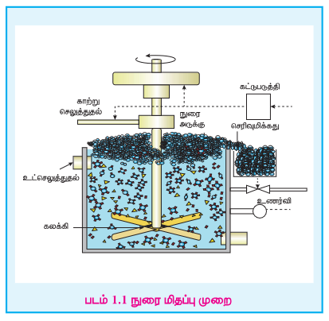
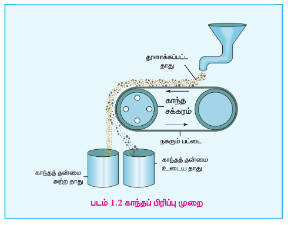

## 1.2 தாதுக்களை அடர்பித்தல்

பொதுவாக, தாதுவுடன் உலோகத் தன்மையற்ற மாசுகள் பாறைப் பொட்கள் மற்றும் மண் மாசுகள் போன்றவை இரண்டும் கலந்து காணப்படும். இத்தகைய மாசுகள் அனைத்தும் சேர்த்து கனிமக் கழிவு (gangue) என அழைக்கப்படுகிறது. உலோகவியல் செயல்முறையின் முதல் படி நிலையானது இத்தகைய மாசுக்களை நீக்குவதாகும். இச்செயல்முறையானது தாதுக்களை அடர்பித்தல் என அழைக்கப்படுகிறது. தாதுவில் காணப்படும் தேவைப்படும் உலோகம் அல்லது அவற்றின் சேர்மத்தின் செறிவு இச்செயல்முறையால் அதிகரிக்கப்படுகிறது. அடர்பித்தலுக்கு பல்வேறு முறைகள் நடைமுறையில் உள்ளன. எனினும் தாதுக்களின் தன்மை, அதில் கலந்துள்ள மாசுகளின் வகை மற்றும் சுற்றுச்சூழல் காரணிகளைப் பொறுத்து அடர்பிக்கும் முறை தீர்மானிக்கப்படுகிறது. தாதுக்களை அடர்பிக்கப் பயன்படும் சில பொதுவான முறைகள் கீழே விளக்கப்பட்டுள்ளன.

### 1.2.1 புவி ஈர்ப்பு முறை அல்லது ஒடும் நீரில் கழுவுதல்

இம்முறையில் தாதுக்களை ஒடும் நீரில் கழுவுதல் மூலம் அதிக புவி ஈர்ப்புத் தன்மையுடைய தாதுவானது குறைவான புவி ஈர்ப்புத் தன்மையைப் பெற்றுள்ள கனிமக் கழிவுகளிலிருந்து நீக்கப்படுகிறது. நன்கு தூள் செய்யப்பட்ட தாதுவானது மிக விரைவாக ஓடிக்கொண்டிருக்கும் நீரில் சேர்க்கப்படுகிறது. இச்செயல்முறையில் இலகுவான கனிம கழிவுகள் ஒடும் நீரால் அடித்துச் செல்லப்படுகின்றன. இம்முறையானது பொதுவாக தங்கம் போன்ற தனிம நிலையில் கிடைக்கும் தாதுக்களுக்கும், ஹேமடைட் (\( Fe_2O_3 \)) மற்றும் வெள்ளீயக் கல் (\( SnO_2 \)) போன்ற ஆக்சைடு தாதுக்களையும் அடர்பிக்க பொதுவாகப் பயன்படுத்தப்படுகிறது.

### 1.2.2 நுரை மிதப்பு முறை

கலீனா (\( PbS \)), ஜிங்க் பிளென்ட் (\( ZnS \)) போன்ற சல்பைடு தாதுக்களை அடர்பிக்க இம்முறை பொதுவாகப் பயன்படுத்தப்படுகிறது. இம்முறையில் கனிமக் கழிவுகளை விட உலோகத் தாதுத் துகள்கள் எண்ணெயில் அதிக அளவில் நனைவதால் அவைகளைக் கனிமக் கழிவுகளிலிருந்து பிரித்தெடுக்க இயலும்.

இம்முறையில் நன்கு தூள் செய்யப்பட்ட தாது நீரில் மூழ்கச் செய்யப்படுகிறது. இதனுடன் பைன் எண்ணெய், யூக்கலிப்டஸ் எண்ணெய் போன்ற நுரை உருவாக்கும் காரணிகள் கலக்கப்படுகின்றன. சேகரிப்பானாக செயல்படும் சோடியம் எத்தைல் சாந்தேட் சிறிதளவு சேர்க்கப்படுகிறது. இக்கலவையின் வழியே காற்று செலுத்தப்பட்டு நுரை உருவாக்கப்படுகிறது. சேகரிக்கும் மூலக்கூறுகள் தாதுத் துகள்களுடன் இணைந்து அவைகளை நீர் விலக்கும் தன்மையுடையதாக்குகிறது. இதன் விளைவாக தாதுத் துகள்கள்

எண்ணெயில் நன்கு நனைந்து, நுரையுடன் சேர்ந்து மேற்பரப்பை அடைகின்றன. இந்த நுரையானது வழித்தெடுக்கப்பட்டு பின் உலர்த்தப்பட்டு செறிவான தாது பெறப்படுகிறது. நீரில் நனையும் கனிமக் கழிவுத் துகள்கள் அடிப்பகுதியில் தங்கிவிடுகின்றன.

பிரித்தெடுக்க விரும்பும் ஒரு உலோகத்தின் சல்பைடு தாதுவானது மற்ற பிற உலோக சல்பைடுகளை மாசுகளாகக் கொண்டிருப்பின், சோடியம் சயனைடு, சோடியம் கார்பனேட் போன்ற குறைக்கும் காரணிகள் பயன்படுத்தப்படுகின்றன. இவை மற்ற பிற உலோக சல்பைடுகள் எண்ணெயில் நனைந்து நுரையாக வருவதைத் தடுக்கின்றன. எடுத்துக்காட்டாக \( ZnS \) போன்ற மாசுகள் கலீனாவில் (\( PbS \)) காணப்பட்டால் குறைக்கும் காரணியான சோடியம் சயனைடு (\( NaCN \)) சேர்க்கப்படும் போது அது \( Na_2[Zn(CN)_4] \) என்ற அணைவுச் சேர்மத்தை ஜிங் சல்பைடுடன் மேற்பரப்பில் ஏற்படுத்துவதால் அதன் நுரைக்கும் தன்மை குறைக்கப்படுகிறது.

### 1.2.3 வேதிக் கழுவுதல்

தகுந்த கரைப்பானில் ஒரு தாதுவின் கரையும் தன்மை மற்றும் நீர்க் கரைசலில் அதன் வேதி வினைபுரியும் தன்மை ஆகியனவற்றின் அடிப்ப டையில் இம்முறை அமைந்துள்ளது. இம்முறையில் நன்கு தூள் செய்யப்பட்ட தாதுவானது தகுந்த கரைப்பானில் கரைக்கப்படுகிறது. தாதுவில் காணப்படும் உலோகமானது அதன் கரையும் உப்பாக அல்லது அணைவுச் சேர்மமாக மாற்றப்படுகிறது. அதேநேரத்தில் கனிமக் கழிவுகள் கரையாமல் கரைசலில் அப்படியே தங்குகின்றன. பின்வரும் எடுத்துக்காட்டுகள் மூலம் வேதிக் கழுவுதல் முறையினை விளக்கலாம்.

**சயனைடு வேதிக் கழுவுதல்**

தங்கத் தாதுவை அடர்பித்தலை எடுத்துக்காட்டாகக் கருதுவோம். தங்கத்தின் நன்கு தூள் செய்யப்பட்டத் தாதுவானது நீர்த்த சோடியம் சயனைடு கரைசலுடன் சேர்த்து காற்றினைச் செலுத்தி கழுவப்படுகிறது. தங்கமானது கரையக்கூடிய சயனைடு அணைவாக மாறுகிறது. அலுமினோ சிலிக்கேட் கனிமக் கழிவு கரையாமல் அப்படியே தங்குகிறது.

\[ 4Au(s) + 8CN^-(aq) + O_2(g) + 2H_2O(l) \rightarrow 4[Au(CN)_2]^-(aq) + 4OH^-(aq) \]

**அணைவினை ஒடுக்குவதன் மூலம் தேவைப்படும் உலோகத்தினைப் பெறுதல்**

ஆக்சிஜன் நீக்கப்பட்ட கழுவிய கரைசலைத் துத்தநாகத்துடன் வினைப்படுத்தித் தங்கம் பெறப்படுகிறது. இம்முறையில் தங்கம் அதன் தனிம நிலைக்கு (பூஜ்ய ஆக்சிஜனேற்ற நிலைக்கு) ஒடுக்கப்படுகிறது. இச்செயல்முறை தனிம நிலைக்கு ஒடுக்கி வீழ்படிவாக்கல் (cementation) என அழைக்கப்படுகிறது.

\[ Zn(s) + 2[Au(CN)_2]^-(aq) \rightarrow [Zn(CN)_4]^{2-}(aq) + 2Au(s) \]

**அம்மோனியா வேதிக்கழுவுதல்**

நிக்கல், காப்பர் மற்றும் கோபால்ட் ஆகிய தனிமங்களைக் கொண்டுள்ள தாதுவை நன்குத் தூளாக்கி அதனை நீர்ம அம்மோனியாவுடன் தகுந்த அழுத்தத்தில் வினைப்படுத்தும் போது அம்மோனியாவானது மேற்கண்டுள்ள உலோகங்களை மட்டும் அவைகளின் கரையும் அணைவுச் சேர்மங்களான \( [Ni(NH_3)_6]^{2+} \), \( [Cu(NH_3)_4]^{2+} \) மற்றும் \( [Co(NH_3)_5H_2O]^{3+} \) ஆகியனவாக மாற்றுகிறது. இதனால் தாதுவிலிருந்து இந்த உலோகங்கள் கழுவி நீக்கப்படுகின்றன. இரும்பு (III) ஆக்சைடு / ஹைட்ராக்சைடு மற்றும் அலுமினோசிலிக்கேட் ஆகிய கனிமக் கழிவுகள் கரையாமல் தங்குகின்றன.

**கார வேதிக் கழுவுதல்**

இம்முறையில், தாதுவினை நீர்ம காரங்களுடன் வினைபடுத்தும் போது கரையும் அணைவுச் சேர்மம் உருவாகிறது. எடுத்துக்காட்டாக, அலுமினியத்தின் முக்கியத் தாதுவான பாக்சைடை சோடியம் ஹைட்ராக்சைடு அல்லது சோடியம் கார்பனேட் கரைசலுடன் சேர்த்து 35 atm அழுத்தத்தில் 470 – 520K வெப்பநிலையில் வெப்பப்படுத்தும் போது கரையும் தன்மையுடைய சோடியம் மெட்டா அலுமினேட் உருவாகிறது. மேலும் மாசுகளான இரும்பு ஆக்சைடு மற்றும் டைட்டேனியம் ஆக்சைடுகள் கரையாமல் தங்கி விடுகின்றன.

\[ Al_2O_3 (s) + 2NaOH (aq) + 3H_2O (l) \rightarrow 2Na[Al(OH)_4] (aq) \]

சூடான கரைசல் வடிகட்டப்பட்டு, குளிர்விக்கப்பட்டு நீர்க்கச் செய்யப்படுகிறது. இக்கரைசல் வழியே \( CO_2 \) வாயு செலுத்தப்பட்டு நடுநிலையாக்கப்படுவதன் மூலம் நீரேற்றமடைந்த \( Al_2O_3 \) வீழ்படிவு உருவாகிறது.

\[ 2Na[Al(OH)_4] (aq) + 2CO_2 (g) \rightarrow Al_2O_3.3H_2O (s) + 2NaHCO_3 (aq) \]

வீழ்படிவானது வடிகட்டப்பட்டு சுமார் 1670K வெப்பநிலையில் வெப்பப்படுத்தும் போது தூய அலுமினா \( Al_2O_3 \) பெறப்படுகிறது.

**அமில வேதிக் கழுவுதல்**

\( ZnS \), \( PbS \) போன்ற சல்பைடு தாதுக்களை சூடான நீர்ம கந்தக அமிலத்துடன் வினைப்படுத்தும் போது \( ZnS \), \( PbS \) போன்ற சல்பைடு தாதுக்கள் கழுவி வெளியேற்றப்படுகின்றன.

\[ 2ZnS (s) + 2H_2SO_4 (aq) + O_2(g) \rightarrow 2ZnSO_4 (aq) + 2S (s) + 2H_2O \]

இச்செயல்முறையில், கரையாத சல்பைடு தாதுவானது கரையும் சல்பேட்டாகவும், உலோக சல்பராகவும் மாற்றமடைகிறது.

> **தன் மதிப்பீடு**
>
> சில்வரை சோடியம் சயனைடு கொண்டு வேதிக்கழுவும் செயல்முறையை சமன்பாட்டினைத் தருக. இந்த வேதிக்கழுவு முறை ஒரு ஆக்சிஜனேற்ற ஒடுக்க வினை எனக் காட்டுக.

### 1.2.4 காந்தப் பிரிப்பு முறை

பெரிய அளவில் காந்தத் தன்மையுடைய தாதுக்களை அடர்பிக்க இம்முறை பயன்படுகிறது. இம்முறையானது, தாது மற்றும் மாசுக்களின் காந்தப் பண்புகளில் காணப்படும் வேறுபாட்டினை அடிப்படையாகக் கொண்டது. எடுத்துக்காட்டாக உல்ப்ரமைட் மாசிலிருந்து வெள்ளீயக் கல் தாதுவைப் பிரித்தெடுக்கலாம். இதில் மாசு உல்ப்ரமைட் ஆனது காந்தத் தன்மை உடையது. இதைப் போலவே குரோமைட், பைரோஹுசைட் போன்ற காந்தப் பண்புடைய தாதுக்களை காந்தப் பண்பற்ற மண் போன்ற மாசுக்களிலிருந்து பிரித்தெடுக்கலாம். நன்கு தூள் செய்யப்பட்ட தாதுவானது மின்காந்த பிரிப்பான் மீது விழுமாறு செய்யப்படுகிறது. மின்காந்த பிரிப்பு அமைப்பில் இரு சுழல் சக்கரங்களின் வழியே ஒரு பட்டை இயங்குகிறது. சக்கரங்களில் ஒன்று காந்தத் தன்மை உடையது. தாதுவானது நகரும் பட்டை வழியே காந்தத் தன்மை உடைய சுழல் சக்கரத்தை அடையும் போது, தாதுவில் உள்ள காந்தத் தன்மை உடைய பகுதிப் பொருட்கள் காந்தப்புலத்தால் ஈர்க்கப்பட்டு படத்தில் காட்டியுள்ளவாறு சக்கரத்திற்கு

அருகில் குவியலாக விழுகின்றன. காந்தத் தன்மையற்ற தாதுவின் பிற பகுதிகள் சுழல் சக்கரத்திற்கு அப்பால் விழுகிறது.