**டொனால்ட் ஜேமஸ் கிராம்**

டொனால்ட் ஜேமஸ் கிராம் என்பார் அமெரிக்காவைச் சார்ந்த ஒரு வேதியியல் அறிஞர் ஆவார். இவர் அதிக தெளிவுத் திறனும் செயல் இடைவினைத்திறனும் கொண்ட மூலக்கூறுகளின் வடிவங்களைக் கண்டறிதலுக்காக 1987 ஆம் ஆண்டிற்காக வேதியியல் நோபல் பரிசினை ஜான் மேரி லென் மற்றும் சார்லஸ் J பெடர்சன் ஆகியோருடன் இணைந்து பெற்றார். இவர்கள் வேதியியலின் வேதிவினைகளின் கண்டறிந்தனர். கிராம் பெடர்சென்னுடன் இணைந்து கிரிட ஈத்தர்களை தகர்த்து தொகுத்தார். இவை இருபரிமாண கரிமச் சேர்மங்கள் மேலும் சில உலோக தனிமங்களுடன் அறிந்து தெரிவு செய்யும் திறனுடைய மூலக்கூறுகளாகும். மேலும் இவர் முப்பரிமாண வேதியியலிலும் ஆராய்ச்சி செய்தார். சீர்மையற்ற கார்பன் அணு தூண்டுதலின் விதி இவர் பெயரால் அழைக்கப்படுகின்றது.

**கற்றலின் நோக்கங்கள் :**

இப்பாடப்பகுதியை கற்றறிந்த பின் மாணவர்கள்,

• கரிம நைட்ரஜன் சேர்மங்களில் காணப்படும் மாற்றியத்தினை புரிந்துக் கொள்ளுதல்

• நைட்ரோ சேர்மங்களின் தயாரித்தல் மற்றும் பண்புகளை விவரித்தல்

• அமீன்களை ஓரிணைய, ஈரிணைய மற்றும் மூவிணைய அமீன்கள் என வகைப்படுத்துதல்

• அமீன்கள் தயாரிக்கும் முறைகளை விவரித்தல்

• ஓரிணைய, ஈரிணைய மற்றும் மூவிணைய அமீன்களை வேறுபடுத்தி அறிதல்

• டையசோனியம் உப்புகளை தயாரிக்கும் முறைகளை விவரித்தல்

• சயனைடுகளின் தயாரித்தல் மற்றும் பண்புகளை விளக்குதல்

## பாட அறிமுகம்:

நைட்ரஜனைக் கொண்டுள்ள கரிமச் சேர்மங்கள் நம் வாழ்வில் முக்கியமானவையாகும். எடுத்துக்காட்டாக அம்மோனியாவின் கரிம பெறுதியான அமீன்கள் உயிர் ஒழுங்காற்றும் செயல்கள், நரம்புத்திசு தகவல் பரிமாற்றம் போன்றவற்றில் முக்கிய பங்காற்றுகின்றது. விட்டமின் B, பிரிடாக்சின் ஆனது ஒரு கரிம நைட்ரஜன் சேர்மமாகும். இது நரம்புகள், தோல் மற்றும் இரத்த திசுக்கள் நல்முறையில் இருப்பதற்கு தேவைப்படுகிறது. தாவரங்கள் அல்கலாய்டுகள் மற்றும் உயிரியல் செயல் திறன் மிக்க அமீன்களை உருவாக்குவதன் மூலம் மற்ற பிறவிலங்குகள் மற்றும் பூச்சிகள் தங்களை உண்ணாமல் தற்காத்துக் கொள்கின்றன. கரிம தொகுப்பு வேதியியலில் டையசோனியம் உப்புக்கள் மிக முக்கிய பயன்பாடுகளைக் கொண்டுள்ளது. மேலும் மருந்துகள், சாயங்கள், எரிபொருட்கள், பலபடிகள், செயற்கை இரப்பர்கள் போன்ற பல்வேறு சேர்மங்களின் முக்கியப் பகுதிப்பொருட்களாக நைட்ரஜன் சேர்மங்கள் காணப்படுகின்றன.

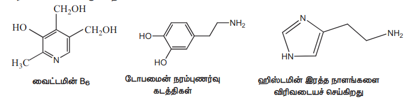

இப்பாடப்பகுதியில், நைட்ரோ சேர்மங்கள் மற்றும் அமீன்களின் தயாரித்தல், பண்புகள் மற்றும் பயன்களை நாம் கற்போம்.

## 13.1 நைட்ரோ சேர்மங்கள்

நைட்ரோ சேர்மங்கள் ஹைட்ரோகார்பன்களின் வழிப்பொருட்களாக கருதப்படுகின்றன. ஹைட்ரோகார்பன்களில் காணப்படும் ஒரு ஹைட்ரஜன் அணுவானது \(-\text{NO}_2\) தொகுதியால் பதிலீடு செய்யப்படுவதால் உருவாகும் கரிமச் சேர்மங்கள் கரிம நைட்ரஜன் சேர்மங்கள் எனப்படுகின்றன.

**13.1.1 நைட்ரோ சேர்மங்களை வகைப்படுத்துதல்**

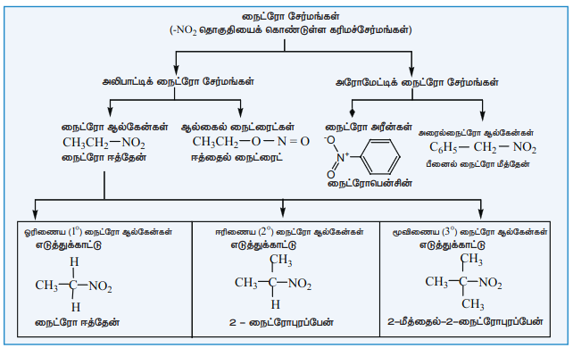

நைட்ரோ ஆல்கேள்கள் R-NO₂ என்ற பொது வாய்ப்பாட்டால் குறிக்கப்படுகின்றன. இங்கு R என்பது ஒரு ஆல்கைல் (\(C_n H_{2n+1}\)) தொகுதியாகும். \(-\text{NO}_2\) தொகுதி இணைக்கப்படிருக்கும் கார்பன் அணுவின் தன்மையினைப் பொருத்து நைட்ரோ ஆல்கேன்கள் மேலும் ஒரிணைய, ஈரிணைய மற்றும் மூவிணைய நைட்ரோ ஆல்கேன்கள் என வகைப்படுத்தப்படுகின்றன.

### 13.1.2 நைட்ரோ ஆல்கேன்களுக்குப் பெயரிடுதல்

IUPAC பெயரிடும் முறையில் ஆல்கேன்களின் பெயருக்கு முன்னொட்டாக நைட்ரோ தொகுதி சேர்க்கப்படுகிறது. நைட்ரோ தொகுதி இடம் பெற்றுள்ள கார்பன் எண் மூலம் குறிப்பிடப்படுகிறது.

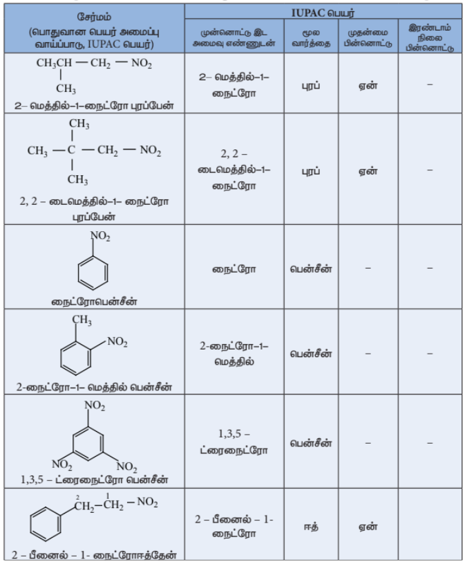

### 13.1.3 மாற்றியம்

நைட்ரோ சேர்மங்கள் சங்கிலித் தொடர் மற்றும் இட மாற்றியங்களை பெற்றிருப்பதுடன், ஆல்கைல் நைட்ரைட்டுகளுடன் வினைசெயல் தொகுதி மாற்றியத்தினையும் பெற்றுள்ளன. மேலும் \( \alpha \)-H அணுவைக் கொண்டுள்ள நைட்ரோ ஆல்கேன்கள் இயங்கு சமநிலை மாற்றியத்தினையும் கொண்டுள்ளன. எடுத்துக்காட்டாக, \( C_4H_9NO_2 \) என்ற மூலக்கூறு வாய்ப்பாட்டினை உடைய நைட்ரோ சேர்மங்கள் பின்வரும் மாற்றியங்களைக் கொண்டுள்ளன.

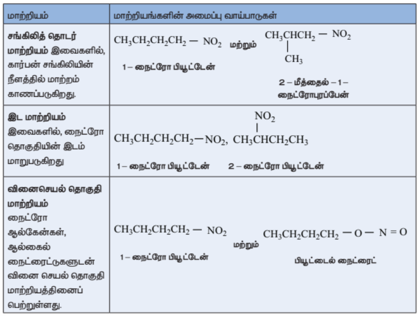

இயங்குசமநிலை மாற்றியம்: \( \alpha \)-H ஐக் கொண்டுள்ள ஓரிணைய மற்றும் ஈரிணைய நைட்ரோ ஆல்கேன்கள் நைட்ரோ மற்றும் அசி வடிவங்களின் இயங்குசமநிலைக் கலவையாக காணப்படுகின்றது.

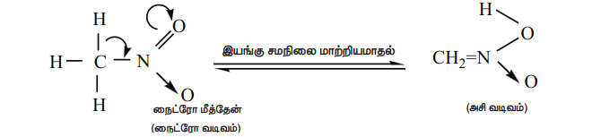

மூவிணைய நைட்ரோ ஆல்கேன்கள் \( \alpha \)-H அணுவை பெற்றிருக்காததால், இயங்கு சமநிலை மாற்றியத்தினை பெற்றிருப்பதில்லை.

| வ.எண் | நைட்ரோ வடிவம் | அசி வடிவம் |
|---|---|---|
| 1. | குறைவான அமிலத்தன்மை | அதிக அமிலத் தன்மை |
| 2. | \( \text{NaOH} \) மெதுவாக கரைக்கின்றது | \( \text{NaOH} \) உடனடியாக கரைக்கிறது. |
| 3. | \( \text{FeCl}_3 \) கரைசலை நிறமிமுக்க செய்கிறது. | \( \text{FeCl}_3 \) உடன் சிவப்புப்பழுப்பு நிறத்தைத் தருகிறது. |
| 4. | மின்கடத்துத் திறன் குறைவு | மின்கடத்துத் திறன் அதிகம் |

### 13.1.4 நைட்ரோ ஆல்கேன்களின் அமிலத் தன்மை

\( \text{NO}_2 \) தொகுதியின் எலக்ட்ரானைக் கவரும் வினைவின் காரணமாக \( 1^\circ \) மற்றும் \( 2^\circ \) நைட்ரோ ஆல்கேன்களின் \( \alpha \)-H அணு அமிலத்தன்மையைக் காட்டுகிறது. இச்சேர்மங்கள் ஆல்டிஹைடுகள், கீட்டோன்கள், எஸ்டர்கள் மற்றும் சயனைடுகளைக் காட்டிலும் அதிக அமிலத் தன்மை உடையவை.

நைட்ரோ ஆல்கேன்கள் \( \text{NaOH} \) கரைசலில் கரைந்து உப்புக்களைத் தருகின்றன. அசி நைட்ரோ பெறுகிகள் நைட்ரோ வடிவத்தைக் காட்டிலும் அதிக அமிலத் தன்மை உடையது. \( \alpha \)-H கார்பனுடன் இணைக்கப்பட்டிருக்கும் ஆல்கைல் தொகுதிகளின் எண்ணிக்கை அதிகரிக்கும் போது ஆல்கைல் தொகுதிகளின் \( +I \) வினைவினால் அமிலத் தன்மையும் குறைகிறது.

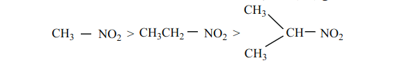

> **தன்மதிப்பீடு**
>
> பின்வரும் சேர்மங்களுக்கு சாத்தியமான அனைத்து மாற்றியங்களையும் எழுதுக.
>
> i) \( C_2H_5-NO_2 \) ii) \( C_3H_7-NO_2 \)

### 13.1.5 நைட்ரோ ஆல்கேன்களைத் தயாரித்தல்

#### 1) ஆல்கைல் ஹாலைடுகளிலிருந்து பெறுதல் (ஆய்வகமுறை)

அ) ஈத்தைல் புரோமைடுகள் (அல்லது) அயோடைடுகளை எத்தனாலில் கரைக்கப்பட்ட பொட்டாசியம் நைட்ரைட்டு கரைசலுடன் வினைப்படுத்தும் போது நைட்ரோ ஈத்தேனைத் தருகிறது.

$$
\mathrm{CH_3CH_2{-}Br}
+
\mathrm{KNO_2}
\overset{\text{எத்தனால்}/\Delta}{\underset{S_\mathrm{N}2}{\longrightarrow}}
\mathrm{CH_3CH_2{-}NO_2}
+
\mathrm{KBr}
$$

$$
\scriptsize \text{எத்தில் புரோமைடு}
\hspace{4cm}
\scriptsize \text{நைட்ரோ எத்தேன்}
$$

இவ்வினை \( S_N2 \) வினை வழிமுறையைப் பின்பற்றுகிறது. நைட்ரோ பென்சீனை தயாரிக்க இம்முறை ஏற்றதன்று. ஏனெனில் பென்சீன் வளையத்துடன் நேரடியாக பிணைக்கப்பட்டிருக்கும் புரோமினை பிளவுறச் செய்ய இயலாது.

#### 2) ஆல்கேன்களின் ஆவி நிலை நைட்ரோ ஏற்றம் (தொழிற்முறை)

மீத்தேன் மற்றும் நைட்ரிக் அமிலம் ஆகியனவற்றின் வாயுக் கலவையை செஞ்சூடான உலோக குழாயின் வழியே செலுத்தி நைட்ரோ மீத்தேன் பெறப்படுகிறது.

$$
\mathrm{CH_4}_{(g)}+\mathrm{HNO_3}_{(g)}
\overset{675\ \mathrm{K}}{\underset{\text{செஞ்சூடான Si குழாய்}}{\longrightarrow}}
\mathrm{CH_3{-}NO_2}+\mathrm{H_2O}
$$

$$ \scriptsize \text{ஈத்தேன்} \hspace{6cm} \scriptsize \text{நைட்ரோ ஈத்தேன்} $$

மீத்தேனைத் தவிர்த்த பிற ஆல்கேன்கள் (\( n \) – ஹெக்ஸேன் வரை) C – C பிளவினால் நைட்ரோ ஆல்கேன்களின் கலவையினைத் தருகின்றன. பின்ன வாலை வடித்தலின் மூலம் நைட்ரோ ஆல்கேன்கள் தனித்தனியே பிரித்தெடுக்கப்படுகின்றன.

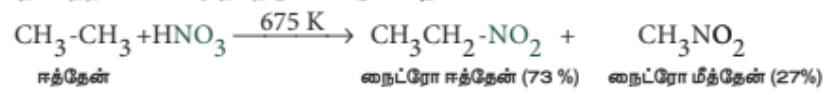

**3) \( \alpha \)- ஹேலோ கார்பாக்சிலிக் அமிலங்களிலிருந்து பெறுதல்**

\( \alpha \)- குளோரோ அசிட்டிக் அமிலத்தினை சோடியம் நைட்ரைட்டின் நீர்க்கரைசலுடன் கொதிக்கச் செய்யும் போது நைட்ரோமீத்தேன் உருவாகிறது.
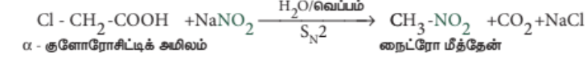

> **தன்மதிப்பீடு**
>
> 4) பின்வரும் வினைகளில் விளைப்பொருட்களைக் கண்டறிக.
>
> i) \( \text{CH}_3\text{CH}(\text{Cl})\text{COOH} \xrightarrow[\Delta]{\text{i) NaNO}_2 \text{ ii) H}_2\text{O}} [X] \)
> 
> ii) \( \text{CH}_3\text{CH}_2\text{-Br} + \text{NaNO}_2 \xrightarrow{\text{ஆல்கஹால்}/\Delta} [Y] \)

#### 4) மூவிணைய ஆல்கைல் அமீன்களின் ஆக்சிஜனேற்றம்

மூவிணைய பியூட்டைல் அமீன் நீர்த்த \( \text{KMnO}_4 \) ஆல் ஆக்சிஜனேற்றம் அடைந்து மூவிணைய நைட்ரோ ஆல்கேன்களைத் தருகின்றது.
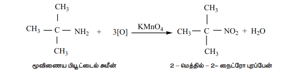

#### 5) ஆக்சைம்களின் ஆக்சிஜனேற்றம்

அசிட்டால்டாக்சைம் மற்றும் அசிட்டோன் ஆக்சைம் ஆகியன ட்ரைபுளுரோபெராக்ஸி அசிட்டிக் அமிலத்தால் ஆக்சிஜனேற்றம் அடைந்து முறையே நைட்ரோ ஈத்தேன் (\( 1^\circ \)) மற்றும் 2 – நைட்ரோ புரொப்பேன் (\( 2^\circ \)) ஆகியனவற்றைத் தருகின்றன.

$$
\mathrm{CH_3{-}CH{=}N{-}OH}
\overset{\mathrm{CF_3COOOH}}{\underset{[O]}{\longrightarrow}}
\mathrm{CH_3CH_2{-}NO_2}
$$

$$
\scriptsize \text{அசிட்டால்டாக்சைம்}
\hspace{2.6cm}
\scriptsize \text{நைட்ரோ ஈத்தேன்}
$$

### 13.1.6 நைட்ரோ அரீன்களைத் தயாரித்தல்

**i) நேரடி நைட்ரோ ஏற்றம்**

330K வெப்பநிலையில் பென்சீனை நைட்ரோ ஏற்றக் கலவையுடன் (கூம்பு \( \text{HNO}_3 \) + கூம்பு \( \text{H}_2\text{SO}_4 \)) வெப்பப்படுத்தும் போது எலக்ட்ரான் கவர் பொருள் பதிலீட்டு வினை நடைபெற்று நைட்ரோ பென்சீன் (மிர்பேன் எண்ணெய்) உருவாகிறது.

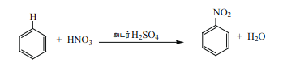

நைட்ரோ பென்சீனின் நேரடி நைட்ரோ ஏற்றம் \( m \) – நைட்ரோ பென்சீனை உருவாக்குகிறது.

**2) மறைமுக முறை**

P – டைநைட்ரோ பென்சீனைத் தயாரிக்க இம்முறை பயன்படுகிறது.  
**எடுத்துக்காட்டு**
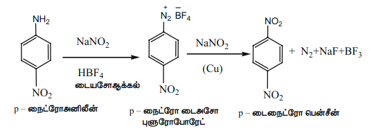

கேரஸ் அமிலம் (\( \text{H}_2\text{SO}_5 \)) அல்லது பெர்சல்பூரிக் அமிலம் (\( \text{H}_2\text{S}_2\text{O}_8 \)) அல்லது ட்ரைபுளுரோ பெராக்சி அசிட்டிக் அமிலம் (\( \text{F}_3\text{C}.\text{CO}_3\text{H} \)) போன்றவற்றை ஆக்சிஜனேற்றியாகப் பயன்படுத்தும் போது அமினோ தொகுதியானது நேரடியாக நைட்ரோ தொகுதியாக மாற்றப்படுகிறது.

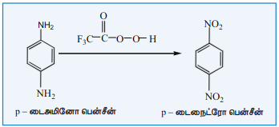

### 13.1.7 நைட்ரோ ஆல்கேன்களின் இயற்பண்புகள்

குறைவான கார்பன் அணுக்களைக் கொண்டுள்ள நைட்ரோ ஆல்கேன்கள் நிறமற்ற, இனிய மணமுடைய நீர்மங்கள், நீரில் சிறிதளவே கரையும் ஆனால் பென்சீன், அசிட்டோன் போன்ற கரிமக் கரைப்பான்களில் நன்கு கரைகின்றன. இவைகளின் அதிக முனைவுத் தன்மையினால் அதிக கொதிநிலையைக் கொண்டுள்ளன. நைட்ரோ ஆல்கேன்களைக் காட்டிலும் ஆல்கைல் நைட்ரைட்டுகள் குறைவான கொதிநிலையைக் கொண்டுள்ளன.

### 13.1.8 நைட்ரோ ஆல்கேன்களின் வேதிப்பண்புகள்

நைட்ரோ ஆல்கேன்கள் பின்வரும் பொதுவான வினைகளில் ஈடுபடுகின்றன.

i. ஒடுக்கம் ii. நீராற்பகுப்பு iii. வேறைனேற்றம்

**i) நைட்ரோ ஆல்கேன்களின் ஒடுக்கம்**

நைட்ரோ ஆல்கேன்களின் ஒடுக்க வினையானது முக்கியமான தொகுப்பு முறை பயன்களைக் கொண்டுள்ளது. நைட்ரோ தொகுதியின் ஒடுக்க வினையின் பல்வேறு நிலைகள் பின்வருமாறு

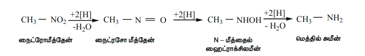

இறுதி வினைப்பொருளானது ஒடுக்கும் காரணியின் தன்மை மற்றும் ஊடகத்தின் pH மதிப்பு ஆகியனவற்றைப் பொறுத்து அமையும்.

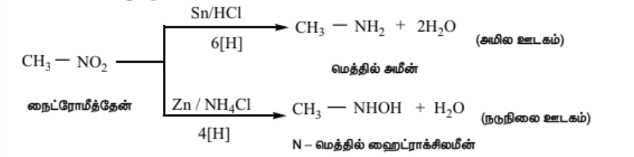
ஆல்கைல் நைட்ரைட்டுகளின் ஒடுக்கம்

Sn / HCl ஐக் கொண்டு எத்தில் நைட்ரைட்டை ஒடுக்கும்போது எத்தனால் உருவாகிறது.

$$
\mathrm{CH_3CH_2{-}O{-}N{=}O}
+6[H]
\overset{\mathrm{Sn/HCl}}{\longrightarrow}
\mathrm{CH_3CH_2{-}OH}
+\mathrm{NH_3}
+\mathrm{H_2O}
$$

**ii) நைட்ரோஆல்கேன்களின் நீராற்பகுப்பு**

அடர் HCl அல்லது அடர் H$_2$SO$_4$ ஐப் பயன்படுத்தி நீராற்பகுத்தலை மேற்கொள்ளலாம். ஓரிணைய நைட்ரோ ஆல்கேன்களை நீராற்பகுக்கும் போது கார்பாக்சிலிக் அமிலங்கள் உருவாகின்றன. 

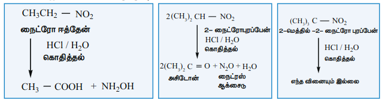

மேலும் ஈரிணைய நைட்ரோ ஆல்கேன்கள் கீட்டோன்களைத் தருகின்றன. மூவிணைய நைட்ரோ ஆல்கேன்கள் இவ்வினையில் ஈடுபடுவதில்லை.

மாறாக, எத்தில் நைட்ரைட்டின் அமில அல்லது கார நீராற்பகுப்பினால் எத்தனால் உருவாகிறது.

$$
\mathrm{CH_3CH_2{-}O{-}N{=}O}
+\mathrm{HOH}
\overset{\mathrm{OH^-}}{\underset{(\mathrm{or})\ \mathrm{H^+}}{\longrightarrow}}
\mathrm{CH_3CH_2{-}OH}
+\mathrm{HNO_2}
$$

$$
\scriptsize \text{எத்தில் நைட்ரைட்டு}
\hspace{5.4cm}
\scriptsize \text{எத்தனால்}
$$

**iii) நைட்ரோ ஆல்கேன்களின் ஹைலஜனேற்றம்**

ஓரிணைய மற்றும் ஈரிணைய நைட்ரோ ஆல்கேன்களை \( \text{Cl}_2 \) அல்லது \( \text{Br}_2 \) உடன் \( \text{NaOH} \) முன்னிலையில் வினைப்படுத்த நைட்ரோ ஆல்கேன்களின் \( \alpha \)-H அணுக்கள் ஒவ்வொன்றாக ஹாலஜன் அணுக்களால் பதிலீடு செய்யப்படுகின்றன.

\[
\text{CH}_3 - \text{NO}_2 + 3\text{Cl}_2 \xrightarrow{\text{NaOH}} \text{CCl}_3 - \text{NO}_2 + 3\text{HCl}
\]

$$
\hspace{3.8cm}
\scriptsize \text{குளோரோபிக்ரின்}
$$

$$
\hspace{5cm}
\scriptsize \text{(ட்ரைகுளோரோநைட்ரோமீத்தேன்)}
$$

**நச்சுத்தன்மை**

நைட்ரோ ஈத்தேன் ஆனது மரபுத்தன்மையில் பாதிப்பை ஏற்படுத்துதல் மற்றும் நரம்பு மண்டல பாதிப்புகளுக்கு காரணமாக இருக்கலாம் என அறியப்படுகிறது.

**iv) நெப்கார்பனைல் தொகுப்பு**

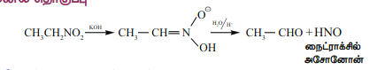

**நைட்ரோ பென்சீனின் வேதிப் பண்புகள்**
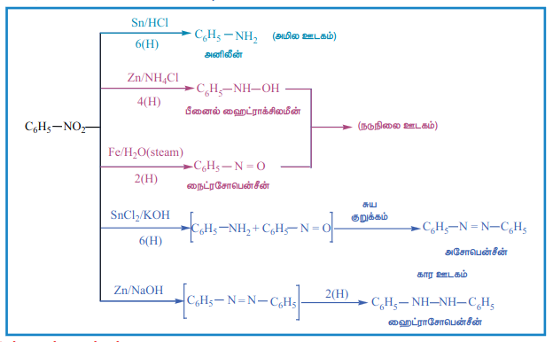

**மின்னாற் ஒடுக்கம்**

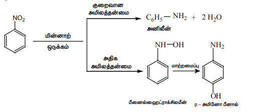

**உலோக வினையூக்கி மற்றும் உலோக ஹைட்ரைடுகளால் ஒடுக்கம்**

நைட்ரோ பென்சீனை Ni (அல்லது) Pt (அல்லது) \( \text{LiAlH}_4 \) ஐக் கொண்டு ஒடுக்கம் செய்யும் போது அனிலின் உருவாகிறது.

$$
\mathrm{C_6H_5{-}NO_2}
+6[H]
\overset{\mathrm{Ni}\ (\mathrm{அல்லது})\ \mathrm{Pt/H_2}}{\underset{(\mathrm{அல்லது})\ \mathrm{LiAlH_4}}{\longrightarrow}}
\mathrm{C_6H_5{-}NH_2}
+2\mathrm{H_2O}
$$

**பாலிநைட்ரோ சேர்மங்களின் தெரிந்தெடுத்த ஒடுக்கம்**

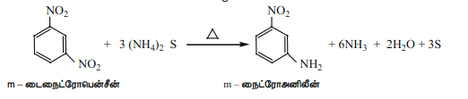

**எலக்ட்ரான் கவர் பொருள் பதிலீட்டு வினை**

பொதுவாக, நைட்ரோ பென்சீனின் எலக்ட்ரான் கவர் பொருள் பதிலீட்டு வினை மிக மெதுவாக நிகழும் ஒரு வினையாகும். மேலும் தீவிரமான வினை நிகழ நிபந்தனைகளில் இவ்வினை நிகழ்த்தப்படுகிறது. (\( -\text{NO}_2 \) தொகுதியானது வலிமையான கிளர்வு நீக்கும் மற்றும் m – ஆற்றுப்படுத்தும் தொகுதியாகும்).

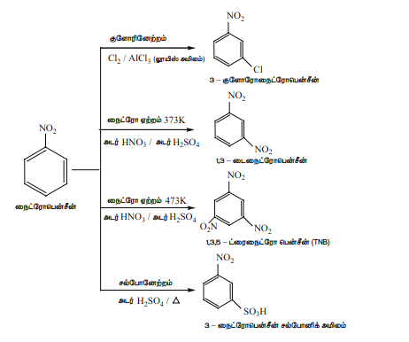

\( -\text{NO}_2 \) ஆனது ஒரு வலிமையான கிளர்வு நீக்கும் தொகுதியாக இருப்பதால், ஹைட்ரோ பென்சீன் ப்ரீட் - கிராப்ட் வினைக்கு உட்படுவதில்லை.

> **தன்மதிப்பீடு**
>
> பின்வரும் சேர்மங்களின் தெரிந்தெடுத்த ஒடுக்க வினையினால் உருவாகும் முதன்மை விளைபொருட்களைக் கண்டறிக.
>
> 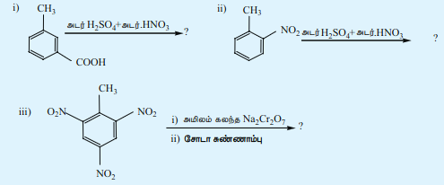

## 13.2 அமீன்கள் வகைப்படுத்துதல்

### 13.2.1 பெயரிடுதல்

**அ) பொதுவான பெயரிடும் முறை**

ஆல்கைல் தொகுதியை அமீனுக்கு முன்னொட்டாக சேர்த்து பொதுவான முறையில் பெயரிடப்படுகிறது. டை, ட்ரை மற்றும் டெட்ரா முதலிய முன்னொட்டுகள் முறையே இரண்டு, மூன்று மற்றும் நான்கு பதிலிகளை குறிப்பிட பயன்படுகிறது.

**ஆ) IUPAC முறை**

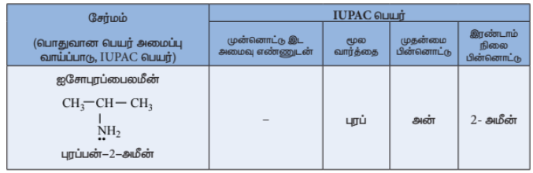

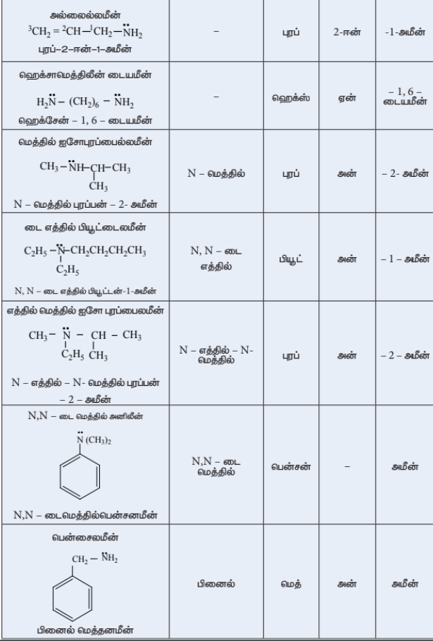

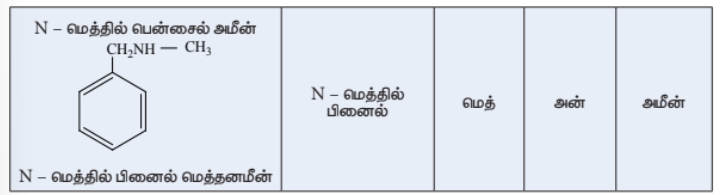

>**தன்மதிப்பீடு**
>
>பின்வரும் சேர்மங்களுக்கு வடிவமைப்புகளை வரை.
>
>i. நியோபென்டைல் அமீன்
>
>ii. மூவிணைய பியூட்டைல் அமீன்
>
>iii. \( \alpha \)- அமினோ புரொப்பியோனிக் அமிலம்
>
>iv. ட்ரைபென்டைல் அமீன்
>
>v. N – எத்தில் –N – மெத்தில் ஹெக்ஸேன் –3–அமீன்
>
>8) பின்வரும் அமீன்களுக்கு சரியான IUPAC பெயரைத் தருக
>
>

### 13.2.2 அமீன்களின் அமைப்பு

அம்மோனியாவைப் போன்று, அமீன்களில் உள்ள நைட்ரஜன் மும்மை இணைதிறனைப் பெற்றுள்ளது. மேலும் தனித்த எலக்ட்ரான் இரட்டையைக் கொண்டுள்ளது, \( sp^3 \) இனக்கலப்பு ஆர்பிட்டால்களில், மூன்று \( sp^3 \) இனக்கலப்பு ஆர்பிட்டால்கள் ஹைட்ரஜன் (அல்லது) ஆல்கைல் தொகுதி கார்பனின் ஆர்பிட்டால்களுடன் மேற்பொருந்துகிறது. நான்காவது \( sp^3 \) இனக்கலப்பு ஆர்பிட்டாலில் தனித்த இரட்டை எலக்ட்ரான் காணப்படுகிறது. எனவே, அமீன்கள் பிரமிடு வடிவத்தினை பெற்றுள்ளன. தனித்த இரட்டை எலக்ட்ரான் காணப்படுவதால் C- N- H (அல்லது) C- N- C பிணைப்புக் கோணமானது வழக்கமான நான்முகி பிணைப்புக் கோணமாக \( 109.5^\circ \) காட்டிலும் குறைவானதாகும். எடுத்துக்காட்டாக, ட்ரைமெத்தில் அமீனின் C- N- C பிணைப்புக் கோணம் \( 108^\circ \) ஆகும். இது நான்முகி பிணைப்புக் கோணத்தை விடக் குறைவு. மேலும் H- N- H பிணைப்புக் கோணமான \( 107^\circ \) ஐ விட அதிகம். பெரிய ஆல்கைல் தொகுதிகளுக்கு இடையேயான விலக்கு விசையே இந்த பிணைப்புக் கோண அதிகரிப்பிற்கு காரணமாகும்.

### 13.2.3 அமீன்களின் பொதுவான தயாரிப்பு முறைகள்

பின்வரும் முறைகளைப் பயன்படுத்தி அலிபாட்டிக் மற்றும் அரோமேட்டிக் அமீன்களைத் தயாரிக்கலாம்.

**1) நைட்ரோ சேர்மங்களிலிருந்து தயாரித்தல்**

H₂ / Ni அல்லது Sn / HCl அல்லது Pd / H₂ ஆகியனவற்றைப் பயன்படுத்தி நைட்ரோ சேர்மங்களை ஒடுக்கும் போது ஒரிணைய அமீன்கள் உருவாகின்றன.

$$
\mathrm{CH_3CH_2{-}NO_2}
\overset{3H_2/\mathrm{Ni}\ (\mathrm{அல்லது})}{\underset{\mathrm{Fe/HCl},\,6[H]}{\longrightarrow}}
\mathrm{CH_3CH_2{-}NH_2}
+2\mathrm{H_2O}
$$

$$
\scriptsize \text{நைட்ரோ ஈத்தேன்}
\hspace{2cm}
\scriptsize \text{எத்தனமைன்}
$$

$$
\mathrm{C_6H_5{-}NO_2}
\overset{3H_2/\mathrm{Pt},\,680\ \mathrm{K}}{\underset{(\mathrm{or})\ \mathrm{Sn/HCl}}{\longrightarrow}}
\mathrm{C_6H_5{-}NH_2}
+2\mathrm{H_2O}
$$

$$
\scriptsize \text{நைட்ரோ பென்சீன்}
\hspace{1.5cm}
\scriptsize \text{அனிலீன்}
$$

**2) நைட்ரைல்களிலிருந்து தயாரித்தல்**

அ) ஆல்கைல் அல்லது அரைல் சயனைடுகளை \( \text{H}_2 / \text{Ni} \) (அல்லது) \( \text{LiAlH}_4 \) (அல்லது) \( \text{Na} / \text{C}_2\text{H}_5\text{OH} \) ஆகியனவற்றைக் கொண்டு ஒடுக்கும் போது ஓரிணைய அமீன்கள் உருவாகின்றன. \( \text{Na} / \text{C}_2\text{H}_5\text{OH} \) ஐக் கொண்டு நிகழ்த்தப்படும் ஒடுக்க வினை மென்டியஸ் வினை (mendius) என அழைக்கப்படுகிறது.

$$
\mathrm{CH_3{-}CN}
\overset{\mathrm{Na(Hg)/C_2H_5OH}}{\underset{4[H]}{\longrightarrow}}
\mathrm{CH_3CH_2{-}NH_2}
$$

$$
\scriptsize \text{எத்தில் சயனைடு}
\hspace{1.5cm}
\scriptsize \text{எத்தனைமீன்}
$$

ஆ) சோடியம் அமல்கம் / \( \text{C}_2\text{H}_5\text{OH} \) கொண்டு ஐசோ சயனைடுகளை ஒடுக்கமடையச் செய்யும் போது ஈரிணைய அமீன்கள் உருவாகின்றன.

$$
\mathrm{CH_3{-}NC}
\overset{\mathrm{Na(Hg)/C_2H_5OH}}{\underset{4[H]}{\longrightarrow}}
\mathrm{CH_3{-}NH{-}CH_3}
$$

$$
\scriptsize \text{மெத்தில் ஐசோசயனைடு}
\hspace{1.5cm}
\scriptsize \text{N – மெத்தில் மெத்தனமைன்}
$$

**3) அமைடுகளிலிருந்து தயாரித்தல்**

அ) \( \text{LiAlH}_4 \) ஐக் கொண்டு அமைடுகளை ஒடுக்கம் செய்யும் போது அமீன்கள் உருவாகின்றன.

ஆ) ஹாஃப்மனின் இறக்க வினை

அமைடுகளை புரோமினுடன், நீர்த்த அல்லது ஆல்கஹாலில் கரைக்கப்பட்ட KOH முன்னிலையில் வினைப்படுத்த, அமைடை விட ஒரு கார்பனை குறைவான எண்ணிக்கையில் கொண்டுள்ள அமீன்கள் உருவாகின்றன.

**4) ஆல்கைல் ஹாலைடுகளிலிருந்து தயாரித்தல்**

அ) காப்ரியல் தாலிமைடு தொகுப்பு முறை

அலிபாட்டிக் ஓரிணைய அமீன்களைத் தயாரிக்கப் பயன்படுகிறது. தாலிமைடை எத்தனால் கலந்த KOH உடன் வினைப்படுத்த தாலிமைடின் பொட்டாசியம் உப்பு உருவாகிறது. இதனை ஆல்கைல் ஹாலைடுடன் வெப்பப்படுத்தி, பின் கார நீராற்பகுப்பு அடையச் செய்யும் போது ஓரிணைய அமீன்கள் உருவாகின்றன. இம்முறையினைப் பயன்படுத்தி அனிலீனைத் தயாரிக்க இயலாது. ஏனெனில் தாலிமைடிலிருந்து உருவாகும் எதிர் அயனியுடன் அரைல் ஹாலைடுகள் கருக்கவர் பொருள் பதிலீட்டு வினைக்கு உட்படுவதில்லை.

ஆ) ஹாஃப்மெனின் அம்மோனியாவால் பகுப்பு

ஆல்கைல் ஹாலைடுகள் அல்லது பென்சைல் ஹாலைடுகளை ஒரு மூடப்பட்ட குழாயில் ஆல்கஹால் கலந்த அம்மோனியாவுடன் வினைப்படுத்தும் போது, \( 1^\circ, 2^\circ, 3^\circ \) மற்றும் நான்கிணைய அம்மோனியம் உப்புகள் உருவாகின்றன.

இவ்வினை ஒரு கருக்கவர் பதிலீட்டு வினையாகும். ஆல்கைல் ஹாலைடுகளின் ஹாலைடானது \(-\text{NH}_2\) தொகுதியால் பதிலீடு செய்யப்படுகிறது. இவ்வினையில் உருவாகும் விளைப்பொருளான ஓரிணைய அமீனும் கருக்கவர் பொருளாக செயல்படும் தன்மையுடையது. எனவே மிகுதியான ஆல்கைல் ஹாலைடு வினைக்கு உட்படுத்தப்படின், கருக்கவர் பதிலீட்டு வினை மேலும் நிகழ்ந்து நான்கிணைய அம்மோனிய உப்பினைத் தருகிறது. எனினும், இவ்வினையானது அதிக அளவு அம்மோனியா கொண்டு நிகழ்த்தப்படின், முதன்மை விளைப்பொருளாக ஓரிணைய அமீன் உருவாகிறது.

அமீன்களுடன் ஆல்கைல் ஹாலைடுகளின் வினைத்திறன் வரிசை

\[
\text{RI} > \text{RBr} > \text{RCl}
\]

இ) ஆல்கைல் ஹாலைடுகளை சோடியம் அசைடு (\( \text{NaN}_3 \)) வினைப்படுத்தி பின் லித்தியம் அலுமினியம் ஹைட்ரைடு கொண்டு ஒடுக்கமடையச் செய்வதன் மூலம் அவற்றை ஓரிணைய அமீன்களாக மாற்றலாம்.

ஈ) குளோரோபென்சீனிலிருந்து அனிலீனைத் தயாரித்தல்

குளோரோபென்சீனை ஆல்கஹால் கலந்த அம்மோனியாவுடன் வெப்பப்படுத்தும் போது அனிலின் உருவாகிறது.

**5) ஹைட்ராக்சில் சேர்மங்களின் அம்மோனியாவால் பகுப்பு**

அ) ஆல்கஹால் மற்றும் அம்மோனியாவின் ஆவியினை அலுமினா, \( \text{W}_2\text{O}_5 \) அல்லது சிலிகா வழியே \( 400^\circ \text{C} \) ல் செலுத்தும் போது அனைத்து வகை அமீன்களும் உருவாகின்றன. இம்முறை சியாட்டியர் – மெய்வ்ஹி முறை என்றழைக்கப்படுகிறது.

ஆ) பீனாலை அம்மோனியாவுடன் \( 300^\circ \text{C} \) ஸ்ரீற்ற \( \text{ZnCl}_2 \) முன்னிலையில் வினைப்படுத்தும் போது அனிலின் உருவாகிறது.

### 13.2.4 அமீன்களின் பண்புகள்

**1. இயற்நிலை மற்றும் மணம்**

குறைவான கார்பன் அணுக்களைக் கொண்ட அலிபாட்டிக் அமீன்கள் (\( C_1-C_2 \)) நிறமற்ற வாயுக்களாகும். மேலும் அம்மோனியா போன்ற மணத்தை கொண்டுள்ளது. நான்கு அல்லது அதற்கு மேற்பட்ட கார்பன் அணுக்களைக் கொண்டுள்ளவை, மீனின் மணமுடைய ஆவியாகும் நீர்மங்கள்.

அனிலின் மற்றும் பிற அரைல் அமீன்கள் வழக்கமாக நிறமற்றவை. ஆனால் காற்றுடன் தொடர்பு ஏற்படும் போது அவைகள் ஆக்ஸிஜனேற்றத்தினால் நிறமுடையவையாகின்றன.

**2. கொதிநிலை**

ஓரிணைய மற்றும் ஈரிணைய அமீன்களின் முனைவுத் தன்மையினால் நைட்ரஜனின் தனித்த எலக்ட்ரான், இரட்டையை பயன்படுத்தி மூலக்கூறுகளுக்கிடையேயான ஹைட்ரஜன் பிணைப்பினை ஏற்படுத்துகின்றன. மூவிணைய அமீன்களில் இத்தகைய H – பிணைப்பு காணப்படுவதில்லை.

பல்வேறு அமீன்களின் கொதிநிலை வரிசை பின்வருமாறு

அமீன்கள், ஆல்கஹால்களைக் காட்டிலும் குறைவான கொதிநிலையுடையவை. ஏனெனில் ஆக்ஸிஜனைக் காட்டிலும் நைட்ரஜன் குறைவான எலக்ட்ரான் கவர் தன்மையைப் பெற்றுள்ளதால் N-H பிணைப்பானது -OH பிணைப்பைக் காட்டிலும் குறைவான முனைவுத் தன்மையுடையது.

**அட்டவணை : ஒப்பிடத்தக்க மூலக்கூறு நிறை உடைய அமீன்கள், ஆல்கஹால்கள் மற்றும் ஆல்கேன்களின் கொதிநிலை**

| வ.எண் | சேர்மம் | மூலக்கூறு நிறை (கி.மோல்\(^{-1}\)) | கொதிநிலை (K) |
|---|---|---|---|
| 1. | \( \text{CH}_3(\text{CH}_2)_2\text{NH}_2 \) | 59 | 321 |
| 2. | \( \text{C}_2\text{H}_5-\text{NH}-\text{CH}_3 \) | 59 | 308 |
| 3. | \( (\text{CH}_3)_3\text{N} \) | 59 | 277 |
| 4. | \( \text{CH}_3\text{CH}(\text{OH})\text{CH}_3 \) | 60 | 355 |
| 5. | \( \text{CH}_3\text{CH}_2\text{CH}_2\text{CH}_3 \) | 58 | 272.5 |

**3) கரைதிறன்**

குறைவான கார்பன் அணுக்களைக் கொண்டுள்ள அலிபாட்டிக் அமீன்கள் நீரில் கரையும். ஏனெனில் இவைகள் நீருடன் ஹைட்ரஜன் பிணைப்பினை ஏற்படுத்துகின்றன. எனினும், அமீன்களின் மூலக்கூறு நிறை அதிகரிக்கும் போது அவைகளின் கரைதிறன் குறைகிறது. ஏனெனில் நீர் வெறுக்கும் ஆல்கைல் தொகுதியின் உருவளவு அதிகரிக்கின்றது. அரோமேட்டிக் அமீன்கள் நீரில் கரைவதில்லை. ஆனால் பென்சீன், ஈதர் போன்ற கரிமக்கரைப்பான்களில் எளிதில் கரைகின்றன.

### 13.2.5 வேதிப் பண்புகள்

அமீன்கள் நைட்ரஜன் அணுவின் மீது காணப்படும் தனித்த இரட்டை எலக்ட்ரான்கள் அவற்றை காரத்தன்மை உடையதாக்குகிறது. மேலும் கருக்கவர் பொருளாக செயல்படவும் காரணமாய் அமைகிறது. கனிம அமிலங்களுடன் உப்புகளைத் தருகின்றன.

**எடுத்துக்காட்டு**

**அமீன்களின் காரவலிமைக்கான கோவை**

நீர்க்கரைசலில், பின்வரும் சமநிலை நிலவுகிறது. இச்சமநிலை பெரும்பாலும் இடது புறம் நோக்கி உள்ளது எனவே \( \text{NaOH} \) உடன் ஒப்பிடும் போது அமீன்கள் வலிமை குறைவான காரமாகும்.

அமீன்கள் நீரிலிருந்து எந்த அளவிற்கு ஹைட்ரஜன் அயனியை (\( H^+ \)) ஏற்கும் தன்மையை பெற்றுள்ளது என்பதனை காரத்துவ மாறிலி (\( K_b \)) ன் மூலம் அறியலாம். \( K_b \) மதிப்பு அதிகம் அதாவது \( pK_b \) ன் மதிப்பு குறைவு எனில், காரம் வலிமை மிக்கது என நாம் அறிவோம்.

**அட்டவணை : நீர்க்கரைசலில் அமீன்களின் \( pK_b \) மதிப்புகள், (\( \text{NH}_3 \) ன் \( pK_b \) மதிப்பு 4.74).**

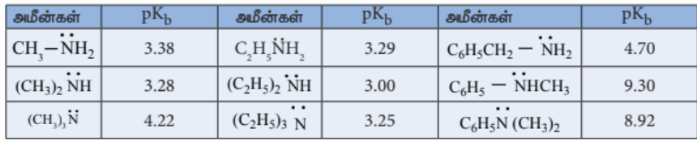

**அமீன்களின் காரத்தன்மை மீதான அமைவகளின் வடிவமைப்பின் விளைவு**

அமிலத்துடன் பங்கிடப்படுவதற்கு ஏதுவாக நைட்ரஜன் மீதுள்ள எலக்ட்ரான் இரட்டை அமைந்திருப்பதை அதிகரிக்கும் காரணிகள் அமீன்களின் காரத்தன்மையை அதிகரிக்கின்றன. ஆல்கைல் தொகுதி போன்ற \( +I \) தொகுதிகள் நைட்ரஜனுடன் இணைக்கப்பட்டிருப்பின் அவை நைட்ரஜன் மீதான எலக்ட்ரான் அடர்த்தியினை அதிகரிக்கச் செய்கின்றன. இதன் விளைவாக எலக்ட்ரான் இரட்டையானது புரோட்டானை ஏற்பது எளிதாகிறது. எனவே, ஆல்கைல் அமீன்கள் அம்மோனியாவை விட அதிக காரத்தன்மை உடையவை.

அ) ஆல்கைல் அமீனுடன் (\( \text{R}-\text{NH}_2 \)) புரோட்டானின் வினையைக் கருதுவோம்.

எலக்ட்ரானை விருவிக்கும் இயல்புடைய ஆல்கைல் தொகுதி R ஆனது அமீன்களில் உள்ள நைட்ரஜனை நோக்கி (\( \text{R}-\text{NH}_2 \)) எலக்ட்ரான் நகர காரணமாக அமைகிறது. மேலும், புரோட்டானுடன், தனித்த எலக்ட்ரான் இரட்டை பங்கிடுவதை ஊக்குவிக்கிறது. எனவே, அலிஃபாடிக் அமீன்களின் எதிர்பார்க்கப்படும் காரத்தன்மை (வாயுநிலையில்) பின்வரும் வரிசையில் அமைகிறது.

மேற்கண்டுள்ள வரிசையானது அவைகளின் நீர்க்கரைசலில் சீராக இருப்பதில்லை என்பதை அட்டவணையில் கொடுக்கப்பட்டுள்ள அவைகளின் \( pK_b \) மதிப்புகளிலிருந்து அறியலாம்.

அமீன்களின் காரத்தன்மை ஒப்பிட தூண்டல் விளைவு, கரைப்பானேற்ற விளைவு, கொள்ளிடத் தடை போன்ற விளைவுகளை கருத்தில் கொள்ள வேண்டும்.

**கரைப்பானேற்ற விளைவு**

நீர்க்கரைசலில் பதிலீடடைந்த அம்மோனியம் நேரயனிகள் ஆல்கைல் தொகுதிகளின் எலக்ட்ரான் விடுவிக்கும் (\( +I \)) விளைவு மட்டுமல்லாமல் நீர் மூலக்கூறுகளின் கரைப்பானேற்றத்தாலும் நிலைப்புத் தன்மை பெறுகின்றன. அயனியின் உருவளவு அதிகரிக்கும் போது கரைப்பானேற்றம் குறைகிறது. மேலும், நிலைப்புத்தன்மையும் குறைவு. ஈரிணைய மற்றும் மூவிணைய அமீன்களில் கொள்ளிடத் தடையின் காரணமாக, புரோட்டானேற்றம் அடைந்த அமீனை அணுகும் நீர் மூலக்கூறுகளின் எண்ணிக்கை குறைகிறது. எனவே காரத்தன்மையின் வரிசை பின்வருமாறு

மேற்கண்டுள்ள விளைவுகளின் அடிப்படையில், நீர்க்கரைசலில் ஆல்கைல் பதிலீடு அடைந்த அமீன்களின் கார வலிமையின் வரிசை பின்வருமாறு.

\( +I \) விளைவு, கொள்ளிட விளைவு மற்றும் நீரேற்ற விளைவு ஆகியனவற்றின் விளைவாக \( 2^\circ \) அமீன் ஆனது அதிக காரத்தன்மையினைப் பெறுகிறது.

**அனிலினின் கார வலிமை**

அனிலினில் \( \text{NH}_2 \) தொகுதியானது பென்சீன் வளையத்துடன் நேரடியாக இணைக்கப்பட்டுள்ளது. அனிலினின் நைட்ரஜன் அணு மீதான தனித்த இரட்டை எலக்ட்ரான் பென்சீன் வளையத்தினுள் உள்ளடங்காத் தன்மையினைப் பெற்றுள்ளது. எனவே, புரோட்டானேற்றத்திற்கு தனித்த எலக்ட்ரான் கிடைக்கக்கூடிய வாய்ப்பு குறைகிறது. இதன் விளைவாக அரோமேட்டிக் அமீன்கள் (அனிலின்), அம்மோனியாவை (\( \text{NH}_3 \)) காட்டிலும் குறைவான காரத் தன்மையைப் பெறுகின்றது.

பதிலீடடைந்த அனிலினில், \(-\text{CH}_3, -\text{OCH}_3, -\text{NH}_2\) போன்ற எலக்ட்ரானை விடுவிக்கும் இயல்புடைய தொகுதிகள் காரத்தின் வலிமையினை அதிகரிக்கின்றன. மேலும் எலக்ட்ரானை பெறும் இயல்புடைய தொகுதிகளான \( -\text{NO}_2, -\text{X}, -\text{COOH} \) போன்றவை காரத்தின் வலிமையினைக் குறைக்கின்றது.

**அட்டவணை : பதிலிடப்பட்ட அனிலின்களின் \( pK_b \)'s மதிப்புகள் (அனிலினின் \( pK_b \) மதிப்பு 9.376)**

| பதிலி | \( pK_b \) | பதிலி | \( pK_b \) | பதிலி | \( pK_b \) |
|---|---|---|---|---|---|
| \( o - \text{CH}_3 \) | 9.60 | \( m - \text{CH}_3 \) | 9.31 | \( p - \text{CH}_3 \) | 8.92 |
| \( o - \text{NH}_2 \) | 9.52 | \( m - \text{NH}_2 \) | 9.00 | \( p - \text{NH}_2 \) | 7.83 |
| \( o - \text{OCH}_3 \) | 9.52 | \( m - \text{OCH}_3 \) | 9.70 | \( p - \text{OCH}_3 \) | 8.70 |
| \( o - \text{NO}_2 \) | 14.30 | \( m - \text{NO}_2 \) | 11.52 | \( p - \text{NO}_2 \) | 13.00 |
| \( o - \text{Cl} \) | 11.25 | \( m - \text{Cl} \) | 10.52 | \( p - \text{Cl} \) | 10.00 |

அமீன்களின் ஒப்பீட்டு காரத்துவ வரிசை பின்வருமாறு

ஆல்கைல் அமீன்கள் > அரைல்கைல் அமீன்கள் > அம்மோனியா > N – அரைல்கைல் அமீன்கள் > அரைல் அமீன்கள்

### 13.2.6 அமீன்களின் வேதிப்பண்புகள்

**1) ஆல்கைலேற்றம்**

அமீன்கள், ஆல்கைல் ஹாலைடுகளுடன் வினைபட்டு \( 2^\circ \) மற்றும் \( 3^\circ \) மற்றும் நான்கிணைய அம்மோனியம் உப்புக்களை தொடர்ச்சியாகத் தருகிறது.

**2) அசைலேற்றம்**

அலிபாட்டிக் / அரோமேட்டிக் ஓரிணைய மற்றும் ஈரிணைய அமீன்கள் பிரிடின் முன்னிலையில் அசைல் குளோரைடு அல்லது அசிட்டிக் அமில நீரிலியுடன் வினைபட்டு N – ஆல்கைல் அசிட்டமைடைத் தருகிறது.

**எடுத்துக்காட்டு**

**3) ஸ்காட்டன் – பௌமன் வினை**

அனிலின் ஆனது \( \text{NaOH} \) முன்னிலையில் பென்சாயில் குளோரைடுடன் வினைபட்டு N – பீனைல் பென்சமைடைத் தருகிறது. இவ்வினை ஸ்காட்டன் – பௌமன் வினை எனப்படுகிறது. அசைலேற்றம் மற்றும் பென்சாயிலேற்ற வினைகள் கருக்கவர் பொருள் பதிலீட்டு வினைகளாகும்.

**4) நைட்ரஸ் அமிலத்துடன் வினை**

மூன்று வகையான அமீன்களும், வினை நிகழ் இடத்தில் \( \text{NaNO}_2 \) மற்றும் அடர் \( \text{HCl} \) கலந்து உருவாக்கப்படும் நைட்ரஸ் அமிலத்துடன் வெவ்வேறு முறையில் வினைபுரிகின்றன.

**அ) ஓரிணைய அமீன்கள்**

i) எத்தில் அமீன் நைட்ரஸ் அமிலத்துடன் வினைபுரிந்து நிலைப்புத் தன்மையற்ற எத்தில் டையசோனியம் குளோரைடைத் தருகிறது. மேலும் இது நைட்ரஜனை வெளியேற்றி எத்தனாலை உருவாக்குகிறது.

ii) அனிலின் குறைவான வெப்பநிலையில் (273 K – 278K) நைட்ரஸ் அமிலத்துடன் வினைப்பட்டு பென்சீன் டையசோனியம் குளோரைடைத் தருகிறது. இது குறைவான நேரம் மட்டுமே நிலைப்புத் தன்மை உடையது. மேலும் அறை வெப்பநிலையில் கூட இது மெதுவாக சிதைவடைகிறது. இவ்வினை டையசோ ஆக்கல் வினை எனப்படுகிறது.

**ஆ) ஈரிணைய அமீன்கள்**

ஆல்கைல் மற்றும் அரைல் ஈரிணைய அமீன்கள் நைட்ரஸ் அமிலத்துடன் வினைபுரிந்து மஞ்சள் நிற எண்ணெய் போன்ற N – நைட்ரோசோ அமீனைத் தருகிறது. இது நீரில் கரைவதில்லை.

இவ்வினை விபர்மேன் நைட்ரசோ சோதனை எனப்படுகிறது.

**இ) மூவிணைய அமீன்**

i) அலிபாட்டிக் மூவிணைய அமீன் நைட்ரஸ் அமிலத்துடன் வினைபுரிந்து நீரில் கரையக்கூடிய ட்ரை ஆல்கைல் அம்மோனியம் நைட்ரைட் உப்பினைத் தருகிறது.

ii) அரோமேட்டிக் மூவிணைய அமீன், நைட்ரஸ் அமிலத்துடன் 273K வெப்பநிலையில் வினைபுரிந்து p – நைட்ரோசோ சேர்மத்தைத் தருகிறது.

**5) கார்பைலமீன் சோதனை**

அலிபாட்டிக் (அல்லது) அரோமேட்டிக் ஓரிணைய அமீன்கள் குளோரோபார்ம் மற்றும் ஆல்கஹால் கலந்த KOH உடன் வினைபுரிந்து அரும்பெறுக்கத்தக்க மணமுடைய ஐசோசயனைடுகளை (கார்பைலமீன்) தருகின்றன. இவ்வினை கார்பைலமீன் சோதனை என்றழைக்கப்படுகிறது. இச்சோதனை ஓரிணைய அமீன்களை கண்டறியப் பயன்படுகிறது.

**6) கடுகு எண்ணெய் வினை**

i) ஓரிணைய அமீன்களை கார்பன் டைசல்பைடுடன் (\( \text{CS}_2 \)) வினைப்படுத்தும் போது, N – ஆல்கைல் டைதயோ கார்பாமிக் அமிலம் உருவாகிறது. இதனுடன் \( \text{HgCl}_2 \) சேர்த்து வினைப்படுத்தும் போது ஆல்கைல் ஐசோதயோசயனேட் உருவாகிறது.

ii) அனிலீனை கார்பன் டைசல்பைடுடன் வினைப்படுத்தும் போது, \( S \)-டைபீனைல் தயோயூரியா உருவாகிறது.

இவ்வினை ஹாஃப்மனின் கடுகு எண்ணெய் வினை அழைக்கப்படுகிறது. இவ்வினையும் ஓரிணைய அமீன்களை கண்டறிய பயன்படுகிறது.

**7. அனிலினின் எலக்ட்ரான் கவர் பொருள் பதிலீட்டு வினை**

\( -\text{NH}_2 \) தொகுதியானது ஒரு வலிமையான கிளர்வுறுத்தும் தொகுதியாகும். அனிலினில் \( \text{NH}_2 \) தொகுதியானது பென்சீன் வளையத்துடன் நேரடியாக இணைக்கப்பட்டுள்ளது. நைட்ரஜன் மீதுள்ள தனித்த எலக்ட்ரான் இரட்டையானது பென்சீன் வளையத்துடன் உடனிமையில் ஈடுபடுகிறது. இதன் விளைவாக ஆர்தோ மற்றும் பாரா இடங்களில் எலக்ட்ரான் அடர்வு அதிகரிக்கின்றது. எனவே எலக்ட்ரான் கவர் பொருள் ஆர்தோ மற்றும் பாரா இடங்களை தாக்க வாய்ப்பு ஏற்படுகிறது.

**i) புரோமினேற்றம்**

அனிலின் \( \text{Br}_2 / \text{H}_2\text{O} \) உடன் வினைபட்டு வெண்மை நிற வீழ்படிவான 2,4,6 – ட்ரை புரோமோ அனிலினைத் தருகிறது.

மோனோ புரோமோ பெறுதலைப் பெற, \( -\text{NH}_2 \) தொகுதியானது அசைலேற்றம் அடையச் செய்யப்பட்டு அதன் வினைத்திறன் குறைக்கப்படுகிறது.

அனிலினை அசிட்டைலேற்றம் அடையச் செய்யும் போது, நைட்ரஜனின் தனித்த இரட்டை எலக்ட்ரான் ஆனது அருகில் உள்ள கார்பனைல் தொகுதியுடன் உடனிமையில் ஈடுபடுவதால் உள்ளடங்காத் தன்மையைப் பெறுகிறது. எனவே நைட்ரஜனின் தனித்த எலக்ட்ரான் பென்சீன் வளையத்தில் உள்ளடங்காத் தன்மையை ஏற்படுத்த வாய்ப்பு குறைகிறது.

எனவே எலக்ட்ரான் கவர் பொருள் பதிலீட்டு வினைகளில் அசிட்டமினோ தொகுதியின் கிளர்வுறுத்தும் திறன் குறைவு.

**ii) நைட்ரோ ஏற்றம்**

அனிலினின் நேரடி நைட்ரோ ஏற்றத்தினால் \( o \)- மற்றும் \( p \)-நைட்ரோ அனிலின் உருவாகிறது. இதனுடன் ஆக்ஸிஜனேற்றத்தின் காரணமாக அடர் நிற தார் (tars) உருவாகிறது. மேலும் வலிமை மிக்க அமில ஊடகத்தில் அனிலின் புரோட்டானேற்றம் அடைந்து அனிலினியம் அயனியைத் தருவதால் \( m \)- நைட்ரோ அனிலின் உருவாகிறது.

பாரா விளைபொருளைப் பெற, அசிட்டிக் அமில நீரிலியுடன் வினைப்படுத்தி அசைடேற்றம் அடையச் செய்வதன் மூலம் \( -\text{NH}_2 \) தொகுதி பாதுகாக்கப்படுகிறது. பின்னர், நைட்ரோ ஏற்ற விளைபொருள் நீராற்பகுப்படையச் செய்து விளைபொருள் பெறப்படுகிறது.

**iii) சல்போனேற்றம்**

அனிலின் அடர் \( \text{H}_2\text{SO}_4 \) உடன் வினைபுரிந்து அனிலினியம் ஹைட்ரஜன் சல்பேட்டைத் தருகிறது. இதனை 453 – 473K ல் \( \text{H}_2\text{SO}_4 \) உடன் வினைப்படுத்த \( p \)- அமினோ பென்சீன் சல்போனிக் அமிலத்தை முதன்மை விளைபொருளாக தருகிறது.

அனிலின் பிரீடல் கிராப்ட் வினைக்கு உட்படுவதில்லை. அனிலின் காரத்தன்மை உடையது என நாம் அறிவோம். மேலும் இது தனது தனித்த இரட்டை எலக்ட்ரானை \( \text{AlCl}_3 \) போன்ற லூயி அமிலத்திற்கு வழங்கி சேர்க்கை விளைபொருளை உருவாக்குவதன் காரணமாக எலக்ட்ரான் கவர் பொருள் பதிலீட்டு வினை நிகழ்வது தடுக்கப்படுகிறது.

## 13.3 டையசோனியம் உப்புகள்

### 13.3.1 அறிமுகம்

அரோமேட்டிக் அமீன்களை (\( \text{NaNO}_2 + \text{HCl} \)) கலவையுடன் வினைப்படுத்தும் போது டையசோனியம் உப்புகள் உருவாகின்றன என நாம் கற்றறிந்துள்ளோம். இவைகள் குறைவான நேரத்திற்கு மட்டுமே நிலைப்புத்தன்மை உடையதாக இருக்கின்றன. எனவே தயாரித்த உடனேயே பயன்படுத்தப்படுகின்றன.

**எடுத்துக்காட்டுகள்**

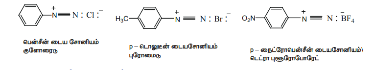

### 13.3.2 உடனிசைவு அமைப்பு

அரீன் டையசோனியம் அயனியின் மீதான நேர்மின்மை பென்சீன் வளையம் முழுமைக்கும் விரவும் தன்மையை பெற்றிருப்பதால் அரீன் டையசோனியம் உப்புகள் நிலைப்புத் தன்மையைப் பெறுகின்றன.

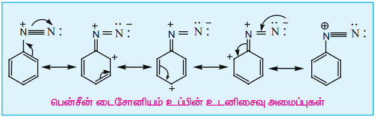

### 13.3.3 டையசோனியம் உப்புகளை தயாரிக்கும் முறைகள்

அனிலின் பென்சீன் டையசோனியம் குளோரைடைத் தரும் என்பதை நைட்ரஸ் அமிலத்துடன் (\( \text{NaNO}_2 + \text{HCl} \) கலவை 273Kல்) வினைபுரிந்து நாம் ஏற்கனவே கற்றறிந்துள்ளோம்.

### 13.3.4 இயற்பண்புகள்

• பென்சீன் டையசோனியம் குளோரைடு, நிறமற்ற படிக திண்மம்

• நீரில் நன்கு கரைகின்றன மேலும் குளிர்ந்த நீரில் நிலைப்புத்தன்மை உடையது எனினும் மித வெப்ப நீரில் வினைபுரிகிறது.

• இவைகளின் நீர்த்த கரைசல்கள் விடமஸ் தாளுடன் நடுநிலைத் தன்மையை காட்டுகிறது. மேலும் அயனிகளாக காணப்படுவதால் மின்கடத்தும் தன்மையைப் பெற்றுள்ளது.

• பென்சீன் டையசோனியம் டெட்ராபுளுரோ போரேடு நீரில் கரைகிறது. மேலும் அறை வெப்பநிலையில் நிலைப்புத்தன்மை உடையது.

### 13.3.5 வேதி வினைகள்

பென்சீன் டையசோனியம் குளோரைடு இருமாதிரியான வேதி வினைகளைத் தருகிறது.

A. நைட்ரஜனை இழந்து நடைபெறும் பதிலீட்டு வினைகள்: இவ்வினைகளில், டையசோனியம் தொகுதியானது, \( \text{X}^- , \text{CN}^- , \text{H} , \text{OH}^- \) போன்ற கருக்கவர் பொருட்களால் பதிலீடு அடைகிறது.

B. டையசோனியம் தொகுதி நீங்காதிருக்கும் வினைகள்: எ.கா இணைப்பு வினை

**A. நைட்ரஜனை இழந்து நடைபெறும் பதிலீட்டு வினைகள்**

**1. ஹைட்ரஜனால் இடப்பெயர்ச்சி**

ஹைப்போ பாஸ்பரஸ் அமிலம் அல்லது குப்ரஸ் அயனியின் முன்னிலையில் எத்தனால் போன்ற வலிமை குறைந்த ஒடுக்கும் காரணிகளைக் கொண்டு பென்சீன் டையசோனியம் குளோரைடை

ஒடுக்கமடையச் செய்யும் போது பென்சீன் உருவாகிறது. இவ்வினை தனிஉறுப்பு சங்கிலி வினை வழிமுறையைப் பின்பற்றி நிகழ்கிறது.

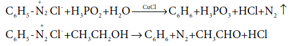

**2. குளோரின், புரோமின், சயனைடு தொகுதியால் பதிலீடு**

**அ) சான்ட்மெயர் வினை**

புதிதாகத் தயாரிக்கப்பட்ட பென்சீன் டையசோனியம் குளோரைடு மற்றும் குப்ரஸ் ஹாலைடு கரைசல்களை ஒன்றுடனொன்று சேர்க்கும் போது, அரைல் ஹாலைடுகள் உருவாகின்றன. இவ்வினை சான்ட்மெயர் வினை என்றழைக்கப்படுகிறது. பென்சீன் டையசோனியம் குளோரைடை குப்ரஸ் சயனைடுடன் வினைப்படுத்த, சயனோ பென்சீன் உருவாகிறது.

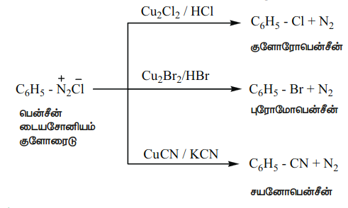

**ஆ) காட்டர்மான் வினை**

பென்சீன் டையசோனியம் குளோரைடை, ஹைட்ரோ குளோரிக் / ஹைட்ரோ புரோமிக் அமிலம் மற்றும் காப்பர் தூளுடன் சேர்த்து வினைப்படுத்துவதன் மூலமும் குளோரோ / புரோமோ அரீன்களைப் பெறலாம்.

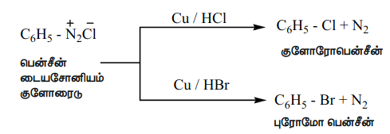

காட்டர்மான் வினையைக் காட்டிலும் சான்ட்மெயர் வினையில் அதிக அளவு வினைப்பொருள் உருவாகிறது.

**3. அயோடினால் பதிலீடு**

பென்சீன் டையசோனியம் குளோரைடின் நீர்க்கரைசலை KI உடன் கொதிக்க வைக்கும் போது அயோடோ பென்சீன் உருவாகிறது.

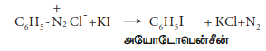

**4. புளூரினால் பதிலீடு (Baltz - schiemann reaction)**

பென்சீன் டையசோனியம் குளோரைடை புளுரோ போரிக் அமிலத்துடன் வினைப்படுத்தும் போது, பென்சீன் டையசோனியம் டெட்ரா புளுரோ போரேடு வீழ்படிவாகிறது. இதனை வெப்பப்படுத்தும் போது சிதைவடைந்து புளுரோ பென்சீனைத் தருகிறது.

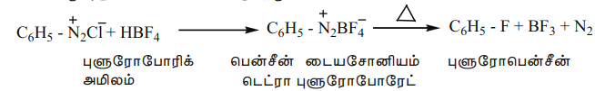

**5. ஹைட்ராக்சில் தொகுதியால் பதிலீடு**

அதிக அளவு கொதிக்கும் நீரில் பென்சீன் டையசோனியம் குளோரைடு கரைசலை சேர்க்கும் போது பீனால் உருவாகிறது.

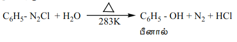

**6. நைட்ரோ தொகுதியால் பதிலீடு**

டையசோனியம் புளுரோ போரேட்டை காப்பர் முன்னிலையில் நீர்த்த சோடியம் நைட்ரைட்டு கரைசலுடன் சேர்த்து கொதிக்க வைக்கும் போது டையசோனியம் தொகுதியானது, \(-\text{NO}_2\) தொகுதியால் பதிலீடு செய்யப்படுகிறது.

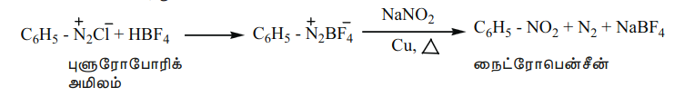

**7. அரைல் தொகுதியால் பதிலீடு (காம்பெரக் வினை)**

சோடியம் ஹைட்ராக்சைடு முன்னிலையில், பென்சீன் டையசோனியம் குளோரைடானது பென்சீனுடன் வினைபுரிந்து பைபீனைலைத் தருகிறது. இவ்வினை காம்பெரக் வினை எனப்படும்.

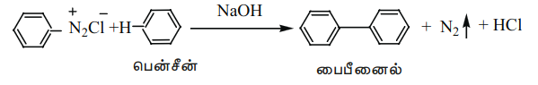

**8. கார்பாக்சிலிக் தொகுதியால் பதிலீடு**

டையசோனியம் புளுரோ போரேட்டை அசிட்டிக் அமிலத்துடன் வெப்பப்படுத்தும் போது பென்சாயிக் அமிலம் உருவாகிறது. அலிபாட்டிக் கார்பாக்சிலிக் அமிலங்களை அரோமேட்டிக் கார்பாக்சிலிக் அமிலங்களாக மாற்றுவதற்கு இவ்வினை பயன்படுகிறது.

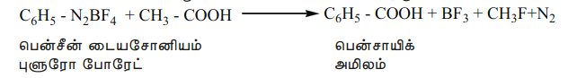

**B. டையசோனியம் தொகுதி நீங்காதிருக்கும் வினைகள்**

**9. \( \text{SnCl}_2 / \text{HCl} \), Zn தூள் / \( \text{CH}_3\text{COOH} \), சோடியம் ஹைட்ரோசல்பைடு, சோடியம் சல்பைடு போன்ற ஒடுக்கும் காரணிகள் பென்சீன் டையசோனியம் குளோரைடை பீனைல் ஹைட்ரசீனாக ஒடுக்கமடையச் செய்கிறது.**

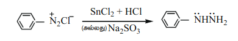

**10. இணைப்பு வினை**

எலக்ட்ரான் அடர்வினை அதிகமாகக் கொண்டுள்ள அனிலின், பீனால் போன்ற அரோமேட்டிக் சேர்மங்களுடன் பென்சீன் டையசோனியம் குளோரைடு வினைபுரிந்து பிரகாசமான நிறமுடைய அசோ சேர்மங்களை உருவாக்குகிறது. பொதுவாக இணைப்பானது பாரா இடத்தில் நிகழ்கிறது. பாரா இடத்தில் வேறு தொகுதி இடம் பெற்றிருப்பின் இணைப்பு ஆர்தோ இடத்தில் நிகழும். \( -\text{N}_2^+ \text{Cl}^- \) க்கு பாரா இடத்தில் எலக்ட்ரான் விருவிக்கும் இயல்புடைய ஒரு தொகுதி இடம் பெற்றிருப்பின் இணைப்பு வினைபுரியும் தன்மை அதிகரிக்கிறது. இது ஒரு எலக்ட்ரான் கவர் பொருள் பதிலீட்டு வினை ஆகும்.

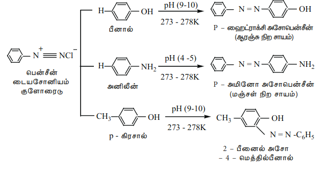

நேரடி ஹேலஜனேற்றத்தின் மூலம் அரைல் புளூரைடுகள் மற்றும் அயோடைடுகளை தயாரிக்க இயலாது. மேலும் குளோரோ பென்சீனில் குளோரினுக்கு பதிலாக சயனோ தொகுதியை பதிலீடு அடையச் செய்யவும் இயலாது. அத்தகைய ஹாலோ, சயனோ, \(-\text{OH}, -\text{NO}_2\) போன்ற தொகுதிகளை உடைய சேர்மங்களை உருவாக்க பென்சீன் டையசோனியம் குளோரைடு ஒரு மிகச்சிறந்த வினை இடைநிலைப் பொருளாகும். இணைப்பு வினையின் மூலம் பெறப்படும் டையசோ சேர்மங்கள் நிறமுடையவை. மேலும் சாயங்களாகப் பயன்படுகின்றன.

## 13.4 சயனைடுகள் மற்றும் ஐசோசயனைடுகள்

### 13.4.1 அறிமுகம்

இவைகள் ஹைட்ரோசயனிக் அமிலத்தின் (\( \text{HCN} \)) பெறுதிகளாகும். மேலும் பின்வரும் இரு இயங்கு சமநிலை மாற்றியங்களில் காணப்படுகிறது.

இரு வகையான ஆல்கைல் பெறுதிகளை உருவாக்கலாம். ஹைட்ரஜன் சயனைடில் உள்ள H – அணுவை ஆல்கைல் தொகுதியால் பதிலீடு செய்வதால் உருவாவது ஆல்கைல் சயனைடுகள் (\( \text{R}-\text{C} \equiv \text{N} \)) என அறியப்படுகின்றன. மேலும் ஹைட்ரஜன் ஐசோ சயனைடில் உள்ள H – அணுவானது பதிலீடு செய்யப்படின் உருவாவது ஆல்கைல் ஐசோ சயனைடுகள் (\( \text{R}-\text{N} \equiv \text{C} \)) எனப்படுகின்றன.

IUPAC பெயரிடும் முறையில், ஆல்கைல் சயனைடுகள் ஆல்கேன் நைட்ரைல்கள் எனவும் அரைல் சயனைடுகள் அரீன் கார்போ நைட்ரைல்கள் எனவும் அழைக்கப்படுகின்றன.

**அட்டவணை : சயனைடுகளுக்கு பெயரிடுதல்**
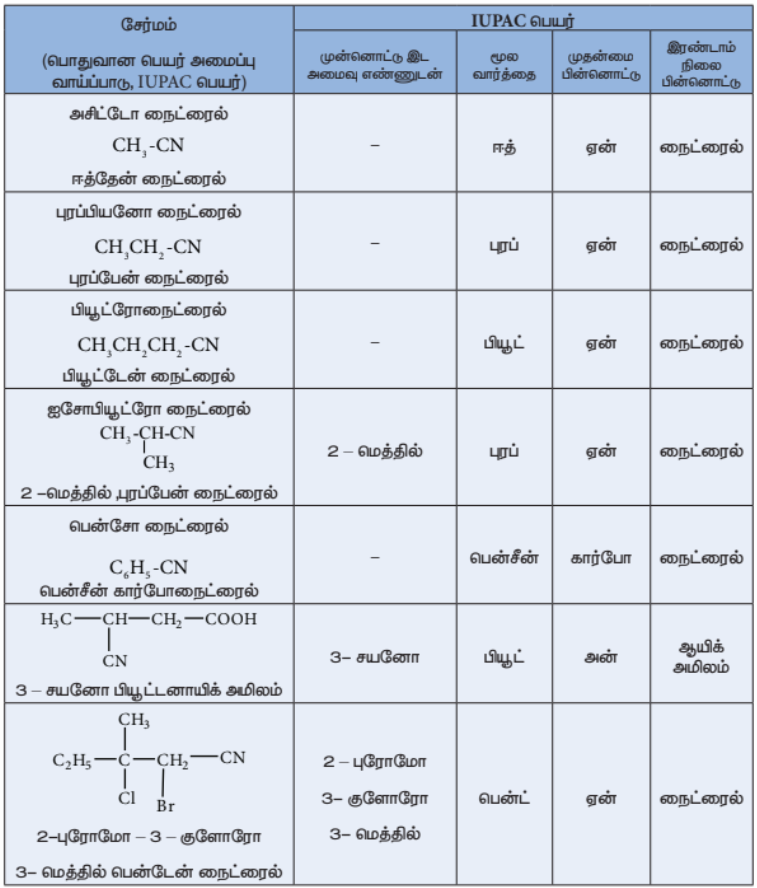

### 13.4.2 சயனைடுகளைத் தயாரிக்கும் முறைகள்**

**1. ஆல்கைல் ஹாலைடுகளிலிருந்து பெறுதல்**

ஆல்கைல் ஹாலைடுகளை \( \text{NaCN} \) (அல்லது) \( \text{KCN} \) கரைசலுடன் வினைப்படுத்தும் போது, ஆல்கைல் சயனைடுகள் உருவாகின்றன. இவ்வினையில் ஒரு புதிய கார்பன் – கார்பன் பிணைப்பு உருவாகிறது.

**எடுத்துக்காட்டு**

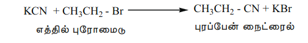

இம்முறையில் அரைல் சயனைடை தயாரிக்க இயலாது. கருக்கவர் பொருள் பதிலீட்டு வினைகளில் அவைகளின் குறைவான வினைபுரியும் தன்மையே இதற்கு காரணமாகும். அரைல் சயனைடுகள் சான்ட்மேயர் வினை மூலம் தயாரிக்கப்படுகின்றன.

**2. ஓரிணைய அமைடுகள் மற்றும் ஆல்டிஹைடுகளை \( \text{P}_2\text{O}_5 \) உடன் சேர்த்து நீரகற்றுதல்.**

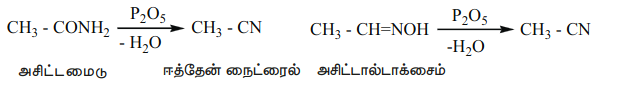

**3. \( \text{P}_2\text{O}_5 \) உடன் அம்மோனியம் கார்பாக்சிலேட்டு நீரகற்றம்**

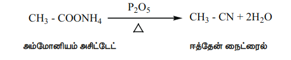

ஆல்கைல் சயனைடுகளை அதிக அளவில் தயாரிக்க இம்முறை பயன்படுகிறது.

**4. கிரிக்னார்டு வினைப்பொருளிலிருந்து பெறுதல்**

மெத்தில் மெக்னீசியம் புரோமைடு சயனோஜன் குளோரைடுடன் (\( \text{Cl} - \text{CN} \)) வினைப்படுத்தும் போது ஈத்தேன் நைட்ரைல் உருவாகிறது.

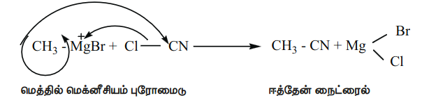

### 13.4.3 சயனைடுகளின் பண்புகள்

**இயற்பண்புகள்**

பதினான்கு கார்பன் அணுக்கள் வரை கொண்டுள்ள சேர்மங்கள் நிறமற்ற குறிப்பிடத்தகுந்த இனிப்பு மணமுடைய திரவங்களாகும். உயர் கார்பன் அணுக்களைக் கொண்டுள்ள சேர்மங்கள் படிக திண்மங்களாகும். இவைகள் நீரில் ஓரளவிற்கு கரைகின்றன. ஆனால் கரிம கரைப்பான்களில் நன்கு கரைகின்றன. இவைகள் நச்சுத் தன்மையுடையது.

ஒத்த அசிட்டிலீன்களுடன் ஒப்பிடும் போது, இவைகள் அதிக கொதிநிலையைக் கொண்டுள்ளன. ஏனெனில் இவைகள் அதிக இருமுனை திருப்புத்திறன் மதிப்பைக் கொண்டுள்ளன.

### 13.4.4 வேதிப் பண்புகள்

**1. நீராற்பகுப்பு**

காரம் அல்லது நீர்த்த கனிம அமிலங்களுடன் வெப்பப்படுத்தும் போது, சயனைடுகள் நீராற்பகுப்படைந்து கார்பாக்சிலிக் அமிலங்களைத் தருகின்றன.

**எடுத்துக்காட்டு**

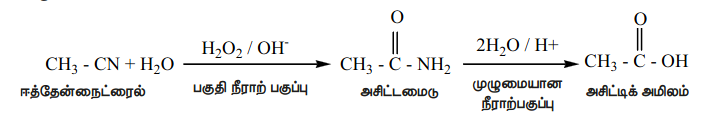
#### 2. ஒடுக்கம்
LiAlH\(_4\) அல்லது Ni / H\(_2\) கொண்டு ஆல்கைல் சயனைடுகளை ஒடுக்கமடையச் செய்யும் போது ஒரிணைய அமீன்கள் உருவாகின்றன.
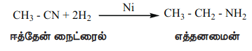

**3. குறுக்க வினை**

**அ. தோர்ப் (Thorpe) நைட்ரைல் குறுக்க வினை**

\( a-\text{H} \) அணுவைக் கொண்டுள்ள இரு மூலக்கூறு ஆல்கைல் நைட்ரைல்கள் சோடியம் / ஈதர் முன்னிலையில் சுய குறுக்கமடைந்து இமினோ நைட்ரைலைத் தருகின்றது.

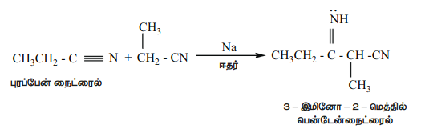

**ஆ.** \( \alpha \) ஹைட்ரஜனைக் கொண்டுள்ள நைட்ரைல்கள் எஸ்டர்களுடன் ஈதரில் உள்ள சோடமைடு முன்னிலையில் குறுக்க வினைக்கு உட்பட்டு கீட்டோ நைட்ரைல்களைத் தருகின்றது. இவ்வினை லெவைன் மற்றும் ஹௌசர் "Levine and Hauser" அசிட்டைலேற்ற வினை என அழைக்கப்படுகிறது.

எத்தாக்சி தொகுதியானது (\( \text{OC}_2\text{H}_5 \)) மெத்தைல் நைட்ரைல் (\( -\text{CH}_2\text{CN} \)) தொகுதியால் பதிலீடு செய்யப்படுதலை இவ்வினை உள்ளடக்கியது.

மேலும் இவ்வினை சயனோ மெத்திலேற்ற வினை என்றழைக்கப்படுகிறது.

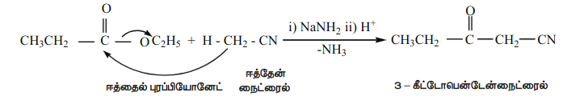

### 13.4.5 ஆல்கைல் ஐசோசயனைடுகள் (கார்பைலமீன்கள்)

**ஐசோசயனைடுகளுக்கு பெயரிடுதல்**

இவைகள் ஆல்கைல் ஐசோசயனைடுகள் என்ற பொதுப்பெயரால் அழைக்கப்படுகின்றன. IUPAC முறையில் ஆல்கைல் கார்பைலமீன்கள் என பெயரிடப்படுகின்றன.

**அட்டவணை : ஆல்கைல் ஐசோசயனைடுகளுக்கு பெயரிடுதல்**

| அமைப்பு வாய்ப்பாடு | பொதுப் பெயர் | IUPAC பெயர் |
|---|---|---|
| \( \text{CH}_3 - \text{NC} \) | மெத்தில் ஐசோசயனைடு | மெத்தில் கார்பைலமீன் |
| \( \text{CH}_3\text{CH}_2 - \text{NC} \) | எத்தில் ஐசோசயனைடு | எத்தில் கார்பைலமீன் |
| \( \text{CH}_3\text{CH}_2\text{CH}_2 - \text{NC} \) | புரொப்பைல் ஐசோசயனைடு | புரொப்பைல் கார்பைலமீன் |
| \( \text{C}_6\text{H}_5 - \text{NC} \) | பீனைல் ஐசோசயனைடு | பீனைல் கார்பைலமீன் |

### 13.4.6 ஐசோ சயனைடுகளைத் தயாரித்தல்

**1. ஓரிணைய அமீன்களிலிருந்து தயாரித்தல் (கார்பைலமீன் வினை)**

அலிபாட்டிக் / அரோமேட்டிக் அமீன்களை KOH முன்னிலையில் \( \text{CHCl}_3 \) உடன் வினைப்படுத்த கார்பைலமீன் உருவாகிறது.

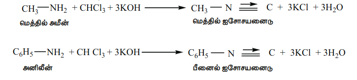

**2. ஆல்கைல் ஹாலைடுகளிலிருந்து தயாரித்தல்**

எத்தில் புரோமைடை எத்தனால் கலந்த \( \text{AgCN} \) உடன் வினைப்படுத்தும் போது எத்தில் ஐசோ சயனைடு மிகையளவு உருவாகும். இவ்வினையில் எத்தில் சயனைடு குறைந்த அளவு உருவாகும் வினைப்பொருளாகும்.

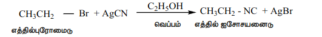

**3. N – ஆல்கைல் பார்மமைடிலிருந்து தயாரித்தல் பிரிடினில் உள்ள \( \text{POCI}_3 \) உடன் வினை**

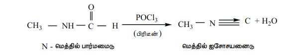

### 13.4.7 ஐசோசயனைடுகளின் பண்புகள்

#### இயற்பண்புகள்

• இவைகள் நிறமற்றவை, விரும்பத்தகாத மணமுடைய ஆவியாகும் நீர்மங்கள். மேலும் சயனைடுகளைக் காட்டிலும் அதிக நச்சுத் தன்மையுடையவை.

• நீரில் குறைந்த அளவே கரைகின்றன ஆனால் கரிமக் கரைப்பான்களில் நன்கு கரைகின்றன.

• ஆல்கைல் சயனைடுகளைக் காட்டிலும் ஒப்பீட்டளவில் குறைவான முனைவுத் தன்மை உடையவை. எனவே சயனைடுகளைக் காட்டிலும் இவைகளின் கொதிநிலை மற்றும் உருகுநிலை குறைவு.

### 13.4.8 வேதிப் பண்புகள்

**1. நீராற்பகுப்பு**

ஆல்கைல் சயனைடுகள் காரங்களால் நீராற்பகுப்பு அடைவதில்லை. எனினும் நீர்த்த கனிம அமிலங்களால் நீராற் பகுப்படைந்து ஓரிணைய அமீன்கள் மற்றும் பார்மிக் அமிலத்தைத் தருகிறது.

**2. ஒடுக்கம்**

வினைவேக மாற்றி அல்லது பிறவி நிலை ஹைட்ரஜனால் ஒடுக்கமடையச் செய்யும் போது, இவைகள் ஈரிணைய அமீன்களைத் தருகின்றன.

**3. மாற்றியமாதல்**

ஆல்கைல் ஐசோசயனைடுகளை \( 250^\circ \text{C} \) வெப்பநிலையில் வெப்பப்படுத்தும் போது, அவைகள் அதிக நிலைப்புத்தன்மையுடைய மாற்றிய சயனைடுகளைத் தருகின்றன.

**4. சேர்க்கை வினை**

ஆல்கைல் ஐசோசயனைடுகள், ஹாலஜன், சல்பர் மற்றும் ஆக்ஸிஜனுடன் சேர்க்கை வினை புரிந்து சேர்க்கை சேர்மங்களை உருவாக்குகின்றன.

### 13.4.9 கரிம நைட்ரஜன் சேர்மங்களின் பயன்கள்

**நைட்ரோ ஆல்கேன்கள்**

1. நைட்ரோ மீத்தேன் கார்களின் எரிபொருளாக பயன்படுகிறது.

2. குளோரோபிக்ரின் (\( \text{CCl}_3\text{NO}_2 \)) பூச்சிக்கொல்லியாகப் பயன்படுகிறது.

3. எரிபொருளுடன் சேர்க்கப்படும் பொருளாக நைட்ரோ ஈத்தேன் பயன்படுகிறது. மேலும் வெடிப்பொருள் தயாரிப்பில் முன்பொருளாக, பலபடிகள், செல்லுலோஸ் என்பார், தொகுப்பு இரப்பர் மற்றும் சாயங்களுக்கு கரைப்பானாக பயன்படுகிறது.

4. 'ஸ்வீட் ஸ்பிரிட் ஆப் நைட்ரேடு' எனப்படும் ஆல்கஹாலில் உள்ள 4% எத்தில் நைட்ரைட்டு கரைசல் ஆனது சிறுநீர்வெளியேற்றியாக (diuretic) பயன்படுகிறது.

**நைட்ரோ பென்சீன்**

1. மோட்டார்கள் மற்றும் இயந்திரங்களில் பயன்படுத்தப்படும் இளக்கி எண்ணெய்கள் தயாரிக்க நைட்ரோ பென்சீன் பயன்படுகிறது.

2. சாயங்கள், மருந்துகள், பூச்சிக்கொல்லிகள், தொகுப்பு இரப்பர்கள், அனிலின் மற்றும் TNT, TNB போன்ற வெடிபொருட்கள் தயாரிப்பில் பயன்படுகிறது.

**சயனைடுகள் மற்றும் ஐசோசயனைடுகள்**

1. அமிலங்கள், அமைடுகள், எஸ்டர்கள், அமீன்கள் போன்ற பல்வேறு கரிமச் சேர்மங்கள் தயாரிப்பில் ஆல்கைல் சயனைடுகள் முக்கியமான வினை இடைநிலை பொருட்களாகும்.

2. ஜவுளித் தொழிற்சாலைகளில் செயற்கை இரப்பர்கள் தயாரிப்பில் பயன்படுகிறது. மேலும் கரைப்பானாக குறிப்பாக, வாசனை திரவியத் தொழிற்சாலைகளில் பயன்படுகிறது.

> **புற்றநோய் மருத்து**
>
> மட்டோமசின்
> C, புற்றநோய் எதிர்ப்புக் காரணியானது வயிறு மற்றும் குடல் பகுதிகளில் ஏற்படும் புற்றநோய் சிகிச்சையில் பயன்படுகிறது.
> இதில் அசிரிடின் வளையம் காணப்படுகிறது.
> அசிரிடின் வினைச் செயல் தொகுதியானது DNA உடன் மருத்து சிதைவடைதலில் பங்கேற்கிறது. இதன் விளைவாக புற்றநோய் செல்கள் இறக்கின்றன.
>
> 