## 13.2 அமீன்கள் வகைப்படுத்துதல்
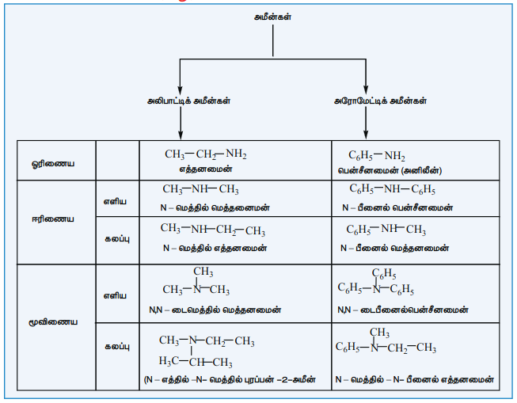

### 13.2.1 பெயரிடுதல்

**அ) பொதுவான பெயரிடும் முறை**

ஆல்கைல் தொகுதியை அமீனுக்கு முன்னொட்டாக சேர்த்து பொதுவான முறையில் பெயரிடப்படுகிறது. டை, ட்ரை மற்றும் டெட்ரா முதலிய முன்னொட்டுகள் முறையே இரண்டு, மூன்று மற்றும் நான்கு பதிலிகளை குறிப்பிட பயன்படுகிறது.

**ஆ) IUPAC முறை**

| சேர்மம் (பொதுவான பெயர் அமைப்பு வாய்ப்பாடு, IUPAC பெயர்) | முன்னொட்டு இட அமைவு எண்ணுடன் | மூல வார்த்தை | முதன்மை பின்னொட்டு | இரண்டாம் நிலை பின்னொட்டு |
|---|---|---|---|---|
| 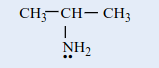 புரப்பன்-2-அமீன் | – | புரப் | அன் | 2- அமீன் |
| 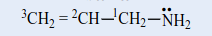 புரப்-2-ஈன்-1-அமீன் | – | புரப் | 2-ஈன் | -1-அமீன் |
| 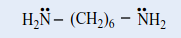 ஹெக்சேன்-1,6-டையமீன் | – | ஹெக்ஸ் | ஏன் | – 1,6 – டையமீன் |
| 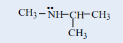 N–மெத்தில் புரப்பன்–2–அமீன் | N–மெத்தில் | புரப் | அன் | –2–அமீன் |
| 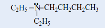 N,N–டை எத்தில் பியூட்டன்-1-அமீன் | N,N–டை எத்தில் | பியூட் | அன் | –1–அமீன் |
| 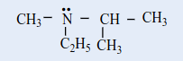 N–எத்தில்–N–மெத்தில் புரப்பன்–2–அமீன் | N–எத்தில்–N–மெத்தில் | புரப் | அன் | –2–அமீன் |
| 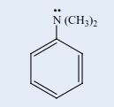 N,N–டைமெத்தில்பென்சனமீன் | N,N–டை மெத்தில் | பென்சன் | – | அமீன் |
| 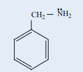 பினைல் மெத்தனமீன் | பினைல் | மெத் | அன் | அமீன் |
| 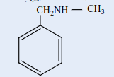 N–மெத்தில் பினைல் மெத்தனமீன் | N–மெத்தில் பினைல் | மெத் | அன் | அமீன் |

**தன்மதிப்பீடு**

பின்வரும் சேர்மங்களுக்கு வடிவமைப்புகளை வரை.

i. நியோபென்டைல் அமீன்

ii. மூவிணைய பியூட்டைல் அமீன்

iii. \( \alpha \)- அமினோ புரொப்பியோனிக் அமிலம்

iv. ட்ரைபென்டைல் அமீன்

v. N – எத்தில் –N – மெத்தில் ஹெக்ஸேன் –3–அமீன்

8) பின்வரும் அமீன்களுக்கு சரியான IUPAC பெயரைத் தருக

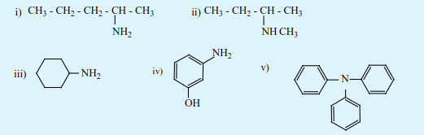

### 13.2.2 அமீன்களின் அமைப்பு

அம்மோனியாவைப் போன்று, அமீன்களில் உள்ள நைட்ரஜன் மும்மை இணைதிறனைப் பெற்றுள்ளது. மேலும் தனித்த எலக்ட்ரான் இரட்டையைக் கொண்டுள்ளது, \( sp^3 \) இனக்கலப்பு ஆர்பிட்டால்களில், மூன்று \( sp^3 \) இனக்கலப்பு ஆர்பிட்டால்கள் ஹைட்ரஜன் (அல்லது) ஆல்கைல் தொகுதி கார்பனின் ஆர்பிட்டால்களுடன் மேற்பொருந்துகிறது. நான்காவது \( sp^3 \) இனக்கலப்பு ஆர்பிட்டாலில் தனித்த இரட்டை எலக்ட்ரான் காணப்படுகிறது. எனவே, அமீன்கள் பிரமிடு வடிவத்தினை பெற்றுள்ளன. தனித்த இரட்டை எலக்ட்ரான் காணப்படுவதால் C- N- H (அல்லது) C- N- C பிணைப்புக் கோணமானது வழக்கமான நான்முகி பிணைப்புக் கோணமாக \( 109.5^\circ \) காட்டிலும் குறைவானதாகும். எடுத்துக்காட்டாக, ட்ரைமெத்தில் அமீனின் C- N- C பிணைப்புக் கோணம் \( 108^\circ \) ஆகும். இது நான்முகி பிணைப்புக் கோணத்தை விடக் குறைவு. மேலும் H- N- H பிணைப்புக் கோணமான \( 107^\circ \) ஐ விட அதிகம். பெரிய ஆல்கைல் தொகுதிகளுக்கு இடையேயான விலக்கு விசையே இந்த பிணைப்புக் கோண அதிகரிப்பிற்கு காரணமாகும்.
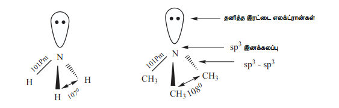
### 13.2.3 அமீன்களின் பொதுவான தயாரிப்பு முறைகள்

பின்வரும் முறைகளைப் பயன்படுத்தி அலிபாட்டிக் மற்றும் அரோமேட்டிக் அமீன்களைத் தயாரிக்கலாம்.

**1) நைட்ரோ சேர்மங்களிலிருந்து தயாரித்தல்**

$$
\mathrm{CH_3CH_2{-}NO_2}
\overset{3H_2/\mathrm{Ni}\ (\mathrm{அல்லது})}{\underset{\mathrm{Fe/HCl},\,6[H]}{\longrightarrow}}
\mathrm{CH_3CH_2{-}NH_2}
+2\mathrm{H_2O}
$$

$$
\scriptsize \text{நைட்ரோ ஈத்தேன்}
\hspace{3cm}
\scriptsize \text{எத்தனமைன்}
$$

$$
\mathrm{C_6H_5{-}NO_2}
\overset{3H_2/\mathrm{Pt},\,680\ \mathrm{K}}{\underset{(\mathrm{or})\ \mathrm{Sn/HCl}}{\longrightarrow}}
\mathrm{C_6H_5{-}NH_2}
+2\mathrm{H_2O}
$$

$$
\scriptsize \text{நைட்ரோ பென்சீன்}
\hspace{3cm}
\scriptsize \text{அனிலீன்}
$$

**2) நைட்ரைல்களிலிருந்து தயாரித்தல்**

அ) ஆல்கைல் அல்லது அரைல் சயனைடுகளை \( \text{H}_2 / \text{Ni} \) (அல்லது) \( \text{LiAlH}_4 \) (அல்லது) \( \text{Na} / \text{C}_2\text{H}_5\text{OH} \) ஆகியனவற்றைக் கொண்டு ஒடுக்கும் போது ஓரிணைய அமீன்கள் உருவாகின்றன. \( \text{Na} / \text{C}_2\text{H}_5\text{OH} \) ஐக் கொண்டு நிகழ்த்தப்படும் ஒடுக்க வினை மென்டியஸ் வினை (mendius) என அழைக்கப்படுகிறது.

$$
\mathrm{CH_3{-}CN}
\overset{\mathrm{Na(Hg)/C_2H_5OH}}{\underset{4[H]}{\longrightarrow}}
\mathrm{CH_3CH_2{-}NH_2}
$$

$$
\scriptsize \text{எத்தில் சயனைடு}
\hspace{3cm}
\scriptsize \text{எத்தனைமீன்}
$$

ஆ) சோடியம் அமல்கம் / \( \text{C}_2\text{H}_5\text{OH} \) கொண்டு ஐசோ சயனைடுகளை ஒடுக்கமடையச் செய்யும் போது ஈரிணைய அமீன்கள் உருவாகின்றன.

$$
\mathrm{CH_3{-}NC}
\overset{\mathrm{Na(Hg)/C_2H_5OH}}{\underset{4[H]}{\longrightarrow}}
\mathrm{CH_3{-}NH{-}CH_3}
$$

$$
\scriptsize \text{மெத்தில் ஐசோசயனைடு}
\hspace{3cm}
\scriptsize \text{N – மெத்தில் மெத்தனமைன்}
$$

**3) அமைடுகளிலிருந்து தயாரித்தல்**

அ) \( \text{LiAlH}_4 \) ஐக் கொண்டு அமைடுகளை ஒடுக்கம் செய்யும் போது அமீன்கள் உருவாகின்றன.

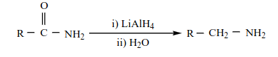
ஆ) ஹாஃப்மனின் இறக்க வினை

அமைடுகளை புரோமினுடன், நீர்த்த அல்லது ஆல்கஹாலில் கரைக்கப்பட்ட KOH முன்னிலையில் வினைப்படுத்த, அமைடை விட ஒரு கார்பனை குறைவான எண்ணிக்கையில் கொண்டுள்ள அமீன்கள் உருவாகின்றன.

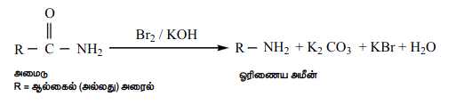

**4) ஆல்கைல் ஹாலைடுகளிலிருந்து தயாரித்தல்**

அ) காப்ரியல் தாலிமைடு தொகுப்பு முறை

அலிபாட்டிக் ஓரிணைய அமீன்களைத் தயாரிக்கப் பயன்படுகிறது. தாலிமைடை எத்தனால் கலந்த KOH உடன் வினைப்படுத்த தாலிமைடின் பொட்டாசியம் உப்பு உருவாகிறது. இதனை ஆல்கைல் ஹாலைடுடன் வெப்பப்படுத்தி, பின் கார நீராற்பகுப்பு அடையச் செய்யும் போது ஓரிணைய அமீன்கள் உருவாகின்றன. இம்முறையினைப் பயன்படுத்தி அனிலீனைத் தயாரிக்க இயலாது. ஏனெனில் தாலிமைடிலிருந்து உருவாகும் எதிர் அயனியுடன் அரைல் ஹாலைடுகள் கருக்கவர் பொருள் பதிலீட்டு வினைக்கு உட்படுவதில்லை.

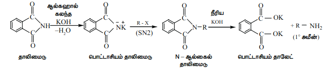

தாலிமைடு \quad பொட்டாசியம் தாலிமைடு \quad N – ஆல்கைல் தாலிமைடு \quad 1° அமீன்

ஆ) ஹாஃப்மெனின் அம்மோனியாவால் பகுப்பு

ஆல்கைல் ஹாலைடுகள் அல்லது பென்சைல் ஹாலைடுகளை ஒரு மூடப்பட்ட குழாயில் ஆல்கஹால் கலந்த அம்மோனியாவுடன் வினைப்படுத்தும் போது, \( 1^\circ, 2^\circ, 3^\circ \) மற்றும் நான்கிணைய அம்மோனியம் உப்புகள் உருவாகின்றன.

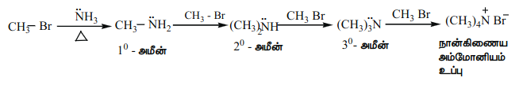

இவ்வினை ஒரு கருக்கவர் பதிலீட்டு வினையாகும். ஆல்கைல் ஹாலைடுகளின் ஹாலைடானது \(-\text{NH}_2\) தொகுதியால் பதிலீடு செய்யப்படுகிறது. இவ்வினையில் உருவாகும் விளைப்பொருளான ஓரிணைய அமீனும் கருக்கவர் பொருளாக செயல்படும் தன்மையுடையது. எனவே மிகுதியான ஆல்கைல் ஹாலைடு வினைக்கு உட்படுத்தப்படின், கருக்கவர் பதிலீட்டு வினை மேலும் நிகழ்ந்து நான்கிணைய அம்மோனிய உப்பினைத் தருகிறது. எனினும், இவ்வினையானது அதிக அளவு அம்மோனியா கொண்டு நிகழ்த்தப்படின், முதன்மை விளைப்பொருளாக ஓரிணைய அமீன் உருவாகிறது.

அமீன்களுடன் ஆல்கைல் ஹாலைடுகளின் வினைத்திறன் வரிசை

\[
\text{RI} > \text{RBr} > \text{RCl}
\]

இ) ஆல்கைல் ஹாலைடுகளை சோடியம் அசைடு (\( \text{NaN}_3 \)) வினைப்படுத்தி பின் லித்தியம் அலுமினியம் ஹைட்ரைடு கொண்டு ஒடுக்கமடையச் செய்வதன் மூலம் அவற்றை ஓரிணைய அமீன்களாக மாற்றலாம்.

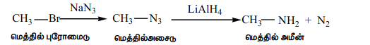

மெத்தில் புரோமைடு \quad மெத்தில் அசைடு \quad மெத்தில் அமீன்

ஈ) குளோரோபென்சீனிலிருந்து அனிலீனைத் தயாரித்தல்

குளோரோபென்சீனை ஆல்கஹால் கலந்த அம்மோனியாவுடன் வெப்பப்படுத்தும் போது அனிலின் உருவாகிறது.

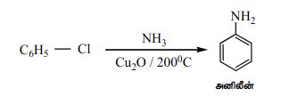

**5) ஹைட்ராக்சில் சேர்மங்களின் அம்மோனியாவால் பகுப்பு**

அ) ஆல்கஹால் மற்றும் அம்மோனியாவின் ஆவியினை அலுமினா, \( \text{W}_2\text{O}_5 \) அல்லது சிலிகா வழியே \( 400^\circ \text{C} \) ல் செலுத்தும் போது அனைத்து வகை அமீன்களும் உருவாகின்றன. இம்முறை சியாட்டியர் – மெய்வ்ஹி முறை என்றழைக்கப்படுகிறது.

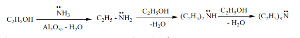

ஆ) பீனாலை அம்மோனியாவுடன் \( 300^\circ \text{C} \) ஸ்ரீற்ற \( \text{ZnCl}_2 \) முன்னிலையில் வினைப்படுத்தும் போது அனிலின் உருவாகிறது.

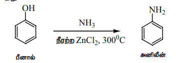

**அனிலின்**

### 13.2.4 அமீன்களின் பண்புகள்

**1. இயற்நிலை மற்றும் மணம்**

குறைவான கார்பன் அணுக்களைக் கொண்ட அலிபாட்டிக் அமீன்கள் (\( C_1-C_2 \)) நிறமற்ற வாயுக்களாகும். மேலும் அம்மோனியா போன்ற மணத்தை கொண்டுள்ளது. நான்கு அல்லது அதற்கு மேற்பட்ட கார்பன் அணுக்களைக் கொண்டுள்ளவை, மீனின் மணமுடைய ஆவியாகும் நீர்மங்கள்.

அனிலின் மற்றும் பிற அரைல் அமீன்கள் வழக்கமாக நிறமற்றவை. ஆனால் காற்றுடன் தொடர்பு ஏற்படும் போது அவைகள் ஆக்ஸிஜனேற்றத்தினால் நிறமுடையவையாகின்றன.

**2. கொதிநிலை**

ஓரிணைய மற்றும் ஈரிணைய அமீன்களின் முனைவுத் தன்மையினால் நைட்ரஜனின் தனித்த எலக்ட்ரான், இரட்டையை பயன்படுத்தி மூலக்கூறுகளுக்கிடையேயான ஹைட்ரஜன் பிணைப்பினை ஏற்படுத்துகின்றன. மூவிணைய அமீன்களில் இத்தகைய H – பிணைப்பு காணப்படுவதில்லை.

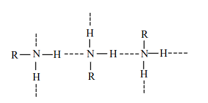

பல்வேறு அமீன்களின் கொதிநிலை வரிசை பின்வருமாறு

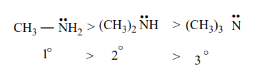

அமீன்கள், ஆல்கஹால்களைக் காட்டிலும் குறைவான கொதிநிலையுடையவை. ஏனெனில் ஆக்ஸிஜனைக் காட்டிலும் நைட்ரஜன் குறைவான எலக்ட்ரான் கவர் தன்மையைப் பெற்றுள்ளதால் N-H பிணைப்பானது -OH பிணைப்பைக் காட்டிலும் குறைவான முனைவுத் தன்மையுடையது.

அட்டவணை : ஒப்பிடத்தக்க மூலக்கூறு நிறை உடைய அமீன்கள், ஆல்கஹால்கள் மற்றும் ஆல்கேன்களின் கொதிநிலை

| வ.எண் | சேர்மம் | மூலக்கூறு நிறை (கி.மோல்\(^{-1}\)) | கொதிநிலை (K) |
|---|---|---|---|
| 1. | \( \text{CH}_3(\text{CH}_2)_2\text{NH}_2 \) | 59 | 321 |
| 2. | \( \text{C}_2\text{H}_5-\text{NH}-\text{CH}_3 \) | 59 | 308 |
| 3. | \( (\text{CH}_3)_3\text{N} \) | 59 | 277 |
| 4. | \( \text{CH}_3\text{CH}(\text{OH})\text{CH}_3 \) | 60 | 355 |
| 5. | \( \text{CH}_3\text{CH}_2\text{CH}_2\text{CH}_3 \) | 58 | 272.5 |

**3) கரைதிறன்**

குறைவான கார்பன் அணுக்களைக் கொண்டுள்ள அலிபாட்டிக் அமீன்கள் நீரில் கரையும். ஏனெனில் இவைகள் நீருடன் ஹைட்ரஜன் பிணைப்பினை ஏற்படுத்துகின்றன. எனினும், அமீன்களின் மூலக்கூறு நிறை அதிகரிக்கும் போது அவைகளின் கரைதிறன் குறைகிறது. ஏனெனில் நீர் வெறுக்கும் ஆல்கைல் தொகுதியின் உருவளவு அதிகரிக்கின்றது. அரோமேட்டிக் அமீன்கள் நீரில் கரைவதில்லை. ஆனால் பென்சீன், ஈதர் போன்ற கரிமக்கரைப்பான்களில் எளிதில் கரைகின்றன.

### 13.2.5 வேதிப் பண்புகள்

அமீன்கள் நைட்ரஜன் அணுவின் மீது காணப்படும் தனித்த இரட்டை எலக்ட்ரான்கள் அவற்றை காரத்தன்மை உடையதாக்குகிறது. மேலும் கருக்கவர் பொருளாக செயல்படவும் காரணமாய் அமைகிறது. கனிம அமிலங்களுடன் உப்புகளைத் தருகின்றன.

**எடுத்துக்காட்டு**

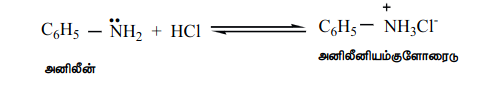

அனிலின் \quad அனிலினியம் குளோரைடு

**அமீன்களின் காரவலிமைக்கான கோவை**

நீர்க்கரைசலில், பின்வரும் சமநிலை நிலவுகிறது. இச்சமநிலை பெரும்பாலும் இடது புறம் நோக்கி உள்ளது எனவே \( \text{NaOH} \) உடன் ஒப்பிடும் போது அமீன்கள் வலிமை குறைவான காரமாகும்.

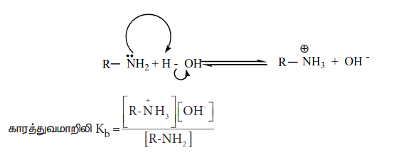

அமீன்கள் நீரிலிருந்து எந்த அளவிற்கு ஹைட்ரஜன் அயனியை (\( H^+ \)) ஏற்கும் தன்மையை பெற்றுள்ளது என்பதனை காரத்துவ மாறிலி (\( K_b \)) ன் மூலம் அறியலாம். \( K_b \) மதிப்பு அதிகம் அதாவது \( pK_b \) ன் மதிப்பு குறைவு எனில், காரம் வலிமை மிக்கது என நாம் அறிவோம்.

அட்டவணை : நீர்க்கரைசலில் அமீன்களின் \( pK_b \) மதிப்புகள், (\( \text{NH}_3 \) ன் \( pK_b \) மதிப்பு 4.74).

| அமீன்கள் | pKb | அமீன்கள் | pKb | அமீன்கள் | pKb |
|---|---:|---|---:|---|---:|
| 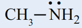 | 3.38 | 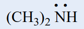 | 3.29 | 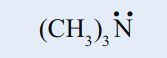 | 4.70 |
| 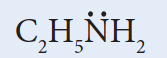 | 3.28 | 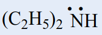 | 3.00 | 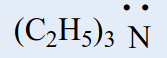 | 9.30 |
| 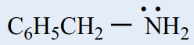 | 4.22 | 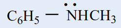 | 3.25 | 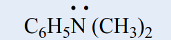 | 8.92 |

**அமீன்களின் காரத்தன்மை மீதான அமைவகளின் வடிவமைப்பின் விளைவு**

அமிலத்துடன் பங்கிடப்படுவதற்கு ஏதுவாக நைட்ரஜன் மீதுள்ள எலக்ட்ரான் இரட்டை அமைந்திருப்பதை அதிகரிக்கும் காரணிகள் அமீன்களின் காரத்தன்மையை அதிகரிக்கின்றன. ஆல்கைல் தொகுதி போன்ற \( +I \) தொகுதிகள் நைட்ரஜனுடன் இணைக்கப்பட்டிருப்பின் அவை நைட்ரஜன் மீதான எலக்ட்ரான் அடர்த்தியினை அதிகரிக்கச் செய்கின்றன. இதன் விளைவாக எலக்ட்ரான் இரட்டையானது புரோட்டானை ஏற்பது எளிதாகிறது. எனவே, ஆல்கைல் அமீன்கள் அம்மோனியாவை விட அதிக காரத்தன்மை உடையவை.

அ) ஆல்கைல் அமீனுடன் (\( \text{R}-\text{NH}_2 \)) புரோட்டானின் வினையைக் கருதுவோம்.

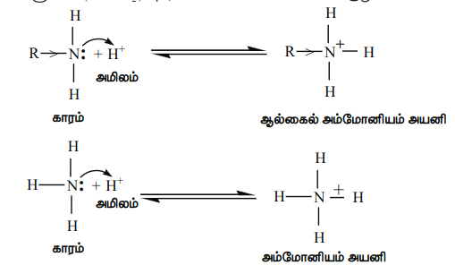

எலக்ட்ரானை விருவிக்கும் இயல்புடைய ஆல்கைல் தொகுதி R ஆனது அமீன்களில் உள்ள நைட்ரஜனை நோக்கி (\( \text{R}-\text{NH}_2 \)) எலக்ட்ரான் நகர காரணமாக அமைகிறது. மேலும், புரோட்டானுடன், தனித்த எலக்ட்ரான் இரட்டை பங்கிடுவதை ஊக்குவிக்கிறது. எனவே, அலிஃபாடிக் அமீன்களின் எதிர்பார்க்கப்படும் காரத்தன்மை (வாயுநிலையில்) பின்வரும் வரிசையில் அமைகிறது.

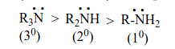

மேற்கண்டுள்ள வரிசையானது அவைகளின் நீர்க்கரைசலில் சீராக இருப்பதில்லை என்பதை அட்டவணையில் கொடுக்கப்பட்டுள்ள அவைகளின் \( pK_b \) மதிப்புகளிலிருந்து அறியலாம். அமீன்களின் காரத்தன்மை ஒப்பிட தூண்டல் விளைவு, கரைப்பானேற்ற விளைவு, கொள்ளிடத் தடை போன்ற விளைவுகளை கருத்தில் கொள்ள வேண்டும்.

**கரைப்பானேற்ற விளைவு**

நீர்க்கரைசலில் பதிலீடடைந்த அம்மோனியம் நேரயனிகள் ஆல்கைல் தொகுதிகளின் எலக்ட்ரான் விடுவிக்கும் (\( +I \)) விளைவு மட்டுமல்லாமல் நீர் மூலக்கூறுகளின் கரைப்பானேற்றத்தாலும் நிலைப்புத் தன்மை பெறுகின்றன. அயனியின் உருவளவு அதிகரிக்கும் போது கரைப்பானேற்றம் குறைகிறது. மேலும், நிலைப்புத்தன்மையும் குறைவு. ஈரிணைய மற்றும் மூவிணைய அமீன்களில் கொள்ளிடத் தடையின் காரணமாக, புரோட்டானேற்றம் அடைந்த அமீனை அணுகும் நீர் மூலக்கூறுகளின் எண்ணிக்கை குறைகிறது. எனவே காரத்தன்மையின் வரிசை பின்வருமாறு

மேற்கண்டுள்ள விளைவுகளின் அடிப்படையில், நீர்க்கரைசலில் ஆல்கைல் பதிலீடு அடைந்த அமீன்களின் கார வலிமையின் வரிசை பின்வருமாறு.

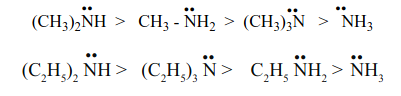

\( +I \) விளைவு, கொள்ளிட விளைவு மற்றும் நீரேற்ற விளைவு ஆகியனவற்றின் விளைவாக \( 2^\circ \) அமீன் ஆனது அதிக காரத்தன்மையினைப் பெறுகிறது.

**அனிலினின் கார வலிமை**

அனிலினில் \( \text{NH}_2 \) தொகுதியானது பென்சீன் வளையத்துடன் நேரடியாக இணைக்கப்பட்டுள்ளது. அனிலினின் நைட்ரஜன் அணு மீதான தனித்த இரட்டை எலக்ட்ரான் பென்சீன் வளையத்தினுள் உள்ளடங்காத் தன்மையினைப் பெற்றுள்ளது. எனவே, புரோட்டானேற்றத்திற்கு தனித்த எலக்ட்ரான் கிடைக்கக்கூடிய வாய்ப்பு குறைகிறது. இதன் விளைவாக அரோமேட்டிக் அமீன்கள் (அனிலின்), அம்மோனியாவை (\( \text{NH}_3 \)) காட்டிலும் குறைவான காரத் தன்மையைப் பெறுகின்றது.

பதிலீடடைந்த அனிலினில், \(-\text{CH}_3, -\text{OCH}_3, -\text{NH}_2\) போன்ற எலக்ட்ரானை விடுவிக்கும் இயல்புடைய தொகுதிகள் காரத்தின் வலிமையினை அதிகரிக்கின்றன. மேலும் எலக்ட்ரானை பெறும் இயல்புடைய தொகுதிகளான \( -\text{NO}_2, -\text{X}, -\text{COOH} \) போன்றவை காரத்தின் வலிமையினைக் குறைக்கின்றது.

அட்டவணை : பதிலிடப்பட்ட அனிலின்களின் \( pK_b \)'s மதிப்புகள் (அனிலினின் \( pK_b \) மதிப்பு 9.376)

| பதிலி | \( pK_b \) | பதிலி | \( pK_b \) | பதிலி | \( pK_b \) |
|---|---|---|---|---|---|
| \( o - \text{CH}_3 \) | 9.60 | \( m - \text{CH}_3 \) | 9.31 | \( p - \text{CH}_3 \) | 8.92 |
| \( o - \text{NH}_2 \) | 9.52 | \( m - \text{NH}_2 \) | 9.00 | \( p - \text{NH}_2 \) | 7.83 |
| \( o - \text{OCH}_3 \) | 9.52 | \( m - \text{OCH}_3 \) | 9.70 | \( p - \text{OCH}_3 \) | 8.70 |
| \( o - \text{NO}_2 \) | 14.30 | \( m - \text{NO}_2 \) | 11.52 | \( p - \text{NO}_2 \) | 13.00 |
| \( o - \text{Cl} \) | 11.25 | \( m - \text{Cl} \) | 10.52 | \( p - \text{Cl} \) | 10.00 |

அமீன்களின் ஒப்பீட்டு காரத்துவ வரிசை பின்வருமாறு

ஆல்கைல் அமீன்கள் > அரைல்கைல் அமீன்கள் > அம்மோனியா > N – அரைல்கைல் அமீன்கள் > அரைல் அமீன்கள்

### 13.2.6 அமீன்களின் வேதிப்பண்புகள்

**1) ஆல்கைலேற்றம்**

அமீன்கள், ஆல்கைல் ஹாலைடுகளுடன் வினைபட்டு \( 2^\circ \) மற்றும் \( 3^\circ \) மற்றும் நான்கிணைய அம்மோனியம் உப்புக்களை தொடர்ச்சியாகத் தருகிறது.

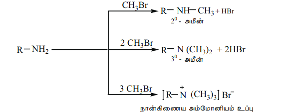

**நான்கிணைய அம்மோனியம் உப்பு**

**2) அசைலேற்றம்**

அலிபாட்டிக் / அரோமேட்டிக் ஓரிணைய மற்றும் ஈரிணைய அமீன்கள் பிரிடின் முன்னிலையில் அசைல் குளோரைடு அல்லது அசிட்டிக் அமில நீரிலியுடன் வினைபட்டு N – ஆல்கைல் அசிட்டமைடைத் தருகிறது.

**எடுத்துக்காட்டு**

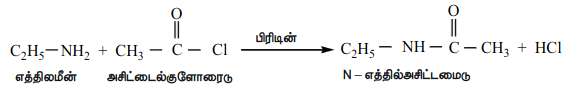

**3) ஸ்காட்டன் – பௌமன் வினை**

அனிலின் ஆனது \( \text{NaOH} \) முன்னிலையில் பென்சாயில் குளோரைடுடன் வினைபட்டு N – பீனைல் பென்சமைடைத் தருகிறது. இவ்வினை ஸ்காட்டன் – பௌமன் வினை எனப்படுகிறது. அசைலேற்றம் மற்றும் பென்சாயிலேற்ற வினைகள் கருக்கவர் பொருள் பதிலீட்டு வினைகளாகும்.

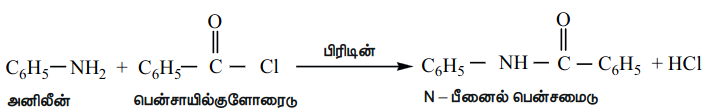

**4) நைட்ரஸ் அமிலத்துடன் வினை**

மூன்று வகையான அமீன்களும், வினை நிகழ் இடத்தில் \( \text{NaNO}_2 \) மற்றும் அடர் \( \text{HCl} \) கலந்து உருவாக்கப்படும் நைட்ரஸ் அமிலத்துடன் வெவ்வேறு முறையில் வினைபுரிகின்றன.

அ) ஓரிணைய அமீன்கள்

i) எத்தில் அமீன் நைட்ரஸ் அமிலத்துடன் வினைபுரிந்து நிலைப்புத் தன்மையற்ற எத்தில் டையசோனியம் குளோரைடைத் தருகிறது. மேலும் இது நைட்ரஜனை வெளியேற்றி எத்தனாலை உருவாக்குகிறது.

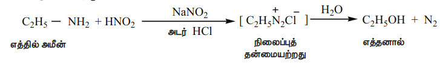

ii) அனிலின் குறைவான வெப்பநிலையில் (273 K – 278K) நைட்ரஸ் அமிலத்துடன் வினைப்பட்டு பென்சீன் டையசோனியம் குளோரைடைத் தருகிறது. இது குறைவான நேரம் மட்டுமே நிலைப்புத் தன்மை உடையது. மேலும் அறை வெப்பநிலையில் கூட இது மெதுவாக சிதைவடைகிறது. இவ்வினை டையசோ ஆக்கல் வினை எனப்படுகிறது.

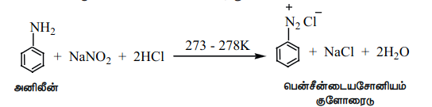

ஆ) ஈரிணைய அமீன்கள்

ஆல்கைல் மற்றும் அரைல் ஈரிணைய அமீன்கள் நைட்ரஸ் அமிலத்துடன் வினைபுரிந்து மஞ்சள் நிற எண்ணெய் போன்ற N – நைட்ரோசோ அமீனைத் தருகிறது. இது நீரில் கரைவதில்லை.

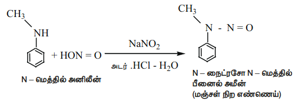

இவ்வினை விபர்மேன் நைட்ரோசோ மாதிரி எனப்படுகிறது.

இ) மூவிணைய அமீன்

i) அலிபாட்டிக் மூவிணைய அமீன் நைட்ரஸ் அமிலத்துடன் வினைபுரிந்து நீரில் கரையக்கூடிய ட்ரை ஆல்கைல் அம்மோனியம் நைட்ரைட் உப்பினைத் தருகிறது.

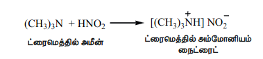

ii) அரோமேட்டிக் மூவிணைய அமீன், நைட்ரஸ் அமிலத்துடன் 273K வெப்பநிலையில் வினைபுரிந்து p – நைட்ரோசோ சேர்மத்தைத் தருகிறது.

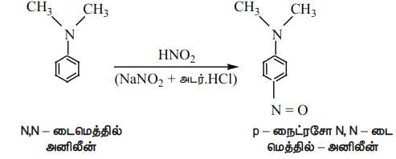

**5) கார்பைலமீன் சோதனை**

அலிபாட்டிக் (அல்லது) அரோமேட்டிக் ஓரிணைய அமீன்கள் குளோரோபார்ம் மற்றும் ஆல்கஹால் கலந்த KOH உடன் வினைபுரிந்து அரும்பெறுக்கத்தக்க மணமுடைய ஐசோசயனைடுகளை (கார்பைலமீன்) தருகின்றன. இவ்வினை கார்பைலமீன் சோதனை என்றழைக்கப்படுகிறது. இச்சோதனை ஓரிணைய அமீன்களை கண்டறியப் பயன்படுகிறது.

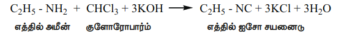

எத்தில் அமீன் \quad குளோரோபார்ம் \quad எத்தில் ஐசோ சயனைடு

**6) கடுகு எண்ணெய் வினை**

i) ஓரிணைய அமீன்களை கார்பன் டைசல்பைடுடன் (\( \text{CS}_2 \)) வினைப்படுத்தும் போது, N – ஆல்கைல் டைதயோ கார்பாமிக் அமிலம் உருவாகிறது. இதனுடன் \( \text{HgCl}_2 \) சேர்த்து வினைப்படுத்தும் போது ஆல்கைல் ஐசோதயோசயனேட் உருவாகிறது.

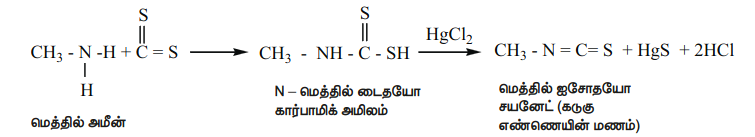

ii) அனிலீனை கார்பன் டைசல்பைடுடன் வினைப்படுத்தும் போது, \( S \)-டைபீனைல் தயோயூரியா உருவாகிறது.

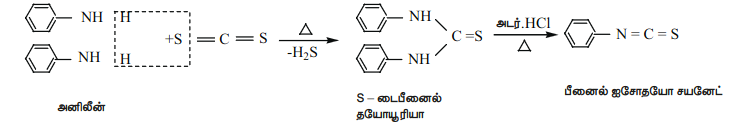

இவ்வினை ஹாஃப்மனின் கடுகு எண்ணெய் வினை அழைக்கப்படுகிறது. இவ்வினையும் ஓரிணைய அமீன்களை கண்டறிய பயன்படுகிறது.

**7. அனிலினின் எலக்ட்ரான் கவர் பொருள் பதிலீட்டு வினை**

\( -\text{NH}_2 \) தொகுதியானது ஒரு வலிமையான கிளர்வுறுத்தும் தொகுதியாகும். அனிலினில் \( \text{NH}_2 \) தொகுதியானது பென்சீன் வளையத்துடன் நேரடியாக இணைக்கப்பட்டுள்ளது. நைட்ரஜன் மீதுள்ள தனித்த எலக்ட்ரான் இரட்டையானது பென்சீன் வளையத்துடன் உடனிமையில் ஈடுபடுகிறது. இதன் விளைவாக ஆர்தோ மற்றும் பாரா இடங்களில் எலக்ட்ரான் அடர்வு அதிகரிக்கின்றது. எனவே எலக்ட்ரான் கவர் பொருள் ஆர்தோ மற்றும் பாரா இடங்களை தாக்க வாய்ப்பு ஏற்படுகிறது.

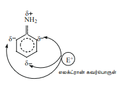

i) புரோமினேற்றம்

அனிலின் \( \text{Br}_2 / \text{H}_2\text{O} \) உடன் வினைபட்டு வெண்மை நிற வீழ்படிவான 2,4,6 – ட்ரை புரோமோ அனிலினைத் தருகிறது.

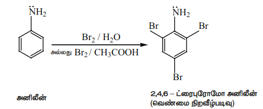

மோனோ புரோமோ பெறுதலைப் பெற, \( -\text{NH}_2 \) தொகுதியானது அசைலேற்றம் அடையச் செய்யப்பட்டு அதன் வினைத்திறன் குறைக்கப்படுகிறது.

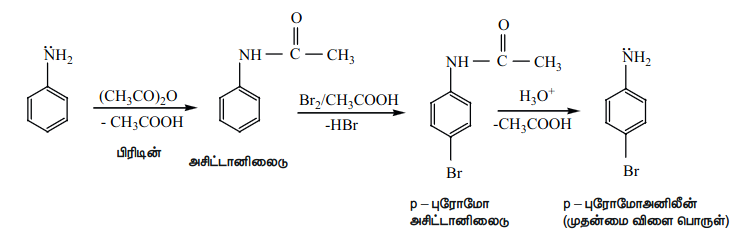

அனிலினை அசிட்டைலேற்றம் அடையச் செய்யும் போது, நைட்ரஜனின் தனித்த இரட்டை எலக்ட்ரான் ஆனது அருகில் உள்ள கார்பனைல் தொகுதியுடன் உடனிமையில் ஈடுபடுவதால் உள்ளடங்காத் தன்மையைப் பெறுகிறது. எனவே நைட்ரஜனின் தனித்த எலக்ட்ரான் பென்சீன் வளையத்தில் உள்ளடங்காத் தன்மையை ஏற்படுத்த வாய்ப்பு குறைகிறது.

எனவே எலக்ட்ரான் கவர் பொருள் பதிலீட்டு வினைகளில் அசிட்டமினோ தொகுதியின் கிளர்வுறுத்தும் திறன் குறைவு.

ii) நைட்ரோ ஏற்றம்

அனிலினின் நேரடி நைட்ரோ ஏற்றத்தினால் \( o \)- மற்றும் \( p \)-நைட்ரோ அனிலின் உருவாகிறது. இதனுடன் ஆக்ஸிஜனேற்றத்தின் காரணமாக அடர் நிற தார் (tars) உருவாகிறது. மேலும் வலிமை மிக்க அமில ஊடகத்தில் அனிலின் புரோட்டானேற்றம் அடைந்து அனிலினியம் அயனியைத் தருவதால் \( m \)- நைட்ரோ அனிலின் உருவாகிறது.

பாரா விளைபொருளைப் பெற, அசிட்டிக் அமில நீரிலியுடன் வினைப்படுத்தி அசைடேற்றம் அடையச் செய்வதன் மூலம் \( -\text{NH}_2 \) தொகுதி பாதுகாக்கப்படுகிறது. பின்னர், நைட்ரோ ஏற்ற விளைபொருள் நீராற்பகுப்படையச் செய்து விளைபொருள் பெறப்படுகிறது.

iii) சல்போனேற்றம்

அனிலின் அடர் \( \text{H}_2\text{SO}_4 \) உடன் வினைபுரிந்து அனிலினியம் ஹைட்ரஜன் சல்பேட்டைத் தருகிறது. இதனை 453 – 473K ல் \( \text{H}_2\text{SO}_4 \) உடன் வினைப்படுத்த \( p \)- அமினோ பென்சீன் சல்போனிக் அமிலத்தை முதன்மை விளைபொருளாக தருகிறது.

அனிலின் பிரீடல் கிராப்ட் வினைக்கு உட்படுவதில்லை. அனிலின் காரத்தன்மை உடையது என நாம் அறிவோம். மேலும் இது தனது தனித்த இரட்டை எலக்ட்ரானை \( \text{AlCl}_3 \) போன்ற லூயி அமிலத்திற்கு வழங்கி சேர்க்கை விளைபொருளை உருவாக்குவதன் காரணமாக எலக்ட்ரான் கவர் பொருள் பதிலீட்டு வினை நிகழ்வது தடுக்கப்படுகிறது.

