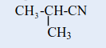
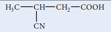
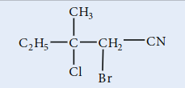

## 13.4 சயனைடுகள் மற்றும் ஐசோசயனைடுகள்

### 13.4.1 அறிமுகம்

இவைகள் ஹைட்ரோசயனிக் அமிலத்தின் (\( \text{HCN} \)) பெறுதிகளாகும். மேலும் பின்வரும் இரு இயங்கு சமநிலை மாற்றியங்களில் காணப்படுகிறது.

\[
\text{H} - \text{C} \equiv \text{N} \rightleftharpoons \text{H} - \text{N} \equiv \text{C}
\]
$$ஹைட்ரோசயனிக் அமிலம் \quad ஐசோசயனிக் அமிலம்$$

இரு வகையான ஆல்கைல் பெறுதிகளை உருவாக்கலாம். ஹைட்ரஜன் சயனைடில் உள்ள H – அணுவை ஆல்கைல் தொகுதியால் பதிலீடு செய்வதால் உருவாவது ஆல்கைல் சயனைடுகள் (\( \text{R}-\text{C} \equiv \text{N} \)) என அறியப்படுகின்றன. மேலும் ஹைட்ரஜன் ஐசோ சயனைடில் உள்ள H – அணுவானது பதிலீடு செய்யப்படின் உருவாவது ஆல்கைல் ஐசோ சயனைடுகள் (\( \text{R}-\text{N} \equiv \text{C} \)) எனப்படுகின்றன.

IUPAC பெயரிடும் முறையில், ஆல்கைல் சயனைடுகள் ஆல்கேன் நைட்ரைல்கள் எனவும் அரைல் சயனைடுகள் அரீன் கார்போ நைட்ரைல்கள் எனவும் அழைக்கப்படுகின்றன.

**அட்டவணை : சயனைடுகளுக்கு பெயரிடுதல்**
| சேர்மம் (பொதுவான பெயர் அமைப்பு வாய்ப்பாடு, IUPAC பெயர்) | முன்னொட்டு இட அமைவு எண்ணுடன் | மூல வார்த்தை | முதன்மை பின்னொட்டு | இரண்டாம் நிலை பின்னொட்டு |
|---|---|---|---|---|
| அசிட்டோ சயனைடு  ரத்தேன் சயனைடு | – | ரத் | ஏன் | சயனைடு |
| புரப்பியோனோ சயனைடு  புரப்பேன் சயனைடு | – | புரப் | ஏன் | சயனைடு |
| பியூட்டிரோ சயனைடு  பியூட்டேன் சயனைடு | – | பியூட் | ஏன் | சயனைடு |
| ஐசோபியூட்டிரோ சயனைடு  2–மெத்தில் புரப்பேன் சயனைடு | 2–மெத்தில் | புரப் | ஏன் | சயனைடு |
| பென்சோ சயனைடு  பென்சன் கார்போசயனைடு | – | பென்சன் | கார்போ | சயனைடு |
|  3–சயனோ பியூட்டனாயிக் அமிலம் | 3–சயனோ | பியூட் | அன் | ஆயிக் அமிலம் |
|  2–புரோமோ–3–குளோரோ–3–மெத்தில் பென்டேன் சயனைடு | 2–புரோமோ 3–குளோரோ 3–மெத்தில் | பென்ட் | ஏன் | சயனைடு |

**13.4.2 சயனைடுகளைத் தயாரிக்கும் முறைகள்**

**1. ஆல்கைல் ஹாலைடுகளிலிருந்து பெறுதல்**

ஆல்கைல் ஹாலைடுகளை \( \text{NaCN} \) (அல்லது) \( \text{KCN} \) கரைசலுடன் வினைப்படுத்தும் போது, ஆல்கைல் சயனைடுகள் உருவாகின்றன. இவ்வினையில் ஒரு புதிய கார்பன் – கார்பன் பிணைப்பு உருவாகிறது.

**எடுத்துக்காட்டு**

இம்முறையில் அரைல் சயனைடை தயாரிக்க இயலாது. கருக்கவர் பொருள் பதிலீட்டு வினைகளில் அவைகளின் குறைவான வினைபுரியும் தன்மையே இதற்கு காரணமாகும். அரைல் சயனைடுகள் சான்ட்மேயர் வினை மூலம் தயாரிக்கப்படுகின்றன.

**2. ஓரிணைய அமைடுகள் மற்றும் ஆல்டிஹைடுகளை \( \text{P}_2\text{O}_5 \) உடன் சேர்த்து நீரகற்றுதல்.**

**3. \( \text{P}_2\text{O}_5 \) உடன் அம்மோனியம் கார்பாக்சிலேட்டு நீரகற்றம்**

ஆல்கைல் சயனைடுகளை அதிக அளவில் தயாரிக்க இம்முறை பயன்படுகிறது.

**4. கிரிக்னார்டு வினைப்பொருளிலிருந்து பெறுதல்**

மெத்தில் மெக்னீசியம் புரோமைடு சயனோஜன் குளோரைடுடன் (\( \text{Cl} - \text{CN} \)) வினைப்படுத்தும் போது ஈத்தேன் நைட்ரைல் உருவாகிறது.

### 13.4.3 சயனைடுகளின் பண்புகள்

**இயற்பண்புகள்**

பதினான்கு கார்பன் அணுக்கள் வரை கொண்டுள்ள சேர்மங்கள் நிறமற்ற குறிப்பிடத்தகுந்த இனிப்பு மணமுடைய திரவங்களாகும். உயர் கார்பன் அணுக்களைக் கொண்டுள்ள சேர்மங்கள் படிக திண்மங்களாகும். இவைகள் நீரில் ஓரளவிற்கு கரைகின்றன. ஆனால் கரிம கரைப்பான்களில் நன்கு கரைகின்றன. இவைகள் நச்சுத் தன்மையுடையது.

ஒத்த அசிட்டிலீன்களுடன் ஒப்பிடும் போது, இவைகள் அதிக கொதிநிலையைக் கொண்டுள்ளன. ஏனெனில் இவைகள் அதிக இருமுனை திருப்புத்திறன் மதிப்பைக் கொண்டுள்ளன.

### 13.4.4 வேதிப் பண்புகள்

**1. நீராற்பகுப்பு**

காரம் அல்லது நீர்த்த கனிம அமிலங்களுடன் வெப்பப்படுத்தும் போது, சயனைடுகள் நீராற்பகுப்படைந்து கார்பாக்சிலிக் அமிலங்களைத் தருகின்றன.

**எடுத்துக்காட்டு**

#### 2. ஒடுக்கம்

**3. குறுக்க வினை**

அ. தோர்ப் (Thorpe) நைட்ரைல் குறுக்க வினை

\( a-\text{H} \) அணுவைக் கொண்டுள்ள இரு மூலக்கூறு ஆல்கைல் நைட்ரைல்கள் சோடியம் / ஈதர் முன்னிலையில் சுய குறுக்கமடைந்து இமினோ நைட்ரைலைத் தருகின்றது.

ஆ. \( \alpha \) ஹைட்ரஜனைக் கொண்டுள்ள நைட்ரைல்கள் எஸ்டர்களுடன் ஈதரில் உள்ள சோடமைடு முன்னிலையில் குறுக்க வினைக்கு உட்பட்டு கீட்டோ நைட்ரைல்களைத் தருகின்றது. இவ்வினை லெவைன் மற்றும் ஹௌசர் "Levine and Hauser" அசிட்டைலேற்ற வினை என அழைக்கப்படுகிறது.

எத்தாக்சி தொகுதியானது (\( \text{OC}_2\text{H}_5 \)) மெத்தைல் நைட்ரைல் (\( -\text{CH}_2\text{CN} \)) தொகுதியால் பதிலீடு செய்யப்படுதலை இவ்வினை உள்ளடக்கியது.

மேலும் இவ்வினை சயனோ மெத்திலேற்ற வினை என்றழைக்கப்படுகிறது.

### 13.4.5 ஆல்கைல் ஐசோசயனைடுகள் (கார்பைலமீன்கள்)

**ஐசோசயனைடுகளுக்கு பெயரிடுதல்**

இவைகள் ஆல்கைல் ஐசோசயனைடுகள் என்ற பொதுப்பெயரால் அழைக்கப்படுகின்றன. IUPAC முறையில் ஆல்கைல் கார்பைலமீன்கள் என பெயரிடப்படுகின்றன.

அட்டவணை : ஆல்கைல் ஐசோசயனைடுகளுக்கு பெயரிடுதல்

| அமைப்பு வாய்ப்பாடு | பொதுப் பெயர் | IUPAC பெயர் |
|---|---|---|
| \( \text{CH}_3 - \text{NC} \) | மெத்தில் ஐசோசயனைடு | மெத்தில் கார்பைலமீன் |
| \( \text{CH}_3\text{CH}_2 - \text{NC} \) | எத்தில் ஐசோசயனைடு | எத்தில் கார்பைலமீன் |
| \( \text{CH}_3\text{CH}_2\text{CH}_2 - \text{NC} \) | புரொப்பைல் ஐசோசயனைடு | புரொப்பைல் கார்பைலமீன் |
| \( \text{C}_6\text{H}_5 - \text{NC} \) | பீனைல் ஐசோசயனைடு | பீனைல் கார்பைலமீன் |

### 13.4.6 ஐசோ சயனைடுகளைத் தயாரித்தல்

**1. ஓரிணைய அமீன்களிலிருந்து தயாரித்தல் (கார்பைலமீன் வினை)**

அலிபாட்டிக் / அரோமேட்டிக் அமீன்களை KOH முன்னிலையில் \( \text{CHCl}_3 \) உடன் வினைப்படுத்த கார்பைலமீன் உருவாகிறது.

**2. ஆல்கைல் ஹாலைடுகளிலிருந்து தயாரித்தல்**

எத்தில் புரோமைடை எத்தனால் கலந்த \( \text{AgCN} \) உடன் வினைப்படுத்தும் போது எத்தில் ஐசோ சயனைடு மிகையளவு உருவாகும். இவ்வினையில் எத்தில் சயனைடு குறைந்த அளவு உருவாகும் வினைப்பொருளாகும்.

**3. N – ஆல்கைல் பார்மமைடிலிருந்து தயாரித்தல் பிரிடினில் உள்ள \( \text{POCI}_3 \) உடன் வினை**

### 13.4.7 ஐசோசயனைடுகளின் பண்புகள்

#### இயற்பண்புகள்

• இவைகள் நிறமற்றவை, விரும்பத்தகாத மணமுடைய ஆவியாகும் நீர்மங்கள். மேலும் சயனைடுகளைக் காட்டிலும் அதிக நச்சுத் தன்மையுடையவை.

• நீரில் குறைந்த அளவே கரைகின்றன ஆனால் கரிமக் கரைப்பான்களில் நன்கு கரைகின்றன.

• ஆல்கைல் சயனைடுகளைக் காட்டிலும் ஒப்பீட்டளவில் குறைவான முனைவுத் தன்மை உடையவை. எனவே சயனைடுகளைக் காட்டிலும் இவைகளின் கொதிநிலை மற்றும் உருகுநிலை குறைவு.

### 13.4.8 வேதிப் பண்புகள்

**1. நீராற்பகுப்பு**

ஆல்கைல் சயனைடுகள் காரங்களால் நீராற்பகுப்பு அடைவதில்லை. எனினும் நீர்த்த கனிம அமிலங்களால் நீராற் பகுப்படைந்து ஓரிணைய அமீன்கள் மற்றும் பார்மிக் அமிலத்தைத் தருகிறது.

**2. ஒடுக்கம்**

வினைவேக மாற்றி அல்லது பிறவி நிலை ஹைட்ரஜனால் ஒடுக்கமடையச் செய்யும் போது, இவைகள் ஈரிணைய அமீன்களைத் தருகின்றன.

**3. மாற்றியமாதல்**

ஆல்கைல் ஐசோசயனைடுகளை \( 250^\circ \text{C} \) வெப்பநிலையில் வெப்பப்படுத்தும் போது, அவைகள் அதிக நிலைப்புத்தன்மையுடைய மாற்றிய சயனைடுகளைத் தருகின்றன.

**4. சேர்க்கை வினை**

ஆல்கைல் ஐசோசயனைடுகள், ஹாலஜன், சல்பர் மற்றும் ஆக்ஸிஜனுடன் சேர்க்கை வினை புரிந்து சேர்க்கை சேர்மங்களை உருவாக்குகின்றன.

### 13.4.9 கரிம நைட்ரஜன் சேர்மங்களின் பயன்கள்

**நைட்ரோ ஆல்கேன்கள்**

1. நைட்ரோ மீத்தேன் கார்களின் எரிபொருளாக பயன்படுகிறது.

2. குளோரோபிக்ரின் (\( \text{CCl}_3\text{NO}_2 \)) பூச்சிக்கொல்லியாகப் பயன்படுகிறது.

3. எரிபொருளுடன் சேர்க்கப்படும் பொருளாக நைட்ரோ ஈத்தேன் பயன்படுகிறது. மேலும் வெடிப்பொருள் தயாரிப்பில் முன்பொருளாக, பலபடிகள், செல்லுலோஸ் என்பார், தொகுப்பு இரப்பர் மற்றும் சாயங்களுக்கு கரைப்பானாக பயன்படுகிறது.

4. 'ஸ்வீட் ஸ்பிரிட் ஆப் நைட்ரேடு' எனப்படும் ஆல்கஹாலில் உள்ள 4% எத்தில் நைட்ரைட்டு கரைசல் ஆனது சிறுநீர்வெளியேற்றியாக (diuretic) பயன்படுகிறது.

**நைட்ரோ பென்சீன்**

1. மோட்டார்கள் மற்றும் இயந்திரங்களில் பயன்படுத்தப்படும் இளக்கி எண்ணெய்கள் தயாரிக்க நைட்ரோ பென்சீன் பயன்படுகிறது.

2. சாயங்கள், மருந்துகள், பூச்சிக்கொல்லிகள், தொகுப்பு இரப்பர்கள், அனிலின் மற்றும் TNT, TNB போன்ற வெடிபொருட்கள் தயாரிப்பில் பயன்படுகிறது.

**சயனைடுகள் மற்றும் ஐசோசயனைடுகள்**

1. அமிலங்கள், அமைடுகள், எஸ்டர்கள், அமீன்கள் போன்ற பல்வேறு கரிமச் சேர்மங்கள் தயாரிப்பில் ஆல்கைல் சயனைடுகள் முக்கியமான வினை இடைநிலை பொருட்களாகும்.

2. ஜவுளித் தொழிற்சாலைகளில் செயற்கை இரப்பர்கள் தயாரிப்பில் பயன்படுகிறது. மேலும் கரைப்பானாக குறிப்பாக, வாசனை திரவியத் தொழிற்சாலைகளில் பயன்படுகிறது.

> **புற்றநோய் மருத்து**
>
> மட்டோமசின்
> C, புற்றநோய் எதிர்ப்புக் காரணியானது வயிறு மற்றும் குடல் பகுதிகளில் ஏற்படும் புற்றநோய் சிகிச்சையில் பயன்படுகிறது.
> இதில் அசிரிடின் வளையம் காணப்படுகிறது.
> அசிரிடின் வினைச் செயல் தொகுதியானது DNA உடன் மருத்து சிதைவடைதலில் பங்கேற்கிறது. இதன் விளைவாக புற்றநோய் செல்கள் இறக்கின்றன.
>
> 